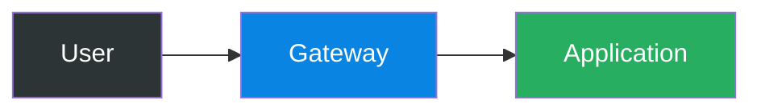
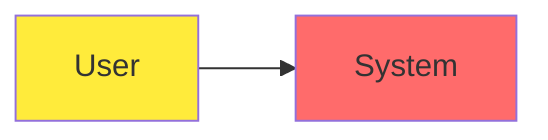
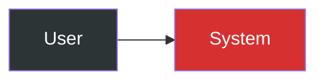

# Accessibility Guidelines for Diagrams and Documentation

## Overview

This document provides accessibility guidelines for creating inclusive documentation and diagrams that can be used by people with various abilities and assistive technologies.

## Color and Contrast Guidelines

### WCAG 2.1 Compliance

All diagrams and visual content should meet **WCAG 2.1 Level AA** standards:

- **Normal text**: Contrast ratio of at least **4.5:1**
- **Large text** (18pt+ or 14pt+ bold): Contrast ratio of at least **3:1**
- **Non-text elements**: Contrast ratio of at least **3:1**

### Approved Color Palette

Use these high-contrast color combinations in Mermaid diagrams:

#### Primary Colors (with white text)
```css
/* Dark backgrounds with white text */
style element fill:#2d3436,color:#ffffff  /* Dark gray */
style element fill:#0984e3,color:#ffffff  /* Blue */
style element fill:#d63031,color:#ffffff  /* Red */
style element fill:#27ae60,color:#ffffff  /* Green */
style element fill:#8e44ad,color:#ffffff  /* Purple */
style element fill:#c0392b,color:#ffffff  /* Dark red */
style element fill:#d35400,color:#ffffff  /* Orange */
style element fill:#e84393,color:#ffffff  /* Pink */
```

#### Secondary Colors (with black text)
```css
/* Light backgrounds with black text */
style element fill:#00cec9,color:#000000  /* Teal */
style element fill:#f39c12,color:#000000  /* Yellow */
style element fill:#fdcb6e,color:#000000  /* Light orange */
style element fill:#a29bfe,color:#000000  /* Light purple */
```

### ❌ Colors to Avoid

These colors have poor contrast and should not be used:

```css
/* Poor contrast examples - DO NOT USE */
style element fill:#ffeb3b        /* Bright yellow */
style element fill:#ff6b6b        /* Light red */
style element fill:#51cf66        /* Light green */
style element fill:#90EE90        /* Light green */
style element fill:#FFE4B5        /* Light beige */
style element fill:#4ecdc4        /* Light teal */
style element fill:#00ADD8        /* Light blue */
```

## Mermaid Diagram Best Practices

### 1. Always Specify Text Color

**❌ Bad:**
```mermaid
style A fill:#0984e3
```

**✅ Good:**
```mermaid
style A fill:#0984e3,color:#ffffff
```

### 2. Use Semantic Color Coding

| Purpose | Recommended Color | Usage |
|---------|-------------------|--------|
| **Security Zones** | `#d63031,color:#ffffff` (red) | DMZ, untrusted zones |
| **Safe/Internal** | `#27ae60,color:#ffffff` (green) | Internal networks, approved |
| **Processing** | `#0984e3,color:#ffffff` (blue) | Services, applications |
| **Data/Storage** | `#8e44ad,color:#ffffff` (purple) | Databases, storage |
| **External** | `#2d3436,color:#ffffff` (dark gray) | Internet, external systems |
| **Warning/Caution** | `#f39c12,color:#000000` (yellow) | Attention items |

### 3. Provide Text Alternatives

For complex diagrams, include:

- **Alt text descriptions** in markdown
- **Table summaries** of diagram content
- **Text-based explanations** of relationships

**Example:**
```markdown


**Diagram Description:** This flow shows a user connecting through a gateway to reach an application. The user (dark gray) connects to the gateway (blue), which then forwards requests to the application (green).
```

### 4. Test Your Colors

Use online contrast checkers:
- [WebAIM Contrast Checker](https://webaim.org/resources/contrastchecker/)
- [Colour Contrast Analyser](https://www.tpgi.com/color-contrast-checker/)

## Screen Reader Considerations

### 1. Meaningful Link Text

**❌ Bad:**
```markdown
Click [here](./security.md) for security info.
```

**✅ Good:**
```markdown
See [Security Architecture Guidelines](./security.md) for detailed implementation patterns.
```

### 2. Descriptive Headings

Use clear, hierarchical headings that describe content:

```markdown
# 6.3 Network Security Architecture
## 6.3.1 DMZ Implementation Patterns  
### Single Firewall Architecture
### Dual Firewall Architecture
```

### 3. Table Headers

Always use proper table headers:

```markdown
| Component | Purpose | Security Level |
|-----------|---------|----------------|
| DMZ | Public services | Medium |
| Internal | Private resources | High |
```

## Testing Checklist

Before publishing documentation, verify:

- [ ] All diagram colors meet 4.5:1 contrast ratio
- [ ] Text colors are explicitly specified in Mermaid diagrams
- [ ] Complex diagrams have text descriptions
- [ ] Headings follow logical hierarchy (H1 > H2 > H3)
- [ ] Links have descriptive text
- [ ] Tables include proper headers
- [ ] Content is readable when colors are removed

## Tools and Resources

### Color Testing Tools
- **Browser Extensions:** axe DevTools, WAVE
- **Online Checkers:** WebAIM, Colour Contrast Analyser
- **Design Tools:** Stark (Figma/Sketch plugin)

### Screen Reader Testing
- **Windows:** NVDA (free), JAWS
- **macOS:** VoiceOver (built-in)
- **Linux:** Orca

## Reporting Issues

If you find accessibility issues in the documentation:

1. Create an issue with the label `accessibility`
2. Include:
   - File path and line number
   - Description of the issue
   - Suggested fix (if known)
   - Tools used to identify the issue

## Examples of Accessible Diagrams

### Before (Poor Contrast):


### After (Good Contrast):


**Description:** User connects to system. User represented in dark gray, system in red indicating security boundary.

---

## References

- [WCAG 2.1 Guidelines](https://www.w3.org/WAI/WCAG21/quickref/)
- [Microsoft Inclusive Design](https://inclusive.microsoft.design/)
- [Web Accessibility Initiative (WAI)](https://www.w3.org/WAI/)
- [Section 508 Compliance](https://www.section508.gov/)