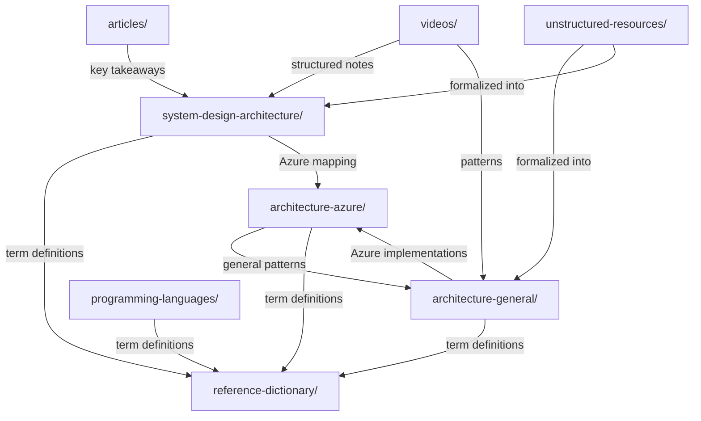

# GitHub Copilot Instructions - Azure Learning Repository

> **Repository Type**: Technical documentation repository with supporting automation tooling  
> **Focus**: Cloud architecture, software engineering patterns, programming languages (.NET, C#), system design, and AI/agentic systems  
> **OKF Conformance**: This repository follows [Open Knowledge Format (OKF) v0.1](https://github.com/GoogleCloudPlatform/knowledge-catalog/blob/main/okf/SPEC.md) — all concept `.md` files carry YAML frontmatter with a `type` field; directory listings use `index.md`

## Repository Structure

```
azure_learning/
├── architecture-azure/           # Azure-specific services & patterns (Physical/Implementation layer)
│   ├── compute/                  # AKS, App Service, Functions, VMs, Container Apps, HPC
│   ├── data/                     # SQL, Cosmos DB, PostgreSQL, Redis, Data Factory
│   ├── networking/               # Virtual WAN, Firewall, Load Balancing, Front Door
│   ├── security/                 # Entra ID, Key Vault, RBAC, Bastion
│   ├── integration/              # Event Hubs, Service Bus, Event Grid, Logic Apps
│   ├── observability/            # Application Insights, Azure Monitor
│   ├── governance/               # Policy, Lighthouse, Resource Management
│   ├── container-registry/       # Azure Container Registry
│   ├── migration/                # Azure Migrate & Resource Mover
│   ├── cost-management/          # Cost optimization & Hybrid Benefit
│   └── devops/                   # ARM templates, Bicep, IaC
│
├── architecture-general/         # Cloud-agnostic patterns (Conceptual/Logical layer)
│   ├── 01-enterprise-strategic-architecture/
│   ├── 02-application-software-architecture/  # DDD, CQRS, Event Sourcing, language selection
│   ├── 03-integration-communication-architecture/  # Event-driven, messaging, pub/sub
│   ├── 04-data-analytics-ai-architecture/
│   ├── 05-cloud-infrastructure-platform-architecture/  # Hub-spoke, networking patterns
│   ├── 06-security-architecture/       # Zero Trust, IAM, encryption
│   ├── 07-reliability-performance-operations/  # Observability, RPO/RTO, metrics
│   ├── 08-devops-delivery-runtime-architecture/
│   ├── 09-industry-specialized-architectures/
│   ├── 10-practicality-taxonomy/       # **Canonical taxonomy reference** (auto-generated)
│   ├── 11-architectural-qualities/     # Non-functional requirements & qualities
│   └── 12-ai-applications/             # AI application patterns
│
├── system-design-architecture/   # Concrete system-design problems with solution strategies,
│   ├── databases/               # db-: query performance, SQL optimization, DB decisions
│   ├── concurrency-transactions/ # tx-: double-booking, isolation, idempotency, causal consistency
│   ├── caching/                  # cache-: stampede prevention, Redis internals, hot-key mitigation
│   ├── api-network/              # api-, gw-, apipat-: API design, rate limiting, reverse proxy, gateway
│   ├── messaging/                # broker-, iggy-: Kafka patterns, offset commits, real-time messaging
│   ├── resilience/               # resilience-, cb-: circuit breakers, outages, defensive coding
│   ├── agentic-ai/               # agentic-, agentarch-, aidev-, harness-: multi-agent, loops, accountability
│   ├── cqrs-fintech/             # cqrs-: command/query separation, payment systems, gateways
│   ├── jvm-runtime/              # jvm-: memory/GC, Java vs Go thread model
│   ├── performance/              # perf-: microservices runtime, language selection tradeoffs
│   ├── security/                 # hsm-, auth-: HSM bottlenecks, authentication/authorization
│   ├── system-design-interview/  # sdi-, prag-: interview roadmaps, pragmatic design
│   ├── software-architecture/    # dp-, arch-, svc-, docker-: design patterns, principles, service design
│   ├── case-studies/             # uber-, feed-, url-, mesh-: real-world architecture case studies
│   ├── stream-processing/        # async-, flink-: Flink fundamentals, async concurrency
│   ├── ai-ml-infrastructure/     # ai-: RAG architecture, LLM optimization, vector search
│   ├── media-processing/         # media-: chunk splitting, parallel transcoding
│   ├── large-data-processing/    # proc-: streaming, checkpointing, backpressure
│   └── azure-service-mapping/    # Problem domain → Azure service quick lookup
│                                  # Each subdirectory has its own index.md for domain-level navigation
│
├── reference-dictionary/         # Repo-root technical glossary (single source of truth for all terms)
│                                  # Each file = one domain; each term = stable anchor for direct linking
│
├── programming-languages/        # Programming languages and their ecosystems
│   └── csharp/                   # C# language
│       └── dotnet-multi-threading/  # .NET concurrency patterns (TAP, EAP, APM, sync primitives)
│
├── articles/                     # Source articles organized by domain
│   ├── databases/                # Query optimization, PostgreSQL, SQL design
│   ├── messaging/                # Kafka patterns, offset strategies, distributed log
│   ├── agentic-ai/               # Multi-agent, loops, harness, accountability
│   ├── system-design-interview/  # Roadmaps, scenario questions, interview prep
│   ├── case-studies/             # Uber, data mesh, URL shortener, news feed
│   ├── software-architecture/    # Design patterns, architecture principles, Docker
│   ├── api-network/              # API design, rate limiting, deprecation
│   ├── caching/                  # Redis internals, hot-key workloads
│   ├── cqrs-fintech/             # Payment systems, CQRS, gateways
│   ├── concurrency-transactions/ # Double-booking, causal consistency
│   ├── performance/              # Java/Go/Rust benchmarks
│   ├── resilience/               # Circuit breakers, outages, defensive coding
│   ├── security/                 # HSM bottlenecks, authentication
│   ├── stream-processing/        # Flink, async patterns
│   └── jvm-runtime/              # JVM memory internals
│
├── videos/                       # Video-based learning resources with structured notes
│
├── site-reliability-engineering/ # SRE resources, infographics, and unstructured notes
│
├── unstructured-resources/       # Raw/evolving notes before formal placement
│
└── scripts/                      # Taxonomy sync automation (Python, no dependencies)
```

### Directory Purposes

| Directory | Purpose | Content Type | Cross-References To |
|:---|:---|:---|:---|
| `architecture-azure/` | Azure service deep-dives, tier comparisons, implementation patterns | Service docs, comparison tables, how-tos | `architecture-general/` (patterns), `reference-dictionary/` (terms) |
| `architecture-general/` | Cloud-agnostic architectural patterns & taxonomy | Pattern docs, case studies, decision guides | `architecture-azure/` (implementations), `system-design-architecture/` (problems) |
| `system-design-architecture/` | System design problems mapped to strategies with ID-based references | Problem→strategy→tradeoff analyses with source references | `articles/` (sources), `reference-dictionary/` (terms), `architecture-azure/` (services) |
| `reference-dictionary/` | Single-source glossary for ALL technical terms across the repo | Domain-specific term definitions with anchors | Used by ALL other directories |
| `programming-languages/` | Programming language ecosystems, patterns & concurrency | Language-specific docs, best practices, concurrency patterns | `reference-dictionary/dotnet-multithreading.md` |
| `articles/` | Original source material | Saved articles organized by domain | Upstream source for `system-design-architecture/` takeaways |
| `videos/` | Video-based learning notes | Structured notes with timestamps & key points | `architecture-general/`, `system-design-architecture/` |
| `site-reliability-engineering/` | SRE practices & infographics | Reference links, visual resources | `architecture-general/07-reliability-performance-operations/` |
| `unstructured-resources/` | Raw notes, evolving ideas | Unstructured drafts before formal placement | — (incubator zone) |
| `scripts/` | Automation tooling | Python scripts (taxonomy sync, hooks) | — (tooling) |

### Subdirectory Instructions

Before contributing to a directory, consult the table below for its specific instructions file or fallback checklist:

| Directory | Instructions File | Fallback |
|:---|:---|:---|
| `architecture-azure/` | [`../architecture-azure/.copilot-instructions.md`](../architecture-azure/.copilot-instructions.md) | — |
| `architecture-general/` | [`../architecture-general/.copilot-instructions.md`](../architecture-general/.copilot-instructions.md) | — |
| `system-design-architecture/` | — | Use the directory-specific checklist in this file |
| `reference-dictionary/` | — | Use the directory-specific checklist in this file |
| `programming-languages/` | — | Use the directory-specific checklist in this file |
| `articles/` | — | Use the directory-specific checklist in this file |
| `videos/` | — | Use the directory-specific checklist in this file |
| `site-reliability-engineering/` | — | Use the directory-specific checklist in this file |
| `unstructured-resources/` | — | Use the directory-specific checklist in this file |
| `scripts/` | — | Use the directory-specific checklist in this file |

## Content Placement (Routing Rule)

**Routing is decided first; taxonomy references are added only after routing succeeds.**

Use this two-stage classifier to determine where content belongs:

### Stage 1 — Classify by Content Type

| Primary Content Type | Destination |
|:---|:---|
| Azure service specifics (tiers, implementation patterns tied to Azure) | `architecture-azure/` |
| Programming language syntax, runtime, framework, or concurrency model | `programming-languages/<language>/` |
| System-design problem with solution strategy + trade-offs + source reference | `system-design-architecture/` |
| Term definition or glossary entry | `reference-dictionary/` |
| Reusable architectural pattern, decision guide, or case study | `architecture-general/` |
| Source article | `articles/<domain>/` |
| Video note | `videos/` |
| Raw or evolving note | `unstructured-resources/` |

### Stage 2 — Resolve Ambiguity

1. **Identify the primary topic** from the title and first heading only — do not infer it from body text.
2. **If the title and first heading disagree or are missing**: Stop and ask the user "Which topic should this file focus on?"
3. **Route to the single destination** that matches the primary topic (see Stage 1 table).

**Exception rules** (apply after routing is decided):
- Programming-language paths are for language-specific topics only. Do not use them for general cloud architecture or cross-language patterns that happen to include code examples.
- `system-design-architecture/` requires a concrete problem, solution strategy, trade-offs, and at least one source reference. A source reference must be a real Markdown link to either an article under `articles/` or an official Microsoft/vendor documentation page — placeholder citations are not allowed. If any required elements are missing, stop and ask for the missing information. Do not place hypothetical, interview-style, or training-only problem statements here — route those to `unstructured-resources/`.
- `architecture-general/` is for content that is complete, reviewed, and ready for publication. Treat drafts, outlines, raw notes, and unfinished ideas as `unstructured-resources/` unless the user explicitly asks to refine them first. If the user asks to place unfinished material directly in `architecture-general/`, ask whether to move it to `unstructured-resources/` first or to revise it into a finished draft.
- If a term could belong to more than one domain file in `reference-dictionary/`, stop and ask the user which domain to use. Do not choose by intuition or by the first matching keyword. If you are unsure whether a term belongs to more than one domain, stop and ask the user to confirm.
- If the content covers two or more distinct main topics, create one file per main topic with a "Related topics" cross-reference section linking the other files. Do not combine unrelated topics into a single file.
- If a requested destination path does not exist or is outside the standard repository directories listed in this file, stop and ask the user to choose an existing directory. Do not create new top-level folders without confirmation.
- If the user names more than one possible destination path and the content could fit both, ask the user to choose the primary destination before making any changes; do not choose by convenience or by the first matching path.
- If the user does not specify any destination directory, stop and ask which existing directory the content should go to. Do not choose a destination from context alone.

## Taxonomy Alignment

**Taxonomy alignment is required for `architecture-general/` and `system-design-architecture/` files.** Files under `articles/`, `videos/`, and `unstructured-resources/` may omit taxonomy references unless the user explicitly asks for them.

All taxonomy-aligned content must reference the [Architecture Taxonomy](../architecture-general/10-practicality-taxonomy/architecture_taxonomy_reference.md).

- Reference taxonomy sections using `§X.X` format: `> **Taxonomy Reference**: §3.3 Event-Driven & Messaging`
- The taxonomy file is **auto-generated** — never edit it directly

**Taxonomy section selection procedure** (apply in order):

1. **If the taxonomy reference file is missing or unreadable**: Stop and report the exact missing path. Ask the user whether to continue without taxonomy alignment or to provide the file first. Do not choose a closest-match taxonomy section in this case.
2. **If the relevant taxonomy section is clearly identifiable in the reference**: Use it.
3. **If the relevant section is missing from the reference or is stale**: Do not invent a `§X.X` reference. Use an exact section title match if one exists. If no exact title match exists, ask the user to confirm one of the closest matching sections. Do not use a fuzzy match without confirmation.
4. **If two or more sections have the same highest normalized match score**: Stop and ask the user to confirm the intended section. Do not infer a tie-breaker from intuition.

**Default**: If the taxonomy file is unavailable, stop and ask the user before proceeding. If no exact match exists in the file, ask the user to confirm the closest match rather than guessing.

## Automation

### Taxonomy Sync (run after editing any `architecture-general/**/index.md`)

```bash
python scripts/sync_taxonomy_reference.py          # Regenerate
python scripts/sync_taxonomy_reference.py --check   # CI check (exit 1 if stale)
python scripts/sync_taxonomy_reference.py --dry-run  # Preview
```

- GitHub Actions validates sync on PRs (`.github/workflows/sync-taxonomy.yml`)
- Optional pre-commit hook: `cp scripts/hooks/pre-commit-taxonomy-check.sh .git/hooks/pre-commit && chmod +x .git/hooks/pre-commit`

### OKF Validation (run after any content change)

```bash
python scripts/okf_migrate.py --check     # Validate OKF conformance
python scripts/okf_migrate.py --dry-run   # Preview frontmatter changes
python scripts/okf_migrate.py             # Apply frontmatter to new files
```

### OKF Agent Tools (bundle introspection)

```bash
python3 agent_tools/okf_tools.py validate      # Validate OKF conformance
python3 agent_tools/okf_tools.py search <kw>   # Search concepts by keyword
python3 agent_tools/okf_tools.py check-links   # Check cross-reference integrity
python3 agent_tools/okf_tools.py stats         # Bundle statistics (JSON)
python3 agent_tools/okf_tools.py graph         # Export relationship graph (JSON)
```

See [`agent_tools/README.md`](../agent_tools/README.md) for the full OKF agent guide.

## Content Standards

- Proper heading hierarchy (H1 → H2 → H3)
- TOC for documents >200 lines
- Comparison tables for alternatives
- Code blocks with language tags
- Mermaid diagrams for architecture visualizations
- Reference official Microsoft/vendor documentation
- Include practical examples and case studies
- **Accessibility**: Follow [accessibility guidelines](accessibility-guidelines.md) for diagrams (WCAG 2.1 AA contrast, approved color palette)
- **Citations**: For every source reference, use a real Markdown link to either an article under `articles/` or an official Microsoft/vendor documentation page. Do not invent citations, article titles, or URLs. If a cited source link is broken, missing, or inaccessible, stop and ask the user for a valid replacement link instead of substituting another citation. If the supplied citation is not a valid Markdown link or cannot be resolved to an existing article or official documentation page, stop and ask the user for a valid link before proceeding.

## Cross-References

### Primary Cross-Reference Patterns

| Direction | Pattern | Example |
|:---|:---|:---|
| General → Azure | `> **Azure Implementation**: See [Service Name](../architecture-azure/category/service/)` | `> **Azure Implementation**: See [Event Hubs](../architecture-azure/integration/event-hubs/)` |
| Azure → General | `> **General Pattern**: [Pattern Name](../architecture-general/section/)`<br>`> **Taxonomy**: §X.X Section Name` | `> **Taxonomy**: §3.3 Event-Driven & Messaging` |
| Any → Dictionary | `[Term Name](../reference-dictionary/domain-file.md#anchor)` | `[Circuit Breaker](../reference-dictionary/resilience.md#circuit-breaker)` |
| System Design → Article | `> **Source**: [Article Title](../articles/domain/article/)` | `> **Source**: [Circuit Breaker](../articles/resilience/your-circuit-breaker-lying-to-you.md)` |
| System Design → Azure | `> **Azure Services**: [Service](../architecture-azure/category/service/)` | `> **Azure Services**: [Cosmos DB](../architecture-azure/data/databases/cosmos-db/)` |

### Cross-Reference Map (How Directories Interlink)



## Naming Conventions

- **Files**: kebab-case — `azure-event-hubs-tiers.md`
- **Directories**: kebab-case — `event-hubs/`, `service-bus/`
- **Headings**: Title Case for H1, Sentence case for others
- **System Design IDs**: Domain-prefixed — `db-01`, `tx-03`, `cache-02`, `resilience-05`, `agentic-01`
- **Dictionary Anchors**: Lowercase hyphenated — `#circuit-breaker`, `#rate-limiting`, `#acid-transactions`

## Adding New Content

1. **Determine location** using content placement tree above
2. **Check taxonomy alignment** — which `§X.X` section? (required for `architecture-general/`)
3. **Use templates** from subdirectory `.copilot-instructions.md` files (service doc, comparison, case study)
   - If a referenced `.copilot-instructions.md` file is missing or unreadable, report the missing path and do not guess at the required format or placement
   - If the taxonomy reference file is missing or unreadable, apply the taxonomy section selection procedure (step 1) under Taxonomy Alignment above
4. **Add cross-references** to related content:
   - Link terms to `reference-dictionary/` definitions
   - Link patterns to Azure implementations (and vice versa)
   - Link system-design strategies to their source articles
5. **Update parent index.md** with link to new doc — if the target file already exists, update it in place rather than creating a duplicate; only add a new entry when the file is newly created
6. **Run taxonomy sync** if you modified any `architecture-general/**/index.md`
7. **Moving or renaming existing content**: If the user asks to move, rename, or reclassify an existing file, update the existing file in place, remove or redirect the old path, and do not create duplicate copies unless the user explicitly asks for a duplicate

### Directory-Specific Checklist

| Directory | Checklist |
|:---|:---|
| `architecture-azure/` | Service overview → Tiers → Best practices → Cross-ref to general pattern + dictionary |
| `architecture-general/` | Align with taxonomy §X.X → Cross-ref to Azure impl → Link terms to dictionary |
| `system-design-architecture/` | Domain-prefixed ID → Problem → Strategy → Tradeoff → Source article → JSON summary block → Cross-ref to Azure services + dictionary |
| `reference-dictionary/` | Term anchor → Definition → Key characteristics → When to use / When NOT → Also See |
| `programming-languages/` | Language overview → Code examples → Best practices → Cross-ref to dictionary |
| `articles/` | Save original article → Later extracted into `system-design-architecture/` |
| `videos/` | Source link → Timestamped notes → Key takeaways → Cross-ref to relevant patterns |
