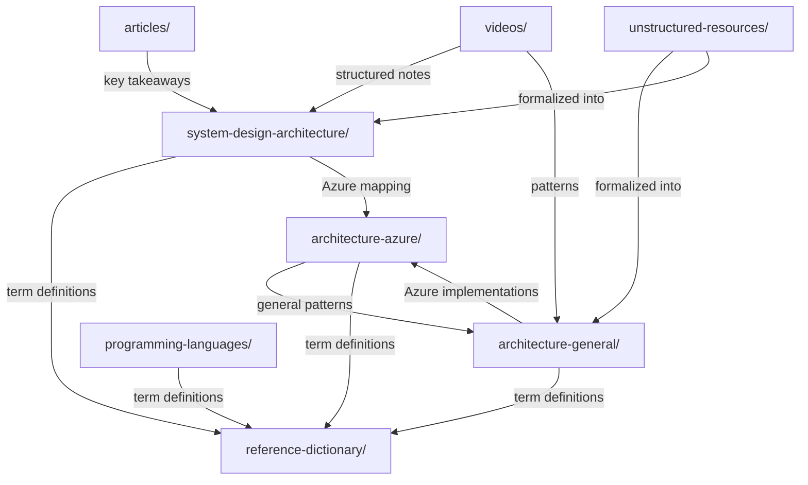

# GitHub Copilot Instructions - Azure Learning Repository

> **Repository Type**: Technical documentation repository with supporting automation tooling  
> **Focus**: Cloud architecture, software engineering patterns, programming languages (.NET, C#), system design, and AI/agentic systems

## Repository Structure

```
azure_learning/
├── architecture-azure/           # Azure-specific services & patterns (Physical/Implementation layer)
│   ├── compute/                  # AKS, App Service, Functions, VMs, Container Apps, HPC
│   ├── data/                     # SQL, Cosmos DB, PostgreSQL, Redis, Data Factory
│   ├── networking/               # Virtual WAN, Firewall, Load Balancing, Front Door
│   ├── security/                 # Entra ID, Key Vault, RBAC, Bastion
│   ├── integration/              # Event Hubs, Service Bus, Event Grid, Logic Apps
│   ├── observability/            # Application Insights, Azure Monitor
│   ├── governance/               # Policy, Lighthouse, Resource Management
│   ├── container-registry/       # Azure Container Registry
│   ├── migration/                # Azure Migrate & Resource Mover
│   ├── cost-management/          # Cost optimization & Hybrid Benefit
│   └── devops/                   # ARM templates, Bicep, IaC
│
├── architecture-general/         # Cloud-agnostic patterns (Conceptual/Logical layer)
│   ├── 01-enterprise-strategic-architecture/
│   ├── 02-application-software-architecture/  # DDD, CQRS, Event Sourcing, language selection
│   ├── 03-integration-communication-architecture/  # Event-driven, messaging, pub/sub
│   ├── 04-data-analytics-ai-architecture/
│   ├── 05-cloud-infrastructure-platform-architecture/  # Hub-spoke, networking patterns
│   ├── 06-security-architecture/       # Zero Trust, IAM, encryption
│   ├── 07-reliability-performance-operations/  # Observability, RPO/RTO, metrics
│   ├── 08-devops-delivery-runtime-architecture/
│   ├── 09-industry-specialized-architectures/
│   ├── 10-practicality-taxonomy/       # **Canonical taxonomy reference** (auto-generated)
│   ├── 11-architectural-qualities/     # Non-functional requirements & qualities
│   └── 12-ai-applications/             # AI application patterns
│
├── system-design-architecture/   # System design interview: problem → strategy reference
│                                  # Structured key takeaways from articles, with ID-based cross-refs
│
├── reference-dictionary/         # Repo-root technical glossary (single source of truth for all terms)
│                                  # Each file = one domain; each term = stable anchor for direct linking
│
├── programming-languages/        # Programming languages and their ecosystems
│   └── csharp/                   # C# language
│       └── dotnet-multi-threading/  # .NET concurrency patterns (TAP, EAP, APM, sync primitives)
│
├── articles/                     # Source articles organized by platform
│   ├── medium/                   # Medium.com articles (primary source for system-design-architecture/)
│   ├── linkedin/                 # LinkedIn articles
│   ├── personal-blogs/           # Personal/independent blog posts
│   └── substack/                 # Substack articles
│
├── videos/                       # Video-based learning resources with structured notes
│
├── site-reliability-engineering/ # SRE resources, infographics, and unstructured notes
│
├── unstructured-resources/       # Raw/evolving notes before formal placement
│
└── scripts/                      # Taxonomy sync automation (Python, no dependencies)
```

### Directory Purposes

| Directory | Purpose | Content Type | Cross-References To |
|:---|:---|:---|:---|
| `architecture-azure/` | Azure service deep-dives, tier comparisons, implementation patterns | Service docs, comparison tables, how-tos | `architecture-general/` (patterns), `reference-dictionary/` (terms) |
| `architecture-general/` | Cloud-agnostic architectural patterns & taxonomy | Pattern docs, case studies, decision guides | `architecture-azure/` (implementations), `system-design-architecture/` (problems) |
| `system-design-architecture/` | System design problems mapped to strategies with ID-based references | Problem→strategy docs, key takeaways | `articles/` (sources), `reference-dictionary/` (terms), `architecture-azure/` (services) |
| `reference-dictionary/` | Single-source glossary for ALL technical terms across the repo | Domain-specific term definitions with anchors | Used by ALL other directories |
| `programming-languages/` | Programming language ecosystems, patterns & concurrency | Language-specific docs, best practices, concurrency patterns | `reference-dictionary/dotnet-multithreading.md` |
| `articles/` | Original source material | Saved articles organized by platform | Upstream source for `system-design-architecture/` takeaways |
| `videos/` | Video-based learning notes | Structured notes with timestamps & key points | `architecture-general/`, `system-design-architecture/` |
| `site-reliability-engineering/` | SRE practices & infographics | Reference links, visual resources | `architecture-general/07-reliability-performance-operations/` |
| `unstructured-resources/` | Raw notes, evolving ideas | Unstructured drafts before formal placement | — (incubator zone) |
| `scripts/` | Automation tooling | Python scripts (taxonomy sync, hooks) | — (tooling) |

### Subdirectory Instructions

Before contributing to `architecture-azure/`, `architecture-general/`, `system-design-architecture/`, `reference-dictionary/`, `programming-languages/`, `articles/`, `videos/`, `site-reliability-engineering/`, `unstructured-resources/`, or `scripts/`, read the corresponding `.copilot-instructions.md` file if one exists; otherwise use the directory-specific checklist in this file:
- [`architecture-azure/.copilot-instructions.md`](../architecture-azure/.copilot-instructions.md) — Azure service docs, tier comparisons, templates
- [`architecture-general/.copilot-instructions.md`](../architecture-general/.copilot-instructions.md) — Taxonomy alignment rules, pattern templates

## Content Placement

```
Is it Azure-specific?
  ├─ YES → architecture-azure/  (compute/, data/, networking/, security/, integration/, etc.)
  └─ NO → Is it programming language specific (concurrency, patterns, ecosystem)?
      ├─ YES → programming-languages/<language>/  (e.g., csharp/dotnet-multi-threading/)
      └─ NO → Does it describe a concrete system-design problem with a solution strategy, trade-offs, and at least one source reference?
          ├─ YES → system-design-architecture/  (use domain-prefixed IDs: db-, tx-, cache-, api-, broker-, etc.); do not place general architecture notes or article summaries here
          └─ NO → Is it a term definition or glossary entry?
              ├─ YES → reference-dictionary/  (pick the right domain file, add anchor)
              └─ NO → Is it a source article or raw note?
                  ├─ Source article → articles/<platform>/
                  ├─ Video note → videos/
                  ├─ Raw/evolving note → unstructured-resources/
                  └─ Reusable architectural pattern, decision guide, or case study that maps to one primary taxonomy section (§X.X) → architecture-general/  (do not place drafts, notes, or raw ideas here)
```

## Taxonomy Alignment

**All content MUST align with the [Architecture Taxonomy](../architecture-general/10-practicality-taxonomy/architecture_taxonomy_reference.md)**.

- Reference taxonomy sections using `§X.X` format: `> **Taxonomy Reference**: §3.3 Event-Driven & Messaging`
- The taxonomy file is **auto-generated** — never edit it directly
- When the relevant taxonomy section cannot be identified from the taxonomy reference (e.g., the section is missing or the reference is stale), do not invent a `§X.X` reference. Use the closest existing section that reasonably fits the content and explicitly state the assumption (e.g., "> **Taxonomy Reference**: §3.3 Event-Driven & Messaging — closest match; no exact section exists for X"). If no reasonable match exists, stop and ask the user for clarification

## Automation

### Taxonomy Sync (run after editing any `architecture-general/**/README.md`)

```bash
python scripts/sync_taxonomy_reference.py          # Regenerate
python scripts/sync_taxonomy_reference.py --check   # CI check (exit 1 if stale)
python scripts/sync_taxonomy_reference.py --dry-run  # Preview
```

- GitHub Actions validates sync on PRs (`.github/workflows/sync-taxonomy.yml`)
- Optional pre-commit hook: `cp scripts/hooks/pre-commit-taxonomy-check.sh .git/hooks/pre-commit && chmod +x .git/hooks/pre-commit`

## Content Standards

- Proper heading hierarchy (H1 → H2 → H3)
- TOC for documents >200 lines
- Comparison tables for alternatives
- Code blocks with language tags
- Mermaid diagrams for architecture visualizations
- Reference official Microsoft/vendor documentation
- Include practical examples and case studies
- **Accessibility**: Follow [accessibility guidelines](accessibility-guidelines.md) for diagrams (WCAG 2.1 AA contrast, approved color palette)

## Cross-References

### Primary Cross-Reference Patterns

| Direction | Pattern | Example |
|:---|:---|:---|
| General → Azure | `> **Azure Implementation**: See [Service Name](../architecture-azure/category/service/)` | `> **Azure Implementation**: See [Event Hubs](../architecture-azure/integration/event-hubs/)` |
| Azure → General | `> **General Pattern**: [Pattern Name](../architecture-general/section/)`<br>`> **Taxonomy**: §X.X Section Name` | `> **Taxonomy**: §3.3 Event-Driven & Messaging` |
| Any → Dictionary | `[Term Name](../reference-dictionary/domain-file.md#anchor)` | `[Circuit Breaker](../reference-dictionary/resilience.md#circuit-breaker)` |
| System Design → Article | `> **Source**: [Article Title](../articles/platform/article/)` | `> **Source**: [Circuit Breaker](../articles/medium/your-circuit-breaker-lying-to-you.md)` |
| System Design → Azure | `> **Azure Services**: [Service](../architecture-azure/category/service/)` | `> **Azure Services**: [Cosmos DB](../architecture-azure/data/databases/cosmos-db/)` |

### Cross-Reference Map (How Directories Interlink)



## Naming Conventions

- **Files**: kebab-case — `azure-event-hubs-tiers.md`
- **Directories**: kebab-case — `event-hubs/`, `service-bus/`
- **Headings**: Title Case for H1, Sentence case for others
- **System Design IDs**: Domain-prefixed — `db-01`, `tx-03`, `cache-02`, `resilience-05`, `agentic-01`
- **Dictionary Anchors**: Lowercase hyphenated — `#circuit-breaker`, `#rate-limiting`, `#acid-transactions`

## Adding New Content

1. **Determine location** using content placement tree above
2. **Check taxonomy alignment** — which `§X.X` section? (required for `architecture-general/`)
3. **Use templates** from subdirectory `.copilot-instructions.md` files (service doc, comparison, case study)
   - If a referenced `.copilot-instructions.md` file or the taxonomy reference file is missing or unreadable, report the missing path and do not guess at the required format or placement
4. **Add cross-references** to related content:
   - Link terms to `reference-dictionary/` definitions
   - Link patterns to Azure implementations (and vice versa)
   - Link system-design strategies to their source articles
5. **Update parent README.md** with link to new doc — if the target file already exists, update it in place rather than creating a duplicate; only add a new README entry when the file is newly created
6. **Run taxonomy sync** if you modified any `architecture-general/**/README.md`

### Directory-Specific Checklist

| Directory | Checklist |
|:---|:---|
| `architecture-azure/` | Service overview → Tiers → Best practices → Cross-ref to general pattern + dictionary |
| `architecture-general/` | Align with taxonomy §X.X → Cross-ref to Azure impl → Link terms to dictionary |
| `system-design-architecture/` | Domain-prefixed ID → Problem → Strategy → Tradeoff → Source article → JSON summary block → Cross-ref to Azure services + dictionary |
| `reference-dictionary/` | Term anchor → Definition → Key characteristics → When to use / When NOT → Also See |
| `programming-languages/` | Language overview → Code examples → Best practices → Cross-ref to dictionary |
| `articles/` | Save original article → Later extracted into `system-design-architecture/` |
| `videos/` | Source link → Timestamped notes → Key takeaways → Cross-ref to relevant patterns |
