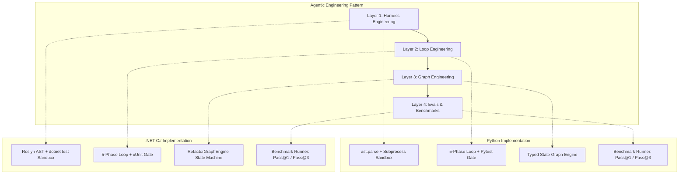

# AI-Powered Engineering Catalog: Dual-Stack Agentic Architecture

> **Domain**: Agentic Software Engineering, Stochasticity Mitigation, Harness/Loop/Graph Engineering, Evals.  
> **Implementations**:
> - [Python Solution (`ai-powered-engineering/python/`)](python/README.md)
> - [.NET Solution (`ai-powered-engineering/dotnet/`)](dotnet/README.md)

---

## 1. The Core Engineering Challenge

Development using LLMs and agents is **stochastic** (probabilistic) rather than **deterministic**. Without structured engineering boundaries, models hallucinate syntax, introduce silent regressions, and burn token budgets in runaway loops.

To overcome this, we implement the **Four Layers of Agentic Engineering** across both modern enterprise stacks: **Python** and **.NET (C#)**.

---

## 2. Side-by-Side Dual-Stack Architecture



### Component Comparison Matrix

| Layer | Concept | Python Implementation | .NET / C# Implementation |
|:---|:---|:---|:---|
| **1. Harness** | **AST Syntax Gate** | `ast.parse(code)` | Roslyn `CSharpSyntaxTree.ParseText(code)` |
| **1. Harness** | **Diff Sanity** | `difflib.unified_diff()` | Roslyn line-retention analysis |
| **1. Harness** | **Isolated Sandbox** | Ephemeral directory + `pytest` subprocess | Ephemeral directory + `dotnet test` subprocess |
| **1. Harness** | **Anti-Rot Context** | Pytest failure traceback extractor | xUnit / MSBuild assertion extractor |
| **2. Loop** | **Deterministic Verify Gate** | `VerifyGate` (AST + Pytest) | `VerifyGate` (Roslyn + xUnit) |
| **2. Loop** | **Maker / Checker** | `MockMaker` / `HeuristicMaker` / `RuleBasedChecker` | `IMakerAgent` / `HeuristicMakerAgent` / `RuleBasedCheckerAgent` |
| **2. Loop** | **Finite Budget** | Max 3 iterations $\rightarrow$ Escalate | Max 3 iterations $\rightarrow$ Escalate |
| **3. Graph** | **Control Flow** | `RefactorGraphEngine` state transitions | `RefactorGraphEngine` state transitions |
| **3. Graph** | **Execution Tracing** | Step index, phase, duration ms | `GraphStepTrace` with stopwatch ms |
| **4. Evals** | **Benchmark Runner** | `benchmarks/runner.py` | `PatchMaster.Benchmarks` console app |
| **4. Evals** | **Metrics** | Pass@1: 100%, Pass@3: 100% | Pass@1: 100%, Pass@3: 100% |

---

## 3. Directory Navigation

```
ai-powered-engineering/
├── intent.md                          # Original learning intent and goals
├── README.md                          # This dual-stack catalog
├── python/                            # Complete Python implementation
│   ├── README.md                      # Python architecture & run guide
│   ├── pyproject.toml                 # Package & pyright config
│   ├── requirements.txt               # Dependencies (pydantic, pytest)
│   ├── src/                           # Harness, Loop, Graph, Agents, CLI
│   ├── tests/                         # 11 unit tests (100% passing)
│   └── benchmarks/                    # 4 benchmark fixtures & evaluation runner
└── dotnet/                            # Complete .NET 8 / 10 implementation
    ├── README.md                      # .NET architecture & run guide
    ├── PatchMaster.sln                # Visual Studio / dotnet solution
    ├── src/                           # Core, Harness, Agents, Loop, Graph, CLI
    ├── tests/                         # 9 xUnit unit tests (100% passing)
    └── benchmarks/                    # 4 C# benchmark fixtures & evaluation runner
└── apps/
    └── AuditGuard/                    # Agent-Powered Business Application (.NET 8)
        ├── README.md                  # Autonomous Expense Audit Microservice
        ├── AuditGuard.slnx            # Solution file
        ├── src/                       # Core, Harness, Loop, Agents, Graph, CLI
        ├── tests/                     # 12 xUnit unit tests (100% passing)
        └── benchmarks/                # 6 real-world benchmark fixtures & evaluation runner
    └── TaskPilot/                     # Standalone Business Application (.NET 8/10)
        ├── README.md                  # Standalone Task & Workflow Management App
        ├── TaskPilot.sln              # Solution file (Zero Agent Dependencies)
        ├── src/                       # Core, Infrastructure, Services, Cli
        └── tests/                     # 13 xUnit unit tests (100% passing)
```

---

## 4. Quick Execution Guide

### Run Python PatchMaster Solution
```bash
cd ai-powered-engineering/python
source .venv/bin/activate

# 1. Run unit tests
pytest tests -v

# 2. Run benchmark evaluation suite
python benchmarks/runner.py
```

### Run .NET PatchMaster Solution
```bash
cd ai-powered-engineering/dotnet

# 1. Run unit tests
dotnet test tests/PatchMaster.Tests

# 2. Run benchmark evaluation suite
dotnet run --project benchmarks/PatchMaster.Benchmarks
```

### Run .NET AuditGuard (Agent-Powered App)
```bash
cd ai-powered-engineering/apps/AuditGuard

# 1. Run unit tests
dotnet test

# 2. Run benchmark evaluation suite
dotnet run --project benchmarks/AuditGuard.Benchmarks

# 3. Run interactive audit CLI
dotnet run --project src/AuditGuard.Cli -- --sample
```

### Run .NET TaskPilot (Standalone App)
```bash
cd ai-powered-engineering/apps/TaskPilot

# 1. Run unit tests
dotnet test

# 2. Run standalone CLI
dotnet run --project src/TaskPilot.Cli -- seed
dotnet run --project src/TaskPilot.Cli -- list
dotnet run --project src/TaskPilot.Cli -- summary
```


