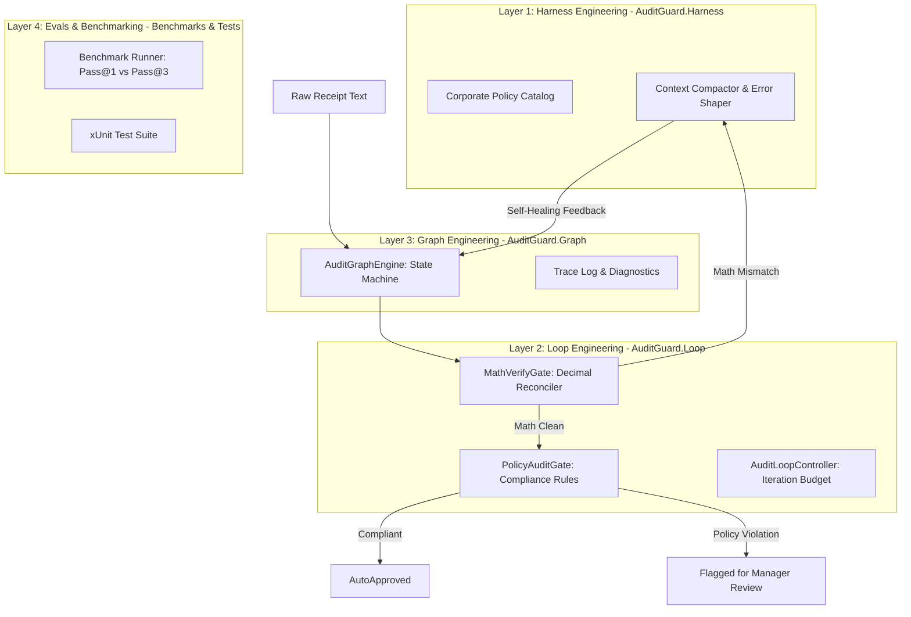

# AuditGuard: Autonomous Expense & Invoice Audit Microservice

> **Architecture**: .NET 8 / C# Enterprise Microservice  
> **Pattern**: 4-Layer Agentic Engineering (Harness → Loop → Graph → Evals)  
> **Domain**: Fintech, Accounts Payable, Automated Expense Compliance, Stochasticity Mitigation  

---

## 1. Problem Statement

When enterprises use Large Language Models (LLMs) or multi-modal OCR to process expense receipts and invoices, they encounter two primary failure modes caused by model stochasticity:

1. **Mathematical Hallucinations**: LLMs struggle with multi-line decimal arithmetic, frequently hallucinating subtotals, rounding errors, or failing to reconcile `LineItems.Sum() == Subtotal` and `Subtotal + Tax + Tip == GrandTotal`.
2. **Policy Drift & Compliance Slips**: Probabilistic agents miss fine-grained corporate expense constraints (e.g., alcohol prohibitions, single-meal limits, unapproved weekend travel, excessive gratuities, or expenses exceeding auto-approval ceilings).

**AuditGuard** solves this by wrapping probabilistic extraction inside a deterministic 4-layer architecture that self-heals mathematical discrepancies and guarantees policy enforcement.

---

## 2. The 4-Layer Architecture in AuditGuard



### Layer 1: Harness Engineering (`AuditGuard.Harness`)
- **`PolicyCatalog.cs`**: Single source of truth for corporate limits ($500 ceiling, $75 single meal cap, alcohol keyword dictionary, 25% tip threshold, weekend audit rules).
- **`ContextCompactor.cs`**: Formats deterministic feedback with exact arithmetic deltas (`Subtotal delta: $5.00`), allowing downstream models to pinpoint discrepancies without hallucinating new values.

### Layer 2: Loop Engineering (`AuditGuard.Loop`)
- **`MathVerifyGate.cs`**: Strict zero-tolerance gate verifying:
  $$\sum \text{LineItems} = \text{Subtotal}$$
  $$\text{Subtotal} + \text{Tax} + \text{Tip} = \text{GrandTotal}$$
- **`PolicyAuditGate.cs`**: Deterministic rule checker flagging `ALCOHOL_PROHIBITION`, `HIGH_VALUE_THRESHOLD`, `MEAL_LIMIT_EXCEEDED`, `WEEKEND_EXPENSE`, and `EXCESSIVE_TIP`.
- **`AuditLoopController.cs`**: Manages step transitions, retry budgets (max 3 iterations), and state mutations.

### Layer 3: Graph Engineering (`AuditGuard.Graph`)
- **`AuditGraphEngine.cs`**: Directed state machine routing:
  $$\text{Ingest} \rightarrow \text{Extract} \rightarrow \text{VerifyMath} \xrightarrow{\text{Passed}} \text{AuditPolicy} \rightarrow \text{Reconcile} \rightarrow \text{Terminal}$$
  - If math fails: loops back to `Extract` with diagnostic delta.
  - If max iterations reached: transitions to `Rejected`.
  - If policy violated: transitions to `RequiresHumanReview`.
  - If all clean: transitions to `AutoApproved`.
- **`AuditStepTrace.cs`**: Provides full execution observability (node, phase, iteration, latency ms, diagnostic feedback).

### Layer 4: Evals & Benchmarks (`AuditGuard.Benchmarks` & `AuditGuard.Tests`)
- **`AuditGuard.Benchmarks`**: 6 real-world receipt fixtures testing:
  - Clean Lunch (`Pass@1`)
  - Subtotal/Tax Math Error (`Pass@2` via self-healing loop)
  - Prohibited Alcohol Detection (Escalated to human)
  - Missing Subtotal (Reconciled from items)
  - High-Value Hardware ($680.40 > $500 cap, Escalated)
  - Weekend Travel (Sunday expense flagged for review)
- **`AuditGuard.Tests`**: 12 xUnit unit tests verifying gates, controller budgets, and graph state transitions.

---

## 3. Project Structure

```
apps/AuditGuard/
├── AuditGuard.slnx                     # Solution file
├── src/
│   ├── AuditGuard.Core/                # Models, enums, interfaces
│   ├── AuditGuard.Harness/             # Policy catalogs, compactor
│   ├── AuditGuard.Loop/                # MathVerifyGate, PolicyAuditGate, Controller
│   ├── AuditGuard.Agents/               # HeuristicExtractorAgent, ComplianceCheckerAgent
│   ├── AuditGuard.Graph/               # AuditGraphEngine, StepTrace
│   └── AuditGuard.Cli/                 # Interactive CLI console app
├── benchmarks/
│   └── AuditGuard.Benchmarks/          # Benchmark runner & 6 receipt fixtures
└── tests/
    └── AuditGuard.Tests/               # 12 xUnit tests
```

---

## 4. Quickstart & Verification

### Run Unit Tests
```bash
dotnet test
```

### Run Benchmarks & Evaluation Suite
```bash
dotnet run --project benchmarks/AuditGuard.Benchmarks
```

Output:
```
========================================================================
     AUDITGUARD BENCHMARK & EVALUATION HARNESS
     Autonomous Expense & Invoice Audit Microservice
========================================================================
Discovered Fixtures Directory: .../Fixtures

Case                             Status             Math   Policy   Iter   Latency    Result
--------------------------------------------------------------------------------------------
claim_01_clean_lunch.txt         AutoApproved       PASS   PASS     1      29.21ms    [PASS]
claim_02_tax_math_error.txt      AutoApproved       PASS   PASS     2      0.49ms     [PASS]
claim_03_alcohol_violation.txt   RequiresHumanReview PASS   FAIL     1      0.38ms     [PASS]
claim_04_missing_subtotal.txt    AutoApproved       PASS   PASS     2      0.06ms     [PASS]
claim_05_high_value_escalation.txt RequiresHumanReview PASS   FAIL     1      0.03ms     [PASS]
claim_06_weekend_travel.txt      RequiresHumanReview PASS   FAIL     1      1.54ms     [PASS]
============================================================================================
BENCHMARK EVALUATION SUMMARY:
  Total Benchmarks:      6
  Evaluations Passed:    6 / 6 (100%)
  Pass@1 Accuracy:       4 / 6 (67%)
  Pass@3 (Reconciled):   6 / 6 (100%)
  Auto-Approval Rate:    3 / 6 (50%)
  Escalation Rate:       3 / 6 (50%)
  Average Latency:       5.28 ms
========================================================================
```

### Run Single Receipt Audit via CLI
```bash
# Built-in sample
dotnet run --project src/AuditGuard.Cli -- --sample

# Specific receipt
dotnet run --project src/AuditGuard.Cli -- --receipt benchmarks/AuditGuard.Benchmarks/Fixtures/claim_03_alcohol_violation.txt
```
