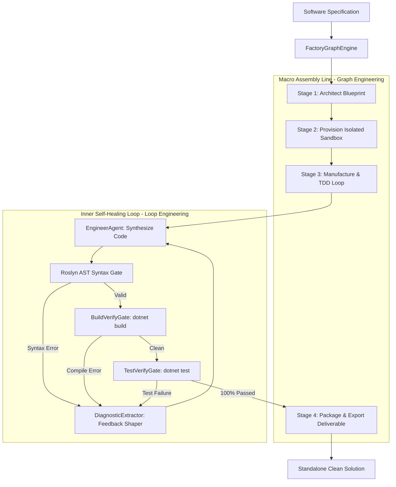

# DevFactory: Autonomous Software Development Factory

> **Architecture**: .NET 8 / 10 Enterprise Development Platform  
> **Engineering Paradigm**: Multi-Stage Assembly Line via **Harness**, **Loop**, and **Graph Engineering**  
> **Output Deliverables**: 100% Standalone, Production-Grade .NET Solutions (Zero Agent Runtime Dependencies)  

---

## 1. Overview

**DevFactory** is an autonomous software development factory that manufactures production-ready, standalone software applications end-to-end from natural-language specifications.

Instead of embedding AI prompts or agent loops inside the runtime of an application, **DevFactory operates as the manufacturing plant**:
1. It analyzes requirements and designs Clean Architecture blueprints (`ArchitectAgent`).
2. It provisions isolated sandboxes and parses C# code in-memory with Roslyn AST (`DevFactory.Harness`).
3. It generates test suites first (TDD) and enters an iterative code-synthesis and verification loop (`DevFactory.Loop`).
4. It enforces zero compiler errors (`BuildVerifyGate`) and 100% passing tests (`TestVerifyGate`).
5. It exports the finished solution to the target delivery directory (`DevFactory.Graph`).

---

## 2. Assembly Line Architecture



---

## 3. Projects in the Factory

| Project | Role in the Manufacturing Plant |
|:---|:---|
| **`DevFactory.Core`** | `SoftwareSpec`, `SoftwareBlueprint`, `ProjectSourceFile`, gate results, and interfaces. |
| **`DevFactory.Harness`** | `WorkspaceSandbox`, `RoslynAstGate`, `DiagnosticExtractor`, and `DotnetProcessRunner`. |
| **`DevFactory.Loop`** | `BuildVerifyGate`, `TestVerifyGate`, and `FactoryLoopController` (TDD self-healing loop). |
| **`DevFactory.Agents`** | `ArchitectAgent` (system blueprints), `EngineerAgent` (code generation), `QAAgent` (xUnit test generation). |
| **`DevFactory.Graph`** | `FactoryGraphEngine` (orchestrates assembly line stages and emits `ManufacturingReport`). |
| **`DevFactory.Cli`** | Console CLI application to trigger autonomous manufacturing runs. |
| **`DevFactory.Tests`** | Factory unit tests validating sandboxes, AST gates, diagnostic extractors, and assembly line flow. |

---

## 4. Usage & Quickstart

### Run Factory Unit Tests
```bash
cd ai-powered-engineering/factory/DevFactory
dotnet test
```
**Result**: `Passed! - Failed: 0, Passed: 6, Skipped: 0, Total: 6, Duration: 107 ms`

### Manufacture an Application
```bash
# Manufacture the CacheShield demonstration microservice
dotnet run --project src/DevFactory.Cli -- demo

# Manufacture a custom application
dotnet run --project src/DevFactory.Cli -- build --name "MetricsVault" --desc "Latency and memory telemetry collector" --out "../../apps/MetricsVault"
```

### Execution Output Sample
```
==========================================================================
                  FACTORY ASSEMBLY LINE EXECUTION TRACE                   
==========================================================================
Step  Stage                Status       Duration     Detail
--------------------------------------------------------------------------
1     ARCHITECT            COMPLETED    0.52ms       Designed blueprint for 5 projects with 5 acceptance criteria.
2     SCAFFOLD_SANDBOX     COMPLETED    1.58ms       Initialized isolated build environment at: /tmp/devfactory_sandboxes/...
3     MANUFACTURE_LOOP     PASSED       5084.89ms    Manufactured successfully with 100% test pass rate (4 tests passing, 0 build errors in 1 iteration(s)).
4     DELIVERY             EXPORTED     2.19ms       Exported clean solution to apps/CacheShield
5     FACTORY_SUMMARY      SUCCESS      0.01ms       Application manufactured and verified with 100% clean gates.
==========================================================================

✓ MANUFACTURING SUCCEEDED: Application 'CacheShield' manufactured successfully in 5.09s (1 iteration(s), 12 files).
```
