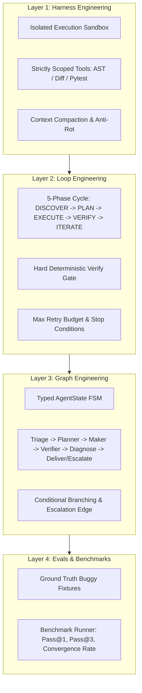

# PatchMaster: AI-Powered Agentic Refactoring & Evals Bot

> **Domain**: AI-Powered Software Engineering & Agentic Architecture  
> **Core Concepts**: Harness Engineering, Loop Engineering, Graph Engineering, Deterministic Verification Gates, Evals & Benchmarks.  
> **Related Repo References**:
> - [Agent Harness — The Anatomy of Production AI Agents](../system-design-architecture/agentic-ai/agent-harness.md)
> - [Agentic Loop Engineering — Key Takeaways](../system-design-architecture/agentic-ai/agentic-loop-engineering.md)
> - [Harness, Loop, and Graph Engineering Article](../articles/agentic-ai/harness-loop-graph-engineering.md)
> - [Context Rot in Long-Running Agents](../articles/agentic-ai/context-rot-the-silent-failure-mode-of-long-running-ai-agents.md)

---

## 1. Executive Overview

Development using Large Language Models and autonomous agents is **stochastic** (probabilistic) rather than **deterministic**. Without structured engineering boundaries, models suffer from:
- Hallucinated imports and broken syntax.
- Silent regressions where a fix breaks existing behavior.
- Runaway loops that consume context and burn budgets without converging.
- **Context rot**: degradation of model reasoning when flooded with noisy raw logs.

**PatchMaster** is an open-source, hands-on reference micro-agent built to demonstrate how to tame stochasticity into deterministic, verifiable outcomes using the **Four Layers of Agentic Engineering**.

---

## 2. The Four Layers of Agentic Engineering



| Layer | Question It Solves | Implementation in PatchMaster |
|:---|:---|:---|
| **1. Harness Engineering** | *Where does the model live and what can it touch?* | [`src/harness/sandbox.py`](src/harness/sandbox.py) (subprocess isolation), [`src/harness/tools.py`](src/harness/tools.py) (AST & diff safety), [`src/harness/context.py`](src/harness/context.py) (traceback extraction). |
| **2. Loop Engineering** | *How does trial-and-error turn into guaranteed convergence?* | [`src/loop/gates.py`](src/loop/gates.py) (AST + test gate), [`src/loop/loop_controller.py`](src/loop/loop_controller.py) (Maker-Checker separation, stopping condition). |
| **3. Graph Engineering** | *What is allowed to run next?* | [`src/graph/nodes.py`](src/graph/nodes.py), [`src/graph/engine.py`](src/graph/engine.py) (Explicit directed graph with conditional branching & escalation). |
| **4. Evals & Benchmarks** | *How do we know changes actually improve reliability?* | [`benchmarks/fixtures/`](benchmarks/fixtures/) (Seeded code bugs), [`benchmarks/runner.py`](benchmarks/runner.py) (Pass@1, Pass@3, trace metrics). |

---

## 3. Directory Structure

```
ai-powered-engineering/
├── README.md                      # Architecture guide & documentation
├── intent.md                      # Your learning intent and objectives
├── requirements.txt               # Direct pip requirements (pydantic, pytest)
├── pyproject.toml                 # Package configuration
├── .venv/                         # Virtual environment (git-ignored)
├── src/
│   ├── state.py                   # Typed state models (AgentState, Phase, VerificationResult)
│   ├── harness/                   # Layer 1: Scaffolding, Sandboxing, Context
│   │   ├── sandbox.py             # Isolated execution sandbox with timeouts
│   │   ├── tools.py               # AST parsing, diff sanity check, subprocess runner
│   │   └── context.py             # Failure signal extraction & context compaction
│   ├── loop/                      # Layer 2: Self-Healing Feedback Loop
│   │   ├── gates.py               # Deterministic multi-stage verify gate
│   │   └── loop_controller.py     # 5-Phase loop (Discover -> Plan -> Exec -> Verify -> Iterate)
│   ├── graph/                     # Layer 3: Orchestration State Graph
│   │   ├── nodes.py               # Discrete node handlers (Triage, Maker, Verifier, Diagnose)
│   │   └── engine.py              # Directed state graph engine & step tracing
│   ├── agents/                    # Generative & Evaluative Roles
│   │   ├── base.py                # BaseMakerAgent, BaseCheckerAgent interfaces
│   │   ├── maker.py               # MockMakerAgent, HeuristicMakerAgent, LLMMakerAgent
│   │   └── checker.py             # RuleBasedCheckerAgent (security & regression audit)
│   └── cli.py                     # CLI entry point
├── benchmarks/                    # Layer 4: Evaluation Benchmark Suite
│   ├── runner.py                  # Evaluation benchmark runner & metric reporter
│   └── fixtures/                  # Ground truth test cases
│       ├── case_01_off_by_one/    # Array indexing boundary defect
│       ├── case_02_none_handling/ # Null/None pointer exception
│       ├── case_03_dict_mutation/ # Modifying dict while iterating
│       └── case_04_logic_flaw/    # Incorrect business math
└── tests/                         # Unit tests verifying all architectural layers
    ├── test_harness.py            # AST, sandbox, diff sanity tests
    ├── test_loop.py               # Gate validation, checker audit, loop convergence
    └── test_graph.py              # State graph transitions & budget escalation
```

---

## 4. How to Run

A dedicated virtual environment has been created inside `ai-powered-engineering/.venv` with all dependencies from `requirements.txt` pre-installed.

### Option A: Using the Virtual Environment (Direct)

1. **Activate the virtual environment**:
   ```bash
   cd ai-powered-engineering
   source .venv/bin/activate
   ```

2. **Run the Benchmark Evals Suite** (evaluates all fixtures, reports Pass@1 & Pass@3):
   ```bash
   python benchmarks/runner.py
   ```

3. **Run the Unit Test Suite** (11/11 passing tests):
   ```bash
   pytest tests -v
   ```

4. **Run the CLI on an Individual Buggy File**:
   ```bash
   python src/cli.py \
     --target benchmarks/fixtures/case_01_off_by_one/solution.py \
     --test benchmarks/fixtures/case_01_off_by_one/test_solution.py
   ```

5. **Run with a Live LLM** (OpenAI / Gemini):
   ```bash
   export OPENAI_API_KEY="your-api-key"
   pip install openai
   python src/cli.py \
     --target benchmarks/fixtures/case_01_off_by_one/solution.py \
     --test benchmarks/fixtures/case_01_off_by_one/test_solution.py \
     --llm
   ```

---

### Option B: Using `uv run` (Ephemeral / Global)

From the repository root:
```bash
# Benchmark suite
uv run --with pytest --with pydantic python ai-powered-engineering/benchmarks/runner.py

# Unit tests
uv run --with pytest --with pydantic pytest ai-powered-engineering/tests -v

# CLI run
uv run --with pytest --with pydantic python ai-powered-engineering/src/cli.py \
  --target ai-powered-engineering/benchmarks/fixtures/case_01_off_by_one/solution.py \
  --test ai-powered-engineering/benchmarks/fixtures/case_01_off_by_one/test_solution.py
```

---

## 5. Key Architecture Takeaways

1. **Deterministic Verification Gate Beats Generative Self-Critique**:
   A generative model grading its own output is biased and prone to rubber-stamping. PatchMaster uses a hard gate: AST syntax parsing + isolated pytest subprocess execution.
2. **Context Compaction Prevents Context Rot**:
   Instead of appending full multi-kilobyte pytest output to consecutive prompts, `ContextManager` extracts only the essential traceback and assertion lines.
3. **Finite Retry Budgets Protect from Infinite Cost**:
   If an agent cannot fix a bug within `max_iterations` (default: 3), the graph transitions to `ESCALATE` rather than burning infinite tokens.
