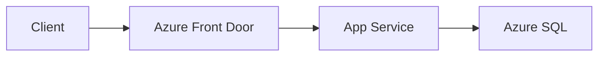

# GitHub Copilot Instructions - Azure Architecture

## Scope

This directory contains **Azure-specific** architecture documentation covering Microsoft Azure services, best practices, and implementation patterns.

## Directory Structure

| Directory | Purpose |
|-----------|---------|
| `compute/` | Azure compute services (AKS, App Service, Functions, VMs, Container Apps) |
| `data/` | Data services (Storage, Cosmos DB, SQL, Redis, Data Factory) |
| `networking/` | Network services (Virtual WAN, Firewall, Load Balancing) |
| `security/` | Security services (Entra ID, Key Vault, RBAC, Bastion) |
| `integration/` | Messaging & integration (Event Hubs, Service Bus, Event Grid, Logic Apps) |
| `observability/` | Monitoring (Application Insights, Azure Monitor) |
| `governance/` | Governance (Policy, Lighthouse, Resource Management) |
| `container-registry/` | Azure Container Registry |
| `migration/` | Azure Migrate and Resource Mover |
| `cost-management/` | Cost optimization and Hybrid Benefit |
| `devops/` | ARM templates, Bicep, and IaC |

## Content Guidelines

### Azure Service Documentation

When documenting Azure services, include:

1. **Service Overview**: What the service does and key capabilities
2. **Pricing Tiers**: Comparison of SKUs (Basic, Standard, Premium)
3. **Networking**: VNet integration, private endpoints, firewall rules
4. **Security**: Authentication, authorization, encryption
5. **Monitoring**: Metrics, logs, alerts integration
6. **Limits & Quotas**: Service limits and how to request increases
7. **Best Practices**: Microsoft-recommended configurations

### Tier Comparison Template

```markdown
## Pricing Tiers

| Feature | Basic | Standard | Premium |
|---------|-------|----------|---------|
| Max throughput | X | Y | Z |
| SLA | 99.9% | 99.95% | 99.99% |
| Features | ... | ... | ... |
```

### Architecture Diagrams

Use Mermaid for diagrams:



## Azure Naming Conventions

Follow Microsoft's naming conventions:
- Resource names: `<resource-type>-<workload>-<environment>-<region>-<instance>`
- Example: `st-app-prod-eastus-001` (storage account)

## Key Topics by Service Category

### Compute
- Container orchestration (AKS vs Container Apps)
- Serverless (Functions vs Logic Apps)
- Web hosting (App Service plans, scaling)

### Integration (Messaging)
- **Event Hubs**: High-throughput event streaming, Kafka compatibility
- **Service Bus**: Enterprise messaging, queues, topics, sessions
- **Event Grid**: Event routing, reactive programming
- **Notification Hubs**: Push notifications at scale

### Data
- Storage redundancy (LRS, ZRS, GRS, GZRS)
- Database selection (SQL vs Cosmos DB vs PostgreSQL)
- Caching strategies (Redis tiers and patterns)

### Security
- Identity: Managed identities (SAMI vs UAMI)
- Secrets: Key Vault integration patterns
- Network: Private endpoints, service endpoints

## Cross-References

- Link to general patterns: `[See General architecture patterns](../architecture-general/)`
- Link between services: `[Compare with Event Hubs](./integration/event-hubs/)`

## Key Reference Documents

### Architecture Taxonomy
For standard architecture terminology and classification, reference:
- [`../architecture-general/10-practicality-taxonomy/architecture_taxonomy_reference.md`](../architecture-general/10-practicality-taxonomy/architecture_taxonomy_reference.md)

Azure-specific implementations typically fall under:
- **Physical/Implementation Architecture**: Azure-specific services and configurations
- **Runtime/Operational Architecture**: Azure monitoring, scaling, and deployment patterns

### Cross-Reference Pattern
When documenting Azure services, link back to the general architecture patterns:
```markdown
> **Architecture Type**: [Physical Implementation Architecture](../architecture-general/10-practicality-taxonomy/architecture_taxonomy_reference.md#103-physical--implementation-architecture-tactical--concrete)
```

## Official Resources

When referencing, prefer these sources:
- Microsoft Learn: `https://learn.microsoft.com/azure/`
- Azure Architecture Center: `https://learn.microsoft.com/azure/architecture/`
- Well-Architected Framework: `https://learn.microsoft.com/azure/well-architected/`
