# Azure SQL Managed Instance - Comprehensive Comparison Guide

## Table of Contents

- [Overview](#overview)
- [What is Azure SQL Managed Instance?](#what-is-azure-sql-managed-instance)
- [Deployment Options Comparison](#deployment-options-comparison)
  - [Single Database](#single-database)
  - [Elastic Pool](#elastic-pool)
  - [Managed Instance](#managed-instance)
  - [Serverless (Compute Tier)](#serverless-compute-tier)
- [Scalability Comparison](#scalability-comparison)
- [Infrastructure Architecture](#infrastructure-architecture)
- [Feature Comparison Matrix](#feature-comparison-matrix)
- [Cost Comparison](#cost-comparison)
- [Performance and Scalability Limits](#performance-and-scalability-limits)
- [Migration Scenarios](#migration-scenarios)
- [Decision Guide](#decision-guide)
- [Real-World Scenarios](#real-world-scenarios)
- [Best Practices](#best-practices)
- [Configuring Azure SQL Managed Instance for Workload Demands](#configuring-azure-sql-managed-instance-for-workload-demands)
- [References](#references)

---

## Overview

Azure SQL offers multiple deployment options to meet different application requirements, migration scenarios, and management preferences. This guide provides an in-depth comparison of **Azure SQL Managed Instance**, **Azure SQL Database (Single Database)**, **Elastic Pools**, and **Serverless compute tier**, helping you choose the right option for your workloads.

### Quick Comparison Summary

| Option | Type | SQL Compatibility | Management | Best For |
|--------|------|------------------|------------|----------|
| **Managed Instance** | PaaS - Instance | ~100% | Fully Managed | Lift-and-shift migrations |
| **Single Database** | PaaS - Database | ~95% | Fully Managed | Modern cloud apps |
| **Elastic Pool** | PaaS - Shared Pool | ~95% | Fully Managed | Multi-tenant SaaS |
| **Serverless** | PaaS - Auto-scale | ~95% | Fully Managed | Intermittent workloads |

---

## What is Azure SQL Managed Instance?

**Azure SQL Managed Instance** is a fully managed Platform-as-a-Service (PaaS) deployment option that provides **near 100% compatibility** with the latest SQL Server Enterprise Edition database engine. It's designed specifically for customers who want to migrate their on-premises SQL Server workloads to Azure with minimal application changes while benefiting from a fully managed service.

### Key Characteristics

#### Instance-Level Deployment
- Deployed as a **complete SQL Server instance** (not just individual databases)
- Multiple databases can exist within a single instance
- Supports **cross-database queries** and transactions
- Instance-scoped features available (SQL Agent, Service Broker, etc.)

#### Network Isolation
- Deployed within an **Azure Virtual Network (VNet)**
- Private IP address space
- Network security group (NSG) protection
- Supports hybrid connectivity via VPN or ExpressRoute

#### Near 100% SQL Server Compatibility
- **CLR (Common Language Runtime)** support
- **SQL Server Agent** for job scheduling
- **Service Broker** for message queuing
- **Database Mail** for email notifications
- **Linked servers** to other SQL instances
- **Cross-database queries** using 3-part naming
- **Distributed transactions** across databases
- **Replication** (transactional, merge, snapshot)

#### Fully Managed PaaS
- Automatic OS and SQL Server patching
- Automated backups (7-35 days retention)
- Built-in high availability (99.99% SLA)
- Point-in-time restore
- Automatic threat detection
- No infrastructure management required

### Architecture Overview

```
┌─────────────────────────────────────────────────────┐
│         Azure Virtual Network (VNet)                │
│                                                     │
│  ┌───────────────────────────────────────────────┐ │
│  │   SQL Managed Instance Subnet                │ │
│  │                                               │ │
│  │  ┌─────────────────────────────────────┐    │ │
│  │  │  SQL Managed Instance               │    │ │
│  │  │                                     │    │ │
│  │  │  • Database 1                      │    │ │
│  │  │  • Database 2                      │    │ │
│  │  │  • Database 3                      │    │ │
│  │  │  • SQL Agent Jobs                  │    │ │
│  │  │  • Linked Servers                  │    │ │
│  │  │  • Cross-DB Queries                │    │ │
│  │  └─────────────────────────────────────┘    │ │
│  │                                               │ │
│  └───────────────────────────────────────────────┘ │
│                                                     │
│  ┌───────────────────────────────────────────────┐ │
│  │   Application Subnet                          │ │
│  │   • App Service / VMs / AKS                   │ │
│  └───────────────────────────────────────────────┘ │
└─────────────────────────────────────────────────────┘
```

---

## Deployment Options Comparison

### Single Database

**Isolated, fully managed database with dedicated resources**

#### What It Is
- A **single database** deployed as an independent resource
- Dedicated compute and storage resources
- Isolated from other databases
- Database-level resource management

#### Architecture
```
Azure SQL Database (Single)
├── Dedicated compute resources
├── Dedicated storage
├── Independent scaling
└── No sharing with other databases
```

#### Key Features
✅ **Advantages**:
- Simplest deployment model
- **Per-second billing** available (serverless)
- **Auto-scaling** with serverless compute
- **Fast provisioning** (minutes)
- **Independent scaling** per database
- Lower starting cost
- Supports all service tiers (General Purpose, Business Critical, Hyperscale)

❌ **Limitations**:
- No instance-scoped features (SQL Agent, Service Broker)
- No native cross-database queries (3-part naming)
- Limited to ~95% SQL Server compatibility
- No CLR support
- No linked servers

#### Best Use Cases
- **Modern cloud-native applications**
- **Microservices architectures** (one DB per service)
- **SaaS applications** with database-per-tenant model
- **Development and testing**
- Applications with **predictable or unpredictable** usage patterns (serverless)
- Apps not requiring SQL Server-specific features

#### Scalability
- **Vertical scaling**: Change vCores or DTUs (downtime: seconds)
- **Horizontal scaling**: Use elastic queries or shard data manually
- **Serverless auto-scaling**: Automatic compute scaling (0.5-80 vCores)
- **Max size**: Up to 100 TB (Hyperscale tier)

#### Does It Run on a Single Server?
- **Abstracted infrastructure**: You don't manage physical servers
- **Logical server**: Acts as administrative boundary (not a physical server)
- **High availability**: Automatically distributed across availability zones
- **Storage**: Decoupled from compute, distributed across nodes

---

### Elastic Pool

**Shared resource pool for multiple databases with variable usage patterns**

#### What It Is
- A **collection of databases** that share a set of compute and storage resources
- Cost-effective solution for managing multiple databases
- Pool-level resource management
- Databases in the pool can use resources as needed

#### Architecture
```
Elastic Pool (8 vCores, 32 GB RAM)
├── Database 1 (uses 1 vCore during peak)
├── Database 2 (uses 3 vCores during peak)
├── Database 3 (uses 0.5 vCore during peak)
├── Database 4 (uses 2 vCores during peak)
└── Database 5 (uses 1.5 vCore during peak)
    └── Total: Resources shared across all databases
```

#### Key Features
✅ **Advantages**:
- **Cost-effective** for multiple databases
- **Resource sharing** optimizes utilization
- **Elastic scaling** at pool level
- **Perfect for variable usage** patterns
- **Automatic load balancing** across databases
- Supports General Purpose and Business Critical tiers
- Individual database metrics and monitoring

❌ **Limitations**:
- No instance-scoped features
- No cross-database queries (without elastic query)
- Same ~95% SQL Server compatibility as single database
- **No serverless option** for elastic pools
- All databases must be in same region
- Pool-level resource constraints

#### Best Use Cases
- **Multi-tenant SaaS applications** (one DB per customer)
- **Multiple databases with complementary usage patterns**
- Development/test environments with many databases
- Cost optimization for database portfolios
- Databases with **unpredictable individual usage** but **predictable aggregate usage**

#### Cost Efficiency Example
```
Scenario: 20 databases, each needing up to 2 vCores peak

Option 1 - Individual databases:
  20 databases × 2 vCores = 40 vCores total
  Cost: 40 vCores × $180/vCore = $7,200/month

Option 2 - Elastic Pool:
  Only 8 vCores needed (not all peak simultaneously)
  Cost: 8 vCores × $180/vCore = $1,440/month
  
Savings: $5,760/month (80% reduction!)
```

#### Scalability
- **Pool-level scaling**: Change pool vCores or eDTUs
- **Add/remove databases** dynamically
- **Per-database min/max limits** configurable
- **No serverless**: Manual scaling only
- **Max databases per pool**: Up to 500 databases

#### Does It Run on a Single Server?
- **Shared infrastructure**: Multiple databases share compute resources
- **Logical pool**: Resource boundary for cost management
- **Physical distribution**: Databases distributed across backend infrastructure
- **High availability**: Built-in redundancy across availability zones

---

### Managed Instance

**Fully managed SQL Server instance with near 100% compatibility**

#### What It Is
- A **complete SQL Server instance** deployed as a managed service
- Instance-level features and configurations
- Multiple databases within the instance
- VNet integration for network isolation

#### Architecture
```
SQL Managed Instance
├── Instance-level resources (vCores, storage)
├── SQL Server Agent
├── Service Broker
├── Database 1
├── Database 2
├── Database N
├── Linked Servers
├── Cross-database queries (3-part naming)
└── CLR assemblies
```

#### Key Features
✅ **Advantages**:
- **Near 100% SQL Server compatibility**
- **Instance-scoped features**: SQL Agent, Service Broker, DB Mail
- **CLR (Common Language Runtime)** support
- **Cross-database queries** with 3-part naming
- **Linked servers** to other SQL instances
- **Distributed transactions** across databases
- **VNet deployment** for network isolation
- **Hybrid connectivity** (VPN, ExpressRoute)
- **Managed domain integration**
- Supports **SQL Server logins** and **Windows Authentication** (via Azure AD)
- **Collation** configurable at instance level

❌ **Limitations**:
- **Higher cost** than single database
- **Longer provisioning time** (4-6 hours for initial deployment)
- **No serverless option** available
- **Fixed resource allocation** (no auto-pause)
- Requires VNet configuration
- Minimum 4 vCores (General Purpose) or 8 vCores (Business Critical)
- No per-second billing

#### Best Use Cases
- **Lift-and-shift migrations** from on-premises SQL Server
- Applications using **SQL Server-specific features** (CLR, Service Broker)
- **Cross-database queries** required
- **Multi-database applications** with dependencies
- **Complex stored procedures** using CLR
- Applications requiring **SQL Agent jobs**
- **Hybrid scenarios** with on-premises connectivity
- **Minimal code changes** during migration

#### Scalability
- **Vertical scaling**: Change vCores (some downtime ~minutes)
- **Storage scaling**: Add storage without downtime
- **Instance pools**: Share infrastructure costs across instances
- **Read replicas**: Add read-only replicas for scale-out reads
- **No auto-scaling**: Manual intervention required
- **Max size**: Up to 16 TB (Business Critical), 8 TB (General Purpose)

#### Does It Run on a Single Server?
- **Dedicated instance**: Resources dedicated to your instance
- **Multi-node architecture**: 
  - **General Purpose**: Compute separated from storage
  - **Business Critical**: Local SSD with Always On Availability Groups
- **High availability**: Multiple nodes in backend cluster
- **Not a single physical server**: Distributed across Azure infrastructure
- **VNet integration**: Appears as resource within your VNet

---

### Serverless (Compute Tier)

**Auto-scaling compute tier available for Single Database only**

#### What It Is
- A **compute tier option** for Azure SQL Database (Single Database only)
- **Not a separate deployment option**, but a way to configure compute
- Automatically scales compute based on workload demand
- Auto-pauses during inactivity to save costs

#### Architecture
```
Serverless Single Database
├── Auto-scaling: 0.5 - 80 vCores (configurable range)
├── Auto-pause: After configurable delay (1-7 days)
├── Auto-resume: On first connection attempt
├── Per-second billing: Only pay for compute used
└── Storage: Always online (billed separately)
```

#### Key Features
✅ **Advantages**:
- **Automatic compute scaling** between min/max vCores
- **Auto-pause during inactivity** (saves up to 80% cost)
- **Per-second billing** for compute
- **Automatic resume** on connection
- **No manual intervention** for scaling
- **Pay only for actual usage**
- **Built-in intelligent scaling**
- Available in General Purpose tier (Hyperscale preview)

❌ **Limitations**:
- **Only available for Single Database** (not elastic pools or managed instance)
- **Only General Purpose tier** (+ Hyperscale preview)
- **Resume delay**: 1-3 seconds after pause (cold start)
- **Min vCore**: 0.5 vCore minimum
- **Not suitable for 24/7 workloads** at full utilization
- Pause delay configurable (1 hour - 7 days minimum)
- Cannot pause if active connections exist

#### Best Use Cases
- **Development and test environments**
- **Intermittent workloads** (used few hours per day)
- **Unpredictable usage patterns**
- **Infrequently accessed applications**
- **Cost-sensitive workloads**
- **New applications** with unknown usage patterns
- **Batch processing** jobs (run periodically)

#### Cost Comparison Example
```
Scenario: Database used 8 hours/day, idle 16 hours/day

Provisioned (4 vCores, 24/7):
  Compute: 4 vCores × 24 hours × 30 days = $720/month
  Storage: 100 GB × $0.12/GB = $12/month
  Total: $732/month

Serverless (0.5-4 vCores, auto-pause):
  Compute: 4 vCores × 8 hours × 30 days = $180/month
  Paused: 16 hours/day × 30 days = 480 hours (no compute cost)
  Storage: 100 GB × $0.12/GB = $12/month
  Total: $192/month

Savings: $540/month (74% reduction!)
```

#### Scalability
- **Automatic vertical scaling**: Based on CPU usage
- **Configurable min/max vCores**: Set boundaries for scaling
- **Instantaneous scale-up**: Within seconds
- **Scale-down**: Gradual based on sustained low usage
- **No manual intervention**: Fully automatic
- **Predictable performance**: Within configured vCore range

#### Does It Run on a Single Server?
- **Same infrastructure** as provisioned single database
- **Logical abstraction**: Serverless is a compute tier, not infrastructure model
- **Paused state**: Compute nodes deallocated, storage remains
- **Active state**: Compute nodes allocated from shared pool

---

## Scalability Comparison

### Vertical Scalability (Scale Up/Down)

| Option | Scaling Method | Downtime | Auto-scaling | Min Resources | Max Resources |
|--------|---------------|----------|--------------|---------------|---------------|
| **Single Database (Provisioned)** | Manual vCore/DTU change | Seconds | ❌ No | 1 vCore / 5 DTU | 80 vCores / 4000 DTU |
| **Single Database (Serverless)** | Automatic within range | None | ✅ Yes | 0.5 vCore | 80 vCores |
| **Elastic Pool** | Manual pool-level change | Seconds | ❌ No | 2 vCores / 50 DTU | 80 vCores / 4000 DTU |
| **Managed Instance** | Manual vCore change | Minutes | ❌ No | 4 vCores (GP) / 8 vCores (BC) | 80 vCores |

### Horizontal Scalability (Scale Out)

| Option | Read Scale-Out | Write Scale-Out | Cross-Region | Sharding |
|--------|---------------|-----------------|--------------|----------|
| **Single Database** | ✅ Yes (Business Critical) | ⚠️ Manual (app-level) | ⚠️ Geo-replication | ⚠️ Manual (elastic tools) |
| **Elastic Pool** | ✅ Yes (Business Critical) | ⚠️ Manual (app-level) | ⚠️ Geo-replication | ⚠️ Manual |
| **Managed Instance** | ✅ Yes (Business Critical) | ❌ No | ⚠️ Failover groups | ❌ No |
| **Serverless** | ✅ Yes (Business Critical) | ⚠️ Manual (app-level) | ⚠️ Geo-replication | ⚠️ Manual |

### Storage Scalability

| Option | Max Storage | Auto-grow | Storage Type |
|--------|-------------|-----------|--------------|
| **Single Database (General Purpose)** | 4 TB | ✅ Yes | Remote Premium |
| **Single Database (Hyperscale)** | 100 TB | ✅ Yes | Multi-tier |
| **Elastic Pool** | 4 TB (pool) | ✅ Yes | Remote Premium |
| **Managed Instance (General Purpose)** | 8 TB | ✅ Yes | Remote Premium |
| **Managed Instance (Business Critical)** | 16 TB | ✅ Yes | Local SSD |

### Scaling Performance Impact

#### Single Database (Provisioned)
```
Action: Scale from 4 vCores to 8 vCores
Downtime: 5-30 seconds (brief connection drop)
Impact: Existing connections terminated, reconnect required
Time: Immediate
```

#### Single Database (Serverless)
```
Action: Workload increases CPU usage
Response: Auto-scales from 2 vCores to 4 vCores
Downtime: None
Impact: Transparent to application
Time: Within seconds
```

#### Elastic Pool
```
Action: Scale pool from 8 vCores to 16 vCores
Downtime: 5-30 seconds per database
Impact: Brief connection drops
Time: Immediate
Effect: All databases benefit from larger pool
```

#### Managed Instance
```
Action: Scale from 8 vCores to 16 vCores
Downtime: 2-5 minutes
Impact: Connections terminated, reconnect required
Time: Several minutes
Note: Longer downtime compared to single database
```

---

## Infrastructure Architecture

### Does Each Option Run on a Single Server?

#### Single Database - Abstracted Multi-Node Architecture

**Physical Reality**:
- **Not a single physical server**: Distributed across Azure's infrastructure
- **Compute nodes**: Backend cluster with multiple physical servers
- **Storage layer**: Decoupled, replicated across multiple nodes
- **High availability**: 3 replicas (LRS) or zone-redundant

**What You See**:
- Logical "server" (administrative boundary)
- Single database resource
- Single connection endpoint

**Architecture Diagram**:
```
┌─────────────────────────────────────────────────┐
│  Logical Server (admin boundary)                │
│                                                  │
│  ┌────────────────────────────────────────────┐ │
│  │  Single Database                           │ │
│  │                                            │ │
│  │  Physical Architecture:                   │ │
│  │  ┌──────────┐  ┌──────────┐  ┌─────────┐ │ │
│  │  │ Compute  │→ │ Storage  │→ │ Replica │ │ │
│  │  │ Primary  │  │ Primary  │  │ 1 & 2   │ │ │
│  │  └──────────┘  └──────────┘  └─────────┘ │ │
│  └────────────────────────────────────────────┘ │
└─────────────────────────────────────────────────┘
```

#### Elastic Pool - Shared Compute Architecture

**Physical Reality**:
- **Shared compute pool**: Multiple databases share physical resources
- **Resource allocation**: Dynamic based on database activity
- **Storage**: Individual per database, decoupled from compute
- **Isolation**: Logical separation, physical resource sharing

**What You See**:
- Elastic pool resource
- Multiple databases within pool
- Pool-level metrics

**Architecture Diagram**:
```
┌────────────────────────────────────────────────┐
│  Elastic Pool (8 vCores, 32 GB RAM)            │
│                                                 │
│  ┌───────────────────────────────────────────┐ │
│  │  Shared Compute Pool                      │ │
│  │  ┌─────────────────────────────────────┐  │ │
│  │  │  Physical Compute Resources         │  │ │
│  │  │  Dynamically Allocated              │  │ │
│  │  └─────────────────────────────────────┘  │ │
│  │          ↓         ↓         ↓            │ │
│  │    [DB1]     [DB2]     [DB3]              │ │
│  │  (1 vCore) (3 vCore) (0.5 vCore)         │ │
│  └───────────────────────────────────────────┘ │
│                                                 │
│  Individual Storage (decoupled):               │
│  DB1: 10 GB  │  DB2: 50 GB  │  DB3: 20 GB     │
└────────────────────────────────────────────────┘
```

#### Managed Instance - Dedicated Instance Architecture

**Physical Reality**:
- **Dedicated compute cluster**: Resources dedicated to your instance
- **Multi-node architecture**:
  - **General Purpose**: Compute separated from storage
  - **Business Critical**: Local SSD with Always On cluster (4 nodes)
- **VNet integration**: Deployed within your Virtual Network
- **Not single server**: Distributed architecture for HA

**What You See**:
- SQL Managed Instance resource
- Private IP address in your VNet
- Instance-level management

**Architecture Diagram**:
```
┌──────────────────────────────────────────────────┐
│  Azure Virtual Network                           │
│                                                   │
│  ┌─────────────────────────────────────────────┐ │
│  │  SQL Managed Instance Subnet                │ │
│  │                                              │ │
│  │  Business Critical (4-node cluster):        │ │
│  │  ┌──────────┐  ┌──────────┐  ┌──────────┐ │ │
│  │  │ Primary  │→ │Secondary │→ │Secondary │ │ │
│  │  │ Node     │  │ Node 1   │  │ Node 2   │ │ │
│  │  │ (R/W)    │  │ (R)      │  │ (R)      │ │ │
│  │  └──────────┘  └──────────┘  └──────────┘ │ │
│  │       ↓             ↓             ↓        │ │
│  │  ┌─────────────────────────────────────┐  │ │
│  │  │  Local SSD Storage (synchronous)    │  │ │
│  │  └─────────────────────────────────────┘  │ │
│  │                                              │ │
│  │  • All databases within instance            │ │
│  │  • Cross-database queries supported         │ │
│  │  • SQL Agent, Service Broker, etc.          │ │
│  └─────────────────────────────────────────────┘ │
└──────────────────────────────────────────────────┘
```

#### Key Takeaways

| Question | Answer |
|----------|--------|
| **Does Single Database run on a single physical server?** | ❌ No - Distributed across multiple backend nodes for HA and storage |
| **Does Elastic Pool run on a single physical server?** | ❌ No - Shared compute pool with distributed storage |
| **Does Managed Instance run on a single physical server?** | ❌ No - Multi-node cluster (4 nodes for Business Critical, separated compute/storage for General Purpose) |
| **Does Serverless run on a single physical server?** | ❌ No - Same architecture as provisioned single database |

**All Azure SQL options are distributed systems:**
- ✅ **High Availability**: Multiple nodes ensure uptime
- ✅ **Storage Redundancy**: Data replicated across nodes/zones
- ✅ **No Single Point of Failure**: Redundancy at all levels
- ✅ **Abstracted Infrastructure**: Microsoft manages physical layer

---

## Feature Comparison Matrix

### SQL Server Feature Support

| Feature | Single Database | Elastic Pool | Managed Instance | Serverless | On-Premises SQL |
|---------|----------------|--------------|------------------|------------|-----------------|
| **SQL Server Compatibility** | ~95% | ~95% | ~100% | ~95% | 100% |
| **T-SQL Support** | ✅ Core features | ✅ Core features | ✅ Full support | ✅ Core features | ✅ Full |
| **Cross-database queries** | ❌ No | ❌ No | ✅ Yes | ❌ No | ✅ Yes |
| **CLR (Common Language Runtime)** | ❌ No | ❌ No | ✅ Yes | ❌ No | ✅ Yes |
| **SQL Server Agent** | ❌ No | ❌ No | ✅ Yes | ❌ No | ✅ Yes |
| **Service Broker** | ❌ No | ❌ No | ✅ Yes | ❌ No | ✅ Yes |
| **Database Mail** | ❌ No | ❌ No | ✅ Yes | ❌ No | ✅ Yes |
| **Linked Servers** | ❌ No | ❌ No | ✅ Yes | ❌ No | ✅ Yes |
| **Distributed Transactions** | ⚠️ Limited | ⚠️ Limited | ✅ Yes | ⚠️ Limited | ✅ Yes |
| **Replication** | ⚠️ Subscriber only | ⚠️ Subscriber only | ✅ Full support | ⚠️ Subscriber only | ✅ Full |
| **Temporal Tables** | ✅ Yes | ✅ Yes | ✅ Yes | ✅ Yes | ✅ Yes |
| **In-Memory OLTP** | ✅ Yes | ✅ Yes | ✅ Yes | ✅ Yes | ✅ Yes |
| **Columnstore Indexes** | ✅ Yes | ✅ Yes | ✅ Yes | ✅ Yes | ✅ Yes |
| **JSON Support** | ✅ Yes | ✅ Yes | ✅ Yes | ✅ Yes | ✅ Yes |
| **Full-Text Search** | ✅ Yes | ✅ Yes | ✅ Yes | ✅ Yes | ✅ Yes |
| **Always Encrypted** | ✅ Yes | ✅ Yes | ✅ Yes | ✅ Yes | ✅ Yes |

### Management and Operations

| Feature | Single Database | Elastic Pool | Managed Instance | Serverless |
|---------|----------------|--------------|------------------|------------|
| **Provisioning Time** | < 5 minutes | < 5 minutes | 4-6 hours (initial) | < 5 minutes |
| **Auto-patching** | ✅ Yes | ✅ Yes | ✅ Yes | ✅ Yes |
| **Automated Backups** | ✅ 7-35 days | ✅ 7-35 days | ✅ 7-35 days | ✅ 7-35 days |
| **Point-in-Time Restore** | ✅ Yes | ✅ Yes | ✅ Yes | ✅ Yes |
| **Auto-tuning** | ✅ Yes | ✅ Yes | ✅ Yes | ✅ Yes |
| **Threat Detection** | ✅ Yes | ✅ Yes | ✅ Yes | ✅ Yes |
| **VNet Integration** | ⚠️ Private Link | ⚠️ Private Link | ✅ Native | ⚠️ Private Link |
| **Azure AD Authentication** | ✅ Yes | ✅ Yes | ✅ Yes | ✅ Yes |
| **Windows Authentication** | ❌ No | ❌ No | ✅ Yes (via Azure AD) | ❌ No |
| **Instance Collation** | ❌ Fixed | ❌ Fixed | ✅ Configurable | ❌ Fixed |
| **Instance-level Access** | ❌ No | ❌ No | ✅ Yes | ❌ No |

### Scaling and Performance

| Feature | Single Database | Elastic Pool | Managed Instance | Serverless |
|---------|----------------|--------------|------------------|------------|
| **Auto-scaling** | ❌ No | ❌ No | ❌ No | ✅ Yes |
| **Auto-pause** | ❌ No | ❌ No | ❌ No | ✅ Yes |
| **Per-second Billing** | ❌ No | ❌ No | ❌ No | ✅ Yes |
| **Scale Up/Down Downtime** | Seconds | Seconds | Minutes | None |
| **Read Scale-Out** | ✅ BC tier | ✅ BC tier | ✅ BC tier | ✅ BC tier |
| **Active Geo-Replication** | ✅ Yes | ✅ Yes | ❌ No | ✅ Yes |
| **Failover Groups** | ✅ Yes | ✅ Yes | ✅ Yes | ✅ Yes |
| **Zone Redundancy** | ✅ Yes | ✅ Yes | ✅ Yes | ✅ Yes |

### Cost and Billing

| Feature | Single Database | Elastic Pool | Managed Instance | Serverless |
|---------|----------------|--------------|------------------|------------|
| **Starting Price** | ~$5/month | ~$360/month | ~$1,000/month | ~$0.12/hour active |
| **Billing Model** | Per hour | Per hour | Per hour | Per second (compute) |
| **Cost for Idle Time** | Full | Full | Full | Storage only |
| **Reserved Capacity** | ✅ Yes (1-3 years) | ✅ Yes | ✅ Yes | ❌ No |
| **Azure Hybrid Benefit** | ✅ Yes | ✅ Yes | ✅ Yes | ✅ Yes |
| **DTU Model Available** | ✅ Yes | ✅ Yes | ❌ No | ❌ No |

---

## Cost Comparison

### Monthly Cost Examples (General Purpose, 8 vCores)

| Deployment Option | Monthly Cost | Use Case | Savings Opportunity |
|-------------------|--------------|----------|---------------------|
| **Single Database (Provisioned)** | ~$1,440 | 24/7 production app | Reserved capacity (1-3 years) |
| **Single Database (Serverless, 50% active)** | ~$360 | Dev/test, intermittent | Auto-pause when idle |
| **Elastic Pool (5 databases)** | ~$1,440 | Multi-tenant SaaS | Resource sharing across DBs |
| **Managed Instance** | ~$2,000 | Lift-and-shift migration | Instance pools for multiple instances |

### Cost Breakdown: Single Database vs Serverless

#### Scenario: Development Database Used 8 Hours/Day

**Single Database (Provisioned, 4 vCores)**:
```
Compute: 4 vCores × $0.50/hour × 720 hours = $360/month
Storage: 100 GB × $0.12/GB = $12/month
Total: $372/month
```

**Single Database (Serverless, 0.5-4 vCores)**:
```
Active compute: 4 vCores × $0.75/hour × 240 hours = $180/month
Paused: 480 hours × $0/hour = $0/month
Storage: 100 GB × $0.12/GB = $12/month
Total: $192/month

Savings: $180/month (48% reduction)
```

### Cost Breakdown: Single Databases vs Elastic Pool

#### Scenario: 10 Databases for Multi-Tenant SaaS

**Option 1: Individual Single Databases (2 vCores each)**:
```
Per database: 2 vCores × $0.50/hour × 720 hours = $360/month
10 databases: $360 × 10 = $3,600/month
```

**Option 2: Elastic Pool (8 vCores shared)**:
```
Pool: 8 vCores × $0.50/hour × 720 hours = $1,440/month
Databases: All 10 databases included
Total: $1,440/month

Savings: $2,160/month (60% reduction)
```

**Why It Works**:
- Not all databases peak simultaneously
- Aggregate usage: Only 8 vCores needed at any time
- Individual peak: Each DB can burst to full pool resources

### Cost Breakdown: Managed Instance vs Single Database

#### Scenario: Migration of 5 Databases with CLR

**Option 1: Managed Instance (8 vCores, General Purpose)**:
```
Instance: 8 vCores × $0.70/hour × 720 hours = $2,000/month
All 5 databases: Included in instance cost
Total: $2,000/month

Features: CLR, SQL Agent, cross-DB queries, Service Broker
```

**Option 2: Single Databases (if possible without CLR)**:
```
5 databases × 2 vCores each = 10 vCores total
Cost: 10 vCores × $0.50/hour × 720 hours = $3,600/month

Note: Would require rewriting CLR code, removing SQL Agent jobs,
      refactoring cross-database queries
```

**Verdict**: Managed Instance is cheaper AND feature-complete for this scenario

### Cost Optimization Strategies

| Strategy | Applicable To | Potential Savings |
|----------|---------------|-------------------|
| **Serverless for Dev/Test** | Single Database | Up to 80% |
| **Elastic Pools for Multi-Tenant** | Multiple Databases | 50-70% |
| **Reserved Capacity (1-3 years)** | All (except serverless) | Up to 80% |
| **Azure Hybrid Benefit** | All | Up to 55% |
| **Instance Pools** | Managed Instance | 30-40% |
| **Burstable tiers** | Single Database | 20-50% |
| **Right-sizing** | All | 20-40% |

---

## Performance and Scalability Limits

### Compute Limits

| Option | Min vCores | Max vCores | Min DTUs | Max DTUs |
|--------|-----------|-----------|----------|----------|
| **Single Database (Provisioned)** | 1 | 80 | 5 | 4000 |
| **Single Database (Serverless)** | 0.5 | 80 | N/A | N/A |
| **Elastic Pool** | 2 | 80 | 50 | 4000 |
| **Managed Instance (GP)** | 4 | 80 | N/A | N/A |
| **Managed Instance (BC)** | 8 | 80 | N/A | N/A |

### Storage Limits

| Option | Max Storage (GP) | Max Storage (BC) | Max Storage (Hyperscale) |
|--------|-----------------|------------------|-------------------------|
| **Single Database** | 4 TB | 4 TB | 100 TB |
| **Elastic Pool** | 4 TB | 4 TB | N/A |
| **Managed Instance** | 8 TB | 16 TB | N/A |

### IOPS Limits (8 vCores)

| Option | General Purpose | Business Critical | Hyperscale |
|--------|----------------|-------------------|------------|
| **Single Database** | ~7,000 IOPS | ~200,000 IOPS | Depends on replicas |
| **Elastic Pool** | ~7,000 IOPS (pool) | ~200,000 IOPS (pool) | N/A |
| **Managed Instance** | ~5,000-7,000 IOPS | ~160,000 IOPS | N/A |

### Connection Limits

| Option | Max Concurrent Connections |
|--------|---------------------------|
| **Single Database (GP, 8 vCore)** | 800 |
| **Single Database (BC, 8 vCore)** | 1,600 |
| **Elastic Pool (8 vCore)** | 800 (shared across DBs) |
| **Managed Instance (8 vCore)** | 1,440 |

---

## Migration Scenarios

### Scenario 1: Modern Cloud-Native Application

**Requirements**:
- New application with no legacy dependencies
- Microservices architecture (one DB per service)
- Unpredictable usage patterns
- Cost optimization important

**Recommendation**: **Single Database with Serverless Compute**

**Rationale**:
- ✅ Simplest deployment
- ✅ Auto-scaling reduces costs
- ✅ Per-second billing
- ✅ Independent scaling per service
- ✅ No SQL Server-specific features needed

---

### Scenario 2: Multi-Tenant SaaS Application

**Requirements**:
- One database per customer
- 50+ customers (databases)
- Variable usage patterns per customer
- Aggregate usage predictable

**Recommendation**: **Elastic Pool**

**Rationale**:
- ✅ Cost-effective resource sharing
- ✅ Individual database isolation
- ✅ Pool-level scaling
- ✅ 50-70% cost savings vs individual databases

---

### Scenario 3: Lift-and-Shift On-Premises SQL Server

**Requirements**:
- 100 servers with SQL Server 2014
- Uses CLR stored procedures
- SQL Agent jobs for scheduling
- Cross-database queries required
- Minimize code changes

**Recommendation**: **Azure SQL Managed Instance**

**Rationale**:
- ✅ Near 100% SQL Server compatibility
- ✅ Supports CLR
- ✅ SQL Agent included
- ✅ Cross-database queries work as-is
- ✅ Minimal application changes

---

### Scenario 4: Development and Testing

**Requirements**:
- Used only during work hours (8 hours/day)
- 5 development databases
- Budget constraints
- Idle most of the time

**Recommendation**: **Serverless Single Databases**

**Rationale**:
- ✅ Auto-pause saves costs (up to 80%)
- ✅ Per-second billing
- ✅ Automatic resume on connection
- ✅ Individual database per developer/team

---

### Scenario 5: Mission-Critical Production Workload

**Requirements**:
- 24/7 availability required
- Zero data loss during failover (RPO = 0)
- High IOPS (> 50,000)
- Read scale-out for reporting

**Recommendation**: **Single Database - Business Critical Tier (or Managed Instance BC)**

**Rationale**:
- ✅ Zero data loss (RPO = 0)
- ✅ High IOPS (local SSD)
- ✅ Built-in read replica
- ✅ 99.995% SLA with zone redundancy

---

## Decision Guide

### Decision Tree

```
START: Choose Azure SQL deployment option
│
├─ Q1: Do you need SQL Server-specific features?
│       (CLR, SQL Agent, Service Broker, cross-DB queries, Linked Servers)
│  │
│  ├─ YES → Azure SQL Managed Instance
│  │         │
│  │         └─ Q1a: What are your HA/Performance requirements?
│  │                 │
│  │                 ├─ RPO=0, High IOPS, Read replicas needed
│  │                 │   → Business Critical tier
│  │                 │     • Local SSD, 99.99% SLA
│  │                 │     • Built-in read replica
│  │                 │
│  │                 └─ Standard workloads, Cost-sensitive
│  │                     → General Purpose tier
│  │                       • Remote storage, 99.99% SLA
│  │                       • Lower cost
│  │
│  └─ NO → Continue to Q2
│           │
│           ├─ Q2: Do you have multiple databases?
│           │  │
│           │  ├─ YES → Q2a: Do they have variable/unpredictable usage patterns?
│           │  │        │
│           │  │        ├─ YES → Elastic Pool
│           │  │        │         │
│           │  │        │         └─ Q2a-i: HA requirements?
│           │  │        │                   ├─ High → Business Critical Pool
│           │  │        │                   └─ Standard → General Purpose Pool
│           │  │        │
│           │  │        └─ NO → Q2b: Need independent scaling per database?
│           │  │                 │
│           │  │                 ├─ YES → Individual Single Databases
│           │  │                 │         (continue to Q3 for each)
│           │  │                 │
│           │  │                 └─ NO → Elastic Pool (still cost-effective)
│           │  │
│           │  └─ NO → Single Database (continue to Q3)
│           │
│           └─ Q3: What is your usage pattern?
│                  │
│                  ├─ Intermittent/Dev-Test (idle periods)
│                  │   → Serverless Single Database
│                  │     • Auto-pause saves costs
│                  │     • Per-second billing
│                  │     • 0.5-80 vCores auto-scale
│                  │
│                  └─ 24/7 Production → Q4: What is your database size?
│                                       │
│                                       ├─ > 4 TB (up to 100 TB)
│                                       │   → Hyperscale tier
│                                       │     • Fast scaling (seconds)
│                                       │     • Instant backups
│                                       │     • Up to 4 read replicas
│                                       │
│                                       └─ ≤ 4 TB → Q5: Performance/HA requirements?
│                                                   │
│                                                   ├─ RPO=0, High IOPS (>50K), 99.995% SLA
│                                                   │   → Business Critical tier
│                                                   │     • Local SSD storage
│                                                   │     • Built-in read replica
│                                                   │     • Zone redundancy available
│                                                   │
│                                                   └─ Standard performance, Cost-effective
│                                                       → General Purpose tier
│                                                         • Remote premium storage
│                                                         • 99.99% SLA
│                                                         • Zone redundancy available
```

### Extended Decision Tree: Additional Considerations

```
ADDITIONAL DECISION POINTS
│
├─ Q6: Do you need disaster recovery across regions?
│  │
│  ├─ YES → Which deployment?
│  │        │
│  │        ├─ Single Database / Elastic Pool
│  │        │   → Active Geo-Replication OR Failover Groups
│  │        │     • Up to 4 readable secondaries
│  │        │     • Automatic/manual failover
│  │        │
│  │        └─ Managed Instance
│  │            → Failover Groups only
│  │              • Paired region failover
│  │              • Automatic failover supported
│  │
│  └─ NO → Zone redundancy sufficient for local HA
│
├─ Q7: Do you have existing SQL Server licenses?
│  │
│  ├─ YES → Enable Azure Hybrid Benefit
│  │        • Up to 55% cost savings
│  │        • Available on all deployment options
│  │
│  └─ NO → Consider Reserved Capacity
│          • 1-3 year commitment
│          • Up to 80% savings (not for Serverless)
│
├─ Q8: Do you need VNet isolation?
│  │
│  ├─ YES, Native VNet deployment required
│  │   → Azure SQL Managed Instance
│  │     • Deployed inside your VNet
│  │     • Private IP address
│  │
│  └─ Private endpoint is sufficient
│      → Single Database / Elastic Pool
│        • Private Link connectivity
│        • Service endpoints
│
└─ Q9: Migration complexity tolerance?
   │
   ├─ Minimal changes (lift-and-shift)
   │   → Managed Instance
   │     • Near 100% compatibility
   │     • DMS for migration
   │
   └─ Willing to refactor
       → Single Database
         • Modern cloud-native
         • May need code changes
```

### Quick Decision Matrix

| Your Need | Recommended Option |
|-----------|-------------------|
| **Lift-and-shift SQL Server** | Managed Instance |
| **Modern cloud-native app** | Single Database |
| **Multi-tenant SaaS (many DBs)** | Elastic Pool |
| **Dev/test (intermittent use)** | Serverless |
| **Mission-critical (zero data loss)** | Business Critical tier |
| **Large database (> 4 TB)** | Hyperscale or Managed Instance |
| **CLR support required** | Managed Instance |
| **SQL Agent jobs required** | Managed Instance |
| **Cross-database queries required** | Managed Instance |
| **Cost optimization priority** | Serverless or Elastic Pool |
| **Hybrid connectivity required** | Managed Instance |

### Visual Decision Tree (Mermaid Diagram)


### Comprehensive Decision Flowchart

```mermaid
flowchart TD
    subgraph Migration["🔄 Migration Scenario"]
        M1{Migrating from<br/>on-premises<br/>SQL Server?}
        M1 -->|Yes| M2{Need minimal<br/>code changes?}
        M2 -->|Yes| REC_MI[✅ Managed Instance<br/>Near 100% compatibility]
        M2 -->|No| M3{Willing to<br/>refactor?}
        M3 -->|Yes| REC_SDB[✅ Single Database<br/>Modern architecture]
        M3 -->|No| REC_MI
    end
    
    subgraph NewApp["🆕 New Application"]
        N1{Application<br/>architecture?}
        N1 -->|Microservices| REC_SDB2[✅ Single Database<br/>per service]
        N1 -->|Multi-tenant SaaS| N2{Tenant isolation<br/>model?}
        N2 -->|DB per tenant| REC_EP[✅ Elastic Pool]
        N2 -->|Shared DB| REC_SDB3[✅ Single Database]
        N1 -->|Monolithic| N3{Database size?}
        N3 -->|< 4 TB| REC_SDB4[✅ Single Database]
        N3 -->|> 4 TB| REC_HS[✅ Hyperscale]
    end
    
    subgraph Cost["💰 Cost Optimization"]
        C1{Primary<br/>concern?}
        C1 -->|Minimize idle costs| REC_SL[✅ Serverless<br/>Auto-pause]
        C1 -->|Share resources| REC_EP2[✅ Elastic Pool]
        C1 -->|Predictable billing| C2{Commit term?}
        C2 -->|1-3 years| REC_RC[✅ Reserved Capacity<br/>Up to 80% savings]
        C2 -->|Pay-as-you-go| REC_PAYG[✅ Provisioned<br/>Standard billing]
    end
    
    subgraph HA["🛡️ High Availability"]
        H1{RPO/RTO<br/>requirements?}
        H1 -->|RPO=0<br/>Zero data loss| REC_BC[✅ Business Critical<br/>Synchronous replicas]
        H1 -->|RPO<5min<br/>Standard HA| REC_GP2[✅ General Purpose<br/>Async replication]
        H1 -->|Regional DR| H2{Failover type?}
        H2 -->|Automatic| REC_FG[✅ Failover Groups]
        H2 -->|Manual| REC_GR[✅ Geo-Replication]
    end
```



### Decision by Workload Type

| Workload Type | Primary Choice | Alternative | Key Considerations |
|---------------|----------------|-------------|-------------------|
| **OLTP (Transactional)** | Single DB (GP/BC) | Managed Instance | Consider BC for high IOPS |
| **OLAP (Analytical)** | Hyperscale | Managed Instance | Read scale-out beneficial |
| **Mixed Workload** | Business Critical | Managed Instance | Read replica for reporting |
| **Batch Processing** | Managed Instance | Single Database | SQL Agent for scheduling |
| **Real-time Analytics** | Business Critical | Hyperscale | Low latency requirements |
| **Data Warehousing** | Hyperscale | Synapse Analytics | Consider Synapse for large scale |

### Decision by Team Experience

| Team Background | Recommended Starting Point | Rationale |
|-----------------|---------------------------|-----------|
| **SQL Server DBAs** | Managed Instance | Familiar management model |
| **Cloud-native developers** | Single Database + Serverless | Modern, simple deployment |
| **Full-stack developers** | Single Database (GP) | Balance of features and simplicity |
| **Enterprise architects** | Managed Instance | Governance and compliance features |
| **Startup/Small team** | Serverless | Cost-effective, auto-managed |

### Decision by Compliance Requirements

```mermaid
flowchart LR
    subgraph Compliance["🔒 Compliance & Security"]
        COMP{Compliance<br/>requirement?}
        COMP -->|VNet isolation<br/>required| MI_COMP[✅ Managed Instance<br/>Native VNet integration]
        COMP -->|Private endpoint<br/>sufficient| SDB_COMP[✅ Single Database<br/>Private Link]
        COMP -->|Data residency| GEO[Configure geo-restrictions]
        COMP -->|Audit logging| ALL[All options support<br/>Azure SQL Auditing]
    end
    
    subgraph DataProtection["🛡️ Data Protection"]
        DP{Data protection<br/>level?}
        DP -->|Always Encrypted| AE[All options<br/>support AE]
        DP -->|TDE + CMK| CMK[All options<br/>support CMK]
        DP -->|Dynamic masking| DM[All options<br/>support DDM]
    end
```



### Quick Reference: Feature-Based Selection

```
┌─────────────────────────────────────────────────────────────────────────┐
│                    AZURE SQL QUICK SELECTION GUIDE                      │
├─────────────────────────────────────────────────────────────────────────┤
│                                                                         │
│  🔷 MANAGED INSTANCE - Choose when you need:                           │
│     ├── CLR (Common Language Runtime)                                  │
│     ├── SQL Server Agent jobs                                          │
│     ├── Cross-database queries                                         │
│     ├── Service Broker / Database Mail                                 │
│     ├── Linked Servers                                                 │
│     ├── Native VNet integration                                        │
│     └── Lift-and-shift with minimal changes                           │
│                                                                         │
│  🔶 ELASTIC POOL - Choose when you need:                               │
│     ├── Multiple databases (10+)                                       │
│     ├── Variable usage patterns                                        │
│     ├── Multi-tenant SaaS architecture                                 │
│     ├── Cost optimization through resource sharing                     │
│     └── Database-per-tenant isolation                                  │
│                                                                         │
│  🔵 SINGLE DATABASE (Provisioned) - Choose when you need:              │
│     ├── Simple, independent database                                   │
│     ├── Predictable 24/7 workload                                      │
│     ├── Microservices architecture                                     │
│     ├── Reserved capacity pricing                                      │
│     └── Cloud-native application                                       │
│                                                                         │
│  🟣 SERVERLESS - Choose when you need:                                 │
│     ├── Development/test environments                                  │
│     ├── Intermittent, unpredictable usage                             │
│     ├── Auto-pause capability                                          │
│     ├── Per-second billing                                             │
│     └── Cost optimization for sporadic workloads                       │
│                                                                         │
│  🔴 BUSINESS CRITICAL - Choose when you need:                          │
│     ├── RPO = 0 (zero data loss)                                       │
│     ├── High IOPS (local SSD)                                          │
│     ├── Built-in read replica                                          │
│     ├── 99.995% SLA                                                    │
│     └── Mission-critical workloads                                     │
│                                                                         │
│  🟢 HYPERSCALE - Choose when you need:                                 │
│     ├── Database size > 4 TB (up to 100 TB)                           │
│     ├── Fast scaling (seconds)                                         │
│     ├── Instant backup/restore                                         │
│     ├── Multiple read replicas (up to 4)                              │
│     └── Rapidly growing databases                                      │
│                                                                         │
└─────────────────────────────────────────────────────────────────────────┘
```

---

## Real-World Scenarios

### Scenario A: E-commerce Platform Migration

**Background**:
- On-premises SQL Server 2016
- 3 databases: Orders, Inventory, Customers
- Cross-database queries for reporting
- SQL Agent jobs for nightly data processing
- No CLR usage

**Requirements**:
- Minimal code changes
- Maintain existing architecture
- PaaS benefits (auto-patching, backups)

**Solution**: **Azure SQL Managed Instance - General Purpose**

**Implementation**:
```
Azure SQL Managed Instance (8 vCores, General Purpose)
├── Orders database
├── Inventory database  
├── Customers database
├── SQL Agent jobs (migrated as-is)
└── Cross-database queries (work without changes)

Cost: ~$2,000/month
Migration time: 4-6 hours (initial provisioning) + data migration
Downtime: < 1 hour (cutover)
Code changes: Zero
```

**Benefits**:
- ✅ Zero code changes
- ✅ SQL Agent jobs work as-is
- ✅ Cross-database queries unchanged
- ✅ Automatic patching and backups
- ✅ 99.99% SLA

---

### Scenario B: SaaS Application with 100 Customers

**Background**:
- One database per customer (database-per-tenant model)
- Customers have varying usage patterns
- Most customers active during business hours
- Some large customers, many small customers

**Requirements**:
- Cost optimization
- Independent customer data isolation
- Scale individual databases if needed

**Solution**: **2 Elastic Pools (Small + Large)**

**Implementation**:
```
Elastic Pool 1 (8 vCores) - Small Customers
├── 80 small customer databases
├── Each DB: 0-1 vCore usage
└── Aggregate: ~6 vCores peak usage

Elastic Pool 2 (16 vCores) - Large Customers  
├── 20 large customer databases
├── Each DB: 0-2 vCore usage
└── Aggregate: ~12 vCores peak usage

Cost: $1,440 + $2,880 = $4,320/month

vs Individual Databases:
100 databases × 2 vCores = 200 vCores = $36,000/month

Savings: $31,680/month (87% reduction!)
```

**Benefits**:
- ✅ 87% cost savings
- ✅ Data isolation per customer
- ✅ Can move databases between pools
- ✅ Individual database metrics

---

### Scenario C: Startup with New Application

**Background**:
- New application, uncertain usage patterns
- Used primarily during business hours
- 2 databases: Application DB, Analytics DB
- Budget-constrained

**Requirements**:
- Minimize costs
- Handle usage spikes
- Pay only for actual usage

**Solution**: **2 Serverless Single Databases**

**Implementation**:
```
Database 1 - Application DB (Serverless)
├── vCores: 0.5-8 vCores (auto-scales)
├── Auto-pause: After 1 hour idle
├── Active: 8 hours/day average
└── Cost: ~$60/month

Database 2 - Analytics DB (Serverless)
├── vCores: 0.5-4 vCores (auto-scales)
├── Auto-pause: After 1 hour idle  
├── Active: 4 hours/day average
└── Cost: ~$30/month

Total Cost: ~$90/month + storage

vs Provisioned (2 DBs × 4 vCores = 8 vCores):
Cost: ~$1,440/month

Savings: $1,350/month (94% reduction!)
```

**Benefits**:
- ✅ 94% cost savings
- ✅ Automatic scaling during peaks
- ✅ No manual intervention
- ✅ Perfect for unknown usage patterns

---

### Scenario D: Financial Services - Compliance Heavy

**Background**:
- Mission-critical trading application
- Cannot tolerate any data loss
- Requires audit logs
- Must survive regional disaster

**Requirements**:
- RPO = 0 (zero data loss)
- High availability (99.995% SLA)
- Zone redundancy
- Read replicas for reporting

**Solution**: **Single Database - Business Critical with Zone Redundancy**

**Implementation**:
```
Azure SQL Database - Business Critical (8 vCores)
├── Zone Redundancy: Enabled
├── RPO: 0 (zero data loss)
├── RTO: < 30 seconds
├── Read replicas: 1 included
├── IOPS: ~160,000
├── Failover: Automatic, zero data loss
└── SLA: 99.995%

Cost: ~$3,600/month

Plus:
├── Failover Group to secondary region
├── Read replica for reporting (offload)
└── Active Geo-Replication for DR
```

**Benefits**:
- ✅ Zero data loss (RPO = 0)
- ✅ 99.995% SLA
- ✅ Zone-redundant (survives zone outage)
- ✅ Read scale-out for reporting
- ✅ Regional disaster recovery

---

## Best Practices

### When to Choose Single Database

✅ **Use Single Database When**:
- Building modern cloud-native applications
- Microservices architecture (one DB per service)
- Don't need SQL Server-specific features
- Want simplest deployment and management
- Need independent scaling per database
- Considering serverless for cost optimization

❌ **Avoid Single Database When**:
- Need cross-database queries
- Require CLR support
- Need SQL Agent for job scheduling
- Migrating from SQL Server with minimal changes
- Have many databases with shared usage patterns (use elastic pool)

---

### When to Choose Elastic Pool

✅ **Use Elastic Pool When**:
- Multi-tenant SaaS application (database-per-tenant)
- Multiple databases with variable usage patterns
- Aggregate usage is predictable
- Want to optimize costs across database portfolio
- Databases have complementary peak times
- Managing 10+ databases

❌ **Avoid Elastic Pool When**:
- All databases have consistent high usage
- Need instance-scoped features
- Databases in different regions
- Want serverless compute tier
- Managing fewer than 5 databases (may not be cost-effective)

---

### When to Choose Managed Instance

✅ **Use Managed Instance When**:
- Migrating from on-premises SQL Server (lift-and-shift)
- Need near 100% SQL Server compatibility
- Using CLR stored procedures or assemblies
- Require SQL Agent for job scheduling
- Cross-database queries are essential
- Need Service Broker or Database Mail
- Hybrid connectivity required (VPN/ExpressRoute)
- Minimal application code changes desired

❌ **Avoid Managed Instance When**:
- Building new cloud-native application
- Don't need SQL Server-specific features
- Cost is primary concern (more expensive)
- Want fastest provisioning (takes 4-6 hours initial)
- Need serverless or auto-scaling
- Want per-second billing

---

### When to Choose Serverless

✅ **Use Serverless When**:
- Development and test environments
- Intermittent workloads (not 24/7)
- Unpredictable usage patterns
- Cost optimization is priority
- New applications with unknown usage
- Databases idle for significant periods

❌ **Avoid Serverless When**:
- Need 24/7 consistent performance
- Cannot tolerate cold start delay (1-3 seconds)
- Want Business Critical tier (not available)
- Using elastic pools (not supported)
- Need guaranteed minimum compute always

---

### Scalability Best Practices

#### Vertical Scaling
- **Test scaling operations** in non-production first
- **Implement connection retry logic** (brief disconnections during scale)
- **Scale during maintenance windows** (Managed Instance has minutes downtime)
- **Monitor metrics** before and after scaling
- **Consider serverless** for automatic scaling

#### Horizontal Scaling
- **Use read replicas** (Business Critical) for read-intensive workloads
- **Implement geo-replication** for disaster recovery and read scale-out
- **Shard data** for massive scale (elastic database tools)
- **Use caching** (Redis) to reduce database load

#### Storage Scaling
- **Enable auto-grow** to prevent out-of-space issues
- **Monitor storage usage** proactively
- **Consider Hyperscale** for databases approaching 4 TB
- **Archive old data** to cheaper storage tiers

---

### Cost Optimization Best Practices

1. **Right-size resources**:
   - Start small, scale up as needed
   - Monitor CPU, memory, and IOPS utilization
   - Downscale during non-peak hours (if feasible)

2. **Use serverless for non-production**:
   - Dev/test databases with auto-pause
   - Up to 80% cost savings

3. **Leverage elastic pools**:
   - Multi-tenant applications
   - 50-70% cost savings for variable usage

4. **Purchase reserved capacity**:
   - 1-year or 3-year commitments
   - Up to 80% discount vs pay-as-you-go

5. **Enable Azure Hybrid Benefit**:
   - Use existing SQL Server licenses
   - Up to 55% cost savings

6. **Monitor and optimize**:
   - Use Azure Advisor recommendations
   - Identify underutilized databases
   - Consolidate where possible

---

## Configuring Azure SQL Managed Instance for Workload Demands

When configuring Azure SQL Managed Instance to ensure it can handle workload demands, the following parameters are critical:

### Key Parameters for Workload Capacity

#### ✅ Maximum CPU Cores (vCores)
Configuring the maximum number of CPU cores ensures that the Azure SQL Managed Instance can handle the workload demands by providing the necessary processing power to execute queries and operations efficiently.

- **General Purpose tier**: 4-80 vCores
- **Business Critical tier**: 8-80 vCores
- **Impact**: Directly affects query performance, concurrent connections, and overall instance throughput

#### ✅ Maximum Allocated Storage
Defining the maximum allocated storage is essential to ensure that the Azure SQL Managed Instance has enough storage capacity to store the application data and handle the workload demands without running out of storage space.

- **General Purpose tier**: Up to 8 TB
- **Business Critical tier**: Up to 16 TB
- **Impact**: Determines data capacity, backup storage, and growth potential

### Parameters NOT Directly Related to Instance Workload Capacity

#### ❌ Maximum Resources Per Database
Defining the maximum number of resources per database is **not directly related** to ensuring that the Azure SQL Managed Instance can handle the workload demands. This parameter limits the resources available to individual databases within the instance, rather than the overall instance capacity.

- This is a resource governance setting for database-level isolation
- Does not increase the total instance capacity

#### ❌ Maximum Resource Limit Per Group of Databases
Defining the maximum resource limit per group of databases is **not specifically related** to ensuring that the Azure SQL Managed Instance can handle the workload demands. This parameter limits the resources available to a group of databases within the instance, rather than the overall instance capacity.

- This applies to **Instance Pools** for sharing resources across multiple instances
- Does not directly configure the primary instance's workload handling capability

### Summary Table

| Parameter | Affects Instance Workload Capacity? | Description |
|-----------|-------------------------------------|-------------|
| Maximum CPU cores (vCores) | ✅ Yes | Processing power for queries and operations |
| Maximum allocated storage | ✅ Yes | Data storage capacity |
| Max resources per database | ❌ No | Database-level resource governance |
| Max resource limit per group | ❌ No | Instance pool resource sharing |

### References for This Section
- [Scale resources - Azure SQL Database & Azure SQL Managed Instance](https://learn.microsoft.com/en-us/azure/azure-sql/database/scale-resources)
- [What is Azure SQL Managed Instance?](https://learn.microsoft.com/en-us/azure/azure-sql/managed-instance/sql-managed-instance-paas-overview)
- [vCore purchasing model - Azure SQL Managed Instance](https://learn.microsoft.com/en-us/azure/azure-sql/database/service-tiers-sql-database-vcore)

---

## References

### Official Microsoft Documentation

- [Azure SQL Database Overview](https://learn.microsoft.com/en-us/azure/azure-sql/database/sql-database-paas-overview)
- [Azure SQL Managed Instance Overview](https://learn.microsoft.com/en-us/azure/azure-sql/managed-instance/sql-managed-instance-paas-overview)
- [Serverless Compute Tier](https://learn.microsoft.com/en-us/azure/azure-sql/database/serverless-tier-overview)
- [Elastic Pools](https://learn.microsoft.com/en-us/azure/azure-sql/database/elastic-pool-overview)
- [Azure SQL Features Comparison](https://learn.microsoft.com/en-us/azure/azure-sql/database/features-comparison)
- [Purchasing Models](https://learn.microsoft.com/en-us/azure/azure-sql/database/purchasing-models)
- [Service Tiers](https://learn.microsoft.com/en-us/azure/azure-sql/database/service-tiers-general-purpose-business-critical)

### Pricing Information

- [Azure SQL Database Pricing](https://azure.microsoft.com/en-us/pricing/details/azure-sql-database/single/)
- [Azure SQL Managed Instance Pricing](https://azure.microsoft.com/en-us/pricing/details/azure-sql-managed-instance/)
- [Reserved Capacity](https://learn.microsoft.com/en-us/azure/azure-sql/database/reserved-capacity-overview)
- [Azure Hybrid Benefit](https://azure.microsoft.com/en-us/pricing/hybrid-benefit/)

### Migration Resources

- [Azure SQL Migration Guide](./azure-sql-migration-guide.md)
- [Database Migration Service](https://learn.microsoft.com/en-us/azure/dms/dms-overview)
- [Data Migration Assistant](https://learn.microsoft.com/en-us/sql/dma/dma-overview)

---

**Last Updated**: December 2025  
**Document Version**: 1.0
