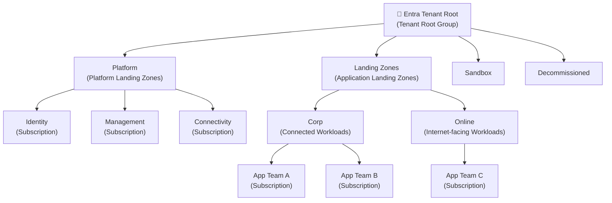
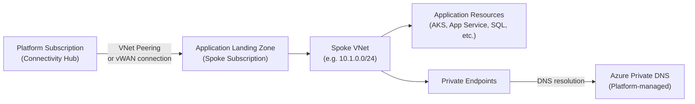
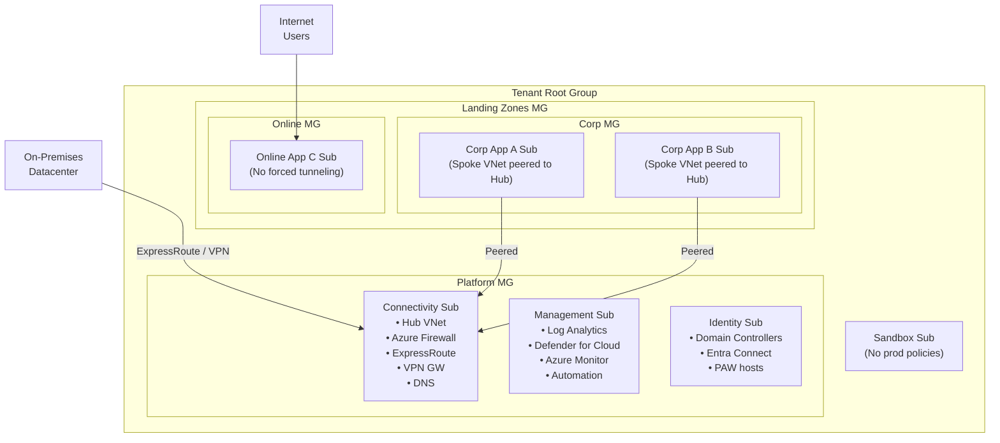
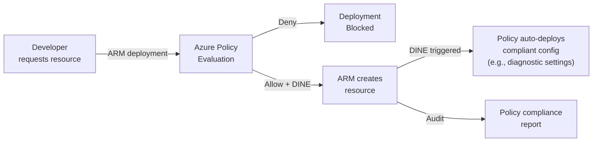
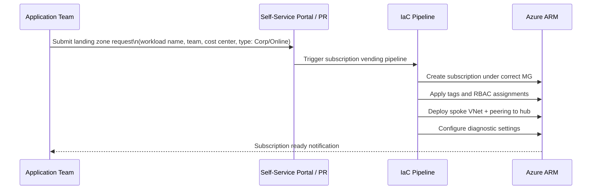

# Azure Landing Zones

> **General Pattern**: [Enterprise Strategic Architecture](../../architecture-general/01-enterprise-strategic-architecture/)  
> **Taxonomy**: §5.2 Cloud Governance & Landing Zones  
> **Related**: [Azure Resource Management Hierarchy](../resource-management/azure-resource-management-hierarchy.md) · [Azure Policy](../policy/) · [Microsoft Entra ID](../../security/entra-id/)

## Table of Contents

- [Overview](#overview)
- [Core Design Principles](#core-design-principles)
- [Architecture Components](#architecture-components)
  - [Management Group Hierarchy](#management-group-hierarchy)
  - [Platform Landing Zones](#platform-landing-zones)
  - [Application Landing Zones](#application-landing-zones)
- [ALZ Reference Architecture](#alz-reference-architecture)
- [Design Areas](#design-areas)
  - [Azure Billing and Entra Tenant](#azure-billing-and-entra-tenant)
  - [Identity and Access Management](#identity-and-access-management)
  - [Network Topology and Connectivity](#network-topology-and-connectivity)
  - [Resource Organization](#resource-organization)
  - [Security](#security)
  - [Management and Monitoring](#management-and-monitoring)
  - [Governance and Compliance](#governance-and-compliance)
  - [Platform Automation and DevOps](#platform-automation-and-devops)
- [Landing Zone Types](#landing-zone-types)
- [Implementation Approaches](#implementation-approaches)
- [Policy-Driven Governance](#policy-driven-governance)
- [Subscription Vending](#subscription-vending)
- [Hub-and-Spoke vs Virtual WAN](#hub-and-spoke-vs-virtual-wan)
- [Comparison: ALZ vs Manual Setup](#comparison-alz-vs-manual-setup)
- [Practice Questions](#practice-questions)

---

## Overview

An **Azure Landing Zone** is a pre-configured, scalable cloud environment that provides the foundational infrastructure, governance, security, and networking required to host workloads in Azure. It operationalises Microsoft's Cloud Adoption Framework (CAF) by translating strategy and planning into a deployable, repeatable architecture.

Landing Zones answer the question: *"What must be true before an application team can safely deploy workloads into Azure?"*

Key goals:

| Goal | Description |
|------|-------------|
| **Scalability** | Support many subscriptions and workloads without re-architecture |
| **Security baseline** | Enforce security controls before workloads arrive |
| **Policy guardrails** | Prevent misconfiguration through Azure Policy |
| **Autonomy with governance** | Application teams self-serve within guardrails |
| **Consistency** | Repeatable patterns for networking, identity, monitoring |

---

## Core Design Principles

The Azure Landing Zone architecture is built on eight design principles from the CAF:

1. **Subscription democratization** — Subscriptions are the unit of management and scale. Each workload or team gets its own subscription.
2. **Policy-driven governance** — Azure Policy enforces and audits compliance automatically, not through manual processes.
3. **Single control and management plane** — All operations go through Azure Resource Manager (ARM); avoid fragmented tooling.
4. **Application-centric service model** — The platform team enables self-service for application teams without blocking them.
5. **Azure-native design and alignment** — Prefer Azure-native services (Monitor, Defender, Policy) over third-party equivalents where feasible.
6. **Align Azure-native design and roadmap** — Architecture decisions should accommodate Azure product evolution.
7. **Democratize subscriptions** — Remove subscription limits as a governance concern; use management groups and policies instead.
8. **Define your own path** — The ALZ is prescriptive guidance, not a rigid requirement; adapt to organisational needs.

---

## Architecture Components

### Management Group Hierarchy

The management group hierarchy is the backbone of an Azure Landing Zone. It provides a governance scope above the subscription level.

| Management Group | Purpose |
|-----------------|---------|
| **Tenant Root Group** | Top-level scope; avoid assigning policies here unless globally applicable |
| **Platform** | Subscriptions managed by the platform/cloud team |
| **Identity** | Active Directory Domain Services, Entra Connect, privileged identity |
| **Management** | Log Analytics workspace, Azure Monitor, Automation, Update Management |
| **Connectivity** | Hub VNet or Virtual WAN, Azure Firewall, ExpressRoute, VPN Gateway, DNS |
| **Landing Zones** | Application workload subscriptions |
| **Corp** | Workloads requiring private connectivity to on-premises or platform services |
| **Online** | Internet-facing workloads; isolated from corporate network by default |
| **Sandbox** | Experimental subscriptions with relaxed policies; no production use |
| **Decommissioned** | Subscriptions pending deletion; policies restrict new resource creation |

---

### Platform Landing Zones

Platform Landing Zones are managed by the **platform team** (cloud centre of excellence / cloud ops). They provide shared services consumed by application landing zones.

| Subscription | Key Resources |
|-------------|--------------|
| **Connectivity** | Hub VNet, Azure Firewall, ExpressRoute Gateway, VPN Gateway, Azure DNS Private Resolver, DDoS Protection Plan |
| **Management** | Log Analytics Workspace, Azure Monitor, Azure Automation, Microsoft Defender for Cloud (central workspace) |
| **Identity** | Active Directory Domain Controllers, Entra Connect, Azure AD DS (if required) |

---

### Application Landing Zones

Application Landing Zones are subscriptions provisioned for workload teams. The platform team creates and configures them; the application team owns the workload resources inside.

---

## ALZ Reference Architecture

The full ALZ reference architecture combines all components into a hub-and-spoke or Virtual WAN topology:

---

## Design Areas

The ALZ methodology defines eight critical design areas. Each must be addressed to produce a complete landing zone.

### Azure Billing and Entra Tenant

- Single Entra tenant per organisation is the recommended starting point.
- Billing account (MCA or EA) maps to the root management group.
- Multiple tenants are supported but add operational complexity (Lighthouse required for cross-tenant management).

### Identity and Access Management

- **Entra ID** is the primary identity provider.
- Privileged Identity Management (PIM) for Just-In-Time access.
- RBAC assigned at management group or subscription scope (never individual resources except exceptions).
- Recommended roles: `Owner` for platform team on platform subscriptions; `Contributor` or custom roles for application teams on their subscriptions.
- Emergency break-glass accounts stored securely with MFA exception.

### Network Topology and Connectivity

Two supported topologies:

| Topology | Best For |
|----------|---------|
| **Hub-and-Spoke (VNet Peering)** | Organisations already using Azure Firewall or NVAs; finer control over routing |
| **Azure Virtual WAN** | Large-scale, multi-region deployments; simplified any-to-any connectivity; managed by Microsoft |

Common network controls enforced via policy:
- No public IP addresses on VMs (unless exempted).
- All traffic to on-premises routed through the hub firewall (forced tunnelling).
- Private endpoints for PaaS services; public access disabled.
- Azure Private DNS Zones centrally managed in the connectivity subscription.

### Resource Organization

- One subscription per workload/environment (prod, nonprod may use separate subscriptions).
- Resource groups organised by lifecycle (deploy and delete together).
- Naming convention enforced via Azure Policy (e.g., `deny` effect for non-compliant names, or `audit`).
- Tags enforced: `environment`, `costCenter`, `owner`, `workload`.

### Security

Security baseline is enforced before any workload is deployed:

- **Microsoft Defender for Cloud** enabled across all subscriptions (Defender plans selected by workload type).
- **Microsoft Sentinel** connected to the central Log Analytics workspace.
- Security policies assigned at the Landing Zones management group.
- **Azure Security Benchmark** (or NIST/ISO 27001 built-ins) assigned as policy initiative.
- Just-In-Time VM access, disk encryption, and TLS enforcement via policy.

### Management and Monitoring

- Central **Log Analytics Workspace** in the Management subscription.
- All subscriptions configured to send diagnostics and activity logs to central workspace.
- **Azure Monitor** alerts and dashboards for platform health.
- **Azure Automation / Update Management** for OS patching.
- **Azure Backup** policies assigned via policy (enforce backup on VMs, SQL, etc.).

### Governance and Compliance

Policies are the primary enforcement mechanism (see [Policy-Driven Governance](#policy-driven-governance)):

- `Deny` — blocks non-compliant resource creation (e.g., disallowed VM SKUs, public IPs).
- `DeployIfNotExists (DINE)` — auto-remediates (e.g., installs monitoring agent if missing).
- `Audit` — reports without blocking.

Azure Policy initiatives used in ALZ:

| Initiative | Scope |
|-----------|-------|
| ALZ baseline (Microsoft-provided) | Landing Zones MG |
| Security benchmark | Landing Zones MG |
| Corp network controls | Corp MG |
| Sandbox (relaxed) | Sandbox MG |

### Platform Automation and DevOps

- Landing zones provisioned via **Infrastructure as Code** (Bicep, Terraform, or ARM templates).
- **ALZ Accelerator** (Bicep or Terraform modules) is the Microsoft-recommended starting point.
- Subscription vending automated through a pipeline (see [Subscription Vending](#subscription-vending)).
- Changes to platform configuration go through PR review, not manual portal clicks.

---

## Landing Zone Types

| Type | Description | Who Manages | Example |
|------|-------------|-------------|---------|
| **Platform** | Shared services used by all app LZs | Platform / Cloud Ops team | Connectivity, Management, Identity subscriptions |
| **Application – Corp** | Connected workloads needing private access | App team (within guardrails) | Internal line-of-business apps, SAP, databases |
| **Application – Online** | Internet-facing workloads, no forced tunnelling | App team (within guardrails) | Public APIs, e-commerce, SaaS products |
| **Sandbox** | Exploration and experimentation | Individual developers/teams | PoC, training, spike work |

---

## Implementation Approaches

### ALZ Accelerator (Recommended)

Microsoft publishes two official accelerator options:

| Accelerator | Language | Repository |
|-------------|----------|-----------|
| Azure Landing Zones – Bicep | Bicep | [Azure/ALZ-Bicep](https://github.com/Azure/ALZ-Bicep) |
| Azure Landing Zones – Terraform | Terraform | [Azure/terraform-azurerm-caf-enterprise-scale](https://github.com/Azure/terraform-azurerm-caf-enterprise-scale) |

Both deploy the full management group hierarchy, policy assignments, platform subscriptions, and networking in a repeatable, auditable way.

### Azure Portal Deployment (Quick Start)

Available through the Azure Portal under **Management Groups > Deployment** for smaller organisations or PoC scenarios. Less suitable for production due to lack of version control.

### Custom Build

Build management group hierarchy, policies, and networking from scratch using ARM/Bicep/Terraform. Appropriate when the ALZ accelerator does not match organisational constraints, but requires significantly more effort.

---

## Policy-Driven Governance

ALZ relies heavily on Azure Policy to enforce the platform contract. Key patterns:

**DeployIfNotExists (DINE)** policies are the key enabler of self-healing compliance — they ensure that even if a developer doesn't configure monitoring or security settings, the platform adds them automatically after deployment.

---

## Subscription Vending

Subscription vending is the automated process by which application teams request and receive a fully configured subscription (landing zone).

Vending typically takes minutes with automation. Without it, it can take days or weeks.

---

## Hub-and-Spoke vs Virtual WAN

| Dimension | Hub-and-Spoke (Manual) | Azure Virtual WAN |
|-----------|----------------------|-------------------|
| **Complexity** | Higher — manage peerings, route tables, UDRs manually | Lower — Microsoft manages routing fabric |
| **Multi-region** | Requires per-region hub + global peering | Built-in multi-region any-to-any routing |
| **Firewall integration** | Azure Firewall in hub VNet | Azure Firewall in Secured vWAN Hub |
| **Branch connectivity** | VPN Gateway or ExpressRoute in hub VNet | Native SD-WAN and partner integrations |
| **Cost** | Pay for VNet peering bandwidth + firewall | vWAN hub fee + firewall + peering bandwidth |
| **Best for** | Single-region or existing hub-spoke investments | New large-scale or multi-region deployments |

---

## Comparison: ALZ vs Manual Setup

| Aspect | Azure Landing Zones | Manual / Ad-hoc |
|--------|--------------------|--------------------|
| **Time to first workload** | Days (with accelerator) | Weeks to months |
| **Governance enforcement** | Policy-driven, automatic | Manual, inconsistent |
| **Scalability** | Designed for hundreds of subscriptions | Degrades quickly |
| **Security baseline** | Applied before workloads deploy | Retrofitted after issues arise |
| **Repeatability** | IaC-backed, version-controlled | Often undocumented |
| **Compliance** | Built-in initiative assignments | Requires manual mapping |

---

## Practice Questions

1. What is the difference between a **Platform Landing Zone** and an **Application Landing Zone**?
2. Why is the **Connectivity subscription** separated from the Management subscription?
3. What Azure Policy effect should be used to automatically configure diagnostic settings on newly created resources?
4. When should you choose **Azure Virtual WAN** over a manual hub-and-spoke topology?
5. What is **subscription vending** and why does it matter at scale?
6. A developer deploys a VM without a monitoring agent. Which policy effect would automatically install the agent without rejecting the deployment?
7. Why are policies assigned at the **management group** level rather than individual subscriptions?
8. What is the purpose of the **Sandbox** management group and how do its policies differ from the Landing Zones group?
