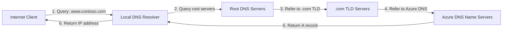
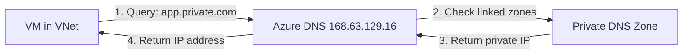
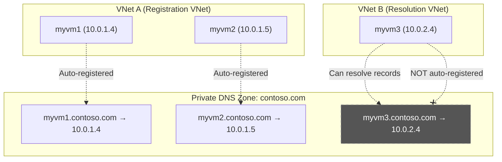
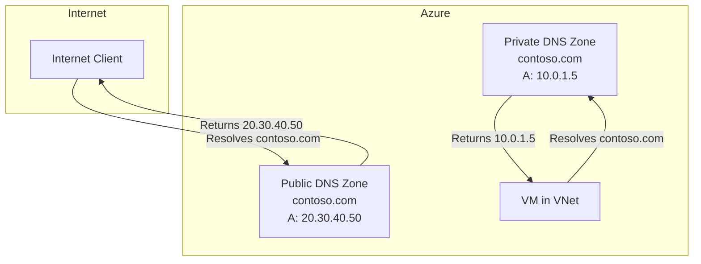

# Azure DNS

## Overview

Azure DNS is a hosting service for DNS domains that provides name resolution using Microsoft Azure infrastructure. By hosting your domains in Azure, you can manage your DNS records using the same credentials, APIs, tools, and billing as your other Azure services.

## Key Features

- **Reliability and performance**: DNS domains are hosted on Azure's global network of DNS name servers using Anycast networking
- **Security**: Integration with Azure Role-Based Access Control (RBAC), activity logs, and resource locking
- **Ease of use**: Manage DNS records using Azure portal, PowerShell, Azure CLI, or REST API
- **Private DNS zones**: Resolve names within a virtual network without custom DNS solution
- **Alias records**: Support for alias record sets to point directly to Azure resources

## Azure DNS Zone Types

### Public DNS Zones

Public DNS zones host DNS records for domains that are accessible from the internet. These zones enable internet-based clients to resolve domain names to IP addresses.

**Use Cases:**
- Hosting website domains
- Email server DNS records
- Public-facing applications
- API endpoints

### Private DNS Zones

Private DNS zones provide name resolution within Azure virtual networks without requiring custom DNS infrastructure.

**Use Cases:**
- Internal application name resolution
- Private endpoint DNS resolution
- Cross-VNet communication
- Hybrid cloud scenarios

## Public Azure DNS Zone Delegation

### Overview

To make DNS records in an Azure DNS zone resolvable from the internet, you must delegate the domain to Azure DNS name servers. This delegation tells the global DNS system that Azure DNS is authoritative for your domain.

### Domain Delegation Process

#### Step 1: Create a Public Azure DNS Zone

When you create a public Azure DNS zone in Azure, Azure automatically:
- Creates a Start of Authority (SOA) record
- Assigns a set of name servers (NS records)
- Provides you with the Azure DNS name servers for your zone

```bash
# Create a public DNS zone
az network dns zone create \
  --resource-group MyResourceGroup \
  --name contoso.com
```

#### Step 2: Obtain Azure DNS Name Servers

After creating the zone, retrieve the assigned name servers:

```bash
# Get the name servers for your zone
az network dns zone show \
  --resource-group MyResourceGroup \
  --name contoso.com \
  --query nameServers
```

Example output:
```
[
  "ns1-01.azure-dns.com",
  "ns2-01.azure-dns.net",
  "ns3-01.azure-dns.org",
  "ns4-01.azure-dns.info"
]
```

#### Step 3: Update Domain Registrar NS Records

**This is the critical step for internet resolution:**

1. Log in to your domain registrar (where you purchased the domain)
2. Navigate to DNS management or name server settings
3. Replace the existing name servers with the Azure DNS name servers
4. Save the changes

**Important:** The delegation must be done at the domain registrar level. Creating or modifying NS records within the Azure DNS zone itself does not enable internet resolution.

### Delegation Verification

After updating the registrar, verify the delegation:

```bash
# Check NS records from public DNS
nslookup -type=NS contoso.com

# Or use dig
dig NS contoso.com
```

The results should show the Azure DNS name servers you configured.

### Common Misconceptions

| Action | Effect | Sufficient for Internet Resolution? |
|--------|--------|-------------------------------------|
| Create SOA record in Azure DNS zone | Azure creates this automatically | ❌ No - SOA defines authority but doesn't delegate |
| Create NS records in Azure DNS zone | Defines child zone delegation within Azure | ❌ No - Must delegate at registrar |
| **Modify NS records at domain registrar** | **Delegates domain to Azure DNS** | ✅ **Yes - This enables internet resolution** |
| Modify SOA record at domain registrar | Changes zone authority metadata | ❌ No - Doesn't delegate the domain |

### DNS Records in Azure DNS

Once delegation is complete, you can create various record types:

#### Common Record Types

| Record Type | Purpose | Example |
|-------------|---------|---------|
| **A** | Map domain to IPv4 address | `www.contoso.com` → `20.30.40.50` |
| **AAAA** | Map domain to IPv6 address | `www.contoso.com` → `2001:0db8::1` |
| **CNAME** | Alias one name to another | `blog.contoso.com` → `contoso.azurewebsites.net` |
| **MX** | Mail exchange servers | `contoso.com` → `mail.contoso.com` (priority 10) |
| **TXT** | Text records for verification | SPF, DKIM, domain verification |
| **NS** | Delegate subdomain to other name servers | `sub.contoso.com` → other name servers |
| **SRV** | Service location records | Service discovery |
| **PTR** | Reverse DNS lookup | IP to domain mapping |

> **Exam Note**: Watch out for trick record types like **AA** or **AAA** — these do not exist in the DNS standard. The IPv6 record type is **AAAA** (four A's), not AAA (three A's).

### Subdomain Delegation

Subdomain delegation allows you to assign responsibility for a portion of your DNS namespace to different DNS servers. This is useful when different teams or departments need to manage their own DNS records independently.

#### How Subdomain Delegation Works

To delegate a subdomain (e.g., `research.adatum.com`) within an Azure DNS zone (`adatum.com`), you create NS (Name Server) records in the parent zone that point to the name servers responsible for the subdomain.

**Example: Delegating research.adatum.com**

1. **Create a separate DNS zone for the subdomain** (if delegating to another Azure DNS zone):
   ```bash
   az network dns zone create \
     --resource-group MyResourceGroup \
     --name research.adatum.com
   ```

2. **Get the name servers for the subdomain zone**:
   ```bash
   az network dns zone show \
     --resource-group MyResourceGroup \
     --name research.adatum.com \
     --query nameServers
   ```

3. **Create NS records in the parent zone** (adatum.com):
   ```bash
   az network dns record-set ns create \
     --resource-group MyResourceGroup \
     --zone-name adatum.com \
     --name research
   
   az network dns record-set ns add-record \
     --resource-group MyResourceGroup \
     --zone-name adatum.com \
     --record-set-name research \
     --nsdname ns1-01.azure-dns.com
   ```

4. **Repeat for all name servers** assigned to the subdomain zone.

**Result:** Queries for `*.research.adatum.com` will be directed to the name servers specified in the NS records, which are authoritative for the subdomain.

#### Subdomain Delegation vs. Other Record Types

| Record Type | Purpose | Delegates Subdomain? |
|-------------|---------|---------------------|
| **NS (Name Server)** | Points to DNS servers authoritative for subdomain | ✅ Yes - This is subdomain delegation |
| **A (Address)** | Maps specific hostname to IP address | ❌ No - Only resolves that specific name |
| **Wildcard A (*.subdomain)** | Maps all unspecified names under subdomain to IP | ❌ No - Resolves names but doesn't delegate authority |
| **CNAME (Canonical Name)** | Creates alias to another domain name | ❌ No - Only creates an alias |
| **PTR (Pointer)** | Reverse DNS lookup (IP to domain) | ❌ No - Used for reverse lookups only |
| **SOA (Start of Authority)** | Defines zone administrative information | ❌ No - Metadata only, doesn't delegate |

#### Alias Records

Azure DNS supports alias record sets that can point directly to Azure resources:

- **Azure Public IP addresses**
- **Azure Traffic Manager profiles**
- **Azure CDN endpoints**
- **Another record set within the same DNS zone**

**Benefits of Alias Records:**
- Automatically update when the IP address of the Azure resource changes
- Prevent dangling DNS records
- Simplify DNS management for Azure resources

```bash
# Create an alias record pointing to a public IP
az network dns record-set a create \
  --resource-group MyResourceGroup \
  --zone-name contoso.com \
  --name www \
  --target-resource /subscriptions/{subscription-id}/resourceGroups/{rg}/providers/Microsoft.Network/publicIPAddresses/{ip-name}
```

## DNS Resolution Flow

### Public DNS Resolution



### Private DNS Resolution



## Exam Scenario: DNS Zone Internet Resolution

### Question

You have a registered DNS domain named `contoso.com`.

You create a public Azure DNS zone named `contoso.com`.

You need to ensure that records created in the `contoso.com` zone are resolvable from the internet.

**What should you do?**

A. Create the SOA record in contoso.com  
B. Create NS records in contoso.com  
C. **Modify the NS records in the DNS domain registrar** ✅  
D. Modify the SOA record in the DNS domain registrar

### Answer: C - Modify the NS records in the DNS domain registrar

### Explanation

To ensure that records in the Azure DNS zone `contoso.com` are resolvable from the internet, you need to **delegate the domain** `contoso.com` to the Azure DNS name servers.

**Why each option is correct or incorrect:**

#### ❌ Option A: Create the SOA record in contoso.com
Azure DNS **automatically creates an SOA record** for your zone when you create it. There is no need to manually create it. The SOA record defines the authoritative server for the zone but does not handle internet resolution or domain delegation.

#### ❌ Option B: Create NS records in contoso.com
This refers to adding NS records **within the Azure DNS zone itself**, which is used for delegating subdomains (e.g., delegating `sub.contoso.com` to other name servers). This is **not sufficient** for making the parent domain resolvable from the internet. The delegation must be done at the domain registrar.

#### ✅ Option C: Modify the NS records in the DNS domain registrar
**This is the correct answer.** You must update the name server (NS) records at your domain registrar to point to the Azure DNS name servers. This delegates the responsibility for DNS resolution of `contoso.com` to Azure DNS, making it the authoritative source for the domain on the internet.

**Steps:**
1. Create a public Azure DNS zone (already done)
2. Obtain the Azure DNS name servers from the zone
3. **Update the NS records at your domain registrar** with the Azure DNS name servers
4. Wait for DNS propagation (typically 24-48 hours, but often faster)

#### ❌ Option D: Modify the SOA record in the DNS domain registrar
The SOA (Start of Authority) record defines metadata about the zone (primary name server, email of domain administrator, refresh intervals, etc.) but does not delegate the domain. Modifying it is not the solution for enabling internet resolution.

### Key Takeaway

**Domain delegation requires updating NS records at the registrar level.** This tells the global DNS hierarchy that Azure DNS is authoritative for your domain.

## Exam Scenario: Subdomain Delegation

### Question

You have an Azure DNS zone named `adatum.com`.

You need to delegate a subdomain named `research.adatum.com` to a different DNS server in Azure.

**What should you do?**

A. Create an A record named *.research in the adatum.com zone  
B. Create a PTR record named research in the adatum.com zone  
C. **Create an NS record named research in the adatum.com zone** ✅  
D. Modify the SOA record of adatum.com

### Answer: C - Create an NS record named research in the adatum.com zone

### Explanation

To delegate a subdomain such as `research.adatum.com` to a different DNS server, you need to **create a Name Server (NS) record** for the subdomain in the parent zone (`adatum.com`). This record specifies the DNS servers responsible for the subdomain.

**Why each option is correct or incorrect:**

#### ❌ Option A: Create an A record named *.research in the adatum.com zone
Wildcard A records (e.g., `*.research.adatum.com`) are used to resolve **any unspecified subdomain** of `research.adatum.com` to a specific IP address. For example, `test.research.adatum.com`, `app.research.adatum.com`, etc., would all resolve to the same IP.

However, this does **not delegate the subdomain** to another DNS server. It only creates DNS resolution for names under that pattern but doesn't transfer authority to different name servers.

#### ❌ Option B: Create a PTR record named research in the adatum.com zone
PTR (Pointer) records are used for **reverse DNS lookups**, which map IP addresses back to domain names (e.g., `192.168.1.1` → `server.adatum.com`). They are completely unrelated to delegating a subdomain to other name servers.

PTR records are typically used in reverse lookup zones (e.g., `1.168.192.in-addr.arpa`), not in forward lookup zones like `adatum.com`.

#### ✅ Option C: Create an NS record named research in the adatum.com zone
**This is the correct answer.** Creating an NS record named `research` in the `adatum.com` zone delegates the subdomain `research.adatum.com` to different DNS servers.

**How it works:**
1. You create a separate DNS zone for `research.adatum.com` (either in Azure DNS or another DNS provider)
2. You obtain the name servers for that zone
3. You create NS records in the parent zone (`adatum.com`) with the name `research`, pointing to those name servers
4. Now, any query for `*.research.adatum.com` will be directed to the delegated name servers

**Example:**
```bash
# Create NS record in adatum.com zone
az network dns record-set ns create \
  --resource-group MyResourceGroup \
  --zone-name adatum.com \
  --name research

# Add name server records
az network dns record-set ns add-record \
  --resource-group MyResourceGroup \
  --zone-name adatum.com \
  --record-set-name research \
  --nsdname ns1-research.azure-dns.com
```

#### ❌ Option D: Modify the SOA record of adatum.com
The SOA (Start of Authority) record defines **administrative information** for the DNS zone, including:
- Primary name server for the zone
- Email address of the domain administrator
- Serial number for zone updates
- Refresh, retry, and expiry timers

Modifying the SOA record does **not facilitate subdomain delegation**. It only changes metadata about the parent zone itself.

### Key Takeaway

**Subdomain delegation within Azure DNS requires creating NS records in the parent zone.** This is different from domain delegation to Azure DNS (which requires updating the registrar).

| Delegation Type | Where to Create NS Records | Purpose |
|----------------|---------------------------|---------|
| **Domain → Azure DNS** | At domain registrar | Make Azure DNS authoritative for entire domain |
| **Subdomain → Different DNS** | In parent Azure DNS zone | Delegate subdomain to different name servers |

## Exam Scenario: VNet Name Resolution Without Custom DNS

### Question

You are tasked with designing name resolution for resources within an Azure Virtual Network (VNet). Which Azure service allows VMs within a VNet to resolve domain names without specifying custom DNS settings?

A. Azure Private DNS  
B. Azure Public DNS  
C. Azure DNS Private Link Service  
D. **Azure DNS** ✅

### Answer: D - Azure DNS

### Explanation

**Azure DNS** (also known as Azure-provided DNS) is the built-in DNS service that Azure automatically provides to all VMs within a VNet. It uses the special IP address `168.63.129.16` and requires **no custom configuration** — it works out of the box.

**Why each option is correct or incorrect:**

| Option | Verdict | Explanation |
|--------|---------|-------------|
| **A** | ❌ Incorrect | **Azure Private DNS** allows you to create custom private DNS zones for name resolution within VNets. However, it requires explicit configuration — you must create a Private DNS Zone and link it to the VNet. It does not work automatically without custom settings. |
| **B** | ❌ Incorrect | **Azure Public DNS** is a recursive DNS resolver service for public domain names on the internet. It does not automatically enable VMs within a VNet to resolve internal domain names. |
| **C** | ❌ Incorrect | **Azure DNS Private Link Service** allows you to access Azure DNS from a virtual network using a private endpoint. It is used for specific scenarios like private endpoint DNS resolution and requires explicit setup. |
| **D** | ✅ Correct | **Azure DNS** (Azure-provided DNS at `168.63.129.16`) is the built-in DNS service that automatically resolves domain names for VMs within a VNet without any custom DNS configuration. It provides name resolution for VM-to-VM communication within the same VNet and resolution of Azure service endpoints. |

### Key Concepts

**Azure-provided DNS (`168.63.129.16`):**
- Automatically available to all VMs in a VNet
- No configuration required
- Resolves VM names within the same VNet
- Resolves Azure service FQDNs
- Resolves names in linked Private DNS Zones
- Only accessible from within Azure VNets (not from on-premises)

**When You Need More Than Azure-provided DNS:**

| Scenario | Solution |
|----------|----------|
| Default name resolution within a VNet | Azure DNS (built-in, no config needed) |
| Custom domain names within a VNet | Azure Private DNS Zones |
| Cross-VNet name resolution | Azure Private DNS Zones linked to multiple VNets |
| On-premises to Azure name resolution | DNS forwarder VM + Private DNS Zones |
| Advanced hybrid DNS resolution | Azure DNS Private Resolver |

> **Exam Tip**: When a question asks about DNS resolution that works "without specifying custom DNS settings" or "automatically", the answer is **Azure DNS** (the built-in Azure-provided DNS). Azure Private DNS requires explicit zone creation and VNet linking.
>
> **Domain**: Design and implement core networking infrastructure (20–25%)
>
> **Reference**: [Name resolution for resources in Azure virtual networks | Microsoft Learn](https://learn.microsoft.com/en-us/azure/virtual-network/virtual-networks-name-resolution-for-vms-and-role-instances)

## Private DNS Zone Virtual Network Links and Autoregistration

### Overview

When you link an Azure Private DNS Zone to a Virtual Network, you create a **virtual network link**. This link determines how VMs in the VNet interact with the Private DNS Zone. There are two types of virtual network links:

| Link Type | Autoregistration | Behavior |
|-----------|-----------------|----------|
| **Resolution VNet** | Disabled (`--registration-enabled false`) | VMs can **resolve** records in the zone, but DNS records are NOT automatically created |
| **Registration VNet** | Enabled (`--registration-enabled true`) | VMs automatically get DNS A records created in the zone; also serves as a resolution VNet |

### Autoregistration

When you enable **autoregistration** on a virtual network link, the VNet becomes a **registration virtual network** for that Private DNS Zone. This means:

- **New VMs** deployed in the VNet will automatically have a DNS A record created in the Private DNS Zone
- **Existing VMs** already deployed in the VNet will also get DNS records created automatically
- DNS records are **automatically removed** when VMs are deleted or deallocated
- Records are created using the VM's hostname and private IP address (e.g., `myvm.contoso.com` → `10.0.1.4`)

```bash
# Create a virtual network link WITH autoregistration enabled
az network private-dns link vnet create \
  --resource-group MyResourceGroup \
  --zone-name contoso.com \
  --name myRegistrationLink \
  --virtual-network myVNet \
  --registration-enabled true

# Create a virtual network link WITHOUT autoregistration (resolution only)
az network private-dns link vnet create \
  --resource-group MyResourceGroup \
  --zone-name contoso.com \
  --name myResolutionLink \
  --virtual-network myOtherVNet \
  --registration-enabled false
```

### Autoregistration Constraints

| Constraint | Detail |
|-----------|--------|
| **One registration zone per VNet** | A virtual network can be linked as a registration VNet to **only one** Private DNS Zone |
| **Multiple resolution zones per VNet** | A virtual network can be linked as a resolution VNet to **multiple** Private DNS Zones |
| **Multiple VNets per zone** | A Private DNS Zone can have multiple registration and resolution VNets linked to it |
| **Record format** | Autoregistered records use the VM name as the hostname (e.g., `vmname.privatezone.com`) |
| **IPv4 only** | Autoregistration creates A records (IPv4). AAAA records (IPv6) are not autoregistered |

### How It Works



> **Note**: In the diagram above, VNet B is a resolution VNet — VM3 can resolve records in the zone but does NOT get an autoregistered record. Only VMs in VNet A (the registration VNet) get automatic DNS records.

## Exam Scenario: Autoregistration with Private DNS Zone

### Question

Is it possible to automatically create DNS records for all VMs deployed in a VNet while linking a Private DNS Zone and a virtual network?

A. Yes  
B. No

### Answer: A - Yes

### Explanation

When you create a link between a Private DNS Zone and a VNet, there is an option to **enable autoregistration**. If you enable this setting, the VNet becomes a **registration VNet** for the Private DNS Zone. This means:

- Any **new virtual machines** deployed in the VNet will automatically have a DNS record created in the zone
- Any **existing virtual machines** already in the VNet will also get DNS records created
- Records are automatically removed when VMs are deleted

**In the Azure Portal**, the autoregistration option appears as the **"Enable auto registration"** checkbox when creating a virtual network link.

**In Azure CLI**, it is controlled by the `--registration-enabled` parameter:

```bash
az network private-dns link vnet create \
  --resource-group MyResourceGroup \
  --zone-name private.contoso.com \
  --name myAutoRegLink \
  --virtual-network myVNet \
  --registration-enabled true
```

> **Key Point**: Without enabling autoregistration, the virtual network link only provides **resolution** capability — VMs can look up records in the zone, but no records are automatically created for them.
>
> **Domain**: Design and implement core networking infrastructure (20–25%)
>
> **Reference**: [What is a virtual network link subresource of Azure DNS private zones | Microsoft Learn](https://learn.microsoft.com/en-us/azure/dns/private-dns-virtual-network-links)

### Custom DNS Settings — No Automatic Propagation

> **Key Concept**: Configuring custom DNS servers at the **VNet level** does **not** automatically update DNS settings on existing virtual machines, role instances, or NICs.

| Action | Result |
|--------|--------|
| Set custom DNS on VNet | New VMs/NICs created after the change will use it |
| Existing running VMs | **Not updated** — must be stopped (deallocated) and restarted |
| Per-NIC DNS override | Takes precedence over VNet-level DNS; must be configured manually per NIC |
| Role instances | Must be redeployed to pick up new DNS settings |

**DNS Setting Precedence (highest to lowest):**

```
NIC-level DNS setting        ← Overrides everything
        ↓
VNet-level DNS setting       ← Used if NIC has no override
        ↓
Azure-provided DNS (168.63.129.16)  ← Default fallback
```

> **Exam Tip**: Changing the VNet's DNS settings requires existing VMs to be **stopped (deallocated) and restarted** to pick up the new configuration. This is a common exam trap — Azure does NOT push DNS changes to running VMs automatically.

## Split-Horizon DNS

### Overview

**Split-Horizon DNS** (also known as **split-brain DNS** or **split-view DNS**) is a DNS configuration where the **same domain name resolves to different IP addresses** depending on whether the query originates from inside a private network (intranet) or from the public internet.

In Azure, this is achieved by creating **both** a Public DNS zone and a Private DNS zone with the **same domain name**:

- **Internet users** → query the **Public DNS zone** → receive the public IP address
- **VNet users** → query the **Private DNS zone** → receive the private IP address

### How It Works in Azure



**Setup Steps:**

1. **Create a Public DNS zone** for `contoso.com` — delegates the domain on the internet
2. **Create a Private DNS zone** with the same name `contoso.com`
3. **Link the Private DNS zone** to the target VNet(s)
4. **Add records** to each zone with different values:
   - Public zone: `app.contoso.com` → `20.30.40.50` (public IP / load balancer)
   - Private zone: `app.contoso.com` → `10.0.1.5` (private IP of the backend)

```bash
# Create public zone
az network dns zone create \
  --resource-group MyResourceGroup \
  --name contoso.com

# Create private zone with the same name
az network private-dns zone create \
  --resource-group MyResourceGroup \
  --name contoso.com

# Link private zone to VNet
az network private-dns link vnet create \
  --resource-group MyResourceGroup \
  --zone-name contoso.com \
  --name myVNetLink \
  --virtual-network myVNet \
  --registration-enabled false

# Public zone record (internet-facing IP)
az network dns record-set a add-record \
  --resource-group MyResourceGroup \
  --zone-name contoso.com \
  --record-set-name app \
  --ipv4-address 20.30.40.50

# Private zone record (internal IP)
az network private-dns record-set a add-record \
  --resource-group MyResourceGroup \
  --zone-name contoso.com \
  --record-set-name app \
  --ipv4-address 10.0.1.5
```

### Common Use Cases

| Use Case | Description |
|----------|-------------|
| **Private endpoints** | Public clients resolve to public IP; VNet clients resolve to private endpoint IP |
| **Internal applications** | Same FQDN serves both external users (via public LB) and internal users (via private IP) |
| **Hybrid cloud** | On-premises and Azure VNet users get internal IPs; internet users get public IPs |
| **Development/testing** | Internal users hit staging; external users hit production |

### Split-Horizon vs Other DNS Approaches

| Approach | Same Zone Name? | Different Responses? | Use Case |
|----------|----------------|---------------------|----------|
| **Split-Horizon DNS** | ✅ Yes — public + private zone with same name | ✅ Yes — internal vs external | Different resolutions for the same domain |
| **Reverse DNS** | ❌ No — maps IP → name | ❌ No — single mapping | IP-to-name lookups (PTR records) |
| **CNAME** | ❌ No — alias to another name | ❌ No — single target | Aliasing one name to another |
| **Private DNS only** | N/A — no public zone | N/A — internal only | Internal-only name resolution |

### Key Points

- The **Private DNS zone takes precedence** for VMs in linked VNets — Azure DNS resolver checks private zones first
- Both zones operate independently; records do not need to match
- Split-Horizon is commonly used alongside **Azure Private Link / Private Endpoints** where internal traffic should bypass public endpoints
- This approach does **not** require any custom DNS servers — it uses Azure's built-in DNS infrastructure

## Exam Scenario: Split-Horizon DNS

### Question

As an Azure Administrator, you are responsible for configuring Azure DNS zones for your Microsoft Entra tenant. Your objective is to ensure that Internet and Intranet users can perform different resolutions for the same domain name. What can you use to achieve this?

A. Reverse DNS  
B. Private DNS  
C. CNAME  
D. **Split-Horizon** ✅

### Answer: D - Split-Horizon

### Explanation

**Split-Horizon DNS** serves different resolutions for the same DNS zone, depending on whether the client is inside Azure's virtual networks or outside on the internet.

**Why each option is correct or incorrect:**

| Option | Verdict | Explanation |
|--------|---------|-------------|
| **A** | ❌ Incorrect | **Reverse DNS** maps IP addresses to domain names (PTR records). It does not provide different resolutions for the same domain name based on client location. |
| **B** | ❌ Incorrect | **Private DNS** alone only provides name resolution within Azure virtual networks. It does not serve different resolutions to internet users — it only resolves internally. Split-Horizon uses Private DNS **combined** with Public DNS to achieve the dual-resolution behavior. |
| **C** | ❌ Incorrect | **CNAME** (Canonical Name) creates an alias from one domain name to another. It always resolves to the same target regardless of where the query originates. |
| **D** | ✅ Correct | **Split-Horizon DNS** is the technique of serving different DNS responses for the same domain depending on the source of the query. In Azure, this is implemented by having both a Public DNS zone and a Private DNS zone with the same domain name. Internet clients resolve via the public zone; VNet clients resolve via the private zone. |

> **Exam Tip**: The key phrase is "different resolutions for the **same domain name**" — this immediately points to Split-Horizon DNS. Don't confuse this with Private DNS alone (which only handles internal resolution) or Reverse DNS (which is IP-to-name, not name-to-IP).
>
> **Domain**: Design and implement core networking infrastructure (20–25%)
>
> **Reference**: [Azure DNS Private Zones overview | Microsoft Learn](https://learn.microsoft.com/en-us/azure/dns/private-dns-overview)

## Best Practices

1. **Use alias records** when pointing to Azure resources to avoid stale DNS records
2. **Set appropriate TTL values** - Lower TTL for frequently changing records, higher for stable records
3. **Enable resource locks** on DNS zones to prevent accidental deletion
4. **Use Azure RBAC** to control who can modify DNS records
5. **Monitor DNS query analytics** using Azure Monitor
6. **Plan for DNS propagation time** when making changes (typically 24-48 hours)
7. **Use Private DNS zones** for internal Azure resources instead of custom DNS solutions
8. **Document your DNS architecture** including delegation chain and record purposes

## Limitations

- Azure DNS does not support domain registration (use domain registrars)
- DNSSEC is not currently supported
- DNS zone cannot be renamed (must delete and recreate)
- Cannot delegate root zone (@) using NS records
- Maximum 10,000 record sets per zone (can be increased)
- Maximum 20 DNS zones linked per virtual network

## Pricing

Azure DNS pricing includes:
- **Hosted DNS zone**: Per zone per month
- **DNS queries**: Per million queries

Note: First 25 hosted DNS zones and first billion queries per month are included in the base pricing.

## Related Services

- [Azure Traffic Manager](./19-azure-traffic-manager.md): DNS-based traffic routing
- [Azure Private Link](./01-networking-fundamentals.md): Requires Private DNS zones for resolution
- [Azure Front Door](./18-azure-front-door.md): Global HTTP(S) load balancer with DNS integration
- [Azure CDN](./20-azure-cdn.md): Content delivery with DNS configuration

## References

- [Azure DNS Documentation](https://learn.microsoft.com/en-us/azure/dns/)
- [Delegate a domain to Azure DNS](https://learn.microsoft.com/en-us/azure/dns/dns-delegate-domain-azure-dns)
- [DNS zones and records](https://learn.microsoft.com/en-us/azure/dns/dns-zones-records)
- [Private DNS zones](https://learn.microsoft.com/en-us/azure/dns/private-dns-overview)
