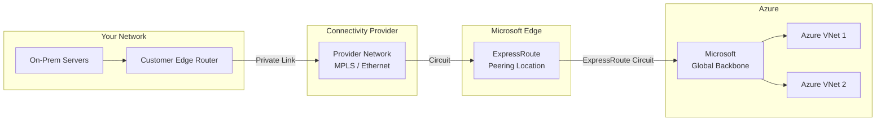
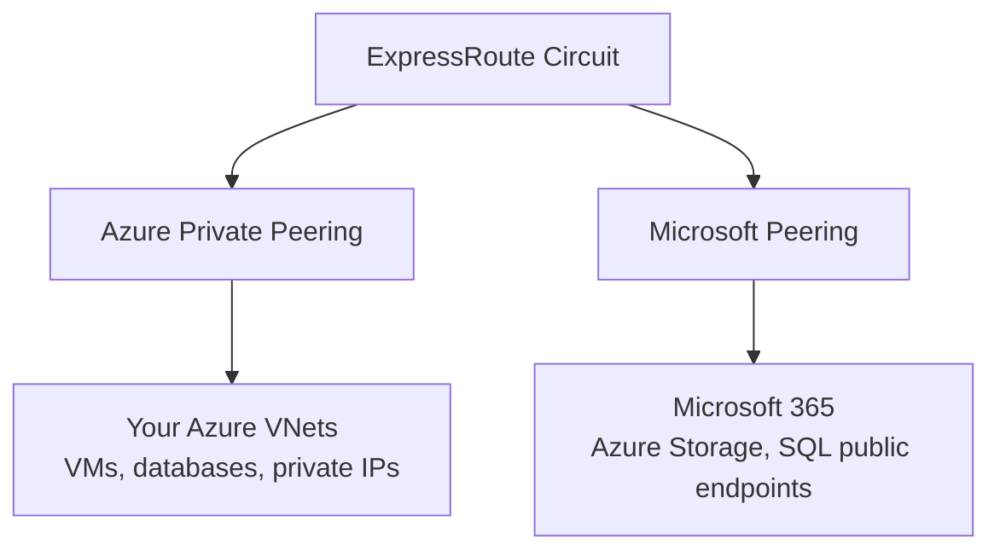
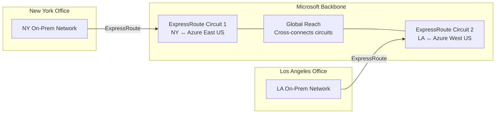
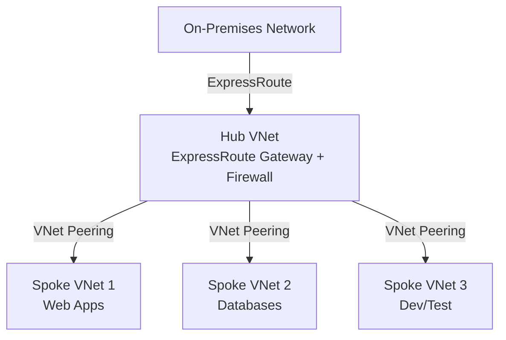

# Azure ExpressRoute & BGP Routing Guide

> **General Pattern**: [Hybrid Cloud Architecture](../../../architecture-general/05-cloud-infrastructure-platform-architecture/)
> **Taxonomy Reference**: §5 Cloud, Infrastructure & Platform Architecture (see [architecture_taxonomy_reference.md](../../../architecture-general/10-practicality-taxonomy/architecture_taxonomy_reference.md))

See [Index](./01-index.md) for overview. See also [ExpressRoute Connectivity Models](./09-express-route-models.md).

## Table of Contents

- [1. What is Azure ExpressRoute?](#1-what-is-azure-expressroute)
- [2. ExpressRoute vs VPN Gateway](#2-expressroute-vs-vpn-gateway)
- [3. How ExpressRoute Works (Step by Step)](#3-how-expressroute-works-step-by-step)
- [4. ExpressRoute Circuit and Peering Types](#4-expressroute-circuit-and-peering-types)
- [5. Connectivity Models](#5-connectivity-models)
- [6. ExpressRoute SKUs](#6-expressroute-skus)
- [7. BGP: The Routing Engine Behind ExpressRoute](#7-bgp-the-routing-engine-behind-expressroute)
- [8. ExpressRoute Global Reach](#8-expressroute-global-reach)
- [9. Multi-Site Failover with BGP](#9-multi-site-failover-with-bgp)
- [10. Common Architecture Patterns](#10-common-architecture-patterns)
- [11. Routing Configuration Options](#11-routing-configuration-options)
- [12. Key Takeaways](#12-key-takeaways)
- [13. ExpressRoute PowerShell Management](#13-expressroute-powershell-management)
- [14. References](#14-references)

---

## 1. What is Azure ExpressRoute?

Azure ExpressRoute creates a **private, dedicated network connection** between your on-premises infrastructure and Azure datacenters. Unlike a VPN, your traffic **never crosses the public internet**—it travels through a private circuit managed by a network service provider (like AT&T, Equinix, or Megaport).

**Think of it this way:**
- **VPN Gateway** = Sending a letter through the public postal system (encrypted envelope, but shared roads)
- **ExpressRoute** = Having a private highway built directly from your office to the Azure datacenter (dedicated road, no public traffic)

### Why does this matter?

| Concern | Internet/VPN | ExpressRoute |
|---------|-------------|--------------|
| **Security** | Encrypted but traverses shared internet | Private path — never touches the internet |
| **Latency** | Unpredictable — depends on internet congestion | Consistent and low — dedicated bandwidth |
| **Bandwidth** | Capped at ~10 Gbps, shared | Up to 100 Gbps, guaranteed |
| **Reliability** | Best-effort internet routing | 99.95% SLA with built-in redundancy |

### Who needs ExpressRoute?

- Organizations moving **large data volumes** to/from Azure (backups, replication, analytics)
- **Regulated industries** (healthcare, finance) with compliance requirements against using public internet
- Applications that cannot tolerate **variable latency** (real-time trading, VoIP, video)
- Enterprises with **hybrid architectures** where on-premises and Azure must behave like one network

---

## 2. ExpressRoute vs VPN Gateway

| Aspect | VPN Gateway | ExpressRoute |
|--------|-------------|--------------|
| **Connection path** | Encrypted tunnel over public internet | Private dedicated line (no internet) |
| **Max bandwidth** | Up to 10 Gbps | Up to 100 Gbps |
| **Latency** | Variable (internet-dependent) | Consistent and low |
| **Cost** | Lower (pay for gateway + egress) | Higher (circuit fee + provider fee) |
| **SLA** | 99.9% – 99.95% | 99.95% |
| **Routing protocol** | Static routes or BGP | BGP only (dynamic) |
| **Setup complexity** | Simple — configure in portal | Requires working with a connectivity provider |
| **Best for** | Dev/test, small workloads, backup connectivity | Mission-critical, enterprise, high-throughput |

> **Tip**: Many enterprises use **both**—ExpressRoute as the primary path and VPN Gateway as a failover if the circuit goes down.

---

## 3. How ExpressRoute Works (Step by Step)

Understanding ExpressRoute is easier when you see **how traffic flows** from your office to an Azure VM:

```
Step 1: Your server sends a packet destined for an Azure VM (e.g., 10.1.0.4)

Step 2: Your on-premises router uses BGP to know that 10.1.0.0/16
         is reachable via the ExpressRoute circuit

Step 3: The packet leaves your router and enters your connectivity
         provider's network (e.g., AT&T, Equinix) over a private link

Step 4: The provider forwards the packet to a Microsoft Edge router
         at an "ExpressRoute peering location" (a physical meet-me point)

Step 5: The Microsoft Edge router forwards the packet through the
         Microsoft global backbone network to the Azure region

Step 6: The packet arrives at your Azure VNet and reaches the VM
```

### Architecture diagram



**Key participants:**

| Role | Who / What | Responsibility |
|------|-----------|---------------|
| **Customer** | You | Configure on-prem routers, request circuit |
| **Connectivity Provider** | AT&T, Equinix, Megaport, etc. | Provide the physical link between your network and Microsoft Edge |
| **Microsoft** | Azure | Host the peering location, run the backbone, deliver to VNets |

---

## 4. ExpressRoute Circuit and Peering Types

An **ExpressRoute circuit** is the logical connection you provision. Each circuit supports up to two **peering types** that determine what you can reach:

### Peering types explained

| Peering Type | What You Can Reach | Use Case |
|-------------|-------------------|----------|
| **Azure Private Peering** | Resources inside your Azure VNets (VMs, databases, internal load balancers) | Most common — extends your on-prem network into Azure VNets |
| **Microsoft Peering** | Microsoft 365, Dynamics 365, Azure public services (Storage, SQL via public endpoints) | Access Microsoft SaaS and Azure PaaS services over private connection |

> **Note**: **Azure Public Peering** was deprecated in 2018 and replaced by Microsoft Peering.

### How peering works



- **Private Peering** uses private IP addresses (RFC 1918 ranges like 10.x.x.x, 172.16.x.x) — your on-prem network and Azure VNets share routing information via BGP
- **Microsoft Peering** uses public IP addresses — requires NAT and route filters to control which Microsoft services are reachable

---

## 5. Connectivity Models

There are four ways to physically connect to an ExpressRoute peering location:

| Model | Description | When to Use |
|-------|-------------|-------------|
| **CloudExchange Co-location** | Your equipment is physically in the same facility as Microsoft Edge routers (e.g., Equinix datacenter). You request a virtual cross-connect. | You already host equipment in a co-location facility |
| **Point-to-Point Ethernet** | A dedicated Ethernet link from your datacenter to the Microsoft Edge | You have your own datacenter and want a direct fiber run |
| **Any-to-Any (IPVPN/MPLS)** | Connect Azure as another "branch office" on your existing MPLS WAN | You already have an MPLS network connecting your offices |
| **ExpressRoute Direct** | Connect directly to Microsoft Edge at 10 Gbps or 100 Gbps, bypassing service providers | Ultra-high bandwidth, massive data ingestion, strict isolation needs |

> See [ExpressRoute Connectivity Models](./09-express-route-models.md) for detailed diagrams.

---

## 6. ExpressRoute SKUs

| SKU | Geographic Scope | Use Case |
|-----|-----------------|----------|
| **Local** | Access only to Azure regions near the peering location | Cost-efficient if your workloads are in nearby regions; **free egress** |
| **Standard** | Access to all Azure regions within the **same geopolitical region** (e.g., all of North America or all of Europe) | Most common choice for single-region enterprises |
| **Premium** | Access to all Azure regions **globally** + increased route limits (10,000 vs 4,000) | Multi-region enterprises, global deployments |

### Billing components

ExpressRoute billing has two parts:

1. **Circuit fee** (paid to Microsoft): Monthly charge based on bandwidth (50 Mbps to 10 Gbps) and SKU
2. **Provider fee** (paid to your connectivity provider): Varies by provider and location

| Bandwidth | Approximate Monthly Circuit Fee (Standard) |
|-----------|---------------------------------------------|
| 50 Mbps | ~$55 |
| 200 Mbps | ~$220 |
| 1 Gbps | ~$436 |
| 10 Gbps | ~$3,480 |

> **Cost tip**: The **Local SKU** has no data egress charges. If your workloads and peering location are in the same Azure region, this can save significantly on data transfer costs.

---

## 7. BGP: The Routing Engine Behind ExpressRoute

### What is BGP?

**Border Gateway Protocol (BGP)** is the routing protocol that makes ExpressRoute work. It is the same protocol that routes traffic across the entire internet. In the context of ExpressRoute, BGP allows your on-premises routers and Azure to **dynamically exchange routing information** — so both sides automatically know how to reach each other's networks.

### Why BGP instead of static routes?

| Aspect | Static Routes | BGP (Dynamic) |
|--------|--------------|---------------|
| **Route updates** | Manual — you edit routes by hand | Automatic — routers notify each other |
| **Failover** | Manual — you must detect and reconfigure | Automatic — detects failure in seconds |
| **Scalability** | Painful with many subnets | Handles thousands of routes |
| **Required for ExpressRoute?** | ❌ Not supported | ✅ Required |

### How BGP works with ExpressRoute

When you set up an ExpressRoute circuit, a BGP session is established between your on-premises router and the Microsoft Edge routers:

```
Your On-Premises Router              Microsoft Edge Router
   ASN: 65001                          ASN: 12076 (Microsoft's)
       │                                    │
       │◄──── BGP Session (TCP 179) ────────│
       │                                    │
       │ Advertises:                        │ Advertises:
       │   10.0.0.0/8   (your network)     │   10.1.0.0/16  (Azure VNet 1)
       │   172.16.0.0/16 (your branch)     │   10.2.0.0/16  (Azure VNet 2)
       │                                    │
       ▼ Result: Your router now knows      ▼ Result: Azure now knows
         how to reach Azure VNets             how to reach your networks
```

### Key BGP concepts

| Concept | Explanation |
|---------|------------|
| **ASN (Autonomous System Number)** | A unique number that identifies your network. You typically use a private ASN (64512–65534). Microsoft always uses **12076**. |
| **Route advertisement** | Each side announces which IP ranges it owns. This happens automatically via BGP. |
| **BGP session / peering** | A TCP connection (port 179) between two routers that exchanges route information. |
| **AS-Path** | The list of ASNs a route has traversed. Shorter paths are preferred — this is how BGP picks the best route. |
| **Route withdrawal** | When a network becomes unreachable, BGP removes (withdraws) its routes, triggering automatic failover to an alternative path. |

---

## 8. ExpressRoute Global Reach

### The problem

You have two offices (e.g., New York and Los Angeles), each with its own ExpressRoute circuit to Azure. By default, those two offices **cannot talk to each other** through Azure — the circuits are isolated.

### The solution: Global Reach

**ExpressRoute Global Reach** interconnects your on-premises sites through the Microsoft backbone network. Your traffic between sites travels the same private Microsoft network — never the internet.



### What Global Reach enables

| Without Global Reach | With Global Reach |
|---------------------|-------------------|
| NY ↔ Azure ✅ | NY ↔ Azure ✅ |
| LA ↔ Azure ✅ | LA ↔ Azure ✅ |
| NY ↔ LA ❌ (must use internet or separate VPN) | NY ↔ LA ✅ (via Microsoft backbone) |

### Benefits

- **Private site-to-site connectivity** without an additional VPN
- **Lower latency** than internet routing between offices
- **Simplified topology** — no need for a separate WAN between sites
- **Leverages existing circuits** — just enable Global Reach as an add-on

---

## 9. Multi-Site Failover with BGP

### The scenario

You have two on-premises sites and two Azure regions. You need traffic to **automatically reroute** if one site or circuit goes down.

### How BGP enables automatic failover

BGP uses **AS-Path prepending** to indicate preferred and backup paths:

```
Normal operation:
  Site A (Primary) → advertises routes with short AS-Path (preferred)
  Site B (Backup)  → advertises routes with longer AS-Path (less preferred)
  
  Azure picks Site A because shorter AS-Path = better route

If Site A fails:
  1. BGP detects the failure (no keepalive messages)
  2. BGP withdraws Site A's routes (within seconds)
  3. Site B's routes become the best available path
  4. Traffic automatically reroutes to Site B
  5. No manual intervention needed
```

### Why not HSRP or VRRP?

| Protocol | Scope | Purpose |
|----------|-------|---------|
| **HSRP / VRRP** | LAN only | Provides default gateway redundancy within a single local network |
| **BGP** | WAN / Cloud | Routes traffic between networks across wide areas — which is what ExpressRoute needs |

HSRP and VRRP solve a different problem (making sure your LAN devices have a backup gateway). BGP solves the problem of **routing between your entire on-premises network and Azure**.

---

## 10. Common Architecture Patterns

### Pattern 1: Hub-and-Spoke with ExpressRoute

The most common enterprise pattern. A single ExpressRoute circuit connects to a central hub VNet, which peers with spoke VNets.



**How BGP works here:**
- The hub VNet gateway advertises all spoke VNet address ranges to on-premises
- The on-premises router advertises local network ranges to Azure
- Adding a new spoke VNet automatically propagates routes via BGP

### Pattern 2: ExpressRoute + VPN Failover

Use ExpressRoute as primary and VPN Gateway as backup:

```
Primary path:   On-Prem ──ExpressRoute──→ Azure (high bandwidth, low latency)
Failover path:  On-Prem ──VPN Gateway──→ Azure  (encrypted over internet)

BGP assigns lower cost to ExpressRoute routes.
If ExpressRoute circuit fails, BGP switches to VPN path automatically.
```

### Pattern 3: Global Reach Multi-Site

```
Site A (NY) ──ExpressRoute Circuit A──→ Microsoft Backbone ←──ExpressRoute Circuit B── Site B (LA)
                                             │
                                       Global Reach
                                    Site A ↔ Site B
                                             │
                                     Azure VNets also
                                     reachable from both
```

---

## 11. Routing Configuration Options

| Method | Dynamic? | Auto Failover? | Best For |
|--------|----------|----------------|----------|
| **BGP** | ✅ Yes | ✅ Yes | ExpressRoute, multi-site, production |
| **UDR (User Defined Routes)** | ❌ No | ❌ Manual | Forcing traffic through NVA/firewall within a VNet |
| **Default system routes** | ❌ No | ❌ No | Basic intra-VNet and internet routing |

> **Note**: ExpressRoute **requires** BGP. UDRs are used *within* Azure VNets to override default routing (e.g., force traffic through a firewall), not for the ExpressRoute connection itself.

---

## 12. Key Takeaways

1. **ExpressRoute** provides a private, dedicated connection to Azure that bypasses the public internet — offering higher bandwidth, lower latency, and better reliability than VPN
2. **Peering types** determine what you can reach: Private Peering for VNets, Microsoft Peering for Microsoft 365/Azure PaaS
3. **BGP** is the required routing protocol — it enables dynamic route exchange and automatic failover
4. **Global Reach** lets your on-premises sites communicate through the Microsoft backbone without needing a separate WAN
5. **SKU choice matters**: Local for nearby regions (free egress), Standard for same geo, Premium for worldwide
6. **Common pattern**: ExpressRoute as primary + VPN Gateway as failover, with BGP managing both paths

---

## 13. ExpressRoute PowerShell Management

Azure PowerShell provides cmdlets to manage ExpressRoute circuits programmatically.

### Common commands

| Command | Purpose |
|---------|---------|
| `Get-AzExpressRouteCircuit -ResourceGroupName <RG>` | List all circuits in a Resource Group |
| `Get-AzExpressRouteCircuit -Name <name> -ResourceGroupName <RG>` | Get a specific circuit |
| `Get-AzExpressRouteCircuitStats -ResourceGroupName <RG> -ExpressRouteCircuitName <name> -PeeringType <type>` | Get traffic statistics |
| `New-AzExpressRouteCircuit` | Create a new circuit |
| `Set-AzExpressRouteCircuit` | Update an existing circuit |
| `Remove-AzExpressRouteCircuit` | Delete a circuit |

### Listing circuits in a Resource Group

```powershell
# List all ExpressRoute circuits in a Resource Group
Get-AzExpressRouteCircuit -ResourceGroupName "MyResourceGroup"

# Get a specific circuit by name
Get-AzExpressRouteCircuit -Name "MyCircuit" -ResourceGroupName "MyResourceGroup"
```

> **Important**: The correct parameter name is `-ResourceGroupName`, not `-ResourceGroup`. PowerShell cmdlets are strict about parameter names.

### Getting circuit statistics

```powershell
# Get traffic statistics for primary and secondary paths
Get-AzExpressRouteCircuitStats -ResourceGroupName "MyResourceGroup" `
  -ExpressRouteCircuitName "MyCircuit" `
  -PeeringType "AzurePrivatePeering"
```

---

## 14. References

- [Azure ExpressRoute Documentation](https://learn.microsoft.com/en-us/azure/expressroute/)
- [ExpressRoute Global Reach](https://learn.microsoft.com/en-us/azure/expressroute/expressroute-global-reach)
- [ExpressRoute Peering](https://learn.microsoft.com/en-us/azure/expressroute/expressroute-circuit-peerings)
- [ExpressRoute Routing Requirements](https://learn.microsoft.com/en-us/azure/expressroute/expressroute-routing)
- [ExpressRoute FAQ](https://learn.microsoft.com/en-us/azure/expressroute/expressroute-faqs)
- [BGP with Azure VPN and ExpressRoute](https://learn.microsoft.com/en-us/azure/vpn-gateway/vpn-gateway-bgp-overview)
- [ExpressRoute Pricing](https://azure.microsoft.com/en-us/pricing/details/expressroute/)

> **Related Documentation**:
> - [VPN Gateway](../connectivity/azure-vpn-gateway.md) — for VPN-based connectivity
> - [ExpressRoute Connectivity Models](./09-express-route-models.md) — for physical connection options
> - [VPN & Private Link Guide](./04-vpn-private-link-guide.md) — for private endpoint patterns
