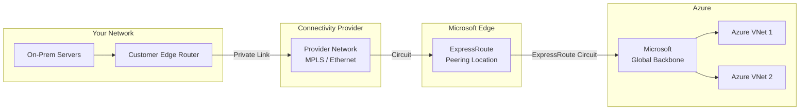
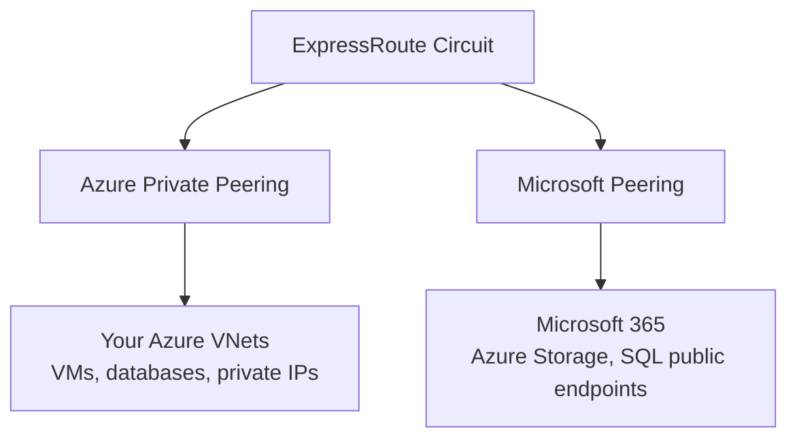
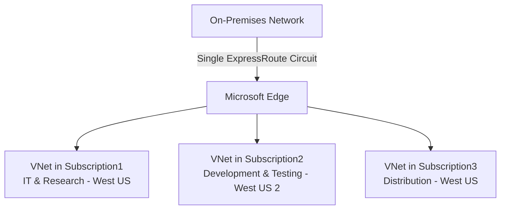
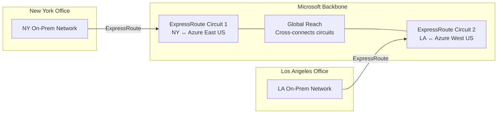
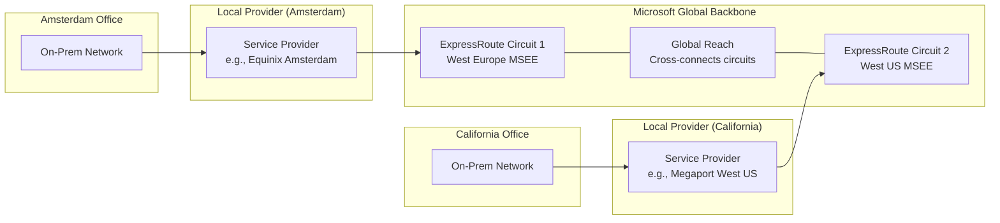
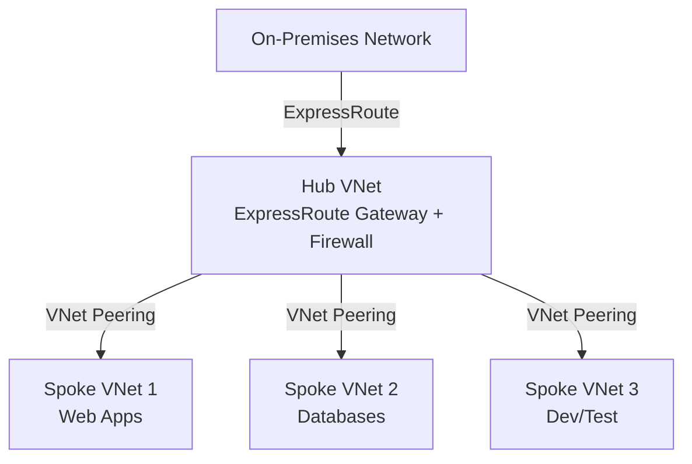

# Azure ExpressRoute & BGP Routing Guide

> **General Pattern**: [Hybrid Cloud Architecture](../../architecture-general/05-cloud-infrastructure-platform-architecture/)
> **Taxonomy Reference**: §5 Cloud, Infrastructure & Platform Architecture (see [architecture_taxonomy_reference.md](../../architecture-general/10-practicality-taxonomy/architecture_taxonomy_reference.md))

See [README](./index.md) for overview. See also [ExpressRoute Connectivity Models](./08-expressroute-connectivity-models.md).

## Table of Contents

- [1. What is Azure ExpressRoute?](#1-what-is-azure-expressroute)
- [2. ExpressRoute vs VPN Gateway](#2-expressroute-vs-vpn-gateway)
- [3. How ExpressRoute Works (Step by Step)](#3-how-expressroute-works-step-by-step)
- [4. ExpressRoute Circuit and Peering Types](#4-expressroute-circuit-and-peering-types)
- [5. Multi-Subscription Circuit Sharing](#5-multi-subscription-circuit-sharing)
- [6. Connectivity Models](#6-connectivity-models)
- [7. ExpressRoute Circuit Types and SKUs](#7-expressroute-circuit-types-and-skus)
- [8. BGP: The Routing Engine Behind ExpressRoute](#8-bgp-the-routing-engine-behind-expressroute)
- [9. ExpressRoute Global Reach](#9-expressroute-global-reach)
- [10. Multi-Site Failover with BGP](#10-multi-site-failover-with-bgp)
- [11. Common Architecture Patterns](#11-common-architecture-patterns)
- [12. Routing Configuration Options](#12-routing-configuration-options)
- [13. Key Takeaways](#13-key-takeaways)
- [14. ExpressRoute PowerShell Management](#14-expressroute-powershell-management)
- [15. References](#15-references)

---

## 1. What is Azure ExpressRoute?

Azure ExpressRoute creates a **private, dedicated network connection** between your on-premises infrastructure and Azure datacenters. Unlike a VPN, your traffic **never crosses the public internet**—it travels through a private circuit managed by a network service provider (like AT&T, Equinix, or Megaport).

**Think of it this way:**
- **VPN Gateway** = Sending a letter through the public postal system (encrypted envelope, but shared roads)
- **ExpressRoute** = Having a private highway built directly from your office to the Azure datacenter (dedicated road, no public traffic)

### Why does this matter?

| Concern | Internet/VPN | ExpressRoute |
|---------|-------------|--------------|
| **Security** | Encrypted but traverses shared internet | Private path — never touches the internet |
| **Latency** | Unpredictable — depends on internet congestion | Consistent and low — dedicated bandwidth |
| **Bandwidth** | Capped at ~10 Gbps, shared | Up to 100 Gbps, guaranteed |
| **Reliability** | Best-effort internet routing | 99.95% SLA with built-in redundancy |

### Who needs ExpressRoute?

- Organizations moving **large data volumes** to/from Azure (backups, replication, analytics)
- **Regulated industries** (healthcare, finance) with compliance requirements against using public internet
- Applications that cannot tolerate **variable latency** (real-time trading, VoIP, video)
- Enterprises with **hybrid architectures** where on-premises and Azure must behave like one network

---

## 2. ExpressRoute vs VPN Gateway

| Aspect | VPN Gateway | ExpressRoute |
|--------|-------------|--------------|
| **Connection path** | Encrypted tunnel over public internet | Private dedicated line (no internet) |
| **Max bandwidth** | Up to 10 Gbps | Up to 100 Gbps |
| **Latency** | Variable (internet-dependent) | Consistent and low |
| **Cost** | Lower (pay for gateway + egress) | Higher (circuit fee + provider fee) |
| **SLA** | 99.9% – 99.95% | 99.95% |
| **Routing protocol** | Static routes or BGP | BGP only (dynamic) |
| **Setup complexity** | Simple — configure in portal | Requires working with a connectivity provider |
| **Best for** | Dev/test, small workloads, backup connectivity | Mission-critical, enterprise, high-throughput |

> **Tip**: Many enterprises use **both**—ExpressRoute as the primary path and VPN Gateway as a failover if the circuit goes down.

---

## 3. How ExpressRoute Works (Step by Step)

Understanding ExpressRoute is easier when you see **how traffic flows** from your office to an Azure VM:

```
Step 1: Your server sends a packet destined for an Azure VM (e.g., 10.1.0.4)

Step 2: Your on-premises router uses BGP to know that 10.1.0.0/16
         is reachable via the ExpressRoute circuit

Step 3: The packet leaves your router and enters your connectivity
         provider's network (e.g., AT&T, Equinix) over a private link

Step 4: The provider forwards the packet to a Microsoft Edge router
         at an "ExpressRoute peering location" (a physical meet-me point)

Step 5: The Microsoft Edge router forwards the packet through the
         Microsoft global backbone network to the Azure region

Step 6: The packet arrives at your Azure VNet and reaches the VM
```

### Architecture diagram



**Key participants:**

| Role | Who / What | Responsibility |
|------|-----------|---------------|
| **Customer** | You | Configure on-prem routers, request circuit |
| **Connectivity Provider** | AT&T, Equinix, Megaport, etc. | Provide the physical link between your network and Microsoft Edge |
| **Microsoft** | Azure | Host the peering location, run the backbone, deliver to VNets |

---

## 4. ExpressRoute Circuit and Peering Types

An **ExpressRoute circuit** is the logical connection you provision. Each circuit supports up to two **peering types** that determine what you can reach:

### Peering types explained

| Peering Type | What You Can Reach | Use Case |
|-------------|-------------------|----------|
| **Azure Private Peering** | Resources inside your Azure VNets (VMs, databases, internal load balancers) | Most common — extends your on-prem network into Azure VNets |
| **Microsoft Peering** | Microsoft 365, Dynamics 365, Azure public services (Storage, SQL via public endpoints) | Access Microsoft SaaS and Azure PaaS services over private connection |

> **Note**: **Azure Public Peering** was deprecated in 2018 and replaced by Microsoft Peering.

### How peering works



- **Private Peering** uses private IP addresses (RFC 1918 ranges like 10.x.x.x, 172.16.x.x) — your on-prem network and Azure VNets share routing information via BGP
- **Microsoft Peering** uses public IP addresses — requires NAT and route filters to control which Microsoft services are reachable

### Choosing the right peering combination

Each peering type is **independent** — enabling one does not enable the other. You must configure each peering type separately on the same circuit based on what services you need to reach:

| Scenario | Required Peering |
|----------|-----------------|
| Access only Azure VNet resources (VMs, private IPs) | Private Peering only |
| Access only Microsoft 365 / Azure PaaS public endpoints | Microsoft Peering only |
| Access both Azure VNet resources **and** Microsoft 365 | **Both** Private Peering **and** Microsoft Peering |
| Route data between on-premises sites via ExpressRoute (Global Reach) | Private Peering on **both** circuits |

> **Important for Global Reach**: When using ExpressRoute Global Reach to route traffic between on-premises datacenters through the Microsoft backbone, **Private Peering** must be configured on both ExpressRoute circuits. Global Reach operates over Private Peering — Microsoft Peering and the deprecated Public Peering are not used for site-to-site inter-datacenter traffic.

### Public Peering deprecation — exam trap

> **Exam warning**: Azure Public Peering was **deprecated in March 2018** and is no longer available for new circuits. Any exam question that lists "Public Peering" as an option is a distractor. Microsoft Peering replaced Public Peering for accessing Azure public services. Do **not** confuse "Public Peering" with "Microsoft Peering" — they are different, and Public Peering should never be selected in current exam scenarios.

> **Key insight**: A single ExpressRoute circuit supports both peering types simultaneously. You do **not** need two separate circuits — you configure both peerings on the same circuit.

### Microsoft 365 over ExpressRoute — additional requirements

Using Microsoft Peering for Microsoft 365 has specific requirements beyond standard ExpressRoute setup:

- **Authorization required**: Microsoft 365 over ExpressRoute requires explicit approval from Microsoft. You must submit a request through the Azure portal or support.
- **Route filters**: You must configure **route filters** to select which Microsoft 365 service communities (BGP communities) are advertised over the circuit (e.g., Exchange Online, SharePoint Online, Skype for Business).
- **NAT requirement**: Microsoft Peering requires **source NAT** with public IP addresses that you own or are allocated by your provider. Traffic from your on-premises must be NATted to these public IPs before reaching Microsoft.
- **Redundancy**: Microsoft requires redundant BGP sessions for Microsoft Peering to meet SLA requirements.

> **Reference**: [Azure ExpressRoute for Microsoft 365 | Microsoft Learn](https://learn.microsoft.com/en-us/microsoft-365/enterprise/azure-expressroute)

### Practice question: ExpressRoute peering selection

**Question**: You're setting up an ExpressRoute circuit and need to enable connectivity to both Microsoft Azure services (VMs in VNets) and Microsoft 365. Which peering configuration(s) should you select?

- A) Private peering only
- B) Microsoft peering only
- C) Both private peering and Microsoft peering ✅
- D) None of the above

**Answer**: **C** ✅

**Explanation**:

- **Option A is incorrect.** Private peering only provides access to resources inside your Azure VNets (VMs, databases, internal load balancers). It does not provide connectivity to Microsoft 365 or other Microsoft SaaS services.
- **Option B is incorrect.** Microsoft peering provides access to Microsoft 365, Dynamics 365, and Azure PaaS public endpoints. However, it does not provide access to Azure VNet resources (VMs, private IPs).
- **Option C is correct.** ✅ To reach both Azure IaaS resources in VNets (via Private Peering) and Microsoft 365 services (via Microsoft Peering), you must configure both peering types on the ExpressRoute circuit. Each peering type serves a different set of services, and they are configured independently on the same circuit.
- **Option D is incorrect.** ExpressRoute peering is required to route traffic over the circuit.

> **Reference**: [Azure ExpressRoute: circuits and peering | Microsoft Learn](https://learn.microsoft.com/en-us/azure/expressroute/expressroute-circuit-peerings)

---

## 5. Multi-Subscription Circuit Sharing

A single ExpressRoute circuit can be shared across **multiple Azure subscriptions**. This is one of the most commonly tested concepts and is critical for enterprise environments where different departments or teams use separate subscriptions.

### How it works

An ExpressRoute circuit is provisioned in one subscription (the **circuit owner** subscription). Virtual networks (VNets) in **other subscriptions** can then be linked to that same circuit. The key factor is the **Azure Active Directory (Entra ID) tenant** — not the number of subscriptions, departments, or Azure regions.



### Same tenant vs cross-tenant linking

| Scenario | Requirement | How |
|----------|------------|-----|
| **Same Azure AD tenant** | Subscriptions share the same tenant | Circuit owner grants the other subscriptions access; VNet owners link their VNets to the circuit directly |
| **Cross-tenant** (different Azure AD tenants) | Subscriptions are in different tenants | Circuit owner generates an **authorization key**; VNet owner in the other tenant redeems the key to link their VNet |

### What does NOT require additional circuits

The following factors **do not** increase the number of ExpressRoute circuits required:

| Factor | Requires additional circuit? |
|--------|----------------------------|
| Multiple Azure subscriptions (same tenant) | **No** — one circuit serves all |
| Resources in different Azure regions (within SKU scope) | **No** — Standard/Premium circuits reach multiple regions |
| Different departments using different subscriptions | **No** — organizational structure is irrelevant |
| VNets in different resource groups | **No** — resource group doesn't affect connectivity |

### What DOES require additional circuits

| Factor | Requires additional circuit? |
|--------|----------------------------|
| Different on-premises locations needing local connectivity | **Yes** — each site needs its own circuit (use Global Reach to interconnect) |
| Bandwidth exceeding a single circuit's capacity | **Yes** — provision additional circuits for more throughput |
| Isolation requirements (regulatory/compliance) | **Possibly** — separate circuits for network isolation |

### Circuit authorization process (cross-subscription)

```
Step 1: Circuit owner creates the ExpressRoute circuit in Subscription A

Step 2: Circuit owner creates an authorization for the circuit
         → Generates an authorization key

Step 3: VNet owner in Subscription B uses the authorization key
         to link their VNet gateway to the circuit

Step 4: Both VNets (in Sub A and Sub B) now use the same circuit
         to communicate with on-premises
```

### Limits

| Circuit Bandwidth | Max VNet Links (Standard) | Max VNet Links (Premium) |
|-------------------|--------------------------|-------------------------|
| 50 Mbps | 10 | 10 |
| 100 Mbps | 10 | 25 |
| 200 Mbps | 10 | 25 |
| 500 Mbps | 10 | 40 |
| 1 Gbps | 10 | 50 |
| 2 Gbps | 10 | 60 |
| 5 Gbps | 10 | 75 |
| 10 Gbps | 10 | 100 |

> **Note**: The linked VNets can be in different subscriptions, different resource groups, and different Azure regions (with Standard or Premium SKU), as long as the circuit's SKU scope allows access to those regions.

### Practice question: minimum ExpressRoute circuits for multiple subscriptions

**Question**: Your company has an on-premises network and three Azure subscriptions: Subscription1, Subscription2, and Subscription3. The departments use the subscriptions as follows:

| Department | Subscription |
|------------|-------------|
| IT | Subscription1 |
| Research | Subscription1 |
| Development | Subscription2 |
| Testing | Subscription2 |
| Distribution | Subscription3 |

All resources are in either West US or West US 2 Azure regions. All subscriptions are under the same Azure AD tenant. You plan to connect all subscriptions to the on-premises network using ExpressRoute. What is the minimum number of ExpressRoute circuits required?

- A) 1 ✅
- B) 2
- C) 3
- D) 4
- E) 5

**Answer**: **A** ✅

**Explanation**:

- **Option A is correct.** ✅ A single ExpressRoute circuit can be shared across multiple Azure subscriptions as long as they are part of the same Azure Active Directory tenant. The number of subscriptions, departments, or Azure regions does not determine the number of circuits. VNets in Subscription1, Subscription2, and Subscription3 can all be linked to one circuit. West US and West US 2 are both in the North America geopolitical region, so even a Standard SKU circuit provides access to both regions.
- **Options B, C, D, and E are incorrect.** The number of subscriptions (3), departments (5), or regions (2) does not require additional circuits. A single circuit with VNet links to each subscription is sufficient.

> **Key takeaway**: The determining factor for ExpressRoute circuit count is **not** the number of subscriptions or regions — it is the Azure AD tenant boundary, bandwidth requirements, and physical on-premises locations.

> **References**:
> - [Link a VNet to an ExpressRoute circuit | Microsoft Learn](https://learn.microsoft.com/en-us/azure/expressroute/expressroute-howto-linkvnet-portal-resource-manager)
> - [ExpressRoute FAQ | Microsoft Learn](https://learn.microsoft.com/en-us/azure/expressroute/expressroute-faqs)

---

## 6. Connectivity Models

There are four ways to physically connect to an ExpressRoute peering location:

| Model | Description | When to Use |
|-------|-------------|-------------|
| **CloudExchange Co-location** | Your equipment is physically in the same facility as Microsoft Edge routers (e.g., Equinix datacenter). You request a virtual cross-connect. | You already host equipment in a co-location facility |
| **Point-to-Point Ethernet** | A dedicated Ethernet link from your datacenter to the Microsoft Edge | You have your own datacenter and want a direct fiber run |
| **Any-to-Any (IPVPN/MPLS)** | Connect Azure as another "branch office" on your existing MPLS WAN | You already have an MPLS network connecting your offices |
| **ExpressRoute Direct** | Connect directly to Microsoft Edge at 10 Gbps or 100 Gbps, bypassing service providers | Ultra-high bandwidth, massive data ingestion, strict isolation needs |

> See [ExpressRoute Connectivity Models](./09-express-route-models.md) for detailed diagrams.

---

## 7. ExpressRoute Circuit Types and SKUs

There are four ExpressRoute circuit types to choose from, each with different geographic scope, capacity, and cost implications:

| Circuit Type | Geographic Scope | Bandwidth Range | Use Case |
|-------------|-----------------|-----------------|----------|
| **ExpressRoute Local** | Access **only** to one or two Azure regions at/near the peering location | 1 Gbps, 2 Gbps, 5 Gbps, 10 Gbps | Cost-efficient when all workloads are in a nearby Azure region; **includes free unlimited egress** |
| **ExpressRoute Standard** | Access to all Azure regions within the **same geopolitical region** (e.g., all of North America or all of Europe) | 50 Mbps – 10 Gbps | Connectivity to multiple regions within a geopolitical boundary |
| **ExpressRoute Premium** | Access to all Azure regions **globally** + increased route limits (10,000 vs 4,000 for private peering) | 50 Mbps – 10 Gbps | Multi-region enterprises, global deployments, cross-geopolitical connectivity |
| **ExpressRoute Direct** | Depends on SKU configured on port (Local, Standard, or Premium) | 10 Gbps or 100 Gbps port pairs | Massive data ingestion, strict physical isolation, or need for >10 Gbps from a single provider |

### ExpressRoute Local — key requirements

ExpressRoute Local is the most cost-effective option when your scenario meets specific constraints:

- **Peering location proximity**: The ExpressRoute peering location must be **at or near** the Azure region where your resources reside. Each peering location maps to one or two "local" Azure regions.
- **Limited regional access**: Unlike Standard/Premium, Local circuits provide connectivity **only** to the one or two nearby Azure regions — not to all regions in the geopolitical area.
- **Free unlimited egress**: Data transfer out of Azure over a Local circuit has **no egress charges**, regardless of volume. This is a significant cost saving compared to Standard/Premium where egress is either metered or requires an Unlimited plan.
- **Minimum bandwidth**: Local circuits start at **1 Gbps** (Standard/Premium start at 50 Mbps).
- **Unlimited data plan only**: Local circuits always include unlimited data — there is no Metered data plan option for Local.

> **Example**: The East US Azure region has a peering location in Washington DC. If all your Azure resources are in East US and your on-premises datacenter connects through the Washington DC peering location, ExpressRoute Local gives you full connectivity at the lowest cost.

### ExpressRoute Direct — when to use

ExpressRoute Direct provides **direct physical port connectivity** (bypassing third-party service providers) to Microsoft's global network at peering locations worldwide:

- **Port pairs**: Available as 10 Gbps or 100 Gbps dual port pairs (Active/Active)
- **No service provider needed**: You connect directly to Microsoft Edge routers
- **Supports all SKUs**: You can create Local, Standard, or Premium circuits on top of Direct ports
- **Massive scale**: Designed for scenarios requiring >10 Gbps or multiple circuits from a single connection point
- **Not cost-effective for low bandwidth**: If you only need 1 Gbps, provisioning a 10 Gbps Direct port is wasteful and expensive

### Data plans: Metered vs Unlimited

Standard and Premium circuits offer two data plan options that affect how egress (outbound data transfer from Azure) is billed:

| Data Plan | How Egress is Billed | Best For |
|-----------|---------------------|----------|
| **Metered** | Pay per GB of outbound data transferred over the circuit (inbound is free) | Workloads with low or unpredictable egress volumes |
| **Unlimited** | Flat monthly fee — no per-GB egress charges | Workloads with high or consistent egress volumes |

> **Note**: ExpressRoute Local circuits always include unlimited data (free egress) — there is no Metered option for Local.

| Circuit Type | Metered Plan Available | Unlimited Plan Available |
|-------------|----------------------|------------------------|
| **Local** | ❌ No (always unlimited egress) | ✅ Included by default |
| **Standard** | ✅ Yes | ✅ Yes |
| **Premium** | ✅ Yes | ✅ Yes |

### Billing components

ExpressRoute billing has two parts:

1. **Circuit fee** (paid to Microsoft): Monthly charge based on bandwidth, SKU, and data plan
2. **Provider fee** (paid to your connectivity provider): Varies by provider and location

| Bandwidth | Approx. Monthly (Standard Metered) | Approx. Monthly (Standard Unlimited) | Approx. Monthly (Local) |
|-----------|-------------------------------------|--------------------------------------|------------------------|
| 50 Mbps | ~$55 | ~$110 | N/A (min 1 Gbps) |
| 200 Mbps | ~$220 | ~$440 | N/A (min 1 Gbps) |
| 1 Gbps | ~$436 | ~$814 | ~$436 (free egress) |
| 10 Gbps | ~$3,480 | ~$8,140 | ~$3,480 (free egress) |

> **Cost tip**: The **Local SKU** offers the lowest total cost when your peering location is at/near the target Azure region — it has no egress charges and a lower circuit fee than Standard/Premium Unlimited. If you only need connectivity to a single nearby Azure region, Local is almost always the cheapest option.

### Decision guide: choosing the right circuit type

```
Do you need >10 Gbps or direct physical port access?
  ├─ YES → ExpressRoute Direct (10 Gbps or 100 Gbps ports)
  └─ NO → Is the peering location at/near the Azure region with your resources?
      ├─ YES → Do you ONLY need access to that nearby Azure region?
      │   ├─ YES → ExpressRoute Local (lowest cost, free egress)
      │   └─ NO → Do you need access across geopolitical regions?
      │       ├─ YES → ExpressRoute Premium
      │       └─ NO → ExpressRoute Standard
      └─ NO → Do you need access across geopolitical regions?
          ├─ YES → ExpressRoute Premium
          └─ NO → ExpressRoute Standard
```

### Geopolitical regions

ExpressRoute Standard provides access to all Azure regions within the **same geopolitical region**. The geopolitical regions are:

| Geopolitical Region | Includes |
|--------------------|----------|
| **North America** | East US, West US, Central US, Canada, etc. |
| **Europe** | West Europe, North Europe, UK, France, Germany, etc. |
| **Asia Pacific** | Southeast Asia, East Asia, Australia, Japan, Korea, India, etc. |
| **Other** | South America, Middle East, Africa, Government regions |

> **Key distinction**: ExpressRoute Standard with the East US peering location gives access to **all** North America Azure regions (East US, West US, Canada Central, etc.). ExpressRoute Local with the same peering location gives access to **only** East US (and potentially a second nearby region). If you only need East US, Local is cheaper.

### Practice question: choosing an ExpressRoute circuit type

**Question**: Your company has a single on-premises datacenter in Washington DC. The East US Azure region has a peering location in Washington DC. The company only has Azure resources in the East US region. You need to implement ExpressRoute to support up to 1 Gbps. You must use only ExpressRoute Unlimited data plans. The solution must minimize costs. Which type of ExpressRoute circuit should you create?

- A) ExpressRoute Local ✅
- B) ExpressRoute Direct
- C) ExpressRoute Premium
- D) ExpressRoute Standard

**Answer**: **A** ✅

**Explanation**:

- **Option A is correct.** ✅ ExpressRoute Local provides connectivity only to the Azure region(s) near the peering location. Since the company only has resources in East US and the peering location is in Washington DC (which maps to East US), Local meets all connectivity requirements. Local circuits support 1 Gbps bandwidth, include unlimited egress data by default (satisfying the Unlimited data plan requirement), and cost less than Standard or Premium circuits. This is the most cost-effective choice.
- **Option B is incorrect.** ExpressRoute Direct provides direct 10 Gbps or 100 Gbps port pairs to Microsoft's network. Since the requirement is only 1 Gbps, Direct is overkill and far more expensive than necessary.
- **Option C is incorrect.** ExpressRoute Premium provides global connectivity across all Azure regions worldwide with increased route limits. Since the company only needs connectivity to East US, the premium features are unnecessary and add cost.
- **Option D is incorrect.** ExpressRoute Standard provides connectivity to all Azure regions within the same geopolitical region (all of North America in this case). While Standard supports Unlimited data plans, it provides broader geographic access than needed (all of North America vs just East US), and its circuit fee + Unlimited plan cost is higher than the equivalent Local circuit which includes free egress by default.

> **Key takeaway**: When the peering location is near the target Azure region and you only need access to that region, ExpressRoute Local is always the cheapest option — it has a lower circuit fee and includes unlimited egress at no extra cost.

> **References**:
> - [ExpressRoute pricing](https://azure.microsoft.com/en-us/pricing/details/expressroute/)
> - [ExpressRoute FAQ](https://learn.microsoft.com/en-us/azure/expressroute/expressroute-faqs)
> - [ExpressRoute circuits and peering](https://learn.microsoft.com/en-us/azure/expressroute/expressroute-circuit-peerings)

---

## 8. BGP: The Routing Engine Behind ExpressRoute

### What is BGP?

**Border Gateway Protocol (BGP)** is the routing protocol that makes ExpressRoute work. It is the same protocol that routes traffic across the entire internet. In the context of ExpressRoute, BGP allows your on-premises routers and Azure to **dynamically exchange routing information** — so both sides automatically know how to reach each other's networks.

### Why BGP instead of static routes?

| Aspect | Static Routes | BGP (Dynamic) |
|--------|--------------|---------------|
| **Route updates** | Manual — you edit routes by hand | Automatic — routers notify each other |
| **Failover** | Manual — you must detect and reconfigure | Automatic — detects failure in seconds |
| **Scalability** | Painful with many subnets | Handles thousands of routes |
| **Required for ExpressRoute?** | ❌ Not supported | ✅ Required |

### How BGP works with ExpressRoute

When you set up an ExpressRoute circuit, a BGP session is established between your on-premises router and the Microsoft Edge routers:

```
Your On-Premises Router              Microsoft Edge Router
   ASN: 65001                          ASN: 12076 (Microsoft's)
       │                                    │
       │◄──── BGP Session (TCP 179) ────────│
       │                                    │
       │ Advertises:                        │ Advertises:
       │   10.0.0.0/8   (your network)     │   10.1.0.0/16  (Azure VNet 1)
       │   172.16.0.0/16 (your branch)     │   10.2.0.0/16  (Azure VNet 2)
       │                                    │
       ▼ Result: Your router now knows      ▼ Result: Azure now knows
         how to reach Azure VNets             how to reach your networks
```

### Key BGP concepts

| Concept | Explanation |
|---------|------------|
| **ASN (Autonomous System Number)** | A unique number that identifies your network. You typically use a private ASN (64512–65534). Microsoft always uses **12076**. |
| **Route advertisement** | Each side announces which IP ranges it owns. This happens automatically via BGP. |
| **BGP session / peering** | A TCP connection (port 179) between two routers that exchanges route information. |
| **AS-Path** | The list of ASNs a route has traversed. Shorter paths are preferred — this is how BGP picks the best route. |
| **Route withdrawal** | When a network becomes unreachable, BGP removes (withdraws) its routes, triggering automatic failover to an alternative path. |

---

## 9. ExpressRoute Global Reach

### The problem

You have two offices (e.g., New York and Los Angeles), each with its own ExpressRoute circuit to Azure. By default, those two offices **cannot talk to each other** through Azure — the circuits are isolated.

### The solution: Global Reach

**ExpressRoute Global Reach** interconnects your on-premises sites through the Microsoft backbone network. Your traffic between sites travels the same private Microsoft network — never the internet.



### How Global Reach works (step by step)

To connect two geographically distributed offices (e.g., Amsterdam and California):

1. **Each location needs a local connectivity/service provider** — e.g., a provider in Amsterdam (like Equinix Amsterdam) and a different provider in California (like Megaport or Equinix Silicon Valley)
2. **Each location establishes its own ExpressRoute circuit** through its local service provider to a nearby Microsoft Enterprise Edge (MSEE) peering location
3. **Enable Global Reach** to cross-connect the two ExpressRoute circuits over the Microsoft global backbone network
4. Traffic between the two offices now flows: `Amsterdam → Local Provider → MSEE → Microsoft Backbone → MSEE → Local Provider → California`



> **Key insight**: Each branch office must use its own local service provider to establish a separate ExpressRoute circuit. Global Reach then connects these circuits over the Microsoft backbone — it does **not** replace the need for local providers.

### Prerequisites and requirements

| Requirement | Details |
|-------------|---------|
| **ExpressRoute circuits** | Each site must have its own ExpressRoute circuit |
| **Local service provider** | A connectivity provider at each location (can be different providers) |
| **ExpressRoute Premium** | Required if circuits are in different geopolitical regions (e.g., Europe ↔ North America) |
| **Circuit SKU** | Supported on Standard and Premium SKUs (not Local SKU) |
| **Private peering** | Both circuits must have Azure Private Peering configured |
| **/29 subnet** | A /29 address space for Global Reach link (provided by you, not overlapping with VNet or on-premises ranges) |
| **Regional availability** | Not available in all Azure regions — check [Microsoft docs](https://learn.microsoft.com/en-us/azure/expressroute/expressroute-global-reach#availability) for current list |

### Common misconceptions

| Misconception | Reality |
|---------------|---------|
| "Just enable Global Reach on local providers" | Global Reach connects **ExpressRoute circuits**, not providers directly. Each site needs its own circuit first. |
| "Use VPN with Global Reach for site-to-site" | Global Reach does **not** use VPN. It cross-connects ExpressRoute circuits over the Microsoft backbone — no encryption needed because traffic never leaves the private network. |
| "One ExpressRoute circuit can serve all offices" | Each office location needs its own circuit through a **local** service provider. Global Reach then bridges them. |
| "Global Reach replaces the need for local providers" | No — local providers are still required at each location to establish the ExpressRoute circuits that Global Reach connects. |

### What Global Reach enables

| Without Global Reach | With Global Reach |
|---------------------|-------------------|
| NY ↔ Azure ✅ | NY ↔ Azure ✅ |
| LA ↔ Azure ✅ | LA ↔ Azure ✅ |
| NY ↔ LA ❌ (must use internet or separate VPN) | NY ↔ LA ✅ (via Microsoft backbone) |

### Benefits

- **Private site-to-site connectivity** without an additional VPN
- **Lower latency** than internet routing between offices
- **Simplified topology** — no need for a separate WAN between sites
- **Leverages existing circuits** — just enable Global Reach as an add-on
- **Supplements provider WAN** — works alongside (or replaces) your service provider's WAN for branch-to-branch traffic

### Practice question: ExpressRoute peering for inter-datacenter routing

**Question**: You have on-premises datacenters in New York and Seattle. You have an Azure subscription that contains ExpressRoute circuits connecting each datacenter. You need to ensure that all the data sent between the datacenters is routed via the ExpressRoute circuits. The solution must minimize costs. Which peering should you configure?

- A) Microsoft Peering
- B) Private Peering ✅
- C) Public Peering

**Answer**: **B** ✅

**Explanation**:

- **Option B is correct.** ✅ Private Peering is the correct choice because ExpressRoute Global Reach — which interconnects on-premises sites through the Microsoft backbone — operates exclusively over Private Peering. When you configure Private Peering on both ExpressRoute circuits and enable Global Reach, traffic between the New York and Seattle datacenters flows through the Microsoft global network without ever traversing the public internet. This is a direct, private connection that meets the requirement to route all inter-datacenter data via the ExpressRoute circuits.

- **Option A is incorrect.** Microsoft Peering is used for connectivity to Microsoft cloud services such as Microsoft 365, Dynamics 365, and Azure PaaS public endpoints. It does not facilitate site-to-site communication between on-premises datacenters. Global Reach requires Private Peering, not Microsoft Peering.

- **Option C is incorrect.** Public Peering was **deprecated in March 2018** and replaced by Microsoft Peering for accessing Azure public-facing services. It is no longer available for new ExpressRoute circuits and should not be selected in any current scenario. Even when it existed, Public Peering was for accessing Azure public services — not for routing data between on-premises sites.

> **Key takeaway**: Routing data between on-premises sites via ExpressRoute requires **Global Reach** with **Private Peering** configured on both circuits. Microsoft Peering serves a different purpose (SaaS/PaaS access), and Public Peering is deprecated.

> **References**:
> - [ExpressRoute Global Reach | Microsoft Learn](https://learn.microsoft.com/en-us/azure/expressroute/expressroute-global-reach)
> - [ExpressRoute circuits and peering | Microsoft Learn](https://learn.microsoft.com/en-us/azure/expressroute/expressroute-circuit-peerings)
> - [ExpressRoute FAQ — What is Private Peering | Microsoft Learn](https://learn.microsoft.com/en-us/azure/expressroute/expressroute-faqs#what-is-private-peering)

---

## 10. Multi-Site Failover with BGP

### The scenario

You have two on-premises sites and two Azure regions. You need traffic to **automatically reroute** if one site or circuit goes down.

### How BGP enables automatic failover

BGP uses **AS-Path prepending** to indicate preferred and backup paths:

```
Normal operation:
  Site A (Primary) → advertises routes with short AS-Path (preferred)
  Site B (Backup)  → advertises routes with longer AS-Path (less preferred)
  
  Azure picks Site A because shorter AS-Path = better route

If Site A fails:
  1. BGP detects the failure (no keepalive messages)
  2. BGP withdraws Site A's routes (within seconds)
  3. Site B's routes become the best available path
  4. Traffic automatically reroutes to Site B
  5. No manual intervention needed
```

### Why not HSRP or VRRP?

| Protocol | Scope | Purpose |
|----------|-------|---------|
| **HSRP / VRRP** | LAN only | Provides default gateway redundancy within a single local network |
| **BGP** | WAN / Cloud | Routes traffic between networks across wide areas — which is what ExpressRoute needs |

HSRP and VRRP solve a different problem (making sure your LAN devices have a backup gateway). BGP solves the problem of **routing between your entire on-premises network and Azure**.

---

## 11. Common Architecture Patterns

### Pattern 1: Hub-and-Spoke with ExpressRoute

The most common enterprise pattern. A single ExpressRoute circuit connects to a central hub VNet, which peers with spoke VNets.



**How BGP works here:**
- The hub VNet gateway advertises all spoke VNet address ranges to on-premises
- The on-premises router advertises local network ranges to Azure
- Adding a new spoke VNet automatically propagates routes via BGP

### Pattern 2: ExpressRoute + VPN Failover

Use ExpressRoute as primary and VPN Gateway as backup:

```
Primary path:   On-Prem ──ExpressRoute──→ Azure (high bandwidth, low latency)
Failover path:  On-Prem ──VPN Gateway──→ Azure  (encrypted over internet)

BGP assigns lower cost to ExpressRoute routes.
If ExpressRoute circuit fails, BGP switches to VPN path automatically.
```

### Pattern 3: Global Reach Multi-Site

```
Site A (NY) ──ExpressRoute Circuit A──→ Microsoft Backbone ←──ExpressRoute Circuit B── Site B (LA)
                                             │
                                       Global Reach
                                    Site A ↔ Site B
                                             │
                                     Azure VNets also
                                     reachable from both
```

---

## 12. Routing Configuration Options

| Method | Dynamic? | Auto Failover? | Best For |
|--------|----------|----------------|----------|
| **BGP** | ✅ Yes | ✅ Yes | ExpressRoute, multi-site, production |
| **UDR (User Defined Routes)** | ❌ No | ❌ Manual | Forcing traffic through NVA/firewall within a VNet |
| **Default system routes** | ❌ No | ❌ No | Basic intra-VNet and internet routing |

> **Note**: ExpressRoute **requires** BGP. UDRs are used *within* Azure VNets to override default routing (e.g., force traffic through a firewall), not for the ExpressRoute connection itself.

---

## 13. Key Takeaways

1. **ExpressRoute** provides a private, dedicated connection to Azure that bypasses the public internet — offering higher bandwidth, lower latency, and better reliability than VPN
2. **Peering types** determine what you can reach: Private Peering for VNets, Microsoft Peering for Microsoft 365/Azure PaaS
3. **BGP** is the required routing protocol — it enables dynamic route exchange and automatic failover
4. **Global Reach** lets your on-premises sites communicate through the Microsoft backbone without needing a separate WAN
5. **SKU choice matters**: Local for nearby regions (free egress), Standard for same geo, Premium for worldwide
6. **One circuit, many subscriptions**: A single ExpressRoute circuit can connect multiple Azure subscriptions under the same Azure AD tenant — the number of subscriptions, departments, or regions does not determine circuit count
7. **Common pattern**: ExpressRoute as primary + VPN Gateway as failover, with BGP managing both paths

---

## 14. ExpressRoute PowerShell Management

Azure PowerShell provides cmdlets to manage ExpressRoute circuits programmatically.

### Common commands

| Command | Purpose |
|---------|---------|
| `Get-AzExpressRouteCircuit -ResourceGroupName <RG>` | List all circuits in a Resource Group |
| `Get-AzExpressRouteCircuit -Name <name> -ResourceGroupName <RG>` | Get a specific circuit |
| `Get-AzExpressRouteCircuitStats -ResourceGroupName <RG> -ExpressRouteCircuitName <name> -PeeringType <type>` | Get traffic statistics |
| `New-AzExpressRouteCircuit` | Create a new circuit |
| `Set-AzExpressRouteCircuit` | Update an existing circuit |
| `Remove-AzExpressRouteCircuit` | Delete a circuit |

### Listing circuits in a Resource Group

```powershell
# List all ExpressRoute circuits in a Resource Group
Get-AzExpressRouteCircuit -ResourceGroupName "MyResourceGroup"

# Get a specific circuit by name
Get-AzExpressRouteCircuit -Name "MyCircuit" -ResourceGroupName "MyResourceGroup"
```

> **Important**: The correct parameter name is `-ResourceGroupName`, not `-ResourceGroup`. PowerShell cmdlets are strict about parameter names.

### Getting circuit statistics

```powershell
# Get traffic statistics for primary and secondary paths
Get-AzExpressRouteCircuitStats -ResourceGroupName "MyResourceGroup" `
  -ExpressRouteCircuitName "MyCircuit" `
  -PeeringType "AzurePrivatePeering"
```

---

## 15. References

- [Azure ExpressRoute Documentation](https://learn.microsoft.com/en-us/azure/expressroute/)
- [ExpressRoute Global Reach](https://learn.microsoft.com/en-us/azure/expressroute/expressroute-global-reach)
- [ExpressRoute Peering](https://learn.microsoft.com/en-us/azure/expressroute/expressroute-circuit-peerings)
- [ExpressRoute Routing Requirements](https://learn.microsoft.com/en-us/azure/expressroute/expressroute-routing)
- [ExpressRoute FAQ](https://learn.microsoft.com/en-us/azure/expressroute/expressroute-faqs)
- [BGP with Azure VPN and ExpressRoute](https://learn.microsoft.com/en-us/azure/vpn-gateway/vpn-gateway-bgp-overview)
- [ExpressRoute Pricing](https://azure.microsoft.com/en-us/pricing/details/expressroute/)

> **Related Documentation**:
> - [VPN Gateway](./05-azure-vpn-gateway.md) — for VPN-based connectivity
> - [ExpressRoute Connectivity Models](./08-expressroute-connectivity-models.md) — for physical connection options
> - [VPN & Private Link Guide](./06-vpn-private-link-guide.md) — for private endpoint patterns
