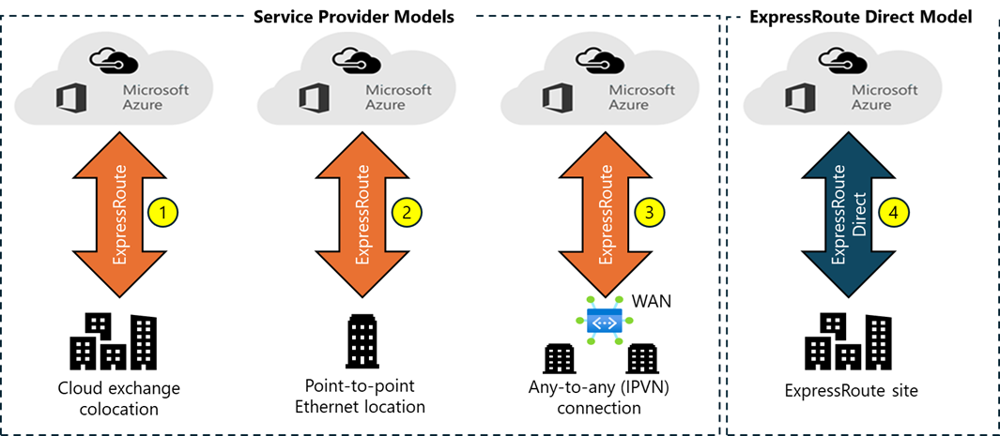

# ExpressRoute Connectivity Models

ExpressRoute allows you to create a connection in two ways: the **Service Provider** model and the **ExpressRoute Direct** model. Within the Service Provider model there are three paths: CloudExchange Colocation, Point-to-point Ethernet Connection, and Any-to-any (IPVPN) Connection.

## Co-located at a Cloud Exchange

If you’re colocated in a facility with a cloud exchange, you can request for virtual cross-connections to the Microsoft cloud through the colocation provider’s Ethernet exchange. Colocation providers can offer either Layer 2 cross-connections, or managed Layer 3 cross-connections between your infrastructure in the colocation facility and the Microsoft cloud.

## Point-to-Point Ethernet Connections

You can connect your on-premises datacenters or offices to the Microsoft cloud through point-to-point Ethernet links. Point-to-point Ethernet providers can offer Layer 2 connections.

## Any-to-Any (IPVPN) Networks

You can integrate your WAN with the Microsoft cloud. IPVPN providers (typically MPLS VPN) offer any-to-any connectivity between your branch offices and datacenters. The Microsoft cloud can be interconnected to your WAN to make it appear like any other branch office. WAN providers typically offer managed Layer 3 connectivity.

## ExpressRoute Direct

You can connect directly into the Microsoft global network at a peering location strategically distributed across the world. ExpressRoute Direct provides dual 100-Gbps or 10-Gbps connectivity that supports Active/Active connectivity at scale.

