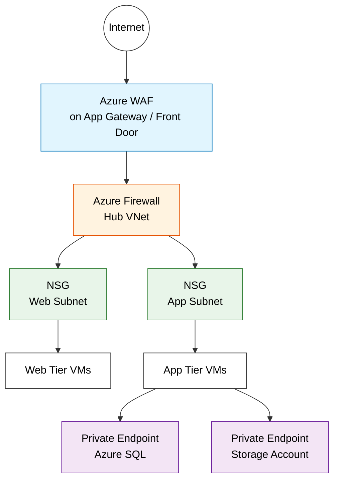

# Azure Network Security Services Comparison

> **Taxonomy Reference**: §5 Cloud & Infrastructure / Platform Architecture (see [architecture_taxonomy_reference.md](../../architecture-general/10-practicality-taxonomy/architecture_taxonomy_reference.md))
> **General Pattern**: [Security Architecture](../../architecture-general/06-security-architecture/)

## Table of Contents

- [1. Overview](#1-overview)
- [2. Service summaries](#2-service-summaries)
  - [2.1 Network Security Groups (NSG)](#21-network-security-groups-nsg)
  - [2.2 Azure Firewall](#22-azure-firewall)
  - [2.3 Azure Web Application Firewall (WAF)](#23-azure-web-application-firewall-waf)
  - [2.4 Azure Private Endpoint / Private Link](#24-azure-private-endpoint--private-link)
  - [2.5 Application Security Groups (ASG)](#25-application-security-groups-asg)
- [3. Comparison table](#3-comparison-table)
- [4. OSI layer coverage](#4-osi-layer-coverage)
- [5. When to use each](#5-when-to-use-each)
- [6. How they work together](#6-how-they-work-together)
- [7. Cost considerations](#7-cost-considerations)
- [8. Decision matrix](#8-decision-matrix)
- [9. Security monitoring and SIEM — complementary services](#9-security-monitoring-and-siem--complementary-services)
  - [9.1 Microsoft Sentinel (SIEM + SOAR)](#91-microsoft-sentinel-siem--soar)
  - [9.2 Microsoft Defender for Cloud](#92-microsoft-defender-for-cloud)
  - [9.3 Azure Monitor (WAF diagnostics)](#93-azure-monitor-waf-diagnostics)
  - [9.4 Distinguishing security services — comparison](#94-distinguishing-security-services--comparison)
  - [9.5 Practice question: Microsoft Sentinel](#95-practice-question-microsoft-sentinel)
- [10. References](#10-references)

---

## 1. Overview

Azure provides multiple network security services that operate at different layers and serve complementary purposes. Understanding their differences is critical for designing a defense-in-depth architecture.

| Aspect | NSG | ASG | Azure Firewall | WAF | Private Endpoint / Private Link |
|--------|-----|-----|----------------|-----|-------------------------------|
| **Primary purpose** | Subnet/NIC-level traffic filtering | Application-centric VM grouping for NSG rules | Centralized network security & threat intelligence | Web application attack protection | Private connectivity to PaaS services |
| **Security model** | Allow/deny IP & port rules | Logical grouping by role (used within NSG rules) | Stateful inspection, FQDN filtering, threat intel | OWASP rule-based inspection | Network isolation (eliminate public exposure) |

## 2. Service summaries

### 2.1 Network Security Groups (NSG)

A Network Security Group is a basic, stateful packet filter that operates at the subnet or NIC level. It contains inbound and outbound security rules that allow or deny traffic based on 5-tuple information (source/destination IP, source/destination port, protocol).

**Key characteristics:**
- Free to use (no additional cost)
- Applied to subnets or individual NICs
- Stateful — return traffic for an allowed flow is automatically permitted
- Rules evaluated by priority (lower number = higher priority)
- Default rules allow VNet-to-VNet and outbound internet; deny inbound internet
- Can reference Application Security Groups (ASGs) for logical grouping

### 2.2 Azure Firewall

Azure Firewall is a managed, cloud-native, stateful firewall-as-a-service that provides centralized network protection across VNets and subscriptions.

**Key characteristics:**
- Fully stateful with built-in high availability and unrestricted cloud scalability
- Supports L3, L4 (network rules) and L7 (application rules with FQDN filtering)
- Threat intelligence–based filtering (block known malicious IPs/domains)
- DNAT support for inbound traffic
- Centralized policy management with hierarchical policies
- TLS inspection (Premium SKU)
- IDPS — Intrusion Detection and Prevention System (Premium SKU)
- Requires a dedicated subnet (`AzureFirewallSubnet`, minimum /26)

### 2.3 Azure Web Application Firewall (WAF)

Azure WAF provides centralized protection for web applications against common exploits and vulnerabilities. It is deployed on Azure Application Gateway, Azure Front Door, or Azure CDN.

**Key characteristics:**
- Protects against OWASP Top 10 threats (SQL injection, XSS, etc.)
- Based on OWASP Core Rule Set (CRS)
- Layer 7 only — HTTP/HTTPS traffic inspection
- Bot protection rules
- Custom rules for geo-filtering, rate limiting, IP restriction
- Can operate in Detection or Prevention mode
- Deployed as part of Application Gateway (regional) or Front Door (global)

#### WAF custom rules

A WAF policy supports two types of custom rules for access control. Each custom rule contains a **priority number**, **match conditions**, **rule type**, and an **action**.

| Custom Rule Type | Description |
|-----------------|-------------|
| **Match rules** | Access is controlled based on a set of matching conditions (e.g., IP address, geo-location, request URI, request headers) |
| **Rate limit rules** | Access is controlled based on matching conditions **and** the rate of incoming requests (e.g., block a source IP if it exceeds 100 requests per minute) |

> **Reference**: [Web application firewall custom rule for Azure Front Door | Microsoft Learn](https://learn.microsoft.com/en-us/azure/web-application-firewall/afds/waf-front-door-custom-rules)

#### Practice question: WAF custom rule types

**Question**: A custom Web Application Firewall (WAF) rule contains a priority number, match conditions, rule type, and an action. What kinds of custom rules can you create while creating a WAF policy?

- A) Rate limit rules and Match rules ✅
- B) Match rules and priority rules
- C) Match rules and String rules
- D) Rate limit rules and Last limit rules
- E) Rate limit rules and priority rules

**Answer**: **A** ✅

**Explanation**:

There are two types of custom rules that can be used for access control in a WAF:

- **Match rules** — Access is controlled based on a set of matching conditions. For example, you can match on IP addresses, geo-locations, or string patterns in the request.
- **Rate limit rules** — Access is controlled based on both matching conditions and the rate of incoming requests. For example, you can limit a source IP to a certain number of requests per time window.

- **Option A is correct.** ✅ Rate limit rules and match rules are the two types of WAF custom rules.
- **Option B is incorrect.** "Priority rules" is not a WAF custom rule type. Priority is an attribute of any custom rule, not a rule type itself.
- **Option C is incorrect.** "String rules" is not a WAF custom rule type.
- **Option D is incorrect.** "Last limit rules" is not a valid WAF custom rule type.
- **Option E is incorrect.** "Priority rules" is not a WAF custom rule type.

> **Reference**: [Web application firewall custom rule for Azure Front Door | Microsoft Learn](https://learn.microsoft.com/en-us/azure/web-application-firewall/afds/waf-front-door-custom-rules)

#### WAF integration with Azure services

A key strength of Azure WAF is its ability to integrate with other Azure services to provide a **comprehensive, layered security approach**. This is especially important for workloads handling sensitive data (healthcare, financial, government).

| Integration | What it provides |
|-------------|-----------------|
| **Azure Application Gateway** | Regional Layer 7 proxy — WAF inspects HTTP/HTTPS traffic before it reaches backend services. Supports URL-based routing, TLS termination, and session affinity alongside WAF rules. |
| **Azure Front Door** | Global Layer 7 entry point — WAF policies protect against attacks at the edge, closest to the attacker, before traffic reaches the origin region. |
| **Microsoft Defender for Cloud** | Provides security posture management and threat protection. Monitors WAF logs for anomalies, generates security alerts, and maps findings to compliance frameworks (HIPAA, PCI DSS, SOC 2). |
| **Azure Monitor / Log Analytics** | Centralized logging of WAF events (blocked requests, rule matches, bot detections). Enables custom alerts, dashboards, and long-term retention for audit trails. |
| **Microsoft Sentinel** | Ingests WAF logs as a data source for SIEM correlation — links web attack patterns with identity, network, and endpoint signals for advanced threat hunting. |
| **Azure DDoS Protection** | Works alongside WAF — DDoS Protection handles volumetric L3/L4 attacks while WAF handles L7 application-layer attacks. |

> **Why integration matters**: No single security feature (custom rules, autoscaling, etc.) is sufficient on its own. For workloads with regulatory requirements — such as healthcare systems subject to **HIPAA** — integrating WAF with Defender for Cloud, Sentinel, and monitoring services creates the holistic security posture required for compliance.

#### WAF and compliance frameworks

WAF itself does not certify compliance, but it is a critical building block in architectures that must meet regulatory standards:

| Compliance Framework | Scope | WAF role |
|---------------------|-------|----------|
| **HIPAA** (Health Insurance Portability and Accountability Act) | Protects the privacy and security of health information (PHI) | WAF protects web-facing healthcare applications from exploits that could expose patient data. Integration with Defender for Cloud helps demonstrate compliance controls. |
| **PCI DSS** (Payment Card Industry Data Security Standard) | Protects cardholder data in payment processing | WAF satisfies PCI DSS Requirement 6.6 (protect public-facing web applications). Relevant for payment portals, not healthcare-specific scenarios. |
| **SOC 2** | Trust service criteria for service organizations | WAF logging and monitoring contribute to the Security and Availability criteria. |

> **Key distinction**: HIPAA applies to healthcare / patient data. PCI DSS applies to payment card data. When a scenario involves sensitive **patient data**, HIPAA compliance is the relevant framework — not PCI DSS.

#### Practice question: WAF for healthcare — most crucial feature

**Question**: A company is building a healthcare management system on Azure that processes sensitive patient data. They deploy a Web Application Firewall (WAF) to protect the application. Which WAF feature is the **most crucial** for this scenario?

- A) Customizable rule sets
- B) Autoscaling
- C) Integrating with other Azure services ✅
- D) PCI DSS compliance

**Answer**: **C** ✅

**Explanation**:

- **Option A is incorrect.** Customizable rule sets protect against common web exploits (SQL injection, XSS), but alone they do not provide the comprehensive security posture required for a healthcare system handling sensitive patient data.
- **Option B is incorrect.** Autoscaling ensures the WAF can handle traffic spikes, maintaining high availability. While important for operations, it is not directly related to protecting sensitive patient data.
- **Option C is correct.** ✅ Integration with other Azure services — such as Azure Application Gateway, Azure Front Door, and Microsoft Defender for Cloud — provides a **comprehensive security approach** essential for healthcare systems. This layered integration supports achieving **HIPAA compliance** (Health Insurance Portability and Accountability Act of 1996), which mandates privacy and security controls for protected health information (PHI).
- **Option D is incorrect.** PCI DSS (Payment Card Industry Data Security Standard) is designed to protect **cardholder/payment data**, not patient health data. The relevant compliance framework for a healthcare scenario is HIPAA, not PCI DSS.

> **Reference**: [What is Azure Web Application Firewall? | Microsoft Learn](https://learn.microsoft.com/en-us/azure/web-application-firewall/overview)
> **Reference**: [Azure Web Application Firewall monitoring and logging | Microsoft Learn](https://learn.microsoft.com/en-us/azure/web-application-firewall/ag/application-gateway-waf-metrics)

### 2.4 Azure Private Endpoint / Private Link

Azure Private Link enables private access to Azure PaaS services (Storage, SQL Database, Cosmos DB, etc.) over a private endpoint in your VNet. Traffic never traverses the public internet.

**Key characteristics:**
- Private Endpoint is a NIC with a private IP in your VNet
- Maps to a specific PaaS resource instance
- Eliminates data exfiltration risk via public endpoints
- Works across VNet peering, VPN, and ExpressRoute
- Requires DNS configuration (private DNS zones recommended)
- Private Link Service enables exposing your own services privately to consumers

### 2.5 Application Security Groups (ASG)

Application Security Groups (ASGs) enable you to group virtual machines by application role or function and use those groups as source/destination in NSG rules — instead of managing explicit IP addresses.

**Key characteristics:**
- Used as source or destination in NSG security rules (not a standalone filtering service)
- Groups VMs by role (e.g., Web-Servers, DB-Servers) regardless of IP address
- Dynamic membership — add/remove VMs without modifying NSG rules
- All NICs in an ASG must belong to the same VNet
- Free to use (no additional cost)
- Works only with VMs/NICs — cannot group Azure PaaS services
- Multiple ASGs can be assigned to a single NIC

> **Deep Dive**: [ASG concepts, exam scenarios & implementation](./01-networking-fundamentals.md#27-application-security-groups-asg)

## 3. Comparison table

| Feature | NSG | ASG | Azure Firewall | WAF | Private Endpoint / Private Link |
|---------|-----|-----|----------------|-----|-------------------------------|
| **OSI layer** | L3/L4 | L3/L4 (via NSG) | L3/L4/L7 | L7 | L3 (network-level isolation) |
| **Scope** | Subnet / NIC | VMs within a single VNet | VNet / cross-VNet (hub) | Per Application Gateway or Front Door | Per PaaS resource instance |
| **Statefulness** | Stateful | Stateful (inherits from NSG) | Fully stateful | N/A (proxy-based) | N/A |
| **FQDN filtering** | No | No | Yes (application rules) | N/A | N/A |
| **Threat intelligence** | No | No | Yes (known malicious IPs/domains) | No | No |
| **OWASP CRS protection** | No | No | No | Yes | No |
| **SQL injection / XSS protection** | No | No | No | Yes | No |
| **Bot protection** | No | No | No | Yes | No |
| **TLS inspection** | No | No | Yes (Premium SKU) | Yes (terminates TLS) | No |
| **IDPS** | No | No | Yes (Premium SKU) | No | No |
| **DNAT / SNAT** | No | No | Yes | No | No |
| **DNS-based filtering** | No | No | Yes (DNS proxy) | No | N/A |
| **Private connectivity to PaaS** | No | No | No | No | Yes |
| **Prevents data exfiltration** | Partially (IP-based) | No (grouping only) | Yes (FQDN + threat intel) | No | Yes (eliminates public exposure) |
| **Centralized management** | Per resource | Per ASG (logical group) | Yes (Azure Firewall Manager) | Per WAF policy | Per resource |
| **High availability** | Built-in | Built-in | Built-in | Depends on host service | Built-in |
| **Cost** | Free | Free | ~$1.25/hr + data processing (Standard) | Included with App GW / Front Door WAF SKU | ~$7.30/month per endpoint + data processing |
| **Deployment model** | Declarative rules on subnet/NIC | Logical grouping referenced in NSG rules | Dedicated subnet in hub VNet | Attached to App GW / Front Door | NIC in consumer VNet |

## 4. OSI layer coverage

```
┌─────────────────────────────────────────────────────┐
│  Layer 7 (Application)                              │
│  ┌───────────────┐  ┌───────────────────────────┐   │
│  │   Azure WAF   │  │  Azure Firewall (App Rules)│  │
│  │  (HTTP/HTTPS) │  │     (FQDN filtering)       │  │
│  └───────────────┘  └───────────────────────────┘   │
├─────────────────────────────────────────────────────┤
│  Layer 4 (Transport)                                │
│  ┌───────────────┐  ┌───────────────────────────┐   │
│  │   NSG + ASG   │  │  Azure Firewall (Net Rules)│  │
│  │  (TCP/UDP)    │  │     (TCP/UDP/ICMP)         │  │
│  └───────────────┘  └───────────────────────────┘   │
├─────────────────────────────────────────────────────┤
│  Layer 3 (Network)                                  │
│  ┌───────────────┐  ┌───────────────────────────┐   │
│  │   NSG + ASG   │  │    Private Endpoint        │  │
│  │  (IP/group)   │  │  (Network isolation)       │  │
│  └───────────────┘  └───────────────────────────┘   │
└─────────────────────────────────────────────────────┘
```

## 5. When to use each

| Scenario | Recommended Service(s) |
|----------|----------------------|
| Basic subnet/NIC traffic filtering | **NSG** |
| Group VMs by application role for NSG rules | **ASG** (used with NSG) |
| Manage rules when VM IPs change frequently | **ASG** (IP-independent grouping) |
| Centralized outbound traffic control across VNets | **Azure Firewall** |
| Block traffic to/from known malicious IPs | **Azure Firewall** (threat intelligence) |
| Protect web apps from SQL injection, XSS | **WAF** |
| FQDN-based outbound filtering | **Azure Firewall** |
| Eliminate public internet exposure for PaaS services | **Private Endpoint** |
| Expose your own service privately to other tenants | **Private Link Service** |
| TLS inspection and IDPS | **Azure Firewall Premium** |
| Bot protection for web applications | **WAF** |
| Geo-filtering for web traffic | **WAF** |
| Micro-segmentation within a VNet | **NSG** + **ASG** (group by role) |
| Hub-and-spoke network architecture | **Azure Firewall** (hub) + **NSG** (spokes) |
| Secure access to Azure SQL from on-premises | **Private Endpoint** + VPN/ExpressRoute |

## 6. How they work together

In a well-architected Azure deployment, these services are layered for defense-in-depth:



**Layered approach:**

1. **WAF** — Inspects inbound HTTP/HTTPS traffic for web application attacks
2. **Azure Firewall** — Centralized L3–L7 filtering, threat intelligence, FQDN filtering in a hub VNet
3. **NSG + ASG** — Micro-segmentation at each subnet/NIC; ASGs group VMs by role (Web, App, DB) so rules stay readable and IP-independent
4. **Private Endpoint** — Ensures backend PaaS services (databases, storage) are only reachable via private network

## 7. Cost considerations

| Service | Pricing model | Approximate cost |
|---------|--------------|-----------------|
| **NSG** | Free | $0 |
| **ASG** | Free | $0 |
| **Azure Firewall Standard** | Per hour + per GB processed | ~$912/month fixed + $0.016/GB |
| **Azure Firewall Premium** | Per hour + per GB processed | ~$1,314/month fixed + $0.016/GB |
| **WAF on App Gateway v2** | Per hour + per capacity unit | ~$246/month fixed + capacity |
| **WAF on Front Door** | Per policy + per request | ~$100/month per policy + $0.06/10K requests |
| **Private Endpoint** | Per hour + per GB processed | ~$7.30/month + $0.01/GB |

> **Note**: Prices are approximate and region-dependent. See [Azure pricing calculator](https://azure.microsoft.com/en-us/pricing/calculator/) for current rates.

## 8. Decision matrix

```
Do you need to filter traffic at subnet/NIC level?
  └─ YES → Use NSG (free, always recommended as baseline)

Do you need to group VMs by application role in NSG rules?
  └─ YES → Use ASG (free, avoids IP-based rule management)

Do you need centralized outbound/inbound filtering across VNets?
  └─ YES → Use Azure Firewall

Do you need to protect web applications from OWASP threats?
  └─ YES → Use WAF (on App Gateway or Front Door)

Do you need to remove public internet exposure for PaaS services?
  └─ YES → Use Private Endpoint / Private Link

Do you need TLS inspection or IDPS?
  └─ YES → Use Azure Firewall Premium

Do you need all of the above?
  └─ YES → Layer them together (defense-in-depth)
```

## 9. Security monitoring and SIEM — complementary services

The network security services above (NSG, Firewall, WAF, Private Endpoint) **prevent and filter** threats. A complete security posture also requires services that **detect, investigate, and respond** to threats. These complementary services integrate tightly with network security logs.

### 9.1 Microsoft Sentinel (SIEM + SOAR)

Microsoft Sentinel is a **cloud-native, scalable** solution that provides both **Security Information and Event Management (SIEM)** and **Security Orchestration, Automation, and Response (SOAR)** capabilities.

**Key characteristics:**
- Collects security data at cloud scale across users, devices, applications, and infrastructure
- Detects previously undetected threats using Microsoft's analytics and threat intelligence
- Investigates threats with AI and hunts suspicious activities at scale
- Responds to incidents rapidly with built-in orchestration and automation of common tasks (playbooks)
- Uses **KQL (Kusto Query Language)** for querying and analyzing security data
- Ingests data via **data connectors** — including Azure Firewall logs, NSG flow logs, WAF logs, Azure AD sign-in logs, and third-party sources
- Provides **workbooks** for visualization and **hunting queries** for proactive threat hunting

**Network security integration:**

| Data Source | What Sentinel ingests |
|-------------|----------------------|
| Azure Firewall | Threat intelligence hits, application/network rule logs, DNS proxy logs |
| NSG flow logs | Traffic flow records (allowed/denied) for anomaly detection |
| WAF logs | Web attack detection events, blocked requests |
| Azure DDoS Protection | DDoS mitigation reports and flow logs |
| Azure AD / Entra ID | Sign-in and audit logs for identity-based threats |

> **Important**: Microsoft Sentinel is **not** the same as Azure Monitor. Azure Monitor tracks operational diagnostics (metrics, logs, alerts). Sentinel focuses on **security analytics, threat detection, and automated response**.

### 9.2 Microsoft Defender for Cloud

Microsoft Defender for Cloud is a **Cloud Security Posture Management (CSPM)** and **Cloud Workload Protection Platform (CWPP)** that proactively prevents, identifies, and helps address potential security risks.

**Key characteristics:**
- Continuous security assessment and recommendations (Secure Score)
- Protects workloads across Azure, on-premises, and multi-cloud (AWS, GCP)
- Provides regulatory compliance dashboards (PCI-DSS, ISO 27001, etc.)
- Integrates with Microsoft Sentinel for advanced threat investigation
- **Not** a SIEM/SOAR — focuses on posture management and workload protection

### 9.3 Azure Monitor (WAF diagnostics)

Azure Monitor collects and analyzes operational telemetry, including **WAF diagnostic logs and alerts**.

**Key characteristics:**
- Monitors WAF alerts, blocked/allowed requests, and rule hit counts
- Provides Log Analytics workspace for querying WAF diagnostic data
- Sends alerts based on WAF metrics (e.g., blocked request spikes)
- Feeds data into Microsoft Sentinel for security correlation
- **Not** a security tool — it is an operational monitoring and diagnostics platform

### 9.4 Distinguishing security services — comparison

| Service | Primary role | Category | Key differentiator |
|---------|-------------|----------|--------------------|
| **Microsoft Sentinel** | Threat detection, investigation, and automated response | SIEM + SOAR | Cloud-native security analytics at scale with playbook automation |
| **Microsoft Defender for Cloud** | Security posture management and workload protection | CSPM + CWPP | Proactive prevention and compliance — not SIEM |
| **Azure Monitor** | Operational monitoring and diagnostics | Observability | Tracks metrics, logs, alerts — not security-specific |
| **Azure Firewall** | Network traffic filtering and threat intelligence | Network security | Prevents threats at L3–L7 — does not investigate or correlate |
| **Azure WAF** | Web application attack protection | Network security (L7) | OWASP rule-based inspection — does not correlate across sources |
| **Azure DNS** | Name resolution (service name → IP address) | Networking | Resolves DNS queries — not a security or monitoring tool |
| **Azure Traffic Manager** | DNS-based global traffic load balancing | Traffic management | Routes traffic across regions — not a security tool |

### 9.5 Practice question: Microsoft Sentinel

**Question**: You have been hired as an expert advisor by a well-known Azure company to help with their Azure projects. After analyzing their work, you have noticed that the team is not using Microsoft Sentinel effectively. You need to brief them on the importance of Microsoft Sentinel. Which of the following statements best describes Microsoft Sentinel?

- A) This feature assists you in monitoring diagnostic information related to WAF alerts and logs.
- B) It assists you in proactively preventing, identifying, and addressing potential security risks.
- C) This function is accountable for converting a service name into an IP address, also known as resolving or translating the service name.
- D) It is a DNS-based traffic load balancing solution that enables optimal distribution of traffic to services across global Azure regions, offering high responsiveness and availability.
- E) It is a solution for security information and event management that is cloud-native and scalable and can automate security orchestration responses. ✅

**Answer**: **E** ✅

**Explanation**:

Microsoft Sentinel is a cloud-native SIEM + SOAR solution. It provides threat intelligence and intelligent security analytics across the organization — enabling visibility into threats, alert detection, threat response, and proactive hunting.

- **Option A is incorrect** — Azure Monitor tracks diagnostic information related to WAF alerts and logs, not Sentinel.
- **Option B is incorrect** — Microsoft Defender for Cloud proactively prevents, identifies, and addresses security risks (CSPM/CWPP), not Sentinel.
- **Option C is incorrect** — Azure DNS resolves service names to IP addresses.
- **Option D is incorrect** — Azure Traffic Manager is a DNS-based traffic load balancing solution.
- **Option E is correct** — This accurately describes Microsoft Sentinel as a cloud-native, scalable SIEM + SOAR solution.

> **References**:
> - [What is Microsoft Sentinel?](https://learn.microsoft.com/en-us/azure/sentinel/overview)
> - [What is Microsoft Defender for Cloud?](https://learn.microsoft.com/en-us/azure/defender-for-cloud/defender-for-cloud-introduction)
> - [What is Azure Web Application Firewall on Azure Application Gateway?](https://learn.microsoft.com/en-us/azure/web-application-firewall/ag/ag-overview)

---

## 10. References

- [What is Azure Firewall?](https://learn.microsoft.com/en-us/azure/firewall/overview)
- [Network security groups overview](https://learn.microsoft.com/en-us/azure/virtual-network/network-security-groups-overview)
- [What is Azure Web Application Firewall?](https://learn.microsoft.com/en-us/azure/web-application-firewall/overview)
- [What is Azure Private Link?](https://learn.microsoft.com/en-us/azure/private-link/private-link-overview)
- [What is a private endpoint?](https://learn.microsoft.com/en-us/azure/private-link/private-endpoint-overview)
- [Application Security Groups overview](https://learn.microsoft.com/en-us/azure/virtual-network/application-security-groups)
- [Azure network security overview](https://learn.microsoft.com/en-us/azure/security/fundamentals/network-overview)

---

> **Related documentation**:
> - [Azure Firewall Overview](./13-azure-firewall-overview.md)
> - [Azure Networking Fundamentals — NSG section](./01-networking-fundamentals.md#26-network-security-groups-nsg)
> - [Private Endpoints Guide](./03-private-endpoints-guide.md)
