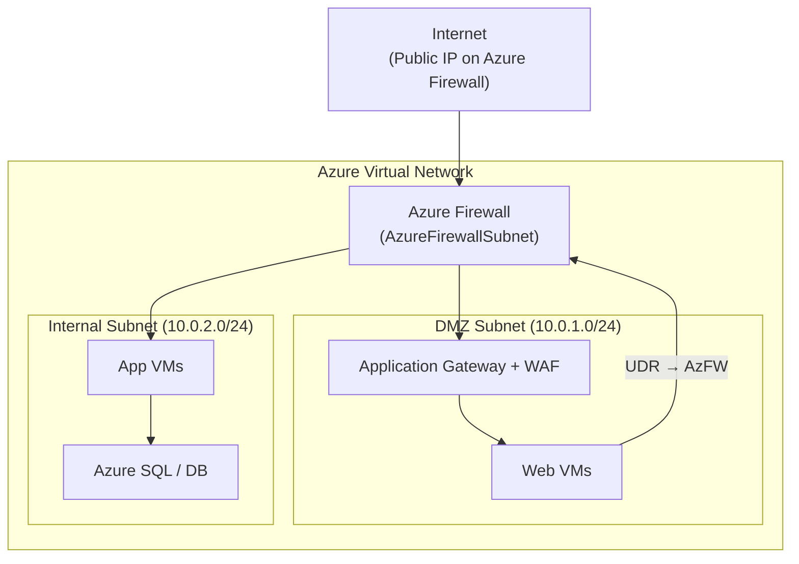
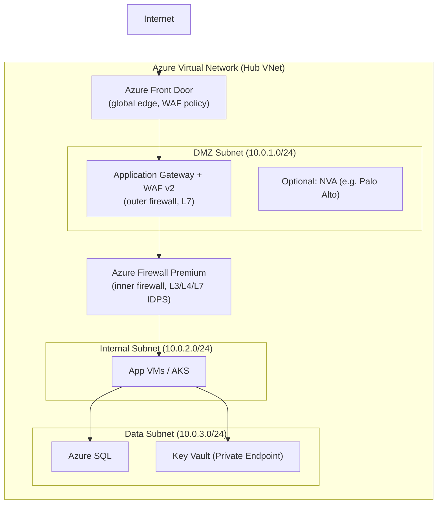
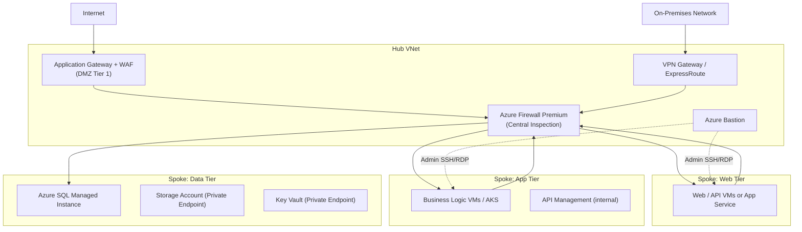
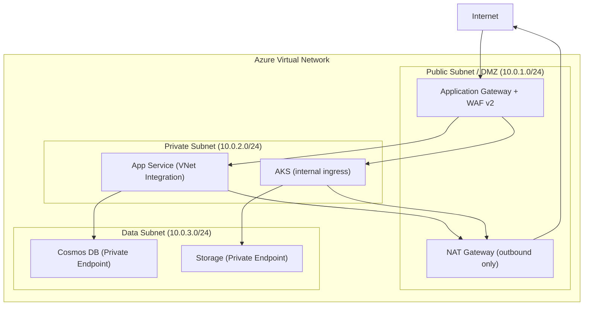
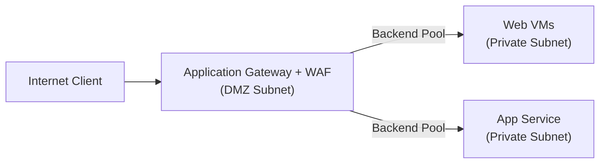
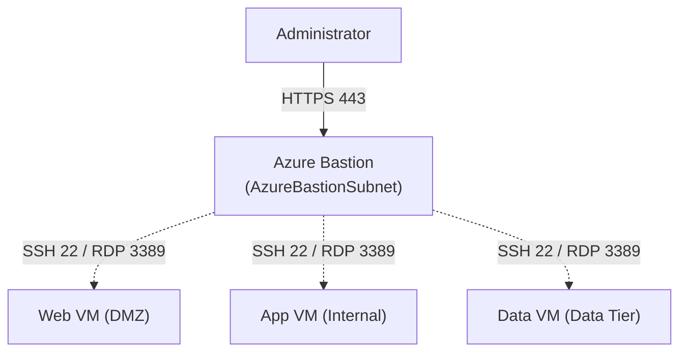
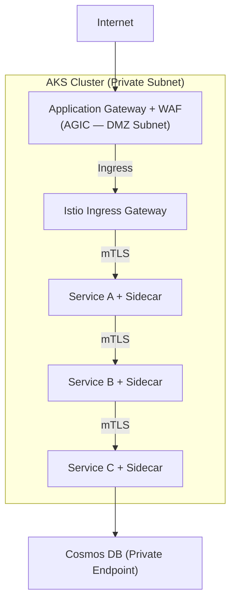
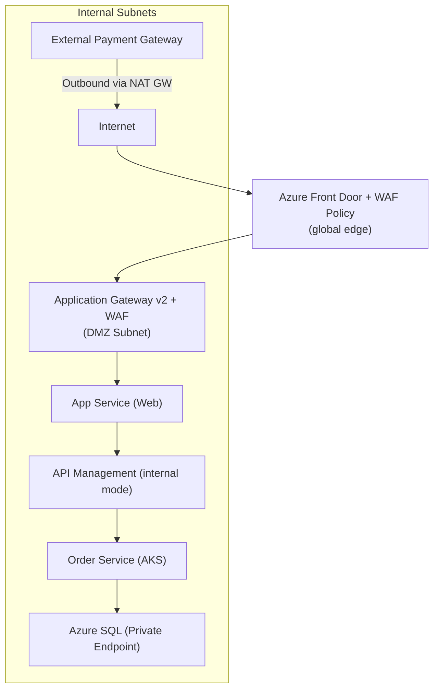
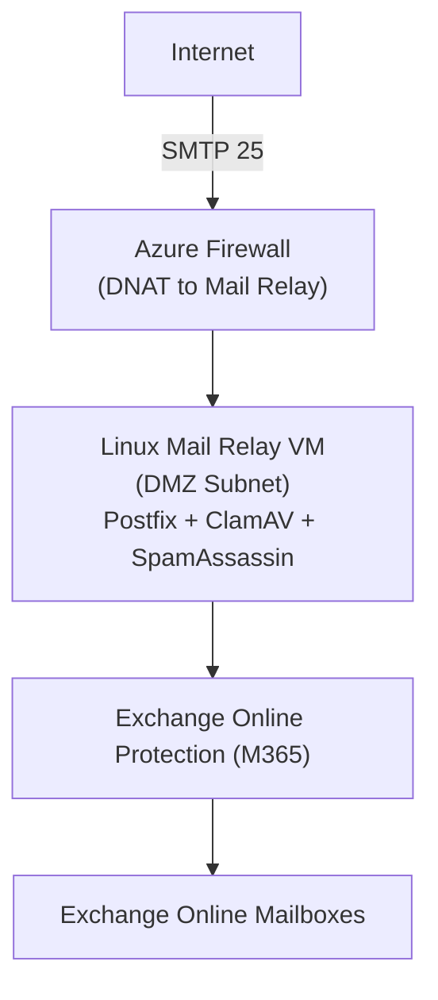
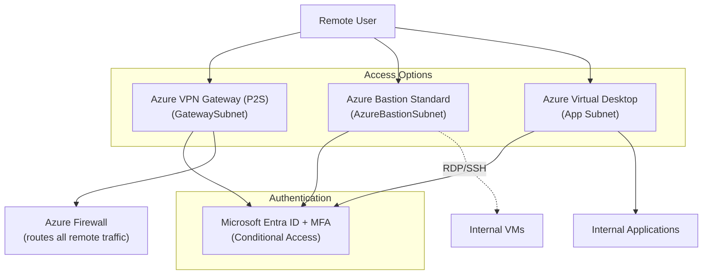

# Azure DMZ (Demilitarized Zone) Implementation

> **General Pattern**: [6.3.1 DMZ Architecture](../../architecture-general/06-security-architecture/6.3-network-security/6.3.1-dmz-architecture.md)
> **Taxonomy Reference**: §6.3 Network Security Architecture

## Table of Contents

- [What Is a DMZ?](#what-is-a-dmz)
- [Azure Building Blocks for DMZ](#azure-building-blocks-for-dmz)
- [Topology 1: Single Firewall DMZ (Three-Legged)](#topology-1-single-firewall-dmz-three-legged)
- [Topology 2: Dual Firewall DMZ (Screened Subnet)](#topology-2-dual-firewall-dmz-screened-subnet)
- [Topology 3: Multi-Tier DMZ](#topology-3-multi-tier-dmz)
- [Topology 4: Virtual DMZ (Cloud-Native)](#topology-4-virtual-dmz-cloud-native)
- [Design Pattern: Reverse Proxy](#design-pattern-reverse-proxy)
- [Design Pattern: Bastion Host](#design-pattern-bastion-host)
- [Design Pattern: Service Mesh DMZ](#design-pattern-service-mesh-dmz)
- [Common Scenarios](#common-scenarios)
- [NSG Rule Reference](#nsg-rule-reference)
- [Related Topics](#related-topics)

---

## What Is a DMZ?

A **Demilitarized Zone (DMZ)** is an isolated network segment that sits between an untrusted external network (the internet) and your trusted internal network. It hosts services that must be reachable from the outside (web servers, API gateways, mail relays) while preventing attackers who compromise a DMZ host from reaching internal systems directly.

```
Internet → [ DMZ ] → [ Internal Network ]
```

In Azure, a DMZ is not a single product. It is a combination of:

- **Subnets** inside a VNet to create isolation boundaries.
- **Network Security Groups (NSGs)** to enforce traffic rules at the subnet and NIC level.
- **Azure Firewall** or a **Network Virtual Appliance (NVA)** to inspect and filter traffic between zones.
- **Application Gateway with WAF** to protect HTTP/HTTPS entry points.
- **Route Tables (UDRs)** to force traffic through inspection points.

### Security Zone Mapping to Azure

| Zone | Azure Equivalent | Trust Level |
|------|-----------------|-------------|
| External | Internet / Public IP address space | Untrusted |
| DMZ | Dedicated subnet(s) with NSGs and Firewall | Semi-trusted |
| Internal | Private subnets, no direct internet route | Trusted |

---

## Azure Building Blocks for DMZ

| Building Block | Role in DMZ |
|----------------|------------|
| **Azure Virtual Network (VNet)** | Provides the overall network boundary. |
| **Subnets** | Create logical zones (DMZ, App, Data). |
| **NSG** | Stateful packet filter at subnet or NIC level. |
| **Azure Firewall** | Managed stateful firewall for East-West and North-South inspection. Supports FQDN, TLS inspection, and IDPS. |
| **Application Gateway + WAF** | Layer 7 reverse proxy with Web Application Firewall for HTTP/HTTPS workloads. |
| **Azure Bastion** | Fully managed jump server over HTTPS; no public IP needed on VMs. |
| **Route Tables (UDR)** | Force traffic through Firewall rather than routing directly between subnets. |
| **Private Endpoints** | Move internal service access off the public internet entirely. |
| **Azure DDoS Protection** | Volumetric and protocol DDoS mitigation at the network edge. |
| **Microsoft Defender for Cloud** | Posture management and threat detection across DMZ resources. |
| **Azure Monitor / Sentinel** | Centralized log aggregation and SIEM for DMZ traffic and security events. |

---

## Topology 1: Single Firewall DMZ (Three-Legged)

### Concept

One Azure Firewall acts as the central inspection point with routes from three directions:
- **Internet** → DMZ subnet
- **DMZ subnet** → Internal subnet
- **Internal subnet** → Internet (outbound through Firewall)

This is the lowest-cost entry point and is suitable for small workloads or development environments.

### Architecture



### Key Configuration Steps

1. **Create VNet** with at least three subnets:
   - `AzureFirewallSubnet` (minimum /26, no NSG allowed)
   - `dmz-subnet` for public-facing VMs and App Gateway
   - `internal-subnet` for application and data tiers

2. **Deploy Azure Firewall** in `AzureFirewallSubnet` with a public IP.

3. **Create a Route Table** for `dmz-subnet` and `internal-subnet`:
   ```
   Destination: 0.0.0.0/0
   Next hop: Virtual Appliance → Azure Firewall private IP
   ```

4. **Configure Azure Firewall DNAT rule** to forward inbound internet traffic to App Gateway or Web VMs.

5. **Configure Azure Firewall Network/Application rules** to allow only:
   - DMZ → Internal: specific ports (e.g., 8080 to App VMs)
   - Internal → Internet: specific FQDNs (e.g., for patching)

6. **Apply NSGs** on `dmz-subnet` and `internal-subnet` as a secondary control layer.

### Firewall Rule Example

| Rule Type | Name | Source | Destination | Port | Action |
|-----------|------|--------|-------------|------|--------|
| DNAT | inbound-web | Internet | Firewall Public IP | 443 | DNAT → AppGW private IP |
| Network | dmz-to-app | DMZ subnet | Internal subnet | 8080 | Allow |
| Network | deny-all-dmz-internal | DMZ subnet | Internal subnet | * | Deny |
| Application | patching | Internal subnet | *.ubuntu.com | HTTPS | Allow |

### Tradeoffs

| Pro | Con |
|-----|-----|
| Simple to operate | Single point of failure (mitigated by Firewall's built-in zone redundancy) |
| Lower cost | All traffic processed by one device |
| Azure Firewall is zone-redundant by default | Rule set grows complex as services grow |

---

## Topology 2: Dual Firewall DMZ (Screened Subnet)

### Concept

Two inspection layers separated by a DMZ subnet. An NVA or a second Azure Firewall policy tier (using Firewall Policy parent/child) handles each boundary independently, providing true defense in depth.

In Azure, this is commonly implemented as:
- **Azure Front Door / Application Gateway** as the outer perimeter (L7)
- **Azure Firewall** as the inner perimeter between DMZ and internal subnets

### Architecture



### Key Configuration Steps

1. **Deploy Application Gateway v2 with WAF in the DMZ subnet** — handles:
   - SSL/TLS termination
   - OWASP rule set enforcement
   - URL-based routing

2. **Deploy Azure Firewall Premium in `AzureFirewallSubnet`** — handles:
   - Network and application rules between DMZ and internal subnets
   - TLS inspection for east-west traffic
   - Intrusion Detection and Prevention (IDPS)

3. **Route Table on DMZ subnet**: traffic from App Gateway destined for internal must route through Azure Firewall:
   ```
   Destination: 10.0.2.0/24   Next hop: Firewall private IP
   Destination: 10.0.3.0/24   Next hop: Firewall private IP
   ```

4. **Route Table on internal subnet**: all outbound through Firewall.

5. **NSGs on every subnet** as additional guardrails.

6. **Optionally add Azure Front Door** in front of App Gateway for global distribution and additional WAF at the edge.

### Threat Containment Model

```
Internet → [WAF / App Gateway] → [DMZ subnet] → [Azure Firewall IDPS] → [Internal subnet]
                                       ↑
                           Breach contained here
                           Cannot reach internal directly
```

### Tradeoffs

| Pro | Con |
|-----|-----|
| True defense in depth | Higher cost (App Gateway + Firewall) |
| WAF handles L7 attacks; Firewall handles L3/L4 and east-west | More complex routing and policy management |
| Firewall Premium IDPS catches lateral movement | Latency added at each inspection layer |

---

## Topology 3: Multi-Tier DMZ

### Concept

Multiple DMZ segments, each with its own security boundary. This is the standard pattern for large enterprise Azure deployments. It maps to the **hub-spoke topology** where:

- **Hub VNet** hosts the DMZ (shared network services, Firewall, Bastion)
- **Spoke VNets** host application workloads (app tier, data tier)
- Traffic between spokes must traverse the hub Firewall

### Architecture



### Subnet and NSG Layout

| Subnet | Purpose | NSG Key Rules |
|--------|---------|---------------|
| `AzureFirewallSubnet` | Azure Firewall (no NSG) | n/a |
| `GatewaySubnet` | VPN/ER Gateway (no NSG) | n/a |
| `AzureBastionSubnet` | Azure Bastion (required NSG) | Allow 443 inbound from internet; allow 3389/22 to VNet |
| `dmz-appgw-subnet` | Application Gateway | Allow 65200-65535 inbound (health probes), 443 from internet |
| `web-subnet` (spoke) | Web VMs | Allow 443 from Firewall only |
| `app-subnet` (spoke) | App VMs | Allow 8080 from web-subnet via Firewall only |
| `data-subnet` (spoke) | Databases | Allow 1433 from app-subnet via Firewall only; deny all else |

### VNet Peering and UDR Setup

```
Hub → Spoke peerings: Allow gateway transit = true
Spoke → Hub peerings: Use remote gateways = true

UDR on every spoke subnet:
  0.0.0.0/0 → Azure Firewall private IP (hub)
  10.0.0.0/8 → Azure Firewall private IP (hub)  ← forces spoke-to-spoke through Firewall
```

### Tradeoffs

| Pro | Con |
|-----|-----|
| Maximum security isolation per workload | Complex peering and routing configuration |
| Scales to many spoke workloads independently | Higher operational overhead |
| Mandatory inspection for all inter-spoke traffic | Cost scales with data processed by Firewall |
| Maps directly to Azure Landing Zone design | |

---

## Topology 4: Virtual DMZ (Cloud-Native)

### Concept

A lightweight DMZ implemented entirely through Azure-native controls without a dedicated Firewall VM or NVA. Suitable for cloud-native workloads (App Service, Azure Functions, AKS) where the DMZ concept is enforced through policy-driven service controls rather than traditional subnet/firewall boundaries.

### Architecture



### Key Configuration Steps

1. **Application Gateway v2 with WAF** in the public subnet acts as the DMZ entry point.

2. **App Service / AKS with VNet Integration** — workloads have no public IP; all inbound comes through App Gateway only.

3. **Private Endpoints** for all data services — Cosmos DB, Storage, SQL — receive no public network traffic.

4. **NAT Gateway** on the private subnet provides controlled outbound internet access (e.g., pulling updates) without requiring public IPs on individual services.

5. **NSGs** enforce east-west controls:
   - Private subnet only accepts traffic from `dmz-appgw-subnet`
   - Data subnet only accepts traffic from `privateSubnet`

6. **Service Endpoint Policies** or **Private Link** ensure data services are not accessible from outside the VNet.

### Tradeoffs

| Pro | Con |
|-----|-----|
| No Firewall cost for basic workloads | No east-west deep packet inspection |
| Cloud-native, easy to manage | NSGs alone may not satisfy compliance requirements |
| Well-suited for PaaS workloads | Less suitable for IaaS workloads requiring IDPS |
| Elastic, scales automatically | |

---

## Design Pattern: Reverse Proxy

### Azure Implementation

Use **Application Gateway v2 with WAF** as the reverse proxy in the DMZ subnet.



### What Application Gateway provides

| Capability | Benefit |
|------------|---------|
| SSL/TLS termination | Internal traffic can be plain HTTP or re-encrypted |
| WAF (OWASP CRS 3.2+) | Blocks SQLi, XSS, LFI, RFI attacks |
| URL-based routing | Route `/api/*` to one backend, `/*` to another |
| Session affinity | Cookie-based sticky sessions |
| Health probes | Remove unhealthy backends automatically |
| Redirection rules | HTTP → HTTPS redirect |

### Key NSG Rule for Application Gateway Subnet

```
Inbound Allow: TCP 65200-65535 from GatewayManager service tag  ← required for health probes
Inbound Allow: TCP 443 from Internet
Inbound Allow: TCP 80 from Internet (for HTTP→HTTPS redirect)
Outbound Allow: TCP * to VirtualNetwork (backend pools)
```

---

## Design Pattern: Bastion Host

### Azure Implementation

Use **Azure Bastion** instead of deploying a traditional jump server VM. Azure Bastion provides browser-based SSH and RDP over HTTPS without requiring a public IP on any VM.



### Required NSG for AzureBastionSubnet

```
Inbound:
  Allow TCP 443 from Internet                     ← admin HTTPS access
  Allow TCP 443 from GatewayManager               ← Azure control plane
  Allow TCP 8080, 5701 from VirtualNetwork        ← internal health checks
  Allow * from AzureLoadBalancer                  ← health probes

Outbound:
  Allow TCP 22, 3389 to VirtualNetwork            ← SSH/RDP to target VMs
  Allow HTTPS 443 to AzureCloud                   ← telemetry
  Allow * to Internet (on 80) for session info
```

### Why Azure Bastion over a jump server VM

| Azure Bastion | Traditional Jump Server VM |
|---------------|---------------------------|
| No public IP required on VMs | VM needs patching and hardening |
| Session logging in Azure Monitor | Requires dedicated logging agent |
| Integrated with Azure AD / MFA | Manual MFA setup |
| No SSH key management overhead | SSH keys or passwords must be managed |
| SKU: Basic (no file transfer) or Standard (file transfer, native client) | Full OS access |

---

## Design Pattern: Service Mesh DMZ

### Azure Implementation

For AKS workloads, use **Open Service Mesh (OSM)** or **Istio** (now first-class in AKS) as an ingress/service mesh layer inside the cluster, backed by an **Application Gateway Ingress Controller (AGIC)** as the DMZ entry.



### Key Points

- **AGIC** links Application Gateway directly to Kubernetes Ingress objects — no extra load balancer hop.
- **Istio service mesh** enforces mTLS between all pods, provides zero-trust inside the cluster.
- **PeerAuthentication** policies enforce `STRICT` mTLS so no unencrypted east-west traffic is possible.
- **AuthorizationPolicy** objects enforce which services can call which — equivalent to internal NSG rules.

---

## Common Scenarios

### E-Commerce DMZ

Mapped to Azure components:



| Requirement | Azure Control |
|-------------|--------------|
| PCI DSS compliance | Private Endpoints for all data, Azure Firewall IDPS, Defender for Cloud |
| High availability | App Gateway zone-redundant SKU, SQL Zone-Redundant HA |
| SSL/TLS everywhere | App Gateway TLS termination, App Service TLS, SQL TLS enforced |
| Fraud detection | Azure Event Hubs + Stream Analytics + custom ML model |

---

### Enterprise Email DMZ

Azure does not provide SMTP relay by default. Use Exchange Online Protection (EOP) in M365, or deploy a Linux-based mail relay (Postfix) in the DMZ subnet:



| Requirement | Azure Control |
|-------------|--------------|
| Anti-spam / anti-malware | Exchange Online Protection (EOP) or third-party on Linux VM |
| Inbound SMTP control | Azure Firewall DNAT + NSG on DMZ subnet (allow 25 from internet) |
| Outbound email | Use Azure Communication Services or SendGrid to avoid SMTP port 25 blocks |
| DLP | Microsoft Purview DLP policies in M365 |

---

### Remote Access DMZ

Replace traditional VPN concentrator + jump server with Azure-native controls:



| Access Type | Use Case | Azure Service |
|-------------|----------|---------------|
| P2S VPN | Full network access for power users | VPN Gateway with Entra ID auth |
| Azure Bastion | Admin SSH/RDP to specific VMs | Azure Bastion Standard |
| Azure Virtual Desktop | Managed desktop for end users | AVD with Intune-managed images |

---

## NSG Rule Reference

The following rules form a baseline NSG policy for a standard three-tier Azure DMZ.

### DMZ Subnet NSG (dmz-nsg)

| Priority | Direction | Protocol | Source | Destination | Port | Action | Purpose |
|----------|-----------|----------|--------|-------------|------|--------|---------|
| 100 | Inbound | TCP | Internet | DMZ | 443 | Allow | HTTPS from internet |
| 110 | Inbound | TCP | Internet | DMZ | 80 | Allow | HTTP (redirect to HTTPS) |
| 120 | Inbound | TCP | GatewayManager | DMZ | 65200-65535 | Allow | App Gateway health probes |
| 200 | Inbound | * | * | DMZ | * | Deny | Deny all other inbound |
| 100 | Outbound | TCP | DMZ | AppSubnet | 8080 | Allow | DMZ to App tier |
| 110 | Outbound | TCP | DMZ | AppSubnet | 443 | Allow | HTTPS to App tier |
| 200 | Outbound | * | DMZ | DataSubnet | * | Deny | DMZ cannot reach data directly |

### App Subnet NSG (app-nsg)

| Priority | Direction | Protocol | Source | Destination | Port | Action | Purpose |
|----------|-----------|----------|--------|-------------|------|--------|---------|
| 100 | Inbound | TCP | DMZ subnet | AppSubnet | 8080 | Allow | Traffic from DMZ |
| 110 | Inbound | TCP | AzureBastionSubnet | AppSubnet | 22,3389 | Allow | Admin access via Bastion |
| 200 | Inbound | * | * | AppSubnet | * | Deny | Deny all other |
| 100 | Outbound | TCP | AppSubnet | DataSubnet | 1433 | Allow | SQL connections |
| 110 | Outbound | TCP | AppSubnet | DataSubnet | 5432 | Allow | PostgreSQL connections |
| 200 | Outbound | * | AppSubnet | Internet | * | Deny | No direct internet from app tier |

### Data Subnet NSG (data-nsg)

| Priority | Direction | Protocol | Source | Destination | Port | Action | Purpose |
|----------|-----------|----------|--------|-------------|------|--------|---------|
| 100 | Inbound | TCP | AppSubnet | DataSubnet | 1433 | Allow | SQL from app tier |
| 110 | Inbound | TCP | AppSubnet | DataSubnet | 5432 | Allow | PostgreSQL from app tier |
| 200 | Inbound | * | * | DataSubnet | * | Deny | Deny all other |
| 100 | Outbound | * | DataSubnet | * | * | Deny | Data tier cannot initiate outbound |

---

## Related Topics

### Azure Networking

- [Private Endpoints Guide](03-private-endpoints-guide.md)
- [Azure Firewall Overview](13-azure-firewall-overview.md)
- [Security Services Comparison](12-network-security-services-comparison.md)
- [Azure VPN Gateway](05-azure-vpn-gateway.md)
- [Azure Application Gateway](17-azure-application-gateway.md)
- [Azure Front Door](18-azure-front-door.md)
- [Network Security Best Practices](24-best-practices.md)

### General Architecture

- [6.3.1 DMZ Architecture (General)](../../architecture-general/06-security-architecture/6.3-network-security/6.3.1-dmz-architecture.md)
- [6.1 Security Foundations / Zero Trust](../../architecture-general/06-security-architecture/)

### Official Microsoft Documentation

- [Azure DMZ best practices](https://learn.microsoft.com/en-us/azure/security/fundamentals/network-best-practices)
- [Hub-spoke network topology in Azure](https://learn.microsoft.com/en-us/azure/architecture/networking/architecture/hub-spoke)
- [Azure Firewall documentation](https://learn.microsoft.com/en-us/azure/firewall/)
- [Application Gateway WAF](https://learn.microsoft.com/en-us/azure/application-gateway/waf-overview)
- [Azure Bastion](https://learn.microsoft.com/en-us/azure/bastion/bastion-overview)
