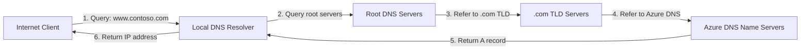
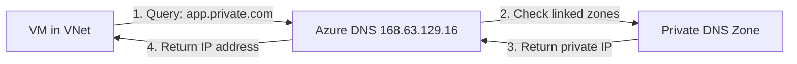

# Azure DNS

## Overview

Azure DNS is a hosting service for DNS domains that provides name resolution using Microsoft Azure infrastructure. By hosting your domains in Azure, you can manage your DNS records using the same credentials, APIs, tools, and billing as your other Azure services.

## Key Features

- **Reliability and performance**: DNS domains are hosted on Azure's global network of DNS name servers using Anycast networking
- **Security**: Integration with Azure Role-Based Access Control (RBAC), activity logs, and resource locking
- **Ease of use**: Manage DNS records using Azure portal, PowerShell, Azure CLI, or REST API
- **Private DNS zones**: Resolve names within a virtual network without custom DNS solution
- **Alias records**: Support for alias record sets to point directly to Azure resources

## Azure DNS Zone Types

### Public DNS Zones

Public DNS zones host DNS records for domains that are accessible from the internet. These zones enable internet-based clients to resolve domain names to IP addresses.

**Use Cases:**
- Hosting website domains
- Email server DNS records
- Public-facing applications
- API endpoints

### Private DNS Zones

Private DNS zones provide name resolution within Azure virtual networks without requiring custom DNS infrastructure.

**Use Cases:**
- Internal application name resolution
- Private endpoint DNS resolution
- Cross-VNet communication
- Hybrid cloud scenarios

## Public Azure DNS Zone Delegation

### Overview

To make DNS records in an Azure DNS zone resolvable from the internet, you must delegate the domain to Azure DNS name servers. This delegation tells the global DNS system that Azure DNS is authoritative for your domain.

### Domain Delegation Process

#### Step 1: Create a Public Azure DNS Zone

When you create a public Azure DNS zone in Azure, Azure automatically:
- Creates a Start of Authority (SOA) record
- Assigns a set of name servers (NS records)
- Provides you with the Azure DNS name servers for your zone

```bash
# Create a public DNS zone
az network dns zone create \
  --resource-group MyResourceGroup \
  --name contoso.com
```

#### Step 2: Obtain Azure DNS Name Servers

After creating the zone, retrieve the assigned name servers:

```bash
# Get the name servers for your zone
az network dns zone show \
  --resource-group MyResourceGroup \
  --name contoso.com \
  --query nameServers
```

Example output:
```
[
  "ns1-01.azure-dns.com",
  "ns2-01.azure-dns.net",
  "ns3-01.azure-dns.org",
  "ns4-01.azure-dns.info"
]
```

#### Step 3: Update Domain Registrar NS Records

**This is the critical step for internet resolution:**

1. Log in to your domain registrar (where you purchased the domain)
2. Navigate to DNS management or name server settings
3. Replace the existing name servers with the Azure DNS name servers
4. Save the changes

**Important:** The delegation must be done at the domain registrar level. Creating or modifying NS records within the Azure DNS zone itself does not enable internet resolution.

### Delegation Verification

After updating the registrar, verify the delegation:

```bash
# Check NS records from public DNS
nslookup -type=NS contoso.com

# Or use dig
dig NS contoso.com
```

The results should show the Azure DNS name servers you configured.

### Common Misconceptions

| Action | Effect | Sufficient for Internet Resolution? |
|--------|--------|-------------------------------------|
| Create SOA record in Azure DNS zone | Azure creates this automatically | ❌ No - SOA defines authority but doesn't delegate |
| Create NS records in Azure DNS zone | Defines child zone delegation within Azure | ❌ No - Must delegate at registrar |
| **Modify NS records at domain registrar** | **Delegates domain to Azure DNS** | ✅ **Yes - This enables internet resolution** |
| Modify SOA record at domain registrar | Changes zone authority metadata | ❌ No - Doesn't delegate the domain |

### DNS Records in Azure DNS

Once delegation is complete, you can create various record types:

#### Common Record Types

| Record Type | Purpose | Example |
|-------------|---------|---------|
| **A** | Map domain to IPv4 address | `www.contoso.com` → `20.30.40.50` |
| **AAAA** | Map domain to IPv6 address | `www.contoso.com` → `2001:0db8::1` |
| **CNAME** | Alias one name to another | `blog.contoso.com` → `contoso.azurewebsites.net` |
| **MX** | Mail exchange servers | `contoso.com` → `mail.contoso.com` (priority 10) |
| **TXT** | Text records for verification | SPF, DKIM, domain verification |
| **NS** | Delegate subdomain to other name servers | `sub.contoso.com` → other name servers |
| **SRV** | Service location records | Service discovery |
| **PTR** | Reverse DNS lookup | IP to domain mapping |

### Subdomain Delegation

Subdomain delegation allows you to assign responsibility for a portion of your DNS namespace to different DNS servers. This is useful when different teams or departments need to manage their own DNS records independently.

#### How Subdomain Delegation Works

To delegate a subdomain (e.g., `research.adatum.com`) within an Azure DNS zone (`adatum.com`), you create NS (Name Server) records in the parent zone that point to the name servers responsible for the subdomain.

**Example: Delegating research.adatum.com**

1. **Create a separate DNS zone for the subdomain** (if delegating to another Azure DNS zone):
   ```bash
   az network dns zone create \
     --resource-group MyResourceGroup \
     --name research.adatum.com
   ```

2. **Get the name servers for the subdomain zone**:
   ```bash
   az network dns zone show \
     --resource-group MyResourceGroup \
     --name research.adatum.com \
     --query nameServers
   ```

3. **Create NS records in the parent zone** (adatum.com):
   ```bash
   az network dns record-set ns create \
     --resource-group MyResourceGroup \
     --zone-name adatum.com \
     --name research
   
   az network dns record-set ns add-record \
     --resource-group MyResourceGroup \
     --zone-name adatum.com \
     --record-set-name research \
     --nsdname ns1-01.azure-dns.com
   ```

4. **Repeat for all name servers** assigned to the subdomain zone.

**Result:** Queries for `*.research.adatum.com` will be directed to the name servers specified in the NS records, which are authoritative for the subdomain.

#### Subdomain Delegation vs. Other Record Types

| Record Type | Purpose | Delegates Subdomain? |
|-------------|---------|---------------------|
| **NS (Name Server)** | Points to DNS servers authoritative for subdomain | ✅ Yes - This is subdomain delegation |
| **A (Address)** | Maps specific hostname to IP address | ❌ No - Only resolves that specific name |
| **Wildcard A (*.subdomain)** | Maps all unspecified names under subdomain to IP | ❌ No - Resolves names but doesn't delegate authority |
| **CNAME (Canonical Name)** | Creates alias to another domain name | ❌ No - Only creates an alias |
| **PTR (Pointer)** | Reverse DNS lookup (IP to domain) | ❌ No - Used for reverse lookups only |
| **SOA (Start of Authority)** | Defines zone administrative information | ❌ No - Metadata only, doesn't delegate |

#### Alias Records

Azure DNS supports alias record sets that can point directly to Azure resources:

- **Azure Public IP addresses**
- **Azure Traffic Manager profiles**
- **Azure CDN endpoints**
- **Another record set within the same DNS zone**

**Benefits of Alias Records:**
- Automatically update when the IP address of the Azure resource changes
- Prevent dangling DNS records
- Simplify DNS management for Azure resources

```bash
# Create an alias record pointing to a public IP
az network dns record-set a create \
  --resource-group MyResourceGroup \
  --zone-name contoso.com \
  --name www \
  --target-resource /subscriptions/{subscription-id}/resourceGroups/{rg}/providers/Microsoft.Network/publicIPAddresses/{ip-name}
```

## DNS Resolution Flow

### Public DNS Resolution



### Private DNS Resolution



## Exam Scenario: DNS Zone Internet Resolution

### Question

You have a registered DNS domain named `contoso.com`.

You create a public Azure DNS zone named `contoso.com`.

You need to ensure that records created in the `contoso.com` zone are resolvable from the internet.

**What should you do?**

A. Create the SOA record in contoso.com  
B. Create NS records in contoso.com  
C. **Modify the NS records in the DNS domain registrar** ✅  
D. Modify the SOA record in the DNS domain registrar

### Answer: C - Modify the NS records in the DNS domain registrar

### Explanation

To ensure that records in the Azure DNS zone `contoso.com` are resolvable from the internet, you need to **delegate the domain** `contoso.com` to the Azure DNS name servers.

**Why each option is correct or incorrect:**

#### ❌ Option A: Create the SOA record in contoso.com
Azure DNS **automatically creates an SOA record** for your zone when you create it. There is no need to manually create it. The SOA record defines the authoritative server for the zone but does not handle internet resolution or domain delegation.

#### ❌ Option B: Create NS records in contoso.com
This refers to adding NS records **within the Azure DNS zone itself**, which is used for delegating subdomains (e.g., delegating `sub.contoso.com` to other name servers). This is **not sufficient** for making the parent domain resolvable from the internet. The delegation must be done at the domain registrar.

#### ✅ Option C: Modify the NS records in the DNS domain registrar
**This is the correct answer.** You must update the name server (NS) records at your domain registrar to point to the Azure DNS name servers. This delegates the responsibility for DNS resolution of `contoso.com` to Azure DNS, making it the authoritative source for the domain on the internet.

**Steps:**
1. Create a public Azure DNS zone (already done)
2. Obtain the Azure DNS name servers from the zone
3. **Update the NS records at your domain registrar** with the Azure DNS name servers
4. Wait for DNS propagation (typically 24-48 hours, but often faster)

#### ❌ Option D: Modify the SOA record in the DNS domain registrar
The SOA (Start of Authority) record defines metadata about the zone (primary name server, email of domain administrator, refresh intervals, etc.) but does not delegate the domain. Modifying it is not the solution for enabling internet resolution.

### Key Takeaway

**Domain delegation requires updating NS records at the registrar level.** This tells the global DNS hierarchy that Azure DNS is authoritative for your domain.

## Exam Scenario: Subdomain Delegation

### Question

You have an Azure DNS zone named `adatum.com`.

You need to delegate a subdomain named `research.adatum.com` to a different DNS server in Azure.

**What should you do?**

A. Create an A record named *.research in the adatum.com zone  
B. Create a PTR record named research in the adatum.com zone  
C. **Create an NS record named research in the adatum.com zone** ✅  
D. Modify the SOA record of adatum.com

### Answer: C - Create an NS record named research in the adatum.com zone

### Explanation

To delegate a subdomain such as `research.adatum.com` to a different DNS server, you need to **create a Name Server (NS) record** for the subdomain in the parent zone (`adatum.com`). This record specifies the DNS servers responsible for the subdomain.

**Why each option is correct or incorrect:**

#### ❌ Option A: Create an A record named *.research in the adatum.com zone
Wildcard A records (e.g., `*.research.adatum.com`) are used to resolve **any unspecified subdomain** of `research.adatum.com` to a specific IP address. For example, `test.research.adatum.com`, `app.research.adatum.com`, etc., would all resolve to the same IP.

However, this does **not delegate the subdomain** to another DNS server. It only creates DNS resolution for names under that pattern but doesn't transfer authority to different name servers.

#### ❌ Option B: Create a PTR record named research in the adatum.com zone
PTR (Pointer) records are used for **reverse DNS lookups**, which map IP addresses back to domain names (e.g., `192.168.1.1` → `server.adatum.com`). They are completely unrelated to delegating a subdomain to other name servers.

PTR records are typically used in reverse lookup zones (e.g., `1.168.192.in-addr.arpa`), not in forward lookup zones like `adatum.com`.

#### ✅ Option C: Create an NS record named research in the adatum.com zone
**This is the correct answer.** Creating an NS record named `research` in the `adatum.com` zone delegates the subdomain `research.adatum.com` to different DNS servers.

**How it works:**
1. You create a separate DNS zone for `research.adatum.com` (either in Azure DNS or another DNS provider)
2. You obtain the name servers for that zone
3. You create NS records in the parent zone (`adatum.com`) with the name `research`, pointing to those name servers
4. Now, any query for `*.research.adatum.com` will be directed to the delegated name servers

**Example:**
```bash
# Create NS record in adatum.com zone
az network dns record-set ns create \
  --resource-group MyResourceGroup \
  --zone-name adatum.com \
  --name research

# Add name server records
az network dns record-set ns add-record \
  --resource-group MyResourceGroup \
  --zone-name adatum.com \
  --record-set-name research \
  --nsdname ns1-research.azure-dns.com
```

#### ❌ Option D: Modify the SOA record of adatum.com
The SOA (Start of Authority) record defines **administrative information** for the DNS zone, including:
- Primary name server for the zone
- Email address of the domain administrator
- Serial number for zone updates
- Refresh, retry, and expiry timers

Modifying the SOA record does **not facilitate subdomain delegation**. It only changes metadata about the parent zone itself.

### Key Takeaway

**Subdomain delegation within Azure DNS requires creating NS records in the parent zone.** This is different from domain delegation to Azure DNS (which requires updating the registrar).

| Delegation Type | Where to Create NS Records | Purpose |
|----------------|---------------------------|---------|
| **Domain → Azure DNS** | At domain registrar | Make Azure DNS authoritative for entire domain |
| **Subdomain → Different DNS** | In parent Azure DNS zone | Delegate subdomain to different name servers |

## Best Practices

1. **Use alias records** when pointing to Azure resources to avoid stale DNS records
2. **Set appropriate TTL values** - Lower TTL for frequently changing records, higher for stable records
3. **Enable resource locks** on DNS zones to prevent accidental deletion
4. **Use Azure RBAC** to control who can modify DNS records
5. **Monitor DNS query analytics** using Azure Monitor
6. **Plan for DNS propagation time** when making changes (typically 24-48 hours)
7. **Use Private DNS zones** for internal Azure resources instead of custom DNS solutions
8. **Document your DNS architecture** including delegation chain and record purposes

## Limitations

- Azure DNS does not support domain registration (use domain registrars)
- DNSSEC is not currently supported
- DNS zone cannot be renamed (must delete and recreate)
- Cannot delegate root zone (@) using NS records
- Maximum 10,000 record sets per zone (can be increased)
- Maximum 20 DNS zones linked per virtual network

## Pricing

Azure DNS pricing includes:
- **Hosted DNS zone**: Per zone per month
- **DNS queries**: Per million queries

Note: First 25 hosted DNS zones and first billion queries per month are included in the base pricing.

## Related Services

- [Azure Traffic Manager](../load-balancing/): DNS-based traffic routing
- [Azure Private Link](../azure-networking-fundamentals.md): Requires Private DNS zones for resolution
- [Azure Front Door](../load-balancing/): Global HTTP(S) load balancer with DNS integration
- [Azure CDN](../): Content delivery with DNS configuration

## References

- [Azure DNS Documentation](https://learn.microsoft.com/en-us/azure/dns/)
- [Delegate a domain to Azure DNS](https://learn.microsoft.com/en-us/azure/dns/dns-delegate-domain-azure-dns)
- [DNS zones and records](https://learn.microsoft.com/en-us/azure/dns/dns-zones-records)
- [Private DNS zones](https://learn.microsoft.com/en-us/azure/dns/private-dns-overview)
