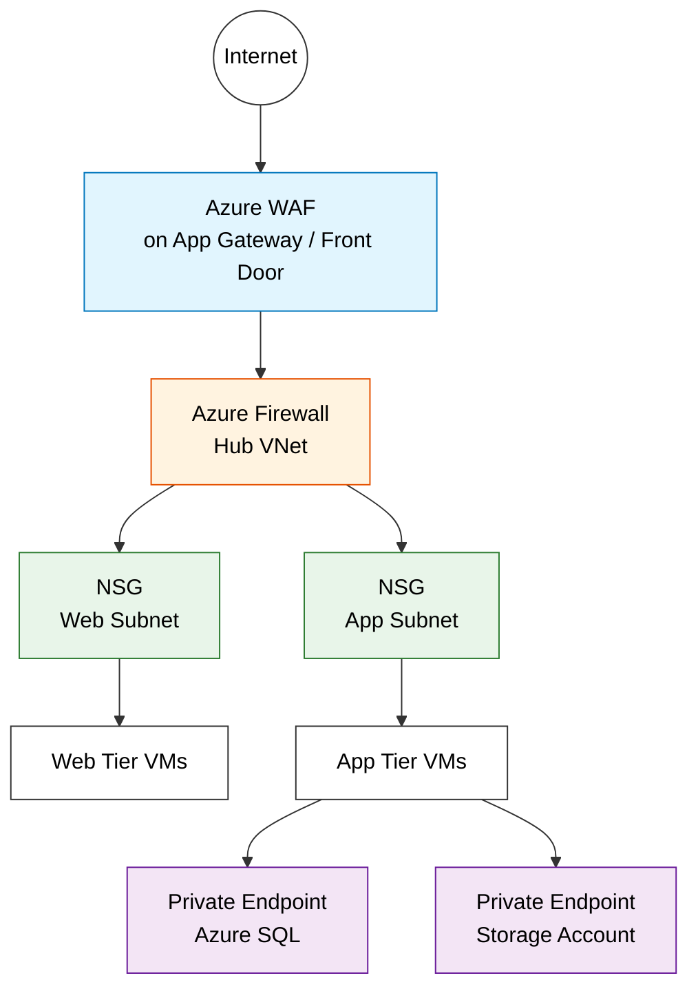

# Azure Network Security Services Comparison

> **Taxonomy Reference**: §5 Cloud & Infrastructure / Platform Architecture (see [architecture_taxonomy_reference.md](../../architecture-general/10-practicality-taxonomy/architecture_taxonomy_reference.md))
> **General Pattern**: [Security Architecture](../../architecture-general/06-security-architecture/)

## Table of Contents

- [1. Overview](#1-overview)
- [2. Service summaries](#2-service-summaries)
  - [2.1 Network Security Groups (NSG)](#21-network-security-groups-nsg)
  - [2.2 Azure Firewall](#22-azure-firewall)
  - [2.3 Azure Web Application Firewall (WAF)](#23-azure-web-application-firewall-waf)
  - [2.4 Azure Private Endpoint / Private Link](#24-azure-private-endpoint--private-link)
- [3. Comparison table](#3-comparison-table)
- [4. OSI layer coverage](#4-osi-layer-coverage)
- [5. When to use each](#5-when-to-use-each)
- [6. How they work together](#6-how-they-work-together)
- [7. Cost considerations](#7-cost-considerations)
- [8. Decision matrix](#8-decision-matrix)
- [9. References](#9-references)

---

## 1. Overview

Azure provides multiple network security services that operate at different layers and serve complementary purposes. Understanding their differences is critical for designing a defense-in-depth architecture.

| Aspect | NSG | Azure Firewall | WAF | Private Endpoint / Private Link |
|--------|-----|----------------|-----|-------------------------------|
| **Primary purpose** | Subnet/NIC-level traffic filtering | Centralized network security & threat intelligence | Web application attack protection | Private connectivity to PaaS services |
| **Security model** | Allow/deny IP & port rules | Stateful inspection, FQDN filtering, threat intel | OWASP rule-based inspection | Network isolation (eliminate public exposure) |

## 2. Service summaries

### 2.1 Network Security Groups (NSG)

A Network Security Group is a basic, stateful packet filter that operates at the subnet or NIC level. It contains inbound and outbound security rules that allow or deny traffic based on 5-tuple information (source/destination IP, source/destination port, protocol).

**Key characteristics:**
- Free to use (no additional cost)
- Applied to subnets or individual NICs
- Stateful — return traffic for an allowed flow is automatically permitted
- Rules evaluated by priority (lower number = higher priority)
- Default rules allow VNet-to-VNet and outbound internet; deny inbound internet
- Can reference Application Security Groups (ASGs) for logical grouping

### 2.2 Azure Firewall

Azure Firewall is a managed, cloud-native, stateful firewall-as-a-service that provides centralized network protection across VNets and subscriptions.

**Key characteristics:**
- Fully stateful with built-in high availability and unrestricted cloud scalability
- Supports L3, L4 (network rules) and L7 (application rules with FQDN filtering)
- Threat intelligence–based filtering (block known malicious IPs/domains)
- DNAT support for inbound traffic
- Centralized policy management with hierarchical policies
- TLS inspection (Premium SKU)
- IDPS — Intrusion Detection and Prevention System (Premium SKU)
- Requires a dedicated subnet (`AzureFirewallSubnet`, minimum /26)

### 2.3 Azure Web Application Firewall (WAF)

Azure WAF provides centralized protection for web applications against common exploits and vulnerabilities. It is deployed on Azure Application Gateway, Azure Front Door, or Azure CDN.

**Key characteristics:**
- Protects against OWASP Top 10 threats (SQL injection, XSS, etc.)
- Based on OWASP Core Rule Set (CRS)
- Layer 7 only — HTTP/HTTPS traffic inspection
- Bot protection rules
- Custom rules for geo-filtering, rate limiting, IP restriction
- Can operate in Detection or Prevention mode
- Deployed as part of Application Gateway (regional) or Front Door (global)

### 2.4 Azure Private Endpoint / Private Link

Azure Private Link enables private access to Azure PaaS services (Storage, SQL Database, Cosmos DB, etc.) over a private endpoint in your VNet. Traffic never traverses the public internet.

**Key characteristics:**
- Private Endpoint is a NIC with a private IP in your VNet
- Maps to a specific PaaS resource instance
- Eliminates data exfiltration risk via public endpoints
- Works across VNet peering, VPN, and ExpressRoute
- Requires DNS configuration (private DNS zones recommended)
- Private Link Service enables exposing your own services privately to consumers

## 3. Comparison table

| Feature | NSG | Azure Firewall | WAF | Private Endpoint / Private Link |
|---------|-----|----------------|-----|-------------------------------|
| **OSI layer** | L3/L4 | L3/L4/L7 | L7 | L3 (network-level isolation) |
| **Scope** | Subnet / NIC | VNet / cross-VNet (hub) | Per Application Gateway or Front Door | Per PaaS resource instance |
| **Statefulness** | Stateful | Fully stateful | N/A (proxy-based) | N/A |
| **FQDN filtering** | No | Yes (application rules) | N/A | N/A |
| **Threat intelligence** | No | Yes (known malicious IPs/domains) | No | No |
| **OWASP CRS protection** | No | No | Yes | No |
| **SQL injection / XSS protection** | No | No | Yes | No |
| **Bot protection** | No | No | Yes | No |
| **TLS inspection** | No | Yes (Premium SKU) | Yes (terminates TLS) | No |
| **IDPS** | No | Yes (Premium SKU) | No | No |
| **DNAT / SNAT** | No | Yes | No | No |
| **DNS-based filtering** | No | Yes (DNS proxy) | No | N/A |
| **Private connectivity to PaaS** | No | No | No | Yes |
| **Prevents data exfiltration** | Partially (IP-based) | Yes (FQDN + threat intel) | No | Yes (eliminates public exposure) |
| **Centralized management** | Per resource | Yes (Azure Firewall Manager) | Per WAF policy | Per resource |
| **High availability** | Built-in | Built-in | Depends on host service | Built-in |
| **Cost** | Free | ~$1.25/hr + data processing (Standard) | Included with App GW / Front Door WAF SKU | ~$7.30/month per endpoint + data processing |
| **Deployment model** | Declarative rules on subnet/NIC | Dedicated subnet in hub VNet | Attached to App GW / Front Door | NIC in consumer VNet |

## 4. OSI layer coverage

```
┌─────────────────────────────────────────────────────┐
│  Layer 7 (Application)                              │
│  ┌───────────────┐  ┌───────────────────────────┐   │
│  │   Azure WAF   │  │  Azure Firewall (App Rules)│  │
│  │  (HTTP/HTTPS) │  │     (FQDN filtering)       │  │
│  └───────────────┘  └───────────────────────────┘   │
├─────────────────────────────────────────────────────┤
│  Layer 4 (Transport)                                │
│  ┌───────────────┐  ┌───────────────────────────┐   │
│  │      NSG      │  │  Azure Firewall (Net Rules)│  │
│  │  (TCP/UDP)    │  │     (TCP/UDP/ICMP)         │  │
│  └───────────────┘  └───────────────────────────┘   │
├─────────────────────────────────────────────────────┤
│  Layer 3 (Network)                                  │
│  ┌───────────────┐  ┌───────────────────────────┐   │
│  │      NSG      │  │    Private Endpoint        │  │
│  │  (IP-based)   │  │  (Network isolation)       │  │
│  └───────────────┘  └───────────────────────────┘   │
└─────────────────────────────────────────────────────┘
```

## 5. When to use each

| Scenario | Recommended Service(s) |
|----------|----------------------|
| Basic subnet/NIC traffic filtering | **NSG** |
| Centralized outbound traffic control across VNets | **Azure Firewall** |
| Block traffic to/from known malicious IPs | **Azure Firewall** (threat intelligence) |
| Protect web apps from SQL injection, XSS | **WAF** |
| FQDN-based outbound filtering | **Azure Firewall** |
| Eliminate public internet exposure for PaaS services | **Private Endpoint** |
| Expose your own service privately to other tenants | **Private Link Service** |
| TLS inspection and IDPS | **Azure Firewall Premium** |
| Bot protection for web applications | **WAF** |
| Geo-filtering for web traffic | **WAF** |
| Micro-segmentation within a VNet | **NSG** + **ASG** |
| Hub-and-spoke network architecture | **Azure Firewall** (hub) + **NSG** (spokes) |
| Secure access to Azure SQL from on-premises | **Private Endpoint** + VPN/ExpressRoute |

## 6. How they work together

In a well-architected Azure deployment, these services are layered for defense-in-depth:



**Layered approach:**

1. **WAF** — Inspects inbound HTTP/HTTPS traffic for web application attacks
2. **Azure Firewall** — Centralized L3–L7 filtering, threat intelligence, FQDN filtering in a hub VNet
3. **NSG** — Micro-segmentation at each subnet/NIC, acts as a last line of defense
4. **Private Endpoint** — Ensures backend PaaS services (databases, storage) are only reachable via private network

## 7. Cost considerations

| Service | Pricing model | Approximate cost |
|---------|--------------|-----------------|
| **NSG** | Free | $0 |
| **Azure Firewall Standard** | Per hour + per GB processed | ~$912/month fixed + $0.016/GB |
| **Azure Firewall Premium** | Per hour + per GB processed | ~$1,314/month fixed + $0.016/GB |
| **WAF on App Gateway v2** | Per hour + per capacity unit | ~$246/month fixed + capacity |
| **WAF on Front Door** | Per policy + per request | ~$100/month per policy + $0.06/10K requests |
| **Private Endpoint** | Per hour + per GB processed | ~$7.30/month + $0.01/GB |

> **Note**: Prices are approximate and region-dependent. See [Azure pricing calculator](https://azure.microsoft.com/en-us/pricing/calculator/) for current rates.

## 8. Decision matrix

```
Do you need to filter traffic at subnet/NIC level?
  └─ YES → Use NSG (free, always recommended as baseline)

Do you need centralized outbound/inbound filtering across VNets?
  └─ YES → Use Azure Firewall

Do you need to protect web applications from OWASP threats?
  └─ YES → Use WAF (on App Gateway or Front Door)

Do you need to remove public internet exposure for PaaS services?
  └─ YES → Use Private Endpoint / Private Link

Do you need TLS inspection or IDPS?
  └─ YES → Use Azure Firewall Premium

Do you need all of the above?
  └─ YES → Layer them together (defense-in-depth)
```

## 9. References

- [What is Azure Firewall?](https://learn.microsoft.com/en-us/azure/firewall/overview)
- [Network security groups overview](https://learn.microsoft.com/en-us/azure/virtual-network/network-security-groups-overview)
- [What is Azure Web Application Firewall?](https://learn.microsoft.com/en-us/azure/web-application-firewall/overview)
- [What is Azure Private Link?](https://learn.microsoft.com/en-us/azure/private-link/private-link-overview)
- [What is a private endpoint?](https://learn.microsoft.com/en-us/azure/private-link/private-endpoint-overview)
- [Azure network security overview](https://learn.microsoft.com/en-us/azure/security/fundamentals/network-overview)

---

> **Related documentation**:
> - [Azure Firewall Overview](firewall/azure-firewall-overview.md)
> - [Azure Networking Fundamentals — NSG section](azure-networking-fundamentals.md#26-network-security-groups-nsg)
> - [Private Endpoints Guide](guides/03-private-endpoints-guide.md)
