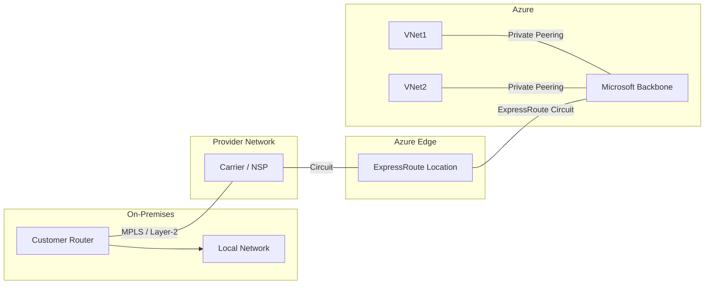

# ExpressRoute & BGP Routing Guide

See [Index](./01-index.md) for overview.

## Quick Comparison

| Aspect | VPN Gateway | ExpressRoute |
|--------|---|---|
| **Connection** | Internet (public) | Private dedicated line |
| **Bandwidth** | Up to 10 Gbps | Up to 100 Gbps |
| **Latency** | Variable | Consistent, low |
| **Cost** | Lower | Higher |
| **SLA** | Standard | 99.95% |
| **Routing** | Static/BGP | BGP (dynamic) |
| **Use** | General purpose | Mission-critical, enterprise |

---

## ExpressRoute Overview

**What it is:**
- Private, dedicated connection to Azure
- Bypass the public internet entirely
- Connect via service provider or exchange provider
- Microsoft maintains one end; you manage the other

**Architecture:**


---

## ExpressRoute Global Reach

**What it does:**
- Interconnects on-premises sites through Microsoft backbone
- Site A ↔ Site B via Microsoft network (not internet)
- Eliminates need for separate gateways between sites

**Typical Setup:**
```
Site A (New York)
    └─ ExpressRoute Circuit 1 → Microsoft Network ← ExpressRoute Circuit 2
                                        ↑
Site B (Los Angeles)          Global Reach enables
                              Site A ↔ Site B
                              
Benefits:
✅ Private site-to-site connectivity
✅ Lower latency than internet
✅ Leverages Microsoft global backbone
✅ Simplified topology
```

---

## BGP (Border Gateway Protocol)

**Purpose:**
Dynamic routing between on-premises and Azure networks

**How it Works:**
```
On-Premises Router          Azure Edge Router
   ASN: 65001                 ASN: 12076
       │                          │
       │ BGP Session              │
       ├──────────────────────────┤
       │   Route Exchange         │
       │                          │
   Advertises:            Advertises:
   10.0.0.0/8            Azure VNet ranges
   172.16.0.0/16         172.16.0.0/16
```

**Key Concepts:**
- **AS Number (ASN)**: Unique identifier for your network
- **Route Advertisement**: Announce network prefixes automatically
- **Failover**: Detect failures and reroute without manual changes
- **Path Optimization**: Control which route gets traffic via weights/preferences

---

## Why BGP for Multi-Site Failover?

**Scenario:**
- Two on-premises sites (NY, LA)
- Two Azure regions (East US, West US)
- Need automatic failover if one site goes down

**Solution: BGP with AS-Path Prepending**

```
Site A (Primary) → Shorter AS-Path (preferred)
Site B (Backup) → Longer AS-Path (less preferred)

If Site A fails:
  BGP withdraws routes
  Site B becomes active
  No manual intervention needed
```

**Why NOT HSRP or VRRP?**
- HSRP/VRRP: LAN gateway redundancy only (not WAN)
- BGP: WAN routing and cloud connectivity (what we need)
- ExpressRoute requires BGP for dynamic updates

---

## Routing Configuration Options

| Method | Dynamic | Failover | Use For |
|--------|---------|----------|---------|
| **BGP** | ✅ Yes | ✅ Auto | ExpressRoute, multi-site |
| **UDR** | ❌ No | ❌ Manual | Specific routing in VNet |
| **Default** | ❌ No | ❌ No | Basic routing |

---

## Common Scenarios

### Hub-and-Spoke with ExpressRoute

```
On-Premises (Main Office)
         │ ExpressRoute
         ▼ (BGP)
   Azure Hub VNet
    (Central gateway)
         │
    ┌────┼────┐
    │    │    │
   VNet1 VNet2 VNet3
  (Spokes via peering)
```

**BGP Configuration:**
- Hub advertises VNet ranges
- On-prem advertises local networks
- Dynamic route updates for any changes

### Global Reach Multi-Site

```
Site A (NY) → ExpressRoute Circuit A
                      │
              Microsoft Backbone
                      │
Site B (LA) ← ExpressRoute Circuit B

Global Reach enables:
  Site A ↔ Site B (via Microsoft backbone)
  BGP learns both sites' networks
  Failover automatic if circuit fails
```

---

## Key Takeaways

1. **ExpressRoute** = Private dedicated connection
2. **BGP** = Dynamic routing protocol for ExpressRoute
3. **Failover** = Automatic when using BGP
4. **Global Reach** = Connect multiple on-prem sites via Azure backbone
5. **NOT HSRP/VRRP** = These are LAN protocols, not WAN/cloud

---

## References

- [Azure ExpressRoute Documentation](https://learn.microsoft.com/en-us/azure/expressroute/)
- [ExpressRoute Global Reach](https://learn.microsoft.com/en-us/azure/expressroute/expressroute-global-reach)
- [ExpressRoute Routing](https://learn.microsoft.com/en-us/azure/expressroute/expressroute-routing)
- [Border Gateway Protocol](https://learn.microsoft.com/en-us/windows-server/remote/remote-access/bgp/border-gateway-protocol-bgp)
