# Azure Roles Comprehensive Guide

## Table of Contents

- [Overview](#overview)
- [The Two Role Systems in Azure](#the-two-role-systems-in-azure)
- [Microsoft Entra ID Roles](#microsoft-entra-id-roles)
  - [What Are Microsoft Entra ID Roles?](#what-are-microsoft-entra-id-roles)
  - [Scope of Microsoft Entra ID Roles](#scope-of-microsoft-entra-id-roles)
  - [Common Microsoft Entra ID Roles](#common-microsoft-entra-id-roles)
  - [Microsoft Entra ID Role Hierarchy](#microsoft-entra-id-role-hierarchy)
  - [Assignment Scope Levels](#assignment-scope-levels)
  - [Practice Question: Assigning Directory Roles to Users](#practice-question-assigning-directory-roles-to-users)
- [Azure RBAC Roles](#azure-rbac-roles)
  - [What Are Azure RBAC Roles?](#what-are-azure-rbac-roles)
  - [Scope of Azure RBAC Roles](#scope-of-azure-rbac-roles)
  - [Common Azure RBAC Roles](#common-azure-rbac-roles)
  - [Azure RBAC Hierarchy](#azure-rbac-hierarchy)
  - [Role Assignment Inheritance](#role-assignment-inheritance)
- [Critical Differences: Microsoft Entra ID vs Azure RBAC](#critical-differences-microsoft-entra-id-vs-azure-rbac)
- [Non-RBAC Access Control Methods](#non-rbac-access-control-methods)
  - [Storage Account Access Methods](#storage-account-access-methods)
  - [Key Vault Access Methods](#key-vault-access-methods)
  - [Service Bus and Event Hubs Access](#service-bus-and-event-hubs-access)
  - [Cosmos DB Access Methods](#cosmos-db-access-methods)
  - [SQL Database Access Methods](#sql-database-access-methods)
  - [When to Use Non-RBAC vs RBAC](#when-to-use-non-rbac-vs-rbac)
- [Azure Subscription Hierarchy](#azure-subscription-hierarchy)
  - [Tenant Structure](#tenant-structure)
  - [Management Group Hierarchy](#management-group-hierarchy)
  - [Subscription Level](#subscription-level)
  - [Resource Group Level](#resource-group-level)
  - [Resource Level](#resource-level)
- [Classic Subscription Administrator Roles (Deprecated)](#classic-subscription-administrator-roles-deprecated)
- [Role Assignment Best Practices](#role-assignment-best-practices)
- [Common Scenarios and Solutions](#common-scenarios-and-solutions)
  - [Administrative Units: Deep Dive](#administrative-units-deep-dive)
  - [Microsoft 365 Groups vs Security Groups](#microsoft-365-groups-vs-security-groups)
- [Privileged Identity Management (PIM)](#privileged-identity-management-pim)
- [Cross-Tenant and Multi-Tenant Considerations](#cross-tenant-and-multi-tenant-considerations)
- [Troubleshooting Common Issues](#troubleshooting-common-issues)
- [Custom Role Configuration - Practical Examples](#custom-role-configuration---practical-examples)
  - [Understanding Custom Role Components](#understanding-custom-role-components)
  - [Common Exam Scenarios: Custom Role Configuration](#common-exam-scenarios-custom-role-configuration)
  - [assignableScopes Scope Hierarchy](#assignablescopes-scope-hierarchy)
  - [assignableScopes Best Practices](#assignablescopes-best-practices)
  - [Key Takeaways: Custom Role Configuration](#key-takeaways-custom-role-configuration)
  - [Common Mistakes to Avoid](#common-mistakes-to-avoid)
- [Quick Reference Tables](#quick-reference-tables)

---

## Overview

Azure uses **two separate and independent role-based access control (RBAC) systems**:

1. **Microsoft Entra ID Roles** - Control access to Microsoft Entra ID resources
2. **Azure RBAC Roles** - Control access to Azure resources (subscriptions, resource groups, resources)

Understanding the distinction between these two systems is critical for proper Azure security configuration and troubleshooting access issues.

---

## The Two Role Systems in Azure

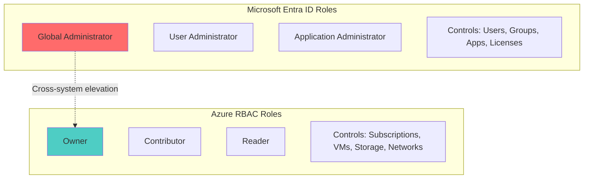

**Key Principle:** These are **separate systems** with different purposes, scopes, and permissions.

---

## Microsoft Entra ID Roles

### What Are Microsoft Entra ID Roles?

Microsoft Entra ID roles control access to **Microsoft Entra ID resources** such as:
- Users and groups
- Applications and service principals
- Licenses
- Domains
- Directory settings
- Conditional Access policies
- Identity Governance

### Scope of Microsoft Entra ID Roles

| Scope Level | Description | Example |
|-------------|-------------|---------|
| **Tenant-wide** | Applies to the entire Microsoft Entra ID tenant | Global Administrator managing all users |
| **Administrative Unit** | Limited to specific organizational units | User Admin for HR department only |
| **Application-specific** | Limited to specific applications | Application Administrator for App1 |

### Common Microsoft Entra ID Roles

#### Tier 0: Highest Privilege Roles

| Role | Description | Key Permissions |
|------|-------------|-----------------|
| **Global Administrator** | Full access to all Microsoft Entra ID features | • Manage all aspects of Microsoft Entra ID<br>• Assign any Microsoft Entra ID role<br>• Elevate access to Azure resources<br>• Reset passwords for all users |
| **Privileged Role Administrator** | Manage role assignments in Microsoft Entra ID | • Assign Microsoft Entra ID roles<br>• Manage PIM settings<br>• Review access |
| **Security Administrator** | Manage security-related features | • Manage security policies<br>• Read security information<br>• Manage Conditional Access |

#### Tier 1: Administrative Roles

| Role | Description | Key Permissions |
|------|-------------|-----------------|
| **User Administrator** | Manage users and groups | • Create/delete users<br>• Reset user passwords (non-admins)<br>• Manage user licenses<br>• Manage groups |
| **Application Administrator** | Manage enterprise applications | • Create/manage applications<br>• Manage app registrations<br>• Configure app proxy |
| **Intune Administrator** | Manage Intune service | • Manage devices<br>• Configure policies<br>• Deploy applications |
| **Exchange Administrator** | Manage Exchange Online | • Manage mailboxes<br>• Configure Exchange settings |
| **SharePoint Administrator** | Manage SharePoint Online | • Manage SharePoint sites<br>• Configure SharePoint settings |

#### Tier 2: Read-Only and Specialized Roles

| Role | Description | Key Permissions |
|------|-------------|-----------------|
| **Global Reader** | Read-only access to all Microsoft Entra ID features | • View all Microsoft Entra ID settings<br>• Cannot make changes |
| **Directory Readers** | Read basic directory information | • Read basic directory data<br>• Read user/group information |
| **Helpdesk Administrator** | Reset passwords for non-administrators | • Reset passwords for users<br>• View user properties |
| **Security Reader** | Read security information | • View security reports<br>• Read security settings |

### Microsoft Entra ID Role Hierarchy

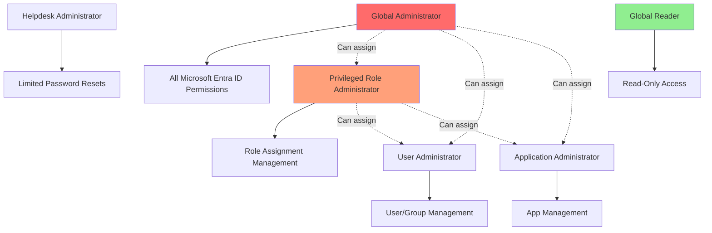

### Assignment Scope Levels

Microsoft Entra ID roles can be assigned at different scopes:

#### 1. Directory Scope (Tenant-wide)
```
Global Administrator → Entire Tenant
├── All Users
├── All Groups
├── All Applications
└── All Settings
```

#### 2. Administrative Unit Scope
```
User Administrator (HR AU) → HR Administrative Unit Only
├── HR Users
├── HR Groups
└── HR Settings
```

#### 3. Application Scope
```
Cloud Application Administrator → Specific Application
└── App1 Registration and Enterprise App
```

### Practice Question: Assigning Directory Roles to Users

**Scenario:**

You have an Azure Active Directory (Azure AD) tenant that contains 5,000 user accounts.

You create a new user account named AdminUser1.

You need to assign the **User Administrator** administrative role to AdminUser1.

**Question:** What should you do from the user account properties?

#### Options Analysis

**❌ Option A: From the Groups blade, invite the user account to a new group**

**Why this is incorrect:**
- Groups in Azure AD are used for organizing users and managing access to resources
- Adding a user to a group does NOT grant administrative roles unless the group is explicitly assigned a role (role-assignable groups)
- This option doesn't describe assigning a role to a group, only adding a user to a group
- Simply adding a user to a regular group will not grant any administrative permissions

**❌ Option B: From the Licenses blade, assign a new license**

**Why this is incorrect:**
- Assigning a license grants access to specific services (e.g., Microsoft 365, Dynamics 365, Azure AD Premium features)
- Licenses enable service functionality but do NOT provide administrative permissions
- Example: Assigning an Azure AD Premium P2 license enables features like Conditional Access and PIM, but doesn't make the user an administrator
- Administrative roles must be explicitly assigned separately from licenses

**✅ Option C: From the Directory role blade, modify the directory role**

**Why this is CORRECT:**
- The **Directory role blade** (also called "Assigned roles" in the Azure portal) is where you assign Microsoft Entra ID administrative roles
- This is the proper method to grant administrative permissions like User Administrator
- User Administrator role allows the user to manage user-related tasks such as:
  - Resetting passwords for non-administrator users
  - Creating and deleting users
  - Managing group membership
  - Managing user licenses
  - Managing user properties

#### Step-by-Step: How to Assign a Directory Role

**Method 1: From the User's Properties**

1. Navigate to: **Azure Portal** → **Microsoft Entra ID** → **Users**
2. Select the user: **AdminUser1**
3. Click: **Assigned roles** (in the left menu)
4. Click: **+ Add assignments**
5. Search for and select: **User Administrator**
6. Click: **Add**

**Method 2: From the Roles and Administrators Section**

1. Navigate to: **Azure Portal** → **Microsoft Entra ID** → **Roles and administrators**
2. Search for and click: **User Administrator**
3. Click: **+ Add assignments**
4. Search for and select: **AdminUser1**
5. Click: **Add**

#### Visual Flow

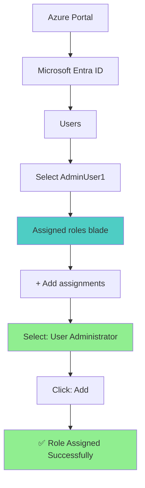

#### Key Concepts

**1. Directory Roles vs Group Membership**
```
Directory Role Assignment (Assigned roles blade)
├── Grants administrative permissions
├── Scoped to Microsoft Entra ID resources
└── Examples: User Administrator, Global Administrator

Group Membership (Groups blade)
├── Organizes users
├── Can be used for resource access (when assigned to resources)
├── Does NOT grant admin roles (unless role-assignable group)
└── Examples: HR-Department, Marketing-Team
```

**2. Role-Assignable Groups (Advanced Scenario)**

It's worth noting that Azure AD does support **role-assignable groups**, which is an advanced feature:

- **Requirements**: Azure AD Premium P1 or P2 license
- **How it works**: You can create a special group that can have directory roles assigned to it
- **Benefit**: Any user added to this group automatically gets the assigned role
- **Creation**: Must be designated as "role-assignable" at creation time (cannot be changed later)

**Example:**
```powershell
# Create a role-assignable group
New-MgGroup -DisplayName "User Administrators Group" `
    -IsAssignableToRole $true `
    -MailEnabled $false `
    -SecurityEnabled $true

# Assign User Administrator role to the group
# Then add AdminUser1 to this group
```

**However**, in the exam question:
- The question asks about using the **user account properties**
- The option only mentions "From the Groups blade, invite the user to a new group"
- It doesn't specify creating a role-assignable group or assigning a role to that group
- Therefore, this option is incorrect in the context of the question

#### Role-Assignable Groups and Nested Group Limitations

**Critical Limitation: Role-assignable groups CANNOT contain other groups as members.**

This is a fundamental security restriction that prevents privilege escalation through nested group membership.

**What Are Role-Assignable Groups?**

Role-assignable groups are special groups that can be assigned Azure AD administrative roles or Azure RBAC roles. When you enable "Azure AD roles can be assigned to the group" = Yes, the group becomes role-assignable.

**Key Characteristics:**

| Feature | Role-Assignable Group | Regular Security Group |
|---------|----------------------|------------------------|
| **Can be assigned Azure AD roles** | ✅ Yes | ❌ No |
| **Can be assigned Azure RBAC roles** | ✅ Yes | ✅ Yes |
| **Can contain users** | ✅ Yes | ✅ Yes |
| **Can contain other groups (nesting)** | ❌ **NO** | ✅ Yes |
| **Can be nested in other groups** | ❌ **NO** | ✅ Yes |
| **Requires Premium License** | ✅ Yes (P1 or P2) | ❌ No |
| **Can change after creation** | ❌ No (immutable) | ✅ Yes |

**Security Rationale:**

The prohibition on nesting prevents scenarios like:
```
❌ BLOCKED SCENARIO:
Group1 (Role-Assignable, has Owner role for RG1)
└── Group2 (contains User2) ← CANNOT add Group2 to Group1!
    └── User2 would inherit Owner role → Security risk
```

**Exam Scenario: Role Assignment with Role-Assignable Groups**

**Scenario:**
- User1 → Member of Group1
- User2 → Member of Group2  
- User3 → Member of Group3
- All groups have "Azure AD roles can be assigned to the group" = **Yes**
- RG1 has role assignments: Group1 = Owner

**Questions:**
1. Can you assign User2 the Owner role for RG1 by adding Group2 as a member of Group1? **NO**
2. Can you assign User3 the Owner role for RG1 by adding Group3 as a member of Group1? **NO**
3. Can you assign User3 the Owner role for RG1 by assigning the Owner role to Group3? **YES**

**Explanation:**

**Statement 1 & 2: NO** ❌
```
❌ Adding groups as members of role-assignable groups is NOT supported

Group1 (Role-Assignable = Yes, Owner for RG1)
├── ❌ CANNOT add Group2 as member
└── ❌ CANNOT add Group3 as member

Why? Security restriction: Role-assignable groups cannot have other groups as members
```

**Statement 3: YES** ✅
```
✅ Directly assigning Azure RBAC role to Group3 works

Resource Group RG1
├── Role Assignment 1: Group1 → Owner (existing)
└── Role Assignment 2: Group3 → Owner (new assignment)
    └── User3 inherits Owner role through Group3 membership

Why? This is a direct role assignment, not nested group membership
```

**Key Takeaways:**

1. 🔑 **Role-assignable groups CANNOT contain other groups** - No nesting allowed
2. 🔑 **Role-assignable groups CANNOT be nested in other groups** - Works both ways
3. 🔑 **Direct role assignment to groups always works** - Regardless of role-assignable status
4. 🔑 **Users inherit roles from their direct group memberships** - Not from nested groups (for role-assignable groups)

**Valid Pattern:**
```bash
# ✅ CORRECT: Assign Owner role directly to Group3
az role assignment create \
  --role "Owner" \
  --assignee-object-id <Group3-object-id> \
  --scope "/subscriptions/<sub-id>/resourceGroups/RG1"

# User3 now has Owner role through Group3 membership
```

**Invalid Pattern:**
```bash
# ❌ INCORRECT: Try to add Group3 to Group1
# This will FAIL because Group1 is role-assignable
az ad group member add \
  --group Group1 \
  --member-id <Group3-object-id>

# Error: Adding groups as members of a role-assignable group is not supported
```

**Exam Recognition Pattern:**

When you see:
- "Azure AD roles can be assigned to the group" = **Yes**
- Questions about "adding Group X as a member of Group Y"
- Think: **CANNOT add groups to role-assignable groups**

**3. Licenses vs Roles**
```
Licenses
├── Enable service features
├── Examples: Azure AD Premium P2, Microsoft 365 E5
├── Grant access to services (PIM, Conditional Access, Office apps)
└── Do NOT grant administrative permissions

Directory Roles
├── Grant administrative permissions
├── Examples: User Administrator, Global Administrator
├── Allow management of Entra ID resources
└── Require licenses for some features (e.g., PIM requires P2)
```

#### Answer Summary

To assign the User Administrator role to AdminUser1, you must:

✅ **Navigate to the Directory role blade (Assigned roles) and modify the directory role**

This can be done either:
- From the user's **Assigned roles** blade (User properties → Assigned roles)
- From the **Roles and administrators** section in Microsoft Entra ID

---

### Practice Question 2: Assigning Azure AD Premium Licenses

#### Scenario

You have an Azure Active Directory (Azure AD) tenant named `contoso.onmicrosoft.com` that contains 100 user accounts.

You purchase 10 Azure AD Premium P2 licenses for the tenant.

You need to ensure that 10 users can use all the Azure AD Premium features.

**Question:** What should you do?

#### Options Analysis

**❌ Option A: From the Directory role blade of each user, modify the directory role**

**Why this is incorrect:**
- Changing a user's directory role assigns administrative privileges (e.g., Global Administrator, User Administrator)
- Directory roles grant **administrative permissions** to manage Azure AD resources
- Directory roles do NOT enable premium features that are tied to Azure AD Premium licensing
- Administrative roles and licenses are completely separate concepts
- A user can be a Global Administrator but still not have access to premium features without a license

**✅ Option B: From the Licenses blade of Azure AD, assign a license**

**Why this is CORRECT:**
- To enable specific users to access Azure AD Premium P2 features, you **must assign licenses** to those users
- The **Licenses blade** in Azure AD allows you to assign purchased licenses to users
- Once assigned, users gain access to all Premium P2 features including:
  - **Privileged Identity Management (PIM)**: Just-in-time privileged access
  - **Identity Protection**: Risk-based conditional access and identity risk detection
  - **Access Reviews**: Automated reviews of group memberships and application access
  - **Conditional Access policies**: Advanced access control based on signals
  - **Entitlement Management**: Automated access package management
- Without a license assignment, premium features remain unavailable regardless of user roles

**❌ Option C: From the Azure AD domain, add an enterprise application**

**Why this is incorrect:**
- Adding an enterprise application allows integration with third-party or custom applications
- Enterprise applications enable SSO (Single Sign-On) and application access management
- This does NOT assign Azure AD Premium features to users
- Enterprise applications are for application integration, not feature licensing

**❌ Option D: From the Groups blade of each user, invite the users to a group**

**Why this is incorrect:**
- Inviting users to a group is for organizational purposes and resource access management
- Groups can be used for license assignment (group-based licensing), but the option doesn't specify this
- The option says "invite the users to a group" which doesn't automatically assign licenses
- Even with group-based licensing, you still need to assign the license to the **group**, not just add users to it

#### Step-by-Step: How to Assign Licenses

**Method 1: Assign Licenses to Individual Users**

1. Navigate to: **Azure Portal** → **Microsoft Entra ID** → **Licenses** → **All products**
2. Select: **Azure Active Directory Premium P2**
3. Click: **+ Assign**
4. Click: **Add users**
5. Select the 10 users who need access
6. Click: **Select**
7. Review **Assignment options** (ensure all features are enabled)
8. Click: **Assign**

**Method 2: Group-Based License Assignment (Recommended for Larger Deployments)**

1. Navigate to: **Azure Portal** → **Microsoft Entra ID** → **Groups**
2. Create a new group (e.g., "Premium Users") or select an existing group
3. Add the 10 users to this group
4. Navigate to: **Microsoft Entra ID** → **Licenses** → **All products**
5. Select: **Azure Active Directory Premium P2**
6. Click: **+ Assign**
7. Click: **Add groups**
8. Select the group containing your 10 users
9. Review **Assignment options**
10. Click: **Assign**

#### Visual Flow

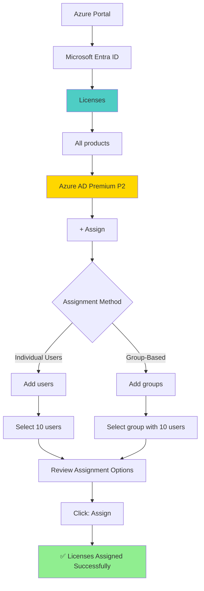

#### Key Concepts

**1. Azure AD Premium P2 Features**
```
Azure AD Premium P2 License Enables:
├── Privileged Identity Management (PIM)
│   ├── Just-in-time privileged access
│   ├── Time-bound access
│   └── Approval-based role activation
├── Identity Protection
│   ├── Risk-based conditional access
│   ├── Identity risk detection
│   └── Vulnerability reporting
├── Access Reviews
│   ├── Periodic access certification
│   ├── Automated group membership reviews
│   └── Application access reviews
├── Entitlement Management
│   ├── Access packages
│   ├── Automated access workflows
│   └── External user access management
└── All Premium P1 features
    ├── Conditional Access
    ├── Self-service password reset
    └── Cloud app discovery
```

**2. Licenses vs Roles (Critical Distinction)**
```
Licenses:
├── Purpose: Enable service features and capabilities
├── Examples: Azure AD Premium P2, Microsoft 365 E5
├── Grant: Access to premium features (PIM, Identity Protection, etc.)
├── Assignment: Via Licenses blade
└── Effect: Users can USE premium features

Directory Roles:
├── Purpose: Grant administrative permissions
├── Examples: Global Administrator, User Administrator
├── Grant: Permission to MANAGE Azure AD resources
├── Assignment: Via Directory role blade (Assigned roles)
└── Effect: Users can ADMINISTER resources

Key Difference:
├── A user with a Premium P2 license can USE Identity Protection
└── A user with Security Administrator role can CONFIGURE Identity Protection
    └── But needs the license to access the feature!
```

**3. Group-Based License Assignment Benefits**
```
Group-Based Licensing:
├── Automated license assignment
│   └── Users automatically get licenses when added to group
├── Centralized management
│   └── Manage licenses at group level, not individual users
├── Automatic license removal
│   └── Licenses removed when users leave the group
├── Error handling
│   └── Azure AD reports licensing conflicts
└── Best Practice for:
    ├── Large-scale deployments
    ├── Dynamic user populations
    └── Department or role-based licensing
```

**4. Group Type Requirements for License Assignment**

Not all group types can be assigned licenses in Microsoft Entra ID. Understanding which groups are eligible for license assignment is critical for proper planning.

**Eligible Group Types for License Assignment:**

| Group Type | Security Enabled | Can Assign Licenses | Notes |
|------------|------------------|---------------------|-------|
| **Security Group** | ✅ Yes | ✅ Yes | Standard group for license assignment |
| **Microsoft 365 Group** | ✅ Yes | ✅ Yes | Must be security-enabled |
| **Mail-enabled Security Group** | ✅ Yes | ❌ No | **Cannot assign licenses** |
| **Security-disabled Microsoft 365 Group** | ❌ No | ❌ No | **Cannot assign licenses** |

**Key Rules:**

1. **Security-enabled groups are required** - The group must have security enabled to receive license assignments
2. **Mail-enabled security groups are NOT supported** - Even though they are security-enabled, Microsoft Entra ID does not allow license assignment to mail-enabled security groups
3. **Microsoft 365 groups must be security-enabled** - Security-disabled Microsoft 365 groups cannot receive licenses

**Example Scenario:**

You have the following groups and need to assign Azure AD Premium P2 licenses:

```
Group1: Security Group (Security Enabled) → ✅ Can assign licenses
Group2: Mail-enabled Security Group (Security Enabled) → ❌ Cannot assign licenses
Group3: Microsoft 365 Group (Security Enabled) → ✅ Can assign licenses
Group4: Microsoft 365 Group (Security Disabled) → ❌ Cannot assign licenses
```

**Answer:** You can assign licenses to **Group1 and Group3 only**.

**Why This Matters:**

When planning group-based licensing deployments:
- Use regular **Security Groups** for pure license management
- Use **Microsoft 365 Groups** when you need both licensing AND collaboration features (mailbox, SharePoint, Teams)
- Avoid **mail-enabled security groups** for licensing purposes
- Ensure Microsoft 365 groups have security enabled if they will be used for license assignment

**5. License Assignment Options**
```
When assigning a license, you can control:
├── Which service plans to enable/disable
│   └── Example: Enable PIM but disable Access Reviews
├── Location assignment (for multi-geo tenants)
├── Automatic assignment via groups
└── License inheritance from parent groups
```

#### Common Pitfalls

**❌ Mistake 1: Confusing Roles with Licenses**
- Assigning a Security Administrator role does NOT give access to Premium P2 features
- The user needs BOTH: a license (to access features) AND appropriate role (to configure them)

**❌ Mistake 2: Assuming Enterprise Apps Provide Licenses**
- Enterprise applications are for SSO and app integration
- They don't enable Azure AD Premium features

**❌ Mistake 3: Not Verifying License Availability**
- Ensure you have enough licenses before assigning
- Check **Licenses** → **All products** → **Azure AD Premium P2** to see available licenses

**❌ Mistake 4: Using Groups Without Group-Based Licensing**
- Simply adding users to a group doesn't assign licenses
- You must assign the license to the group itself

#### Answer Summary

To enable 10 users to use all Azure AD Premium P2 features:

✅ **Navigate to the Licenses blade in Azure AD and assign Azure AD Premium P2 licenses to the 10 users**

This can be done either:
- **Individual assignment**: Licenses → All products → Azure AD Premium P2 → Assign → Add users
- **Group-based assignment**: Create/use group → Licenses → All products → Azure AD Premium P2 → Assign → Add groups (Recommended)

---

## Azure RBAC Roles

### What Are Azure RBAC Roles?

Azure RBAC roles control access to **Azure resources** such as:
- Virtual machines
- Storage accounts
- Databases
- Networks
- Application services
- Resource groups
- Subscriptions

### Scope of Azure RBAC Roles

Azure RBAC uses a hierarchical scope model:

```
Management Group
└── Subscription
    └── Resource Group
        └── Resource
```

Permissions **inherit down** the hierarchy.

### Common Azure RBAC Roles

#### Fundamental Built-in Roles

| Role | Description | Key Permissions | Typical Use Case |
|------|-------------|-----------------|------------------|
| **Owner** | Full access to all resources | • All resource operations<br>• Assign roles to others<br>• Modify locks | Production subscription administrators |
| **Contributor** | Full access to manage resources | • Create/modify/delete resources<br>• **Cannot** assign roles<br>• **Cannot** modify locks | Developers who need to manage resources but not permissions |
| **Reader** | View all resources | • Read all resource properties<br>• **Cannot** make any changes | Auditors, security reviewers |
| **User Access Administrator** | Manage user access only | • Assign roles to others<br>• **Cannot** manage resources | Security teams managing access |

#### Resource-Specific Roles

| Category | Example Roles | Purpose |
|----------|---------------|---------|
| **Compute** | Virtual Machine Contributor<br>Virtual Machine Administrator Login | Manage VMs and VM access |
| **Networking** | Network Contributor<br>DNS Zone Contributor | Manage network resources |
| **Storage** | Storage Blob Data Owner<br>Storage Blob Data Contributor<br>Storage Blob Data Reader | Access storage data (data plane) |
| **Databases** | SQL DB Contributor<br>Cosmos DB Account Reader | Manage database resources |
| **Security** | Key Vault Administrator<br>Key Vault Secrets User | Manage Key Vault resources and secrets |

#### Management Plane vs Data Plane Roles

| Plane | Description | Example Operations | Example Roles |
|-------|-------------|-------------------|---------------|
| **Management Plane** | Azure Resource Manager operations | Create storage account<br>Delete resource group<br>Configure network | Contributor<br>Owner<br>Network Contributor |
| **Data Plane** | Operations on data within resources | Read blob data<br>Write to database<br>Access Key Vault secrets | Storage Blob Data Reader<br>Key Vault Secrets User |

### Azure RBAC Hierarchy

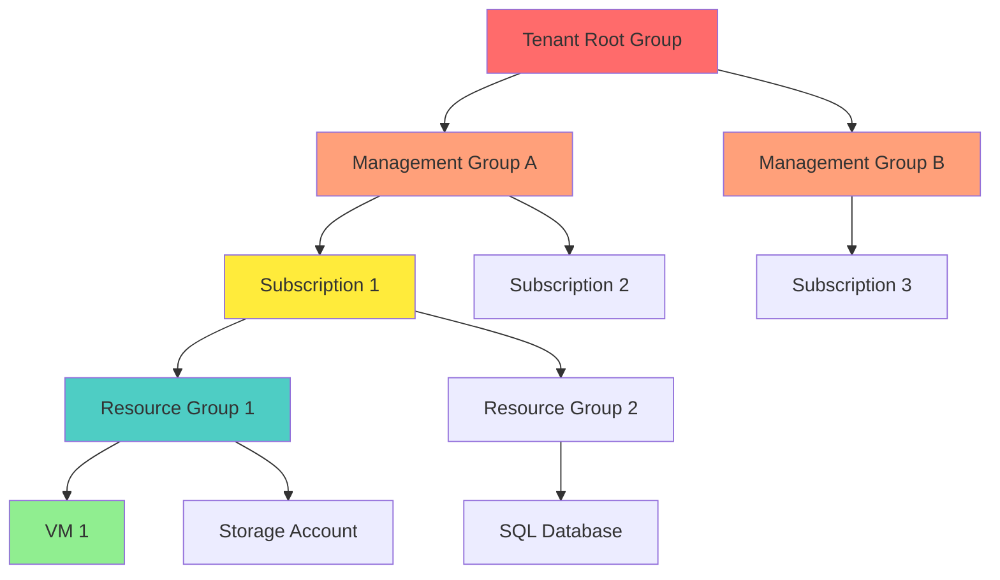

### Role Assignment Inheritance

```
Owner at Management Group Level
├── Applies to all child Management Groups
├── Applies to all Subscriptions
│   ├── Applies to all Resource Groups
│   │   └── Applies to all Resources
```

**Example:**
```
User1: Owner → Management Group "Production"
    ↓ Inherits to
Subscription "Prod-Apps"
    ↓ Inherits to
Resource Group "WebApp-RG"
    ↓ Inherits to
App Service "webapp-prod-01"
```

User1 has Owner permissions on the App Service through inheritance.

---

## Critical Differences: Microsoft Entra ID vs Azure RBAC

| Aspect | Microsoft Entra ID Roles | Azure RBAC Roles |
|--------|----------------|------------------|
| **Purpose** | Manage Microsoft Entra ID resources | Manage Azure resources |
| **Controls Access To** | Users, groups, applications, licenses | VMs, storage, networks, databases |
| **Scope** | Tenant, Administrative Unit, Application | Management Group, Subscription, Resource Group, Resource |
| **Where Assigned** | Azure Portal → Microsoft Entra ID → Roles | Azure Portal → Resource → Access Control (IAM) |
| **Inheritance** | No inheritance (scope-specific) | Hierarchical inheritance (top-down) |
| **Example Roles** | Global Administrator, User Administrator | Owner, Contributor, Reader |
| **Can Manage Subscriptions?** | No (except Global Admin elevation) | Yes (Owner, Contributor) |
| **Can Manage Users?** | Yes | No |
| **Number of Built-in Roles** | ~100+ roles | 300+ roles |
| **Custom Roles** | Supported (Premium P1/P2) | Supported |

### Visual Comparison

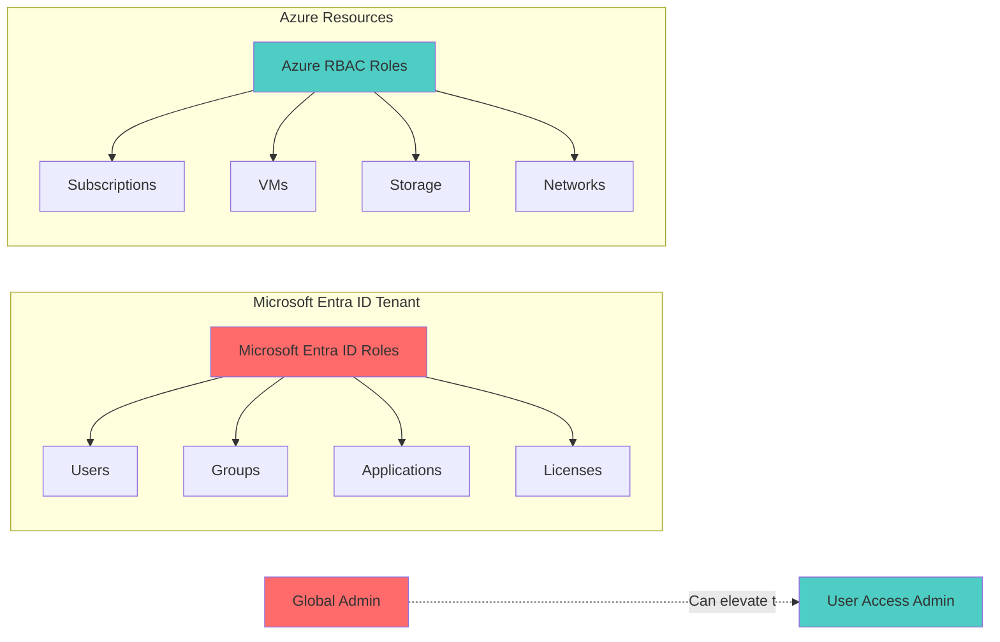

---

## Global Administrator Access Elevation

### The Critical Separation

**Most Important Rule:** Global Administrator in Microsoft Entra ID has **NO** default permissions to manage Azure subscriptions or resources.

```
Global Administrator (Entra ID role)
├── CAN: Manage users, groups, applications, licenses
├── CAN: Reset passwords, assign Entra ID roles
├── CANNOT: View Azure subscriptions (without RBAC)
├── CANNOT: Create resource groups (without RBAC)
└── CANNOT: Manage Azure resources (without RBAC)
```

### Access Elevation Feature

Global Administrators have a special capability to **temporarily elevate** their access to Azure resources.

#### How Elevation Works


**Steps:**
1. Navigate to: Azure Portal → Microsoft Entra ID → Properties
2. Toggle: "Access management for Azure resources" to **Yes**
3. Result: Global Admin receives **User Access Administrator** role at **root scope** (/)
4. **Important**: Disable the toggle after use!

#### Permissions Granted by Elevation

```
User Access Administrator at root scope (/)
├── All Management Groups (can assign roles)
├── All Subscriptions (can assign roles)
│   ├── All Resource Groups (can assign roles)
│   └── All Resources (can assign roles)
├── ✅ CAN: Assign any RBAC role at any scope
├── ✅ CAN: View all subscriptions and resources
└── ⚠️ CANNOT: Create/modify resources (needs Owner/Contributor for that)
```

### Real-World Exam Scenario

**Setup:**
- Three Global Administrators: Admin1, Admin2, Admin3
- Admin3 has **Owner** role on subscription (Azure RBAC)
- Admin1 has **enabled** "Access management for Azure resources"
- Admin2 has **only** Global Administrator (no Azure RBAC role)

**Question 1: Can Admin1 add Admin2 as owner of the subscription?**

✅ **YES**

**Explanation:**
- Admin1 is a Global Administrator
- Admin1 enabled "Access management for Azure resources"
- This grants Admin1 **User Access Administrator at root scope**
- User Access Administrator can assign ANY RBAC role to ANY subscription
- Therefore, Admin1 can assign Admin2 as Owner

```
Admin1 permissions:
├── Global Administrator (Entra ID)
├── Access elevation enabled
├── → User Access Administrator at root (/)
└── → Can assign Owner role to Admin2 on subscription ✅
```

**Question 2: Can Admin3 add Admin2 as owner of the subscription?**

✅ **YES**

**Explanation:**
- Admin3 has the **Owner** role on the subscription
- Owner includes `Microsoft.Authorization/roleAssignments/*` permission
- This allows assigning any RBAC role within the subscription scope
- Therefore, Admin3 can assign Admin2 as Owner

```
Admin3 permissions:
├── Global Administrator (Entra ID) - not relevant for this action
├── Owner (Azure RBAC on subscription)
├── → Has Microsoft.Authorization/roleAssignments/* permission
└── → Can assign Owner role to Admin2 on subscription ✅
```

**Question 3: Can Admin2 create a resource group in the subscription?**

❌ **NO**

**Explanation:**
- Admin2 is a Global Administrator (Entra ID role)
- Admin2 has **NO Azure RBAC role** on the subscription
- Creating resource groups requires Azure RBAC permissions (Contributor or Owner)
- Global Administrator **does not** grant Azure resource permissions
- Admin2 cannot create resource groups

```
Admin2 permissions:
├── Global Administrator (Entra ID)
│   ✅ CAN: Create users, reset passwords, manage Entra ID
│   ❌ CANNOT: Access subscriptions, create resources
├── NO Azure RBAC role on subscription
└── → Cannot create resource groups ❌
```

### Permission Comparison Matrix

| Action | Global Admin<br/>(No RBAC) | Global Admin<br/>(Elevated) | Subscription<br/>Owner | Contributor |
|--------|----------------------------|----------------------------|----------------------|-------------|
| Manage Entra ID users | ✅ Yes | ✅ Yes | ❌ No | ❌ No |
| Reset user passwords | ✅ Yes | ✅ Yes | ❌ No | ❌ No |
| View subscription resources | ❌ No | ✅ Yes | ✅ Yes | ✅ Yes |
| Create resource groups | ❌ No | ✅ Yes | ✅ Yes | ✅ Yes |
| Create VMs | ❌ No | ✅ Yes | ✅ Yes | ✅ Yes |
| Assign RBAC roles | ❌ No | ✅ Yes (all scopes) | ✅ Yes (sub & below) | ❌ No |
| Manage subscriptions | ❌ No | ✅ Yes | ✅ Yes (assigned sub) | ❌ No |
| Modify access elevation | ✅ Yes | ✅ Yes | ❌ No | ❌ No |

### Common Real-World Scenarios

#### Scenario 1: New Company Setup
```
1. Create Entra ID tenant
   └─> User becomes default Global Administrator

2. Create Azure subscription
   └─> Global Admin has NO access to subscription yet ⚠️

3. Global Admin enables "Access management for Azure resources"
   └─> Gets User Access Administrator at root scope

4. Global Admin assigns themselves Owner on subscription
   └─> Now has full resource management access

5. Global Admin disables "Access management" toggle
   └─> Removes elevation (security best practice)

6. Global Admin now manages resources with Owner role
   └─> Uses RBAC permissions, not Entra ID permissions
```

#### Scenario 2: Subscription Owner Left Company
```
Problem:
├── Former employee had Owner role on production subscription
├── Current admins are Global Admins but NOT subscription Owners
└── Cannot access subscription to remove departed owner

Solution:
1. Global Admin enables "Access management for Azure resources"
2. Assigns new team member as Owner to subscription
3. New Owner removes departed employee's access
4. Global Admin disables "Access management" toggle
```

#### Scenario 3: Multi-Subscription Audit
```
Organization:
├── 10 subscriptions with different Owners per team
├── Security team needs to audit all role assignments
└── Security team members are Global Admins but not Owners

Process:
1. Global Admin enables "Access management for Azure resources"
2. Gets Reader access to all subscriptions at root scope
3. Runs compliance audit scripts across all subscriptions
4. Documents findings
5. Disables "Access management" toggle after audit
```

### Security Implications

#### ⚠️ Risk: Permanent Elevation

**Never leave "Access management for Azure resources" permanently enabled!**

```
With Elevation DISABLED (Secure):
Global Admin account compromised
├── Attacker gets: Entra ID access only
├── Can: Create users, modify groups
└── Cannot: Access subscriptions, view/modify resources

With Elevation ENABLED (Insecure):
Global Admin account compromised
├── Attacker gets: Entra ID + User Access Admin at root
├── Can: Everything above PLUS
├── Can: Access ALL subscriptions
├── Can: Assign themselves Owner on all subscriptions
└── Can: View, modify, delete ALL Azure resources 💥
```

**Impact Comparison:**

| Aspect | Elevation Disabled | Elevation Enabled |
|--------|-------------------|-------------------|
| **Blast Radius** | Entra ID only | Entra ID + ALL Azure resources |
| **Resource Access** | None | Full (after self-assignment) |
| **Data Exposure** | Entra ID data | ALL Azure data |
| **Recovery Time** | Minutes | Hours to days |
| **Compliance Impact** | Low | Critical |

#### ✅ Best Practices

1. **Just-in-Time Access**
   ```
   ❌ Don't: Leave elevation permanently enabled
   ✅ Do: Enable only when needed, disable immediately after
   ```

2. **Use Privileged Identity Management (PIM)**
   ```
   ✅ Make Global Admin role eligible (not permanent)
   ✅ Require justification for activation
   ✅ Time-limit activations (e.g., 8 hours)
   ✅ Require approval for high-privilege roles
   ```

3. **Separation of Duties**
   ```
   Role Model:
   ├── Entra ID Admins → Manage identities only
   │   └── No permanent Azure resource access
   ├── Subscription Owners → Manage resources only
   │   └── No Entra ID administrative rights
   ├── Security Team → Monitor both planes
   │   └── Emergency access via PIM
   └── Break-glass Account → Emergency only
       └── Stored offline, reviewed quarterly
   ```

4. **Audit and Monitor**
   ```yaml
   Monitor for:
     - Access elevation events
     - Global Admin role assignments
     - Role assignments at root scope
     - Unusual subscription access patterns
   
   Alert on:
     - Elevation enabled for > 1 hour
     - New Global Admin assignments
     - Owner assignments at management group level
     - Access from unusual locations/devices
   ```

5. **Documentation**
   ```
   Maintain:
   ├── List of Global Administrators (max 5 recommended)
   ├── Break-glass account procedures
   ├── Access elevation approval workflow
   └── Incident response plan for compromised Global Admin
   ```

### Common Misconceptions

#### ❌ Misconception 1: "Global Admin can do anything in Azure"

**Reality:** Global Admin is an **Entra ID role** and has **NO** default Azure resource permissions.

```
Global Admin without RBAC:
├── ✅ Can manage users, groups, apps
├── ❌ Cannot see subscriptions
├── ❌ Cannot create VMs
└── ❌ Cannot access any Azure resources
```

#### ❌ Misconception 2: "I'm Global Admin, I should see all subscriptions"

**Reality:** You need Azure RBAC roles (Reader, Contributor, Owner) to view or manage subscriptions and resources.

```
To see subscriptions, you need:
├── Option 1: Azure RBAC role (Reader or higher)
├── Option 2: Elevate access temporarily
└── Option 3: Have someone with Owner assign you a role
```

#### ❌ Misconception 3: "Giving someone Global Admin gives them subscription access"

**Reality:** Global Admin and subscription access are completely separate permission systems.

```
New Global Admin assignment:
├── Gets: Full Entra ID permissions
├── Gets: Ability to elevate to User Access Admin
├── Does NOT get: Automatic subscription access
└── Does NOT get: Ability to view/manage resources
```

### Troubleshooting Guide

#### Problem: "I'm Global Admin but can't see my subscription"

**Diagnosis:**
```
Check:
1. Do you have ANY Azure RBAC role on the subscription? → Probably NO
2. Are you looking at the correct tenant? → Verify tenant
3. Is the subscription disabled? → Check subscription state
```

**Solution:**
```
Option A: Request RBAC assignment
├── Ask existing subscription Owner to assign you a role
└── Recommended: Owner or Contributor

Option B: Self-assign via elevation
├── 1. Enable "Access management for Azure resources"
├── 2. Assign yourself Owner on subscription
└── 3. Disable "Access management for Azure resources"
```

#### Problem: "I can't enable access elevation"

**Possible Causes:**

1. **You're not a Global Administrator**
   ```
   Check: Azure Portal → Entra ID → Roles and administrators
   Look for: Global Administrator assignment
   ```

2. **Conditional Access policy blocking**
   ```
   Check: Entra ID → Security → Conditional Access
   Look for: Policies targeting Global Admins or privileged operations
   ```

3. **Feature disabled at tenant level**
   ```
   Contact: Another Global Administrator
   Verify: No Azure Policy blocking this action
   ```

#### Problem: "I elevated access but still can't create resources"

**Explanation:**
```
Access elevation gives:
├── User Access Administrator at root scope
├── Permission to: ASSIGN roles to others
└── Does NOT give: Permission to CREATE/MODIFY resources

To create resources, you need:
├── Owner role (full access + role assignment)
└── OR Contributor role (full access, no role assignment)
```

**Solution:**
```
After elevating:
1. Assign yourself Owner or Contributor on subscription
2. Wait 5-10 minutes for replication
3. Refresh Azure Portal
4. You can now create resources
5. Disable elevation after setup complete
```

### Integration with PIM

**Recommended Setup for Enterprise:**

```yaml
Global Administrator Role (Entra ID):
  Assignment Type: Eligible (not permanent)
  Activation:
    Maximum Duration: 8 hours
    Require Justification: Yes
    Require Approval: Yes
    Approvers:
      - Security Team
      - Another Global Admin
  
  After Activation (if resource access needed):
    1. Activate Global Admin role in PIM (8 hours)
    2. Enable "Access management for Azure resources"
    3. Assign specific RBAC role to subscription
    4. Disable "Access management for Azure resources"
    5. Work with assigned RBAC role
    6. Global Admin auto-deactivates after 8 hours
    7. RBAC role remains (can be made eligible via PIM too)
```

**Benefits:**
- ✅ No standing Global Admin privileges
- ✅ All activations logged and justified
- ✅ Automatic expiration prevents forgotten access
- ✅ Approval workflow adds oversight
- ✅ Separation between Entra ID and Azure resource access

---

## Non-RBAC Access Control Methods

While Azure RBAC is the recommended approach for access control, many Azure services also support **alternative authentication and authorization methods** that do not use RBAC or even Entra ID. Understanding these methods is critical for:

1. **Migration scenarios** - Legacy applications using keys/connection strings
2. **Security assessments** - Identifying potential security risks
3. **Troubleshooting access** - Understanding all possible access paths
4. **Compliance** - Meeting specific authentication requirements

### Overview of Access Control Methods

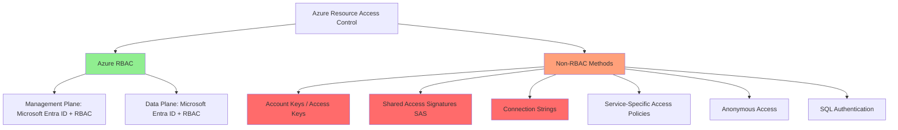

### Storage Account Access Methods

Azure Storage supports **multiple** access control methods, and understanding when each is appropriate is crucial.

#### Method 1: Storage Account Access Keys (Shared Keys)

**What it is:** Two 512-bit keys that provide **full access** to the storage account

**Characteristics:**
- ❌ **No Entra ID involvement** - Completely independent of Microsoft Entra ID
- ❌ **No RBAC** - Bypasses all Azure RBAC permissions
- ❌ **All-or-nothing** - Full access to all data in the account
- ❌ **No audit trail** - Cannot identify which user/application used the key
- ✅ **Works anywhere** - Can be used outside Azure
- ✅ **Simple** - No complex auth setup needed

**Access Pattern:**
```
Application → Storage Account Access Key → Full Access to All Data
(No Microsoft Entra ID, No RBAC, No audit of actual user)
```

**Security Risk:**
```
User with Contributor role on storage account
├── Uses management plane: Microsoft.Storage/storageAccounts/listKeys/action
├── Retrieves access key
└── Gets FULL data plane access (read, write, delete all blobs)
    (Even if user has NO data plane RBAC roles!)
```

**Example:**
```bash
# Retrieve storage account key (requires management plane permission)
az storage account keys list \
    --account-name mystorageacct \
    --resource-group myrg

# Use key to access data (NO RBAC checked!)
az storage blob list \
    --account-name mystorageacct \
    --account-key "<key>" \
    --container-name mycontainer
```

**When to Use:**
- ⚠️ **Legacy applications** that cannot use Microsoft Entra ID
- ⚠️ **Development/testing** (never in production!)
- ⚠️ **Third-party tools** without Microsoft Entra ID support

**Best Practice:** **Disable shared key access** when not needed:
```bash
az storage account update \
    --name mystorageacct \
    --resource-group myrg \
    --allow-shared-key-access false
```

---

#### Method 2: Shared Access Signatures (SAS)

**What it is:** Time-limited tokens that grant specific permissions to storage resources

**Types of SAS:**

| SAS Type | Scope | Signed By | Use Case |
|----------|-------|-----------|----------|
| **User Delegation SAS** | Blob/Queue/Table | Microsoft Entra ID credentials | ✅ **Recommended** - Uses Entra ID |
| **Service SAS** | Specific service (blob/file/queue/table) | Account key | Limited scope, no Entra ID |
| **Account SAS** | Entire storage account | Account key | Multiple services, no Entra ID |

**User Delegation SAS (Recommended):**
```
User with proper RBAC role
├── Generates SAS token using Microsoft Entra ID identity
├── Token signed by Microsoft Entra ID (not account key)
└── Token grants limited access (time-bound, specific permissions)

Advantages:
✅ Uses Entra ID
✅ Can be audited
✅ Doesn't expose account key
✅ Can be revoked by regenerating user delegation key
```

**Example - User Delegation SAS:**
```bash
# User needs: Microsoft.Storage/storageAccounts/blobServices/generateUserDelegationKey/action
az storage blob generate-sas \
    --account-name mystorageacct \
    --container-name mycontainer \
    --name myblob.txt \
    --permissions r \
    --expiry 2025-12-31T23:59:59Z \
    --auth-mode login  # Uses Microsoft Entra ID, not account key!
```

**Service SAS / Account SAS (Less Secure):**
```
Application
├── Uses account key to generate SAS token
├── Token grants limited access (time-bound, specific permissions)
└── BUT: Requires account key, no Microsoft Entra ID

Disadvantages:
❌ Requires access to account key
❌ Cannot be individually revoked (must regenerate account key)
❌ Not tied to Microsoft Entra ID identity
```

**When to Use SAS:**
- ✅ **Temporary access** - Give time-limited access to external users
- ✅ **Limited permissions** - Grant specific operations only (read, write)
- ✅ **Client-side uploads** - Allow browsers to upload files directly
- ✅ **Least privilege** - More granular than full account key access

---

#### Method 3: Azure RBAC for Data Plane (Recommended)

**What it is:** Use Entra ID identities with RBAC roles for data access

**Characteristics:**
- ✅ **Uses Entra ID** - Integrated with Microsoft Entra ID
- ✅ **RBAC integration** - Familiar permission model
- ✅ **Granular permissions** - Separate roles for different operations
- ✅ **Full audit trail** - Know exactly who accessed what
- ✅ **Centralized management** - Manage all permissions in Azure portal
- ✅ **Conditional Access** - Can apply CA policies

**Common Storage RBAC Roles:**

| Role | Permissions | Use Case |
|------|-------------|----------|
| **Storage Blob Data Owner** | Full access to blob data and RBAC | Administrators |
| **Storage Blob Data Contributor** | Read, write, delete blobs | Applications needing full data access |
| **Storage Blob Data Reader** | Read blobs only | Read-only applications |
| **Storage Queue Data Contributor** | Read, write, delete queue messages | Queue processors |
| **Storage Table Data Contributor** | Read, write, delete table data | Table data applications |

**Access Pattern:**
```
User/Application with Entra ID identity
├── Assigned RBAC role: Storage Blob Data Reader
├── Authenticates using Microsoft Entra ID
└── Gets ONLY the permissions granted by RBAC role
```

**Example:**
```bash
# Assign RBAC role (management plane)
az role assignment create \
    --role "Storage Blob Data Reader" \
    --assignee user@contoso.com \
    --scope "/subscriptions/{sub-id}/resourceGroups/{rg}/providers/Microsoft.Storage/storageAccounts/{storage-account}"

# Access data using Microsoft Entra ID (data plane)
az storage blob list \
    --account-name mystorageacct \
    --container-name mycontainer \
    --auth-mode login  # Uses Microsoft Entra ID + RBAC!
```

---

#### Method 4: Anonymous (Public) Access

**What it is:** Allow public read access to blobs without authentication

**Characteristics:**
- ❌ **No authentication** - Anyone with URL can access
- ❌ **No Entra ID** - Completely public
- ❌ **No RBAC** - Bypasses all access control
- ✅ **Fast** - No auth overhead
- ⚠️ **High risk** - Data is publicly accessible

**Access Levels:**

| Level | Description | Risk |
|-------|-------------|------|
| **Private** | No anonymous access | ✅ Secure |
| **Blob** | Public read for specific blobs | ⚠️ Moderate risk |
| **Container** | Public read for all blobs in container | ❌ High risk |

**When to Use:**
- Public website content (images, CSS, JavaScript)
- Public downloads
- CDN source content

**Best Practice:** **Disable** anonymous access at storage account level if not needed:
```bash
az storage account update \
    --name mystorageacct \
    --resource-group myrg \
    --allow-blob-public-access false
```

---

#### Storage Access Methods Comparison

| Method | Uses Entra ID | Uses RBAC | Granular | Auditable | Recommendation |
|--------|---------------|-----------|----------|-----------|----------------|
| **Account Key** | ❌ No | ❌ No | ❌ No | ❌ No | ❌ Avoid |
| **Service/Account SAS** | ❌ No | ❌ No | ✅ Yes | ⚠️ Limited | ⚠️ Use sparingly |
| **User Delegation SAS** | ✅ Yes | ⚠️ Partial | ✅ Yes | ✅ Yes | ✅ Good for temp access |
| **Azure RBAC** | ✅ Yes | ✅ Yes | ✅ Yes | ✅ Yes | ✅✅ **Recommended** |
| **Anonymous Access** | ❌ No | ❌ No | ❌ No | ❌ No | ⚠️ Only for public content |

---

### Key Vault Access Methods

Azure Key Vault supports two access control models, and you must choose one per vault.

#### Method 1: Vault Access Policies (Legacy)

**What it is:** Per-identity permissions configured directly on the Key Vault

**Characteristics:**
- ✅ **Uses Entra ID** - Identity must be Microsoft Entra ID principal
- ❌ **Not RBAC** - Separate from Azure RBAC system
- ⚠️ **Limited to 1024 policies** per vault
- ⚠️ **Vault-scoped only** - Cannot inherit from subscription/RG

**Permission Structure:**
```yaml
Key Vault: myvault
Access Policies:
  - Identity: user1@contoso.com
    Permissions:
      Keys: [Get, List, Create]
      Secrets: [Get, List]
      Certificates: [Get, List, Create, Delete]
  
  - Identity: app-service-identity
    Permissions:
      Secrets: [Get]
```

**Security Risk with Access Policies:**
```
User with Contributor role on Key Vault
├── Has Microsoft.KeyVault/vaults/write permission
├── Can modify access policies
└── Can grant themselves secrets Get/List permissions!
    (Even if they had NO secrets access before)
```

**Example:**
```bash
# Set access policy (requires Contributor or Owner on vault)
az keyvault set-policy \
    --name myvault \
    --upn user@contoso.com \
    --secret-permissions get list
```

---

#### Method 2: Azure RBAC (Recommended)

**What it is:** Use Azure RBAC for both management and data plane access

**Characteristics:**
- ✅ **Uses Entra ID** - Fully integrated with Microsoft Entra ID
- ✅ **Uses RBAC** - Same model as other Azure resources
- ✅ **Inheritance** - Can assign at subscription/RG level
- ✅ **Separation of duties** - Contributor cannot grant data access

**Common Key Vault RBAC Roles:**

| Role | Permissions | Use Case |
|------|-------------|----------|
| **Key Vault Administrator** | All data plane permissions | Key Vault admins |
| **Key Vault Secrets Officer** | Manage secrets (except permissions) | Secrets administrators |
| **Key Vault Secrets User** | Read secrets only | Applications needing secrets |
| **Key Vault Crypto Officer** | Manage keys | Cryptographic key administrators |
| **Key Vault Crypto User** | Cryptographic operations | Applications using encryption |
| **Key Vault Certificates Officer** | Manage certificates | Certificate administrators |
| **Key Vault Reader** | Read metadata only (not secret values) | Auditors |

**With RBAC Model:**
```
User with Contributor role on Key Vault
├── Can create/delete the Key Vault
├── Can modify networking settings
├── ✅ CANNOT grant themselves secrets access
└── ✅ CANNOT read/modify secrets without proper RBAC role
    (Requires Owner or User Access Administrator to assign roles)
```

**Enable RBAC on Key Vault:**
```bash
# Create new vault with RBAC
az keyvault create \
    --name myvault \
    --resource-group myrg \
    --enable-rbac-authorization true

# Update existing vault to use RBAC
az keyvault update \
    --name myvault \
    --resource-group myrg \
    --enable-rbac-authorization true
```

**Assign RBAC role:**
```bash
az role assignment create \
    --role "Key Vault Secrets User" \
    --assignee user@contoso.com \
    --scope "/subscriptions/{sub-id}/resourceGroups/{rg}/providers/Microsoft.KeyVault/vaults/myvault"
```

---

#### Key Vault Access Method Comparison

| Aspect | Access Policies | Azure RBAC |
|--------|----------------|------------|
| **Uses Entra ID** | ✅ Yes | ✅ Yes |
| **Uses RBAC** | ❌ No | ✅ Yes |
| **Inheritance** | ❌ No | ✅ Yes (subscription/RG) |
| **Contributor Can Self-Grant** | ❌ Yes (security risk!) | ✅ No (secure) |
| **Policy Limit** | 1024 policies | No limit |
| **Permission Granularity** | Very granular (per operation) | Role-based (predefined or custom) |
| **Recommendation** | ⚠️ Legacy, avoid | ✅ **Recommended** |

---

### Service Bus and Event Hubs Access

#### Method 1: Shared Access Signatures (SAS)

**What it is:** Connection strings with embedded tokens for access

**Characteristics:**
- ❌ **No Entra ID** - Independent of Microsoft Entra ID
- ❌ **No RBAC** - Service-specific access policies
- ⚠️ **Connection string in code** - Security risk if leaked
- ✅ **Works anywhere** - Can be used outside Azure

**Access Pattern:**
```
Application
├── Uses connection string with SAS token
├── Token contains: endpoint + shared access key
└── Grants permissions: Send, Listen, Manage
```

**Example - Service Bus SAS:**
```bash
# Create SAS policy
az servicebus namespace authorization-rule create \
    --namespace-name mynsspace \
    --resource-group myrg \
    --name MySendPolicy \
    --rights Send

# Get connection string
az servicebus namespace authorization-rule keys list \
    --namespace-name mynsspace \
    --resource-group myrg \
    --name MySendPolicy
```

**Connection String Example:**
```
Endpoint=sb://mynsspace.servicebus.windows.net/;
SharedAccessKeyName=MySendPolicy;
SharedAccessKey=<key>;
EntityPath=myqueue
```

---

#### Method 2: Azure RBAC (Recommended)

**What it is:** Use Entra ID with RBAC for Service Bus/Event Hubs access

**Characteristics:**
- ✅ **Uses Entra ID** - Fully integrated
- ✅ **Uses RBAC** - Standard Azure RBAC model
- ✅ **Managed Identity support** - No credentials in code
- ✅ **Auditable** - Full audit trail

**Common Roles:**

| Role | Service Bus | Event Hubs |
|------|-------------|------------|
| **Data Owner** | Full data access | Full data access |
| **Data Sender** | Send messages only | Send events only |
| **Data Receiver** | Receive messages only | Receive events only |

**Example - Service Bus with RBAC:**
```bash
# Assign RBAC role
az role assignment create \
    --role "Azure Service Bus Data Sender" \
    --assignee user@contoso.com \
    --scope "/subscriptions/{sub-id}/resourceGroups/{rg}/providers/Microsoft.ServiceBus/namespaces/mynsspace"

# Application code uses Microsoft Entra ID (no connection string!)
```

---

### Cosmos DB Access Methods

#### Method 1: Primary/Secondary Keys (Connection Strings)

**What it is:** Master keys that provide full access to Cosmos DB account

**Characteristics:**
- ❌ **No Entra ID** - Independent of Microsoft Entra ID
- ❌ **No RBAC** - Bypasses all RBAC
- ❌ **All-or-nothing** - Full read/write access to all databases
- ❌ **No audit trail** - Cannot identify actual user

**Example:**
```bash
# Get connection string
az cosmosdb keys list \
    --name mycosmosdb \
    --resource-group myrg \
    --type connection-strings
```

---

#### Method 2: Resource Tokens

**What it is:** Time-limited tokens for specific Cosmos DB resources

**Characteristics:**
- ⚠️ **Partial Entra ID** - Can be generated using Microsoft Entra ID
- ⚠️ **Not pure RBAC** - Cosmos DB-specific model
- ✅ **Granular** - Per-container, per-partition access
- ✅ **Time-limited** - Tokens expire

---

#### Method 3: Azure RBAC for Data Plane (Recommended)

**What it is:** Use Entra ID with RBAC for Cosmos DB data access

**Common Roles:**

| Role | Permissions | Use Case |
|------|-------------|----------|
| **Cosmos DB Built-in Data Contributor** | Read, write, delete data | Applications |
| **Cosmos DB Built-in Data Reader** | Read data only | Read-only apps |

**Example:**
```bash
az role assignment create \
    --role "Cosmos DB Built-in Data Reader" \
    --assignee user@contoso.com \
    --scope "/subscriptions/{sub-id}/resourceGroups/{rg}/providers/Microsoft.DocumentDB/databaseAccounts/mycosmosdb"
```

---

### SQL Database Access Methods

#### Method 1: SQL Authentication

**What it is:** Traditional SQL username/password authentication

**Characteristics:**
- ❌ **No Entra ID** - SQL-specific authentication
- ❌ **No RBAC** - SQL permissions model
- ❌ **Password management burden** - Passwords in connection strings
- ⚠️ **Less auditable** - Cannot tie to Microsoft Entra ID identity

**Connection String:**
```
Server=tcp:myserver.database.windows.net,1433;
Database=mydatabase;
User ID=sqladmin;
Password=<password>;
```

---

#### Method 2: Microsoft Entra ID Authentication (Recommended)

**What it is:** Use Entra ID for SQL Database authentication

**Characteristics:**
- ✅ **Uses Entra ID** - Full Microsoft Entra ID integration
- ✅ **No passwords** - Uses Microsoft Entra ID tokens
- ✅ **MFA support** - Can enforce multi-factor authentication
- ✅ **Conditional Access** - Can apply CA policies
- ⚠️ **Not full RBAC** - Uses SQL permissions within database

**Setup:**
```bash
# Set Microsoft Entra ID admin for SQL Server
az sql server ad-admin create \
    --resource-group myrg \
    --server-name myserver \
    --display-name "DBA Team" \
    --object-id <aad-group-object-id>
```

**Connection (using Microsoft Entra ID):**
```
Server=tcp:myserver.database.windows.net,1433;
Database=mydatabase;
Authentication=Active Directory Integrated;
```

**Note:** Within SQL Database, you still use SQL permissions (not Azure RBAC data plane roles), but authentication is via Entra ID.

---

### When to Use Non-RBAC vs RBAC

#### Decision Matrix

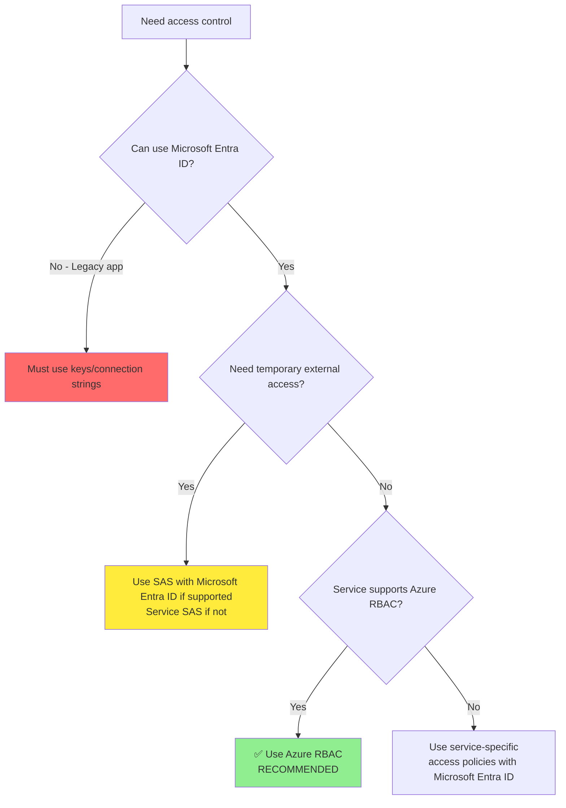

#### Recommendation Summary

| Scenario | Recommended Method | Why |
|----------|-------------------|-----|
| **New application** | Azure RBAC + Entra ID | Best security, auditability, and management |
| **Legacy application** | Migrate to Azure RBAC gradually | Use SAS/keys temporarily during migration |
| **Temporary external access** | User Delegation SAS (if supported) | Time-limited, auditable, doesn't expose keys |
| **Public content** | Anonymous access (with care) | Appropriate for truly public data |
| **Service doesn't support RBAC** | Access policies with Entra ID | Better than keys, uses Microsoft Entra ID at least |
| **Development/testing only** | Keys acceptable (never production!) | Quick setup, but rotate frequently |

---

#### Security Best Practices

1. **Prefer Azure RBAC when available:**
   ```
   ✅ Storage → Azure RBAC
   ✅ Key Vault → Azure RBAC (enable it!)
   ✅ Service Bus → Azure RBAC
   ✅ Event Hubs → Azure RBAC
   ✅ Cosmos DB → Azure RBAC
   ✅ SQL Database → Microsoft Entra ID authentication
   ```

2. **Disable key/connection string access when possible:**
   ```bash
   # Storage: Disable shared key access
   az storage account update --allow-shared-key-access false
   
   # Key Vault: Use RBAC instead of access policies
   az keyvault update --enable-rbac-authorization true
   ```

3. **If you must use keys:**
   - Store in Azure Key Vault (never in code/config)
   - Rotate regularly (automated rotation)
   - Use Managed Identity to access Key Vault
   - Implement key expiration policies

4. **Monitor for key usage:**
   ```
   Use Azure Policy to:
   ├── Detect storage accounts with shared key access enabled
   ├── Detect Key Vaults using access policies (not RBAC)
   └── Alert on key regeneration activities
   ```

5. **Understand the attack surface:**
   ```
   User with Contributor role + Access Policy model
   ├── Can grant self data plane access
   └── RISK: Privilege escalation
   
   User with Contributor role + RBAC model
   ├── Cannot grant self data plane access
   └── SECURE: Requires Owner or User Access Administrator
   ```

---

## Azure Subscription Hierarchy

### Tenant Structure

```
Microsoft Entra Tenant (contoso.onmicrosoft.com)
├── Microsoft Entra ID Resources
│   ├── Users
│   ├── Groups
│   ├── Applications
│   └── Licenses
│
└── Azure Resources Hierarchy
    ├── Tenant Root Group (Management Group)
    │   ├── Management Group 1
    │   │   ├── Subscription A
    │   │   └── Subscription B
    │   └── Management Group 2
    │       └── Subscription C
    └── Orphan Subscriptions (not in Management Groups)
```

### Management Group Hierarchy

**Purpose:** Organize subscriptions for governance at scale

**Characteristics:**
- Up to **6 levels deep** (excluding root and subscription levels)
- Each subscription can only be in **one** management group
- Management groups are **tenant-scoped** (cannot span tenants)
- Support Azure Policy and RBAC inheritance

**Example Hierarchy:**

```
Tenant Root Group
├── Corp
│   ├── Production
│   │   ├── Prod-Apps (Subscription)
│   │   └── Prod-Data (Subscription)
│   └── Non-Production
│       ├── Dev (Subscription)
│       └── Test (Subscription)
└── Sandbox
    └── Learning (Subscription)
```

**RBAC Inheritance Example:**

```
Reader at "Corp" Management Group
├── Can read all resources in Production Management Group
│   ├── Can read all resources in Prod-Apps subscription
│   └── Can read all resources in Prod-Data subscription
└── Can read all resources in Non-Production Management Group
    ├── Can read all resources in Dev subscription
    └── Can read all resources in Test subscription
```

### Subscription Level

**Purpose:** Billing boundary and access control boundary

**Characteristics:**
- Each subscription is linked to **one Microsoft Entra ID tenant**
- Subscriptions can be moved between management groups
- Subscriptions can be transferred between tenants (RBAC assignments may be lost)
- Default limit: 200 subscriptions per tenant (can be increased)

**Subscription Properties:**
```yaml
Subscription: Prod-Apps-001
├── Subscription ID: 12345678-1234-1234-1234-123456789012
├── Directory Tenant: contoso.onmicrosoft.com
├── State: Enabled
├── Management Group: Production
└── Role Assignments:
    ├── Owner: admin@contoso.com
    ├── Contributor: devteam@contoso.com
    └── Reader: auditors@contoso.com
```

### Resource Group Level

**Purpose:** Logical container for related resources

**Characteristics:**
- Resources in a resource group can be in **different regions**
- Resource groups **cannot be nested**
- Deleting a resource group deletes **all resources** within it
- Resource groups support **locks** and **tags**

**Resource Group Structure:**

```
Resource Group: WebApp-Prod-RG
├── Location: East US
├── Tags:
│   ├── Environment: Production
│   ├── CostCenter: IT-001
│   └── Owner: webapp-team@contoso.com
├── Resources:
│   ├── App Service Plan
│   ├── App Service
│   ├── SQL Database
│   └── Application Insights
└── Role Assignments:
    ├── Owner: webappteam@contoso.com
    └── Reader: monitoring@contoso.com
```

### Resource Level

**Purpose:** Individual Azure service instance

**Characteristics:**
- Finest level of RBAC assignment
- Each resource has a unique **Resource ID**
- Resources can have **resource-specific roles**

**Resource Structure:**

```
Resource: webapp-prod-01 (App Service)
├── Resource ID: /subscriptions/{sub-id}/resourceGroups/WebApp-Prod-RG/providers/Microsoft.Web/sites/webapp-prod-01
├── Location: East US
├── SKU: Premium P1v2
└── Role Assignments:
    ├── Website Contributor: developers@contoso.com
    └── Reader: support@contoso.com
```

---

## Classic Subscription Administrator Roles (Deprecated)

> ⚠️ **Important:** These roles are deprecated and will be retired on **August 31, 2024**. Migrate to Azure RBAC roles.

| Classic Role | Azure RBAC Equivalent | Description | Limitations |
|--------------|----------------------|-------------|-------------|
| **Account Administrator** | Owner (at subscription scope) | Billing owner of subscription | • One per subscription<br>• Cannot assign RBAC roles<br>• Being retired |
| **Service Administrator** | Owner (at subscription scope) | Can manage all resources | • One per subscription<br>• Limited RBAC integration<br>• Being retired |
| **Co-Administrator** | Owner (at subscription scope) | Same as Service Admin except cannot change directory association | • Up to 200 per subscription<br>• Being retired |

**Migration Path:**
```
Classic Role → Azure RBAC Role
├── Account Administrator → Owner (subscription scope)
├── Service Administrator → Owner (subscription scope)
└── Co-Administrator → Owner (subscription scope)
```

---

## Role Assignment Best Practices

### 1. Principle of Least Privilege

Always assign the **minimum permissions** required for a task.

| ❌ Don't Do This | ✅ Do This Instead |
|------------------|-------------------|
| Assign Owner to all developers | Assign Contributor to developers, Owner only to leads |
| Grant Global Administrator to IT staff | Grant specific Microsoft Entra ID roles (User Administrator, etc.) |
| Use subscription-wide assignments for everything | Use resource group or resource-level assignments |

### 2. Use Groups Instead of Individual Users

```
❌ Bad Practice:
User1 → Owner → Subscription
User2 → Owner → Subscription
User3 → Owner → Subscription

✅ Good Practice:
Group: SubscriptionAdmins → Owner → Subscription
├── User1
├── User2
└── User3
```

**Benefits:**
- Easier to manage
- Audit group membership instead of individual assignments
- Faster onboarding/offboarding

### 3. Use Privileged Identity Management (PIM)

```
Permanent Assignment (Avoid):
User → Owner → Subscription (24/7/365)

Eligible Assignment (Recommended):
User → Eligible for Owner → Subscription
    ↓ Activate when needed (justification required)
User → Owner → Subscription (Time-limited: 8 hours)
    ↓ Automatic deactivation
User → No access
```

### 4. Separate Duties

| Responsibility | Microsoft Entra ID Role | Azure RBAC Role |
|----------------|---------------|-----------------|
| Manage users and groups | User Administrator | - |
| Manage Azure resources | - | Contributor |
| Assign permissions | Privileged Role Administrator | Owner or User Access Administrator |
| View-only access | Global Reader | Reader |

### 5. Use Built-in Roles Before Creating Custom Roles

**Decision Tree:**

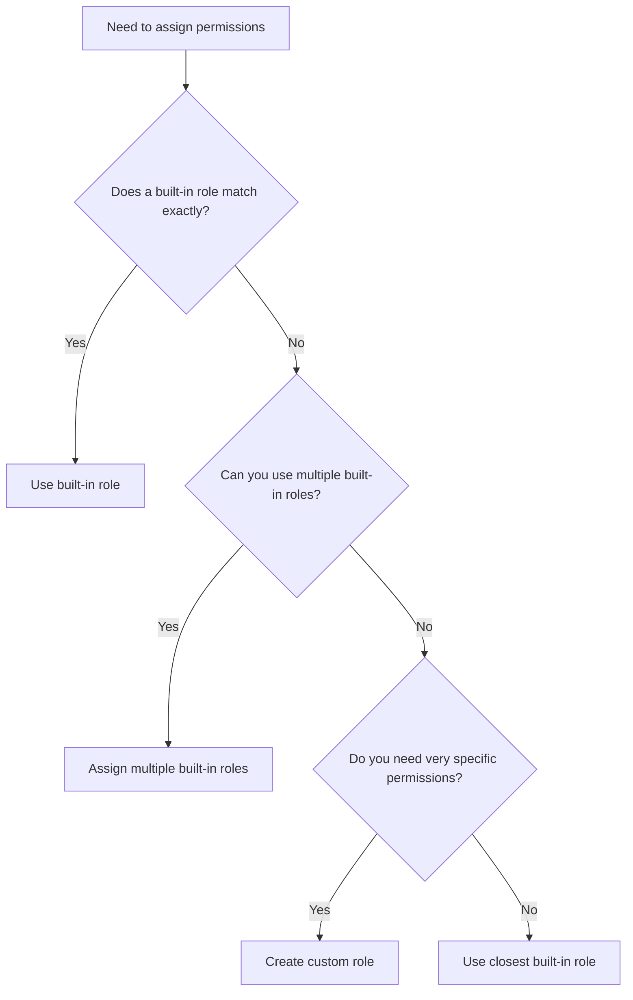

### 6. Understand Deny Assignments

**Deny assignments** override role assignments:

```
User1:
├── Owner role → Allows: *
└── Deny assignment → Denies: Microsoft.Storage/*/delete

Result: User1 can do everything EXCEPT delete storage resources
```

**When Deny Assignments Are Used:**
- Azure Blueprints (resource locking)
- Managed Applications
- Certain Azure services for protection

### 7. Use Management Groups for Governance at Scale

```
Apply Azure Policy and RBAC at Management Group:
Management Group: Production
├── Policy: Require tags
├── RBAC: Security Reader → SecurityTeam
└── Inheritance:
    ├── Subscription: Prod-Apps
    │   └── All resources inherit policy + RBAC
    └── Subscription: Prod-Data
        └── All resources inherit policy + RBAC
```

### 8. Monitor and Audit Role Assignments

**Regular Reviews:**
- Use **Access Reviews** in Microsoft Entra ID for periodic certification
- Review **Activity Logs** for role assignment changes
- Enable **Microsoft Entra ID Audit Logs** for comprehensive tracking

**Key Questions:**
- Who has Owner on subscriptions?
- Who has Global Administrator?
- Are there any custom roles? Why?
- Are assignments time-limited (PIM)?

---

## Common Scenarios and Solutions

### Scenario 1: User Needs to Create Resources but Not Assign Permissions

**Solution:** Assign **Contributor** role (not Owner)

```
User: Developer1
Role: Contributor
Scope: Resource Group "Dev-RG"

Permissions:
✅ Create VMs
✅ Modify storage accounts
✅ Delete resources
❌ Assign roles to others
❌ Modify resource locks
```

### Scenario 2: User Needs to Manage All Aspects Including Permissions

**Solution:** Assign **Owner** role

```
User: TeamLead1
Role: Owner
Scope: Resource Group "Team-RG"

Permissions:
✅ Create VMs
✅ Modify storage accounts
✅ Delete resources
✅ Assign roles to others
✅ Modify resource locks
```

### Scenario 3: User Needs Only to Assign Permissions, Not Manage Resources

**Solution:** Assign **User Access Administrator** role

```
User: SecurityAdmin1
Role: User Access Administrator
Scope: Subscription "Prod-Sub"

Permissions:
✅ Assign roles to others
✅ View access assignments
❌ Create resources
❌ Modify resources
❌ Delete resources
```

### Scenario 4: User Needs to Reset Passwords for Non-Admin Users

**Solution:** Assign **Helpdesk Administrator** Microsoft Entra ID role

```
User: HelpDesk1
Role: Helpdesk Administrator (Microsoft Entra ID)
Scope: Tenant

Permissions:
✅ Reset passwords for non-admin users
✅ View user properties
✅ Manage support tickets
❌ Reset admin passwords
❌ Manage admin accounts
❌ Assign roles
```

### Scenario 5: User Needs to Create and Manage Users and Groups

**Solution:** Assign **User Administrator** Microsoft Entra ID role

```
User: HRAdmin1
Role: User Administrator (Microsoft Entra ID)
Scope: Tenant or Administrative Unit

Permissions:
✅ Create users
✅ Delete users
✅ Reset passwords (for non-admin users)
✅ Manage groups
✅ Assign licenses
❌ Manage admin accounts with higher privileges
❌ Assign Microsoft Entra ID roles
```

### Scenario 6: New Tenant Created, Need to Create Users

**Problem:** User with Owner role on subscription cannot create users in new tenant

**Solution:**
1. Only the **Global Administrator** of the new tenant can create users initially
2. The tenant creator is automatically Global Administrator
3. Global Admin must assign **User Administrator** role to others for delegation

```
Tenant: new-tenant.onmicrosoft.com
Created by: User1

Initial state:
└── User1: Global Administrator (automatic)

To enable others:
├── User1 adds User2 to tenant (as guest or member)
└── User1 assigns User Administrator role to User2

Now User2 can create users
```

#### Common Exam Scenario

**Question:** You have an Azure subscription with the following users in tenant `contoso.onmicrosoft.com`:

| Name | Role | Scope |
|------|------|-------|
| User1 | Global administrator | Azure Active Directory |
| User2 | Global administrator | Azure Active Directory |
| User3 | User administrator | Azure Active Directory |
| User4 | Owner | Azure Subscription |

User1 creates a new Azure AD tenant named `external.contoso.onmicrosoft.com`.

You need to create new user accounts in `external.contoso.onmicrosoft.com`.

**Question:** Can User4 create the user accounts?

**Answer:** ❌ **NO**

**Explanation:**
- When a new tenant is created, **only the creator becomes the Global Administrator** of that new tenant
- User4 has Owner role on the Azure Subscription, which is an **Azure RBAC role**, not a Microsoft Entra ID role
- Azure RBAC roles (Owner, Contributor, Reader) **do NOT grant permissions to manage users** in Microsoft Entra ID
- User4 would need to be:
  1. Invited to the new tenant by User1, AND
  2. Assigned a Microsoft Entra ID role (like User Administrator or Global Administrator) by User1

**Key Concept:**
```
Azure Subscription Roles (RBAC)     ≠     Microsoft Entra ID Roles
        ↓                                           ↓
   Manage Azure Resources              Manage Users, Groups, Apps
   (VMs, Storage, Networks)            (Identity & Directory)
```

**Who CAN create users in the new tenant?**
- ✅ User1 (creator, automatic Global Admin of new tenant)
- ❌ User2 (Global Admin in original tenant, not in new tenant)
- ❌ User3 (User Admin in original tenant, not in new tenant)
- ❌ User4 (Owner role is Azure RBAC, not Entra ID role)

### Scenario 7: Delegating User Management to Local Office Administrators

**Problem:** You have three offices (New York, London, Tokyo) with local IT administrators who need to manage users in their specific offices only, without access to users in other offices.

**Wrong Solutions:**

❌ **Access Packages in Azure AD Entitlement Management**
- Access packages are designed for managing **access to resources**, not delegating administrative permissions
- Used for granting/revoking access to applications, groups, SharePoint sites, etc.
- Not suitable for delegating user management permissions to office administrators

❌ **Azure Roles (Azure RBAC)**
- Azure roles control access to **Azure resources** (VMs, storage, networks)
- They do NOT grant permissions to manage users, groups, or other Microsoft Entra ID objects
- Cannot be used for user management delegation

❌ **Azure AD Roles (Tenant-wide assignment)**
- Azure AD roles like User Administrator grant permissions **across the entire tenant**
- Assigning User Administrator gives access to ALL users in the organization
- Cannot restrict Azure AD roles to specific groups or offices without Administrative Units
- Provides broader permissions than required (violates least privilege)

**✅ Correct Solution: Administrative Units**

**Solution:** Create Administrative Units for each office and assign scoped User Administrator roles

```
Microsoft Entra ID Tenant: contoso.onmicrosoft.com

Administrative Units:
├── AU-NewYork
│   ├── Members: NY users and groups
│   └── Role Assignment: NYAdmin → User Administrator (scoped to AU-NewYork)
│
├── AU-London
│   ├── Members: London users and groups
│   └── Role Assignment: LondonAdmin → User Administrator (scoped to AU-London)
│
└── AU-Tokyo
    ├── Members: Tokyo users and groups
    └── Role Assignment: TokyoAdmin → User Administrator (scoped to AU-Tokyo)
```

**Implementation:**

```powershell
# Create Administrative Units
$nyAU = New-MgDirectoryAdministrativeUnit -DisplayName "AU-NewYork" -Description "New York Office Users"
$londonAU = New-MgDirectoryAdministrativeUnit -DisplayName "AU-London" -Description "London Office Users"
$tokyoAU = New-MgDirectoryAdministrativeUnit -DisplayName "AU-Tokyo" -Description "Tokyo Office Users"

# Add users to Administrative Units
Add-MgDirectoryAdministrativeUnitMemberByRef -AdministrativeUnitId $nyAU.Id -OdataId "https://graph.microsoft.com/v1.0/users/{user-id}"

# Assign User Administrator role scoped to AU
$roleDefinition = Get-MgRoleManagementDirectoryRoleDefinition -Filter "displayName eq 'User Administrator'"
New-MgRoleManagementDirectoryRoleAssignment `
    -DirectoryScopeId "/administrativeUnits/$($nyAU.Id)" `
    -RoleDefinitionId $roleDefinition.Id `
    -PrincipalId "{ny-admin-user-id}"
```

**Result:**

| Administrator | Can Manage | Cannot Manage |
|---------------|------------|---------------|
| **NYAdmin** (User Administrator for AU-NewYork) | ✅ Create/modify/delete users in NY office<br>✅ Reset passwords for NY users<br>✅ Assign licenses to NY users<br>✅ Manage NY groups | ❌ Cannot access London users<br>❌ Cannot access Tokyo users<br>❌ Cannot manage users outside their AU |
| **LondonAdmin** (User Administrator for AU-London) | ✅ Manage London office users only | ❌ Cannot access NY or Tokyo users |
| **TokyoAdmin** (User Administrator for AU-Tokyo) | ✅ Manage Tokyo office users only | ❌ Cannot access NY or London users |

#### Common Exam Scenario: Choosing Between Administrative Units vs Other Solutions

**Question:**

You have an Azure subscription with three regional offices. Each office has a local administrator who needs to manage users in their specific region only.

**What should you use?**

A. Access packages in Azure AD Entitlement Management  
B. Azure roles (Azure RBAC)  
C. Azure AD roles (User Administrator)  
D. Administrative Units

---

**Answer: D - Administrative Units**

### Explanation

#### Why Option D is Correct: Administrative Units ✅

**Administrative Units (AUs)** are specifically designed for delegating administrative tasks to specific users within a defined scope:

**Key Capabilities:**
- Delegate administration of a **subset of users and groups** within the tenant
- Scope Microsoft Entra ID role assignments to specific organizational units
- Ideal for scenarios requiring **geographic**, **departmental**, or **organizational** delegation
- Supports dynamic membership based on user attributes (e.g., department, location)

**Use Cases:**
- Regional office administration (as in the exam question)
- Department-specific user management (HR, Finance, IT)
- Subsidiary or business unit delegation in large organizations
- Educational institutions with multiple schools/colleges

**How It Works:**

```
┌─────────────────────────────────────────────────────────────────┐
│  Microsoft Entra ID Tenant                                       │
├─────────────────────────────────────────────────────────────────┤
│                                                                 │
│  Administrative Unit: NY Office                                 │
│  ├── Members: 500 users in New York                            │
│  ├── Dynamic Rule: user.officeLocation -eq "New York"          │
│  └── Role Assignment:                                          │
│      └── NYAdmin → User Administrator (AU scope only)          │
│                                                                 │
│  Administrative Unit: London Office                             │
│  ├── Members: 300 users in London                              │
│  ├── Dynamic Rule: user.officeLocation -eq "London"            │
│  └── Role Assignment:                                          │
│      └── LondonAdmin → User Administrator (AU scope only)      │
│                                                                 │
│  Global Administrator                                           │
│  └── Can manage ALL users across all AUs                       │
│                                                                 │
└─────────────────────────────────────────────────────────────────┘
```

**Benefits:**
- ✅ **Principle of Least Privilege**: Admins only see and manage their assigned users
- ✅ **Security**: Prevents privilege escalation across organizational boundaries
- ✅ **Compliance**: Aligns with regulatory requirements for data segregation
- ✅ **Scalability**: Can create multiple AUs with different membership rules
- ✅ **Flexibility**: Supports both manual and dynamic membership

#### Why Other Options are Incorrect

### Option A: Access Packages in Azure AD Entitlement Management ❌

**Purpose of Access Packages:**
- Manage **access to resources** (applications, groups, SharePoint sites)
- Enable self-service access requests
- Automate access lifecycle (joiner/mover/leaver scenarios)
- Facilitate B2B collaboration with external users

**Why It Doesn't Solve This Problem:**
- Access packages grant **access to resources**, not **administrative permissions**
- They don't delegate the ability to create, modify, or delete users
- Not designed for administrative delegation scenarios

**When to Use Access Packages:**
```
Use Case: External partner needs temporary access to SharePoint site
Solution: Create access package
├── Resources: SharePoint site, related groups
├── Policies: Approval required, 90-day expiration
└── Access reviews: Quarterly recertification

❌ NOT for: Delegating user management to local admins
```

**Comparison:**

| Feature | Administrative Units | Access Packages |
|---------|---------------------|-----------------|
| **Purpose** | Delegate **administrative permissions** | Grant **access to resources** |
| **Use Case** | Office admins managing users | Employees requesting access to apps |
| **Scope** | Microsoft Entra ID role delegation | Resource access management |
| **Administrative Tasks** | Create/delete users, reset passwords | Request/approve/revoke resource access |

### Option B: Azure Roles (Azure RBAC) ❌

**Purpose of Azure Roles:**
- Control access to **Azure resources** (subscriptions, VMs, storage, networks)
- Manage **infrastructure and platform** permissions
- Separate from identity and user management

**Why It Doesn't Solve This Problem:**
- Azure RBAC roles manage **Azure resources**, not **users and groups**
- Owner, Contributor, Reader roles do NOT grant permission to create/manage users
- Completely separate permission system from Microsoft Entra ID

**Clear Separation:**

```
┌─────────────────────────────────────────────────────────────────┐
│  Microsoft Entra ID Roles (Identity Management)                  │
├─────────────────────────────────────────────────────────────────┤
│  • Global Administrator                                         │
│  • User Administrator         ← For managing USERS             │
│  • Groups Administrator                                         │
│  • Helpdesk Administrator                                       │
└─────────────────────────────────────────────────────────────────┘

┌─────────────────────────────────────────────────────────────────┐
│  Azure RBAC Roles (Resource Management)                         │
├─────────────────────────────────────────────────────────────────┤
│  • Owner                                                        │
│  • Contributor               ← For managing RESOURCES          │
│  • Reader                                                       │
│  • Virtual Machine Contributor                                  │
└─────────────────────────────────────────────────────────────────┘
```

**Example That Demonstrates the Difference:**

| Administrator | Role | Can Do | Cannot Do |
|---------------|------|--------|-----------|
| **Alice** | Owner (Azure RBAC) | ✅ Create VMs<br>✅ Configure networks<br>✅ Deploy resources | ❌ Create users<br>❌ Reset passwords<br>❌ Manage groups |
| **Bob** | User Administrator (Entra ID) | ✅ Create users<br>✅ Reset passwords<br>✅ Manage groups | ❌ Create VMs<br>❌ Configure networks<br>❌ Deploy resources |

### Option C: Azure AD Roles (Tenant-wide assignment) ❌

**Purpose of Azure AD Roles:**
- Manage Microsoft Entra ID resources (users, groups, applications)
- Correct **category** of roles, but wrong **scope**

**Why It Doesn't Fully Solve This Problem:**
- Azure AD roles like **User Administrator** apply **tenant-wide** by default
- Assigning User Administrator gives access to **ALL users** in the organization
- No built-in way to restrict to specific offices or departments
- Violates principle of least privilege

**The Problem:**

```
Scenario: Assign User Administrator role (without Administrative Units)

NYAdmin → User Administrator (Tenant-wide)
├── ✅ Can manage NY users
├── ⚠️ Can ALSO manage London users (not intended)
├── ⚠️ Can ALSO manage Tokyo users (not intended)
└── ⚠️ Can manage ALL 10,000 users in organization (excessive privilege)

Problem: No way to restrict scope to only NY users
```

**Why You Need Administrative Units:**

Azure AD roles **can** be scoped using Administrative Units:

```
Correct Implementation:

NYAdmin → User Administrator (scoped to AU-NewYork)
├── ✅ Can manage NY users (intended)
├── ❌ CANNOT manage London users
├── ❌ CANNOT manage Tokyo users
└── ✅ Least privilege principle maintained

This requires Administrative Units!
```

**Key Distinction:**

| Approach | Scope | Access Level | Suitable? |
|----------|-------|--------------|-----------|
| **Azure AD Role (no AU)** | Tenant-wide | All users in organization | ❌ Too broad |
| **Azure AD Role + Administrative Unit** | AU scope only | Only users in specific AU | ✅ Correct |

---

### Administrative Units: Deep Dive

#### What Are Administrative Units?

Administrative Units are **containers within Microsoft Entra ID** that allow you to:
- Group users and groups for administrative purposes
- Scope administrative role assignments to specific subsets of the directory
- Implement hierarchical delegation of administrative tasks

#### Key Concepts

**Membership Types:**

| Type | Management | Use Case |
|------|------------|----------|
| **Dynamic** | Rule-based automatic membership | `user.department -eq "Sales"`<br>`user.city -eq "London"` |
| **Assigned** | Manual member addition | Specific users or groups added manually |

**Supported Member Types:**
- Users
- Groups
- Devices (limited scenarios)

**Supported Roles:**

The following Microsoft Entra ID roles can be assigned with AU scope:

| Role | Purpose | What They Can Do in AU |
|------|---------|----------------------|
| **User Administrator** | User management | Create/delete users, reset passwords, manage groups |
| **Helpdesk Administrator** | Password support | Reset passwords for non-admin users |
| **Groups Administrator** | Group management | Create/manage groups, assign group owners |
| **License Administrator** | License management | Assign/remove user licenses |
| **Password Administrator** | Password resets | Reset passwords for users and other password admins |
| **Authentication Administrator** | Authentication settings | Manage MFA and authentication methods |
| **Cloud Device Administrator** | Device management | Manage devices within the AU |

**Roles that CANNOT be scoped to AUs:**
- Global Administrator (always tenant-wide)
- Privileged Role Administrator (always tenant-wide)
- Application Administrator (different scoping model)

#### Creating Administrative Units

**Prerequisites:**
- Azure AD Premium P1 or P2 license
- Global Administrator or Privileged Role Administrator role

**Using Azure Portal:**
```
1. Azure Portal → Microsoft Entra ID
2. Administrative units → New
3. Configure:
   - Name: AU-NewYork
   - Description: New York Office Users
   - Membership type: Assigned or Dynamic
4. Add members (users/groups)
5. Assign roles with AU scope
```

**Using PowerShell:**
```powershell
# Create Administrative Unit
$auParams = @{
    DisplayName = "AU-Finance"
    Description = "Finance Department Users"
}
$au = New-MgDirectoryAdministrativeUnit @auParams

# Add members (assigned membership)
$userId = (Get-MgUser -Filter "userPrincipalName eq 'john@contoso.com'").Id
$params = @{
    "@odata.id" = "https://graph.microsoft.com/v1.0/users/$userId"
}
New-MgDirectoryAdministrativeUnitMemberByRef -AdministrativeUnitId $au.Id -BodyParameter $params

# Create dynamic membership rule
$auDynamic = New-MgDirectoryAdministrativeUnit -DisplayName "AU-Sales-Dynamic" `
    -MembershipType "Dynamic" `
    -MembershipRule "(user.department -eq 'Sales')" `
    -MembershipRuleProcessingState "On"

# Assign User Administrator role scoped to AU
$roleDefinition = Get-MgRoleManagementDirectoryRoleDefinition -Filter "displayName eq 'User Administrator'"
$adminUserId = (Get-MgUser -Filter "userPrincipalName eq 'admin@contoso.com'").Id

New-MgRoleManagementDirectoryRoleAssignment -DirectoryScopeId "/administrativeUnits/$($au.Id)" `
    -RoleDefinitionId $roleDefinition.Id `
    -PrincipalId $adminUserId
```

#### Dynamic Membership Rules

**Supported Attributes:**

| Attribute | Example Rule | Use Case |
|-----------|--------------|----------|
| **department** | `user.department -eq "Finance"` | Department-based delegation |
| **city** | `user.city -eq "London"` | Geographic delegation |
| **country** | `user.country -eq "United States"` | Regional management |
| **jobTitle** | `user.jobTitle -contains "Manager"` | Role-based grouping |
| **companyName** | `user.companyName -eq "Subsidiary A"` | Multi-company scenarios |
| **employeeType** | `user.employeeType -eq "Contractor"` | Employment type segregation |

**Complex Rules:**

```powershell
# Combine multiple conditions
(user.city -eq "London") -and (user.department -eq "Sales")

# Multiple values
(user.department -in ["Sales", "Marketing", "Customer Service"])

# Exclusions
(user.city -eq "New York") -and (user.employeeType -ne "Contractor")
```

#### Licensing Requirements

| Feature | License Required |
|---------|-----------------|
| **Create Administrative Units** | Azure AD Premium P1 or P2 |
| **Assign roles to AU** | Azure AD Premium P1 or P2 |
| **Dynamic membership** | Azure AD Premium P1 or P2 |
| **View AU members** | Azure AD Free (read-only) |

---

### Exam Tips

**Common Recognition Patterns:**

When you see these phrases in exam questions, think Administrative Units:
- "Grant user management permissions to **local** administrators"
- "Manage users in **specific offices**"
- "Delegate administration for **subset of users**"
- "Restrict user management to **specific department**"
- "Regional/office/department-specific **user administration**"

**Common Traps:**

1. ❌ Confusing Azure RBAC roles with Microsoft Entra ID roles
   - Azure roles = Resource management
   - Entra ID roles = User/identity management

2. ❌ Thinking Access Packages delegate administrative permissions
   - Access packages = Resource access management
   - Administrative Units = Administrative delegation

3. ❌ Assuming Azure AD roles alone can be scoped to offices
   - Azure AD roles are tenant-wide without Administrative Units
   - Must use Administrative Units to scope Azure AD roles

4. ❌ Using groups to scope administrative permissions
   - Groups cannot scope Microsoft Entra ID role assignments
   - Only Administrative Units provide scoping for Entra ID roles

**Decision Tree:**

```
Question: Need to delegate user management for specific subset of users?
    │
    ├─── Specific geographic location (office)?
    │    └─── ✅ Administrative Units
    │
    ├─── Specific department?
    │    └─── ✅ Administrative Units
    │
    ├─── Temporary access to resources (apps, SharePoint)?
    │    └─── ❌ Access Packages (not for admin delegation)
    │
    └─── Manage Azure resources (VMs, storage)?
         └─── ❌ Azure RBAC roles (not for user management)
```

**Quick Comparison Table:**

| Requirement | Solution | Wrong Answers |
|-------------|----------|---------------|
| Delegate user management to offices | Administrative Units | Access Packages, Azure roles, Azure AD roles (without AU) |
| Grant access to applications | Access Packages | Administrative Units, Azure roles |
| Manage Azure resources | Azure RBAC roles | Entra ID roles, Access Packages |
| Just-in-time privileged access | PIM | Access Packages |
| Review guest user access | Access Reviews | Access Packages alone |

---

### Microsoft 365 Groups vs Security Groups

#### Overview

Microsoft Entra ID supports different types of groups for various purposes. Understanding the differences between **Security Groups** and **Microsoft 365 Groups**, along with their membership types, is essential for implementing proper access management and collaboration solutions.

#### Group Types Comparison

| Feature | Security Groups | Microsoft 365 Groups |
|---------|----------------|----------------------|
| **Primary Purpose** | Access control and permissions | Collaboration and communication |
| **Use Cases** | • Assign permissions to apps/resources<br>• Assign licenses<br>• Grant Azure RBAC roles<br>• Manage device access | • Shared mailbox<br>• Shared calendar<br>• SharePoint site<br>• Microsoft Teams<br>• Planner<br>• OneNote |
| **Member Types** | • Users<br>• Devices<br>• Service Principals<br>• Other groups (nesting) | • Users only |
| **Group Expiration** | ❌ No automatic expiration | ✅ Supports expiration policies |
| **Collaboration Services** | None | Mailbox, Calendar, Files, SharePoint, Teams |
| **Dynamic Membership** | ✅ Supported | ✅ Supported |
| **Assigned Membership** | ✅ Supported | ✅ Supported |
| **License Required** | Azure AD Free | Azure AD Free (expiration requires Premium) |

#### Membership Types

Both Security Groups and Microsoft 365 Groups support two membership types:

| Membership Type | Description | Example | Best For |
|----------------|-------------|---------|----------|
| **Assigned** | Members are manually added/removed | Manually add User1, User2, User3 | • Small, stable groups<br>• Specific users<br>• Manual control needed |
| **Dynamic User** | Members automatically added based on rules | `user.department -eq "Sales"`<br>`user.city -eq "London"` | • Large departments<br>• Automatic onboarding/offboarding<br>• Attribute-based membership |
| **Dynamic Device** | Devices automatically added based on rules | `device.deviceOSType -eq "Windows"`<br>(Security groups only) | • Device management<br>• Security policies<br>• Compliance requirements |

**Important Notes:**
- **Dynamic Device** membership is only available for Security Groups
- **Dynamic User** membership is available for both Security Groups and Microsoft 365 Groups
- **Assigned** membership is available for both types

#### Microsoft 365 Group Expiration Policies

One of the key differentiators is that **Microsoft 365 Groups support automatic expiration**, which is crucial for temporary collaboration scenarios.

**How Group Expiration Works:**

```
Day 0: Microsoft 365 Group Created
    ↓
Day 150: Group owner receives 30-day warning email
    ↓
Day 180: Group expires if not renewed
    ↓
         ├─→ Group is "soft-deleted"
         ├─→ All associated services deleted:
         │   • Mailbox
         │   • Calendar
         │   • SharePoint site
         │   • Teams
         │   • Planner
         │   • Files
         └─→ Can be restored within 30 days
    ↓
Day 210: Permanent deletion (cannot be recovered)
```

**Key Features:**
- **Automatic Cleanup**: Removes unused groups and associated resources
- **Soft Delete**: 30-day recovery window after expiration
- **Owner Notifications**: Warnings sent before expiration
- **Renewal Options**: Owners can renew before expiration
- **Policy Scope**: Can apply to all groups or specific groups

**Configuration Example:**

```powershell
# Set expiration policy for Microsoft 365 Groups
Install-Module -Name AzureAD
Connect-AzureAD

# Configure group expiration policy
$Policy = New-AzureADMSGroupLifecyclePolicy `
    -GroupLifetimeInDays 180 `
    -ManagedGroupTypes "All" `
    -AlternateNotificationEmails "groupadmin@contoso.com"

# Apply to specific groups only
$Policy = New-AzureADMSGroupLifecyclePolicy `
    -GroupLifetimeInDays 180 `
    -ManagedGroupTypes "Selected" `
    -AlternateNotificationEmails "groupadmin@contoso.com"

# Add specific groups to policy
Add-AzureADMSLifecyclePolicyGroup -Id $Policy.Id -GroupId $groupId
```

#### Common Exam Scenario: Temporary SharePoint Access

**Question Pattern:**
> You need to grant users temporary access to a SharePoint document library. The groups should be automatically deleted after 180 days.

**Analysis:**

| Option | Supports Expiration? | Supports SharePoint? | Correct? |
|--------|---------------------|---------------------|----------|
| Security Group - Dynamic User | ❌ No | ✅ Yes (via permissions) | ❌ |
| Security Group - Assigned | ❌ No | ✅ Yes (via permissions) | ❌ |
| Security Group - Dynamic Device | ❌ No | ❌ No (devices, not users) | ❌ |
| Microsoft 365 Group - Assigned | ✅ Yes | ✅ Yes | ✅ |
| Microsoft 365 Group - Dynamic User | ✅ Yes | ✅ Yes | ✅ |

**Correct Answer:** Both Microsoft 365 Group options are correct:
- ✅ **Microsoft 365 Group with Assigned membership**
- ✅ **Microsoft 365 Group with Dynamic User membership**

**Why Security Groups Don't Work:**
- Security groups do NOT support automatic expiration policies
- Manual deletion would be required
- Does not meet the "automatically deleted after 180 days" requirement

**Why Dynamic Device is Wrong:**
- Dynamic Device groups are for managing devices, not user access
- Users need access to SharePoint, not devices
- Only available for Security Groups (which don't support expiration anyway)

#### Decision Tree: Choosing Group Type

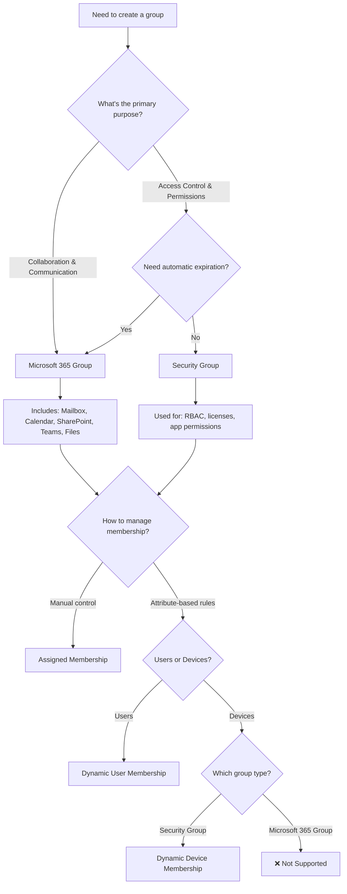

#### Practical Examples

**Example 1: Temporary Project Team**

**Requirement:**
- 3 users need access to a SharePoint site for a 6-month project
- Group should be automatically cleaned up after the project

**Solution:**
```powershell
# Create Microsoft 365 Group with Assigned membership
New-MgGroup -DisplayName "Project-Phoenix-Team" `
    -MailEnabled $true `
    -MailNickname "project-phoenix" `
    -SecurityEnabled $false `
    -GroupTypes @("Unified")

# Add members
$users = @("user1@contoso.com", "user2@contoso.com", "user3@contoso.com")
foreach ($user in $users) {
    $userId = (Get-MgUser -Filter "userPrincipalName eq '$user'").Id
    New-MgGroupMember -GroupId $groupId -DirectoryObjectId $userId
}

# Group expiration policy (180 days) already configured tenant-wide
```

**Example 2: Sales Department Dynamic Group**

**Requirement:**
- All users in Sales department need access to SharePoint sales resources
- Users automatically added when department attribute = "Sales"
- Clean up after 180 days if inactive

**Solution:**
```powershell
# Create Microsoft 365 Group with Dynamic User membership
New-MgGroup -DisplayName "Sales-Team" `
    -MailEnabled $true `
    -MailNickname "sales-team" `
    -SecurityEnabled $false `
    -GroupTypes @("Unified", "DynamicMembership") `
    -MembershipRule "(user.department -eq 'Sales')" `
    -MembershipRuleProcessingState "On"

# Expiration policy applies automatically
```

**Example 3: Device Management (Security Group Only)**

**Requirement:**
- Apply security policies to all Windows devices

**Solution:**
```powershell
# Create Security Group with Dynamic Device membership
# Note: Microsoft 365 Groups don't support device membership
New-MgGroup -DisplayName "All-Windows-Devices" `
    -MailEnabled $false `
    -SecurityEnabled $true `
    -GroupTypes @("DynamicMembership") `
    -MembershipRule "(device.deviceOSType -eq 'Windows')" `
    -MembershipRuleProcessingState "On"

# No expiration policy (Security Groups don't support it)
```

#### Key Takeaways

**When to Use Security Groups:**
- ✅ Assigning Azure RBAC roles
- ✅ Granting permissions to applications
- ✅ Assigning licenses
- ✅ Device management (Dynamic Device)
- ✅ Nesting groups
- ✅ Service principal membership
- ❌ Don't support automatic expiration

**When to Use Microsoft 365 Groups:**
- ✅ Team collaboration
- ✅ Shared mailbox and calendar
- ✅ SharePoint site access
- ✅ Microsoft Teams
- ✅ Automatic cleanup (expiration policies)
- ✅ Temporary projects
- ❌ Users only (no devices, service principals, or nested groups)
- ❌ Cannot be used for some permission scenarios

**For Temporary Access Scenarios:**
- Always use **Microsoft 365 Groups** when automatic expiration is required
- Works with both **Assigned** and **Dynamic User** membership types
- Security Groups require manual cleanup

---

**References:**
- [Administrative Units in Microsoft Entra ID](https://learn.microsoft.com/en-us/entra/identity/role-based-access-control/administrative-units)
- [Assign Microsoft Entra roles with Administrative Unit scope](https://learn.microsoft.com/en-us/entra/identity/role-based-access-control/admin-units-assign-roles)
- [Manage administrative units](https://learn.microsoft.com/en-us/entra/identity/role-based-access-control/admin-units-manage)
- [Azure AD Entitlement Management](https://learn.microsoft.com/en-us/entra/id-governance/entitlement-management-overview)
- [Difference between Azure roles and Microsoft Entra ID roles](https://learn.microsoft.com/en-us/azure/role-based-access-control/rbac-and-directory-admin-roles)

### Scenario 8: Multi-Subscription Governance

**Solution:** Use **Management Groups**

```
Requirement: All production subscriptions need same policies and RBAC

Implementation:
Management Group: Production
├── Azure Policy: Require tags
├── RBAC: Reader → AuditTeam
└── Subscriptions:
    ├── Prod-Apps-001
    ├── Prod-Apps-002
    └── Prod-Data-001

All subscriptions automatically:
✅ Enforce tagging policy
✅ Grant Reader access to AuditTeam
```

### Scenario 7a: Virtual Network Permissions - Resource Management vs Access Management

**Problem:** Determine which users can add subnets and assign RBAC roles for a virtual network

#### Common Exam Scenario

**Question:** You have an Azure subscription named Subscription1 that contains a virtual network VNet1.

You have the following users with assigned roles **at the subscription level**:

| User | Role | Scope |
|------|------|-------|
| User1 | Owner | Subscription1 |
| User2 | Security Admin | Subscription1 |
| User3 | Network Contributor | Subscription1 |

**Note:** In exam questions, when scope is not explicitly stated but users are listed with roles, it typically means roles are assigned at the subscription level (or at a scope that includes the resource). This is a common exam pattern.

**Questions:**
1. Which user(s) can add a subnet to VNet1?
2. Which user(s) can assign a user the Reader role to VNet1?

**Answers:**

**1. Add a subnet to VNet1:** ✅ **User1 and User3 only**

**2. Assign a user the Reader role to VNet1:** ✅ **User1 only**

#### Detailed Explanation

**User1 (Owner Role):**
- ✅ Can add subnets (Owner includes all Contributor permissions)
- ✅ Can assign RBAC roles (Owner includes User Access Administrator permissions)
- Owner = Full resource management + Full access management

**User2 (Security Admin Role):**
- ❌ Cannot add subnets (Security Admin focuses on security-related resources)
- ❌ Cannot assign general RBAC roles like Reader (can only manage security-specific assignments)
- Security Admin permissions:
  - Manage security policies
  - View security states
  - Manage security center settings
  - **NOT** general network resource management

**User3 (Network Contributor Role):**
- ✅ Can add subnets (Network Contributor can manage all network resources)
- ❌ Cannot assign RBAC roles (Contributor-type roles cannot manage access)
- Network Contributor permissions:
  - Create/delete/modify virtual networks
  - Add/remove subnets
  - Configure network security groups
  - **NOT** role assignments

**Key Concept: Two Distinct Permission Categories**
```
Resource Management              Access Management
       ↓                                ↓
Contributor-based roles          Owner/User Access Admin
(Create, modify, delete)         (Assign roles, manage access)
       ↓                                ↓
   User1 ✅                          User1 ✅
   User3 ✅ (Network only)           User2 ❌
   User2 ❌                          User3 ❌
```

**Summary Table:**

| User | Role | Add Subnet | Assign Reader Role | Reason |
|------|------|------------|-------------------|---------|
| User1 | Owner | ✅ | ✅ | Full management + access control |
| User2 | Security Admin | ❌ | ❌ | Security-focused, not network management |
| User3 | Network Contributor | ✅ | ❌ | Network management only, no access control |

**Important Rule:**
- **Contributor-type roles** (Network Contributor, Storage Contributor, etc.) = Resource management ONLY
- **Owner** or **User Access Administrator** = Required for RBAC role assignments

### Scenario 8: Access Needed Across Multiple Tenants

**Problem:** User needs access to resources in multiple Microsoft Entra ID tenants

**Solution:** Use **Azure B2B (Guest Users)**

```
Tenant A (contoso.com):
├── User1@contoso.com (Member user)
└── Resources requiring access

Tenant B (fabrikam.com):
├── User1@contoso.com (Guest user - invited)
│   └── Assigned RBAC roles in Tenant B
└── Resources

User1 can switch tenants in Azure Portal to access resources in both
```

### Scenario 9: Temporary Elevated Access Needed

**Solution:** Use **Privileged Identity Management (PIM)**

```
Normal state:
User: DevOps1
Role: Eligible for Owner
Scope: Subscription "Prod"
Status: Not active

When access needed:
DevOps1 activates Owner role
├── Provides justification
├── Goes through approval (if configured)
└── Receives Owner access for 8 hours

After 8 hours:
Access automatically removed
```

### Scenario 10: Prevent Contributor from Accessing Storage Data

**Problem:** User with Contributor can grant themselves Storage Blob Data access using access keys

**Solution:** Implement **Azure RBAC permission model** for Storage

```
Storage Account Configuration:
├── Disable shared key access
├── Require Microsoft Entra ID authentication
└── Use RBAC roles for data plane access

User: Contributor on subscription
Permissions:
✅ Create storage account
✅ Configure networking
❌ Access blob data (requires Storage Blob Data Reader/Contributor)
❌ List access keys (if "AllowSharedKeyAccess": false)
```

---

## Privileged Identity Management (PIM)

### What is PIM?

**Privileged Identity Management** provides time-based and approval-based role activation to mitigate risks of excessive, unnecessary, or misused access permissions.

### Key Features

| Feature | Description | Benefit |
|---------|-------------|---------|
| **Just-in-Time Access** | Activate roles only when needed | Reduces standing privileges |
| **Time-Bound Access** | Roles auto-expire after duration | Prevents forgotten permissions |
| **Approval Workflow** | Require approval for activation | Adds oversight |
| **Justification Required** | Provide reason for activation | Creates audit trail |
| **Access Reviews** | Periodic certification of access | Removes stale assignments |
| **Alerts** | Notifications for activations | Security monitoring |

### PIM Assignment Types

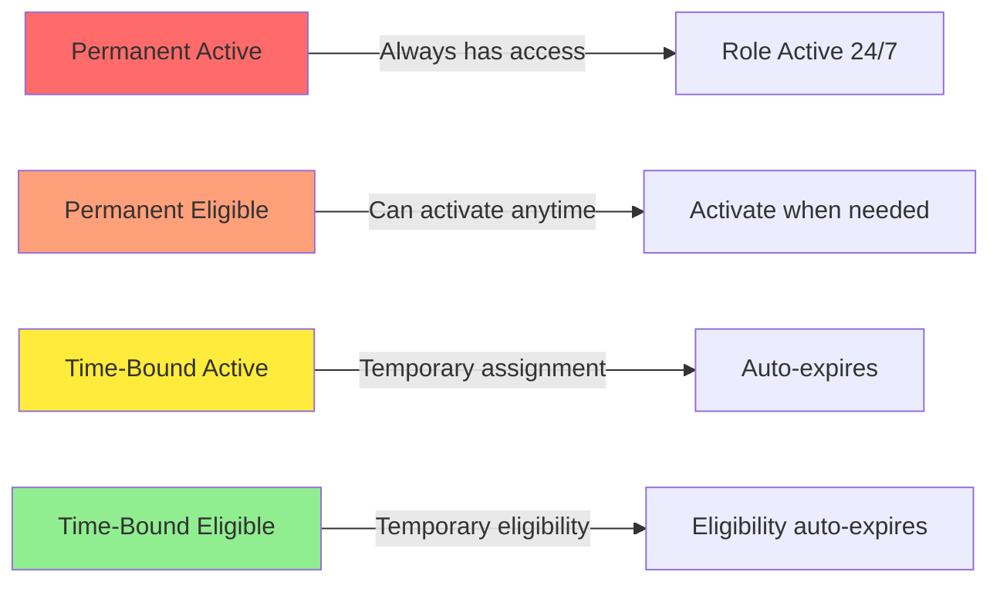

### PIM Workflow

```
1. Administrator creates eligible assignment
   User1 → Eligible for Owner → Subscription

2. User activates role
   User1 requests activation
   ├── Provides justification: "Deploying hotfix"
   ├── Specifies duration: 4 hours
   └── Submits for approval (if required)

3. Approval (if configured)
   Approver reviews and approves

4. Role activated
   User1 → Owner → Subscription (4 hours)

5. Automatic deactivation
   After 4 hours: User1 has no access
```

### PIM Configuration Options

```yaml
Role Setting: Owner (Subscription)
Activation:
  Maximum duration: 8 hours
  Require justification: Yes
  Require approval: Yes
  Approvers: 
    - admin@contoso.com
    - security@contoso.com
  Require MFA: Yes
  Require ticket: Optional

Assignment:
  Maximum duration (eligible): 365 days
  Maximum duration (active): 180 days
  Require justification: Yes
  Require approval: Yes

Notification:
  Send email when activated: Yes
  Send email to approvers: Yes
```

### When to Use PIM

| Scenario | Use PIM? | Reason |
|----------|----------|--------|
| Production Owner role | ✅ Yes | High-privilege, infrequent need |
| Global Administrator | ✅ Yes | Highest privilege, should be time-limited |
| Reader role | ❌ No | Low privilege, can be permanent |
| Break-glass account | ❌ No | Emergency account, must be always available |
| Service Principal | ❌ No | Non-interactive identity |
| Helpdesk admin | Depends | If frequent use: No, If occasional: Yes |

---

## Cross-Tenant and Multi-Tenant Considerations

### Tenant Isolation

**Critical Understanding:** Each Microsoft Entra ID tenant is completely isolated

```
Tenant A (contoso.com):
├── Microsoft Entra ID Roles: Only apply within Tenant A
├── Azure RBAC: Only apply to subscriptions in Tenant A
├── Users: Separate user database
└── Management Groups: Separate hierarchy

Tenant B (fabrikam.com):
├── Microsoft Entra ID Roles: Only apply within Tenant B
├── Azure RBAC: Only apply to subscriptions in Tenant B
├── Users: Separate user database
└── Management Groups: Separate hierarchy

No automatic sharing between tenants
```

### Working Across Tenants

#### Option 1: B2B Guest Users

```
Tenant A (contoso.com):
├── user1@contoso.com (Member)
└── Subscription A

Tenant B (fabrikam.com):
├── user1@contoso.com (Guest - invited from Tenant A)
├── Assigned roles in Tenant B
└── Subscription B

User1 can access resources in both tenants
```

**Characteristics:**
- Guest user maintains identity from home tenant
- Can be assigned Microsoft Entra ID roles and Azure RBAC roles in resource tenant
- Subject to resource tenant's policies
- Can be external (personal accounts, other organizations)

#### Option 2: Azure Lighthouse

```
Service Provider (Tenant A):
├── Managed Service Provider staff
└── Manage customer resources

Customer (Tenant B):
├── Delegates subscriptions/resource groups to Tenant A
└── Retains ownership

Tenant A users can manage Tenant B resources without being guests
```

**Use Cases:**
- Managed service providers
- Multi-tenant management
- Cross-organization collaboration

#### Option 3: Separate Accounts

```
User has separate accounts:
├── user1@contoso.com (Tenant A)
└── user1@fabrikam.com (Tenant B)

Must sign in separately to each tenant
```

### Management Group Limitations Across Tenants

**Important:** Management groups are tenant-scoped

```
❌ Cannot Do This:
Management Group (Tenant A)
└── Subscription from Tenant B (Not possible)

✅ Must Do This:
Management Group A (Tenant A)
└── Subscriptions from Tenant A only

Management Group B (Tenant B)
└── Subscriptions from Tenant B only
```

### Subscription Transfer Between Tenants

When transferring a subscription to another tenant:

**Before Transfer:**
```
Tenant A:
Subscription: Prod-001
├── User1@tenantA.com → Owner
├── Group1@tenantA.com → Contributor
└── Resources
```

**After Transfer to Tenant B:**
```
Tenant B:
Subscription: Prod-001
├── ⚠️ Previous role assignments may be broken
├── Resources intact
└── Need to recreate RBAC assignments with Tenant B identities
```

**Best Practices:**
1. Document all role assignments before transfer
2. Plan access recovery (Global Admin elevation)
3. Reassign roles after transfer
4. Test access before removing old assignments

---

## Troubleshooting Common Issues

### Issue 1: "I have Owner role but can't create users"

**Cause:** Owner is an **Azure RBAC role**, not an **Microsoft Entra ID role**

**Solution:**
```
Problem: Owner role on subscription
Need: User Administrator or Global Administrator (Microsoft Entra ID role)

Steps:
1. Request Global Administrator or User Administrator role
2. Or ask someone with these roles to create users
```

### Issue 2: "I'm Global Admin but can't access subscriptions"

**Cause:** Microsoft Entra ID roles don't automatically grant Azure RBAC access

**Solution:**
```
Use Access Elevation:
1. Go to Azure Portal → Microsoft Entra ID
2. Navigate to Properties
3. Enable "Access management for Azure resources"
4. You receive User Access Administrator at root scope
5. Assign yourself Owner on desired subscriptions
6. Disable elevation when done (security best practice)
```

### Issue 3: "User can't access resource even though assigned Reader"

**Possible Causes:**

1. **Deny Assignment Override:**
   ```
   Check: Does resource have deny assignment?
   Location: Resource → Access Control (IAM) → Deny assignments
   ```

2. **Conditional Access Policy Blocking:**
   ```
   Check: Microsoft Entra ID → Security → Conditional Access
   Look for: Policies blocking access based on location, device, etc.
   ```

3. **Resource Policy Blocking:**
   ```
   Check: Azure Policy assignments on resource/resource group/subscription
   Look for: Deny policies
   ```

4. **Role Assignment Inheritance Issue:**
   ```
   Check: Is role assigned at correct scope?
   Verify: Role assignments at subscription, RG, and resource level
   ```

### Issue 4: "Can't see subscription in portal"

**Possible Causes:**

1. **No RBAC role assigned**
   ```
   Solution: Assign at least Reader role
   ```

2. **Subscription disabled**
   ```
   Check: Subscription state in Azure Portal
   Solution: Re-enable subscription (requires Account Administrator)
   ```

3. **Filtering in portal**
   ```
   Check: Portal settings → Directories + subscriptions
   Solution: Ensure subscription is selected
   ```

4. **Wrong tenant**
   ```
   Check: Currently signed-in tenant
   Solution: Switch directories in portal
   ```

### Issue 5: "Custom role isn't working as expected"

**Common Mistakes:**

1. **Missing NotActions:**
   ```json
   {
     "Actions": ["*"],
     "NotActions": [],
     "DataActions": [],
     "NotDataActions": []
   }
   ```
   This grants ALL management plane permissions - very dangerous!

2. **Wrong scope in assignableScopes:**
   ```json
   {
     "assignableScopes": ["/subscriptions/wrong-sub-id"]
   }
   ```
   Role can only be assigned in scopes listed

3. **Confusing Actions with DataActions:**
   ```
   Want: Read blob data
   Wrong: "Microsoft.Storage/storageAccounts/read"
   Right: "Microsoft.Storage/storageAccounts/blobServices/containers/blobs/read"
   ```

### Issue 6: "Tenant migration broke all access"

**Cause:** RBAC assignments reference identities from old tenant

**Solution:**
```
Recovery Steps:
1. Global Admin in new tenant elevates access
2. Assigns Owner to subscription
3. Documents all needed role assignments
4. Creates/invites users in new tenant
5. Assigns roles with new tenant identities
6. Removes broken role assignments from old tenant
```

---

## Custom Role Configuration - Practical Examples

### Understanding Custom Role Components

When working with Azure custom roles, understanding each component of the role definition is critical for exam scenarios and real-world implementations.

#### Custom Role Structure

```json
{
  "properties": {
    "roleName": "role1",
    "description": "",
    "roletype": "true",
    "assignableScopes": [
      "/subscriptions/3d6209d5-c714-4440-9556e-d6342086c2d7/"
    ],
    "permissions": [
      {
        "actions": [
          "Microsoft.Authorization/*/read",
          "Microsoft.Compute/availabilitySets/*",
          "Microsoft.Compute/locations/*",
          "Microsoft.Compute/virtualMachines/*",
          "Microsoft.Compute/virtualMachineScaleSets/*",
          "Microsoft.Compute/disks/write",
          "Microsoft.Compute/disks/read",
          "Microsoft.Compute/disks/delete",
          "Microsoft.Network/locations/*",
          "Microsoft.Network/networkInterfaces/*",
          "Microsoft.Network/networkSecurityGroups/join/action",
          "Microsoft.Network/networkSecurityGroups/read",
          "Microsoft.Network/publicIPAddresses/join/action",
          "Microsoft.Network/publicIPAddresses/read",
          "Microsoft.Network/virtualNetworks/read",
          "Microsoft.Network/virtualNetworks/subnets/join/action",
          "Microsoft.Resources/deployments/*",
          "Microsoft.Resources/subscriptions/resourceGroups/read",
          "Microsoft.Support/*"
        ],
        "notActions": [],
        "dataActions": [],
        "notDataActions": []
      }
    ]
  }
}
```

### Common Exam Scenarios: Custom Role Configuration

#### Scenario 1: VM Login Permissions

**Question:** To ensure that users can sign in to virtual machines that are assigned role1, modify which section?

**Options:**
- actions
- roletype
- notActions
- dataActions ✅ **CORRECT**
- notDataActions
- assignableScopes

**Answer:** **dataActions**

**Explanation:**

Virtual machine login is a **data plane operation**, not a management plane operation. To enable users to sign in to VMs, you must grant permissions in the `dataActions` section.

**Why Other Options Are Wrong:**

| Section | Purpose | Why Wrong for VM Login |
|---------|---------|----------------------|
| `actions` | Management plane operations (create, delete, modify VMs) | VM login is data plane, not management |
| `roletype` | Defines if role is custom or built-in | Not related to permissions |
| `notActions` | Excludes management plane actions | VM login is data plane |
| `notDataActions` | Excludes data plane actions | Need to grant, not exclude |
| `assignableScopes` | Defines where role can be assigned | Doesn't control permissions |

**Required dataActions for VM Login:**

```json
{
  "dataActions": [
    "Microsoft.Compute/virtualMachines/login/action",
    "Microsoft.Compute/virtualMachines/loginAsAdmin/action"
  ]
}
```

**Built-in Roles with VM Login:**
- **Virtual Machine User Login** - Standard user login
- **Virtual Machine Administrator Login** - Admin login

**Complete Example:**

```json
{
  "properties": {
    "roleName": "VM Manager with Login",
    "description": "Can manage VMs and login to them",
    "permissions": [
      {
        "actions": [
          "Microsoft.Compute/virtualMachines/*",
          "Microsoft.Compute/virtualMachineScaleSets/*"
        ],
        "notActions": [],
        "dataActions": [
          "Microsoft.Compute/virtualMachines/login/action",
          "Microsoft.Compute/virtualMachines/loginAsAdmin/action"
        ],
        "notDataActions": []
      }
    ]
  }
}
```

#### Scenario 2: Restricting Role Assignment Scope

**Question:** To ensure that role1 can be assigned only to a resource group named RG1, modify which section?

**Options:**
- actions
- roletype
- notActions
- dataActions
- notDataActions
- assignableScopes ✅ **CORRECT**

**Answer:** **assignableScopes**

**Explanation:**

The `assignableScopes` property defines **where a custom role can be assigned**. It controls the scope hierarchy at which the role can be used.

**Why Other Options Are Wrong:**

| Section | Purpose | Why Wrong for Scope Restriction |
|---------|---------|-------------------------------|
| `actions` | Defines what permissions are granted | Doesn't control where role is assigned |
| `roletype` | Identifies custom vs built-in role | Doesn't control assignment scope |
| `notActions` | Excludes specific permissions | Doesn't control assignment scope |
| `dataActions` | Data plane permissions | Doesn't control assignment scope |
| `notDataActions` | Excludes data plane permissions | Doesn't control assignment scope |

**Current Configuration (Subscription-wide):**

```json
{
  "assignableScopes": [
    "/subscriptions/3d6209d5-c714-4440-9556e-d6342086c2d7/"
  ]
}
```

This allows role1 to be assigned at:
- ✅ Subscription level
- ✅ Any resource group in the subscription
- ✅ Any resource in the subscription

**Modified Configuration (RG1 only):**

```json
{
  "assignableScopes": [
    "/subscriptions/3d6209d5-c714-4440-9556e-d6342086c2d7/resourceGroups/RG1"
  ]
}
```

This restricts role1 to be assigned only at:
- ✅ RG1 resource group level
- ✅ Any resource within RG1
- ❌ Other resource groups
- ❌ Subscription level

### assignableScopes Scope Hierarchy

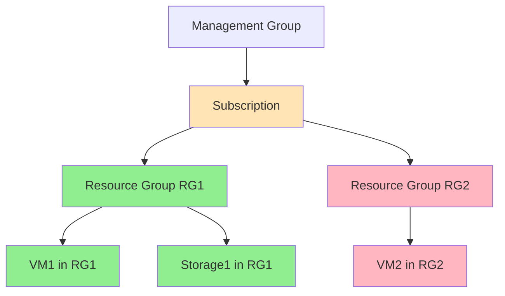

**Legend:**
- 🟢 Green = Can assign role (RG1 and resources in RG1)
- 🔴 Red = Cannot assign role (other resource groups)
- 🟡 Yellow = Can assign if scope includes subscription

### assignableScopes Best Practices

| Scope Level | Example | When to Use | Risk Level |
|-------------|---------|-------------|------------|
| **Management Group** | `/providers/Microsoft.Management/managementGroups/mg1` | Enterprise-wide standard roles | Low (centrally governed) |
| **Subscription** | `/subscriptions/{sub-id}` | Subscription-specific roles | Medium |
| **Resource Group** | `/subscriptions/{sub-id}/resourceGroups/RG1` | Team or project-specific roles | Low (limited blast radius) |
| **Multiple RGs** | Multiple RG paths in array | Multi-team delegation | Medium |

**Example with Multiple Scopes:**

```json
{
  "assignableScopes": [
    "/subscriptions/{sub-id}/resourceGroups/Dev-RG",
    "/subscriptions/{sub-id}/resourceGroups/Test-RG",
    "/subscriptions/{sub-id}/resourceGroups/Staging-RG"
  ]
}
```

### Key Takeaways: Custom Role Configuration

| Component | Controls | Exam Tip |
|-----------|----------|----------|
| **actions** | Management plane permissions (create, modify, delete resources) | For resource management |
| **dataActions** | Data plane permissions (access data, sign in to VMs) | For data access and VM login |
| **notActions** | Excludes specific management actions | Use with wildcard actions |
| **notDataActions** | Excludes specific data actions | Use with wildcard data actions |
| **assignableScopes** | Where the role can be assigned | Controls role assignment scope, not permissions |
| **roleName** | Display name of the role | Descriptive naming |
| **description** | Documentation of role purpose | Clear purpose statement |

### Common Mistakes to Avoid

❌ **Don't confuse actions with dataActions**
```json
// WRONG - This grants VM management, not VM login
{
  "actions": ["Microsoft.Compute/virtualMachines/*"],
  "dataActions": []
}
```

✅ **Do separate management from data plane**
```json
// CORRECT - This grants both VM management and login
{
  "actions": ["Microsoft.Compute/virtualMachines/*"],
  "dataActions": ["Microsoft.Compute/virtualMachines/login/action"]
}
```

---

❌ **Don't set overly broad assignableScopes**
```json
// WRONG - Role can be assigned anywhere in subscription
{
  "assignableScopes": ["/subscriptions/{sub-id}"]
}
```

✅ **Do limit scope to specific resource groups**
```json
// CORRECT - Role limited to specific RG
{
  "assignableScopes": ["/subscriptions/{sub-id}/resourceGroups/ProjectA-RG"]
}
```

---

## Quick Reference Tables

### Role Selection Decision Matrix

| Need | Microsoft Entra ID Role | Azure RBAC Role |
|------|---------------|-----------------|
| Create users | User Administrator | - |
| Reset passwords | Helpdesk Administrator | - |
| Create VMs | - | Contributor |
| Assign Azure resource permissions | - | Owner or User Access Administrator |
| Manage applications | Application Administrator | - |
| Read everything (no changes) | Global Reader | Reader |
| Highest privilege | Global Administrator | Owner (at scope) |
| Manage security settings | Security Administrator | - |
| View billing | Billing Reader | Cost Management Reader |

### Scope Comparison

| Scope Level | Microsoft Entra ID | Azure RBAC | Example |
|-------------|----------|------------|---------|
| Highest | Tenant | Management Group / Tenant Root | contoso.onmicrosoft.com |
| Second | Administrative Unit | Management Group | HR Department / Production MG |
| Third | Application | Subscription | App Registration / Prod-001 |
| Fourth | - | Resource Group | WebApp-RG |
| Lowest | - | Resource | webapp-prod-01 |

### Permission Inheritance

| System | Inherits? | Direction | Example |
|--------|-----------|-----------|---------|
| Microsoft Entra ID Roles | ❌ No | N/A | User Admin for AU doesn't apply to other AUs |
| Azure RBAC Roles | ✅ Yes | Top → Down | Owner at subscription flows to all RGs and resources |

### Common Role Combinations

| Persona | Microsoft Entra ID Role | Azure RBAC Role | Scope |
|---------|---------------|-----------------|-------|
| Cloud Administrator | Global Administrator | Owner | Subscription |
| Security Team | Security Administrator | Security Reader | All resources |
| Developer | - | Contributor | Resource Group |
| Auditor | Global Reader | Reader | Subscription |
| Help Desk | Helpdesk Administrator | Reader | - |
| Identity Admin | User Administrator | - | - |
| Resource Manager | - | Owner | Resource Group |
| Break-glass Account | Global Administrator | Owner | All |

### Time to Activate Roles

| Method | Time to Activate | Approval Required? | Best For |
|--------|------------------|-------------------|----------|
| Permanent Active | Immediate | No | Low-privilege roles, service accounts |
| Permanent Eligible (PIM) | 1-5 minutes | Optional | Regular elevated access |
| Time-Bound Active | Immediate (pre-assigned) | Optional | Temporary projects |
| Time-Bound Eligible (PIM) | 1-5 minutes | Optional | Temporary contractors |

---

## References

- [Azure RBAC documentation](https://learn.microsoft.com/en-us/azure/role-based-access-control/)
- [Entra ID roles documentation](https://learn.microsoft.com/en-us/entra/identity/role-based-access-control/)
- [Difference between Azure roles and Microsoft Entra ID roles](https://learn.microsoft.com/en-us/azure/role-based-access-control/rbac-and-directory-admin-roles)
- [Azure built-in roles](https://learn.microsoft.com/en-us/azure/role-based-access-control/built-in-roles)
- [Entra ID built-in roles](https://learn.microsoft.com/en-us/entra/identity/role-based-access-control/permissions-reference)
- [Azure management groups](https://learn.microsoft.com/en-us/azure/governance/management-groups/)
- [Privileged Identity Management](https://learn.microsoft.com/en-us/entra/id-governance/privileged-identity-management/)
- [Classic subscription administrator roles](https://learn.microsoft.com/en-us/azure/role-based-access-control/classic-administrators)
- [Elevate access for Global Administrator](https://learn.microsoft.com/en-us/azure/role-based-access-control/elevate-access-global-admin)
