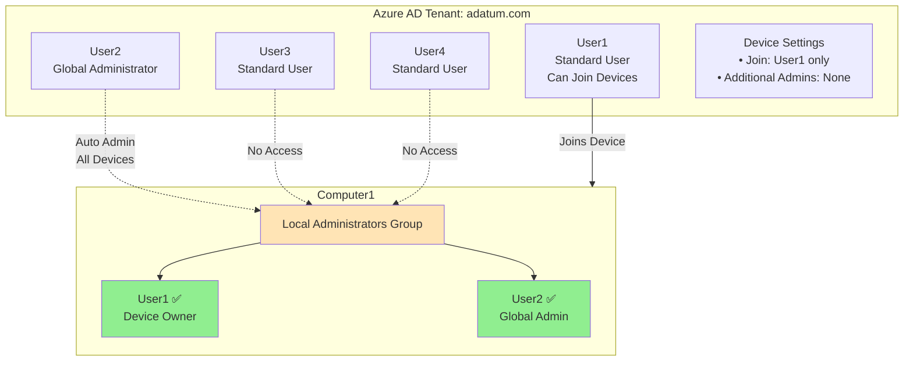

# Azure AD Device Join and Local Administrator Permissions

## Table of Contents

- [1. Introduction](#1-introduction)
- [2. Azure AD Device Join Settings](#2-azure-ad-device-join-settings)
- [3. Local Administrator Assignment on Azure AD Joined Devices](#3-local-administrator-assignment-on-azure-ad-joined-devices)
  - [3.1 Default Local Administrators](#31-default-local-administrators)
  - [3.2 Additional Local Administrators Setting](#32-additional-local-administrators-setting)
- [4. Device Join Types](#4-device-join-types)
- [5. Practice Questions](#5-practice-questions)
  - [Question 1: Local Administrator Group Membership on Azure AD Joined Device](#question-1-local-administrator-group-membership-on-azure-ad-joined-device)

---

## 1. Introduction

When a Windows device is joined to Microsoft Entra ID (formerly Azure AD), specific users are automatically granted local administrator rights on that device. Understanding who receives these privileges is crucial for security and device management.

This document explains:
- How local administrator rights are assigned on Azure AD joined devices
- The difference between default administrators and additional administrators
- Device join settings and their impact on permissions

---

## 2. Azure AD Device Join Settings

Azure AD provides two key settings that control device join behavior:

### Users may join devices to Azure AD

**Location:** Microsoft Entra ID → Devices → Device settings

**Options:**
- **All** - All users in the tenant can join devices
- **Selected** - Only specified users or groups can join devices
- **None** - No users can join devices (administrators can still join)

**Impact:**
- Controls who can perform the device join operation
- The user who performs the join becomes the device owner
- Device owners automatically receive local administrator rights

### Additional local administrators on Azure AD joined devices

**Location:** Microsoft Entra ID → Devices → Device settings

**Options:**
- **None** - No additional users beyond defaults
- **Selected users/groups** - Add specific users to the Device Administrators role

**Impact:**
- Adds extra users to local Administrators group beyond defaults
- These users are added to the **Device Administrators** Azure AD role
- Members of this role get local admin rights on ALL Azure AD joined devices

---

## 3. Local Administrator Assignment on Azure AD Joined Devices

### 3.1 Default Local Administrators

When a device is joined to Azure AD, the following users **automatically** become local administrators:

#### 1. Device Owner (The User Who Joined the Device)

**Who:** The user account that performed the device join operation

**Why:** 
- Ensures the primary user can manage their device
- Grants necessary privileges for software installation and configuration
- Cannot be removed from this list

**Scope:** Only on the specific device they joined

```plaintext
Example:
User: Sarah@contoso.com
Action: Joins Computer1 to Azure AD
Result: Sarah becomes local admin on Computer1
```

#### 2. Global Administrators

**Who:** All users with the Global Administrator role in Azure AD

**Why:**
- Provides IT administrators access to all devices for management
- Enables troubleshooting and support across the organization
- Part of Azure AD's default security model

**Scope:** ALL Azure AD joined devices in the tenant

**Important:** This is a tenant-wide default that cannot be disabled

```plaintext
Example:
User: ITAdmin@contoso.com
Role: Global Administrator
Result: Automatically local admin on ALL Azure AD joined devices
```

#### 3. Device Administrators Role Members

**Who:** Users added to the "Device Administrators" Azure AD role

**How:** Via "Additional local administrators on Azure AD joined devices" setting

**Scope:** ALL Azure AD joined devices in the tenant

```plaintext
Setting: "Additional local administrators on Azure AD joined devices"
Value: Selected → Add User3
Result: User3 becomes local admin on ALL Azure AD joined devices
```

### 3.2 Additional Local Administrators Setting

This setting is **in addition to** the default administrators, not a replacement.

**Setting to "None":**
- ✅ Device owner still gets local admin rights
- ✅ Global Administrators still get local admin rights
- ❌ No additional users beyond these defaults

**Setting to "Selected":**
- ✅ Device owner still gets local admin rights
- ✅ Global Administrators still get local admin rights
- ✅ PLUS selected users/groups added to Device Administrators role

---

## 4. Device Join Types

Understanding device join types helps clarify device management scenarios:

| Join Type | Description | Local Admin Assignment |
|-----------|-------------|----------------------|
| **Azure AD Joined** | Device is joined directly to Azure AD (cloud-only) | Device owner + Global Admins + Device Admins |
| **Hybrid Azure AD Joined** | Device is joined to on-premises AD and Azure AD | On-premises admins + Device owner + Global Admins + Device Admins |
| **Azure AD Registered** | Personal device registered to organization (BYOD) | ❌ No automatic admin rights from Azure AD |

---

## 5. Practice Questions

### Question 1: Local Administrator Group Membership on Azure AD Joined Device

#### Scenario

You have a Microsoft Entra ID (Azure AD) tenant named **adatum.com** that contains the following users:

| User Name | Role/Permission |
|-----------|----------------|
| User1 | Standard user |
| User2 | Global Administrator |
| User3 | Standard user |
| User4 | Standard user |

**Adatum.com has the following device settings:**

- **Users may join devices to Azure AD:** Set to **User1**
- **Additional local administrators on Azure AD joined devices:** Set to **None**

**Actions Performed:**

1. You deploy Windows 10 to a computer named **Computer1**
2. **User1** joins **Computer1** to adatum.com

#### Question

Which users are members of the local Administrators group on Computer1?

**Answer Options:**
- A. User1 only
- B. User2 only
- C. User1 and User2 only ✅
- D. User1, User2, and User3 only
- E. User1, User2, User3, and User4

---

#### Answer: C - User1 and User2 only

#### Detailed Explanation

**Local Administrators on Computer1:**

```plaintext
Computer1 Local Administrators Group:
├── User1 (Device Owner) .................. ✅ Joined the device
├── User2 (Global Administrator) .......... ✅ Default for all joined devices
├── User3 ................................... ❌ No special permissions
└── User4 ................................... ❌ No special permissions
```

**Why User1?**
- User1 is allowed to join devices (per "Users may join devices to Azure AD" setting)
- User1 physically performed the device join operation
- As the **device owner**, User1 automatically receives local administrator rights on Computer1
- This is a default behavior that cannot be changed

**Why User2?**
- User2 has the **Global Administrator** role in Azure AD
- All Global Administrators automatically receive local administrator rights on **ALL Azure AD joined devices**
- This is a tenant-wide default that applies regardless of other settings

**Why NOT User3 and User4?**
- Neither User3 nor User4 has the Global Administrator role
- The "Additional local administrators on Azure AD joined devices" setting is set to **None**
- They were not added to the Device Administrators role
- They did not join the device (so they're not device owners)
- Standard users without special roles or permissions do not receive local admin rights

**Key Principle:**

The "Additional local administrators" setting adds users **in addition to** the defaults, it does not replace them:

```plaintext
Total Local Admins = Default Admins + Additional Admins

Default Admins (Always Present):
├── Device Owner
└── All Global Administrators

Additional Admins (When Setting = "Selected"):
└── Users in "Device Administrators" role

When Setting = "None":
Total = Device Owner + Global Admins only
```

---

#### Key Takeaways

1. **Device Owner Always Gets Admin Rights**
   - The user who joins the device automatically becomes a local administrator
   - This happens regardless of other settings or roles

2. **Global Administrators Are Default Local Admins**
   - ALL Global Administrators get local admin rights on ALL Azure AD joined devices
   - This cannot be disabled—it's a built-in security feature

3. **Additional Local Administrators Setting Is Additive**
   - Setting it to "None" doesn't remove the defaults
   - It only means no extra users are added to the Device Administrators role

4. **Device Administrators Role = All Devices**
   - Users added via "Additional local administrators" setting
   - Get local admin rights on ALL Azure AD joined devices in the tenant
   - Not limited to specific devices

5. **"Users may join devices" ≠ Local Admin Rights**
   - Being allowed to join devices doesn't automatically grant admin rights everywhere
   - Users only get admin rights on devices they personally join (as device owner)

---

#### Common Mistakes

❌ **Incorrect Assumption 1:** Only the device owner gets local admin rights
- **Wrong** - Global Administrators also get automatic access

❌ **Incorrect Assumption 2:** Setting "Additional local administrators" to "None" removes all admin rights
- **Wrong** - Default administrators (device owner + Global Admins) remain

❌ **Incorrect Assumption 3:** All users allowed to join devices get admin rights on all joined devices
- **Wrong** - Users only get admin rights on devices they personally join

❌ **Incorrect Assumption 4:** The Global Administrator role doesn't affect local device permissions
- **Wrong** - Global Admins automatically get local admin rights on ALL Azure AD joined devices

---

#### Architecture Diagram



---

#### Verification in Azure Portal

**To verify device ownership and administrators:**

1. **View Device Owner:**
   ```
   Microsoft Entra ID → Devices → All devices
   → Select Computer1
   → Check "Registered owner" field
   ```

2. **View Global Administrators:**
   ```
   Microsoft Entra ID → Roles and administrators
   → Global Administrator
   → Assignments (shows all Global Admins)
   ```

3. **View Additional Administrators Setting:**
   ```
   Microsoft Entra ID → Devices → Device settings
   → Additional local administrators on Azure AD joined devices
   ```

4. **View Device Administrators Role Members:**
   ```
   Microsoft Entra ID → Roles and administrators
   → Cloud Device Administrator
   → Assignments
   ```

---

#### PowerShell Verification

**On the Windows device, check local Administrators group:**

```powershell
# View local Administrators group members
Get-LocalGroupMember -Group "Administrators"

# Output will show:
# - AzureAD\User1@adatum.com (Device Owner)
# - AzureAD\User2@adatum.com (Global Administrator)
# - BUILTIN\Administrators (local group)
```

**In Azure AD PowerShell:**

```powershell
# Connect to Azure AD
Connect-AzureAD

# Get device details
Get-AzureADDevice -SearchString "Computer1" | Select-Object DisplayName, DeviceId, DeviceOwner

# Get all Global Administrators
Get-AzureADDirectoryRole -Filter "displayName eq 'Global Administrator'" | 
    Get-AzureADDirectoryRoleMember | 
    Select-Object DisplayName, UserPrincipalName

# Get Device Administrators role members
Get-AzureADDirectoryRole -Filter "displayName eq 'Cloud Device Administrator'" | 
    Get-AzureADDirectoryRoleMember | 
    Select-Object DisplayName, UserPrincipalName
```

---

## Related Documentation

- [Microsoft Entra ID Conditional Access Policies](./conditional-access-policies.md)
- [Azure AD Device Management](https://learn.microsoft.com/en-us/entra/identity/devices/)
- [Azure AD joined devices](https://learn.microsoft.com/en-us/entra/identity/devices/concept-directory-join)
- [Manage local administrators on Azure AD joined devices](https://learn.microsoft.com/en-us/entra/identity/devices/assign-local-admin)
- [Azure AD built-in roles](https://learn.microsoft.com/en-us/entra/identity/role-based-access-control/permissions-reference)

---

## Summary

Local administrator rights on Azure AD joined devices follow a predictable pattern:

1. **Always Included (Cannot Remove):**
   - Device owner (user who joined the device)
   - All Global Administrators

2. **Optionally Included (Via Setting):**
   - Users/groups in Device Administrators role
   - Configured via "Additional local administrators on Azure AD joined devices"

3. **Scope of Access:**
   - Device owner: Only their device
   - Global Administrators: ALL devices
   - Device Administrators: ALL devices

This model balances user autonomy, IT administrative access, and security requirements.
