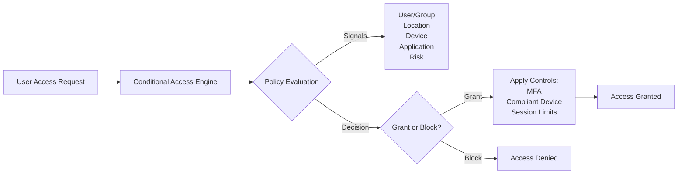
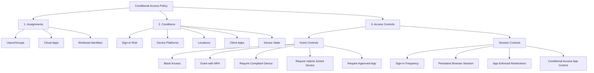
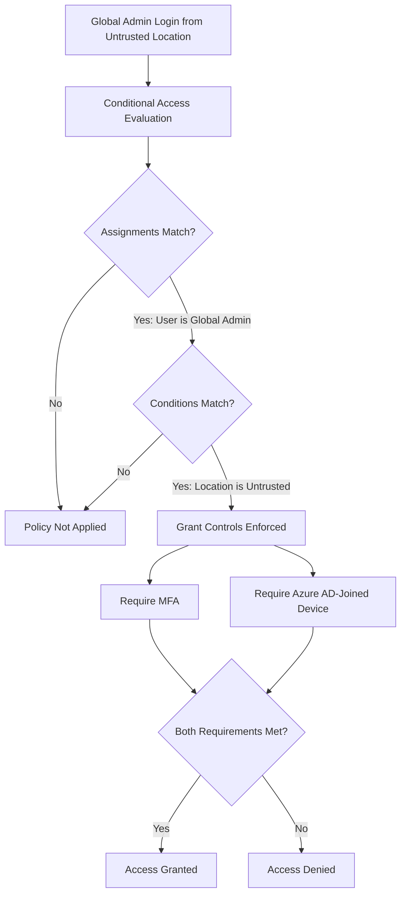

# Azure AD / Microsoft Entra ID Conditional Access Policies

## Table of Contents

- [1. Introduction](#1-introduction)
- [2. What is Conditional Access?](#2-what-is-conditional-access)
- [3. Conditional Access Policy Components](#3-conditional-access-policy-components)
  - [3.1 Assignments](#31-assignments)
  - [3.2 Conditions](#32-conditions)
  - [3.3 Access Controls](#33-access-controls)
    - [Grant Controls](#grant-controls)
    - [Session Controls](#session-controls)
- [4. Common Use Cases](#4-common-use-cases)
- [5. Best Practices](#5-best-practices)
- [6. Practice Questions](#6-practice-questions)
  - [Question 1: MFA and Device Compliance from Untrusted Locations](#question-1-mfa-and-device-compliance-from-untrusted-locations)

---

## 1. Introduction

**Microsoft Entra ID Conditional Access** (formerly Azure AD Conditional Access) is a zero-trust security feature that enables organizations to enforce access policies based on various signals and conditions. It acts as a policy engine that makes access decisions based on user, location, device, application, and risk signals.

Conditional Access is available with:
- **Microsoft Entra ID P1** - Basic Conditional Access policies
- **Microsoft Entra ID P2** - Advanced features including risk-based policies
- **Microsoft 365 E3/E5** - Includes Entra ID P1/P2 respectively

---

## 2. What is Conditional Access?

Conditional Access policies enforce organizational policies for resource access by evaluating signals and applying appropriate controls.



### Zero Trust Principles

Conditional Access is a key component of the Zero Trust security model:
- **Verify explicitly** - Always authenticate and authorize based on all available data points
- **Use least privilege access** - Limit user access with just-in-time and just-enough-access
- **Assume breach** - Verify end-to-end encryption and use analytics to detect threats

---

## 3. Conditional Access Policy Components

A Conditional Access policy consists of three main sections:



---

### 3.1 Assignments

**Assignments** define **WHO** and **WHAT** the policy applies to.

#### Users and Groups
- **Include**: Specific users, groups, roles (e.g., Global Administrators)
- **Exclude**: Emergency access accounts, service accounts
- **All users**: Apply policy to everyone

#### Cloud Apps or Actions
- **Specific applications**: Microsoft 365, Azure portal, custom apps
- **All cloud apps**: Apply to all registered applications
- **User actions**: Register security information, join devices

#### Workload Identities (Premium P2)
- Service principals and managed identities
- Requires **Microsoft Entra Workload ID Premium** license

---

### 3.2 Conditions

**Conditions** define **WHEN** and **WHERE** the policy is enforced.

#### Sign-in Risk (Requires Entra ID P2)
- **High**, **Medium**, **Low**, **No risk**
- Detected by Azure AD Identity Protection
- Examples: Atypical travel, anonymous IP addresses, password spray

#### Device Platforms
- **Windows**, **macOS**, **iOS**, **Android**, **Linux**
- Apply different policies based on OS

#### Locations
- **Named locations**: Define trusted IP ranges (office networks, VPN)
- **Countries/Regions**: Geolocation-based controls
- **Any location** or **All trusted locations**
- **Untrusted locations**: Locations not defined as trusted

#### Client Apps
- **Browser**: Modern authentication
- **Mobile apps and desktop clients**: Legacy and modern authentication
- **Exchange ActiveSync clients**
- **Other clients**: IMAP, POP, SMTP

#### Filter for Devices
- Device attributes (device name, manufacturer, model, OS version)
- Device extension attributes

---

### 3.3 Access Controls

**Access Controls** define **WHAT HAPPENS** when policy conditions are met.

#### Grant Controls

Grant controls determine whether to **block** or **grant** access, and under what conditions.

| Control | Description | Example Use Case |
|---------|-------------|------------------|
| **Block access** | Completely deny access | Block legacy authentication |
| **Grant access** | Allow access without additional requirements | Trusted internal network |
| **Require multi-factor authentication** | User must complete MFA (SMS, app, phone call) | Remote access to sensitive apps |
| **Require device to be marked as compliant** | Device meets Intune compliance policy | Corporate data access |
| **Require Hybrid Azure AD joined device** | Device is joined to on-premises AD and Azure AD | On-premises integration scenarios |
| **Require approved client app** | Must use approved mobile apps (Outlook, Teams) | Mobile device management |
| **Require app protection policy** | Must have Intune app protection applied | BYOD scenarios |
| **Require password change** | Force password reset (for risky sign-ins) | Compromised account recovery |

**Multiple Controls Requirement:**
- **Require all the selected controls** (AND logic)
- **Require one of the selected controls** (OR logic)

**Example - Require MFA AND Compliant Device:**
```yaml
Grant Controls:
  - Require multi-factor authentication: ✅
  - Require device to be marked as compliant: ✅
  - Multiple controls requirement: Require all selected controls
```

---

#### Session Controls

Session controls enable **limited experiences** within cloud applications without blocking access entirely. They control the user session **after** access is granted.

| Control | Description | Example Use Case |
|---------|-------------|------------------|
| **Use app enforced restrictions** | Pass device information to supported apps (SharePoint Online, Exchange Online) | Limit download on unmanaged devices |
| **Use Conditional Access App Control** | Integrate with Microsoft Defender for Cloud Apps for real-time monitoring | Monitor and control file downloads in real-time |
| **Sign-in frequency** | Require re-authentication after a specified time | Require MFA every 4 hours for admin access |
| **Persistent browser session** | Keep users signed in after closing browser | Allow "Stay signed in" prompt |

**Important**: Session controls are applied **AFTER** grant controls.

---

## 4. Common Use Cases

### Use Case 1: Require MFA for All Users from Untrusted Locations

**Goal**: Enforce MFA when users connect from outside the corporate network.

**Configuration**:
- **Assignments**:
  - Users: All users
  - Cloud apps: All cloud apps
- **Conditions**:
  - Locations: Any location except trusted locations
- **Access Controls**:
  - Grant: Require multi-factor authentication

---

### Use Case 2: Require MFA and Compliant Device for Administrators

**Goal**: Global Administrators must use MFA and a compliant device from any location.

**Configuration**:
- **Assignments**:
  - Users: Directory role → Global Administrators
  - Cloud apps: All cloud apps
- **Conditions**:
  - None (applies to all locations)
- **Access Controls**:
  - Grant: 
    - Require multi-factor authentication
    - Require device to be marked as compliant
    - Multiple controls: Require all selected controls

---

### Use Case 3: Block Legacy Authentication

**Goal**: Block sign-ins using legacy authentication protocols (no MFA support).

**Configuration**:
- **Assignments**:
  - Users: All users
  - Cloud apps: All cloud apps
- **Conditions**:
  - Client apps: Other clients (IMAP, POP, SMTP)
- **Access Controls**:
  - Block access

---

### Use Case 4: Require MFA and Azure AD Joined Device from Untrusted Locations

**Goal**: Require Global Administrators to use MFA and an Azure AD-joined device when connecting from untrusted locations.

**Configuration**:
- **Assignments**:
  - Users: Directory role → Global Administrators
  - Cloud apps: All cloud apps
- **Conditions**:
  - Locations: Any location except trusted locations (or "All locations")
- **Access Controls**:
  - Grant:
    - Require multi-factor authentication
    - Require Hybrid Azure AD joined device (or Azure AD joined device)
    - Multiple controls: Require all selected controls

**Note**: This requires configuring **grant controls**, NOT session controls.

---

## 5. Best Practices

### Design Best Practices

1. **Always exclude emergency access accounts** (break-glass accounts) from all policies
2. **Use report-only mode** before enforcing new policies to test impact
3. **Start with targeted groups** before rolling out to all users
4. **Create baseline policies** for common scenarios (MFA, device compliance)
5. **Use named locations** to define trusted networks clearly

### Deployment Best Practices

1. **Enable MFA for all administrators** as a priority
2. **Block legacy authentication** to prevent MFA bypass
3. **Use risk-based policies** (requires Entra ID P2) for dynamic MFA enforcement
4. **Combine with Intune** for device compliance enforcement
5. **Monitor sign-in logs** to identify policy impact and failures

### Security Best Practices

1. **Implement least privilege** - Only grant the minimum required access
2. **Use device compliance** - Ensure devices meet security standards
3. **Enable continuous access evaluation** - Real-time policy enforcement
4. **Configure session timeouts** for sensitive applications
5. **Review and update policies regularly** - Align with changing security requirements

---

## 6. Practice Questions

### Question 1: MFA and Device Compliance from Untrusted Locations

**Scenario:**

Your company has an Azure Active Directory (Azure AD) subscription.

You want to implement an Azure AD conditional access policy.

The policy must be configured to require members of the Global Administrators group to use Multi-Factor Authentication and an Azure AD-joined device when they connect to Azure AD from untrusted locations.

**Solution:** 

You access the Azure portal to alter the **session control** of the Azure AD conditional access policy.

**Question:** Does the solution meet the goal?

#### Answer

**❌ No**

#### Explanation

Altering the **session control** of the Azure AD Conditional Access policy alone **does not meet the requirements**. 

**Why this is incorrect:**

1. **Session controls** are applied **AFTER** access is granted and are used to:
   - Limit sign-in frequency
   - Control persistent browser sessions
   - Enable app enforced restrictions
   - Enable Conditional Access App Control monitoring

2. **Session controls do NOT enforce**:
   - Multi-Factor Authentication (MFA)
   - Device compliance requirements
   - Azure AD-joined device requirements

**What is required instead:**

To meet the goal, the Conditional Access policy must be configured using:

1. **Assignments**:
   - Users: **Directory role → Global Administrators**
   - Cloud apps: **All cloud apps** (or specific apps like Azure portal)

2. **Conditions**:
   - Locations: **Any location except trusted locations** (defines untrusted locations)
   - Alternatively: **All locations** (if MFA and device compliance should always be required)

3. **Access Controls → Grant Controls** (NOT Session Controls):
   - ✅ **Require multi-factor authentication**
   - ✅ **Require Hybrid Azure AD joined device** (or Azure AD joined device)
   - Multiple controls requirement: **Require all the selected controls**

**Policy Configuration Flow:**



**Key Takeaway:**

- Use **Grant Controls** to enforce authentication and device requirements (MFA, compliant devices, app approval)
- Use **Session Controls** to manage session behavior after access is granted (sign-in frequency, persistent sessions)
- For this scenario, **Grant Controls are the correct configuration**, NOT Session Controls

---

## Related Documentation

- [Azure Identity Overview](../azure_identity_overview.md) - Service principals and conditional access for workload identities
- [Azure Roles Comprehensive Guide](../azure-roles-comprehensive-guide.md) - Azure RBAC vs Entra ID roles
- [Microsoft Entra ID Identity Governance](./microsoft-entra-id-identity-governance.md) - Access reviews and entitlement management
- [Microsoft Entra Privileged Identity Management](./microsoft-entra-privileged-identity-management.md) - Just-in-time privileged access
- [Azure Bastion VM Access](../bastion/azure-bastion-vm-access.md) - Conditional Access for VM access

---

## References

- [Microsoft Learn: What is Conditional Access?](https://learn.microsoft.com/en-us/entra/identity/conditional-access/overview)
- [Microsoft Learn: Conditional Access policies](https://learn.microsoft.com/en-us/entra/identity/conditional-access/concept-conditional-access-policies)
- [Microsoft Learn: Plan a Conditional Access deployment](https://learn.microsoft.com/en-us/entra/identity/conditional-access/plan-conditional-access)
- [Microsoft Learn: Common Conditional Access policies](https://learn.microsoft.com/en-us/entra/identity/conditional-access/concept-conditional-access-policy-common)
