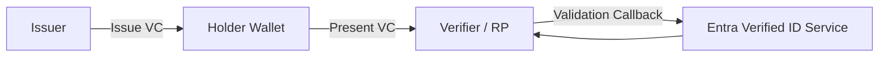

# Microsoft Entra Verified ID: Concept Summary

## Overview

Microsoft Entra Verified ID is Microsoft's implementation of decentralized identity and verifiable credentials.

In this context:
- **VC = Verifiable Credential**
- A VC is a digitally signed claim (for example: employee status, certification, age, partner membership) that can be issued, stored in a wallet, and presented to a verifier.

Unlike classic identity flows that depend on a central identity provider at every request, Verified ID allows a holder to present proof directly to a relying party while preserving privacy.

> **General Pattern**: [Authentication Protocols](../../../architecture-general/06-security-architecture/6.2-identity/6.2.2-authentication-protocols.md)

---

## Why this exists

Traditional identity models can require repeated account provisioning, federation setup, and over-sharing of personal data.

Verified ID addresses this by enabling:
- **Selective disclosure**: Share only required claims.
- **Cryptographic trust**: Claims are signed and verifiable.
- **Portable trust**: The user can present a credential across multiple relying parties.

---

## Core building blocks

| Term | Meaning |
|------|---------|
| **DID** | Decentralized Identifier used by issuer, holder, and verifier |
| **VC** | Verifiable Credential signed by an issuer |
| **Wallet** | App (for example Microsoft Authenticator) that stores and presents VCs |
| **Issuer** | Organization that issues credential claims |
| **Holder** | User or entity that owns the credential |
| **Verifier / RP** | App or service that requests and validates a credential |

---

## How it works

### 1. Issuance flow

1. Holder starts from an issuer web app.
2. Issuer asks Microsoft Entra Verified ID service to create an issuance request.
3. Holder scans a QR/deep link with wallet.
4. Wallet validates issuer identity and request signature.
5. Wallet receives and stores signed VC.

### 2. Presentation flow

1. Holder starts from a verifier (relying party) app.
2. Verifier asks Microsoft Entra Verified ID service to create a presentation request.
3. Holder scans QR/deep link with wallet.
4. Wallet shows matching credentials and asks holder consent.
5. Wallet sends signed presentation.
6. Service validates proof (and optional revocation status) and returns result to verifier.

---

## Where it fits in Azure security architecture

Use Verified ID when you need trustable proofs without creating full user accounts everywhere.

Common Azure-centric scenarios:
- Workforce onboarding proofs for partner access.
- Customer or citizen identity attestations with privacy controls.
- Cross-organization B2B verification (for example contractor certification checks).
- Step-up access checks based on proof of role or training.

Works alongside Microsoft Entra ID, not as a direct replacement for all sign-in methods.

---

## When to use vs not use

| Use Verified ID when | Prefer standard Entra authentication when |
|----------------------|-------------------------------------------|
| You need proof of specific claims | You need classic SSO/session-based app login |
| You want user-held credentials | You need centralized account lifecycle only |
| You need cross-org trust with minimal provisioning | You control both app and user directory end-to-end |
| You need selective disclosure and privacy | Full claim set disclosure is acceptable |

---

## Key security notes

- Validate issuer DID and signature for every presented credential.
- Check revocation and expiration when required by policy.
- Request minimum claims needed for the business decision.
- Bind business decisions to verified claims, not untrusted client data.

---

## Short takeaway

- **VC means Verifiable Credential.**
- Microsoft Entra Verified ID enables decentralized, cryptographically verifiable identity claims.
- It is best used for proof-based trust scenarios across apps and organizations.
