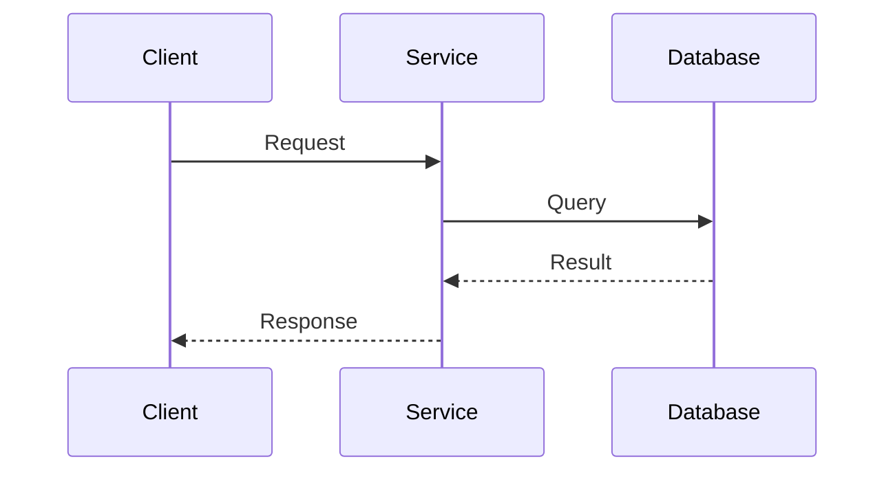
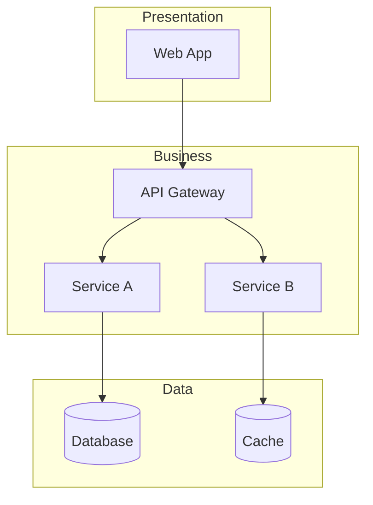

# GitHub Copilot Instructions - General Architecture

## Scope

This directory contains **cloud-agnostic** architecture documentation covering software design patterns, distributed systems concepts, and best practices applicable across any platform.

## Directory Structure

| Directory | Purpose |
|-----------|---------|
| `fundamentals/` | Core concepts: design patterns, architectural styles |
| `distributed-systems/` | Event-driven architecture, messaging patterns |
| `domain-driven-design/` | DDD concepts, event storming, bounded contexts |
| `networking/` | Network architecture patterns (hub-spoke, etc.) |
| `security/` | Security principles and authentication patterns |
| `observability/` | Monitoring, logging, tracing, metrics |
| `reference/` | Taxonomies and reference materials |

## Content Guidelines

### Cloud-Agnostic Approach

When documenting patterns:
1. **Focus on concepts**, not specific implementations
2. **Use generic terminology**: "message broker" not "Service Bus"
3. **Provide examples** from multiple platforms when relevant
4. **Link to platform-specific** docs for implementation details

### Pattern Documentation Template

```markdown
# Pattern Name

## Problem
What problem does this pattern solve?

## Solution
How does this pattern address the problem?

## When to Use
- Scenario 1
- Scenario 2

## When NOT to Use
- Anti-pattern scenario

## Implementation Considerations
Platform-agnostic guidance

## Related Patterns
- Pattern A
- Pattern B

## Platform-Specific Implementations
- [Azure Implementation](../architecture-azure/...)
- AWS Implementation (if applicable)
```

## Key Topics

### Fundamentals
- **Design Patterns**: Creational, Structural, Behavioral
- **Architectural Styles**: Microservices, Monolith, Serverless, Event-Driven
- **Reliability Patterns**: Circuit Breaker, Retry, Bulkhead

### Distributed Systems
- **Messaging Patterns**: Pub/Sub, Point-to-Point, Request/Reply
- **Event-Driven Architecture**: Event Sourcing, CQRS, Event Streaming
- **Consistency Models**: Eventually Consistent, Strong Consistency

### Domain-Driven Design
- **Strategic Design**: Bounded Contexts, Context Mapping
- **Tactical Design**: Aggregates, Entities, Value Objects
- **Event Storming**: Workshops and modeling techniques

### Observability
- **Three Pillars**: Logs, Metrics, Traces
- **Monitoring Strategies**: RED method, USE method
- **Alerting**: Best practices and anti-patterns

### Security
- **Authentication**: OAuth 2.0, OpenID Connect, SAML
- **Authorization**: RBAC, ABAC, Policy-based
- **Zero Trust**: Principles and implementation

## Diagram Standards

Use Mermaid with consistent styling:

### Sequence Diagrams


### Architecture Diagrams


## Cross-References

When a concept has an Azure-specific implementation:
```markdown
> **Azure Implementation**: See [Azure Event Hubs](../architecture-azure/integration/event-hubs/) for Azure-specific details.
```

## Terminology Standards

| Term | Definition |
|------|------------|
| Message Broker | Service that handles message routing between publishers and subscribers |
| Event | Immutable fact about something that happened |
| Command | Request to perform an action |
| Query | Request for information |
| Aggregate | DDD concept - cluster of domain objects treated as a unit |

## Quality Standards

- Include **real-world use cases** for each pattern
- Provide **decision trees** for choosing between similar patterns
- Add **trade-off analysis** (pros/cons tables)
- Include **failure scenarios** and how patterns handle them
