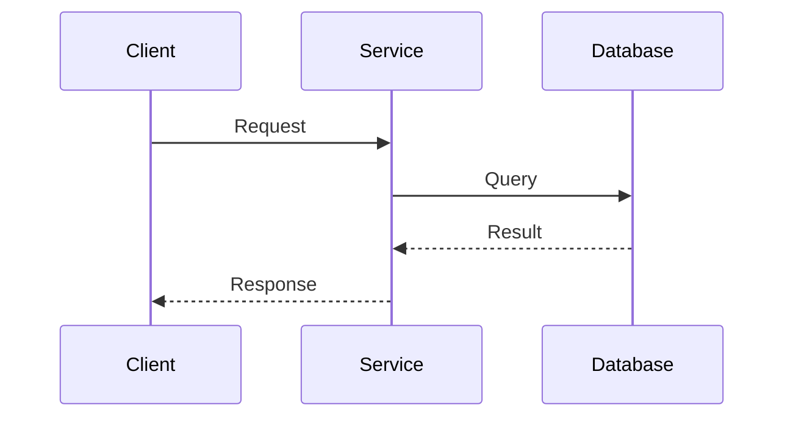
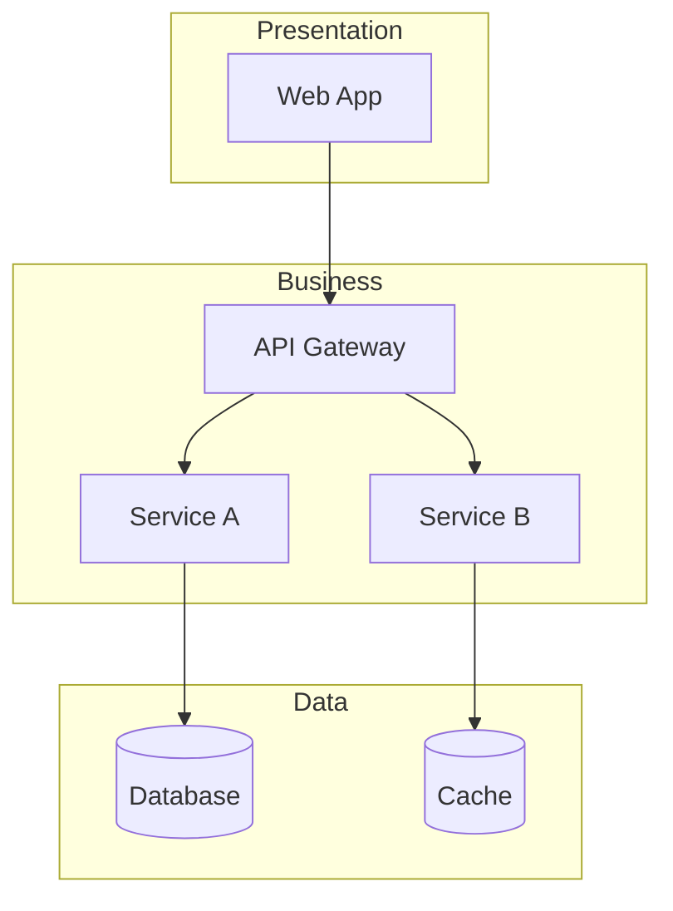

# GitHub Copilot Instructions - General Architecture

## Scope

This directory contains **cloud-agnostic** architecture documentation covering software design patterns, distributed systems concepts, and best practices applicable across any platform.

## Foundational Reference

> **IMPORTANT**: All documentation in this directory MUST align with the **Architecture Taxonomy Reference**:
> 
> 📖 **[architecture_taxonomy_reference.md](10-practicality-taxonomy/architecture_taxonomy_reference.md)**
>
> This taxonomy is the **canonical source** for architecture terminology, categories, and classification. Any new documentation or structural changes must be synchronized with this reference.

## Directory Structure

The directory structure maps to the taxonomy categories. Keep synchronized:

| Directory | Taxonomy Alignment | Purpose |
|-----------|-------------------|---------|
| `fundamentals/` | §2 Application & Software Architecture | Design patterns, architectural styles (Layered, Hexagonal, Clean) |
| `distributed-systems/` | §3 Integration & Communication | Event-driven architecture, messaging patterns, CQRS, Sagas |
| `domain-driven-design/` | §2.1 + Strategic Design | Bounded contexts, aggregates, event storming |
| `language-selection/` | §2 Application & Software Architecture | Language and technology choice criteria, case studies |
| `networking/` | §5.2 Infrastructure | Network architecture patterns (hub-spoke) |
| `security/` | §6 Security Architecture | Zero Trust, IAM, encryption patterns |
| `observability/` | §7.3 Observability Architecture | Logging, metrics, distributed tracing |
| `reference/` | Meta / Cross-cutting | **Taxonomies and canonical references** |

### Taxonomy Section Mapping

```
architecture-general/
├── fundamentals/           → Taxonomy §2 (Application & Software)
│   ├── design-patterns/    → §2.1 Application Architecture Styles
│   └── architectural-styles/
├── distributed-systems/    → Taxonomy §3 (Integration & Communication)
│   ├── event-driven/       → §3.3 Event-Driven & Messaging
│   └── messaging-patterns/ → §3.3 Messaging Delivery Patterns
├── domain-driven-design/   → Taxonomy §2 + Strategic DDD
├── language-selection/     → Taxonomy §2 (Application & Software)
│   └── case-studies/       → Real-world language choice decisions
├── networking/             → Taxonomy §5.2 Infrastructure
├── security/               → Taxonomy §6 Security Architecture
├── observability/          → Taxonomy §7.3 Observability
└── reference/              → Taxonomy source + cross-cutting
```

## Content Guidelines

### Taxonomy Synchronization Rules

1. **New directories** must map to a taxonomy section
2. **New documents** should reference their taxonomy category
3. **Terminology** must match taxonomy definitions
4. **Updates to taxonomy** require review of affected directories

### Cloud-Agnostic Approach

When documenting patterns:
1. **Focus on concepts**, not specific implementations
2. **Use generic terminology**: "message broker" not "Service Bus"
3. **Provide examples** from multiple platforms when relevant
4. **Link to platform-specific** docs for implementation details
5. **Reference taxonomy section** for classification

### Pattern Documentation Template

```markdown
# Pattern Name

> **Taxonomy Reference**: §X.X Category Name (see [architecture_taxonomy_reference.md](10-practicality-taxonomy/architecture_taxonomy_reference.md))

## Problem
What problem does this pattern solve?

## Solution
How does this pattern address the problem?

## Abstraction Level
<!-- From Taxonomy §10 -->
- [ ] Conceptual (Strategic)
- [ ] Logical (Design)
- [ ] Physical (Implementation)
- [ ] Runtime (Operational)

## When to Use
- Scenario 1
- Scenario 2

## When NOT to Use
- Anti-pattern scenario

## Implementation Considerations
Platform-agnostic guidance

## Related Patterns
- Pattern A (§X.X)
- Pattern B (§X.X)

## Platform-Specific Implementations
- [Azure Implementation](../architecture-azure/) <!-- Link to specific Azure doc -->
- AWS Implementation (if applicable)
```

## Key Topics (Taxonomy Aligned)

### Fundamentals (§2 Application & Software Architecture)
- **Design Patterns**: Creational, Structural, Behavioral
- **Architectural Styles**: Monolithic, Modular Monolith, Layered, Clean, Hexagonal, N-Tier
- **Reliability Patterns**: Circuit Breaker, Retry, Bulkhead (§7.1)

### Distributed Systems (§3 Integration & Communication)
- **Messaging Patterns**: Pub/Sub, Point-to-Point, Request/Reply (§3.3)
- **Event-Driven Architecture**: Event Sourcing, CQRS, Saga/Choreography (§3.3)
- **Operational Patterns**: Dead Letter Queue, Competing Consumers, Message Deduplication (§3.3)

### Domain-Driven Design
- **Strategic Design**: Bounded Contexts, Context Mapping
- **Tactical Design**: Aggregates, Entities, Value Objects
- **Event Storming**: Workshops and modeling techniques

### Observability (§7.3 Observability Architecture)
- **Three Pillars**: Logging, Metrics, Distributed Tracing
- **Monitoring Strategies**: RED method, USE method
- **Alerting**: Best practices and anti-patterns

### Security (§6 Security Architecture)
- **Authentication**: OAuth 2.0, OpenID Connect, SAML (§6.2)
- **Authorization**: RBAC, ABAC, Policy-based
- **Zero Trust**: Principles and implementation (§6.1)

## Diagram Standards

Use Mermaid with consistent styling:

### Sequence Diagrams


### Architecture Diagrams


## Cross-References

When a concept has an Azure-specific implementation:
```markdown
> **Azure Implementation**: See [Azure Event Hubs](../architecture-azure/integration/event-hubs/) for Azure-specific details.
```

## Terminology Standards

Use terminology from **[Architecture Taxonomy §11](10-practicality-taxonomy/architecture_taxonomy_reference.md)** and consistent definitions:

| Term | Definition | Taxonomy Ref |
|------|------------|--------------|
| Message Broker | Service that handles message routing between publishers and subscribers | §3.3 |
| Event | Immutable fact about something that happened | §3.3 |
| Command | Request to perform an action | §3.3 CQRS |
| Query | Request for information | §3.3 CQRS |
| Aggregate | DDD concept - cluster of domain objects treated as a unit | §2 |
| Event Sourcing | Store state as sequence of events | §3.3 |
| Saga | Distributed transaction pattern using compensating actions | §3.3 |

## Abstraction Levels (§10 Practicality Taxonomy)

When documenting, specify the abstraction level:

| Level | Focus | Horizon | Audience |
|-------|-------|---------|----------|
| **Conceptual** | Business intent & capabilities | 3–5+ years | Executives, Business Stakeholders |
| **Logical** | Components & patterns | 1–3 years | Architects, Tech Leads |
| **Physical** | Technologies & configurations | Weeks–12 months | Engineers, DevOps |
| **Runtime** | Live state & operations | Real-time | SRE, Operations |

## Quality Standards

- Include **real-world use cases** for each pattern
- Provide **decision trees** for choosing between similar patterns
- Add **trade-off analysis** (pros/cons tables)
- Include **failure scenarios** and how patterns handle them
- **Reference taxonomy sections** for categorization
- **Keep synchronized** with taxonomy updates
