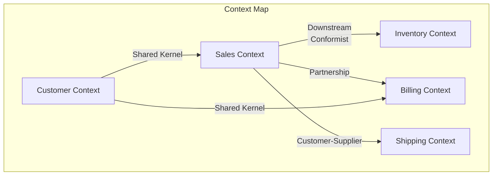

# Strategic Domain-Driven Design

## Table of Contents

- [Overview](#overview)
- [What is Strategic DDD?](#what-is-strategic-ddd)
- [Bounded Contexts](#bounded-contexts)
- [Context Mapping](#context-mapping)
- [Context Map Patterns](#context-map-patterns)
- [Subdomains](#subdomains)
- [Distillation](#distillation)
- [Strategic Design in Practice](#strategic-design-in-practice)
- [Common Pitfalls](#common-pitfalls)
- [References](#references)

## Overview

**Strategic Domain-Driven Design** focuses on the high-level structure of a software system. It provides patterns and practices for decomposing a large domain into manageable parts and defining how those parts interact with each other.

> "Strategic design is about making choices about what's core to the success of the system, identifying the different models at play, and defining how they relate to each other."  
> — Eric Evans

## What is Strategic DDD?

Strategic DDD addresses the **big picture** questions:

- How do we break down a complex domain?
- Where should system boundaries be?
- How do different parts of the system communicate?
- What deserves the most investment?

```
┌─────────────────────────────────────────────────────────────────────┐
│                        Strategic DDD Layers                          │
├─────────────────────────────────────────────────────────────────────┤
│                                                                      │
│   ┌─────────────────────────────────────────────────────────────┐   │
│   │                    Problem Space                             │   │
│   │  ┌─────────────┐  ┌─────────────┐  ┌─────────────┐         │   │
│   │  │    Core     │  │  Supporting │  │   Generic   │         │   │
│   │  │  Subdomain  │  │  Subdomain  │  │  Subdomain  │         │   │
│   │  └─────────────┘  └─────────────┘  └─────────────┘         │   │
│   └─────────────────────────────────────────────────────────────┘   │
│                              │                                       │
│                              ▼                                       │
│   ┌─────────────────────────────────────────────────────────────┐   │
│   │                    Solution Space                            │   │
│   │  ┌─────────────┐  ┌─────────────┐  ┌─────────────┐         │   │
│   │  │  Bounded    │  │  Bounded    │  │  Bounded    │         │   │
│   │  │  Context A  │  │  Context B  │  │  Context C  │         │   │
│   │  └─────────────┘  └─────────────┘  └─────────────┘         │   │
│   └─────────────────────────────────────────────────────────────┘   │
│                                                                      │
└─────────────────────────────────────────────────────────────────────┘
```

## Bounded Contexts

A **Bounded Context** is a central pattern in Strategic DDD. It defines the boundary within which a particular domain model is valid and consistent.

### Key Characteristics

| Aspect | Description |
|--------|-------------|
| **Linguistic Boundary** | Terms have specific, unambiguous meanings |
| **Model Boundary** | The domain model is consistent within the context |
| **Team Boundary** | Often aligns with team ownership |
| **Technical Boundary** | May translate to a service or module |

### Example: E-Commerce Domain

```
┌─────────────────────────────────────────────────────────────────────┐
│                    E-Commerce Bounded Contexts                       │
├─────────────────────────────────────────────────────────────────────┤
│                                                                      │
│  ┌──────────────────┐    ┌──────────────────┐    ┌────────────────┐ │
│  │   Sales Context  │    │ Inventory Context│    │Shipping Context│ │
│  │                  │    │                  │    │                │ │
│  │  • Customer      │    │  • Product       │    │  • Shipment    │ │
│  │  • Order         │    │  • Stock         │    │  • Carrier     │ │
│  │  • Cart          │    │  • Warehouse     │    │  • Tracking    │ │
│  │  • Payment       │    │  • Reservation   │    │  • Address     │ │
│  │                  │    │                  │    │                │ │
│  │  "Product" =     │    │  "Product" =     │    │  "Product" =   │ │
│  │  item for sale   │    │  inventory item  │    │  package       │ │
│  └──────────────────┘    └──────────────────┘    └────────────────┘ │
│                                                                      │
│  Note: "Product" means different things in each context!            │
│                                                                      │
└─────────────────────────────────────────────────────────────────────┘
```

### Benefits of Bounded Contexts

1. **Reduced Complexity** - Each context has a focused, cohesive model
2. **Team Autonomy** - Teams can evolve their context independently
3. **Clear Contracts** - Explicit interfaces between contexts
4. **Technology Freedom** - Each context can use appropriate tech stack

## Context Mapping

**Context Mapping** is the process of identifying and documenting the relationships between bounded contexts.

### Creating a Context Map



## Context Map Patterns

### Relationship Patterns

| Pattern | Description | Use When |
|---------|-------------|----------|
| **Shared Kernel** | Two contexts share a subset of the domain model | Close collaboration, shared ownership |
| **Customer-Supplier** | Upstream context provides what downstream needs | Clear dependency, upstream responsive |
| **Conformist** | Downstream adopts upstream's model as-is | No influence over upstream |
| **Anticorruption Layer (ACL)** | Translation layer protects downstream model | Legacy integration, external systems |
| **Open Host Service** | Upstream provides protocol for many consumers | Multiple downstream contexts |
| **Published Language** | Well-documented shared language | Public APIs, integrations |
| **Partnership** | Two contexts coordinate for mutual success | Interdependent features |
| **Separate Ways** | No integration; duplicate functionality | Cost of integration too high |

### Pattern Diagrams

```
Shared Kernel:
┌─────────────┐     ┌─────────────┐
│  Context A  │     │  Context B  │
│      ┌──────┼─────┼──────┐      │
│      │ Shared     │      │      │
│      │ Kernel     │      │      │
│      └──────┼─────┼──────┘      │
└─────────────┘     └─────────────┘

Customer-Supplier:
┌─────────────┐     ┌─────────────┐
│  Upstream   │     │ Downstream  │
│  (Supplier) │────►│ (Customer)  │
│             │     │             │
│ Provides    │     │ Depends on  │
│ capabilities│     │ upstream    │
└─────────────┘     └─────────────┘

Anticorruption Layer:
┌─────────────┐     ┌─────────────────────────────┐
│   Legacy    │     │      New Context            │
│   System    │────►│  ┌─────┐                    │
│             │     │  │ ACL │ → Domain Model     │
│  Messy      │     │  └─────┘                    │
│  Model      │     │  Translates & Protects     │
└─────────────┘     └─────────────────────────────┘
```

## Subdomains

**Subdomains** represent different areas of the business domain, each with different strategic importance.

### Types of Subdomains

| Type | Description | Investment | Build vs Buy |
|------|-------------|------------|--------------|
| **Core Domain** | Key competitive advantage | High | Build (custom) |
| **Supporting Subdomain** | Necessary but not differentiating | Medium | Build (simpler) |
| **Generic Subdomain** | Common across industries | Low | Buy / Use existing |

### Example: Online Banking

```
┌─────────────────────────────────────────────────────────────────────┐
│                    Online Banking Subdomains                         │
├─────────────────────────────────────────────────────────────────────┤
│                                                                      │
│  ┌─────────────────────────────────────────────────────────────┐    │
│  │                    CORE DOMAIN                               │    │
│  │  • Loan Risk Assessment                                      │    │
│  │  • Investment Portfolio Optimization                         │    │
│  │  • Fraud Detection                                           │    │
│  │  (Competitive advantage - build custom, best developers)     │    │
│  └─────────────────────────────────────────────────────────────┘    │
│                                                                      │
│  ┌─────────────────────────────────────────────────────────────┐    │
│  │                SUPPORTING SUBDOMAIN                          │    │
│  │  • Account Management                                        │    │
│  │  • Transaction Processing                                    │    │
│  │  • Customer Onboarding                                       │    │
│  │  (Important but not unique - simpler implementation)         │    │
│  └─────────────────────────────────────────────────────────────┘    │
│                                                                      │
│  ┌─────────────────────────────────────────────────────────────┐    │
│  │                 GENERIC SUBDOMAIN                            │    │
│  │  • Email Notifications                                       │    │
│  │  • Identity Management                                       │    │
│  │  • Reporting/Analytics                                       │    │
│  │  (Common - buy off-the-shelf or use SaaS)                    │    │
│  └─────────────────────────────────────────────────────────────┘    │
│                                                                      │
└─────────────────────────────────────────────────────────────────────┘
```

## Distillation

**Distillation** is the process of separating the core domain from supporting elements to focus effort where it matters most.

### Distillation Techniques

1. **Core Domain Identification** - What makes the business unique?
2. **Generic Subdomain Extraction** - What can be replaced with off-the-shelf?
3. **Cohesive Mechanisms** - Separate complex algorithms into their own modules
4. **Segregated Core** - Isolate the core from less important parts

### Domain Vision Statement

A brief description that highlights the core domain's value:

```markdown
## Domain Vision Statement: Risk Assessment Platform

The Risk Assessment Platform provides real-time evaluation of loan 
applications using proprietary algorithms that consider 50+ data 
points to accurately predict default probability.

This is our primary competitive advantage - our risk models 
outperform industry standards by 23%, enabling us to approve 
more loans while maintaining lower default rates.

Key differentiators:
- Machine learning models trained on 10 years of loan data
- Real-time integration with alternative data sources
- Dynamic risk scoring that adapts to market conditions
```

## Strategic Design in Practice

### Step-by-Step Process

```
1. Identify Subdomains
   └── Map the business capabilities
   
2. Categorize Subdomains
   └── Core / Supporting / Generic
   
3. Define Bounded Contexts
   └── One or more per subdomain
   
4. Create Context Map
   └── Document relationships
   
5. Choose Integration Patterns
   └── Based on team dynamics and constraints
   
6. Align Teams
   └── Match team structure to bounded contexts
```

### Context Mapping Workshop

| Phase | Duration | Activity |
|-------|----------|----------|
| **1. Big Picture** | 30 min | List all systems/contexts |
| **2. Identify Flows** | 45 min | Map data/event flows between contexts |
| **3. Classify Relationships** | 30 min | Apply context map patterns |
| **4. Identify Pain Points** | 20 min | Mark problematic integrations |
| **5. Design Target State** | 30 min | Plan improvements |

## Common Pitfalls

| Pitfall | Problem | Solution |
|---------|---------|----------|
| **One Model to Rule Them All** | Trying to create a single unified model | Accept multiple models with explicit boundaries |
| **Ignoring Team Dynamics** | Technical design without team consideration | Align contexts with team ownership |
| **Too Many Bounded Contexts** | Over-engineering, too fine-grained | Start coarse, split when needed |
| **No Context Map** | Implicit, undocumented relationships | Make integrations explicit |
| **Core Domain Neglect** | Equal investment across all subdomains | Focus best talent on core domain |
| **Confusing DDD with Microservices** | Assuming DDD requires distributed services | Start with modular monolith, extract services when needed |

> **Real-World Lesson**: See [DDD at Scale Case Study](05-ddd-at-scale-case-study.md) for a $10M example of how misapplying DDD strategic patterns led to costly mistakes, and what to do instead.

## Strategic DDD and Microservices

Bounded Contexts often map well to microservices, **but this is not required**:

```
┌─────────────────────────────────────────────────────────────────────┐
│              Bounded Context → Microservice Mapping                  │
├─────────────────────────────────────────────────────────────────────┤
│                                                                      │
│  ┌─────────────────┐         ┌─────────────────────────────────┐   │
│  │ Bounded Context │  ───►   │ Microservice                    │   │
│  │                 │         │ • Own Database                  │   │
│  │ • Domain Model  │         │ • Own API                       │   │
│  │ • Ubiquitous    │         │ • Own Deployment                │   │
│  │   Language      │         │ • Own Team                      │   │
│  │ • Business Rules│         │                                 │   │
│  └─────────────────┘         └─────────────────────────────────┘   │
│                                                                      │
│  Note: One bounded context may contain multiple services,            │
│        but one service should not span multiple contexts.           │
│                                                                      │
└─────────────────────────────────────────────────────────────────────┘
```

### Important Considerations

**DDD Does Not Mandate Microservices**:
- Strategic DDD defines domain boundaries and contexts
- These can be implemented as modules in a monolith
- Microservices add distribution complexity (network, deployment, debugging)
- Start with a modular monolith, extract services only when evidence demands it

**When to Extract to Microservices**:
- Different scaling requirements per domain
- Team ownership and autonomy needs
- Technology heterogeneity requirements
- Independent deployment necessity
- Clear performance or availability benefits

**Warning**: Jumping to microservices prematurely can increase costs 3-5x. See [DDD at Scale Case Study](05-ddd-at-scale-case-study.md) for real-world evidence.

## References

- **Domain-Driven Design** - Eric Evans (2003)
- **Implementing Domain-Driven Design** - Vaughn Vernon (2013)
- **Domain-Driven Design Distilled** - Vaughn Vernon (2016)
- [Context Mapping](https://www.infoq.com/articles/ddd-contextmapping/) - InfoQ
- [Strategic Domain-Driven Design](https://vaadin.com/blog/ddd-part-2-strategic-domain-driven-design) - Vaadin Blog
- [DDD at Scale Case Study](05-ddd-at-scale-case-study.md) - $10M lessons learned
