# Domain-Driven Design at Scale: A $10M Case Study

## Table of Contents

- [Overview](#overview)
- [The Problem: Spaghetti Architecture](#the-problem-spaghetti-architecture)
- [The DDD Decision](#the-ddd-decision)
- [Implementation Strategies](#implementation-strategies)
- [The FHIR Transformation](#the-fhir-transformation)
- [Where DDD Failed](#where-ddd-failed)
- [Cost Breakdown](#cost-breakdown)
- [Lessons Learned](#lessons-learned)
- [Recommended Approach](#recommended-approach)
- [References](#references)

## Overview

This case study, presented at QCon London 2025 by Leander Vanderbijl, documents a healthcare platform's $10M+ journey implementing Domain-Driven Design at scale. It reveals the hidden costs, critical mistakes, and valuable lessons learned when applying DDD to a rapidly growing system with 340M records and 47 microservices.

> **Key Takeaway**: Domain-Driven Design is a domain modeling methodology, not a deployment strategy. The distinction matters when budgets exceed eight figures.

## The Problem: Spaghetti Architecture

### Initial State

A rapidly scaling healthcare platform faced severe architectural challenges:

**Technical Metrics:**
- 47 interdependent microservices with unclear boundaries
- 8+ second query times for basic patient data during peak hours
- Average of 12 services touched per new feature
- 4-6 month onboarding time for new engineers
- 60% reduction in development velocity

**Business Impact:**
- Medical appointment systems directly coupled to billing
- Patient records scattered across services
- No unified structure or clear domain boundaries
- Crushing technical debt preventing growth

### Domain Structure

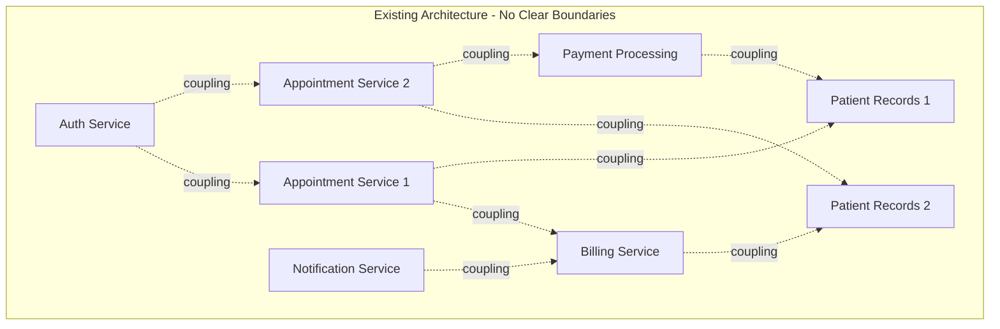

## The DDD Decision

Leadership assembled a small team to implement Domain-Driven Design, identifying three core domains:

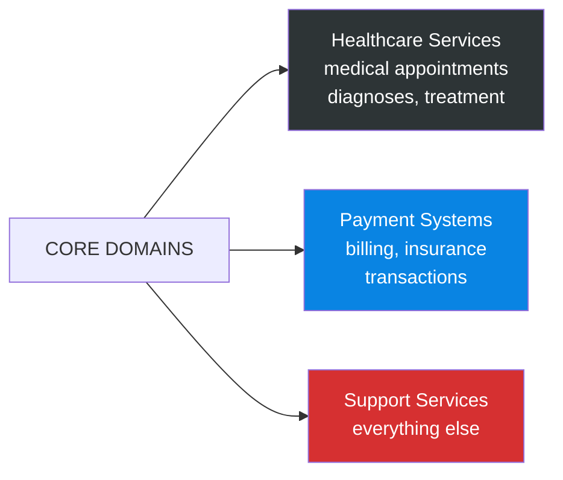

### The Fatal Flaw

**Support Services** became a junk drawer containing 23 different service types:
- User authentication
- PDF generation
- Email notifications
- File storage
- Logging
- And 18 more...

This ambiguous boundary became the most expensive mistake, creating unclear migration paths and constant rework.

## Implementation Strategies

The team developed three refactoring strategies, each with hidden costs:

### 1. The Take That Approach

**Strategy**: Consolidate similar functionalities and lift-and-shift code into new services

**Expected Outcome**: Quick wins by merging duplicate services

**Reality**:
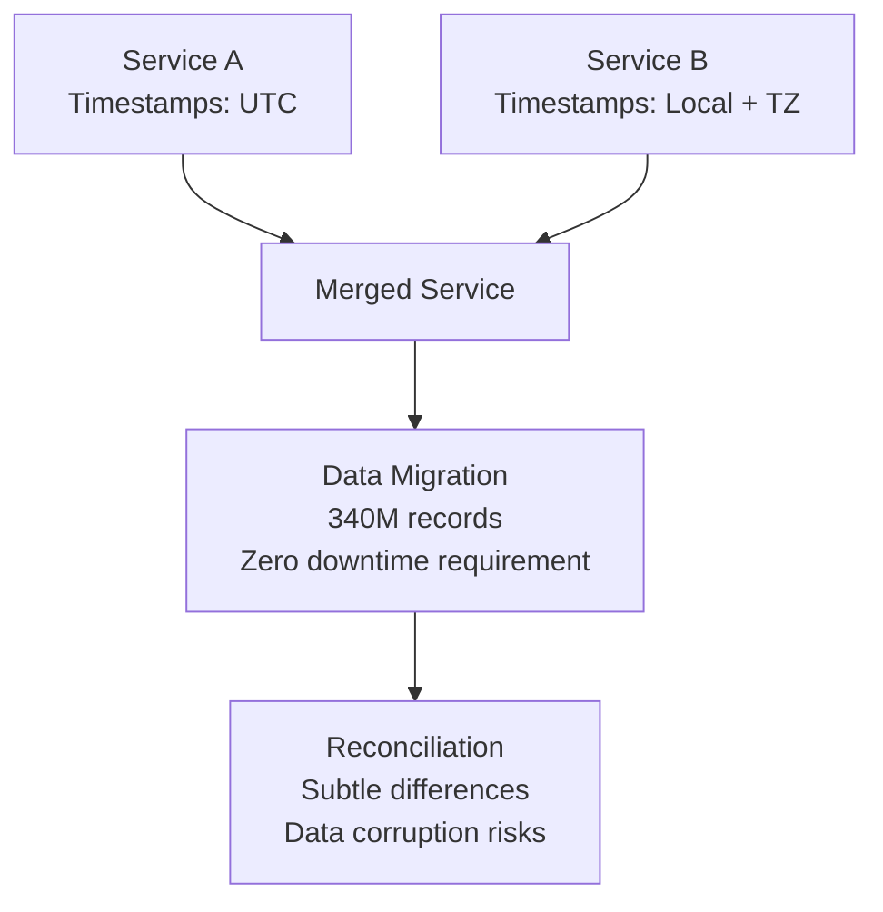

**Challenges Discovered**:
- "Similar" services had subtle data model differences
- One medical records service stored timestamps in UTC
- Another used local time with timezone offsets
- Required migrating 340 million records with zero downtime
- Data reconciliation revealed corruption in 3% of transactions

**Budget Impact**: $2,300,000 in data migration and reconciliation

### 2. The Robbie Williams Strategy

**Strategy**: Identify well-functioning services, keep them, discard the rest

**Expected Outcome**: Clean slate by removing technical debt

**Reality**:
- Determining "well-functioning" required comprehensive testing
- Revealed silent data corruption issues affecting 3% of transactions
- Services thought to be stable had integrity problems
- Removing "bad" services required fixing data issues first
- Created dependency hell when removing coupled services

**Example**: Removing a single authentication middleware function broke 19 services across 4 domains

**Budget Impact**: $3,800,000 in testing, debugging, and data cleanup

### 3. The Prince Approach

**Strategy**: Build new services alongside existing ones, gradually migrate traffic

**Expected Outcome**: Safe, gradual migration with rollback capability

**Reality**:

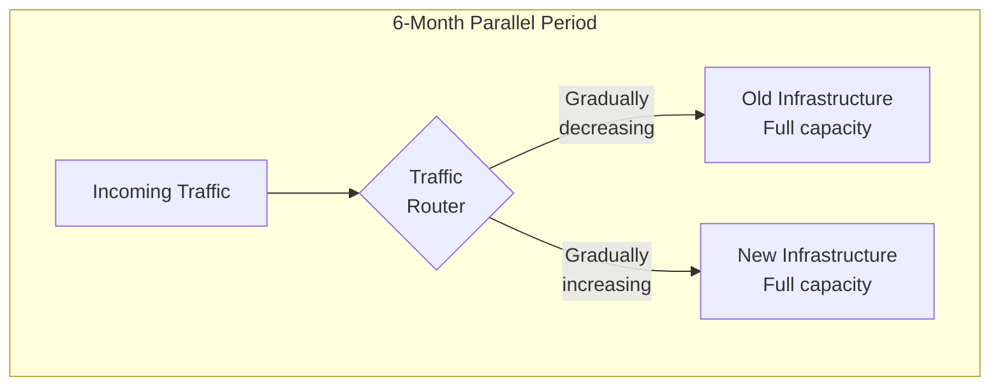

**Challenges**:
- Doubled cloud infrastructure costs for 6 months
- Maintained two codebases simultaneously
- Two sets of monitoring and alerting
- Two deployment pipelines
- Gradual traffic shifting meant prolonged dual operation

**Budget Impact**: $4,100,000 in parallel infrastructure and dual maintenance

## The FHIR Transformation

### The Decision

To structure medical data properly, the team adopted **Fast Healthcare Interoperability Resources (FHIR)**, the industry standard used in 71% of healthcare systems globally in 2025.

### The Promise

- Interoperability with other healthcare systems
- Standardized queries
- Future-proof data models
- Industry best practices

### The Reality

**Data Model Transformation**:

```json
// Before: Custom patient model
{
  "patient_id": "12345",
  "name": "John Doe",
  "dob": "1985-03-15",
  "medical_history": [...] // Nested array
}

// After: FHIR Patient resource
{
  "resourceType": "Patient",
  "id": "12345",
  "name": [{
    "use": "official",
    "family": "Doe",
    "given": ["John"]
  }],
  "birthDate": "1985-03-15"
  // medical_history split into separate Condition resources
  // requiring cross-referencing and complex queries
}
```

### FHIR Implementation Costs

**Transformation Requirements**:
- Custom data models didn't map cleanly to FHIR resources
- Medical history required splitting into separate Condition resources
- Cross-referencing increased query complexity
- 40% increase in average query times initially
- Patient data queries jumped from 8 to 11.2 seconds
- Extensive caching layers required
- Query optimization investments

**Budget Impact**: Included in data model conversion ($1,200,000)

## Where DDD Failed

### 1. The Bounded Context Illusion

**Theory**: Define bounded contexts on a whiteboard, implement clear boundaries

**Reality**: 
- Defining contexts in theory vs. implementing with 340M records are different problems
- Zero downtime requirement multiplied complexity
- Each boundary decision created migration work
- Team consistently underestimated migration effort by **300%**

**Example**: What seemed like a 2-week context split took 6 weeks due to:
- Data migration complexity
- Service coupling discovery
- Integration testing requirements
- Performance regression fixes

### 2. The Extreme Coupling Tax

**Discovery**: Coupling was deeper than imagined

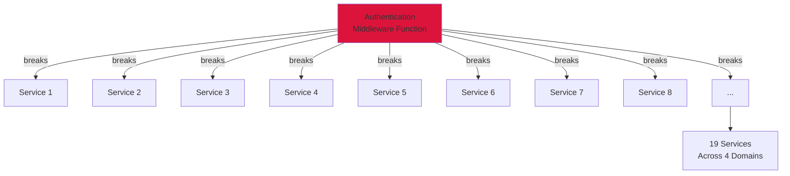

**Reality**: 
- Small changes fanned out catastrophically
- Removing one function broke 19 services across 4 domains
- Coupling was so extreme that "small changes" became mythical
- Every change was big

### 3. The Hidden Performance Cost

**DDD's Push Toward Microservices**:

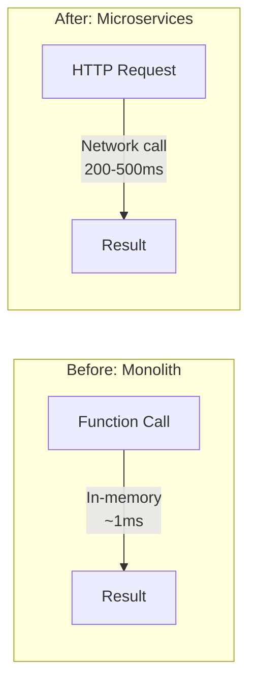

**Impact**:
- In-memory function calls became HTTP requests
- Added 200-500ms latency to critical user workflows
- Under load, latency compounded
- Created timeout cascades that took down entire service groups
- Performance degradation required dedicated optimization team

### 4. The Living Document That Never Lived

**Promise**: Domain model as a living, breathing document that evolves

**Reality**:
- Changing domain boundaries after implementation was prohibitively expensive
- Document became frozen after initial implementation
- The promised flexibility never materialized
- Teams treated boundaries as immutable

## Cost Breakdown

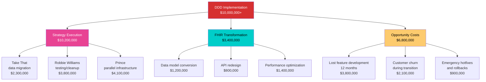

### Detailed Breakdown

**Strategy Execution Costs**: $10,200,000
- Take That (data migration): $2,300,000
- Robbie Williams (testing/cleanup): $3,800,000
- Prince (parallel infrastructure): $4,100,000

**FHIR Transformation**: $3,400,000
- Data model conversion: $1,200,000
- API redesign: $800,000
- Performance optimization: $1,400,000

**Opportunity Costs**: $6,800,000
- Lost feature development (12 months): $3,800,000
- Customer churn during transition: $2,100,000
- Emergency hotfixes and rollbacks: $900,000

**Total Investment**: $10,000,000+

**Timeline**: 18 months to stability

## Lessons Learned

### What Actually Worked

#### 1. Keep the Initial Domain Team Small

**Decision**: Limited domain modeling team to 5 people

**Benefits**:
- Eliminated "what-about-ery"
- Avoided edge case paralysis
- Moved fast with 80% solutions
- Iterated based on feedback
- Expanding the team early would have multiplied decision-making time by 10x

**Key Principle**: Domain modeling is not consensus building. Small teams make better decisions faster.

#### 2. Embrace Imperfect Boundaries

**Breakthrough**: Stopped trying to create perfect bounded contexts

**Reality**:
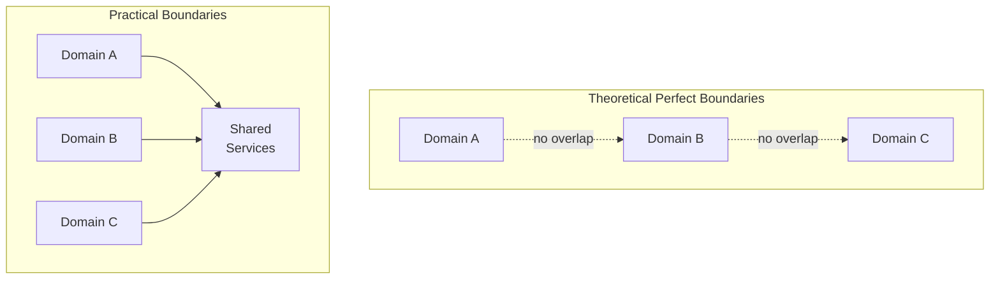

**Actions**:
- Accepted that some services would straddle boundaries
- Prioritized reducing cognitive load over theoretical purity
- Every subdomain split made the next split easier
- Pragmatism over perfection

#### 3. Measure Relentlessly

**Implementation**: Added comprehensive telemetry before making changes

**Metrics Tracked**:
- Coupling depth between services
- Query frequency and patterns
- Performance impact of changes
- Error rates and cascading failures
- Resource utilization

**Outcome**:
- Gut-feel decisions died
- Data-driven decisions survived
- Could predict impact of boundary changes
- Identified optimization priorities objectively

#### 4. Accept the Performance Tax, Then Optimize

**Strategy Shift**:
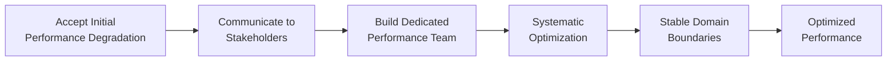

**Key Insights**:
- Stopped fighting initial degradation
- Set stakeholder expectations early
- Built dedicated performance team
- Once boundaries stabilized, optimization became systematic
- Performance improved beyond original baseline

### Final Outcome (18 Months)

**Positive Results**:
- Query times dropped 50% from original baseline
- Development velocity increased 30% above pre-transformation
- Infrastructure costs: $240K/month (higher, but justified by capacity)
- Successfully handling exponential growth
- Clear domain boundaries reduced cognitive load
- Onboarding time reduced to 6-8 weeks

**The Haunting Question**: Could have achieved same outcome in 9 months for $3-4M with better approach

## Recommended Approach

### The Solution They Should Have Implemented

#### 1. Start with a Modular Monolith

**Don't jump straight to microservices**. DDD doesn't require distributed services.

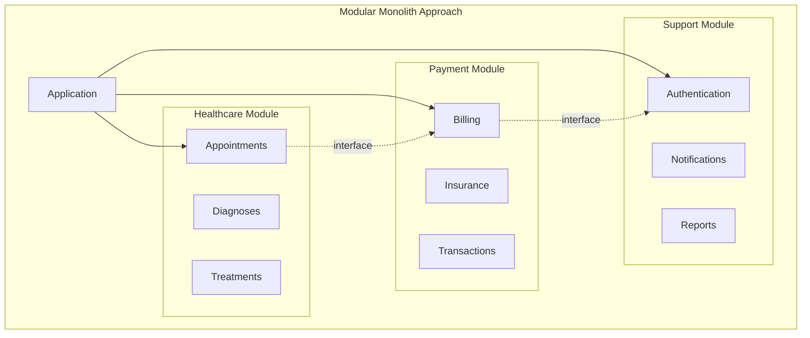

**Benefits**:
- Domain clarity without network tax
- No deployment complexity
- No infrastructure doubling
- Easy to refactor boundaries
- Simple testing and debugging
- Gradual extraction to services when needed

**When to Extract to Services**:
- Different scaling requirements
- Team ownership boundaries
- Technology heterogeneity requirements
- Independent deployment necessity

#### 2. Migrate Data Incrementally by Domain

**Don't try to transform everything at once**


**Strategy**:
- Build adapters that translate between old and new models at runtime
- Migrate one domain's data completely
- Validate and optimize before moving to next
- Reduces risk and allows learning
- Enables rollback at domain level

**Adapter Pattern Example**:
```typescript
class PatientDataAdapter {
  toFHIR(legacyPatient: LegacyPatient): FHIRPatient {
    // Runtime translation
    return {
      resourceType: "Patient",
      id: legacyPatient.patient_id,
      name: [{
        use: "official",
        family: this.extractLastName(legacyPatient.name),
        given: [this.extractFirstName(legacyPatient.name)]
      }],
      birthDate: legacyPatient.dob
    };
  }
  
  fromFHIR(fhirPatient: FHIRPatient): LegacyPatient {
    // Reverse translation for legacy systems
  }
}
```

#### 3. Use the Strangler Fig Pattern

**Build new domain-aligned services alongside old ones**

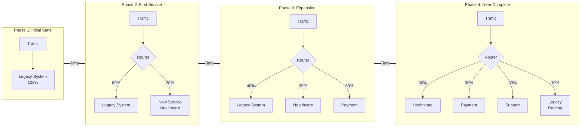

**Benefits**:
- Route new traffic to new services
- Leave old services handling old traffic
- Traffic naturally declines in legacy system
- No parallel infrastructure cost
- No duplicating active load
- Safe rollback path

**Implementation**:
- Feature flags control routing
- Canary releases validate new services
- Gradual percentage-based routing
- Monitor both systems during transition
- Legacy system naturally atrophies

#### 4. Establish Clear Decision Criteria

**Before making architectural changes, answer**:

| Question | Bad Answer | Good Answer |
|----------|------------|-------------|
| Why this boundary? | "It feels right" | "Reduces coupling by 60%, enables independent deployment for Team A" |
| Why now? | "Everyone's doing microservices" | "This module needs independent scaling, current architecture limits growth" |
| What's the cost? | "A few sprints" | "3 months, $200K, 2 engineers, delays Feature X" |
| What's the rollback plan? | "We'll figure it out" | "Feature flag disables new code, adapter maintains compatibility" |
| How will we measure success? | "Cleaner architecture" | "Query time < 2s, deployment time < 10min, team velocity +20%" |

### Cost Comparison

| Approach | Timeline | Cost | Risk Level |
|----------|----------|------|------------|
| **Actual Implementation** (Big Bang Microservices) | 18 months | $10M+ | Very High |
| **Recommended Approach** (Modular Monolith + Strangler Fig) | 9-12 months | $3-4M | Moderate |
| **Savings** | 6-9 months | $6-7M | Risk Reduction: 70% |

## Key Principles for DDD at Scale

### 1. DDD is Domain Modeling, Not Deployment

- Strategic DDD defines bounded contexts and domain boundaries
- Tactical DDD provides implementation patterns
- Neither mandates microservices or distributed systems
- Start with simplest deployment that supports your domain model

### 2. Complexity is Earned, Not Assumed

- Begin with modular monolith
- Extract services when you have evidence of need
- Evidence = scaling issues, team conflicts, or technology constraints
- Not evidence = "everyone else is doing it"

### 3. Perfect is the Enemy of Good Enough

- 80% domain boundaries deliver 95% of the value
- Perfect boundaries are theoretical constructs
- Pragmatic boundaries reduce cognitive load
- Iterate based on real usage patterns

### 4. Measure Everything, Decide with Data

- Instrument before changing
- Establish baseline metrics
- Set success criteria before starting
- Let data guide boundary decisions
- Track costs relentlessly

### 5. Small Teams, Big Impact

- Domain modeling is not consensus building
- 5-7 people maximum for initial design
- Broader input through review, not participation
- Fast decisions beat perfect decisions
- Iterate quickly, learn continuously

## References

### Primary Sources

- **InfoQ QCon London 2025**: "Applying Domain-Driven Design at Scale" - Leander Vanderbijl
- **Original article**: ["Why Domain-Driven Design Failed at Scale"](https://medium.com/@mehdibafdil/why-domain-driven-design-failed-at-scale-2ecd5402a26f) by Mehdi BAFDIL (November 7, 2025)

### Healthcare Standards

- **HL7 FHIR Official Documentation**: [https://hl7.org/fhir/](https://hl7.org/fhir/)
- **The State of FHIR in 2025**: Growing Adoption and Evolving Standards
- **FHIR Healthcare Interoperability Guide 2025**
- **Top Interoperability Standards in 2025**: FHIR, HL7 & Beyond

### DDD Resources

- **Domain-Driven Design** by Eric Evans
- [Strategic DDD](01-strategic-ddd.md) - Internal documentation
- [Tactical DDD](02-tactical-ddd.md) - Internal documentation

### Architecture Patterns

- **Microsoft Azure**: "Using Domain Analysis to Model Microservices"
- **r/softwarearchitecture**: "Does DDD's Strategic Design Force You Into Microservices?"
- **Strangler Fig Pattern**: Martin Fowler's refactoring patterns

### Cost Analysis

- **Scalability and Cost Efficiency in Healthcare**: Leveraging Cloud Services
- **Cost to Build Hospital Management Software**: Pricing Guide

---

## Related Documentation

- [Strategic DDD](01-strategic-ddd.md) - Core concepts and patterns
- [Tactical DDD](02-tactical-ddd.md) - Implementation patterns
- [Ubiquitous Language](03-ubiquitous-language.md) - Communication framework
- [Microservices Architecture](../01-application-architecture-styles/microservices-architecture.md)
- [Modular Monolith Pattern](../01-application-architecture-styles/modular-monolith.md)
