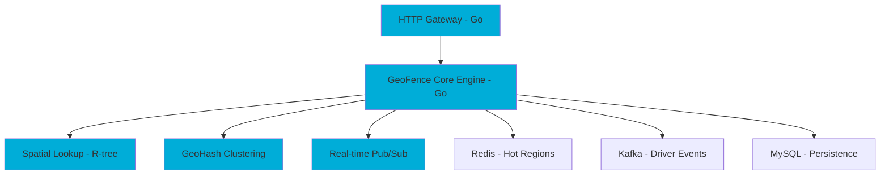

# Uber's Go vs Rust Decision: Organizational Scale Trumps Raw Performance

> **Taxonomy Reference**: §2 Application & Software Architecture  
> **Source**: The OpinionatedDev, July 2025  
> **Timeframe**: 2014-2016 decision, still relevant in 2025

## Overview

This case study examines Uber's decision to standardize on Go (Golang) instead of Rust for their backend microservices infrastructure during their hyper-growth phase (2014-2016). Despite Rust's superior performance characteristics, Uber chose Go based on organizational scalability, team velocity, and operational simplicity.

### Key Quote

> "We needed engineers, not computer science professors."  
> — Former Uber Infrastructure Engineer

## The Context: Uber's Scale Challenge

### The Problem (2014-2016)
- **Growth**: Millions of users, thousands of engineers joining rapidly
- **Architecture**: Microservices scaling from dozens to hundreds of services per year
- **Performance bottleneck**: Python-based services hitting limits for:
  - Geofence processing
  - Real-time routing
  - Trip dispatch and matching
  - Dynamic pricing calculations
- **Constraints**: Too slow, GC-heavy, poor concurrency support

### Requirements
1. **Performance**: Orders of magnitude faster than Python
2. **Concurrency**: Handle millions of concurrent operations
3. **Team velocity**: Onboard 1000+ engineers quickly
4. **Operational simplicity**: Easy debugging at 2 AM during incidents
5. **Ecosystem**: Mature libraries for geo-spatial, networking, databases

## The Decision Matrix: Go vs Rust

| Criteria | Go (Golang) | Rust | Winner |
|----------|-------------|------|--------|
| **Learning curve** | ✅ Easy to learn in 2 weeks | ❌ Steep, especially with lifetimes | **Go** |
| **Compile times** | ✅ Very fast (~1s rebuilds) | ❌ Slower (~3-6s cold build) | **Go** |
| **Concurrency model** | ✅ Goroutines: dead simple | ⚠️ Requires `Pin`, `Future`, `async` | **Go** |
| **Hiring & onboarding** | ✅ Easy to onboard 1000+ engineers | ❌ Much harder to scale across org | **Go** |
| **Ecosystem (2016-2020)** | ✅ Mature and batteries included | ⚠️ Sparse, especially for async + web | **Go** |
| **Runtime memory** | ⚠️ Higher due to GC | ✅ Tiny per-task memory footprint | **Rust** |
| **Raw performance** | ⚠️ Fast enough | ✅ Fastest possible | **Rust** |
| **Memory safety** | ⚠️ Runtime panics possible | ✅ Compile-time guarantees | **Rust** |
| **Development time (MVP)** | ✅ ~3 weeks | ❌ ~7 weeks | **Go** |

### Verdict: Go Won on Organizational Scale

**Go: 7 points** — Team velocity, simplicity, ecosystem maturity  
**Rust: 3 points** — Raw performance, memory efficiency, safety guarantees

## Real-World Architecture: GeoFence Service

### Original Stack (Pre-2016)
- **Languages**: Node.js + Python
- **Problems**: 
  - Slow performance (~120ms per request)
  - Low throughput (~500 QPS)
  - High memory usage (~4MB per task)
  - GC pauses causing latency spikes

### Responsibilities
1. Real-time tracking of driver locations
2. Matching riders to nearby drivers
3. Calculating dynamic pricing regions (surge zones)
4. Spatial lookups using R-tree data structures
5. GeoHash clustering for efficient querying

### Rewritten Architecture in Go



### Go Implementation: Goroutines in Action

```go
func main() {
    updates := make(chan LocationUpdate)
    
    // Spawn worker goroutines
    for i := 0; i < 10; i++ {
        go processUpdates(updates)
    }
    
    // Simulate Kafka message stream
    for msg := range kafkaConsumer() {
        updates <- parseLocation(msg)
    }
}

func processUpdates(ch <-chan LocationUpdate) {
    for update := range ch {
        region := findGeoRegion(update.Lat, update.Lng)
        if region.IsSurging {
            notifyDriver(update.DriverID, region)
        }
    }
}
```

**What Worked:**
- ✅ No need to think about threads, `Pin`, or `unsafe`
- ✅ No lifetime gymnastics
- ✅ Each goroutine handled one driver update in parallel
- ✅ ~2KB memory per goroutine (efficient enough)
- ✅ Simple, readable code that any engineer could understand

### What If This Was Rust?

```rust
async fn main() {
    let (tx, mut rx) = tokio::sync::mpsc::channel(1000);
    
    // Spawn 10 worker tasks
    for _ in 0..10 {
        let mut rx = rx.clone();
        tokio::spawn(async move {
            while let Some(update) = rx.recv().await {
                handle_update(update).await;
            }
        });
    }
    
    // Simulated Kafka stream
    let mut stream = kafka_consumer_stream();
    while let Some(msg) = stream.next().await {
        tx.send(parse_location(msg)).await.unwrap();
    }
}
```

**Rust's Strengths:**
- ✅ Tiny memory per task (~250 bytes vs Go's ~2KB)
- ✅ No GC pauses
- ✅ Better for extreme throughput and tight memory budgets
- ✅ Compile-time safety guarantees

**But Here's What Uber Found in Practice:**
- ❌ **5x longer to write and debug**
- ❌ Lifetimes tripped up even senior developers
- ❌ Ownership didn't play nice with Kafka's shared state handling
- ❌ Hiring Rust experts at scale was near impossible (2017-2020)
- ❌ New team onboarding took months instead of weeks

## Performance Benchmarks: Python vs Go vs Rust

### GeoFence Worker Performance

| Metric | Python | Go | Rust |
|--------|--------|-----|------|
| **Latency per request** | ~120ms | ~25ms | ~18ms |
| **Peak QPS** | ~500 | ~4,000 | ~5,500 |
| **Avg memory/task** | ~4MB | ~2KB | ~250 bytes |
| **Dev time (MVP)** | ~2 weeks | ~3 weeks | ~7 weeks |
| **Team onboarding** | ✅ Easy | ✅ Easy | ❌ Painful |

### Analysis

**Performance Improvement:**
- Go: **20x faster** than Python, **8x better throughput**
- Rust: **6.7x faster** than Python, **11x better throughput**
- **Rust vs Go**: Only **28% faster**, **37% better throughput**

**Development Trade-off:**
- Rust took **2.3x longer** to develop MVP
- Rust required **specialized expertise** (bottleneck in hiring)
- Go's "good enough" performance solved the problem

**Key Insight:**  
The 28% performance gain from Rust didn't justify the 2.3x development slowdown and organizational friction.

## The Emotional Cost: What Rust Got Wrong (for Uber)

> "You can't run a Rust bootcamp every time a new team joins Infra."

### What Uber Was Optimizing For

**Not the fastest binary.** They were optimizing for:

1. **Team velocity**: Ship UberPool, UberEats, dynamic pricing features **fast**
2. **On-call simplicity**: Debug at 2 AM without fighting the borrow checker
3. **Ease of debugging**: Stack traces, panic messages, straightforward mental model
4. **Org-wide consistency**: 1000+ engineers writing similar-looking code
5. **Hiring scalability**: Recruit from a larger talent pool

### The Real-World Pain Points with Rust

```rust
// This simple pattern in Go...
func processDrivers(drivers []Driver) {
    for _, driver := range drivers {
        if driver.IsOnline {
            notifyRider(driver)
        }
    }
}

// ...becomes a lifetime puzzle in Rust
fn process_drivers<'a>(drivers: &'a [Driver]) {
    for driver in drivers.iter() {
        if driver.is_online {
            notify_rider(driver);  // ← Lifetime issues if async
        }
    }
}
```

**Common Friction Points:**
- Lifetime annotations confusing mid-level engineers
- Borrowing conflicts in async contexts
- `Pin`, `Unpin`, and `unsafe` required for advanced patterns
- Debugging async stack traces was nightmarish (in 2017-2020)

## Decision Framework: When to Choose Go vs Rust

### Choose Go When:
✅ **Team velocity is critical**  
✅ **You're hiring at scale** (100+ engineers/year)  
✅ **Simplicity > peak performance**  
✅ **You need fast iteration cycles**  
✅ **On-call operational simplicity matters**  
✅ **Your performance bottleneck is I/O-bound** (networks, databases)  
✅ **You need mature ecosystem** (web frameworks, ORMs, cloud SDKs)

### Choose Rust When:
✅ **Memory footprint is critical** (embedded systems, edge devices)  
✅ **Zero-GC latency guarantees required** (real-time systems, HFT)  
✅ **Maximum throughput needed** (extreme scale, high-frequency data pipelines)  
✅ **Memory safety is non-negotiable** (systems programming, OS kernels)  
✅ **Team is small and specialized** (<50 engineers, deep expertise)  
✅ **Long-running processes** where GC pauses are unacceptable  
✅ **You have time for proper training** (6-12 months ramp-up acceptable)

### The Middle Ground

**Uber's Strategy in 2025:**
- **Backbone: Go** for 90% of microservices
- **Specialized: Rust** for:
  - Encryption libraries
  - Low-latency video processing
  - High-performance SDKs
  - Edge computing workloads

This hybrid approach lets them optimize where it matters without sacrificing team velocity.

## Key Lessons Learned

### 1. "Good Enough" Often Beats "Perfect"

Go's 25ms latency vs Rust's 18ms didn't matter when the previous Python system was at 120ms. **The 80% solution that ships fast beats the 100% solution that ships late.**

### 2. Technical Excellence ≠ Organizational Excellence

Rust is objectively more powerful, but:
- It requires specialized talent (hiring bottleneck)
- It slows down feature development (business risk)
- It complicates on-call rotations (operational cost)

**Architecture is about trade-offs, not absolutes.**

### 3. Language Choice is an Organizational Decision

The language you choose must work for:
- Your **current team's** skill level
- Your **hiring pipeline** (talent availability)
- Your **business timeline** (MVP deadlines)
- Your **operational maturity** (on-call complexity)

### 4. Ergonomics Scale Better Than Performance

At Uber's scale:
- **Simple code** = more engineers can contribute
- **Fast compile times** = faster iteration cycles
- **Easy debugging** = faster incident resolution
- **Gentle learning curve** = faster onboarding

### 5. The Ferrari vs Toyota Camry Analogy

> Rust is the Ferrari.  
> Go is the Toyota Camry that never breaks down and anyone can drive.  
> 
> At Uber's scale? **You need fleets of Camrys.**

## Modern Context (2025)

### Has Anything Changed?

**Rust has improved:**
- ✅ Better async ecosystem (Tokio is mature)
- ✅ Improved error messages and diagnostics
- ✅ More learning resources available
- ✅ Growing talent pool

**But the fundamentals remain:**
- ⚠️ Still has a steep learning curve
- ⚠️ Still takes longer to develop in
- ⚠️ Still harder to hire for at scale
- ⚠️ Still more complex for on-call debugging

### Current State at Uber (2025)

**Go remains the backbone:**
- Thousands of Go microservices in production
- Standard language for new backend services
- Easy onboarding for new engineers

**Rust introduced selectively:**
- Encryption and security libraries
- Low-latency video processing
- Mobile SDKs (performance-critical)
- Edge computing workloads

**The hybrid approach works:**
- 90% Go (team velocity + good performance)
- 10% Rust (where performance is critical)

## Actionable Takeaways

### For Architects

1. **Measure what matters**: Don't optimize for benchmarks; optimize for business outcomes
2. **Consider the full cost**: Development time + hiring + operational complexity
3. **Start with constraints**: Team size, hiring market, timeline
4. **Design for change**: Make it easy to rewrite hot paths later in Rust if needed

### For Engineering Leaders

1. **Team velocity > raw performance** (in most cases)
2. **Hiring is an architectural constraint** (not a soft factor)
3. **Operational simplicity reduces incident costs**
4. **Language standardization reduces cognitive overhead**

### For Developers

1. **Don't chase the newest, shiniest tool** — chase the right tool for context
2. **Boring technology often wins** at scale
3. **Team consensus and buy-in** matter more than individual preferences
4. **Master the fundamentals** (algorithms, data structures, system design) — they transfer across languages

## Related Documentation

- [Backend Architecture Styles](../02-backend-architecture/backend-architecture-styles.md)
- [Microservices Architecture](../../03-integration-communication-architecture/microservices/)
- [Performance Optimization](../../07-reliability-performance-operations/performance/)
- [Enterprise & Strategic Architecture](../../01-enterprise-strategic-architecture/)

## References

- **Original Article**: "Inside Uber's Golang Bet: Why They Didn't Pick Rust" - TheOpinionatedDev (July 2025)
- **Go Official Documentation**: https://go.dev/doc/
- **Rust Official Documentation**: https://www.rust-lang.org/
- **Uber Engineering Blog**: https://eng.uber.com/

---

**Last Updated**: January 2026  
**Status**: ✅ Active case study, principles still relevant
