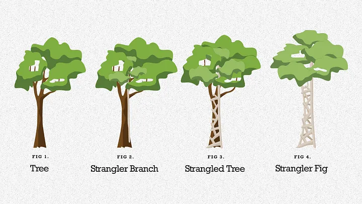

# Strangler Fig Pattern

## Table of Contents

- [Overview](#overview)
- [The Metaphor](#the-metaphor)
- [How It Works](#how-it-works)
- [Implementation Strategies](#implementation-strategies)
- [Step-by-Step Migration](#step-by-step-migration)
- [Routing Mechanisms](#routing-mechanisms)
- [Anti-Corruption Layer (ACL)](#anti-corruption-layer-acl)
- [Code Examples](#code-examples)
- [Challenges and Solutions](#challenges-and-solutions)
- [Best Practices](#best-practices)
- [When to Use](#when-to-use)

---

## Overview

The **Strangler Fig Pattern** (also called Strangler Application Pattern) is an incremental migration strategy for gradually replacing a legacy system with a new system. Named after the strangler fig tree that grows around and eventually replaces its host tree.

### Key Principles

```
┌─────────────────────────────────────────────────────────────────────────────┐
│                    STRANGLER FIG PRINCIPLES                                 │
├─────────────────────────────────────────────────────────────────────────────┤
│                                                                             │
│  1. INCREMENTAL MIGRATION                                                   │
│     Migrate piece by piece, not all at once (Big Bang)                     │
│                                                                             │
│  2. COEXISTENCE                                                             │
│     Old and new systems run side by side                                    │
│                                                                             │
│  3. GRADUAL TRAFFIC SHIFT                                                   │
│     Progressively route traffic to new system                               │
│                                                                             │
│  4. REVERSIBLE                                                              │
│     Can roll back to legacy if issues arise                                 │
│                                                                             │
│  5. CONTINUOUS DELIVERY                                                     │
│     Deploy frequently, reduce risk                                          │
│                                                                             │
└─────────────────────────────────────────────────────────────────────────────┘
```

---

## The Metaphor

The pattern is named after the strangler fig tree found in tropical rainforests.

```
┌─────────────────────────────────────────────────────────────────────────────┐
│                    THE STRANGLER FIG TREE                                   │
├─────────────────────────────────────────────────────────────────────────────┤
│                                                                             │
│   Stage 1: Seed                Stage 2: Growth              Stage 3: Replace│
│   ───────────────              ──────────────              ────────────────│
│                                                                             │
│       ┌─────┐                    ┌──┬──┐                     ╔═════╗       │
│       │     │                    │▓▓│  │                     ║     ║       │
│       │ OLD │                    │▓▓│  │                     ║ NEW ║       │
│       │TREE │                    │▓▓│  │                     ║TREE ║       │
│       │     │                    │▓▓│  │                     ║     ║       │
│       │     │                    │▓▓│  │                     ║     ║       │
│       └──┬──┘                    └──┴──┘                     ╚══╤══╝       │
│          │                          │                           │          │
│                                                                             │
│   Fig seed lands           Fig grows around              Old tree dies,    │
│   on host tree             host tree                     fig remains       │
│                                                                             │
│   = Legacy system          = New services                = New system      │
│     exists                   wrap legacy                   replaces legacy │
│                                                                             │
└─────────────────────────────────────────────────────────────────────────────┘
```



---

## How It Works

### Migration Flow

```
┌─────────────────────────────────────────────────────────────────────────────┐
│                    STRANGLER FIG MIGRATION FLOW                             │
└─────────────────────────────────────────────────────────────────────────────┘

PHASE 1: Initial State
──────────────────────
                    ┌──────────────────────────────────┐
    Users ─────────►│         Legacy Monolith          │
                    │  ┌────────────────────────────┐  │
                    │  │ Feature A │ Feature B │ C  │  │
                    │  └────────────────────────────┘  │
                    └──────────────────────────────────┘


PHASE 2: Add Facade/Proxy
─────────────────────────
                    ┌─────────────┐
    Users ─────────►│   Facade    │
                    │   (Proxy)   │
                    └──────┬──────┘
                           │
                           ▼
                    ┌──────────────────────────────────┐
                    │         Legacy Monolith          │
                    └──────────────────────────────────┘


PHASE 3: Extract First Service
──────────────────────────────
                    ┌─────────────┐
    Users ─────────►│   Facade    │
                    └──────┬──────┘
                           │
              ┌────────────┴────────────┐
              │                         │
              ▼                         ▼
    ┌──────────────────┐    ┌──────────────────────────┐
    │   New Service    │    │     Legacy Monolith      │
    │   (Feature A)    │    │  ┌──────────────────┐   │
    └──────────────────┘    │  │ Feature B │  C   │   │
                            │  └──────────────────┘   │
                            └──────────────────────────┘


PHASE 4: Continue Extraction
────────────────────────────
                    ┌─────────────┐
    Users ─────────►│   Facade    │
                    └──────┬──────┘
                           │
         ┌─────────────────┼─────────────────┐
         │                 │                 │
         ▼                 ▼                 ▼
    ┌─────────┐      ┌─────────┐      ┌───────────────┐
    │Service A│      │Service B│      │Legacy (only C)│
    └─────────┘      └─────────┘      └───────────────┘


PHASE 5: Complete Migration
───────────────────────────
                    ┌─────────────┐
    Users ─────────►│ API Gateway │
                    └──────┬──────┘
                           │
         ┌─────────────────┼─────────────────┐
         │                 │                 │
         ▼                 ▼                 ▼
    ┌─────────┐      ┌─────────┐      ┌─────────┐
    │Service A│      │Service B│      │Service C│
    └─────────┘      └─────────┘      └─────────┘

    Legacy Monolith: DECOMMISSIONED ✓
```

---

## Implementation Strategies

### Strategy 1: Feature-by-Feature Migration

Extract one feature/module at a time.

```
┌─────────────────────────────────────────────────────────────────────────────┐
│                    FEATURE-BY-FEATURE                                       │
├─────────────────────────────────────────────────────────────────────────────┤
│                                                                             │
│  Monolith: [User Mgmt] [Orders] [Inventory] [Payments] [Reports]           │
│                                                                             │
│  Migration Order (by business value & coupling):                           │
│                                                                             │
│  Sprint 1-2:  Extract [Reports]     → Low risk, read-only                  │
│  Sprint 3-5:  Extract [User Mgmt]   → Clear boundaries                     │
│  Sprint 6-9:  Extract [Inventory]   → Medium complexity                    │
│  Sprint 10-14: Extract [Orders]     → Core, high complexity                │
│  Sprint 15-18: Extract [Payments]   → Critical, last due to risk           │
│                                                                             │
└─────────────────────────────────────────────────────────────────────────────┘
```

### Strategy 2: Layer-by-Layer Migration

Migrate horizontal layers (UI, API, Business Logic, Data).

```
┌─────────────────────────────────────────────────────────────────────────────┐
│                    LAYER-BY-LAYER                                           │
├─────────────────────────────────────────────────────────────────────────────┤
│                                                                             │
│  Step 1: New UI → Legacy Backend                                           │
│          ┌─────────────────┐                                               │
│          │    New UI       │                                               │
│          │   (React/Vue)   │                                               │
│          └────────┬────────┘                                               │
│                   │                                                        │
│          ┌────────▼────────┐                                               │
│          │  Legacy Backend │                                               │
│          │  + Legacy UI    │                                               │
│          └─────────────────┘                                               │
│                                                                             │
│  Step 2: New UI → New API → Legacy Backend                                 │
│          ┌─────────────────┐                                               │
│          │    New UI       │                                               │
│          └────────┬────────┘                                               │
│                   │                                                        │
│          ┌────────▼────────┐                                               │
│          │    New API      │                                               │
│          │   (Facade)      │                                               │
│          └────────┬────────┘                                               │
│                   │                                                        │
│          ┌────────▼────────┐                                               │
│          │  Legacy Backend │                                               │
│          └─────────────────┘                                               │
│                                                                             │
│  Step 3: Complete new stack                                                │
│          ┌─────────────────┐                                               │
│          │    New UI       │                                               │
│          └────────┬────────┘                                               │
│                   │                                                        │
│          ┌────────▼────────┐                                               │
│          │    New API      │                                               │
│          └────────┬────────┘                                               │
│                   │                                                        │
│          ┌────────▼────────┐                                               │
│          │  New Services   │                                               │
│          └────────┬────────┘                                               │
│                   │                                                        │
│          ┌────────▼────────┐                                               │
│          │   New Database  │                                               │
│          └─────────────────┘                                               │
│                                                                             │
└─────────────────────────────────────────────────────────────────────────────┘
```

### Strategy 3: Domain-Driven Migration

Use DDD bounded contexts to identify extraction boundaries.

```
┌─────────────────────────────────────────────────────────────────────────────┐
│                    BOUNDED CONTEXT EXTRACTION                               │
├─────────────────────────────────────────────────────────────────────────────┤
│                                                                             │
│  1. Identify Bounded Contexts in Legacy:                                    │
│                                                                             │
│     ┌─────────────────────────────────────────────────────────────────┐    │
│     │                      Legacy Monolith                            │    │
│     │  ┌───────────┐ ┌───────────┐ ┌───────────┐ ┌───────────┐       │    │
│     │  │  Sales    │ │ Inventory │ │ Shipping  │ │  Billing  │       │    │
│     │  │  Context  │ │  Context  │ │  Context  │ │  Context  │       │    │
│     │  └───────────┘ └───────────┘ └───────────┘ └───────────┘       │    │
│     └─────────────────────────────────────────────────────────────────┘    │
│                                                                             │
│  2. Extract Each Context as a Service:                                      │
│                                                                             │
│     ┌─────────────┐                                                        │
│     │ API Gateway │                                                        │
│     └──────┬──────┘                                                        │
│            │                                                               │
│     ┌──────┴──────┬───────────────┬───────────────┐                        │
│     ▼             ▼               ▼               ▼                        │
│  ┌───────┐   ┌─────────┐   ┌──────────┐   ┌──────────────────┐            │
│  │ Sales │   │Inventory│   │ Shipping │   │  Legacy          │            │
│  │Service│   │ Service │   │ Service  │   │  (Billing only)  │            │
│  └───────┘   └─────────┘   └──────────┘   └──────────────────┘            │
│                                                                             │
└─────────────────────────────────────────────────────────────────────────────┘
```

---

## Step-by-Step Migration

### Step 1: Add a Facade/Proxy

```
┌─────────────────────────────────────────────────────────────────────────────┐
│                    STEP 1: ADD FACADE                                       │
├─────────────────────────────────────────────────────────────────────────────┤
│                                                                             │
│  Before:                           After:                                   │
│                                                                             │
│  Users ──► Legacy                  Users ──► Facade ──► Legacy             │
│                                                                             │
│  Implementation Options:                                                    │
│                                                                             │
│  • API Gateway (Kong, NGINX, Azure API Management)                         │
│  • Reverse Proxy                                                            │
│  • Custom Routing Service                                                   │
│  • Service Mesh (Istio)                                                     │
│                                                                             │
│  Key: No behavior change - just pass-through initially                     │
│                                                                             │
└─────────────────────────────────────────────────────────────────────────────┘
```

### Step 2: Identify Extraction Candidates

```
┌─────────────────────────────────────────────────────────────────────────────┐
│                    EXTRACTION CRITERIA                                      │
├─────────────────────────────────────────────────────────────────────────────┤
│                                                                             │
│  Evaluate each module/feature:                                              │
│                                                                             │
│  ┌─────────────────────────────────────────────────────────────────────┐   │
│  │  Factor               │ Good Candidate │ Poor Candidate            │   │
│  ├───────────────────────┼────────────────┼───────────────────────────┤   │
│  │  Coupling             │ Low            │ High                      │   │
│  │  Business Value       │ High           │ Low                       │   │
│  │  Change Frequency     │ High           │ Low (stable)              │   │
│  │  Team Ownership       │ Clear          │ Shared across teams       │   │
│  │  Data Isolation       │ Own database   │ Shared tables             │   │
│  │  Dependencies         │ Few            │ Many                      │   │
│  │  Risk                 │ Lower          │ Critical path             │   │
│  └─────────────────────────────────────────────────────────────────────┘   │
│                                                                             │
│  Start with: Low risk + Clear boundaries + High value                      │
│                                                                             │
└─────────────────────────────────────────────────────────────────────────────┘
```

### Step 3: Create Anti-Corruption Layer

```
┌─────────────────────────────────────────────────────────────────────────────┐
│                    ANTI-CORRUPTION LAYER (ACL)                              │
├─────────────────────────────────────────────────────────────────────────────┤
│                                                                             │
│  Purpose: Prevent legacy concepts from leaking into new services           │
│                                                                             │
│  ┌─────────────────────────────────────────────────────────────────────┐   │
│  │                                                                     │   │
│  │     New Service                      Legacy System                  │   │
│  │  ┌──────────────────┐             ┌──────────────────┐             │   │
│  │  │  Clean Domain    │             │  Legacy Domain   │             │   │
│  │  │  Model           │◄────ACL────►│  Model           │             │   │
│  │  │                  │  (Adapter)  │                  │             │   │
│  │  │  • Order         │             │  • ORDER_TBL     │             │   │
│  │  │  • Customer      │  Translates │  • CUST_MASTER   │             │   │
│  │  │  • Product       │             │  • PROD_FILE     │             │   │
│  │  └──────────────────┘             └──────────────────┘             │   │
│  │                                                                     │   │
│  └─────────────────────────────────────────────────────────────────────┘   │
│                                                                             │
└─────────────────────────────────────────────────────────────────────────────┘
```

### Step 4: Implement New Service

```
┌─────────────────────────────────────────────────────────────────────────────┐
│                    NEW SERVICE IMPLEMENTATION                               │
├─────────────────────────────────────────────────────────────────────────────┤
│                                                                             │
│  1. Build new service with clean architecture                               │
│  2. Implement same API contract as legacy (initially)                       │
│  3. Point to own database (may need data sync initially)                   │
│  4. Deploy alongside legacy                                                 │
│  5. Test thoroughly                                                         │
│                                                                             │
│                 ┌──────────────────────────────────────┐                   │
│                 │           API Gateway                │                   │
│                 └─────────────────┬────────────────────┘                   │
│                                   │                                        │
│              ┌────────────────────┴────────────────────┐                   │
│              │                                         │                   │
│              ▼                                         ▼                   │
│  ┌──────────────────────┐              ┌──────────────────────────┐       │
│  │   NEW Service A      │              │     Legacy Monolith      │       │
│  │   ┌──────────────┐   │              │   (Feature A disabled)   │       │
│  │   │  Feature A   │   │              │   ┌──────────────────┐   │       │
│  │   └──────────────┘   │              │   │B │ C │ D │ E     │   │       │
│  │   ┌──────────────┐   │              │   └──────────────────┘   │       │
│  │   │  Own DB      │   │              │   ┌──────────────────┐   │       │
│  │   └──────────────┘   │              │   │   Legacy DB      │   │       │
│  └──────────────────────┘              │   └──────────────────┘   │       │
│                                        └──────────────────────────┘       │
│                                                                             │
└─────────────────────────────────────────────────────────────────────────────┘
```

### Step 5: Migrate Traffic

```
┌─────────────────────────────────────────────────────────────────────────────┐
│                    TRAFFIC MIGRATION STRATEGIES                             │
├─────────────────────────────────────────────────────────────────────────────┤
│                                                                             │
│  Option A: Feature Flag (Instant Switch)                                    │
│  ───────────────────────────────────────                                   │
│  if (featureFlag.isEnabled("new-orders-service"))                          │
│      route to new service                                                   │
│  else                                                                       │
│      route to legacy                                                        │
│                                                                             │
│  Option B: Canary Release (Gradual %)                                       │
│  ────────────────────────────────────                                       │
│  Day 1:   5% → New Service,  95% → Legacy                                  │
│  Day 3:  25% → New Service,  75% → Legacy                                  │
│  Day 5:  50% → New Service,  50% → Legacy                                  │
│  Day 7: 100% → New Service,   0% → Legacy                                  │
│                                                                             │
│  Option C: User Segment                                                     │
│  ─────────────────────                                                     │
│  Internal users     → New Service (test first)                             │
│  Beta customers     → New Service                                          │
│  All customers      → New Service (after validation)                       │
│                                                                             │
│  Option D: Geographic                                                       │
│  ────────────────────                                                       │
│  Region A           → New Service                                          │
│  Region B           → Legacy (migrate later)                               │
│                                                                             │
└─────────────────────────────────────────────────────────────────────────────┘
```

### Step 6: Decommission Legacy

```
┌─────────────────────────────────────────────────────────────────────────────┐
│                    DECOMMISSIONING CHECKLIST                                │
├─────────────────────────────────────────────────────────────────────────────┤
│                                                                             │
│  □ All traffic migrated to new services                                    │
│  □ No requests hitting legacy for X days                                   │
│  □ Data migrated and validated                                             │
│  □ Legacy data backed up                                                    │
│  □ Dependent systems updated                                               │
│  □ Documentation updated                                                    │
│  □ Team trained on new system                                              │
│  □ Monitoring/alerts reconfigured                                          │
│  □ Rollback plan ready (just in case)                                      │
│  □ Stakeholder sign-off                                                     │
│                                                                             │
│  Then:                                                                      │
│  1. Keep legacy running but idle (safety net)                              │
│  2. After confidence period, shut down legacy                               │
│  3. Decommission legacy infrastructure                                      │
│  4. Celebrate! 🎉                                                           │
│                                                                             │
└─────────────────────────────────────────────────────────────────────────────┘
```

---

## Routing Mechanisms

### API Gateway Routing

```
┌─────────────────────────────────────────────────────────────────────────────┐
│                    API GATEWAY ROUTING                                      │
├─────────────────────────────────────────────────────────────────────────────┤
│                                                                             │
│  Route by Path:                                                             │
│  ──────────────                                                            │
│  /api/orders/*     → Orders Service (new)                                  │
│  /api/users/*      → Users Service (new)                                   │
│  /api/*            → Legacy Monolith (everything else)                     │
│                                                                             │
│  Route by Header:                                                           │
│  ────────────────                                                          │
│  X-Use-New-Service: true  → New Service                                    │
│  default                  → Legacy                                         │
│                                                                             │
│  Route by Weight (Canary):                                                  │
│  ─────────────────────────                                                 │
│  /api/orders:                                                              │
│    - weight: 90  → Legacy                                                  │
│    - weight: 10  → New Service                                             │
│                                                                             │
└─────────────────────────────────────────────────────────────────────────────┘
```

### NGINX Example

```nginx
upstream legacy {
    server legacy-monolith:8080;
}

upstream orders_service {
    server orders-service:8080;
}

upstream users_service {
    server users-service:8080;
}

server {
    listen 80;

    # New services
    location /api/orders {
        proxy_pass http://orders_service;
    }

    location /api/users {
        proxy_pass http://users_service;
    }

    # Everything else goes to legacy
    location / {
        proxy_pass http://legacy;
    }
}
```

### Azure API Management Policy

```xml
<policies>
    <inbound>
        <choose>
            <when condition="@(context.Request.Headers
                .GetValueOrDefault("X-Use-New-Service","") == "true")">
                <set-backend-service base-url="https://new-orders-service.azurewebsites.net" />
            </when>
            <otherwise>
                <set-backend-service base-url="https://legacy-monolith.azurewebsites.net" />
            </otherwise>
        </choose>
    </inbound>
</policies>
```

---

## Anti-Corruption Layer (ACL)

### Definition

The **Anti-Corruption Layer (ACL)** is a design pattern that acts as a protective boundary between different systems or bounded contexts, translating and adapting communication to prevent one system's domain model from "corrupting" another.

```
┌─────────────────────────────────────────────────────────────────────────────┐
│                    ANTI-CORRUPTION LAYER DEFINITION                         │
├─────────────────────────────────────────────────────────────────────────────┤
│                                                                             │
│  "A layer that isolates a client's model from another system's model       │
│   by translating between them."                                            │
│                                                           - Eric Evans, DDD │
│                                                                             │
│  Purpose: Prevent legacy concepts, data structures, and terminology        │
│           from leaking into and polluting new, clean domain models         │
│                                                                             │
└─────────────────────────────────────────────────────────────────────────────┘
```

### Why It's Essential in Strangler Fig

When migrating from legacy to new systems, the ACL ensures:

1. **Clean Domain Model**: New services use modern, well-designed domain concepts
2. **Legacy Isolation**: Old data structures and naming conventions stay contained
3. **Independent Evolution**: New services can evolve without legacy constraints
4. **Reduced Technical Debt**: Prevents carrying legacy baggage into new code

### ACL Components

```
┌─────────────────────────────────────────────────────────────────────────────┐
│                    ACL ARCHITECTURE                                         │
├─────────────────────────────────────────────────────────────────────────────┤
│                                                                             │
│  ┌─────────────────────────────────────────────────────────────────────┐   │
│  │                    Anti-Corruption Layer                            │   │
│  │  ┌─────────────┐  ┌─────────────┐  ┌─────────────┐                 │   │
│  │  │  Facade     │  │ Adapter     │  │ Translator  │                 │   │
│  │  │             │  │             │  │             │                 │   │
│  │  │ Simplified  │  │ Interface   │  │ Data/Model  │                 │   │
│  │  │ Interface   │  │ Conversion  │  │ Mapping     │                 │   │
│  │  └─────────────┘  └─────────────┘  └─────────────┘                 │   │
│  └─────────────────────────────────────────────────────────────────────┘   │
│                                                                             │
│  Components:                                                                │
│                                                                             │
│  • FACADE: Provides a simplified, clean interface to the legacy system     │
│  • ADAPTER: Converts between incompatible interfaces                       │
│  • TRANSLATOR: Maps data and domain objects between models                 │
│  • GATEWAY: Handles communication protocols and error handling             │
│                                                                             │
└─────────────────────────────────────────────────────────────────────────────┘
```

### ACL in Practice

```
┌─────────────────────────────────────────────────────────────────────────────┐
│                    TRANSLATION EXAMPLE                                      │
├─────────────────────────────────────────────────────────────────────────────┤
│                                                                             │
│  Legacy System (Corrupted Model)      New Service (Clean Model)            │
│  ─────────────────────────────        ─────────────────────────            │
│                                                                             │
│  Table: ORDER_TBL                     Entity: Order                         │
│  • ORDER_ID (VARCHAR)          ──►    • Id (Guid)                          │
│  • CUST_NUM (VARCHAR)          ──►    • CustomerId (Guid)                  │
│  • ORDER_STAT (CHAR)           ──►    • Status (OrderStatus enum)          │
│  • TOTAL_AMT_CENTS (INT)       ──►    • TotalAmount (Money value object)   │
│  • CREATE_DT (VARCHAR)         ──►    • CreatedAt (DateTimeOffset)         │
│  • SHIP_ADDR1, SHIP_CITY...    ──►    • ShippingAddress (Address object)   │
│                                                                             │
│  Legacy Status Codes:                 Clean Status Enum:                   │
│  'N' = New                     ──►    OrderStatus.New                      │
│  'P' = Processing              ──►    OrderStatus.Processing               │
│  'S' = Shipped                 ──►    OrderStatus.Shipped                  │
│  'C', 'X' = Cancelled          ──►    OrderStatus.Cancelled                │
│                                                                             │
└─────────────────────────────────────────────────────────────────────────────┘
```

### When to Use ACL

| Scenario | Use ACL? | Reason |
|----------|----------|--------|
| Integrating with legacy system | ✅ Yes | Protect new code from legacy concepts |
| Calling external third-party API | ✅ Yes | Isolate from external model changes |
| Communicating between bounded contexts | ✅ Yes | Maintain context autonomy |
| Internal service-to-service (same context) | ❌ No | Unnecessary overhead |
| Simple data format conversion | ❌ Maybe | Consider if simple mapping suffices |

### ACL vs Other Patterns

```
┌─────────────────────────────────────────────────────────────────────────────┐
│  Pattern              │ Purpose                                            │
├───────────────────────┼────────────────────────────────────────────────────┤
│  Anti-Corruption Layer│ Protects domain from external/legacy corruption   │
│  Adapter Pattern      │ Makes incompatible interfaces work together       │
│  Facade Pattern       │ Simplifies complex subsystem interface            │
│  Gateway Pattern      │ Encapsulates external system communication        │
├───────────────────────┼────────────────────────────────────────────────────┤
│  Note: ACL often COMBINES adapter, facade, and gateway patterns            │
└─────────────────────────────────────────────────────────────────────────────┘
```

---

## Code Examples

### Facade Service (C#)

```csharp
public class OrdersFacadeController : ControllerBase
{
    private readonly IOrdersService _newOrdersService;
    private readonly ILegacyOrdersClient _legacyClient;
    private readonly IFeatureFlags _featureFlags;

    [HttpPost("orders")]
    public async Task<IActionResult> CreateOrder([FromBody] CreateOrderRequest request)
    {
        // Check if we should use new service
        if (await _featureFlags.IsEnabledAsync("use-new-orders-service"))
        {
            try
            {
                var result = await _newOrdersService.CreateOrderAsync(request);
                return Ok(result);
            }
            catch (Exception ex)
            {
                // Fallback to legacy on failure (optional)
                _logger.LogWarning(ex, "New service failed, falling back to legacy");
                return await CallLegacyCreateOrder(request);
            }
        }

        return await CallLegacyCreateOrder(request);
    }

    private async Task<IActionResult> CallLegacyCreateOrder(CreateOrderRequest request)
    {
        // Transform request if needed (Anti-Corruption Layer)
        var legacyRequest = MapToLegacyFormat(request);
        var legacyResponse = await _legacyClient.CreateOrderAsync(legacyRequest);
        
        // Transform response back
        var response = MapFromLegacyFormat(legacyResponse);
        return Ok(response);
    }
}
```

### Data Migration Strategy

```csharp
public class DataMigrationService
{
    // Strategy 1: Dual-Write (during migration period)
    public async Task CreateOrderAsync(Order order)
    {
        // Write to new database
        await _newOrderRepository.CreateAsync(order);

        // Also write to legacy (keep in sync)
        await _legacyOrderClient.CreateAsync(MapToLegacy(order));
    }

    // Strategy 2: Event-Based Sync
    public async Task HandleOrderCreatedInLegacy(LegacyOrderCreatedEvent @event)
    {
        // Sync legacy changes to new database
        var order = MapFromLegacy(@event);
        await _newOrderRepository.UpsertAsync(order);
    }

    // Strategy 3: Batch Migration
    public async Task MigrateHistoricalDataAsync()
    {
        var lastMigratedId = await _migrationState.GetLastMigratedIdAsync();
        
        await foreach (var batch in _legacyClient.GetOrdersBatchAsync(lastMigratedId))
        {
            var newOrders = batch.Select(MapFromLegacy).ToList();
            await _newOrderRepository.BulkInsertAsync(newOrders);
            await _migrationState.UpdateLastMigratedIdAsync(batch.Last().Id);
        }
    }
}
```

### Anti-Corruption Layer

```csharp
public class OrderAntiCorruptionLayer
{
    // Transform from legacy to new domain model
    public Order TranslateFromLegacy(LegacyOrderRecord legacy)
    {
        return new Order
        {
            Id = Guid.Parse(legacy.ORDER_ID),
            CustomerId = Guid.Parse(legacy.CUST_NUM),
            Status = MapOrderStatus(legacy.ORDER_STAT),
            Items = legacy.ORDER_LINES.Select(TranslateLineItem).ToList(),
            TotalAmount = Money.FromCents(legacy.TOTAL_AMT_CENTS),
            CreatedAt = DateTime.Parse(legacy.CREATE_DT),
            ShippingAddress = new Address
            {
                Street = legacy.SHIP_ADDR1,
                City = legacy.SHIP_CITY,
                PostalCode = legacy.SHIP_ZIP,
                Country = legacy.SHIP_CNTRY
            }
        };
    }

    // Transform from new to legacy format
    public LegacyOrderRecord TranslateToLegacy(Order order)
    {
        return new LegacyOrderRecord
        {
            ORDER_ID = order.Id.ToString(),
            CUST_NUM = order.CustomerId.ToString(),
            ORDER_STAT = MapToLegacyStatus(order.Status),
            TOTAL_AMT_CENTS = order.TotalAmount.ToCents(),
            CREATE_DT = order.CreatedAt.ToString("yyyy-MM-dd"),
            // ... map other fields
        };
    }

    private OrderStatus MapOrderStatus(string legacyStatus)
    {
        return legacyStatus switch
        {
            "N" => OrderStatus.New,
            "P" => OrderStatus.Processing,
            "S" => OrderStatus.Shipped,
            "C" => OrderStatus.Cancelled,
            "X" => OrderStatus.Cancelled,  // Legacy had multiple cancel codes
            _ => OrderStatus.Unknown
        };
    }
}
```

---

## Challenges and Solutions

### Challenge 1: Shared Database

```
┌─────────────────────────────────────────────────────────────────────────────┐
│                    SHARED DATABASE STRATEGIES                               │
├─────────────────────────────────────────────────────────────────────────────┤
│                                                                             │
│  Problem: Multiple services need same data                                  │
│                                                                             │
│  Solutions:                                                                 │
│                                                                             │
│  1. Database Views                                                          │
│     New service reads from view, legacy owns tables                        │
│                                                                             │
│  2. Database per Service + Sync                                            │
│     Each service has own DB, sync via events/CDC                           │
│                                                                             │
│  3. Shared Database (temporary)                                            │
│     Accept coupling temporarily, migrate later                              │
│                                                                             │
│  4. API Calls                                                               │
│     New service calls legacy API for data it doesn't own                   │
│                                                                             │
│  Recommended Path:                                                          │
│  Shared DB → Views → Event Sync → Separate DBs                             │
│                                                                             │
└─────────────────────────────────────────────────────────────────────────────┘
```

### Challenge 2: Distributed Transactions

```
┌─────────────────────────────────────────────────────────────────────────────┐
│                    CROSS-SYSTEM TRANSACTIONS                                │
├─────────────────────────────────────────────────────────────────────────────┤
│                                                                             │
│  Problem: Operation spans legacy + new service                              │
│                                                                             │
│  Solution: Saga Pattern                                                     │
│                                                                             │
│  Example: Create order that needs inventory check                          │
│                                                                             │
│  1. New Order Service: Create order (pending)                               │
│  2. Legacy Inventory: Reserve stock                                         │
│  3. New Order Service: Confirm order                                        │
│                                                                             │
│  If step 2 fails: Compensate step 1 (cancel order)                         │
│                                                                             │
│  See: Saga Pattern documentation                                           │
│                                                                             │
└─────────────────────────────────────────────────────────────────────────────┘
```

### Challenge 3: Authentication/Session

```
┌─────────────────────────────────────────────────────────────────────────────┐
│                    UNIFIED AUTHENTICATION                                   │
├─────────────────────────────────────────────────────────────────────────────┤
│                                                                             │
│  Problem: Users need seamless experience across old + new                  │
│                                                                             │
│  Solution: Shared Identity Provider                                         │
│                                                                             │
│                     ┌──────────────────┐                                   │
│                     │  Identity Provider│                                   │
│                     │  (OAuth2/OIDC)   │                                   │
│                     └─────────┬────────┘                                   │
│                               │ JWT Token                                  │
│              ┌────────────────┼────────────────┐                           │
│              │                │                │                           │
│              ▼                ▼                ▼                           │
│        ┌──────────┐    ┌──────────┐    ┌──────────┐                       │
│        │  New     │    │  New     │    │  Legacy  │                       │
│        │Service A │    │Service B │    │ Monolith │                       │
│        └──────────┘    └──────────┘    └──────────┘                       │
│                                                                             │
│  Implementation:                                                            │
│  • API Gateway validates token                                             │
│  • Passes user info to all services                                        │
│  • Legacy may need adapter to understand new tokens                        │
│                                                                             │
└─────────────────────────────────────────────────────────────────────────────┘
```

---

## Best Practices

### 1. Start Small, Learn Fast

```
┌─────────────────────────────────────────────────────────────────────────────┐
│  First extraction should be:                                                │
│  • Low risk                                                                 │
│  • Well-bounded                                                             │
│  • Non-critical path                                                        │
│  • Good learning opportunity                                                │
│                                                                             │
│  Examples:                                                                  │
│  ✅ Reporting/Analytics service                                            │
│  ✅ Notification service                                                   │
│  ✅ Search service                                                         │
│  ❌ Payment processing (too risky for first)                               │
│  ❌ Core order flow (too complex for first)                                │
└─────────────────────────────────────────────────────────────────────────────┘
```

### 2. Maintain Feature Parity

```
New service must:
• Support all existing functionality
• Handle same edge cases
• Meet same performance SLAs
• Work with existing integrations

Test thoroughly before traffic migration!
```

### 3. Keep Rollback Option

```
┌─────────────────────────────────────────────────────────────────────────────┐
│                    ROLLBACK STRATEGY                                        │
├─────────────────────────────────────────────────────────────────────────────┤
│                                                                             │
│  Always be able to route back to legacy:                                   │
│                                                                             │
│  • Feature flag: instant rollback                                          │
│  • Keep legacy running during migration                                     │
│  • Maintain data sync both directions (if possible)                        │
│  • Document rollback procedures                                            │
│  • Practice rollback in staging                                            │
│                                                                             │
└─────────────────────────────────────────────────────────────────────────────┘
```

### 4. Monitor Everything

```
Track during migration:
• Response times (new vs legacy)
• Error rates
• Data consistency
• User experience metrics
• Business KPIs
```

---

## When to Use

### Good Fit

- ✅ Large legacy systems that can't be rewritten at once
- ✅ Need to deliver value incrementally
- ✅ Risk tolerance is low
- ✅ Team needs to learn while migrating
- ✅ Legacy must remain operational during migration

### Not a Good Fit

- ❌ Small applications (just rewrite)
- ❌ Tightly coupled monolith with no clear boundaries
- ❌ Legacy has no documentation and no experts
- ❌ Deadline requires immediate full replacement

---

## Related Patterns

- [Saga Pattern](./saga-pattern.md) - Managing distributed transactions
- [Anti-Corruption Layer](./anti-corruption-layer.md) - Protecting new code from legacy
- [Event Sourcing](./event-sourcing-pattern.md) - Data synchronization strategy

---

## References

- Fowler, M. *StranglerFigApplication* - martinfowler.com
- Newman, S. *Monolith to Microservices* - O'Reilly
- Microsoft. *Strangler Fig pattern - Azure Architecture Center*
