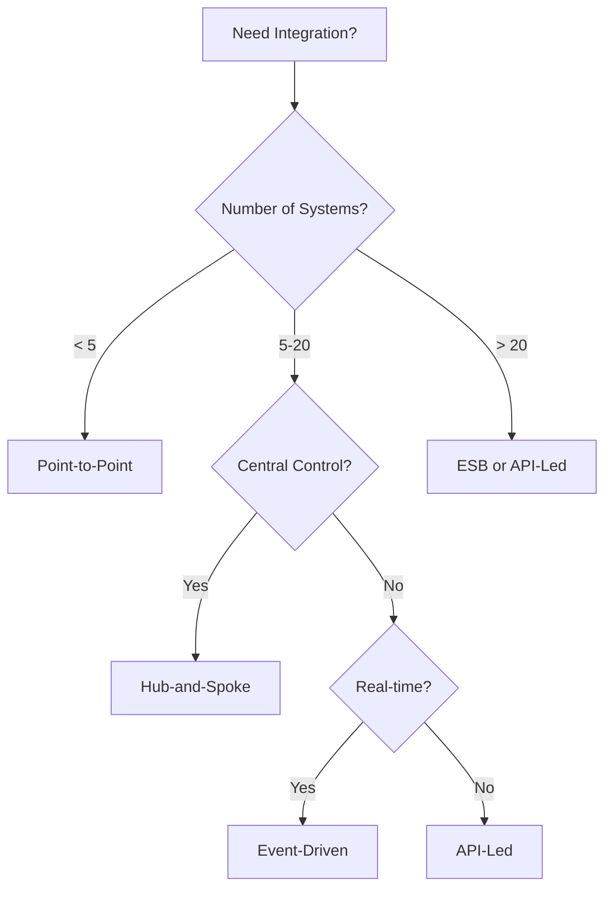

# 3. Integration & Communication Architecture

This section covers integration patterns, APIs, and messaging architectures for building connected enterprise systems.

## Table of Contents

- [Overview](#overview)
- [Integration Architecture](#31-integration-architecture)
- [API Architecture](#32-api-architecture)
- [Event-Driven & Messaging Architecture](#33-event-driven--messaging-architecture)
- [Contents](#contents)

## Overview

Integration architecture defines how different systems, applications, and services communicate and share data. This section provides comprehensive documentation on integration styles, API design, and messaging patterns.

## 3.1 Integration Architecture

Core integration styles and their characteristics:

| Style | Description | Use Case |
|-------|-------------|----------|
| **Point-to-Point** | Direct connections between systems | Small number of systems |
| **Hub-and-Spoke** | Centralized integration broker | Medium enterprises |
| **Enterprise Service Bus (ESB)** | Distributed integration infrastructure | Large enterprises |
| **API-Led Connectivity** | Three-tier API architecture | Modern digital platforms |
| **Event-Driven** | Asynchronous event-based communication | Real-time systems |

📄 **[Integration Architecture Overview](./integration-architecture-overview.md)** - Complete guide to integration styles

## 3.2 API Architecture

API design styles and patterns:

| Style | Protocol | Best For |
|-------|----------|----------|
| **REST** | HTTP | CRUD operations, web services |
| **GraphQL** | HTTP | Complex queries, mobile apps |
| **gRPC** | HTTP/2 | Microservices, low latency |
| **AsyncAPI** | Various | Event-driven APIs |

📄 **[API Architecture Overview](./api-architecture/api-architecture-overview.md)** - Complete API design guide

## 3.3 Event-Driven & Messaging Architecture

### Architectural Paradigms

| Pattern | Description |
|---------|-------------|
| **Event-Driven Architecture (EDA)** | Systems communicate through events |
| **Event Sourcing** | Store state as sequence of events |
| **CQRS** | Separate read and write models |
| **Saga Pattern** | Distributed transaction management |

📄 **[Event-Driven Architecture](./event-driven-messaging/patterns/event-driven-architecture.md)** - Complete EDA guide

### Messaging Patterns

| Category | Patterns |
|----------|----------|
| **Core Patterns** | Queue, Pub/Sub, Request-Reply |
| **Routing** | Content-Based Router, Splitter, Aggregator |
| **Transformation** | Translator, Enricher, Normalizer |
| **Reliability** | Dead Letter Queue, Retry, Idempotency |

📄 **[Messaging Patterns Overview](./messaging-patterns/messaging-patterns-overview.md)** - Core messaging patterns
📄 **[Enterprise Integration Patterns](./messaging-patterns/enterprise-integration-patterns.md)** - Classic EIP patterns

## Contents

### Core Documentation

| Document | Description |
|----------|-------------|
| [Integration Architecture Overview](./integration-architecture-overview.md) | Integration styles and selection guide |
| [API Architecture](./api-architecture/) | API design patterns and best practices |
| [Messaging Patterns](./messaging-patterns/) | Message-based integration patterns |
| [Event-Driven Messaging](./event-driven-messaging/) | EDA patterns and comparisons |

### Detailed Guides

```
03-integration-communication-architecture/
├── integration-architecture-overview.md     # Main integration guide
├── api-architecture/
│   └── api-architecture-overview.md         # REST, GraphQL, gRPC
├── messaging-patterns/
│   ├── messaging-patterns-overview.md       # Core patterns
│   └── enterprise-integration-patterns.md   # Classic EIP
└── event-driven-messaging/
    ├── patterns/
    │   ├── event-driven-architecture.md     # EDA, CQRS, Saga
    │   └── hybrid-messaging-patterns.md     # Hybrid approaches
    ├── comparisons/
    │   ├── queue_vs_pubsub.md              # Pattern comparison
    │   └── rabbitmq_vs_servicebus_vs_kafka.md
    └── images/
```

## Quick Reference

### When to Use Each Integration Style



### Pattern Selection Matrix

| Requirement | Recommended Pattern |
|-------------|---------------------|
| Task Distribution | Competing Consumers + Queue |
| Event Broadcasting | Publish-Subscribe |
| Complex Workflows | Saga / Orchestration |
| Data Synchronization | Event Sourcing / CDC |
| High Throughput | Event Streaming |

## Related

- [Azure Integration Services](../../architecture-azure/integration/) - Azure-specific implementations
- [Architecture Taxonomy Reference](../10-practicality-taxonomy/architecture_taxonomy_reference.md)
- [Reliability Patterns](../07-reliability-performance-operations/)
