# API Architecture

## Table of Contents

- [Introduction](#introduction)
- [API Architectural Styles](#api-architectural-styles)
- [API Gateway Architecture](#api-gateway-architecture)
- [API Design Principles](#api-design-principles)
- [API Versioning Strategies](#api-versioning-strategies)
- [API Security](#api-security)
- [Best Practices](#best-practices)

## Introduction

API (Application Programming Interface) architecture defines how APIs are designed, built, deployed, and managed. It establishes the standards and patterns for creating consistent, scalable, and secure interfaces.

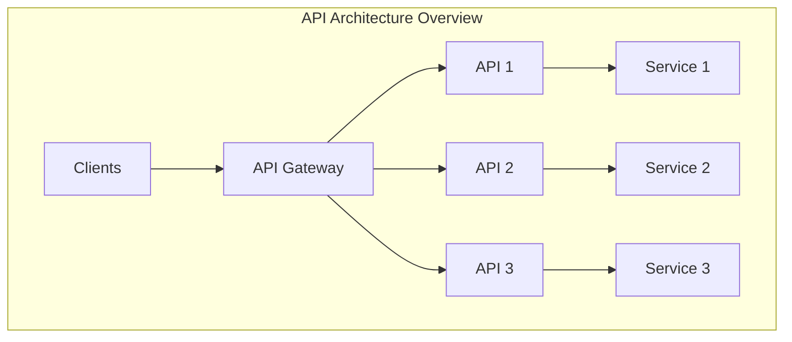

## API Architectural Styles

### REST (Representational State Transfer)

Resource-oriented architecture using HTTP methods.

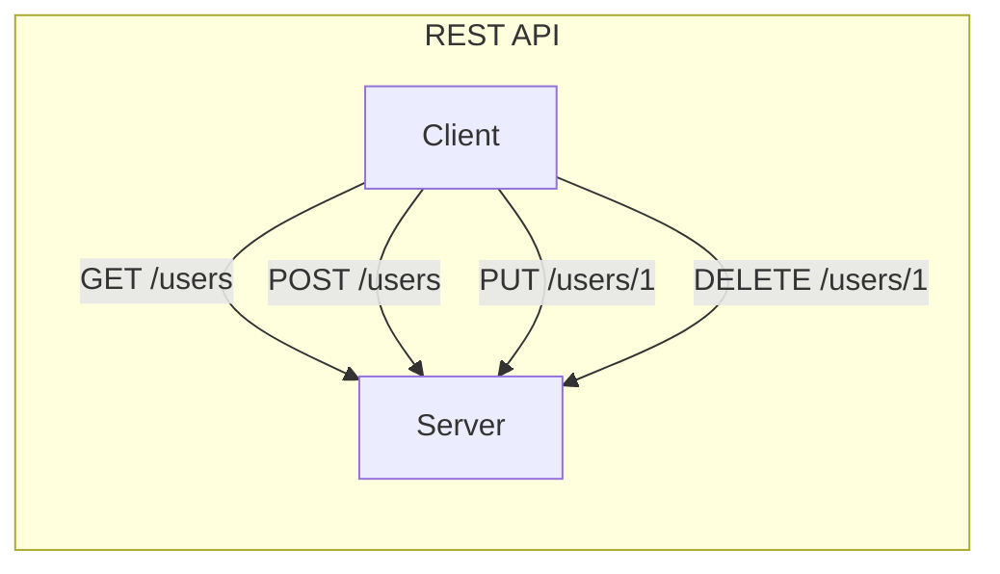

| Characteristic | Description |
|----------------|-------------|
| **Protocol** | HTTP/HTTPS |
| **Data Format** | JSON, XML |
| **State** | Stateless |
| **Caching** | HTTP caching supported |
| **Use Case** | CRUD operations, web services |

**HTTP Methods:**

| Method | Operation | Idempotent | Safe |
|--------|-----------|------------|------|
| GET | Read | ✅ | ✅ |
| POST | Create | ❌ | ❌ |
| PUT | Update/Replace | ✅ | ❌ |
| PATCH | Partial Update | ❌ | ❌ |
| DELETE | Remove | ✅ | ❌ |

### GraphQL

Query language allowing clients to request specific data.

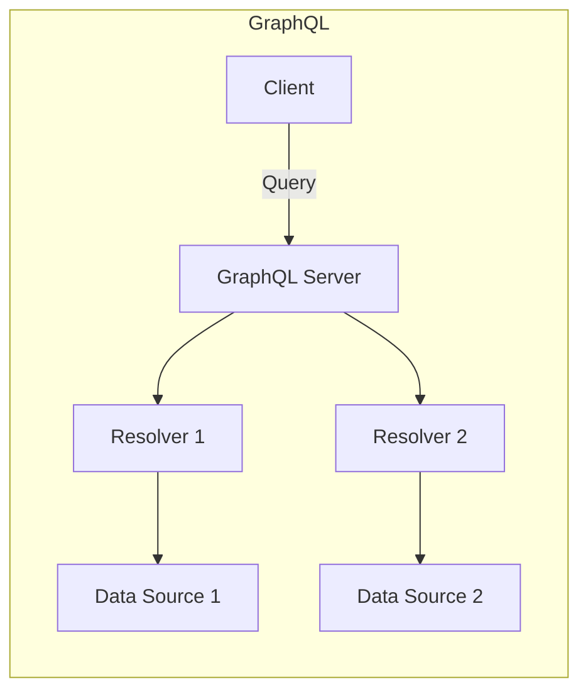

| Characteristic | Description |
|----------------|-------------|
| **Protocol** | HTTP (typically POST) |
| **Data Format** | JSON |
| **Query Type** | Flexible, client-defined |
| **Use Case** | Complex data requirements, mobile apps |

**Advantages:**
- Single endpoint
- No over-fetching or under-fetching
- Strong typing with schema
- Real-time with subscriptions

### gRPC (Google Remote Procedure Call)

High-performance RPC framework using Protocol Buffers.

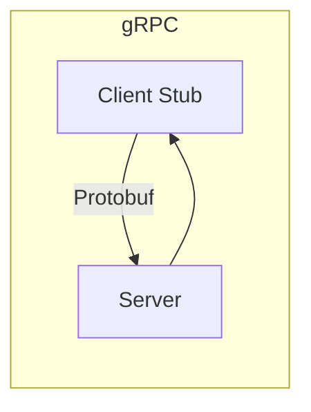

| Characteristic | Description |
|----------------|-------------|
| **Protocol** | HTTP/2 |
| **Data Format** | Protocol Buffers (binary) |
| **Communication** | Unary, streaming |
| **Use Case** | Microservices, low latency |

**Streaming Types:**
- Unary (request-response)
- Server streaming
- Client streaming
- Bidirectional streaming

### AsyncAPI (Event-Driven APIs)

Specification for asynchronous, event-driven APIs.

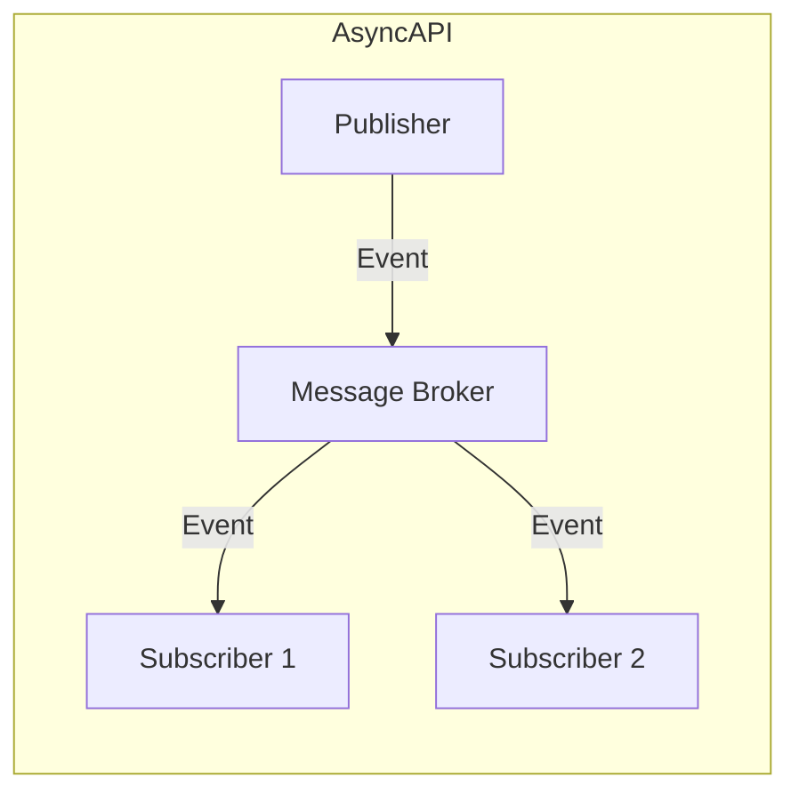

| Characteristic | Description |
|----------------|-------------|
| **Protocol** | AMQP, MQTT, Kafka, WebSocket |
| **Communication** | Asynchronous |
| **Use Case** | Event-driven systems, IoT |

### Comparison Matrix

| Feature | REST | GraphQL | gRPC | AsyncAPI |
|---------|------|---------|------|----------|
| **Protocol** | HTTP | HTTP | HTTP/2 | Various |
| **Format** | JSON/XML | JSON | Protobuf | Various |
| **Typing** | Optional | Strong | Strong | Strong |
| **Real-time** | Polling/SSE | Subscriptions | Streaming | Native |
| **Performance** | Good | Good | Excellent | Excellent |
| **Caching** | HTTP Cache | Complex | Manual | N/A |
| **Learning Curve** | Low | Medium | Medium | Medium |

## API Gateway Architecture

### Core Functions

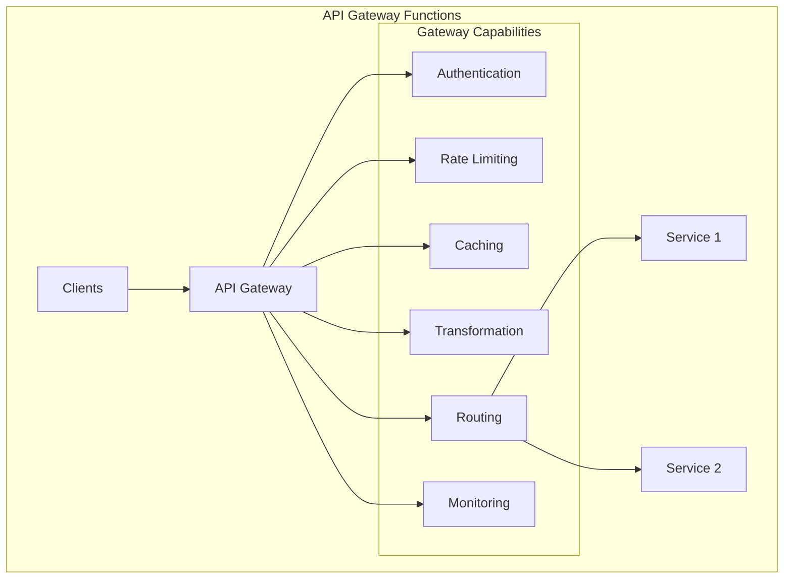

### Gateway Patterns

| Pattern | Description | Use Case |
|---------|-------------|----------|
| **Edge Gateway** | Single entry point | Public APIs |
| **Backend for Frontend (BFF)** | Client-specific gateways | Mobile/Web separation |
| **Internal Gateway** | Service mesh entry | Microservices |

### Backend for Frontend (BFF)

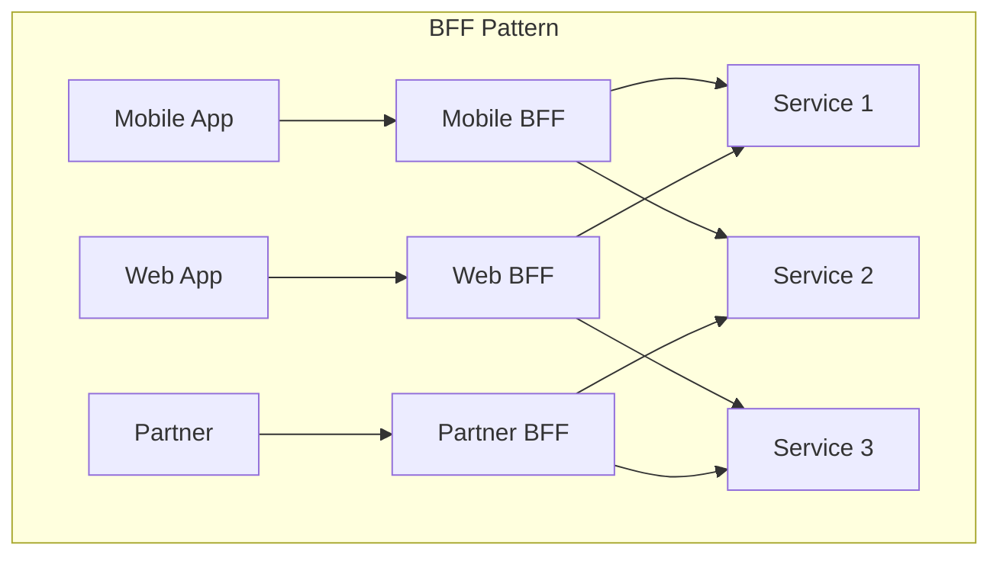

## API Design Principles

### Resource Naming

```
# Good Examples
GET /users
GET /users/{id}
GET /users/{id}/orders
POST /users
PUT /users/{id}
DELETE /users/{id}

# Avoid
GET /getUsers
POST /createUser
GET /users/getById/{id}
```

### Response Structure

```json
{
  "data": {
    "id": "123",
    "type": "user",
    "attributes": {
      "name": "John Doe",
      "email": "john@example.com"
    }
  },
  "meta": {
    "requestId": "abc-123",
    "timestamp": "2025-01-01T00:00:00Z"
  }
}
```

### Error Handling

```json
{
  "error": {
    "code": "VALIDATION_ERROR",
    "message": "Invalid input data",
    "details": [
      {
        "field": "email",
        "message": "Invalid email format"
      }
    ]
  },
  "meta": {
    "requestId": "abc-123",
    "timestamp": "2025-01-01T00:00:00Z"
  }
}
```

### HTTP Status Codes

| Code | Meaning | Use Case |
|------|---------|----------|
| 200 | OK | Successful GET, PUT |
| 201 | Created | Successful POST |
| 204 | No Content | Successful DELETE |
| 400 | Bad Request | Invalid input |
| 401 | Unauthorized | Missing authentication |
| 403 | Forbidden | Insufficient permissions |
| 404 | Not Found | Resource doesn't exist |
| 429 | Too Many Requests | Rate limit exceeded |
| 500 | Internal Server Error | Server-side error |

## API Versioning Strategies

### URL Path Versioning

```
GET /v1/users
GET /v2/users
```

| Pros | Cons |
|------|------|
| Simple and explicit | URL pollution |
| Easy to route | Breaking REST principles |
| Cache-friendly | |

### Header Versioning

```
GET /users
Accept: application/vnd.api+json;version=1
```

| Pros | Cons |
|------|------|
| Clean URLs | Less visible |
| RESTful | Complex client implementation |

### Query Parameter Versioning

```
GET /users?version=1
GET /users?api-version=2025-01-01
```

| Pros | Cons |
|------|------|
| Easy to implement | Caching issues |
| Optional versioning | URL pollution |

### Comparison

| Strategy | Visibility | Caching | RESTful |
|----------|------------|---------|---------|
| URL Path | ✅✅ | ✅✅ | ❌ |
| Header | ❌ | ⚠️ | ✅✅ |
| Query Param | ✅ | ❌ | ⚠️ |

## API Security

### Authentication Methods

| Method | Description | Use Case |
|--------|-------------|----------|
| **API Key** | Static key in header/query | Simple integrations |
| **OAuth 2.0** | Token-based authorization | User delegation |
| **JWT** | Self-contained tokens | Stateless auth |
| **mTLS** | Mutual TLS certificates | Service-to-service |

### OAuth 2.0 Flows

#### Authorization Code Flow (Server-side Apps)

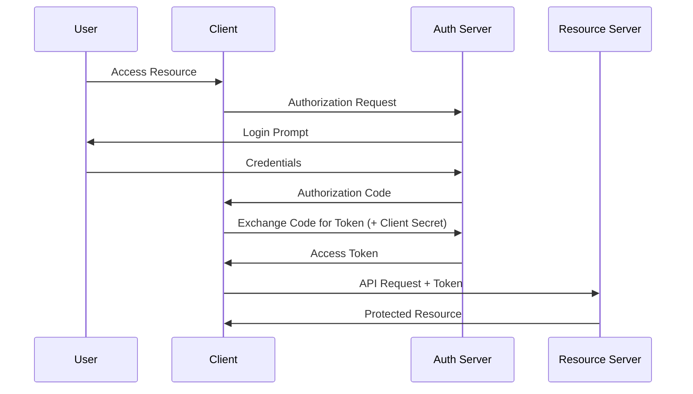

#### OAuth 2.0 Grant Types

| Grant Type | Use Case | Client Type |
|------------|----------|-------------|
| **Authorization Code** | Server-side web apps | Confidential |
| **Authorization Code + PKCE** | SPAs, Mobile, Desktop apps | Public |
| **Client Credentials** | Service-to-service | Confidential |
| **Device Code** | Smart TVs, CLI tools | Public |
| **Refresh Token** | Token renewal | Both |

### OAuth 2.0 with PKCE

**PKCE** (Proof Key for Code Exchange, pronounced "pixy") is a security extension to OAuth 2.0 designed for public clients that cannot securely store a client secret.

#### Why PKCE?

| Problem | Solution |
|---------|----------|
| Public clients can't store secrets | PKCE uses dynamically generated secrets |
| Authorization code interception | Code verifier proves code ownership |
| Mobile app redirect vulnerabilities | One-time use cryptographic proof |

#### PKCE Flow

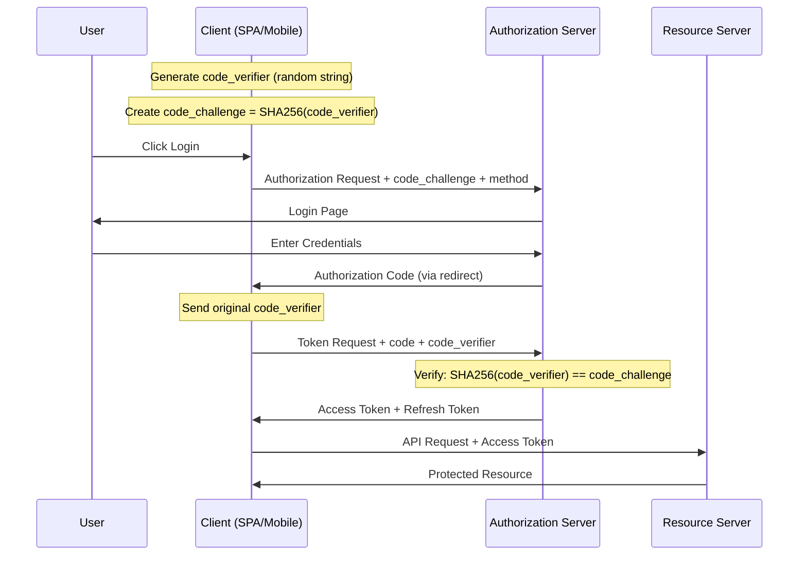

#### PKCE Parameters

| Parameter | Description | Example |
|-----------|-------------|---------|
| `code_verifier` | Random string (43-128 chars) | `dBjftJeZ4CVP-mB92K27uhbUJU1p1r_wW1gFWFOEjXk` |
| `code_challenge` | Base64URL(SHA256(code_verifier)) | `E9Melhoa2OwvFrEMTJguCHaoeK1t8URWbuGJSstw-cM` |
| `code_challenge_method` | Transform method | `S256` (recommended) or `plain` |

#### Implementation Example

**Step 1: Generate Code Verifier and Challenge**

```javascript
// Generate cryptographically random code_verifier
function generateCodeVerifier() {
    const array = new Uint8Array(32);
    crypto.getRandomValues(array);
    return base64URLEncode(array);
}

// Create code_challenge from code_verifier
async function generateCodeChallenge(verifier) {
    const encoder = new TextEncoder();
    const data = encoder.encode(verifier);
    const hash = await crypto.subtle.digest('SHA-256', data);
    return base64URLEncode(new Uint8Array(hash));
}

function base64URLEncode(buffer) {
    return btoa(String.fromCharCode(...buffer))
        .replace(/\+/g, '-')
        .replace(/\//g, '_')
        .replace(/=+$/, '');
}
```

**Step 2: Authorization Request**

```http
GET /authorize?
    response_type=code
    &client_id=your-client-id
    &redirect_uri=https://app.example.com/callback
    &scope=openid profile email
    &state=abc123
    &code_challenge=E9Melhoa2OwvFrEMTJguCHaoeK1t8URWbuGJSstw-cM
    &code_challenge_method=S256
```

**Step 3: Token Exchange**

```http
POST /token
Content-Type: application/x-www-form-urlencoded

grant_type=authorization_code
&client_id=your-client-id
&code=received-authorization-code
&redirect_uri=https://app.example.com/callback
&code_verifier=dBjftJeZ4CVP-mB92K27uhbUJU1p1r_wW1gFWFOEjXk
```

**Step 4: Token Response**

```json
{
    "access_token": "eyJhbGciOiJSUzI1NiIsInR5cCI6IkpXVCJ9...",
    "token_type": "Bearer",
    "expires_in": 3600,
    "refresh_token": "dGhpcyBpcyBhIHJlZnJlc2ggdG9rZW4...",
    "scope": "openid profile email"
}
```

#### PKCE Security Benefits

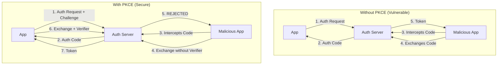

#### When to Use PKCE

| Scenario | Use PKCE? | Reason |
|----------|-----------|--------|
| Single Page Application (SPA) | ✅ Yes | Cannot store client secret |
| Mobile Native App | ✅ Yes | Cannot store client secret |
| Desktop Application | ✅ Yes | Cannot store client secret |
| Server-side Web App | ✅ Recommended | Additional security layer |
| Service-to-Service (M2M) | ❌ No | Use Client Credentials |

#### PKCE Best Practices

1. **Always use S256** - Never use `plain` method in production
2. **Generate fresh verifier** - Create new code_verifier for each authorization request
3. **Secure storage** - Store code_verifier in memory only during auth flow
4. **Validate state parameter** - Prevent CSRF attacks
5. **Use short-lived tokens** - Minimize exposure if token is compromised
6. **Implement refresh tokens** - Avoid frequent re-authentication

### OAuth 2.0 Flow Comparison

| Flow | PKCE | Client Secret | Use Case |
|------|------|---------------|----------|
| Authorization Code | Optional | Required | Server-side apps |
| Authorization Code + PKCE | Required | Not needed | SPAs, Mobile, Desktop |
| Client Credentials | N/A | Required | Service-to-service |
| Device Code | Optional | Optional | Smart TVs, CLI |
| Implicit (Deprecated) | N/A | N/A | ⚠️ Don't use |

### Mutual TLS (mTLS)

**Mutual TLS** (mTLS), also known as two-way TLS or client certificate authentication, extends standard TLS by requiring both client and server to authenticate each other using X.509 certificates.

#### TLS vs mTLS Comparison

| Aspect | Standard TLS | Mutual TLS (mTLS) |
|--------|--------------|-------------------|
| **Server Authentication** | ✅ Yes | ✅ Yes |
| **Client Authentication** | ❌ No | ✅ Yes (Certificate) |
| **Use Case** | Public websites | Service-to-service, B2B |
| **Trust Model** | Client trusts server | Mutual trust |

#### How mTLS Works

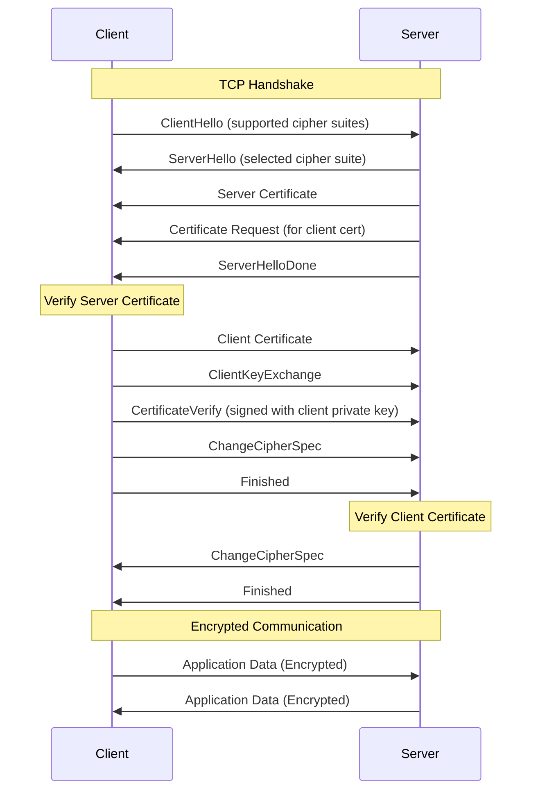

#### mTLS Certificate Chain

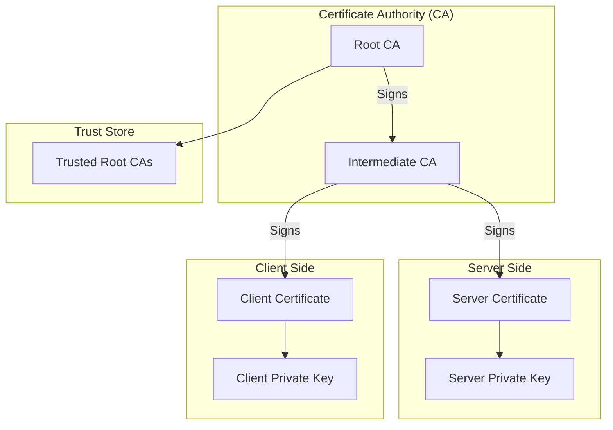

#### Certificate Components

| Component | Description | Example |
|-----------|-------------|---------|
| **Subject** | Identity of certificate holder | `CN=api-client.example.com` |
| **Issuer** | CA that signed the certificate | `CN=Example Intermediate CA` |
| **Serial Number** | Unique identifier | `0x1234ABCD` |
| **Validity Period** | Not Before / Not After dates | Valid for 1 year |
| **Public Key** | Client's public key | RSA 2048-bit or ECDSA |
| **Extensions** | Additional attributes | Key Usage, SAN |

#### mTLS Implementation

**Server Configuration (nginx)**

```nginx
server {
    listen 443 ssl;
    server_name api.example.com;
    
    # Server certificate and key
    ssl_certificate /etc/nginx/certs/server.crt;
    ssl_certificate_key /etc/nginx/certs/server.key;
    
    # Client certificate verification
    ssl_client_certificate /etc/nginx/certs/ca-chain.crt;
    ssl_verify_client on;
    ssl_verify_depth 2;
    
    # Optional: Pass client cert info to backend
    location /api {
        proxy_set_header X-Client-Cert-DN $ssl_client_s_dn;
        proxy_set_header X-Client-Cert-Serial $ssl_client_serial;
        proxy_pass http://backend;
    }
}
```

**Client Request (curl)**

```bash
curl --cert client.crt \
     --key client.key \
     --cacert ca-chain.crt \
     https://api.example.com/resource
```

**Client Request (Python)**

```python
import requests

response = requests.get(
    'https://api.example.com/resource',
    cert=('/path/to/client.crt', '/path/to/client.key'),
    verify='/path/to/ca-chain.crt'
)
```

**Client Request (.NET)**

```csharp
var handler = new HttpClientHandler();
handler.ClientCertificates.Add(
    new X509Certificate2("client.pfx", "password")
);
handler.ServerCertificateCustomValidationCallback = 
    HttpClientHandler.DangerousAcceptAnyServerCertificateValidator; // Only for dev!

var client = new HttpClient(handler);
var response = await client.GetAsync("https://api.example.com/resource");
```

#### mTLS Architecture Patterns

**Pattern 1: Direct mTLS**

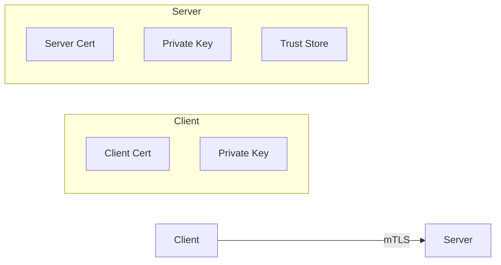

**Pattern 2: mTLS with API Gateway**

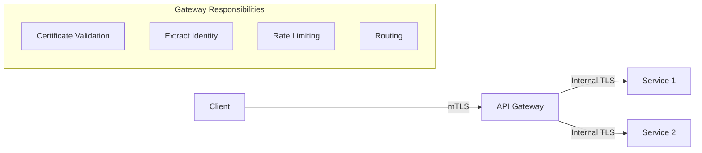

**Pattern 3: Service Mesh mTLS (Zero Trust)**

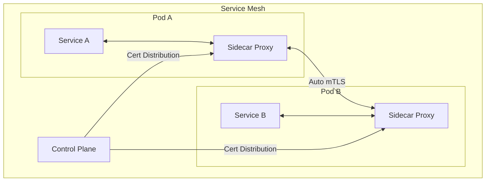

#### Certificate Lifecycle Management

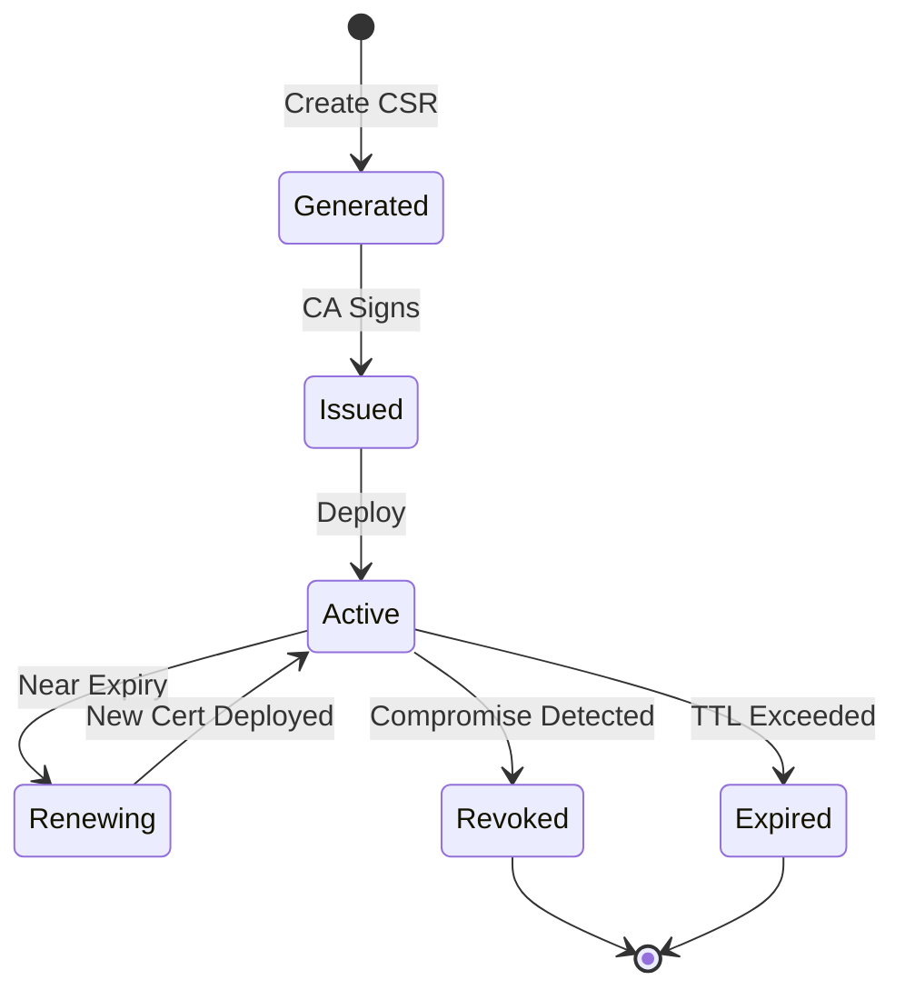

| Phase | Action | Automation |
|-------|--------|------------|
| **Generation** | Create key pair and CSR | cert-manager, Vault |
| **Issuance** | CA signs the certificate | PKI, ACME, Cloud CA |
| **Distribution** | Deploy to services | Kubernetes secrets, Vault |
| **Rotation** | Replace before expiry | Auto-renewal policies |
| **Revocation** | Invalidate compromised certs | CRL, OCSP |

#### When to Use mTLS

| Scenario | mTLS Recommended | Alternative |
|----------|------------------|-------------|
| Service-to-service (internal) | ✅ Yes | Service mesh auto-mTLS |
| B2B partner integrations | ✅ Yes | OAuth 2.0 + API keys |
| Zero Trust architecture | ✅ Yes | - |
| Public APIs | ❌ No | OAuth 2.0, API keys |
| Mobile/Browser clients | ❌ No | OAuth 2.0 + PKCE |
| IoT device authentication | ✅ Yes | Device certificates |

#### mTLS Best Practices

1. **Use strong key algorithms** - RSA 2048+ or ECDSA P-256+
2. **Short certificate validity** - 90 days or less for automated rotation
3. **Automate certificate management** - Use tools like cert-manager, Vault, or cloud PKI
4. **Implement certificate revocation** - Use CRL or OCSP for quick revocation
5. **Separate CAs per environment** - Don't share CAs between prod/dev
6. **Monitor certificate expiry** - Alert before certificates expire
7. **Use certificate pinning carefully** - Can cause outages during rotation
8. **Log certificate details** - Track which clients are connecting

#### mTLS vs Other Authentication Methods

| Aspect | mTLS | OAuth 2.0 | API Key |
|--------|------|-----------|---------|
| **Authentication** | Certificate | Token | Static key |
| **Encryption** | Built-in (TLS) | Requires HTTPS | Requires HTTPS |
| **Identity** | X.509 Subject | Token claims | Key mapping |
| **Revocation** | CRL/OCSP | Token expiry | Manual |
| **Rotation** | Certificate renewal | Token refresh | Key rotation |
| **Complexity** | High (PKI required) | Medium | Low |
| **Best For** | Service-to-service | User delegation | Simple integrations |

### Security Best Practices

1. **Always use HTTPS**
2. **Validate all inputs**
3. **Implement rate limiting**
4. **Use short-lived tokens**
5. **Log security events**
6. **Implement CORS properly**

## Best Practices

### Design

- Use consistent naming conventions
- Version your APIs from the start
- Design for backwards compatibility
- Use pagination for large datasets
- Implement HATEOAS for discoverability

### Performance

- Implement caching (ETag, Cache-Control)
- Use compression (gzip, brotli)
- Support partial responses
- Implement request batching
- Use connection pooling

### Documentation

- Provide OpenAPI/Swagger documentation
- Include examples for all endpoints
- Document error responses
- Maintain changelog
- Provide SDKs when possible

## Related Topics

- [Integration Architecture Overview](./integration-architecture-overview.md)
- [Azure API Management](../../architecture-azure/integration/api-management/)
- [REST vs GraphQL vs gRPC](./api-comparison.md)
