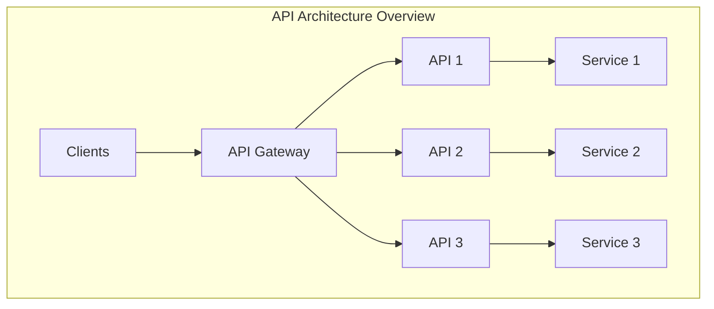
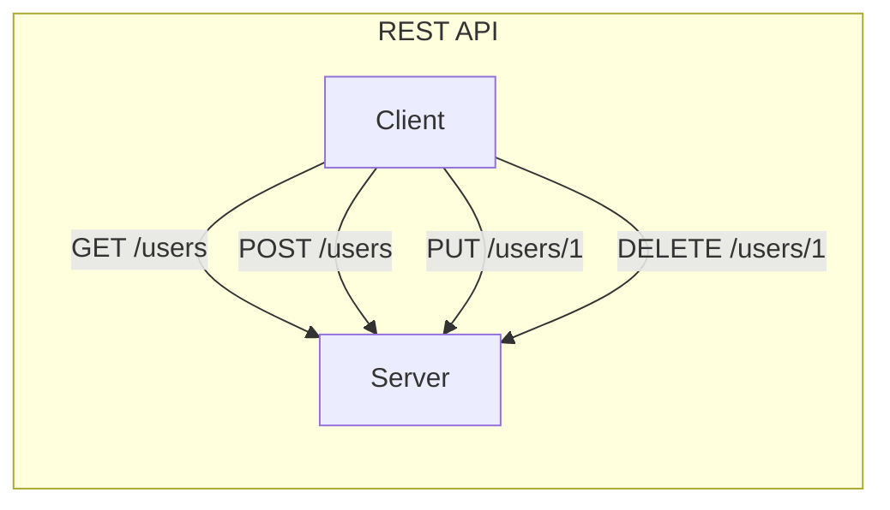
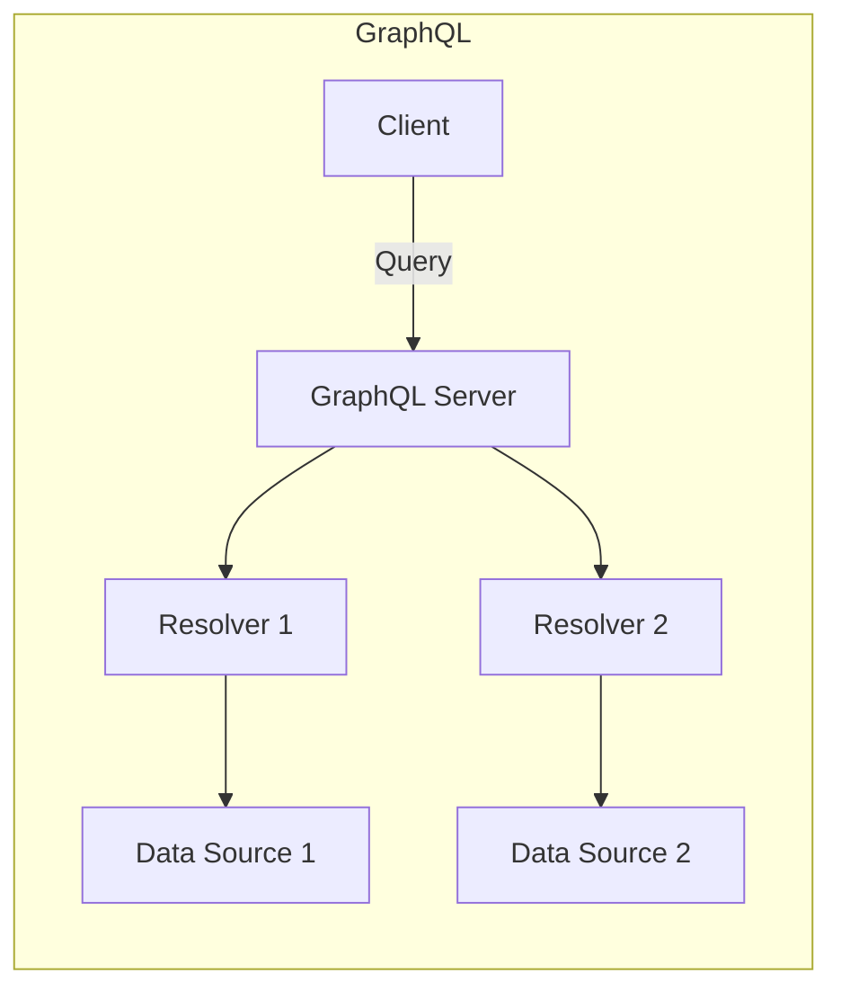
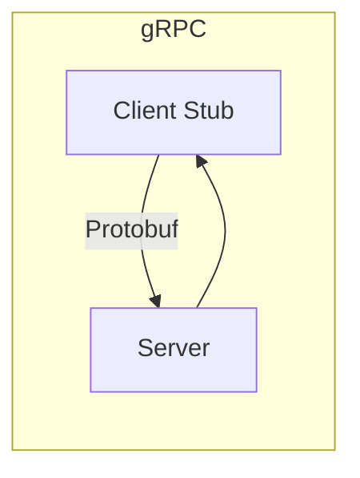
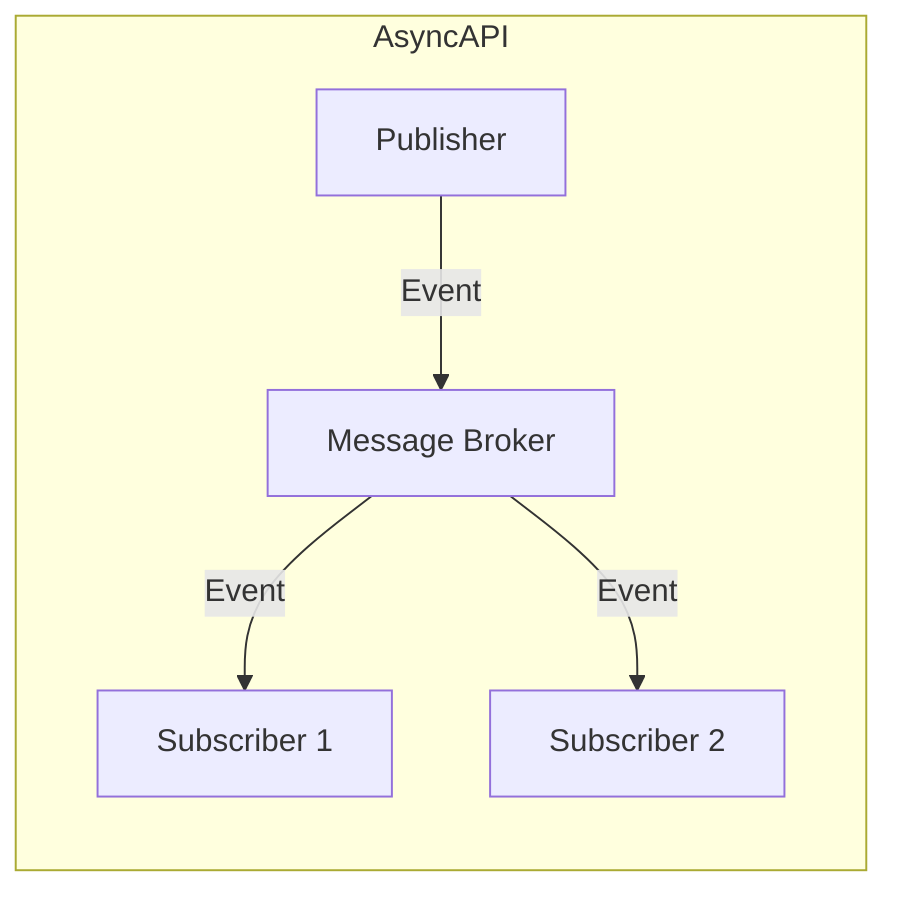
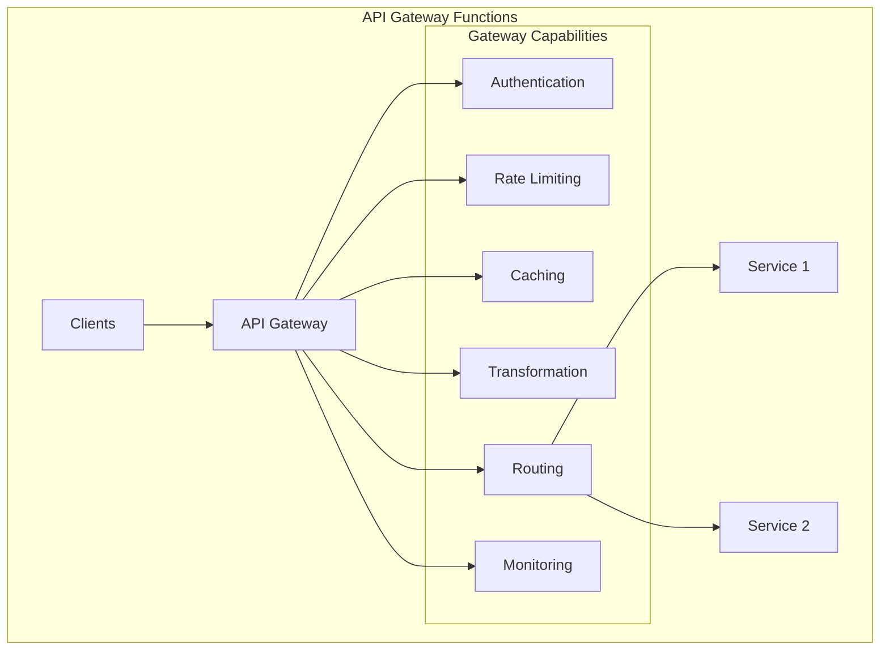
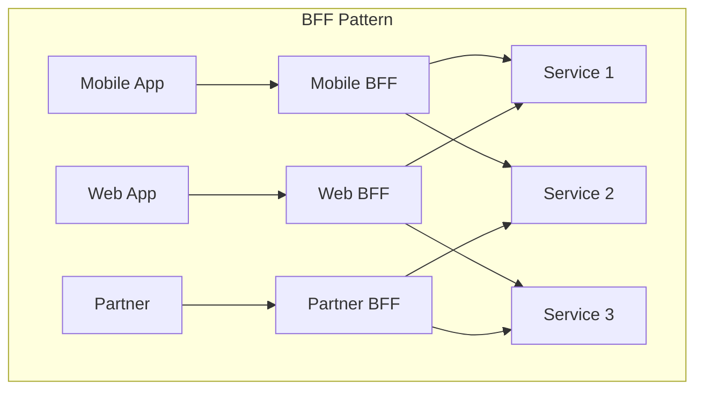
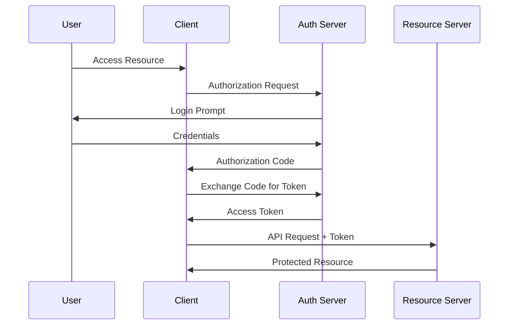

# API Architecture

## Table of Contents

- [Introduction](#introduction)
- [API Architectural Styles](#api-architectural-styles)
- [API Gateway Architecture](#api-gateway-architecture)
- [API Design Principles](#api-design-principles)
- [API Versioning Strategies](#api-versioning-strategies)
- [API Security](#api-security)
- [Best Practices](#best-practices)

## Introduction

API (Application Programming Interface) architecture defines how APIs are designed, built, deployed, and managed. It establishes the standards and patterns for creating consistent, scalable, and secure interfaces.



## API Architectural Styles

### REST (Representational State Transfer)

Resource-oriented architecture using HTTP methods.



| Characteristic | Description |
|----------------|-------------|
| **Protocol** | HTTP/HTTPS |
| **Data Format** | JSON, XML |
| **State** | Stateless |
| **Caching** | HTTP caching supported |
| **Use Case** | CRUD operations, web services |

**HTTP Methods:**

| Method | Operation | Idempotent | Safe |
|--------|-----------|------------|------|
| GET | Read | ✅ | ✅ |
| POST | Create | ❌ | ❌ |
| PUT | Update/Replace | ✅ | ❌ |
| PATCH | Partial Update | ❌ | ❌ |
| DELETE | Remove | ✅ | ❌ |

### GraphQL

Query language allowing clients to request specific data.



| Characteristic | Description |
|----------------|-------------|
| **Protocol** | HTTP (typically POST) |
| **Data Format** | JSON |
| **Query Type** | Flexible, client-defined |
| **Use Case** | Complex data requirements, mobile apps |

**Advantages:**
- Single endpoint
- No over-fetching or under-fetching
- Strong typing with schema
- Real-time with subscriptions

### gRPC (Google Remote Procedure Call)

High-performance RPC framework using Protocol Buffers.



| Characteristic | Description |
|----------------|-------------|
| **Protocol** | HTTP/2 |
| **Data Format** | Protocol Buffers (binary) |
| **Communication** | Unary, streaming |
| **Use Case** | Microservices, low latency |

**Streaming Types:**
- Unary (request-response)
- Server streaming
- Client streaming
- Bidirectional streaming

### AsyncAPI (Event-Driven APIs)

Specification for asynchronous, event-driven APIs.



| Characteristic | Description |
|----------------|-------------|
| **Protocol** | AMQP, MQTT, Kafka, WebSocket |
| **Communication** | Asynchronous |
| **Use Case** | Event-driven systems, IoT |

### Comparison Matrix

| Feature | REST | GraphQL | gRPC | AsyncAPI |
|---------|------|---------|------|----------|
| **Protocol** | HTTP | HTTP | HTTP/2 | Various |
| **Format** | JSON/XML | JSON | Protobuf | Various |
| **Typing** | Optional | Strong | Strong | Strong |
| **Real-time** | Polling/SSE | Subscriptions | Streaming | Native |
| **Performance** | Good | Good | Excellent | Excellent |
| **Caching** | HTTP Cache | Complex | Manual | N/A |
| **Learning Curve** | Low | Medium | Medium | Medium |

## API Gateway Architecture

### Core Functions



### Gateway Patterns

| Pattern | Description | Use Case |
|---------|-------------|----------|
| **Edge Gateway** | Single entry point | Public APIs |
| **Backend for Frontend (BFF)** | Client-specific gateways | Mobile/Web separation |
| **Internal Gateway** | Service mesh entry | Microservices |

### Backend for Frontend (BFF)



## API Design Principles

### Resource Naming

```
# Good Examples
GET /users
GET /users/{id}
GET /users/{id}/orders
POST /users
PUT /users/{id}
DELETE /users/{id}

# Avoid
GET /getUsers
POST /createUser
GET /users/getById/{id}
```

### Response Structure

```json
{
  "data": {
    "id": "123",
    "type": "user",
    "attributes": {
      "name": "John Doe",
      "email": "john@example.com"
    }
  },
  "meta": {
    "requestId": "abc-123",
    "timestamp": "2025-01-01T00:00:00Z"
  }
}
```

### Error Handling

```json
{
  "error": {
    "code": "VALIDATION_ERROR",
    "message": "Invalid input data",
    "details": [
      {
        "field": "email",
        "message": "Invalid email format"
      }
    ]
  },
  "meta": {
    "requestId": "abc-123",
    "timestamp": "2025-01-01T00:00:00Z"
  }
}
```

### HTTP Status Codes

| Code | Meaning | Use Case |
|------|---------|----------|
| 200 | OK | Successful GET, PUT |
| 201 | Created | Successful POST |
| 204 | No Content | Successful DELETE |
| 400 | Bad Request | Invalid input |
| 401 | Unauthorized | Missing authentication |
| 403 | Forbidden | Insufficient permissions |
| 404 | Not Found | Resource doesn't exist |
| 429 | Too Many Requests | Rate limit exceeded |
| 500 | Internal Server Error | Server-side error |

## API Versioning Strategies

### URL Path Versioning

```
GET /v1/users
GET /v2/users
```

| Pros | Cons |
|------|------|
| Simple and explicit | URL pollution |
| Easy to route | Breaking REST principles |
| Cache-friendly | |

### Header Versioning

```
GET /users
Accept: application/vnd.api+json;version=1
```

| Pros | Cons |
|------|------|
| Clean URLs | Less visible |
| RESTful | Complex client implementation |

### Query Parameter Versioning

```
GET /users?version=1
GET /users?api-version=2025-01-01
```

| Pros | Cons |
|------|------|
| Easy to implement | Caching issues |
| Optional versioning | URL pollution |

### Comparison

| Strategy | Visibility | Caching | RESTful |
|----------|------------|---------|---------|
| URL Path | ✅✅ | ✅✅ | ❌ |
| Header | ❌ | ⚠️ | ✅✅ |
| Query Param | ✅ | ❌ | ⚠️ |

## API Security

### Authentication Methods

| Method | Description | Use Case |
|--------|-------------|----------|
| **API Key** | Static key in header/query | Simple integrations |
| **OAuth 2.0** | Token-based authorization | User delegation |
| **JWT** | Self-contained tokens | Stateless auth |
| **mTLS** | Mutual TLS certificates | Service-to-service |

### OAuth 2.0 Flows



### Security Best Practices

1. **Always use HTTPS**
2. **Validate all inputs**
3. **Implement rate limiting**
4. **Use short-lived tokens**
5. **Log security events**
6. **Implement CORS properly**

## Best Practices

### Design

- Use consistent naming conventions
- Version your APIs from the start
- Design for backwards compatibility
- Use pagination for large datasets
- Implement HATEOAS for discoverability

### Performance

- Implement caching (ETag, Cache-Control)
- Use compression (gzip, brotli)
- Support partial responses
- Implement request batching
- Use connection pooling

### Documentation

- Provide OpenAPI/Swagger documentation
- Include examples for all endpoints
- Document error responses
- Maintain changelog
- Provide SDKs when possible

## Related Topics

- [Integration Architecture Overview](./integration-architecture-overview.md)
- [Azure API Management](../../architecture-azure/integration/api-management/)
- [REST vs GraphQL vs gRPC](./api-comparison.md)
