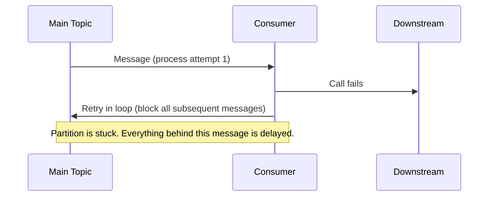
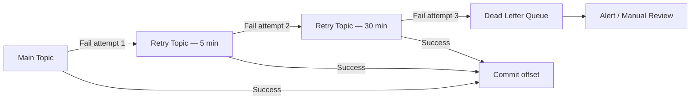
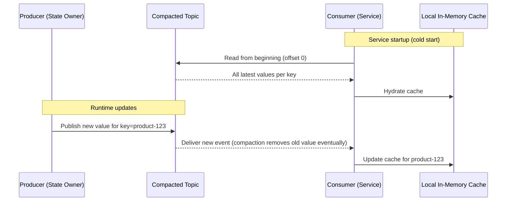
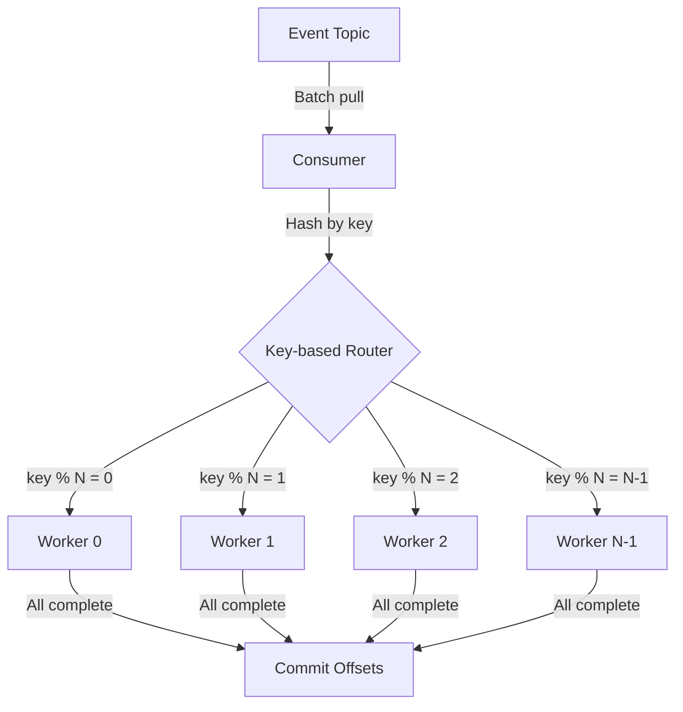

# Event Consumer Patterns

> **Taxonomy Reference**: §3.3 Event-Driven & Messaging — Consumer Reliability & Performance Patterns (see [architecture_taxonomy_reference.md](../../../../10-practicality-taxonomy/architecture_taxonomy_reference.md))

## Table of Contents

- [Overview](#overview)
- [1. Tiered Retry Topics (Dead Letter Shifting)](#1-tiered-retry-topics-dead-letter-shifting)
- [2. Log Compaction for State (Compacted Topic as Read Model)](#2-log-compaction-for-state-compacted-topic-as-read-model)
- [3. Consumer-Side Throttling with Worker Pools](#3-consumer-side-throttling-with-worker-pools)
- [Pattern Comparison](#pattern-comparison)
- [Related Patterns](#related-patterns)

---

## Overview

Event consumer patterns address reliability, throughput, and state management challenges when consuming from high-throughput event streams. These patterns apply to any ordered-log event system (Kafka, Azure Event Hubs, AWS Kinesis, Pulsar).

The three core problems they solve:

| Problem | Pattern |
|---|---|
| A single bad message blocks the entire partition | **Tiered Retry Topics** |
| Consumers need current state without querying a database | **Log Compaction for State** |
| Processing speed is constrained by downstream capacity | **Consumer-Side Throttling with Worker Pools** |

---

## 1. Tiered Retry Topics (Dead Letter Shifting)

### Problem

In a partition-ordered event stream, a single un-processable ("poison") message **blocks all subsequent messages** in that partition. Retrying in-place in a loop compounds the problem — it monopolises the consumer, inflates p99 latency, and produces no forward progress.



### Solution

Route failed messages to a **time-delayed retry topic** instead of re-processing immediately. After the delay, the retry consumer re-attempts the message. After a configurable number of retry tiers, the message moves to a Dead Letter Queue (DLQ) for human intervention.

```
Main Topic
    │  (fails)
    ▼
Topic_Retry_5m    ← retry after 5 minutes
    │  (still fails)
    ▼
Topic_Retry_30m   ← retry after 30 minutes
    │  (still fails)
    ▼
Topic_DLQ         ← human intervention / alerting
```



### Key Design Decisions

| Decision | Guidance |
|---|---|
| **Number of retry tiers** | Typically 2–3; more adds operational complexity with diminishing value |
| **Retry delay** | Exponential or fixed intervals; align with downstream SLAs (5 min, 30 min, 2 h) |
| **Retry topic consumers** | Each retry topic gets its own consumer group with the same processing logic |
| **DLQ consumer** | Alert only; no automatic processing — requires human triage |
| **Message enrichment** | Attach failure reason, attempt count, and original timestamp on each hop |
| **Partition key** | Preserve the original key so ordering is maintained within each tier |

### When to Use

- Downstream services are intermittently unavailable (transient failures)
- Processing a message requires an external resource that may be temporarily unavailable
- Message failure rate is low and human review of DLQ is operationally feasible

### When NOT to Use

- Message ordering across tiers is a strict business requirement (retry topics break ordering)
- Every message *must* be processed immediately — consider synchronous retry with circuit breaker instead

> **Related Pattern**: [Dead Letter Queue](../../messaging-patterns/messaging-patterns-overview.md#2-dead-letter-queue-dlq)

---

## 2. Log Compaction for State (Compacted Topic as Read Model)

### Problem

Microservices frequently need access to "current state" for a given entity — for example, the latest price of every product, or the active configuration for every tenant. The naive solution — querying a database or calling an HTTP API per event — introduces:

- High read latency under load
- Coupling between services
- Potential cascading failures

### Solution

Use a **compacted topic** (a topic where the broker retains only the latest value per key, discarding all older values for the same key) as a distributed key-value store. Consumers read the topic from the beginning at startup to build a local in-memory cache; subsequent events keep the cache current.



### Compaction Mechanics

A log-compacted topic guarantees that, for any key, the log will always contain at least the most recent value. The broker's compaction process periodically scans and removes earlier records for the same key, keeping storage bounded.

```
Before compaction:
offset 0: key=A, value=v1
offset 1: key=B, value=v1
offset 2: key=A, value=v2   ← newer
offset 3: key=C, value=v1
offset 4: key=B, value=v2   ← newer

After compaction:
offset 2: key=A, value=v2
offset 3: key=C, value=v1
offset 4: key=B, value=v2
```

A tombstone (null value) for a key signals deletion — the compaction process will remove the key entirely.

### When to Use

- Data is **keyed** (product ID, tenant ID, user ID) and consumers need the latest value per key
- Read volume is very high — local cache eliminates database round-trips
- State changes are **write-infrequent** compared to read frequency
- Acceptable consistency model: **eventual consistency** (cache lags slightly behind producer)

### When NOT to Use

- Strong consistency is required at read time
- Keys are unbounded and cardinality is extremely high (cache memory pressure)
- Data is time-series by nature — use a regular retained topic, not compaction

### Operational Considerations

| Concern | Guidance |
|---|---|
| **Cold-start time** | Proportional to number of unique keys; pre-warm during deployment |
| **Cache invalidation** | Not needed — the topic is the source of truth; consumers are always subscribed |
| **Memory sizing** | Estimate: `number of unique keys × average value size × replication factor` |
| **Tombstone handling** | Consumer must handle null values (key deletion) to remove entries from local cache |

> **Related Pattern**: [Event Sourcing](event-driven-architecture.md) · [CQRS](event-driven-architecture.md#cqrs-pattern)

---

## 3. Consumer-Side Throttling with Worker Pools

### Problem

In Go and similar concurrent runtimes, it is tempting to spawn a goroutine (or thread) per incoming message. At scale, this causes:

- Downstream database connection exhaustion
- API rate limit violations on external services
- Memory pressure from thousands of in-flight goroutines/threads

Conversely, a single-threaded consumer bottlenecks throughput when messages are independent and could be processed in parallel.

### Solution

Use a **fixed-size worker pool** where the consumer pulls batches of messages and distributes work across a bounded set of workers. Offset commits happen only after the full batch is processed.



### Key-Based Routing

Routing messages to workers by `hash(key) % N` ensures that all messages for the same entity (e.g., the same `orderId`) are always processed by the same worker — preserving per-entity ordering even under parallel processing.

```
Batch of 12 messages with keys [A, B, A, C, B, A, C, A, B, C, A, B]:
Worker 0 (key=A): processes all A messages in order
Worker 1 (key=B): processes all B messages in order
Worker 2 (key=C): processes all C messages in order
```

### Offset Commit Strategy

Offsets are committed only after **all workers in the batch complete**. This ensures no message is skipped if a worker or the consumer crashes mid-batch.

```
Batch received: offsets 100–111
├── Worker 0: processes offsets 100, 102, 105, 107 (key=A)
├── Worker 1: processes offsets 101, 104, 108, 111 (key=B)
└── Worker 2: processes offsets 103, 106, 109, 110 (key=C)

All workers complete → commit offset 112 (next batch start)
```

### Pool Sizing

$$N_{workers} = \min\left(\frac{\text{downstream\_capacity}}{\text{avg\_msg\_processing\_time}}, \text{partition\_count}\right)$$

In practice, start with $N = $ number of partitions and tune based on downstream latency and throughput metrics.

### Trade-offs

| Concern | Impact |
|---|---|
| **Offset management complexity** | Batch-level commits require careful tracking; partial failures need re-processing from last committed offset |
| **Worker failure** | A crashed worker means the entire batch must be re-processed from the last committed offset |
| **Out-of-order risk** | Without key-based routing, parallel workers may process events out of order |
| **Latency vs. throughput** | Larger batches increase throughput but add end-to-end latency |

### When to Use

- Downstream processing is I/O-bound (database writes, HTTP calls) and benefits from parallelism
- Processing time per message is significant (> a few milliseconds)
- Per-entity ordering matters but cross-entity parallelism is acceptable

### When NOT to Use

- Messages must be processed strictly in global order (use a single-threaded consumer)
- Processing is CPU-bound and memory-constrained — goroutine/thread overhead may not be worth it

---

## Pattern Comparison

| Pattern | Problem Solved | Consistency Model | Operational Complexity |
|---|---|---|---|
| **Tiered Retry Topics** | Poison message isolation | At-least-once delivery | Medium — multiple consumer groups |
| **Log Compaction for State** | Eliminate per-event database reads | Eventual | Low — broker manages compaction |
| **Consumer Worker Pool** | Throughput vs. downstream capacity | At-least-once (batch commits) | Medium — offset tracking complexity |

---

## Related Patterns

| Pattern | Location |
|---|---|
| Dead Letter Queue | [messaging-patterns-overview.md](../../messaging-patterns/messaging-patterns-overview.md#2-dead-letter-queue-dlq) |
| Outbox Pattern | [outbox-pattern.md](../../messaging-patterns/outbox-pattern.md) |
| Saga Pattern | [saga-pattern.md](../../messaging-patterns/saga-pattern.md) |
| Event-Driven Architecture | [event-driven-architecture.md](event-driven-architecture.md) |
| Idempotency Store | [idempotency-store-pattern.md](../../messaging-patterns/idempotency-store-pattern.md) |
