# Event-Driven Architecture (EDA)

## Table of Contents

- [Introduction](#introduction)
- [Core Concepts](#core-concepts)
- [EDA Patterns](#eda-patterns)
- [Event Types](#event-types)
- [Event Sourcing](#event-sourcing)
- [CQRS Pattern](#cqrs-pattern)
- [Saga Pattern](#saga-pattern)
- [Implementation Considerations](#implementation-considerations)
- [Best Practices](#best-practices)

## Introduction

Event-Driven Architecture (EDA) is an architectural paradigm where the production, detection, consumption, and reaction to events drive the system's behavior. Events represent significant changes in state or noteworthy occurrences.

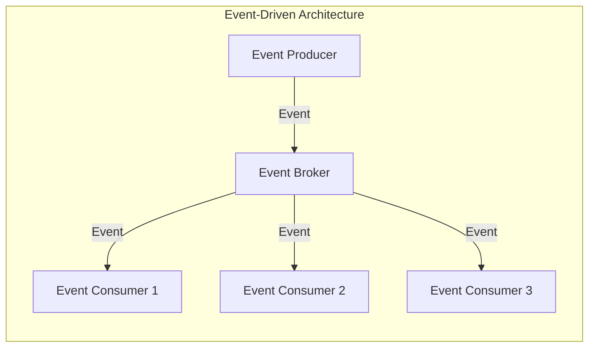

### Key Benefits

| Benefit | Description |
|---------|-------------|
| **Loose Coupling** | Producers and consumers are independent |
| **Scalability** | Components scale independently |
| **Flexibility** | Easy to add new event handlers |
| **Resilience** | Failures are isolated |
| **Real-time** | Immediate reaction to changes |

## Core Concepts

### Event

An immutable record of something that happened.

```json
{
  "eventId": "e123-456-789",
  "eventType": "OrderPlaced",
  "timestamp": "2025-01-01T10:30:00Z",
  "source": "order-service",
  "data": {
    "orderId": "ORD-001",
    "customerId": "CUST-123",
    "totalAmount": 99.99,
    "items": [
      {"productId": "PROD-1", "quantity": 2}
    ]
  },
  "metadata": {
    "correlationId": "corr-abc",
    "causationId": "cause-xyz"
  }
}
```

### Event Producer

Component that detects and publishes events.

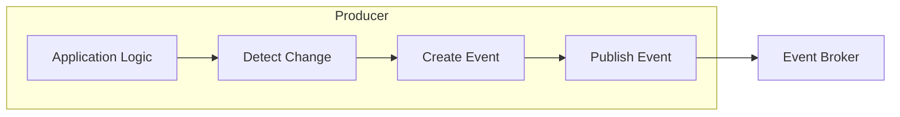

### Event Consumer

Component that subscribes to and processes events.

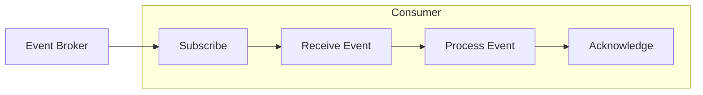

### Event Broker

Infrastructure that routes events between producers and consumers.

| Broker Type | Characteristics | Examples |
|-------------|-----------------|----------|
| **Message Queue** | Point-to-point | RabbitMQ, Azure Service Bus |
| **Pub/Sub** | One-to-many | Kafka, Azure Event Hubs |
| **Event Routing** | Reactive event distribution | Apache EventMesh, Knative Eventing, Azure Event Grid |
| **Event Mesh** | Distributed routing | Solace, NATS |

## EDA Patterns

### 1. Event Notification

Simple notification that something happened.

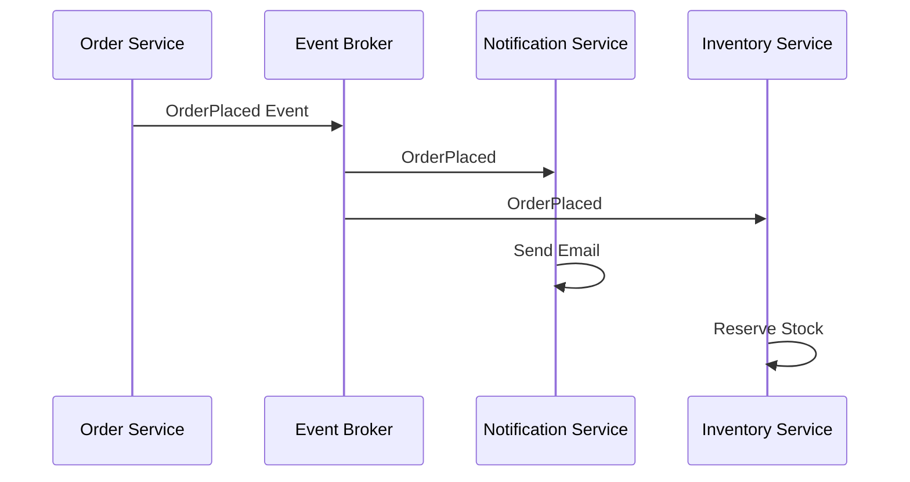

**Characteristics:**
- Lightweight events (minimal data)
- Consumers may need to callback for details
- Best for simple notifications

### 2. Event-Carried State Transfer

Events carry all necessary data.

```json
{
  "eventType": "CustomerUpdated",
  "data": {
    "customerId": "CUST-123",
    "name": "John Doe",
    "email": "john@example.com",
    "address": {
      "street": "123 Main St",
      "city": "Seattle",
      "country": "USA"
    }
  }
}
```

**Characteristics:**
- Self-contained events
- No callback needed
- Enables local data caching
- Larger event payload

### 3. Event Sourcing

Store state as sequence of events.

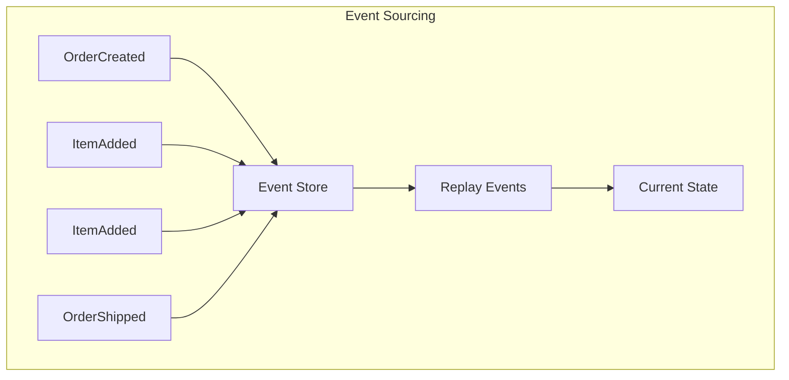

### 4. CQRS (Command Query Responsibility Segregation)

Separate read and write models.

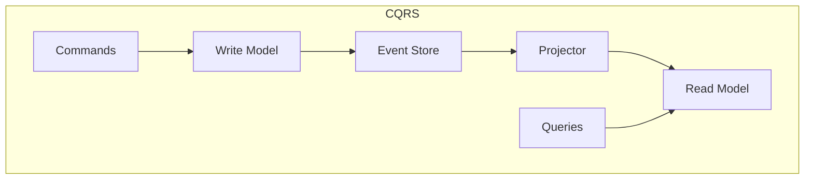

## Event Types

### Domain Events

Business-significant occurrences.

| Event | Description |
|-------|-------------|
| `OrderPlaced` | Customer placed an order |
| `PaymentReceived` | Payment was processed |
| `ItemShipped` | Product was shipped |
| `AccountCreated` | New account registered |

### Integration Events

Cross-service communication events.

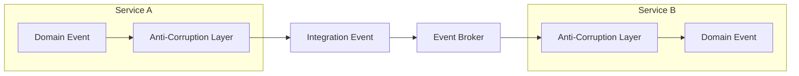

### System Events

Infrastructure and operational events.

| Event | Source |
|-------|--------|
| `ServiceStarted` | Application lifecycle |
| `HealthCheckFailed` | Monitoring |
| `ScalingTriggered` | Auto-scaler |
| `DeploymentCompleted` | CI/CD |

## Event Sourcing

### Concept

Instead of storing current state, store all events that led to current state.

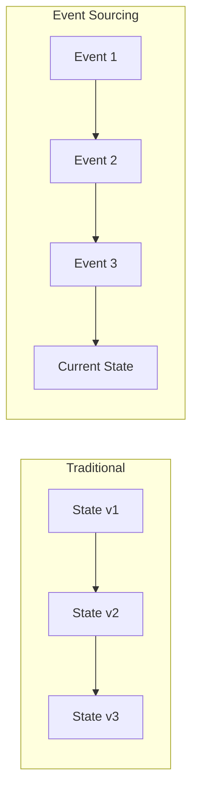

### Event Store

Append-only store for events.

```sql
CREATE TABLE events (
    event_id UUID PRIMARY KEY,
    stream_id VARCHAR(255),
    event_type VARCHAR(100),
    data JSONB,
    metadata JSONB,
    version BIGINT,
    timestamp TIMESTAMP
);

-- Example events for an order
INSERT INTO events VALUES
('e1', 'order-123', 'OrderCreated', '{"customerId":"C1"}', '{}', 1, NOW()),
('e2', 'order-123', 'ItemAdded', '{"productId":"P1","qty":2}', '{}', 2, NOW()),
('e3', 'order-123', 'OrderSubmitted', '{"total":99.99}', '{}', 3, NOW());
```

### Rebuilding State

```python
def rebuild_order(stream_id):
    events = event_store.get_events(stream_id)
    order = Order()
    
    for event in events:
        order.apply(event)
    
    return order

class Order:
    def apply(self, event):
        if event.type == "OrderCreated":
            self.customer_id = event.data["customerId"]
            self.items = []
        elif event.type == "ItemAdded":
            self.items.append(event.data)
        elif event.type == "OrderSubmitted":
            self.status = "submitted"
            self.total = event.data["total"]
```

### Snapshots

Optimize rebuilding with periodic snapshots.

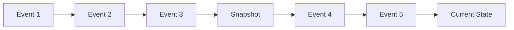

## CQRS Pattern

### Architecture

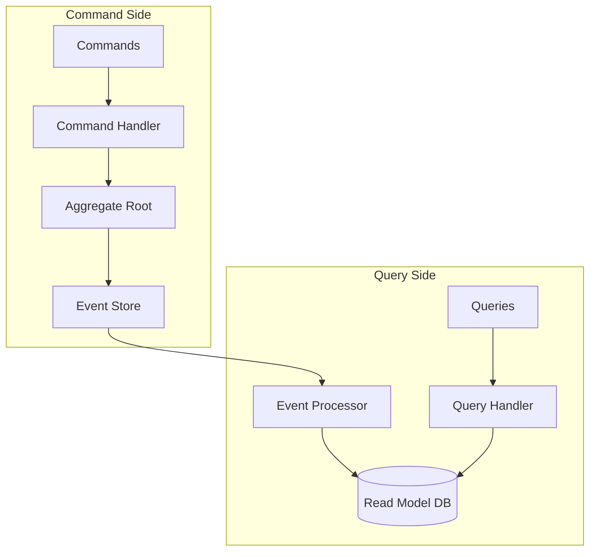

### Benefits

| Benefit | Description |
|---------|-------------|
| **Optimized Models** | Different models for read/write |
| **Scalability** | Scale read/write independently |
| **Flexibility** | Multiple read models per use case |
| **Performance** | Optimized queries |

### Read Model Projections

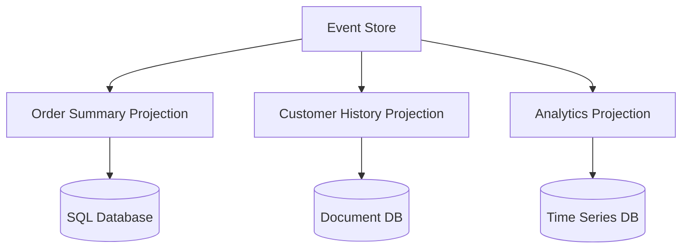

## Saga Pattern

### Choreography-based Saga

Services coordinate through events.

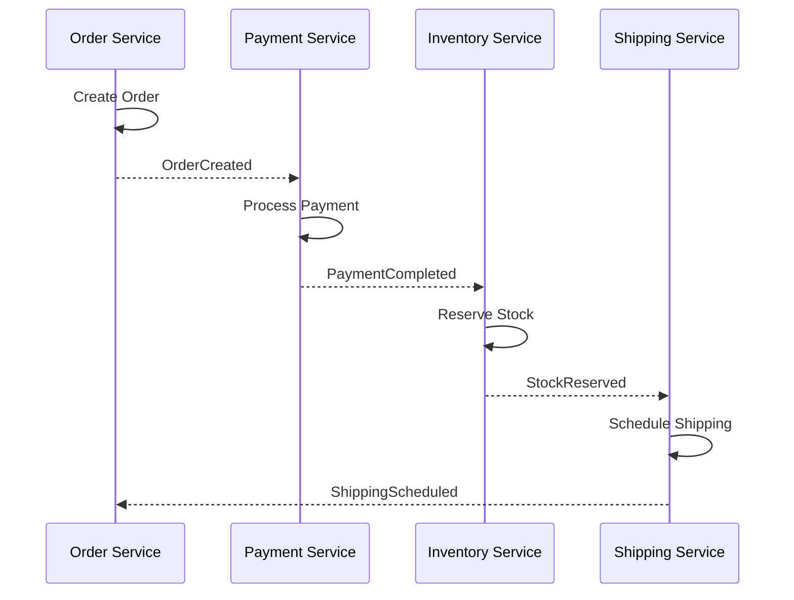

### Orchestration-based Saga

Central orchestrator coordinates the flow.

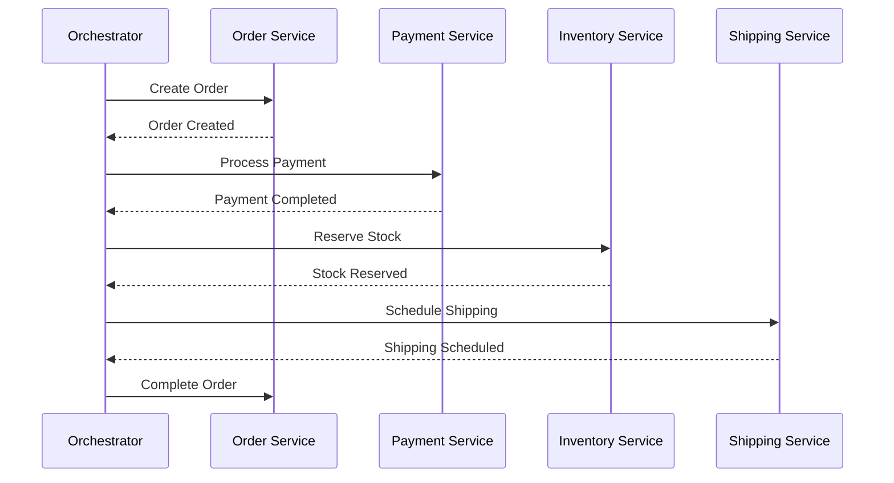

### Compensating Transactions

Undo operations when saga fails.

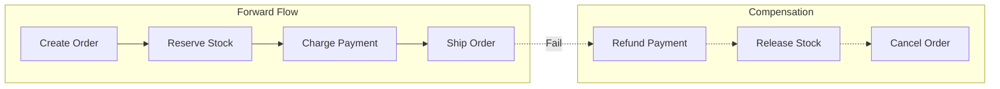

| Step | Action | Compensation |
|------|--------|--------------|
| 1 | Create Order | Cancel Order |
| 2 | Reserve Stock | Release Stock |
| 3 | Charge Payment | Refund Payment |
| 4 | Ship Order | Return Shipment |

## Implementation Considerations

### Event Schema Evolution

```json
// Version 1
{
  "eventType": "OrderPlaced",
  "version": 1,
  "data": {
    "orderId": "123",
    "amount": 99.99
  }
}

// Version 2 - Added currency
{
  "eventType": "OrderPlaced",
  "version": 2,
  "data": {
    "orderId": "123",
    "amount": 99.99,
    "currency": "USD"
  }
}
```

**Evolution Strategies:**

| Strategy | Description |
|----------|-------------|
| **Upcasting** | Transform old events to new format |
| **Versioning** | Support multiple versions |
| **Weak Schema** | Tolerant reader pattern |

### Event Ordering

| Guarantee | Description | Example |
|-----------|-------------|---------|
| **No Order** | Events may arrive in any order | Fan-out scenarios |
| **Partition Order** | Order within partition | Kafka partitions |
| **Global Order** | Strict total ordering | Single partition |

### Delivery Guarantees

| Guarantee | Description | Implementation |
|-----------|-------------|----------------|
| **At-most-once** | May lose messages | Fire and forget |
| **At-least-once** | May duplicate | Ack after process |
| **Exactly-once** | No loss or duplicates | Idempotency + transactions |

### Idempotency

Ensuring that processing the same event multiple times produces the same result. Critical for at-least-once delivery systems.

#### Idempotency Strategies

| Strategy | Description | Use Case |
|----------|-------------|----------|
| **Idempotency Key** | Store and check event IDs | General purpose |
| **Optimistic Locking** | Version-based updates | State changes |
| **Natural Idempotency** | Design idempotent operations | Simple updates |
| **Deduplication Window** | Time-based duplicate detection | High-throughput |

#### Idempotency Key Pattern

Store processed event IDs and check before processing.

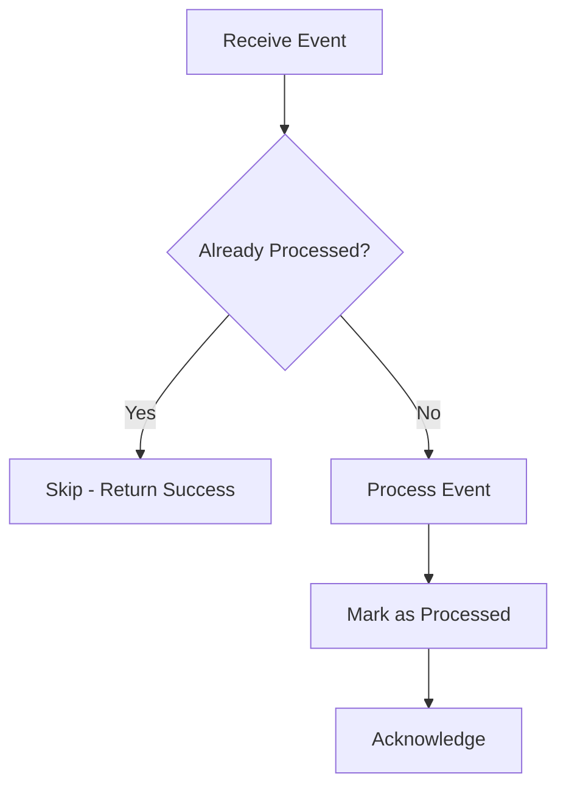

```python
def process_event(event):
    # Check if already processed
    if event_store.exists(event.event_id):
        logger.info(f"Duplicate event {event.event_id}, skipping")
        return
    
    # Process in transaction
    with transaction():
        do_business_logic(event)
        event_store.mark_processed(event.event_id)
```

#### Deduplication Table

```sql
CREATE TABLE processed_events (
    event_id VARCHAR(255) PRIMARY KEY,
    event_type VARCHAR(100),
    processed_at TIMESTAMP DEFAULT CURRENT_TIMESTAMP,
    INDEX idx_processed_at (processed_at)
);

-- Check and insert atomically
INSERT INTO processed_events (event_id, event_type)
VALUES ('evt-123', 'OrderPlaced')
ON CONFLICT (event_id) DO NOTHING;
-- Returns 0 rows affected if duplicate
```

#### Optimistic Locking

Use version numbers to detect concurrent or duplicate updates.

```sql
-- Only succeeds if version matches expected
UPDATE orders 
SET status = 'shipped', 
    version = version + 1,
    updated_at = NOW()
WHERE order_id = 'ORD-123' 
  AND version = 5;

-- Check rows affected - 0 means conflict/duplicate
```

#### Natural Idempotency

Design operations to be inherently idempotent.

| Operation | Idempotent? | Alternative |
|-----------|-------------|-------------|
| `SET status = 'shipped'` | ✅ Yes | - |
| `INCREMENT counter` | ❌ No | `SET counter = X` |
| `INSERT record` | ❌ No | `UPSERT` / `INSERT IGNORE` |
| `DELETE WHERE id = X` | ✅ Yes | - |
| `APPEND to list` | ❌ No | `SET list = [...]` |

#### Deduplication Window

For high-throughput systems, maintain a time-limited deduplication cache.

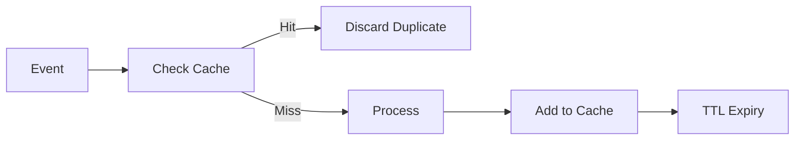

```python
class DeduplicationCache:
    def __init__(self, ttl_seconds=3600):
        self.cache = {}  # In production: Redis with TTL
        self.ttl = ttl_seconds
    
    def is_duplicate(self, event_id):
        if event_id in self.cache:
            return True
        self.cache[event_id] = time.time()
        return False
    
    def cleanup_expired(self):
        cutoff = time.time() - self.ttl
        self.cache = {k: v for k, v in self.cache.items() if v > cutoff}
```

#### Combining with Exactly-Once Semantics

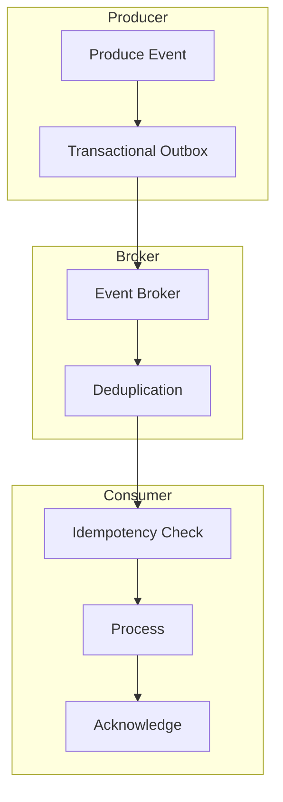

| Layer | Mechanism |
|-------|-----------|
| **Producer** | Transactional outbox pattern |
| **Broker** | Message deduplication (e.g., Kafka exactly-once) |
| **Consumer** | Idempotency key + transactional processing |

## Best Practices

### Event Design

1. **Immutable** - Events never change
2. **Self-describing** - Include all context
3. **Business-focused** - Use domain language
4. **Versioned** - Support schema evolution
5. **Small** - Don't include unnecessary data

### Error Handling

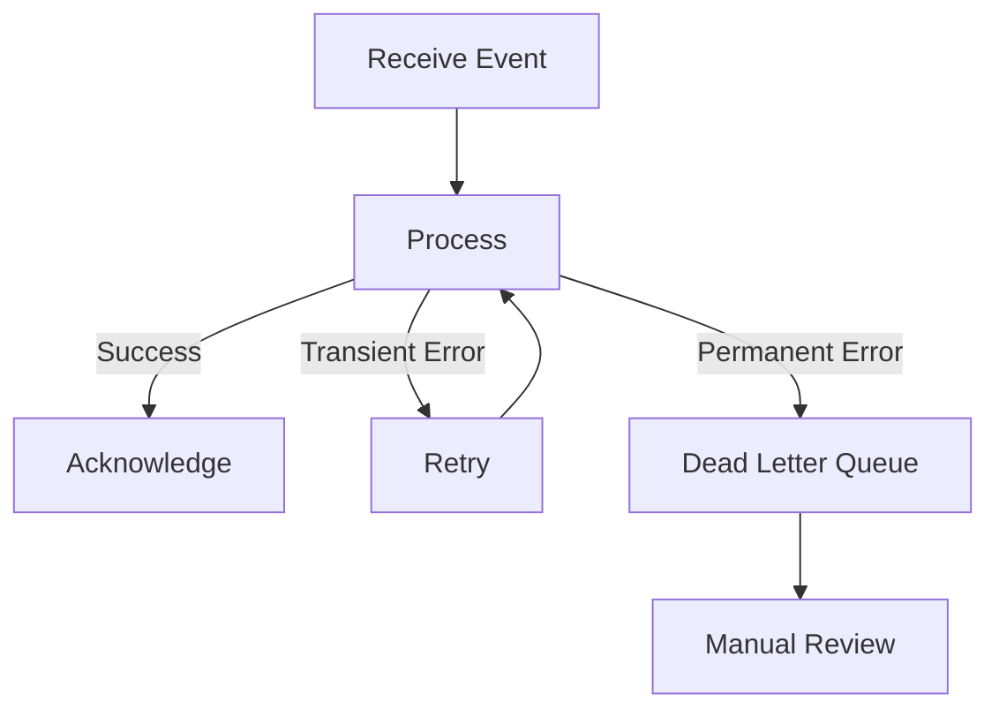

### Monitoring

| Metric | Description |
|--------|-------------|
| **Event Lag** | Consumer behind producer |
| **Processing Time** | Event processing duration |
| **Error Rate** | Failed event processing |
| **Throughput** | Events per second |

## Related Topics

- [Messaging Patterns](../messaging-patterns/messaging-patterns-overview.md)
- [Integration Architecture](../integration-architecture-overview.md)
- [Azure Event Grid](../../../architecture-azure/integration/event-grid/)
- [Azure Event Hubs](../../../architecture-azure/integration/event-hubs/)
