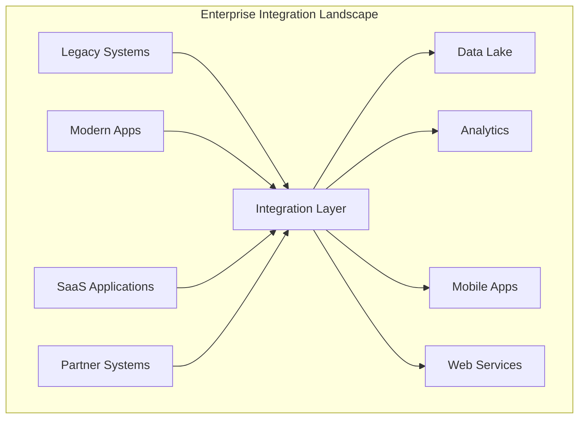
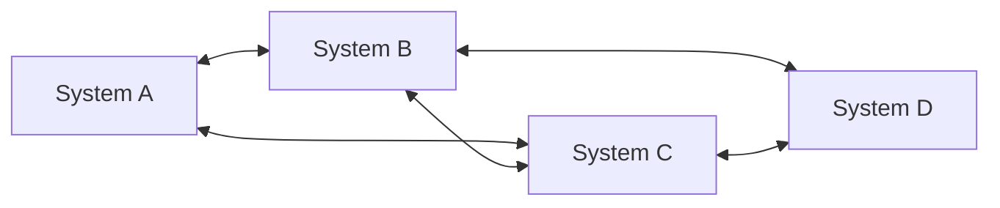
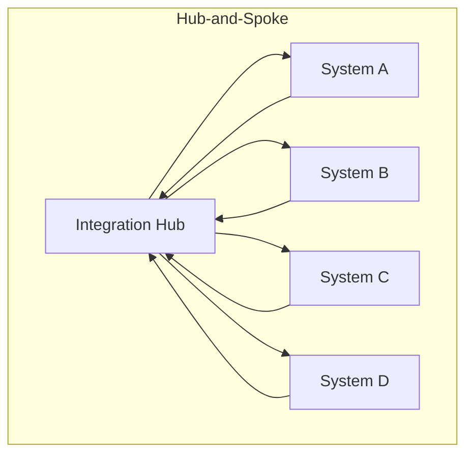
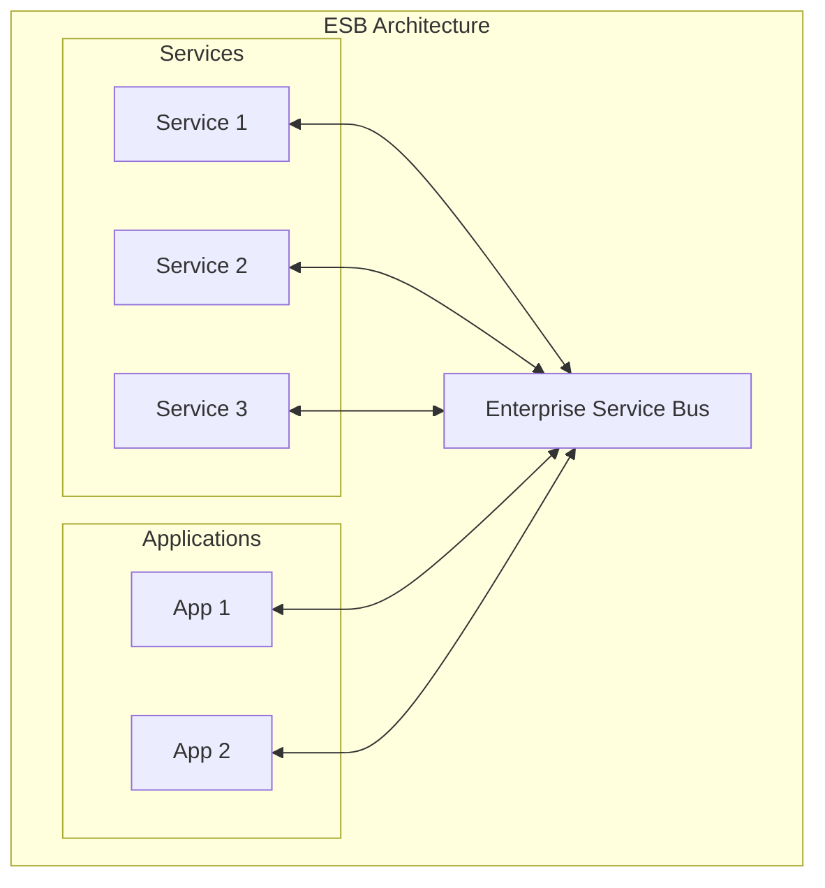
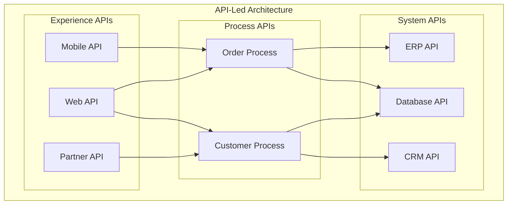
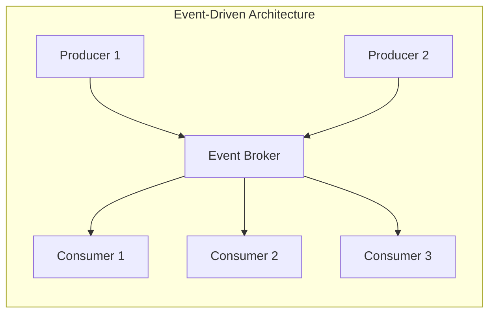

# Integration Architecture Overview

## Table of Contents

- [Introduction](#introduction)
- [What is Integration Architecture](#what-is-integration-architecture)
- [Integration Architecture Styles](#integration-architecture-styles)
- [Key Components](#key-components)
- [Integration Patterns](#integration-patterns)
- [Selection Criteria](#selection-criteria)
- [Best Practices](#best-practices)
- [Related Topics](#related-topics)

## Introduction

Integration architecture defines how different systems, applications, and services communicate and share data within an enterprise or across organizational boundaries. It establishes the patterns, protocols, and infrastructure needed for seamless data flow and process coordination.

## What is Integration Architecture

Integration architecture is a structured approach to connecting disparate systems, enabling them to:

- **Exchange data** in real-time or batch modes
- **Coordinate processes** across multiple applications
- **Share functionality** through well-defined interfaces
- **Maintain consistency** across distributed systems

## Integration Architecture Styles

### 1. Point-to-Point Integration

Direct connections between systems without intermediate layers.

| Aspect | Description |
|--------|-------------|
| **Complexity** | O(n²) connections as systems grow |
| **Coupling** | Tight coupling between systems |
| **Use Case** | Small number of systems (<5) |
| **Maintenance** | High - changes affect multiple connections |

### 2. Hub-and-Spoke (Integration Hub)

Centralized integration broker that mediates all communications.

| Aspect | Description |
|--------|-------------|
| **Complexity** | O(n) connections |
| **Coupling** | Loose coupling via hub |
| **Use Case** | Medium enterprises, centralized control |
| **Maintenance** | Moderate - centralized management |

### 3. Enterprise Service Bus (ESB)

Distributed integration infrastructure with routing, transformation, and orchestration capabilities.

| Aspect | Description |
|--------|-------------|
| **Features** | Routing, transformation, orchestration |
| **Coupling** | Loose coupling with service contracts |
| **Use Case** | Large enterprises, complex workflows |
| **Maintenance** | Requires specialized skills |

### 4. API-Led Connectivity

Three-tier API architecture separating concerns by API type.

| Layer | Purpose | Characteristics |
|-------|---------|-----------------|
| **Experience APIs** | Channel-specific interfaces | Optimized for consumers |
| **Process APIs** | Business logic orchestration | Reusable across channels |
| **System APIs** | System connectivity | Stable, rarely changing |

### 5. Event-Driven Architecture (EDA)

Asynchronous communication through events.

| Aspect | Description |
|--------|-------------|
| **Communication** | Asynchronous, loosely coupled |
| **Scalability** | High - independent scaling |
| **Use Case** | Real-time systems, microservices |
| **Complexity** | Event ordering, eventual consistency |

## Key Components

### Integration Middleware

| Component | Function | Examples |
|-----------|----------|----------|
| **Message Broker** | Asynchronous message delivery | RabbitMQ, Apache Kafka, Azure Service Bus |
| **API Gateway** | API management and security | Kong, Azure API Management, AWS API Gateway |
| **ESB** | Enterprise integration | MuleSoft, Dell Boomi, Azure Logic Apps |
| **iPaaS** | Cloud integration platform | Azure Integration Services, AWS AppFlow |

### Data Integration Components

| Component | Function | Use Case |
|-----------|----------|----------|
| **ETL Tools** | Extract, Transform, Load | Data warehousing |
| **CDC** | Change Data Capture | Real-time sync |
| **Data Virtualization** | Unified data access | Cross-system queries |

## Integration Patterns

### Communication Patterns

| Pattern | Description | When to Use |
|---------|-------------|-------------|
| **Request-Reply** | Synchronous call and response | Real-time queries |
| **Fire-and-Forget** | Asynchronous one-way | Notifications |
| **Publish-Subscribe** | One-to-many distribution | Event broadcasting |
| **Message Queue** | Point-to-point delivery | Work distribution |

### Data Patterns

| Pattern | Description | When to Use |
|---------|-------------|-------------|
| **Data Replication** | Copy data between systems | Offline access |
| **Data Federation** | Virtual unified view | Cross-system queries |
| **Event Sourcing** | Store state as events | Audit trails |
| **CQRS** | Separate read/write models | High-scale systems |

### Process Patterns

| Pattern | Description | When to Use |
|---------|-------------|-------------|
| **Orchestration** | Central coordinator | Complex workflows |
| **Choreography** | Distributed coordination | Microservices |
| **Saga** | Distributed transactions | Long-running processes |

## Selection Criteria

### Decision Matrix

| Factor | Point-to-Point | Hub-Spoke | ESB | API-Led | EDA |
|--------|---------------|-----------|-----|---------|-----|
| **Number of Systems** | <5 | 5-20 | 20+ | Any | Any |
| **Change Frequency** | Low | Medium | High | High | High |
| **Real-time Need** | ✅ | ✅ | ✅ | ✅ | ⚠️ |
| **Scalability** | ❌ | ⚠️ | ✅ | ✅ | ✅✅ |
| **Complexity** | Low | Medium | High | Medium | Medium |
| **Cost** | Low | Medium | High | Medium | Medium |

### Key Questions

1. **How many systems need integration?**
2. **What are the latency requirements?**
3. **How often do integrations change?**
4. **What is the skill level of the team?**
5. **What is the budget for integration infrastructure?**

## Best Practices

### Design Principles

1. **Loose Coupling** - Minimize dependencies between systems
2. **Contract-First** - Define interfaces before implementation
3. **Idempotency** - Handle duplicate messages gracefully
4. **Error Handling** - Implement retry, dead-letter, and alerting
5. **Observability** - Log, trace, and monitor all integrations

### Security Considerations

- **Authentication** - Verify identity of all participants
- **Authorization** - Enforce access control at integration points
- **Encryption** - Protect data in transit and at rest
- **Audit Logging** - Track all integration activities

### Operational Excellence

- **Version Management** - Support multiple API versions
- **Rate Limiting** - Protect systems from overload
- **Circuit Breaker** - Fail fast when dependencies are down
- **Health Checks** - Monitor integration health proactively

## Related Topics

- [Messaging Patterns](./event-driven-messaging/patterns/)
- [Queue vs Pub/Sub](./event-driven-messaging/comparisons/queue_vs_pubsub.md)
- [API Architecture](./api-architecture/)
- [Azure Integration Services](../../architecture-azure/integration/)
