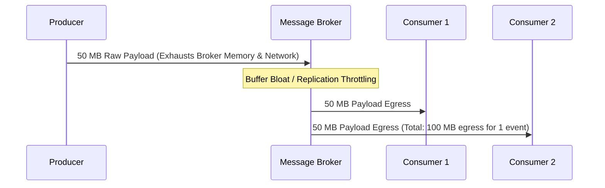
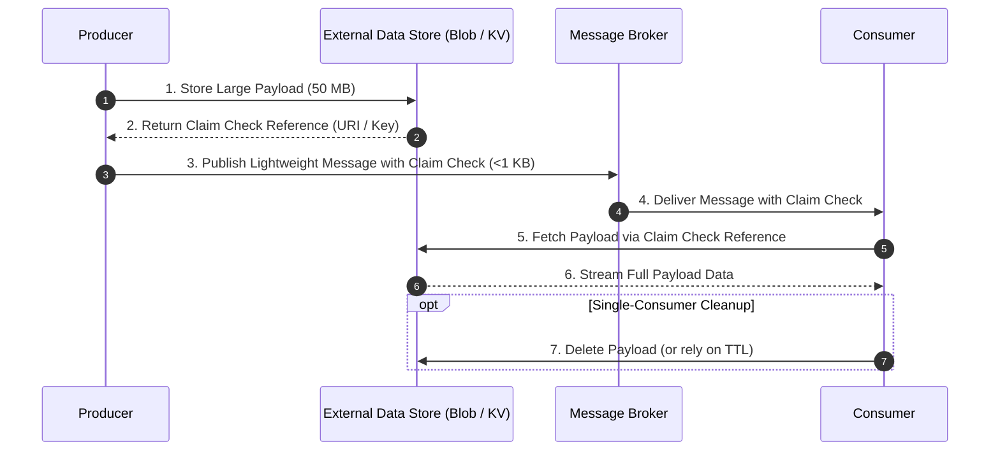
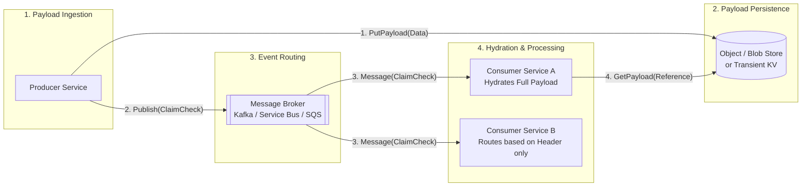

# Claim Check Pattern

> **Taxonomy Reference**: §3.3 Event-Driven & Messaging — Messaging Delivery Patterns (see [architecture_taxonomy_reference.md](../../10-practicality-taxonomy/architecture_taxonomy_reference.md))

## Table of Contents

- [Problem](#problem)
- [Solution](#solution)
- [Abstraction Level](#abstraction-level)
- [Architecture & Workflow](#architecture--workflow)
- [Claim Check Token Structure](#claim-check-token-structure)
- [Storage Implementation Options](#storage-implementation-options)
  - [1. Blob / Object Storage](#1-blob--object-storage)
  - [2. Low-Latency Key-Value Store / Cache](#2-low-latency-key-value-store--cache)
- [Lifecycle & Eviction Strategies](#lifecycle--eviction-strategies)
  - [Consumer-Deletes (Point-to-Point)](#1-consumer-deletes-point-to-point)
  - [TTL Auto-Eviction (Publish-Subscribe)](#2-ttl-auto-eviction-publish-subscribe)
  - [Scheduled Purge / Sweeper Job](#3-scheduled-purge--sweeper-job)
- [Security & Access Control](#security--access-control)
- [Implementation Considerations](#implementation-considerations)
- [When to Use](#when-to-use)
- [When NOT to Use](#when-not-to-use)
- [Failure Scenarios & Mitigations](#failure-scenarios--mitigations)
- [Trade-offs](#trade-offs)
- [Related Patterns](#related-patterns)
- [Platform-Specific Implementations](#platform-specific-implementations)
  - [Azure Implementation](#azure-implementation)
  - [AWS Implementation](#aws-implementation)
  - [Apache Kafka Implementation](#apache-kafka-implementation)

---

## Problem

Message brokers (such as Apache Kafka, Azure Service Bus, RabbitMQ, and AWS SQS) are optimized for high-throughput, low-latency transmission of high-volume, small-to-medium-sized messages. Transmitting large payloads (e.g., high-resolution media, PDF invoices, large JSON/XML datasets, or machine learning tensors) directly through message brokers introduces severe operational bottlenecks:

1. **Broker Hard Message Limits**: Most brokers enforce strict maximum payload limits:
   - AWS SQS: 256 KB
   - Azure Service Bus: 1 MB (Standard) / 100 MB (Premium)
   - Apache Kafka: 1 MB default (`max.message.bytes` / `message.max.bytes`)
   - RabbitMQ: Degrades rapidly above tens of megabytes
2. **Broker Memory & Disk Pressure**: Storing multi-megabyte payloads in active broker memory exhausts JVM heap buffers and page caches, drastically reducing throughput for all other queues/topics sharing the cluster.
3. **Bandwidth & Serialization Overhead**: Large messages increase network I/O during broker replication (e.g., across 3 Kafka in-sync replicas), compounding lag across all consumers.
4. **Fanout Amplification**: In Publish-Subscribe topologies with 10 consumers, transmitting a 50 MB payload directly over the broker consumes 500 MB of outbound network egress bandwidth.



---

## Solution

The **Claim Check Pattern** (originating from Enterprise Integration Patterns) separates the **data payload** from the **message routing signal**:

1. The **Producer** stores the large binary or structured payload in an external, scalable, and cost-effective data store (such as Azure Blob Storage, Amazon S3, Google Cloud Storage, or a transient Redis Key-Value store).
2. The data store returns a **reference key, URL, or pointer** (the *claim check*).
3. The Producer publishes a lightweight message containing only the claim check reference and essential routing metadata to the message broker.
4. The **Consumer(s)** receive the lightweight message from the broker, inspect routing headers, and use the claim check token to retrieve the full payload from the external store only when required.



---

## Abstraction Level

<!-- From Taxonomy §10 -->
- [ ] Conceptual (Strategic)
- [x] Logical (Design)
- [x] Physical (Implementation)
- [x] Runtime (Operational)

---

## Architecture & Workflow



### End-to-End Processing Steps

1. **Payload Extraction**: The producer detects that the outbound message exceeds the broker's optimal payload threshold (e.g., >256 KB).
2. **External Write**: The producer writes the body to the external data store using a globally unique key (`UUIDv7` or hash-based ID).
3. **Envelope Construction**: The producer builds an envelope containing metadata (event type, source, timestamp, correlation ID) and the claim check reference.
4. **Broker Publish**: The producer sends the tiny envelope to the message queue or topic.
5. **Consumer Routing / Filtering**: Downstream consumers filter or route based on header attributes without downloading the large payload.
6. **Payload Hydration**: The target consumer reads the payload using direct streaming/chunking from the data store.
7. **Lifecycle Management**: The stored object is either deleted immediately by the consumer or expired automatically by storage lifecycle policies.

---

## Claim Check Token Structure

A production-grade Claim Check message envelope contains essential metadata for retrieval, validation, and security:

```json
{
  "specversion": "1.0",
  "id": "evt-01J6M7K9ABCDEF12345678",
  "type": "com.company.media.video.transcoded",
  "source": "/transcoder/job-9842",
  "time": "2026-08-23T20:15:30Z",
  "datacontenttype": "application/json",
  "data": {
    "claimCheck": {
      "storageType": "azure-blob",
      "endpoint": "https://mystorageacct.blob.core.windows.net",
      "container": "transcoded-video-payloads",
      "blobName": "2026/08/23/job-9842-manifest.json",
      "contentLengthBytes": 48291048,
      "sha256Checksum": "e3b0c44298fc1c149afbf4c8996fb92427ae41e4649b934ca495991b7852b855",
      "expiresAt": "2026-08-24T20:15:30Z"
    },
    "summary": {
      "jobId": "job-9842",
      "status": "COMPLETED",
      "renditionCount": 6
    }
  }
}
```

---

## Storage Implementation Options

| Storage Type | Characteristics | Best Used For |
|:---|:---|:---|
| **Blob / Object Storage**<br/>(Azure Blob, AWS S3, GCS) | - High capacity, low cost per GB<br/>- Built-in multi-region replication<br/>- Native lifecycle / TTL policies<br/>- Direct streaming for gigabyte files | - Heavy documents (PDFs, images, videos)<br/>- Batch data extracts and database dumps<br/>- Payloads > 10 MB |
| **Low-Latency KV Cache**<br/>(Redis, Cosmos DB, DynamoDB) | - Sub-millisecond read/write latency<br/>- Native TTL key expiration<br/>- High IOPS per second | - Fast-path telemetry tokens<br/>- Ephemeral RPC callback payloads<br/>- Payloads between 256 KB and 10 MB |

### 1. Blob / Object Storage
- **Throughput**: Scales linearly with partition prefix naming.
- **Cost**: Extremely low storage costs; minimal egress costs when producers, broker, and consumers reside in the same cloud region.

### 2. Low-Latency Key-Value Store / Cache
- **Throughput**: Extremely high request concurrency.
- **Auto-Cleanup**: Setting a native TTL (e.g., `EXPIRE key 86400`) ensures zero storage leaks without requiring background batch sweepers.

---

## Lifecycle & Eviction Strategies

Managing the lifecycle of external payloads is critical to preventing unbounded storage costs and broken reference links:

```
[ Eviction Strategy Selection ]
               |
               v
  Is it Point-to-Point or Pub/Sub?
       /                      \
      / (Point-to-Point)       \ (Pub/Sub)
     v                          v
Consumer-Deletes          TTL Auto-Eviction
(Consumer deletes         (Storage lifecycle policy
 immediately upon ack)    deletes after max SLA window)
```

### 1. Consumer-Deletes (Point-to-Point)
- **Applicability**: Point-to-point queues with exactly one competing consumer.
- **Mechanism**: Once the consumer successfully processes the message and commits the queue offset, it sends a `DeleteObject` command to the storage store.
- **Risk**: If the consumer crashes before deletion, redelivery requires idempotent handling.

### 2. TTL Auto-Eviction (Publish-Subscribe)
- **Applicability**: Fanout topics with multiple independent consumer groups.
- **Mechanism**: The producer configures an object expiration policy (e.g., 24 hours to 7 days) or a TTL on the key.
- **Benefit**: Producers and consumers do not need to coordinate deletion; the storage service purges objects automatically after all subscriber groups have had time to consume them.

### 3. Scheduled Purge / Sweeper Job
- **Applicability**: Complex workflows with failure dead-letter queues.
- **Mechanism**: A background job scans metadata registries for unreferenced or dead-lettered claim checks and archives or purges orphaned blobs.

---

## Security & Access Control

Passing data outside the message broker requires robust security boundaries:

1. **Pre-Signed URLs / Shared Access Signatures (SAS)**:
   - Producers can generate short-lived, read-only pre-signed URLs (e.g., valid for 1 hour) embedded within the message.
   - Consumers do not need broad administrative credentials to the entire storage container, adhering to the principle of least privilege.
2. **Envelope Encryption**:
   - The producer encrypts the payload with a symmetric key (e.g., AES-256-GCM) before writing to blob storage.
   - The symmetric key is encrypted with an asymmetric Key Encryption Key (via Azure Key Vault or AWS KMS) and passed inside the message envelope.
3. **Payload Integrity Validation**:
   - The producer includes a cryptographic hash (`SHA-256`) in the message header. The consumer computes the hash upon download to verify that the payload was not tampered with.

---

## Implementation Considerations

1. **Payload Threshold Tuning**: Do not use claim checks for tiny messages (<64 KB). The overhead of two network round-trips (Write to Blob + Read from Blob) outweighs broker memory savings. Set an adaptive threshold (e.g., claim check triggered only if `payload.length > 256 KB`).
2. **Dual-Write Consistency**: Writing to storage and publishing to the message broker is a dual-write scenario. If the broker publish fails, the stored payload becomes orphaned (handled via TTL). If the storage write fails, the message must not be published.
3. **Consumer Lag vs. Storage TTL**: Ensure the storage TTL exceeds the maximum permissible consumer lag / DLQ retry window. If a consumer is stopped for maintenance for 48 hours and the storage TTL is 24 hours, the consumer will encounter HTTP 404 errors upon resumption.

---

## When to Use

- **Payloads Exceeding Broker Limits**: Transmitting documents, high-res images, video files, or bulk datasets that exceed broker quotas (e.g., >1 MB in Kafka or >256 KB in SQS).
- **High Fanout with Large Messages**: Publishing messages to multiple subscribers where duplicating the body across all consumer streams would saturate network links.
- **Transient Telemetry Decoupling**: High-volume event pipelines (such as digital ad tracking) where rich tracking URLs and verification payloads can be hydrated asynchronously while client devices pass only lightweight reference tokens.
- **Cost Optimization**: Message broker storage (especially managed cloud tiers with strict RAM allocations) is significantly more expensive per gigabyte than cloud object storage.

---

## When NOT to Use

- **High-Velocity Micro-Payloads**: Messages under 100 KB where direct broker throughput is superior and additional storage round-trips would increase end-to-end latency.
- **Strictly Atomic Single-System Transactions**: Systems requiring instant atomic rollback across message and body without handling orphan payload cleanup.
- **Real-Time Ultra-Low-Latency Audio/Video Streams**: Live WebRTC or low-latency audio packet routing where milliseconds matter and disk/blob latency is unacceptable.

---

## Failure Scenarios & Mitigations

| Failure Mode | Root Cause | Architectural Mitigation |
|:---|:---|:---|
| **Orphaned Payload Blobs** | Producer writes to blob storage, but crashes before publishing to broker | Use storage lifecycle rules (e.g., delete unconfirmed blobs after 24h) or embed payload writing in an Outbox workflow. |
| **Premature Deletion (HTTP 404)** | Slow consumer lag causes storage TTL to expire before consumer reads message | Set storage TTL to 2–3× the maximum queue DLQ retention window (e.g., 7 days). |
| **Payload Tampering / Corruption** | Intermediate network corruption or unauthorized modification in storage | Include SHA-256 content checksum in message headers; verify hash before processing. |
| **Storage Outage During Hydration** | External blob store experiences temporary throttling or regional unavailability | Implement exponential backoff retry in consumer; do not ack/commit message until hydration and processing succeed. |

---

## Trade-offs

| Advantage | Trade-off / Cost |
|:---|:---|
| **Eliminates broker message size ceilings** (supports multi-gigabyte payloads) | **Increased latency**: Adds two external network hops (store write and store read) |
| **Reduces broker memory footprint & network transit costs** | **Dual-store operational overhead**: Requires managing both message broker and external storage lifecycle |
| **Optimizes fanout egress**: Brokers only replicate lightweight tokens | **Consistency management**: Must handle orphaned payloads and reference synchronization |

---

## Related Patterns

- [Transactional Outbox Pattern](outbox-pattern.md): Guarantees atomic database persistence and claim check message emission without dual-write inconsistency.
- [Idempotency Store Pattern](idempotency-store-pattern.md): Ensures repeated consumer hydration of the same claim check produces exactly-once side effects.
- [Content Enricher](enterprise-integration-patterns/04-message-transformation-patterns.md#content-enricher): The inverse pattern, where a lightweight event is expanded with external data.
- [Reference Token Pattern](../../reference-dictionary/architecture-patterns.md#transient-metadata-registry): The client-side counterpart for telemetry and opaque tokens.

---

## Platform-Specific Implementations

### Azure Implementation

In Microsoft Azure, the Claim Check pattern is commonly implemented using **Azure Service Bus** or **Azure Event Grid** combined with **Azure Blob Storage**:

```csharp
// Producer: Upload payload to Blob Storage and send Service Bus Message with Claim Check
public async Task SendClaimCheckMessageAsync(byte[] largePayload, string messageType)
{
    string blobName = $"{Guid.NewGuid()}.dat";
    BlobClient blobClient = _containerClient.GetBlobClient(blobName);

    // 1. Upload payload to Azure Blob Storage
    using (var stream = new MemoryStream(largePayload))
    {
        await blobClient.UploadAsync(stream, overwrite: true);
    }

    // 2. Build message containing Claim Check URL
    ServiceBusMessage message = new ServiceBusMessage
    {
        Subject = messageType,
        ApplicationProperties =
        {
            ["ClaimCheckBlobUri"] = blobClient.Uri.ToString(),
            ["PayloadSizeBytes"] = largePayload.Length
        }
    };

    // 3. Send lightweight reference message to Service Bus
    await _serviceBusSender.SendMessageAsync(message);
}
```

> **Azure Reference**: See [Azure Service Bus Messaging Patterns](../../../architecture-azure/integration/service-bus/azure_service_bus_messaging_patterns.md) for enterprise Service Bus topologies.

### AWS Implementation

- **AWS SQS Extended Client Library for Java / Python**: Automatically manages S3 payload offloading and hydration for payloads exceeding 256 KB transparently to application code.

### Apache Kafka Implementation

- Kafka producers upload payloads exceeding `max.request.size` to S3/GCS or Redis and populate a custom header `X-Claim-Check-URI`, enabling standard Kafka consumers to conditionally hydrate payloads.
