# Enterprise Integration Patterns (EIP)

## Table of Contents

- [Introduction](#introduction)
- [Messaging System Patterns](#messaging-system-patterns)
- [Message Construction Patterns](#message-construction-patterns)
- [Message Routing Patterns](#message-routing-patterns)
- [Message Transformation Patterns](#message-transformation-patterns)
- [Messaging Endpoint Patterns](#messaging-endpoint-patterns)
- [System Management Patterns](#system-management-patterns)

## Introduction

Enterprise Integration Patterns (EIP) are a collection of design patterns for integrating enterprise applications. Originally documented by Gregor Hohpe and Bobby Woolf, these patterns provide proven solutions for common integration challenges.

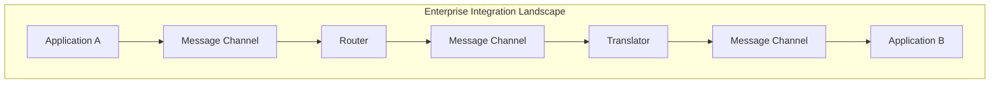

## Messaging System Patterns

### Message Channel

A virtual pipe that connects sender and receiver.

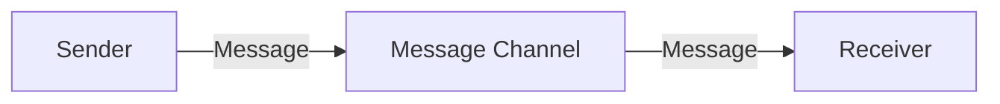

**Channel Types:**

| Type | Description | Use Case |
|------|-------------|----------|
| **Point-to-Point** | Single receiver | Work distribution |
| **Publish-Subscribe** | Multiple receivers | Event broadcasting |
| **Datatype Channel** | Specific message types | Type safety |
| **Invalid Message Channel** | Error messages | Error handling |
| **Dead Letter Channel** | Undeliverable messages | Troubleshooting |

### Message

The data packet transferred through the messaging system.

```json
{
  "header": {
    "messageId": "msg-123",
    "correlationId": "corr-456",
    "timestamp": "2025-01-01T10:00:00Z",
    "contentType": "application/json",
    "replyTo": "reply-queue"
  },
  "body": {
    "orderId": "ORD-001",
    "items": [...]
  }
}
```

### Pipes and Filters

Process messages through a sequence of processing steps.

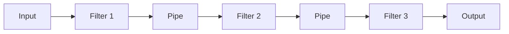

**Benefits:**
- Reusable components
- Independent testing
- Flexible composition
- Parallel processing

### Message Router

Route messages to different channels based on conditions.

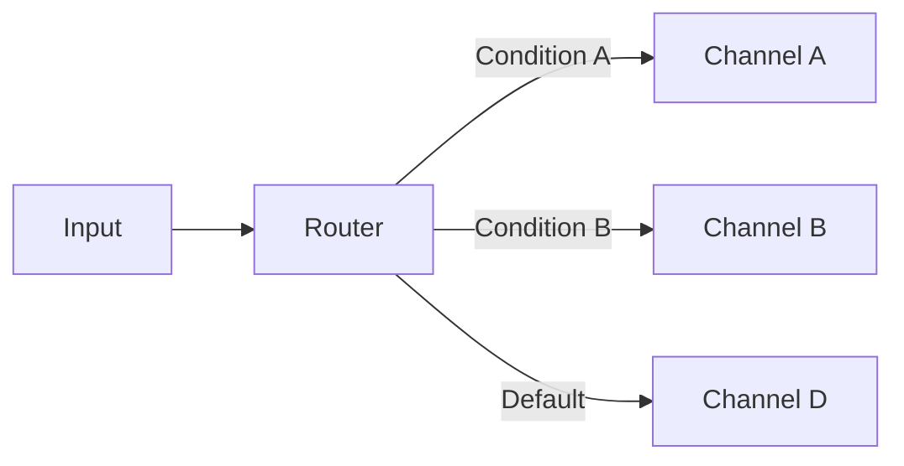

### Message Translator

Convert message format between systems.

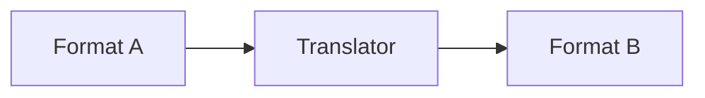

### Message Endpoint

Application code that connects to the messaging system.

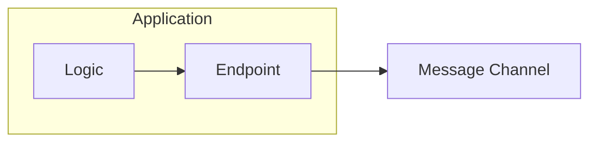

## Message Construction Patterns

### Command Message

Request an action to be performed.

```json
{
  "type": "command",
  "command": "CreateOrder",
  "payload": {
    "customerId": "CUST-123",
    "items": [...]
  }
}
```

### Document Message

Transfer data between systems.

```json
{
  "type": "document",
  "documentType": "Invoice",
  "payload": {
    "invoiceNumber": "INV-001",
    "lineItems": [...],
    "total": 1500.00
  }
}
```

### Event Message

Notify about something that happened.

```json
{
  "type": "event",
  "eventType": "OrderShipped",
  "timestamp": "2025-01-01T15:00:00Z",
  "payload": {
    "orderId": "ORD-001",
    "trackingNumber": "TRK-123"
  }
}
```

### Request-Reply

Two-way communication with response.

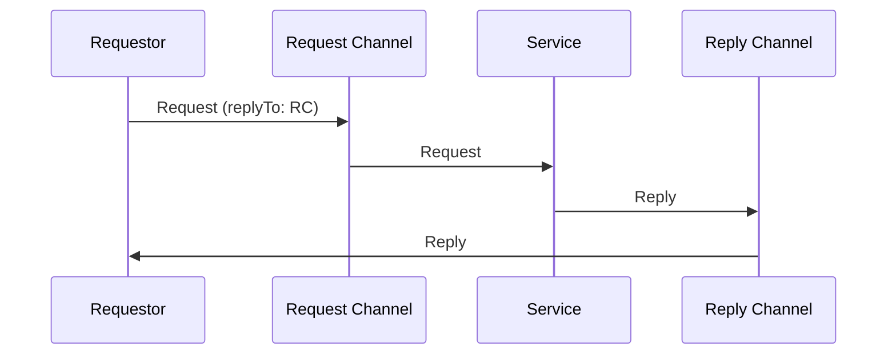

### Return Address

Specify where to send the reply.

```json
{
  "header": {
    "replyTo": "orders/replies",
    "correlationId": "req-123"
  },
  "body": {...}
}
```

### Correlation Identifier

Match replies with requests.

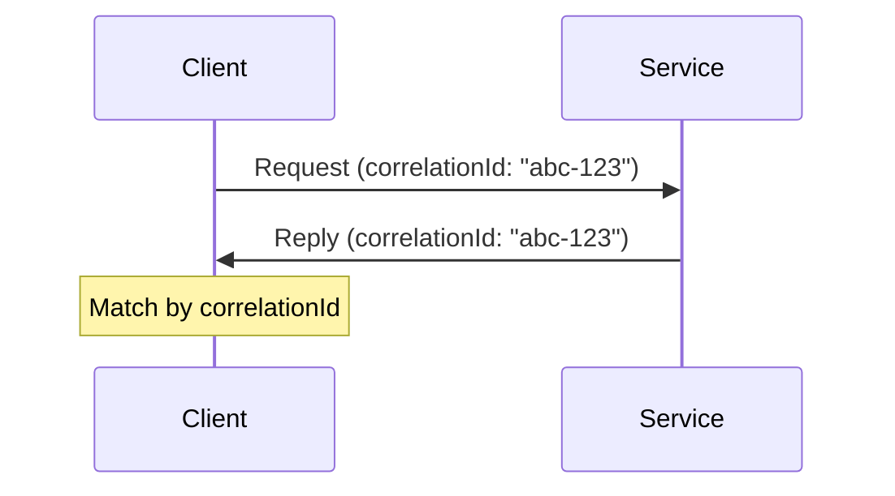

### Message Sequence

Break large data into ordered messages.

```json
// Message 1 of 3
{
  "sequenceId": "batch-001",
  "sequenceNumber": 1,
  "sequenceSize": 3,
  "payload": {...}
}
```

### Message Expiration

Set message time-to-live.

```json
{
  "header": {
    "expiresAt": "2025-01-01T12:00:00Z",
    "ttl": 3600
  },
  "body": {...}
}
```

## Message Routing Patterns

### Content-Based Router

Route based on message content.

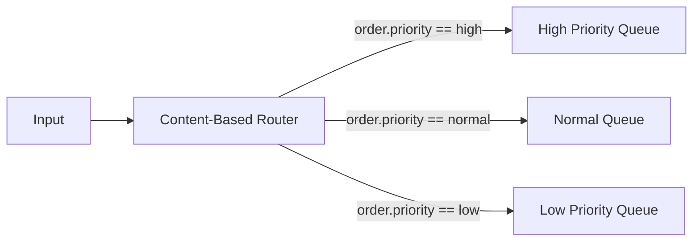

```python
def route(message):
    priority = message.body.order.priority
    routing_table = {
        "high": "high-priority-queue",
        "normal": "normal-queue",
        "low": "low-priority-queue"
    }
    return routing_table.get(priority, "default-queue")
```

### Message Filter

Remove unwanted messages.

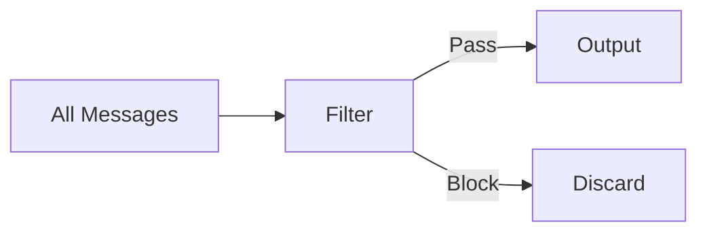

### Dynamic Router

Route based on external configuration.

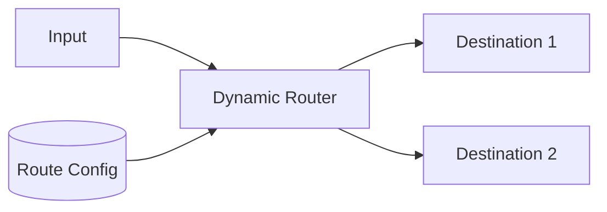

### Recipient List

Send to multiple recipients.

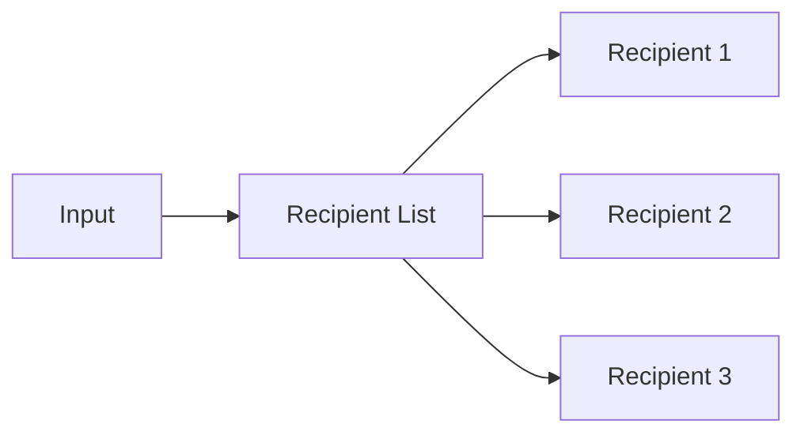

### Splitter

Break composite message into parts.

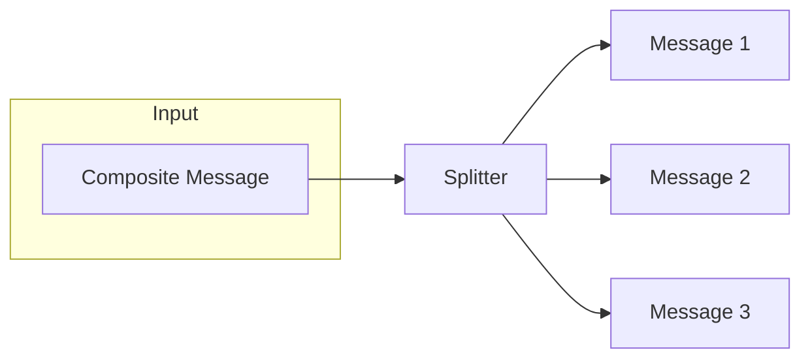

### Aggregator

Combine related messages.

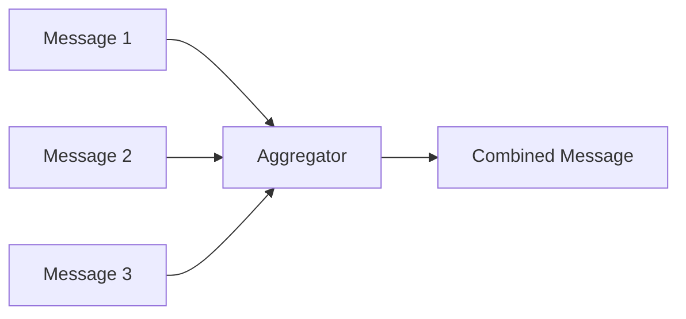

**Completion Strategies:**

| Strategy | Description |
|----------|-------------|
| **Wait for All** | All correlated messages received |
| **First** | First message received |
| **Timeout** | Time limit reached |
| **Custom Condition** | Business logic determines completion |

### Resequencer

Restore message order.

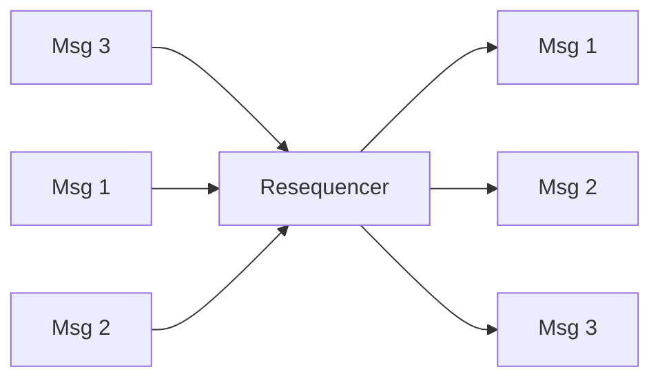

### Composed Message Processor

Process composite messages as a unit.

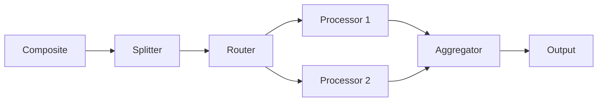

### Scatter-Gather

Broadcast to multiple recipients and aggregate responses.

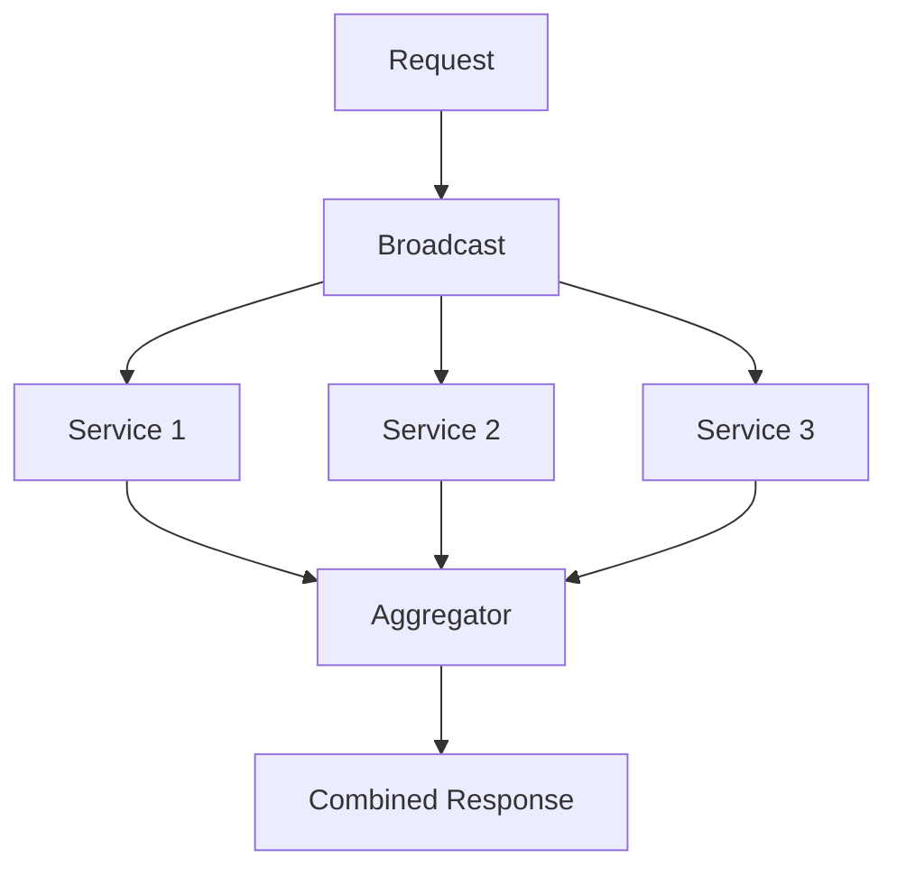

### Routing Slip

Define message route dynamically.

```json
{
  "routingSlip": ["step1", "step2", "step3"],
  "currentStep": 0,
  "payload": {...}
}
```

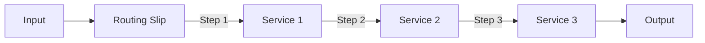

### Process Manager

Maintain state of multi-step processing.

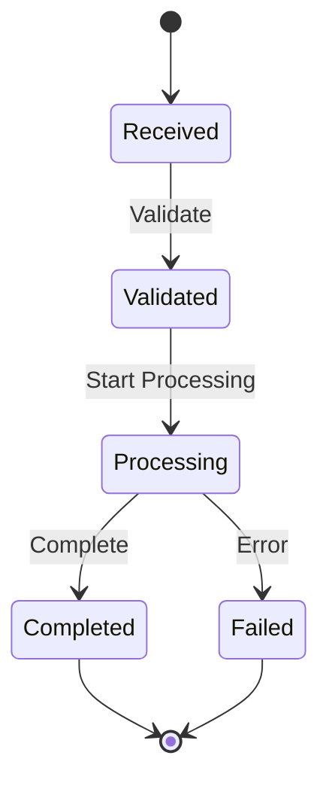

## Message Transformation Patterns

### Envelope Wrapper

Wrap message in standard envelope.

```json
{
  "envelope": {
    "version": "1.0",
    "timestamp": "2025-01-01T10:00:00Z",
    "source": "system-a",
    "correlationId": "corr-123"
  },
  "payload": {
    "actualContent": "..."
  }
}
```

### Content Enricher

Add data from external sources.

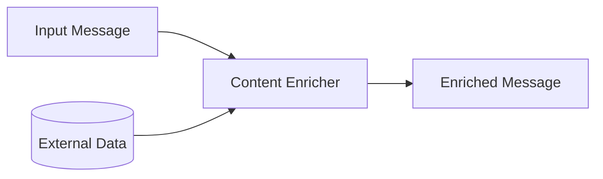

### Content Filter

Remove unnecessary data.

```mermaid
graph LR
    I[Full Message] --> CF[Content Filter]
    CF --> O[Filtered Message]
```

### Claim Check

Store large data externally.

```mermaid
sequenceDiagram
    participant P as Producer
    participant DS as Data Store
    participant MB as Message Broker
    participant C as Consumer
    
    P->>DS: Store Large Payload
    DS->>P: Claim Check (Reference)
    P->>MB: Message with Claim Check
    MB->>C: Message with Claim Check
    C->>DS: Retrieve (Claim Check)
    DS->>C: Large Payload
```

### Normalizer

Convert various formats to canonical form.

```mermaid
graph TB
    F1[Format 1] --> N[Normalizer]
    F2[Format 2] --> N
    F3[Format 3] --> N
    N --> CF[Canonical Format]
```

### Canonical Data Model

Standard data format across systems.

```mermaid
graph TB
    subgraph "Without Canonical Model"
        A1[System A] <-->|AB| B1[System B]
        A1 <-->|AC| C1[System C]
        B1 <-->|BC| C1
    end
    
    subgraph "With Canonical Model"
        A2[System A] <-->|A-CDM| CDM[Canonical Model]
        B2[System B] <-->|B-CDM| CDM
        C2[System C] <-->|C-CDM| CDM
    end
```

## Messaging Endpoint Patterns

### Messaging Gateway

Encapsulate messaging access.

```mermaid
graph LR
    subgraph "Application"
        L[Business Logic] --> G[Gateway]
    end
    G --> MS[Messaging System]
```

### Messaging Mapper

Map between domain and message objects.

```python
class OrderMapper:
    def to_message(self, order: Order) -> Message:
        return Message(
            body={
                "orderId": order.id,
                "items": [self.item_to_dict(i) for i in order.items],
                "total": str(order.total)
            }
        )
    
    def from_message(self, message: Message) -> Order:
        return Order(
            id=message.body["orderId"],
            items=[self.dict_to_item(i) for i in message.body["items"]],
            total=Decimal(message.body["total"])
        )
```

### Transactional Client

Coordinate messaging with transactions.

```mermaid
sequenceDiagram
    participant A as Application
    participant DB as Database
    participant MB as Message Broker
    
    A->>A: Begin Transaction
    A->>DB: Update Data
    A->>MB: Send Message
    A->>A: Commit Transaction
```

### Polling Consumer

Explicitly request messages.

```python
while True:
    message = queue.receive(timeout=30)
    if message:
        process(message)
        message.acknowledge()
```

### Event-Driven Consumer

React to message arrival.

```python
@message_handler("orders-queue")
def handle_order(message):
    process(message)
    return Acknowledge
```

### Competing Consumers

Multiple consumers on same queue.

```mermaid
graph LR
    Q[Queue] --> C1[Consumer 1]
    Q --> C2[Consumer 2]
    Q --> C3[Consumer 3]
```

### Message Dispatcher

Distribute messages to handlers.

```mermaid
graph LR
    MC[Message Channel] --> D[Dispatcher]
    D -->|Type A| HA[Handler A]
    D -->|Type B| HB[Handler B]
    D -->|Type C| HC[Handler C]
```

### Selective Consumer

Filter messages before consuming.

```python
@message_handler("orders-queue", 
                 filter="priority = 'high'")
def handle_high_priority(message):
    process(message)
```

### Durable Subscriber

Survive disconnections.

```mermaid
sequenceDiagram
    participant S as Subscriber
    participant B as Broker
    
    S->>B: Subscribe (durable=true)
    S->>S: Disconnect
    Note over B: Store messages
    S->>B: Reconnect
    B->>S: Deliver stored messages
```

### Idempotent Receiver

Handle duplicates safely.

```python
processed_ids = set()

def process_message(message):
    if message.id in processed_ids:
        return  # Already processed
    
    do_work(message)
    processed_ids.add(message.id)
```

## System Management Patterns

### Control Bus

Manage messaging system.

```mermaid
graph TB
    CB[Control Bus]
    CB -->|Configure| C1[Component 1]
    CB -->|Monitor| C2[Component 2]
    CB -->|Control| C3[Component 3]
```

### Detour

Route messages through additional steps.

```mermaid
graph LR
    I[Input] --> S{Detour?}
    S -->|Yes| D[Detour Step]
    D --> N[Normal Route]
    S -->|No| N
    N --> O[Output]
```

### Wire Tap

Inspect messages non-intrusively.

```mermaid
graph LR
    I[Input] --> WT[Wire Tap]
    WT --> O[Output]
    WT -->|Copy| M[Monitor]
```

### Message History

Track message journey.

```json
{
  "header": {
    "history": [
      {"step": "received", "timestamp": "...", "node": "gateway"},
      {"step": "validated", "timestamp": "...", "node": "validator"},
      {"step": "routed", "timestamp": "...", "node": "router"}
    ]
  },
  "body": {...}
}
```

### Message Store

Persist messages for retrieval.

```mermaid
graph LR
    P[Producer] --> MS[Message Store]
    MS --> C[Consumer]
    MS --> DB[(Database)]
```

### Smart Proxy

Track and manage request-reply.

```mermaid
graph LR
    C[Client] --> SP[Smart Proxy]
    SP --> S[Service]
    S --> SP
    SP --> C
```

### Test Message

Verify system health.

```mermaid
graph LR
    TG[Test Generator] -->|Test Message| S[System]
    S -->|Result| TV[Test Verifier]
```

## Related Topics

- [Messaging Patterns Overview](../messaging-patterns-overview.md)
- [Integration Architecture](../../integration-architecture-overview.md)
- [Event-Driven Architecture](./event-driven-architecture.md)
