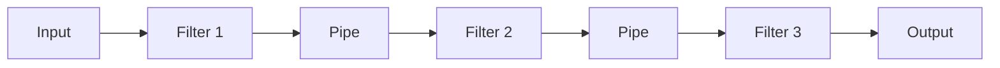
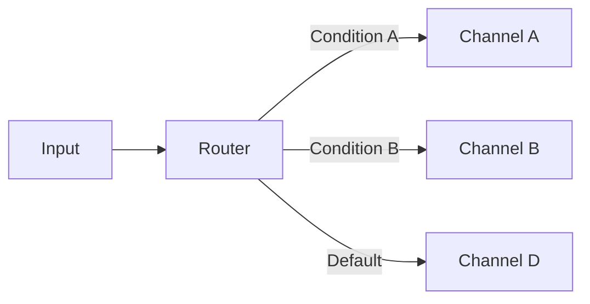
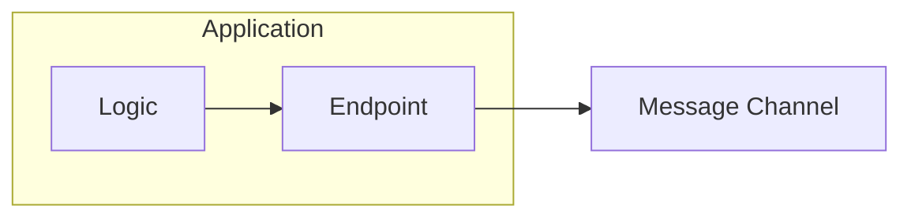

# Messaging System Patterns

Core patterns for messaging infrastructure that enable communication between distributed systems.

## Table of Contents

- [Message Channel](#message-channel)
- [Message](#message)
- [Pipes and Filters](#pipes-and-filters)
- [Message Router](#message-router)
- [Message Translator](#message-translator)
- [Message Endpoint](#message-endpoint)

---

## Message Channel

A virtual pipe that connects sender and receiver.


### Channel Types

| Type | Description | Use Case |
|------|-------------|----------|
| **Point-to-Point** | Single receiver | Work distribution |
| **Publish-Subscribe** | Multiple receivers | Event broadcasting |
| **Datatype Channel** | Specific message types | Type safety |
| **Invalid Message Channel** | Error messages | Error handling |
| **Dead Letter Channel** | Undeliverable messages | Troubleshooting |

### Real-World Scenario

An e-commerce platform uses Point-to-Point channels for order processing (one worker handles each order), Pub/Sub for inventory updates (multiple systems need to know), and Dead Letter channels for failed payment notifications requiring manual review.

---

## Message

The data packet transferred through the messaging system.

```json
{
  "header": {
    "messageId": "msg-123",
    "correlationId": "corr-456",
    "timestamp": "2025-01-01T10:00:00Z",
    "contentType": "application/json",
    "replyTo": "reply-queue"
  },
  "body": {
    "orderId": "ORD-001",
    "items": [...]
  }
}
```

### Real-World Scenario

A banking system includes correlation IDs in every transaction message, allowing support teams to trace a customer's wire transfer across fraud detection, compliance checking, and ledger update services.

---

## Pipes and Filters

Process messages through a sequence of processing steps.



### Benefits

- Reusable components
- Independent testing
- Flexible composition
- Parallel processing

### Real-World Scenario

An email processing system passes messages through: Spam Filter → Virus Scanner → Content Classifier → Priority Tagger → Folder Router. Each filter is independently deployable and testable.

---

## Message Router

Route messages to different channels based on conditions.



### Real-World Scenario

A logistics company routes shipment requests to different carriers: FedEx for overnight packages, USPS for standard mail, and freight companies for large items—all based on package weight and delivery speed.

---

## Message Translator

Convert message format between systems.


### Real-World Scenario

A hospital system translates HL7 v2 messages from legacy lab equipment into FHIR JSON format for the modern patient portal, enabling old and new systems to communicate seamlessly.

---

## Message Endpoint

Application code that connects to the messaging system.



### Real-World Scenario

A microservices application uses a standardized endpoint library that handles connection pooling, retry logic, and circuit breakers, so developers focus on business logic rather than messaging infrastructure.

---

## Related Topics

- [Message Construction Patterns](./02-message-construction-patterns.md)
- [Message Routing Patterns](./03-message-routing-patterns.md)
- [EIP Overview](./README.md)
