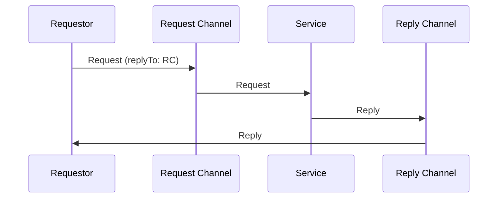
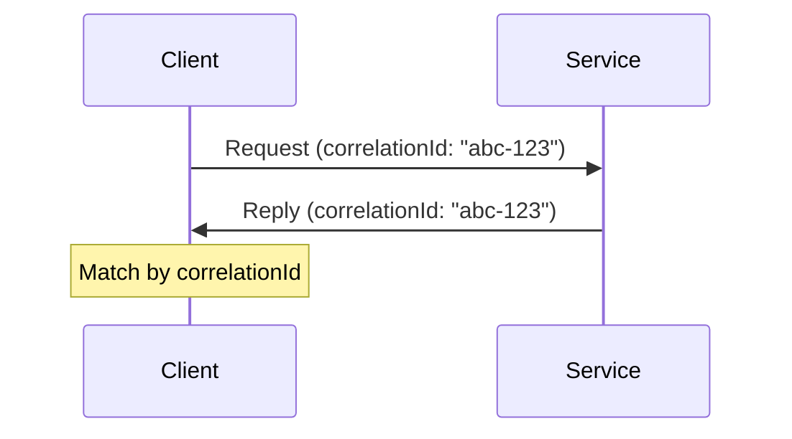

# Message Construction Patterns

Patterns for building and structuring messages for different communication needs.

## Table of Contents

- [Command Message](#command-message)
- [Document Message](#document-message)
- [Event Message](#event-message)
- [Request-Reply](#request-reply)
- [Return Address](#return-address)
- [Correlation Identifier](#correlation-identifier)
- [Message Sequence](#message-sequence)
- [Message Expiration](#message-expiration)

---

## Command Message

Request an action to be performed.

```json
{
  "type": "command",
  "command": "CreateOrder",
  "payload": {
    "customerId": "CUST-123",
    "items": [...]
  }
}
```

### Real-World Scenario

A food delivery app sends a `PrepareOrder` command to the restaurant's kitchen display system, triggering chefs to start cooking when a customer completes checkout.

---

## Document Message

Transfer data between systems.

```json
{
  "type": "document",
  "documentType": "Invoice",
  "payload": {
    "invoiceNumber": "INV-001",
    "lineItems": [...],
    "total": 1500.00
  }
}
```

### Real-World Scenario

An insurance company transfers complete policy documents between the underwriting system and the claims system, including all coverage details, beneficiaries, and terms.

---

## Event Message

Notify about something that happened.

```json
{
  "type": "event",
  "eventType": "OrderShipped",
  "timestamp": "2025-01-01T15:00:00Z",
  "payload": {
    "orderId": "ORD-001",
    "trackingNumber": "TRK-123"
  }
}
```

### Real-World Scenario

A stock trading platform publishes `TradeExecuted` events whenever a trade completes, allowing portfolio trackers, tax calculators, and notification services to react independently.

---

## Request-Reply

Two-way communication with response.



### Real-World Scenario

A travel booking website sends a flight availability request to an airline's reservation system and waits for availability and pricing response before showing results to the customer.

---

## Return Address

Specify where to send the reply.

```json
{
  "header": {
    "replyTo": "orders/replies",
    "correlationId": "req-123"
  },
  "body": {...}
}
```

### Real-World Scenario

A distributed order system specifies different reply addresses for web orders (web-replies queue) vs. mobile orders (mobile-replies queue) so responses are routed to the correct frontend.

---

## Correlation Identifier

Match replies with requests.



### Real-World Scenario

A call center system uses correlation IDs to match customer callback requests with agent responses, ensuring the right agent receives the customer's original inquiry context.

---

## Message Sequence

Break large data into ordered messages.

```json
{
  "sequenceId": "batch-001",
  "sequenceNumber": 1,
  "sequenceSize": 3,
  "payload": {...}
}
```

### Real-World Scenario

A video streaming service uploads large video files in 100MB chunks with sequence numbers, allowing the encoding service to reassemble them in order even if chunks arrive out of sequence.

---

## Message Expiration

Set message time-to-live.

```json
{
  "header": {
    "expiresAt": "2025-01-01T12:00:00Z",
    "ttl": 3600
  },
  "body": {...}
}
```

### Real-World Scenario

A flash sale system sets 5-minute TTL on discount offers—if the inventory service can't process in time, the offer expires automatically rather than honoring stale prices.

---

## Related Topics

- [Messaging System Patterns](./01-messaging-system-patterns.md)
- [Message Routing Patterns](./03-message-routing-patterns.md)
- [EIP Overview](./README.md)
