# Message Routing Patterns

Patterns for directing message flow through the system based on content, rules, or dynamic configuration.

## Table of Contents

- [Content-Based Router](#content-based-router)
- [Message Filter](#message-filter)
- [Dynamic Router](#dynamic-router)
- [Recipient List](#recipient-list)
- [Splitter](#splitter)
- [Aggregator](#aggregator)
- [Resequencer](#resequencer)
- [Composed Message Processor](#composed-message-processor)
- [Scatter-Gather](#scatter-gather)
- [Routing Slip](#routing-slip)
- [Process Manager](#process-manager)

---

## Content-Based Router

Route based on message content.

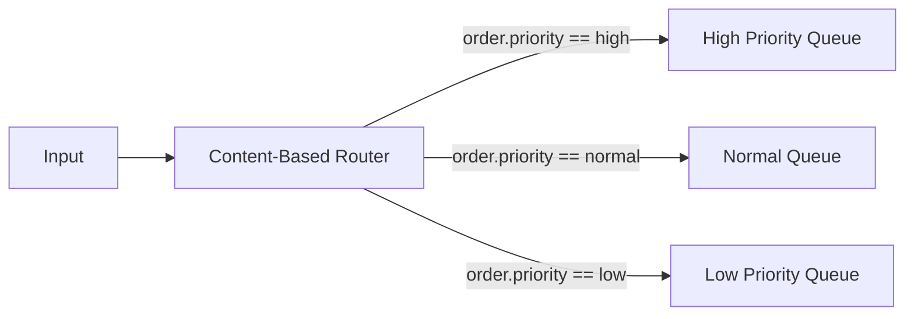

```python
def route(message):
    priority = message.body.order.priority
    routing_table = {
        "high": "high-priority-queue",
        "normal": "normal-queue",
        "low": "low-priority-queue"
    }
    return routing_table.get(priority, "default-queue")
```

### Real-World Scenario

An e-commerce platform routes orders by region: US orders go to US fulfillment center, EU orders to EU warehouse, and APAC orders to Singapore hub—based on the shipping address country.

---

## Message Filter

Remove unwanted messages.

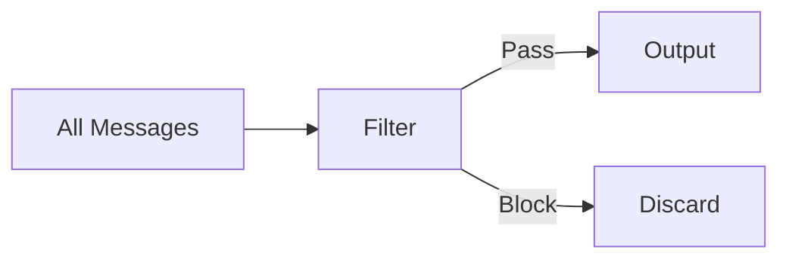

### Real-World Scenario

A social media analytics pipeline filters out bot-generated tweets (based on account age and posting frequency) before sentiment analysis, reducing processing costs by 40%.

---

## Dynamic Router

Route based on external configuration.

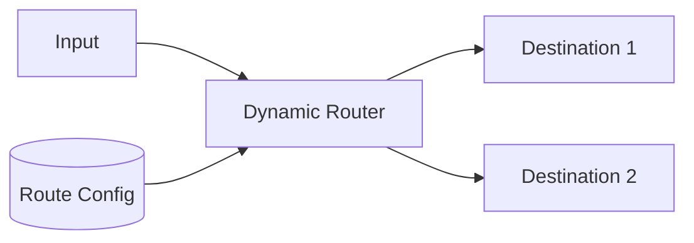

### Real-World Scenario

A multi-tenant SaaS platform routes customer data to different processing pipelines based on their subscription tier, configured in a database that can be updated without redeployment.

---

## Recipient List

Send to multiple recipients.

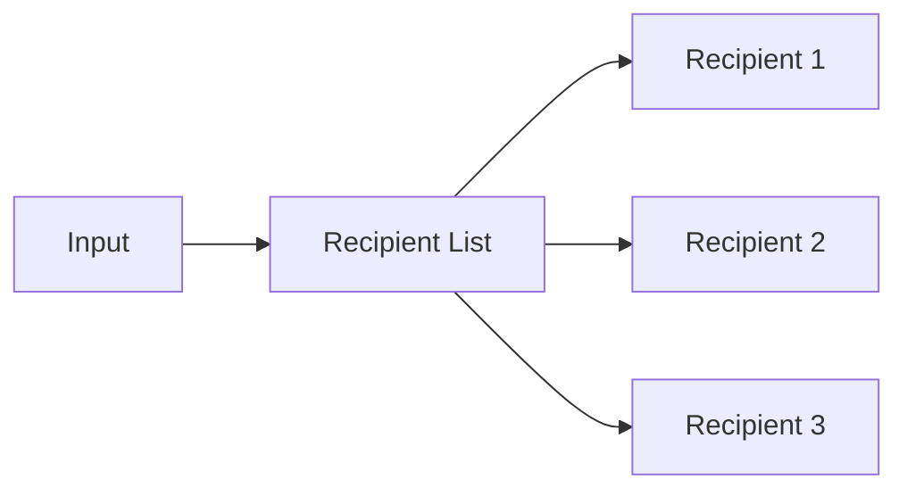

### Real-World Scenario

When a customer places an order, the order confirmation is sent to: email service, SMS service, mobile push notification, and the customer's account history—all determined by their communication preferences.

---

## Splitter

Break composite message into parts.

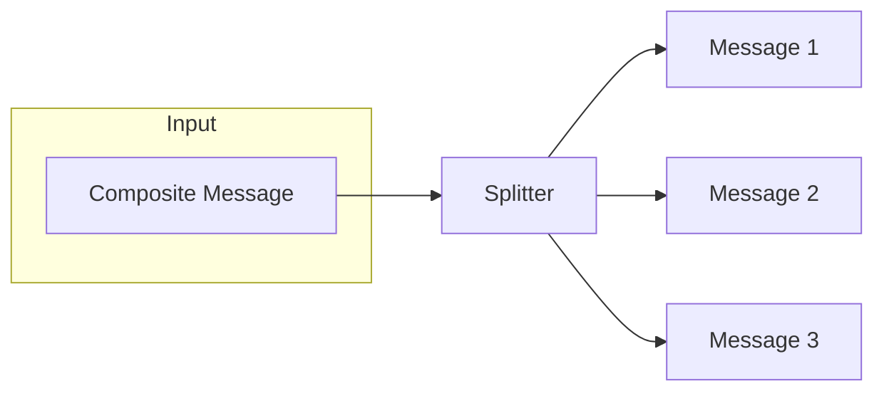

### Real-World Scenario

An e-commerce order with 5 items is split into 5 separate messages, each sent to the appropriate warehouse (electronics, clothing, books) for parallel fulfillment.

---

## Aggregator

Combine related messages.

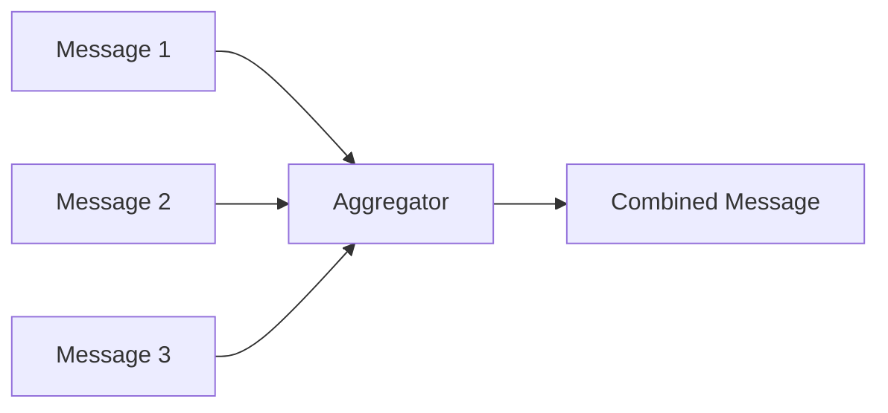

### Completion Strategies

| Strategy | Description |
|----------|-------------|
| **Wait for All** | All correlated messages received |
| **First** | First message received |
| **Timeout** | Time limit reached |
| **Custom Condition** | Business logic determines completion |

### Real-World Scenario

A price comparison website sends requests to 10 airline APIs, aggregates responses with a 3-second timeout, and returns the best prices found—even if some airlines don't respond in time.

---

## Resequencer

Restore message order.

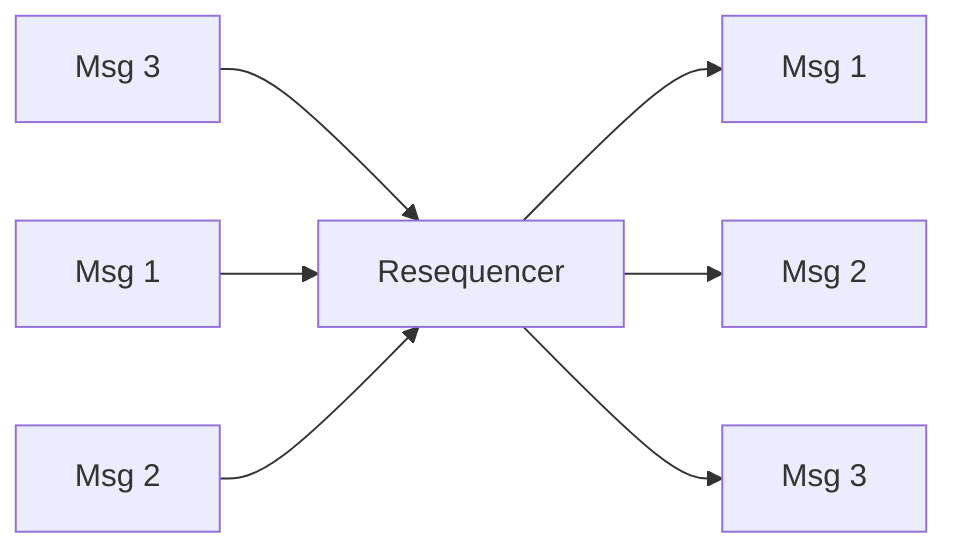

### Real-World Scenario

A financial trading system receives market data packets over UDP (which may arrive out of order) and resequences them by timestamp before feeding to the trading algorithm.

---

## Composed Message Processor

Process composite messages as a unit.

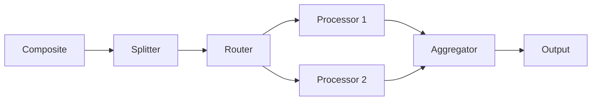

### Real-World Scenario

An insurance quote request is split by coverage type (auto, home, life), routed to specialized underwriting engines, then aggregated into a single bundled quote for the customer.

---

## Scatter-Gather

Broadcast to multiple recipients and aggregate responses.

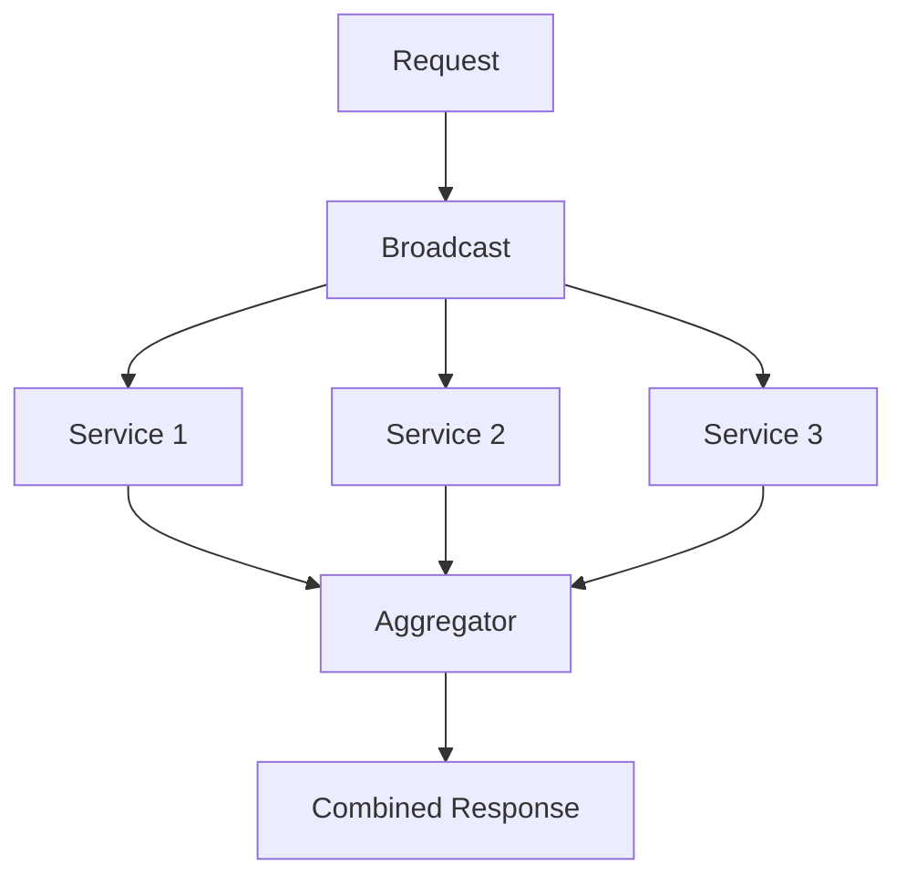

### Real-World Scenario

A hotel booking site broadcasts availability requests to 50 hotels simultaneously, gathers responses, and presents the customer with a sorted list by price within 2 seconds.

---

## Routing Slip

Define message route dynamically.

```json
{
  "routingSlip": ["step1", "step2", "step3"],
  "currentStep": 0,
  "payload": {...}
}
```

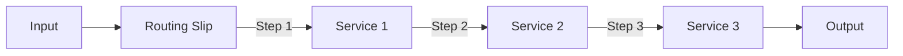

### Real-World Scenario

A loan application flows through Credit Check → Income Verification → Collateral Evaluation → Final Approval, with the route defined at submission based on loan type (mortgage vs. personal).

---

## Process Manager

Maintain state of multi-step processing.

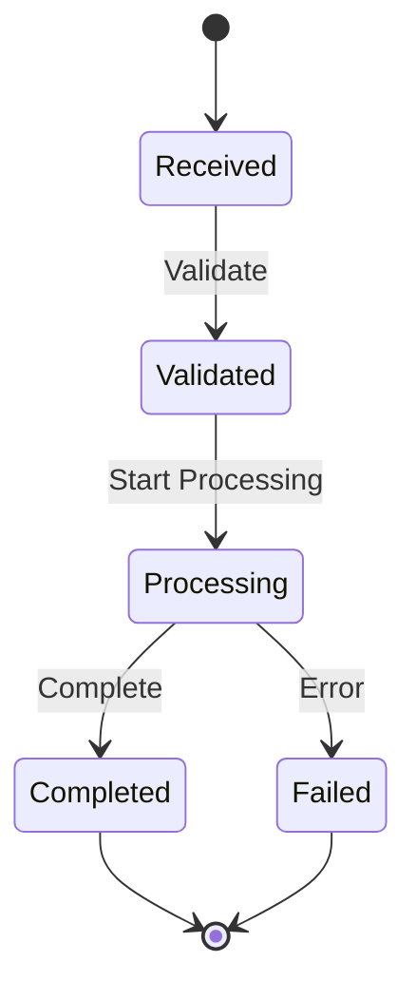

### Real-World Scenario

An order fulfillment saga tracks state across: Order Created → Payment Authorized → Inventory Reserved → Shipped → Delivered, handling compensations if any step fails.

---

## Related Topics

- [Message Construction Patterns](./02-message-construction-patterns.md)
- [Message Transformation Patterns](./04-message-transformation-patterns.md)
- [EIP Overview](./README.md)
