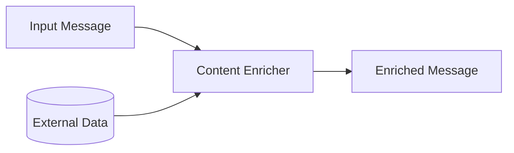
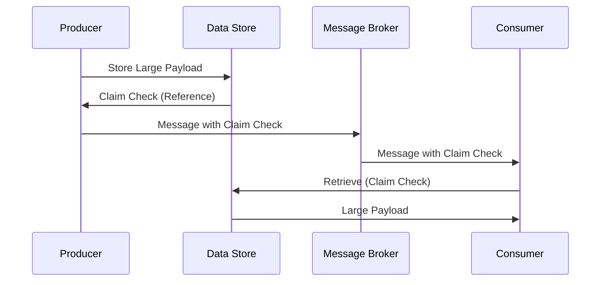
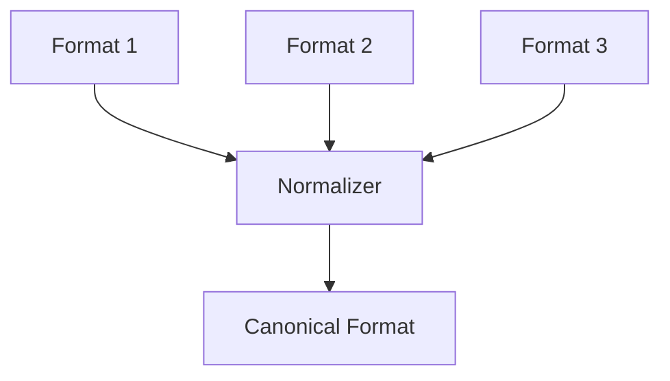
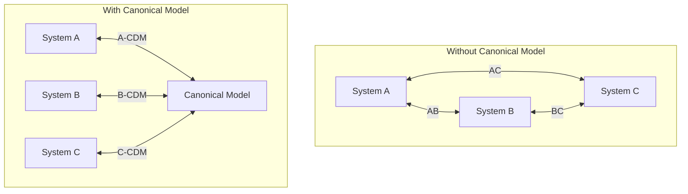

# Message Transformation Patterns

Patterns for modifying message content, structure, and format as they flow through the system.

## Table of Contents

- [Envelope Wrapper](#envelope-wrapper)
- [Content Enricher](#content-enricher)
- [Content Filter](#content-filter)
- [Claim Check](#claim-check)
- [Normalizer](#normalizer)
- [Canonical Data Model](#canonical-data-model)

---

## Envelope Wrapper

Wrap message in standard envelope.

```json
{
  "envelope": {
    "version": "1.0",
    "timestamp": "2025-01-01T10:00:00Z",
    "source": "system-a",
    "correlationId": "corr-123"
  },
  "payload": {
    "actualContent": "..."
  }
}
```

### Real-World Scenario

A B2B integration gateway wraps partner-specific payloads in a standard envelope containing authentication tokens, timestamps, and routing information before transmission.

---

## Content Enricher

Add data from external sources.



### Real-World Scenario

An order message containing only customer ID is enriched with full customer profile (name, address, loyalty tier) from the CRM database before reaching the fulfillment service.

---

## Content Filter

Remove unnecessary data.


### Real-World Scenario

A GDPR-compliant analytics pipeline strips PII (names, emails, addresses) from user events before sending to the data warehouse, keeping only anonymized behavioral data.

---

## Claim Check

Store large data externally.



### Real-World Scenario

A document processing service stores 50MB PDF files in blob storage and passes only the blob reference through the message queue, avoiding broker size limits and improving throughput.

---

## Normalizer

Convert various formats to canonical form.



### Real-World Scenario

A retail company receives product data from suppliers in CSV, XML, and JSON formats—the normalizer converts all to a standard JSON schema before inventory processing.

---

## Canonical Data Model

Standard data format across systems.



### Benefits

| Aspect | Without CDM | With CDM |
|--------|-------------|----------|
| **Integrations** | N × (N-1) / 2 | N |
| **New System** | N-1 new integrations | 1 new integration |
| **Maintenance** | High complexity | Centralized |

### Real-World Scenario

A healthcare network defines a canonical patient record format—each hospital system (Epic, Cerner, custom) translates to/from this format, avoiding N×N integration complexity.

---

## Related Topics

- [Message Routing Patterns](./03-message-routing-patterns.md)
- [Messaging Endpoint Patterns](./05-messaging-endpoint-patterns.md)
- [EIP Overview](./README.md)
