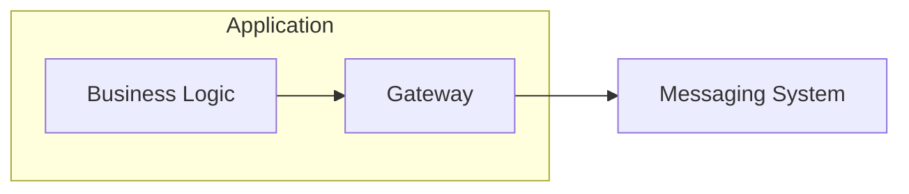
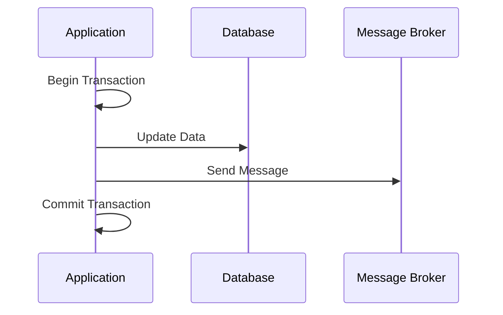
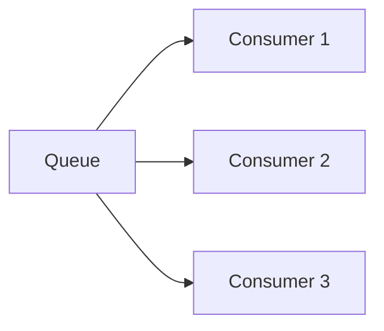
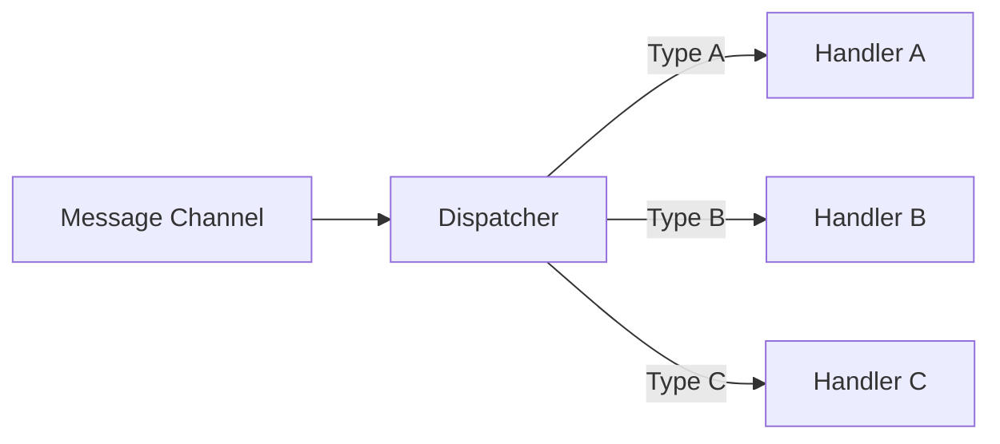
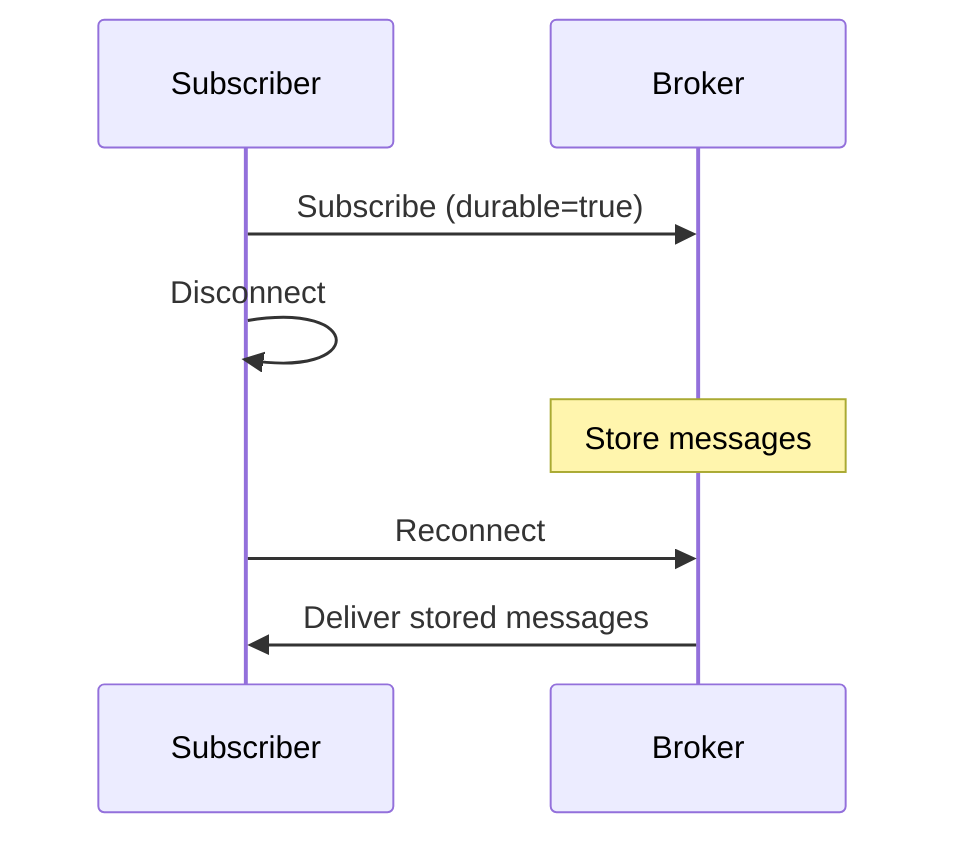

# Messaging Endpoint Patterns

Patterns for connecting applications to messaging systems.

## Table of Contents

- [Messaging Gateway](#messaging-gateway)
- [Messaging Mapper](#messaging-mapper)
- [Transactional Client](#transactional-client)
- [Polling Consumer](#polling-consumer)
- [Event-Driven Consumer](#event-driven-consumer)
- [Competing Consumers](#competing-consumers)
- [Message Dispatcher](#message-dispatcher)
- [Selective Consumer](#selective-consumer)
- [Durable Subscriber](#durable-subscriber)
- [Idempotent Receiver](#idempotent-receiver)

---

## Messaging Gateway

Encapsulate messaging access.



### Real-World Scenario

A payment service exposes a simple `processPayment(order)` method to developers—internally, the gateway handles message serialization, queue selection, retries, and acknowledgments.

---

## Messaging Mapper

Map between domain and message objects.

```python
class OrderMapper:
    def to_message(self, order: Order) -> Message:
        return Message(
            body={
                "orderId": order.id,
                "items": [self.item_to_dict(i) for i in order.items],
                "total": str(order.total)
            }
        )
    
    def from_message(self, message: Message) -> Order:
        return Order(
            id=message.body["orderId"],
            items=[self.dict_to_item(i) for i in message.body["items"]],
            total=Decimal(message.body["total"])
        )
```

### Real-World Scenario

An e-commerce service maps between rich `Order` domain objects (with calculated fields, validation) and flat JSON message structures suitable for cross-service communication.

---

## Transactional Client

Coordinate messaging with transactions.



### Real-World Scenario

A banking system ensures that account debit and transfer notification message are atomic—either both succeed or both rollback, preventing customers from being notified about failed transfers.

---

## Polling Consumer

Explicitly request messages.

```python
while True:
    message = queue.receive(timeout=30)
    if message:
        process(message)
        message.acknowledge()
```

### Real-World Scenario

A batch processing system polls for new data files every 5 minutes, processes them during off-peak hours, giving the team control over resource usage and processing timing.

---

## Event-Driven Consumer

React to message arrival.

```python
@message_handler("orders-queue")
def handle_order(message):
    process(message)
    return Acknowledge
```

### Real-World Scenario

A real-time fraud detection system immediately processes each transaction as it arrives, triggering alerts within milliseconds of suspicious activity detection.

---

## Competing Consumers

Multiple consumers on same queue.



### Scaling Characteristics

| Aspect | Description |
|--------|-------------|
| **Load Balancing** | Messages distributed across consumers |
| **Horizontal Scaling** | Add more consumers for higher throughput |
| **Fault Tolerance** | Other consumers continue if one fails |
| **Order** | No guaranteed order across consumers |

### Real-World Scenario

An order processing system runs 10 consumer instances on the same queue—during Black Friday, it scales to 100 instances, with orders automatically distributed across all workers.

---

## Message Dispatcher

Distribute messages to handlers.



### Real-World Scenario

A notification service dispatcher routes messages to the appropriate handler: EmailHandler for email notifications, SMSHandler for texts, and PushHandler for mobile alerts.

---

## Selective Consumer

Filter messages before consuming.

```python
@message_handler("orders-queue", 
                 filter="priority = 'high'")
def handle_high_priority(message):
    process(message)
```

### Real-World Scenario

A premium support queue has consumers that only pick up messages where `customer.tier = 'platinum'`, ensuring VIP customers get dedicated fast-track processing.

---

## Durable Subscriber

Survive disconnections.



### Real-World Scenario

A mobile app's push notification subscriber maintains durability—when a user's phone is offline for hours, all missed notifications are delivered once connectivity is restored.

---

## Idempotent Receiver

Handle duplicates safely.

```python
processed_ids = set()

def process_message(message):
    if message.id in processed_ids:
        return  # Already processed
    
    do_work(message)
    processed_ids.add(message.id)
```

### Implementation Strategies

| Strategy | Description |
|----------|-------------|
| **In-Memory Set** | Fast but loses state on restart |
| **Database Table** | Persistent, handles restarts |
| **Distributed Cache** | Shared across instances |
| **Natural Idempotency** | Design operations to be inherently idempotent |

### Real-World Scenario

A payment processor tracks processed transaction IDs—if a network retry causes the same payment message to arrive twice, the duplicate is detected and ignored, preventing double charges.

---

## Related Topics

- [Message Transformation Patterns](./04-message-transformation-patterns.md)
- [System Management Patterns](./06-system-management-patterns.md)
- [EIP Overview](./README.md)
