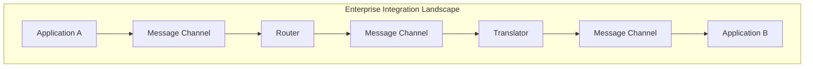

# Enterprise Integration Patterns (EIP)

## Overview

Enterprise Integration Patterns (EIP) are a collection of design patterns for integrating enterprise applications. Originally documented by Gregor Hohpe and Bobby Woolf, these patterns provide proven solutions for common integration challenges.

## Pattern Categories

| Category | Description | Patterns |
|----------|-------------|----------|
| [Messaging System Patterns](./01-messaging-system-patterns.md) | Core messaging infrastructure | Message Channel, Message, Pipes and Filters, Router, Translator, Endpoint |
| [Message Construction Patterns](./02-message-construction-patterns.md) | Building messages | Command, Document, Event, Request-Reply, Correlation |
| [Message Routing Patterns](./03-message-routing-patterns.md) | Directing message flow | Content-Based Router, Splitter, Aggregator, Scatter-Gather |
| [Message Transformation Patterns](./04-message-transformation-patterns.md) | Modifying messages | Envelope Wrapper, Content Enricher, Claim Check, Normalizer |
| [Messaging Endpoint Patterns](./05-messaging-endpoint-patterns.md) | Application connections | Gateway, Mapper, Polling Consumer, Competing Consumers |
| [System Management Patterns](./06-system-management-patterns.md) | Operations and monitoring | Control Bus, Wire Tap, Message History, Test Message |

## Quick Pattern Reference

### By Use Case

| Need | Pattern | Category |
|------|---------|----------|
| Route by content | Content-Based Router | Routing |
| Combine messages | Aggregator | Routing |
| Split batch into items | Splitter | Routing |
| Add external data | Content Enricher | Transformation |
| Handle large payloads | Claim Check | Transformation |
| Scale consumers | Competing Consumers | Endpoint |
| Handle duplicates | Idempotent Receiver | Endpoint |
| Monitor message flow | Wire Tap | System Management |
| Track message journey | Message History | System Management |

## Related Topics

- [Messaging Patterns Overview](../messaging-patterns-overview.md)
- [Integration Architecture](../../integration-architecture-overview.md)
- [Event-Driven Architecture](../event-driven-messaging/patterns/event-driven-architecture.md)
