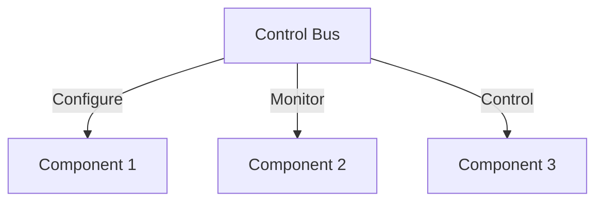
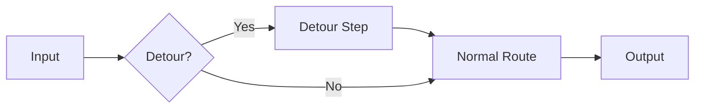
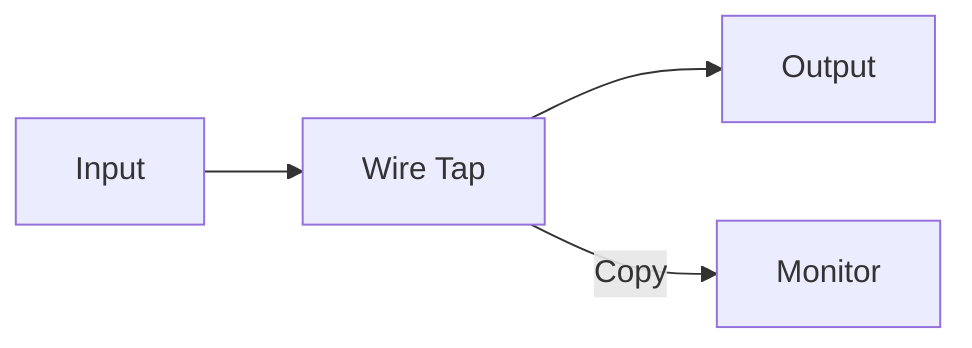
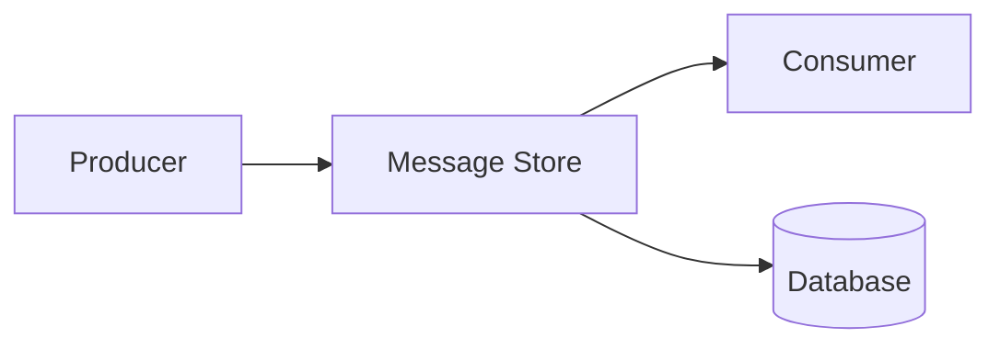
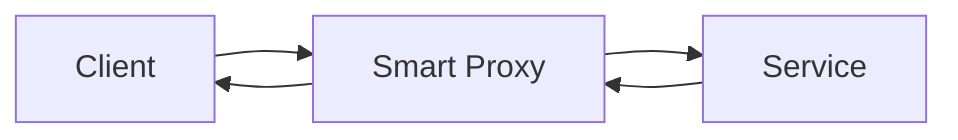
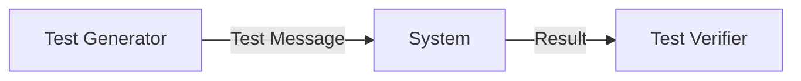

# System Management Patterns

Patterns for operating, monitoring, and troubleshooting messaging systems.

## Table of Contents

- [Control Bus](#control-bus)
- [Detour](#detour)
- [Wire Tap](#wire-tap)
- [Message History](#message-history)
- [Message Store](#message-store)
- [Smart Proxy](#smart-proxy)
- [Test Message](#test-message)

---

## Control Bus

Manage messaging system.



### Capabilities

| Operation | Description |
|-----------|-------------|
| **Configure** | Update settings at runtime |
| **Monitor** | Gather metrics and health status |
| **Control** | Start, stop, pause components |
| **Route** | Modify routing rules dynamically |

### Real-World Scenario

A DevOps team uses a control bus to dynamically adjust log levels, enable/disable features, and update routing rules across 50 microservices without redeployment.

---

## Detour

Route messages through additional steps.



### Real-World Scenario

During a suspected data quality issue, ops enables a detour to route all orders through an additional validation service, then disables it once the issue is resolved.

---

## Wire Tap

Inspect messages non-intrusively.



### Use Cases

| Purpose | Description |
|---------|-------------|
| **Debugging** | Inspect message content in development |
| **Auditing** | Log messages for compliance |
| **Analytics** | Feed messages to analytics pipeline |
| **Testing** | Capture messages for test verification |

### Real-World Scenario

A compliance team wire-taps the trading message flow to copy all order messages to an audit system for regulatory reporting, without impacting trading system performance.

---

## Message History

Track message journey.

```json
{
  "header": {
    "history": [
      {"step": "received", "timestamp": "...", "node": "gateway"},
      {"step": "validated", "timestamp": "...", "node": "validator"},
      {"step": "routed", "timestamp": "...", "node": "router"}
    ]
  },
  "body": {...}
}
```

### Real-World Scenario

A customer support system includes message history showing the ticket's journey: Received (Web Portal) → Classified (AI Triage) → Assigned (Support Team) → Resolved (Agent), with timestamps for SLA tracking.

---

## Message Store

Persist messages for retrieval.



### Benefits

| Benefit | Description |
|---------|-------------|
| **Replay** | Reprocess messages after failures |
| **Audit** | Historical record for compliance |
| **Analytics** | Query message history |
| **Debugging** | Inspect past messages |

### Real-World Scenario

An email marketing platform stores all outbound campaign messages in a message store, enabling resend capabilities, campaign analytics, and compliance audits months later.

---

## Smart Proxy

Track and manage request-reply.



### Capabilities

| Feature | Description |
|---------|-------------|
| **Correlation** | Match requests with responses |
| **Timeout** | Handle slow responses |
| **Retry** | Retry failed requests |
| **Circuit Breaker** | Fail fast when service is down |

### Real-World Scenario

An API gateway acts as a smart proxy for backend services—tracking all pending requests, implementing timeouts, correlating responses, and handling retries transparently.

---

## Test Message

Verify system health.



### Implementation

```python
class HealthChecker:
    def send_test_message(self):
        test_msg = Message(
            type="test",
            payload={"timestamp": now(), "id": uuid()},
            ttl=60
        )
        
        start = time.time()
        send(test_msg)
        response = wait_for_response(test_msg.id, timeout=30)
        latency = time.time() - start
        
        if response and latency < threshold:
            return HealthStatus.HEALTHY
        return HealthStatus.UNHEALTHY
```

### Real-World Scenario

A payment processing system sends synthetic test transactions every minute through the entire pipeline, alerting the on-call team if any test fails to complete within expected time.

---

## Related Topics

- [Messaging Endpoint Patterns](./messaging-endpoint-patterns.md)
- [Messaging System Patterns](./messaging-system-patterns.md)
- [EIP Overview](./README.md)
