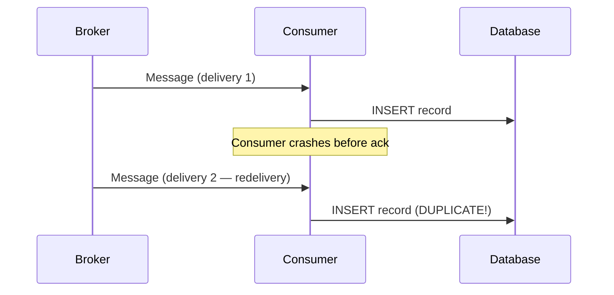
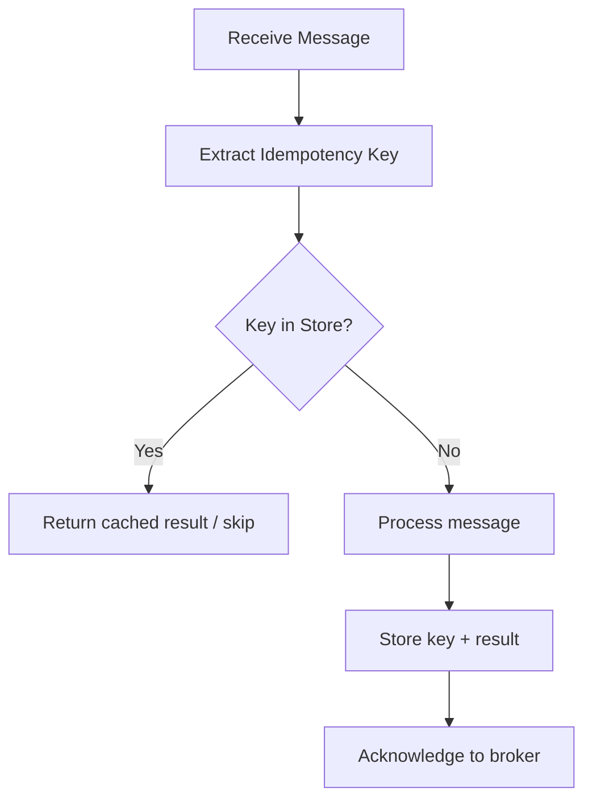
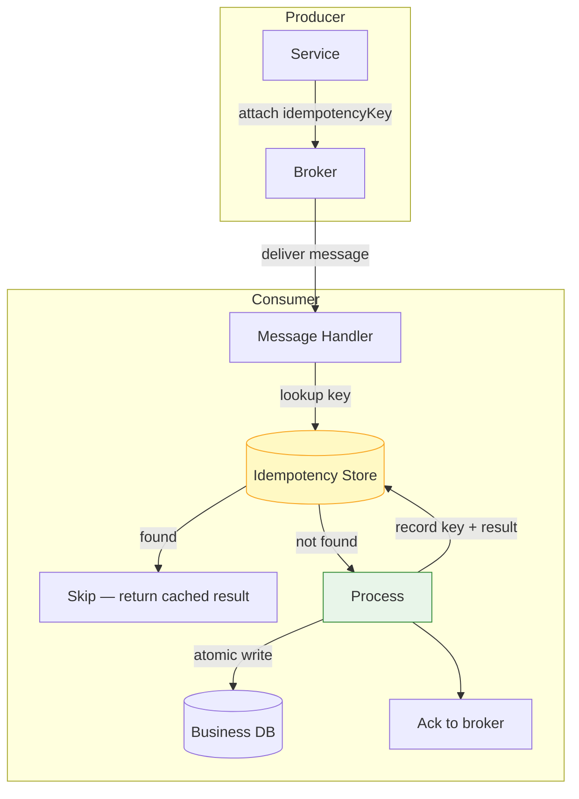
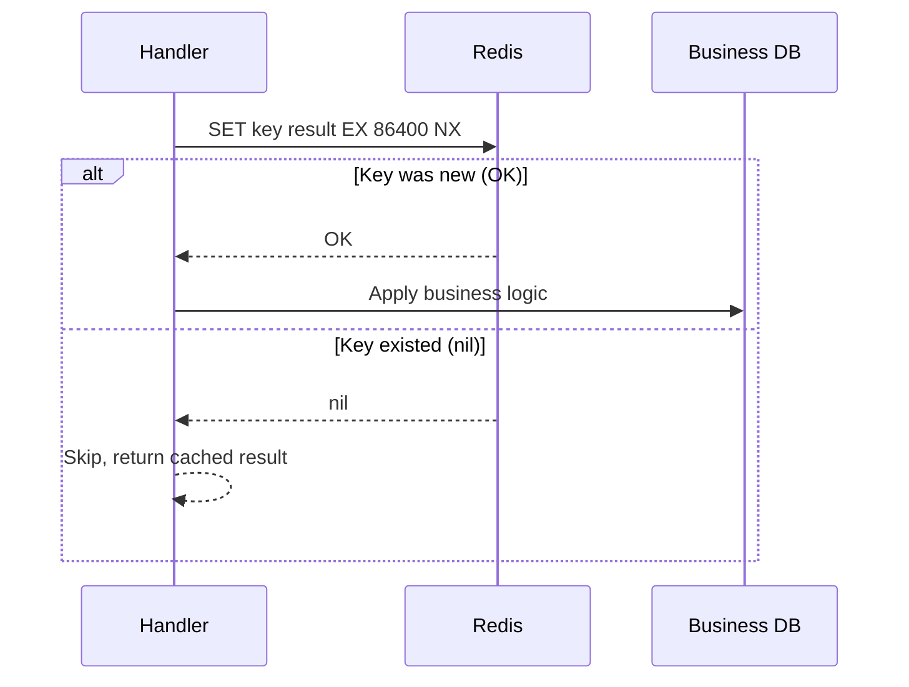
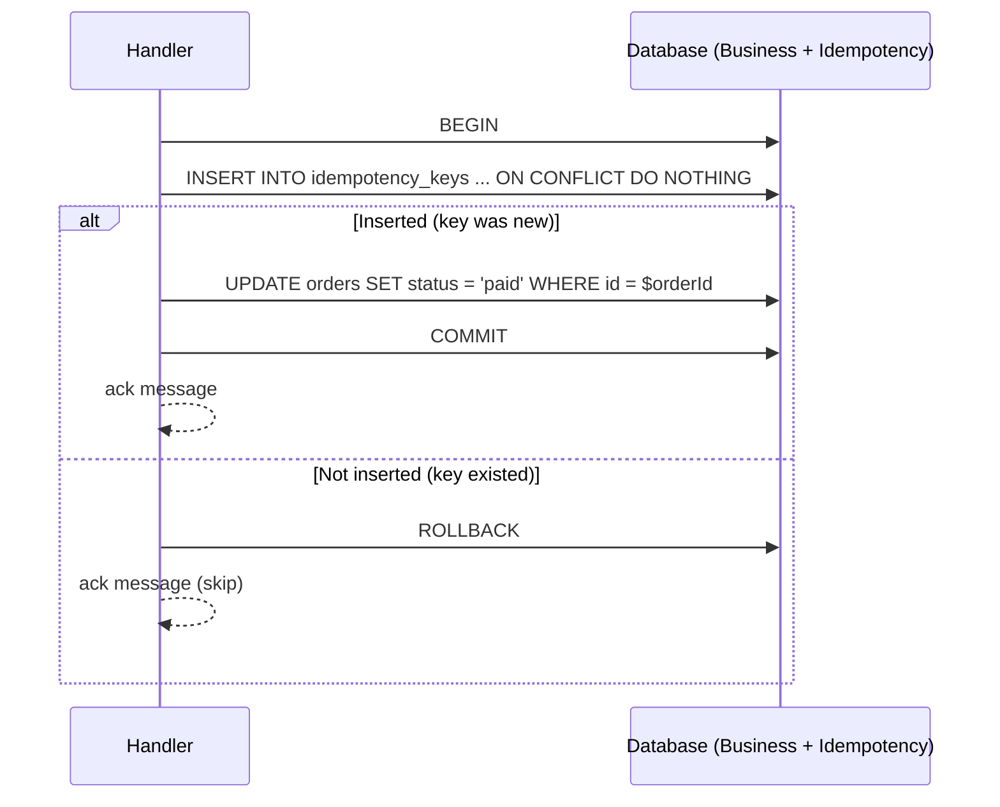
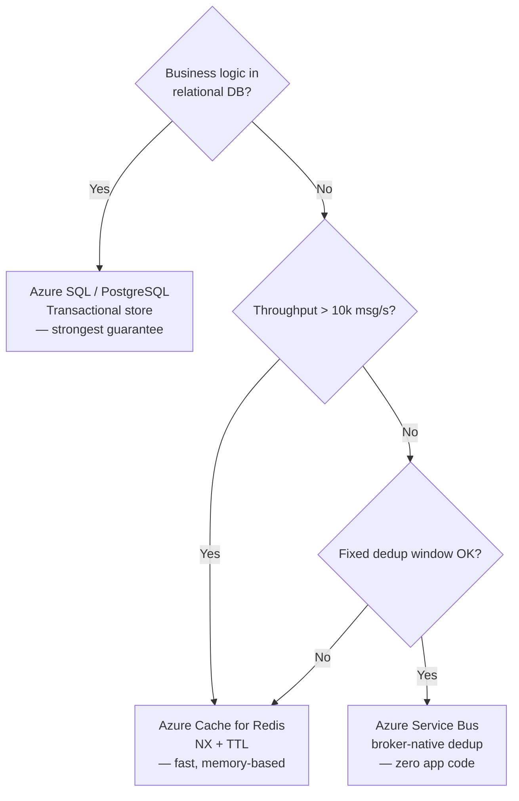

# Idempotency Store Pattern

> **Taxonomy Reference**: §3.3 Event-Driven & Messaging — Reliability Patterns (see [architecture_taxonomy_reference.md](../../10-practicality-taxonomy/architecture_taxonomy_reference.md))

## Table of Contents

- [Problem](#problem)
- [Solution](#solution)
- [Abstraction Level](#abstraction-level)
- [Core Concepts](#core-concepts)
- [Architecture](#architecture)
- [Idempotency Key Design](#idempotency-key-design)
- [Store Implementation Options](#store-implementation-options)
  - [Database Table](#1-database-table)
  - [Distributed Cache (Redis)](#2-distributed-cache-redis)
  - [Broker-Native Deduplication](#3-broker-native-deduplication)
- [Processing Patterns](#processing-patterns)
  - [Check-Then-Act](#check-then-act-simple)
  - [Insert-Or-Ignore (Atomic)](#insert-or-ignore-atomic)
  - [Transactional Idempotency](#transactional-idempotency)
- [TTL and Retention Strategy](#ttl-and-retention-strategy)
- [When to Use](#when-to-use)
- [When NOT to Use](#when-not-to-use)
- [Failure Scenarios and Mitigations](#failure-scenarios-and-mitigations)
- [Natural vs Stored Idempotency](#natural-vs-stored-idempotency)
- [Trade-offs](#trade-offs)
- [Related Patterns](#related-patterns)
- [Azure Implementation](#azure-implementation)

---

## Problem

In distributed messaging systems, **at-least-once delivery** is the default guarantee of most brokers (Kafka, Azure Service Bus, RabbitMQ, SQS). This means:

- A message may be delivered **more than once** due to network retries, broker restarts, or consumer crashes mid-processing.
- If the consumer is not protected, **duplicate side effects** occur: duplicate charges, duplicate emails, duplicate database inserts.



---

## Solution

An **idempotency store** is a shared, durable lookup used by a consumer to determine whether it has already successfully processed a given message. Before acting, the consumer checks the store using a unique **idempotency key**. If the key is present, the operation is skipped (or the previous result is returned). If absent, the operation proceeds and the key is recorded.



This guarantees **exactly-once semantics at the application layer**, even when the broker delivers at-least-once.

---

## Abstraction Level

- [ ] Conceptual (Strategic)
- [x] Logical (Design)
- [x] Physical (Implementation)
- [ ] Runtime (Operational)

---

## Core Concepts

### Idempotent Operation

An operation that produces the same result whether executed once or many times.

| Type | Example | Idempotent? |
|------|---------|-------------|
| `SET balance = 100` | Absolute assignment | ✅ Yes |
| `balance += 50` | Relative update | ❌ No |
| `INSERT OR IGNORE` | Upsert | ✅ Yes |
| `INSERT` | Plain insert | ❌ No |
| `DELETE WHERE id = X` | Delete by key | ✅ Yes |
| Send email | External side effect | ❌ No (use guard) |

### Idempotency Key

A **unique identifier** for a logical operation, carried with the message. The key, not the message ID, determines deduplication — because different deliveries of the same message carry the same key.

```
Message Envelope:
{
  "messageId": "msg-789",           ← broker-assigned, may differ per delivery
  "idempotencyKey": "order-456-payment-charge",  ← stable, set by producer
  "payload": { ... }
}
```

### Idempotency Window

The duration for which processed keys are retained. After expiry, the same key would be reprocessed if re-delivered — acceptable only when redelivery after that window is impossible.

---

## Architecture



---

## Idempotency Key Design

### Key Construction

The key must be **stable across redeliveries** and **unique per logical operation**.

| Scenario | Key Strategy | Example |
|----------|-------------|---------|
| Simple message replay | Use message's own `messageId` | `msg-abc-123` |
| User-initiated action | `{userId}-{action}-{resourceId}` | `user-42-charge-order-7` |
| Outbox relay | `{aggregateId}-{eventSequence}` | `order-456-seq-3` |
| API retry (client side) | Client-generated UUID per request | `550e8400-e29b-41d4` |
| Scheduled job | `{jobName}-{date}-{batchId}` | `invoice-gen-2026-05-10-b1` |

### Key Anti-Patterns

| Anti-Pattern | Problem |
|---|---|
| Using timestamp alone | Clock skew produces collisions |
| Using random UUID per delivery | No deduplication — different key every time |
| Composite key without separator | `order1payment` vs `order-1payment` collision |
| Key too broad (e.g. just `order-456`) | Conflates multiple distinct operations on same aggregate |

---

## Store Implementation Options

### 1. Database Table

Best when the idempotency check must be **atomic with business logic** (same database, same transaction).

```sql
CREATE TABLE idempotency_keys (
    key             VARCHAR(255)  PRIMARY KEY,
    consumer_group  VARCHAR(100)  NOT NULL,       -- partition by service
    result          JSONB,                         -- optional: cache response
    processed_at    TIMESTAMPTZ   NOT NULL DEFAULT NOW(),
    expires_at      TIMESTAMPTZ   NOT NULL         -- enforce TTL
);

CREATE INDEX idx_idempotency_expires ON idempotency_keys (expires_at);
```

**Usage:**

```sql
-- Atomic insert: succeeds only if key is new
INSERT INTO idempotency_keys (key, consumer_group, result, expires_at)
VALUES ($1, $2, $3, NOW() + INTERVAL '24 hours')
ON CONFLICT (key) DO NOTHING;

-- Check whether it was inserted (0 rows = already existed)
-- If 0: skip. If 1: proceed with business logic in same transaction.
```

**Characteristics:**

| Aspect | Detail |
|--------|--------|
| Atomicity | Full — check + business write in one transaction |
| Latency | Same as DB round-trip (~1–5ms local) |
| Scalability | Partitioned by `consumer_group`; index on expiry for cleanup |
| Cleanup | Scheduled job deletes expired rows |

---

### 2. Distributed Cache (Redis)

Best when the business operation is naturally idempotent or the consumer database is separate. Trades atomicity for speed.

```
SET idempotency:{key} {result} EX {ttl_seconds} NX
```

- `NX` — only set if not exists (atomic check-and-set in Redis)
- `EX` — TTL in seconds (automatic expiry, no cleanup job needed)
- Returns `OK` if key was new (proceed), `nil` if already set (skip)

**Example flow:**



**Characteristics:**

| Aspect | Detail |
|--------|--------|
| Atomicity | Not with business DB — risk of processed-but-not-recorded if handler crashes between DB write and Redis write |
| Latency | Sub-millisecond (in-memory) |
| Scalability | Horizontal Redis cluster; hash slot by key |
| Cleanup | Automatic via TTL (no manual purge) |
| Durability | Risk of data loss if Redis restarts without persistence (`AOF`/`RDB`) |

> **Mitigate atomicity gap**: write Redis key _before_ the business operation with a short TTL (e.g. `PROCESSING` status), then update to `DONE`. Consumers encountering `PROCESSING` can wait and retry.

---

### 3. Broker-Native Deduplication

Some brokers offer built-in deduplication without a separate store.

| Broker | Mechanism | Deduplication Window |
|--------|-----------|---------------------|
| **Azure Service Bus** | `MessageId` deduplication (enable on queue/topic) | Configurable (default 10 min) |
| **AWS SQS FIFO** | `MessageDeduplicationId` | 5 minutes |
| **Kafka** | Idempotent producer (`enable.idempotence=true`) + transactional API | Per producer session |
| **RabbitMQ** | No native support — use plugin or application-level store | — |

**Azure Service Bus example:**

```csharp
var message = new ServiceBusMessage(body)
{
    MessageId = $"order-{orderId}-payment-charge"  // stable, unique per operation
};
// Broker deduplicates within the configured window
await sender.SendMessageAsync(message);
```

> **Limitation**: broker-native deduplication only prevents duplicate _delivery_. It does not protect against duplicate _processing_ when consumers have their own retry logic or when the same message arrives from different producers.

---

## Processing Patterns

### Check-Then-Act (Simple)

```python
def handle(message):
    key = message.idempotency_key

    if store.exists(key):
        return store.get_result(key)   # return cached response

    result = process(message)          # do the actual work
    store.set(key, result, ttl=86400)
    broker.ack(message)
    return result
```

**Risk**: non-atomic — if the service crashes between `process()` and `store.set()`, the message is redelivered and reprocessed.

---

### Insert-Or-Ignore (Atomic)

Using the database's unique constraint to make the check atomic with the business write:

```sql
BEGIN;
  -- Try to claim the key
  INSERT INTO idempotency_keys (key, consumer_group, expires_at)
  VALUES ($1, $2, NOW() + INTERVAL '24 hours')
  ON CONFLICT (key) DO NOTHING;

  -- Check if we own the key (affected rows = 1) or it already existed (= 0)
  -- If 0: COMMIT and skip
  -- If 1: apply business logic here, then COMMIT
COMMIT;
```

This is the **recommended approach when using a relational database** — the unique constraint enforces exactly-once within a transaction.

---

### Transactional Idempotency

For the strongest guarantee, perform the idempotency key insert and the business operation in the **same transaction**:



---

## TTL and Retention Strategy

The idempotency window must be longer than the **maximum redelivery window** of the broker.

| Factor | Consideration |
|--------|--------------|
| **Broker retry window** | Azure Service Bus max lock duration + dead-letter retry period |
| **Consumer restart time** | How long before a crashed consumer reconnects |
| **Business redelivery risk** | How long could a duplicate legitimately arrive? |

### Recommended TTL Guidelines

| Scenario | Minimum TTL |
|----------|------------|
| Real-time event processing | 1 hour |
| Transactional messaging (e.g. payments) | 24–48 hours |
| Batch/scheduled jobs | 7 days |
| Financial audit trail | 30+ days (consider permanent log instead) |

### Cleanup

| Store Type | Cleanup Strategy |
|------------|-----------------|
| Database table | Scheduled job: `DELETE FROM idempotency_keys WHERE expires_at < NOW()` |
| Redis | Automatic via `EX` TTL |
| Broker-native | Automatic (window configured on the broker resource) |

---

## When to Use

- The message broker delivers **at-least-once** and the consumer must not apply duplicate effects.
- You use the **Transactional Outbox** pattern — the relay may publish the same message twice.
- Consumer operations are **non-idempotent by nature** (financial transactions, emails, external API calls).
- You implement **Saga choreography** and saga step events may be replayed.
- You expose an **API** and clients may retry on timeout (client-side idempotency).

---

## When NOT to Use

- The operation is **naturally idempotent** (e.g. `SET status = 'active'` where repeated writes have no extra effect) — a store adds overhead without benefit.
- The broker guarantees **exactly-once delivery** end-to-end and your workload fits within its constraints.
- State change volume is extremely high and the store would become a hot-spot — consider **natural idempotency by design** instead (immutable events, append-only logs).

---

## Failure Scenarios and Mitigations

| Failure | Consequence | Mitigation |
|---------|-------------|------------|
| Handler crashes after business write, before store write | Redelivery causes reprocessing | Transactional idempotency (same DB, same tx) |
| Handler crashes after store write, before ack | Message redelivered; store check skips duplicate | Safe — correct behaviour |
| Redis restarts without persistence | Store lost; all keys forgotten | Enable Redis AOF/RDB, or fall back to DB store |
| Two handler instances race on the same key | Both pass the check before either writes | Atomic `INSERT ON CONFLICT` or `SET NX` prevents both proceeding |
| Idempotency key collision (distinct operations, same key) | Second operation silently skipped | Use fine-grained key construction (include operation type) |
| TTL too short | Delayed redelivery processed as new | Set TTL > broker max redelivery window + buffer |

---

## Natural vs Stored Idempotency

Not every non-idempotent operation requires a store. Sometimes the operation can be redesigned:

| Approach | Description | Example |
|----------|-------------|---------|
| **Idempotency Store** | External check before acting | Deduplication table for payment charges |
| **Natural Idempotency** | Design the operation to be safe to repeat | `UPDATE SET status='shipped' WHERE status='paid'` |
| **Conditional Update** | Only apply if current state matches expected | `UPDATE WHERE version = $expected_version` (optimistic locking) |
| **Event Sourcing** | Append-only log; replaying events is safe | Events never overwrite, projection handles duplicates |

Choose the simplest approach that satisfies correctness requirements.

---

## Trade-offs

| Concern | Idempotency Store | Alternative |
|---------|-------------------|-------------|
| **Correctness** | Exactly-once at app layer | Natural idempotency (simpler, not always possible) |
| **Latency** | +1 DB/cache round-trip per message | Broker-native dedup (zero app overhead, limited window) |
| **Storage cost** | Grows with message volume × TTL | Short TTL minimises storage; Redis uses memory |
| **Operational complexity** | Cleanup jobs, TTL tuning | Broker-native: managed by infrastructure |
| **Cross-service reuse** | Requires shared store or per-service stores | Per-service stores are simpler but don't span boundaries |

---

## Related Patterns

| Pattern | Relationship |
|---------|-------------|
| [Transactional Outbox](./outbox-pattern.md) | Outbox delivers at-least-once; idempotency store makes consumers safe |
| [Saga Pattern](./saga-pattern.md) | Saga step consumers need idempotency when events are replayed |
| [Idempotent Receiver](./messaging-patterns-overview.md#4-idempotent-receiver) | High-level pattern; idempotency store is the implementation mechanism |
| [Dead Letter Queue](./messaging-patterns-overview.md#2-dead-letter-queue-dlq) | DLQ retries re-deliver messages; idempotency store prevents duplicate processing |
| [Event-Driven Architecture](../event-driven-messaging/01-patterns/event-driven-architecture.md) | EDA relies on at-least-once; idempotency store is a key reliability building block |

---

## Azure Implementation

### Azure SQL / PostgreSQL — Transactional Store

Recommended for payment-grade correctness:

```csharp
public async Task<bool> TryClaimAsync(
    string key, string consumerGroup, TimeSpan ttl,
    SqlConnection conn, SqlTransaction tx)
{
    const string sql = """
        INSERT INTO idempotency_keys (key, consumer_group, expires_at)
        VALUES (@key, @group, @expires)
        ON CONFLICT (key) DO NOTHING
        """;

    var rows = await conn.ExecuteAsync(sql, new
    {
        key,
        group = consumerGroup,
        expires = DateTime.UtcNow.Add(ttl)
    }, transaction: tx);

    return rows == 1; // true = key was new (proceed), false = skip
}
```

### Azure Cache for Redis — High-Throughput Store

Suitable for non-financial, high-volume consumers:

```csharp
public async Task<bool> TryClaimAsync(
    IDatabase redis, string key, TimeSpan ttl)
{
    // SET key "1" EX {ttl} NX — atomic check-and-set
    return await redis.StringSetAsync(
        $"idempotency:{key}",
        value: "1",
        expiry: ttl,
        when: When.NotExists);
}
```

### Azure Service Bus — Broker-Native Deduplication

Enable on the queue/topic resource:

```bicep
resource serviceBusQueue 'Microsoft.ServiceBus/namespaces/queues@2021-11-01' = {
  name: 'orders'
  properties: {
    requiresDuplicateDetection: true
    duplicateDetectionHistoryTimeWindow: 'PT10M'   // ISO 8601 duration
  }
}
```

Set a stable `MessageId` on every send:

```csharp
var message = new ServiceBusMessage(payload)
{
    MessageId = $"{aggregateId}-{eventType}-{eventSequence}"
};
```

### Choosing the Right Store on Azure


