# Messaging Patterns

## Table of Contents

- [Introduction](#introduction)
- [Core Messaging Patterns](#core-messaging-patterns)
- [Message Routing Patterns](#message-routing-patterns)
- [Message Transformation Patterns](#message-transformation-patterns)
- [Reliability Patterns](#reliability-patterns)
- [Pattern Selection Guide](#pattern-selection-guide)

## Introduction

Messaging patterns are reusable solutions for common problems in message-based communication systems. These patterns help design reliable, scalable, and maintainable integration solutions.

## Core Messaging Patterns

### 1. Point-to-Point (Queue)

Single consumer receives each message.

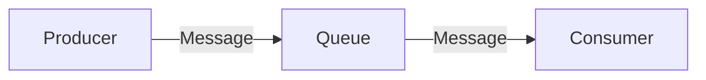

| Characteristic | Description |
|----------------|-------------|
| **Delivery** | Exactly one consumer |
| **Ordering** | FIFO (typically) |
| **Use Case** | Task distribution, work queues |

### 2. Publish-Subscribe (Topic)

Multiple consumers receive each message.

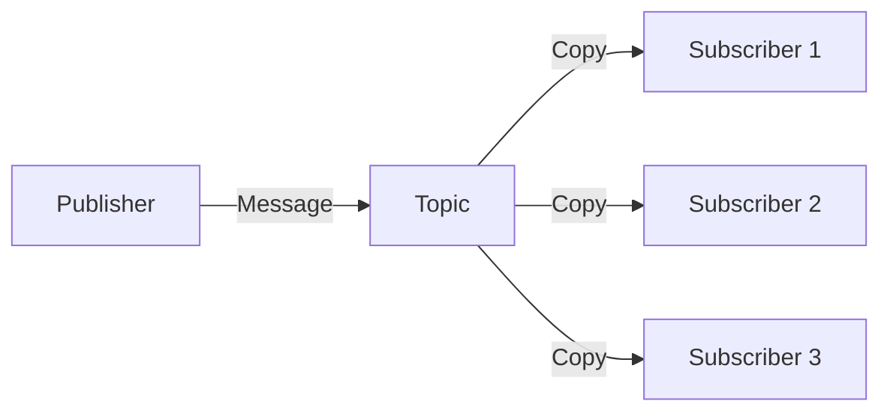

| Characteristic | Description |
|----------------|-------------|
| **Delivery** | All subscribers |
| **Decoupling** | Publishers don't know subscribers |
| **Use Case** | Event broadcasting, notifications |

### 3. Request-Reply

Synchronous communication with response.

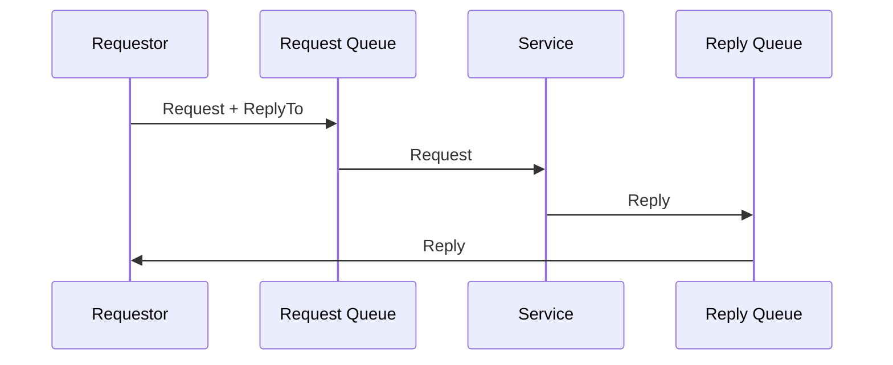

| Characteristic | Description |
|----------------|-------------|
| **Communication** | Bidirectional |
| **Correlation** | CorrelationId matching |
| **Use Case** | RPC over messaging |

### 4. Competing Consumers

Multiple consumers process from same queue.

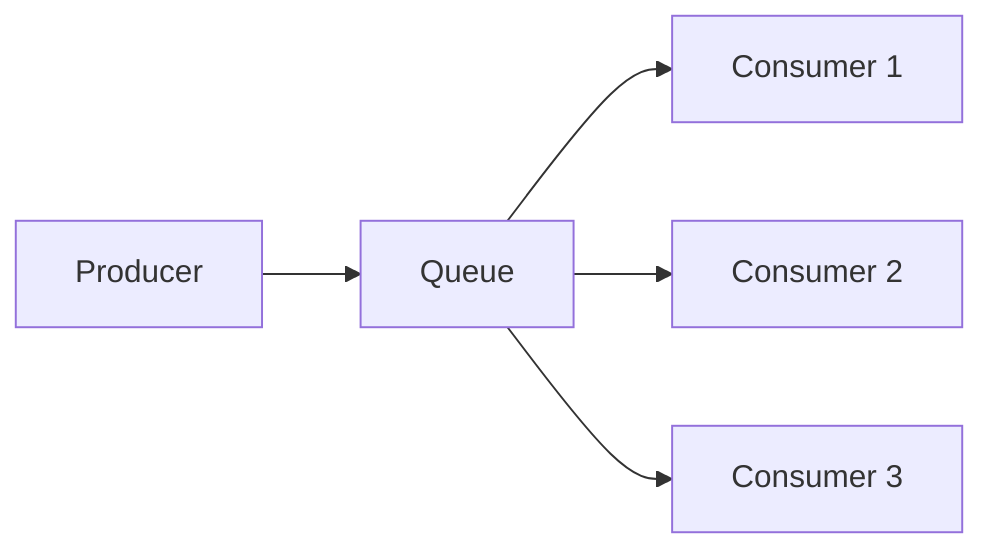

| Characteristic | Description |
|----------------|-------------|
| **Scalability** | Horizontal scaling |
| **Processing** | Parallel |
| **Use Case** | High throughput workloads |

### 5. Fan-Out / Fan-In

Distribute work and aggregate results.

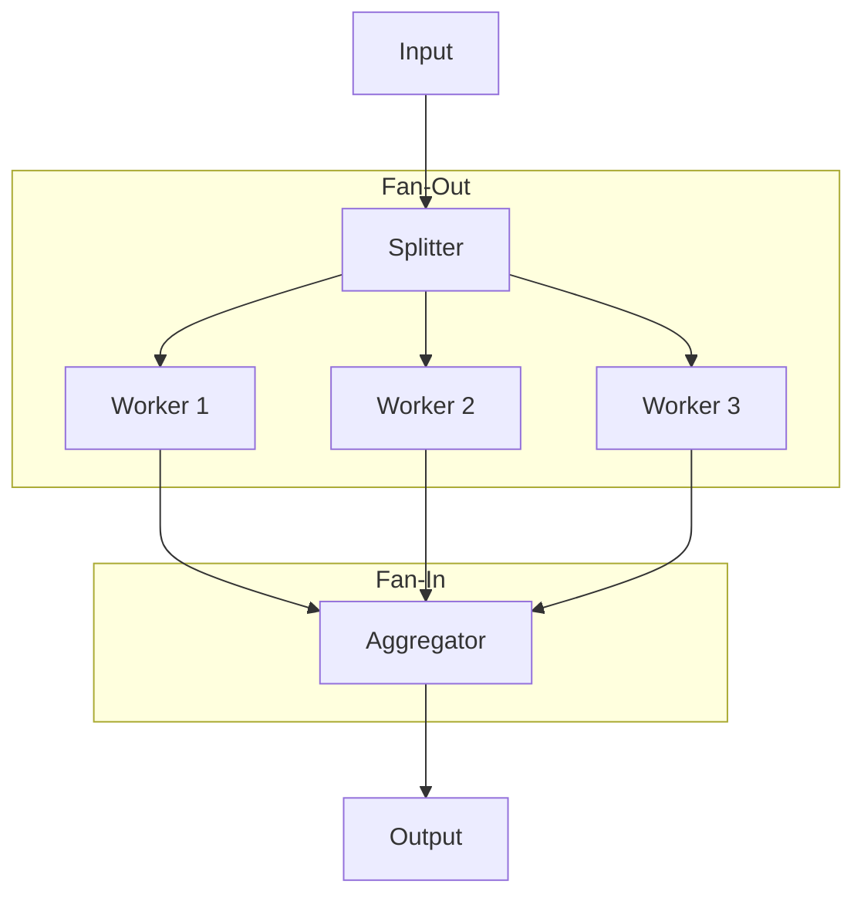

| Characteristic | Description |
|----------------|-------------|
| **Processing** | Parallel then merge |
| **Use Case** | Batch processing, map-reduce |

## Message Routing Patterns

### 1. Content-Based Router

Route messages based on content.

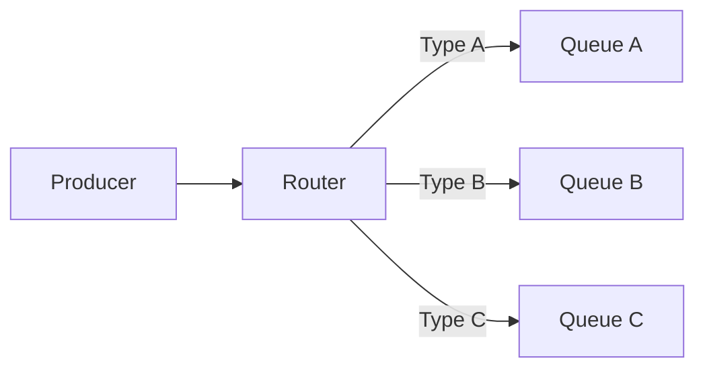

```python
# Pseudo-code example
def route_message(message):
    if message.type == "order":
        return "orders-queue"
    elif message.type == "inventory":
        return "inventory-queue"
    else:
        return "default-queue"
```

### 2. Message Filter

Selectively process messages.

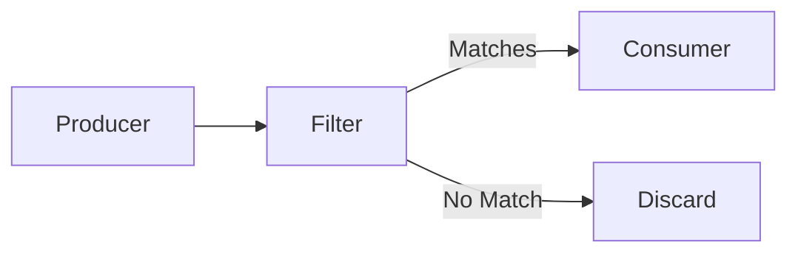

### 3. Recipient List

Dynamic routing to multiple recipients.

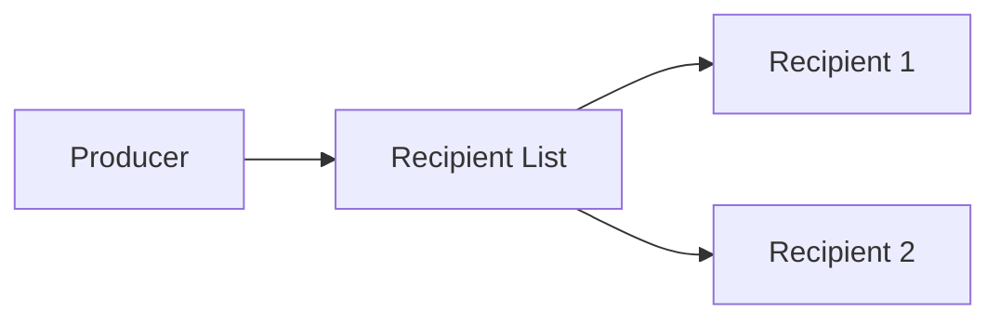

### 4. Splitter

Break composite message into parts.

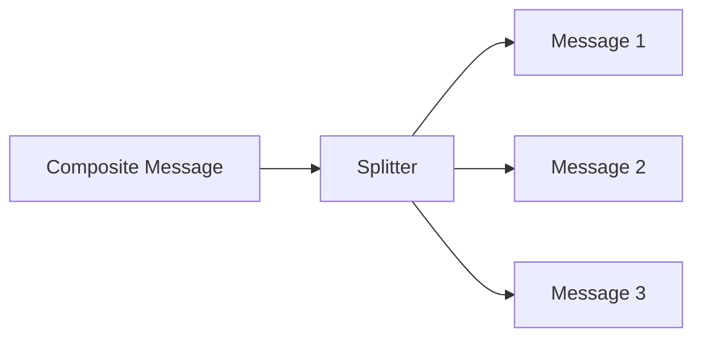

### 5. Aggregator

Combine related messages.

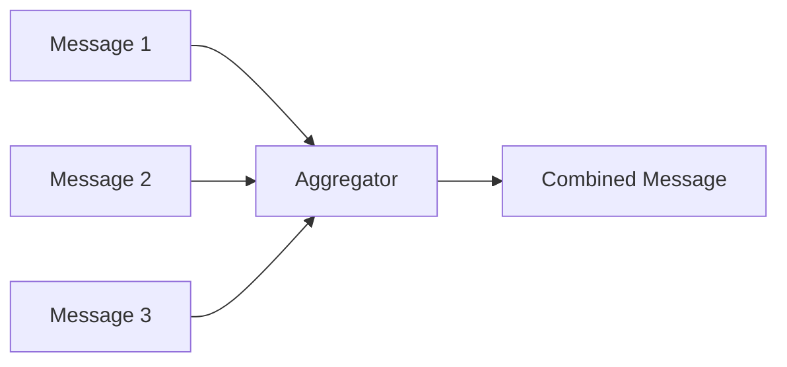

| Strategy | Description |
|----------|-------------|
| **Count** | Wait for N messages |
| **Timeout** | Wait for time period |
| **Completion** | Wait for all parts |

## Message Transformation Patterns

### 1. Message Translator

Convert message format.

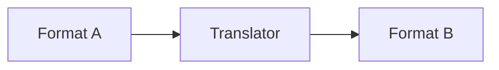

| Use Case | Example |
|----------|---------|
| **Format** | JSON to XML |
| **Schema** | v1 to v2 |
| **Protocol** | REST to SOAP |

### 2. Envelope Wrapper

Add metadata wrapper.

```json
{
  "envelope": {
    "messageId": "abc-123",
    "timestamp": "2025-01-01T00:00:00Z",
    "source": "system-a"
  },
  "payload": {
    "orderId": "12345",
    "amount": 99.99
  }
}
```

### 3. Content Enricher

Add data from external sources.

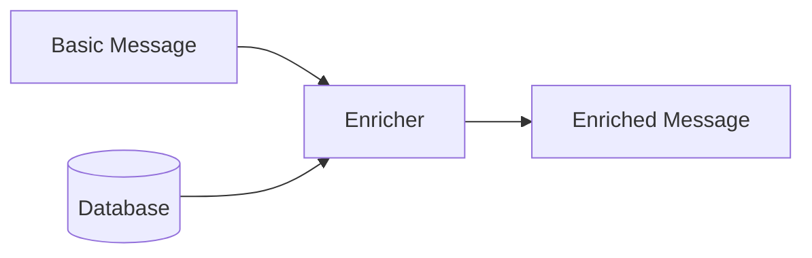

### 4. Content Filter

Remove unnecessary data.

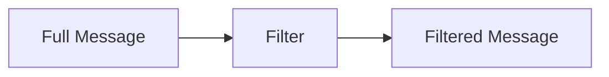

### 5. Normalizer

Convert various formats to canonical form.

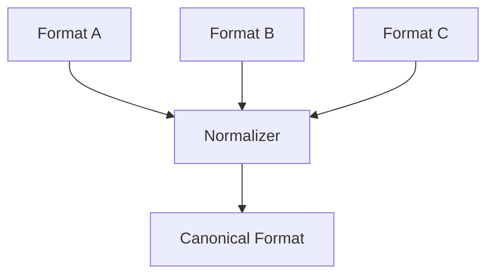

## Reliability Patterns

### 1. Guaranteed Delivery

Ensure message delivery with persistence.

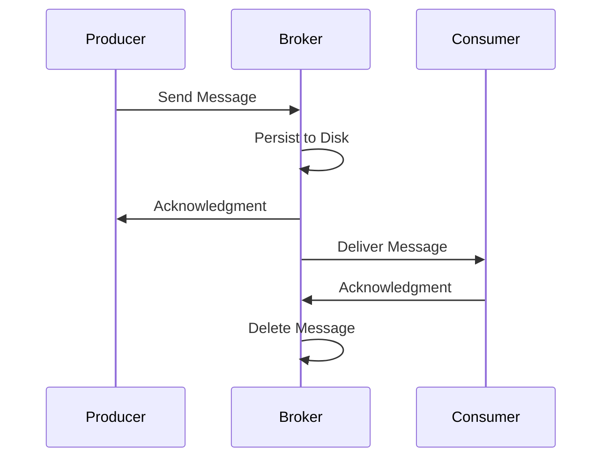

### 2. Dead Letter Queue (DLQ)

Handle unprocessable messages.

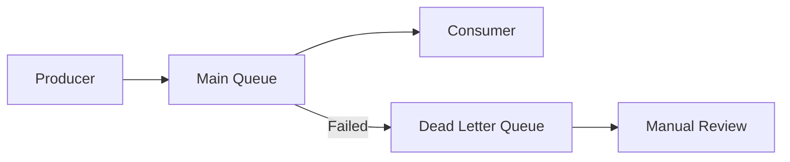

| Scenario | Action |
|----------|--------|
| **Max Retries** | Move to DLQ |
| **Invalid Format** | Move to DLQ |
| **Processing Error** | Move to DLQ |

### 3. Retry Pattern

Automatic retry with backoff.

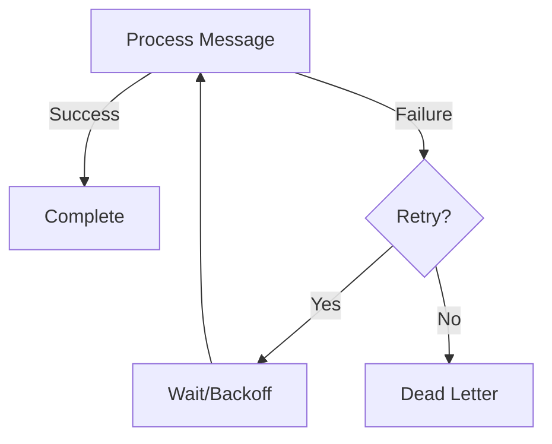

**Backoff Strategies:**

| Strategy | Formula | Example |
|----------|---------|---------|
| **Fixed** | delay = constant | 5s, 5s, 5s |
| **Linear** | delay = attempt × base | 5s, 10s, 15s |
| **Exponential** | delay = base^attempt | 2s, 4s, 8s, 16s |
| **Jitter** | delay ± random | Prevents thundering herd |

### 4. Idempotent Receiver

Handle duplicate messages safely.

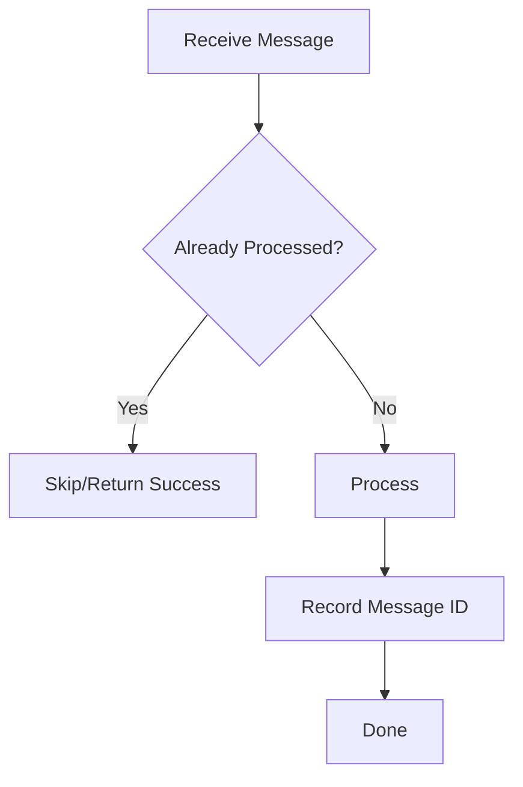

**Implementation:**
```python
def process_message(message):
    message_id = message.id
    
    if is_processed(message_id):
        return "Already processed"
    
    # Process the message
    do_work(message)
    
    # Mark as processed
    mark_processed(message_id)
    return "Success"
```

### 5. Transactional Outbox

Ensure atomicity of database and message operations.

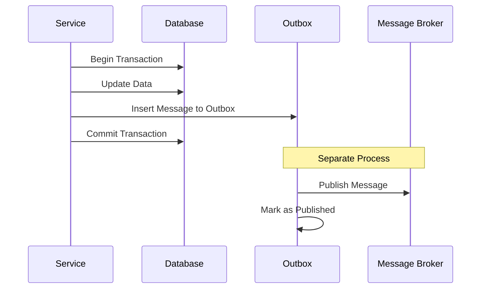

### 6. Circuit Breaker

Prevent cascade failures.

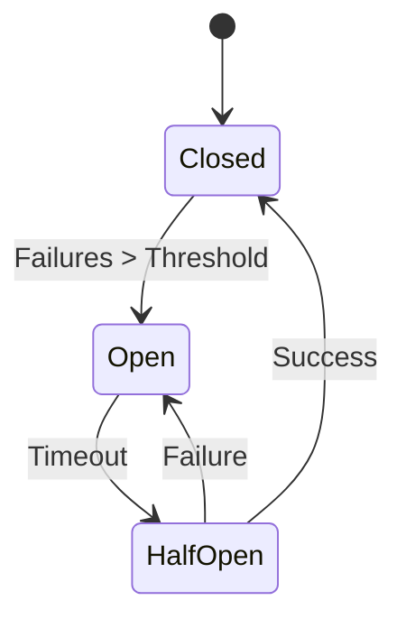

| State | Behavior |
|-------|----------|
| **Closed** | Normal operation |
| **Open** | Fail fast, don't attempt |
| **Half-Open** | Test with limited requests |

## Pattern Selection Guide

### By Use Case

| Use Case | Recommended Patterns |
|----------|---------------------|
| **Task Distribution** | Competing Consumers, Queue |
| **Event Notification** | Pub/Sub, Fan-Out |
| **Workflow** | Saga, Orchestration |
| **Data Sync** | CDC, Event Sourcing |
| **Batch Processing** | Splitter, Aggregator |

### By Requirement

| Requirement | Pattern |
|-------------|---------|
| **Reliability** | Guaranteed Delivery, DLQ, Retry |
| **Scalability** | Competing Consumers, Partitioning |
| **Ordering** | Partitioned Queue, Session |
| **Exactly-Once** | Idempotent Receiver, Deduplication |
| **Performance** | Batching, Compression |

### Decision Tree

```mermaid
graph TD
    A[Message Pattern] --> B{Multiple Consumers?}
    B -->|Yes| C{Same Message?}
    B -->|No| D[Point-to-Point Queue]
    C -->|Yes| E[Publish-Subscribe]
    C -->|No| F[Competing Consumers]
    
    E --> G{Need Filtering?}
    G -->|Yes| H[Content-Based Router]
    G -->|No| I[Simple Topic]
```

## Related Topics

- [Queue vs Pub/Sub](./event-driven-messaging/comparisons/queue_vs_pubsub.md)
- [Event-Driven Architecture](./event-driven-messaging/patterns/)
- [Azure Service Bus Patterns](../../architecture-azure/integration/service-bus/)
