# Messaging Patterns

## Table of Contents

- [Introduction](#introduction)
- [Core Messaging Patterns](#core-messaging-patterns)
- [Message Routing Patterns](#message-routing-patterns)
- [Message Transformation Patterns](#message-transformation-patterns)
- [Reliability Patterns](#reliability-patterns)
  - [1. Guaranteed Delivery](#1-guaranteed-delivery)
  - [2. Dead Letter Queue (DLQ)](#2-dead-letter-queue-dlq)
  - [3. Retry Pattern](#3-retry-pattern)
  - [4. Idempotent Receiver](#4-idempotent-receiver)
  - [5. Transactional Outbox](#5-transactional-outbox)
  - [6. Circuit Breaker](#6-circuit-breaker)
  - [7. Saga Pattern](#7-saga-pattern)
- [Pattern Selection Guide](#pattern-selection-guide)

## Introduction

Messaging patterns are reusable solutions for common problems in message-based communication systems. These patterns help design reliable, scalable, and maintainable integration solutions.

## Core Messaging Patterns

### 1. Point-to-Point (Queue)

Single consumer receives each message.

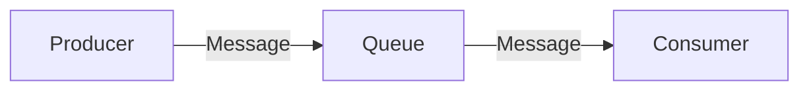
```mermaid
graph LR
    P[Producer] -->|Message| Q[Queue]
    Q -->|Message| C[Consumer]
```

| Characteristic | Description |
|----------------|-------------|
| **Delivery** | Exactly one consumer |
| **Ordering** | FIFO (typically) |
| **Use Case** | Task distribution, work queues |

### 2. Publish-Subscribe (Topic)

Multiple consumers receive each message.

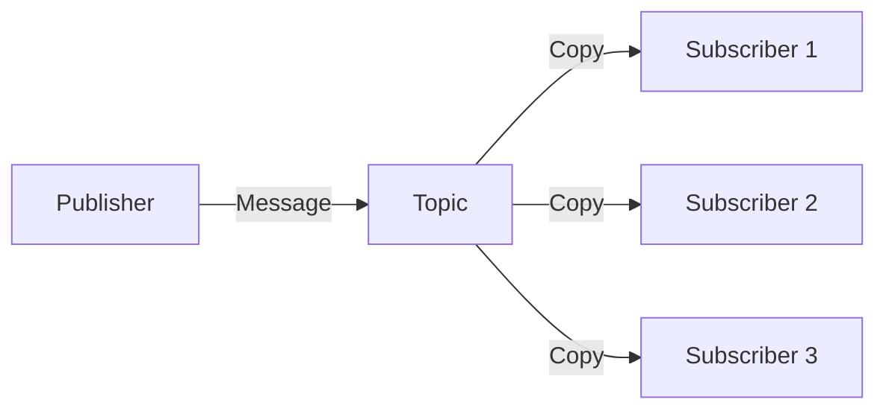
```mermaid
graph LR
    P[Publisher] -->|Message| T[Topic]
    T -->|Copy| S1[Subscriber 1]
    T -->|Copy| S2[Subscriber 2]
    T -->|Copy| S3[Subscriber 3]
```

| Characteristic | Description |
|----------------|-------------|
| **Delivery** | All subscribers |
| **Decoupling** | Publishers don't know subscribers |
| **Use Case** | Event broadcasting, notifications |

### 3. Request-Reply

Synchronous communication with response.

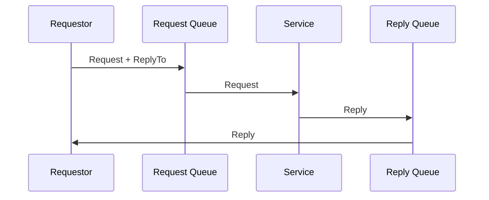
```mermaid
sequenceDiagram
    participant R as Requestor
    participant Q1 as Request Queue
    participant S as Service
    participant Q2 as Reply Queue
    
    R->>Q1: Request + ReplyTo
    Q1->>S: Request
    S->>Q2: Reply
    Q2->>R: Reply
```

| Characteristic | Description |
|----------------|-------------|
| **Communication** | Bidirectional |
| **Correlation** | CorrelationId matching |
| **Use Case** | RPC over messaging |

### 4. Competing Consumers

Multiple consumers process from same queue.

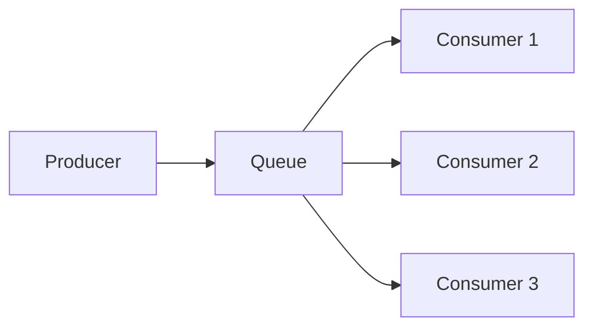
```mermaid
graph LR
    P[Producer] --> Q[Queue]
    Q --> C1[Consumer 1]
    Q --> C2[Consumer 2]
    Q --> C3[Consumer 3]
```

| Characteristic | Description |
|----------------|-------------|
| **Scalability** | Horizontal scaling |
| **Processing** | Parallel |
| **Use Case** | High throughput workloads |

### 5. Fan-Out / Fan-In

Distribute work and aggregate results.

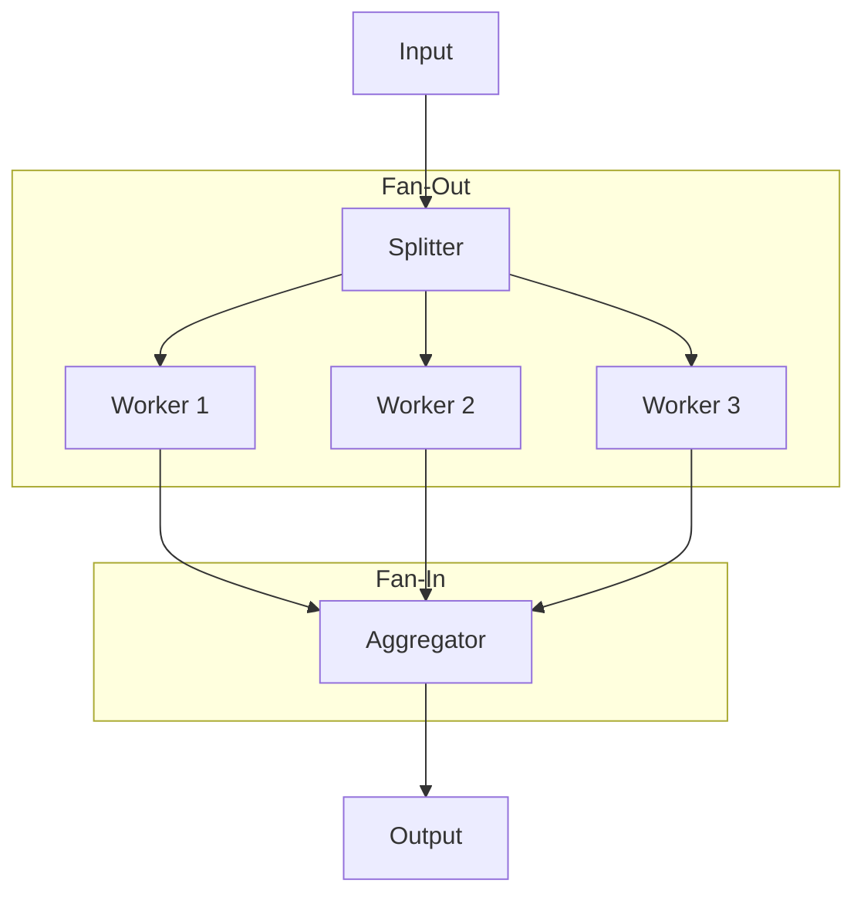
```mermaid
graph TB
    subgraph "Fan-Out"
        S[Splitter] --> W1[Worker 1]
        S --> W2[Worker 2]
        S --> W3[Worker 3]
    end
    
    subgraph "Fan-In"
        W1 --> A[Aggregator]
        W2 --> A
        W3 --> A
    end
    
    I[Input] --> S
    A --> O[Output]
```

| Characteristic | Description |
|----------------|-------------|
| **Processing** | Parallel then merge |
| **Use Case** | Batch processing, map-reduce |

## Message Routing Patterns

### 1. Content-Based Router

Route messages based on content.

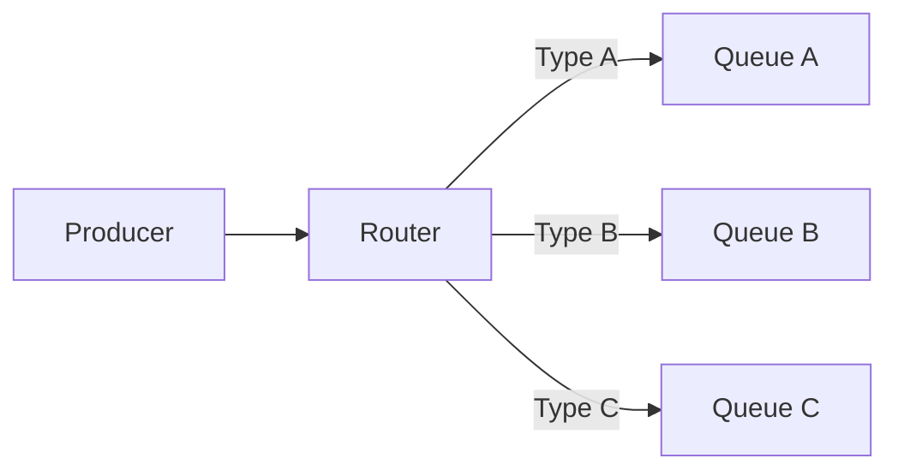
```mermaid
graph LR
    P[Producer] --> R[Router]
    R -->|Type A| QA[Queue A]
    R -->|Type B| QB[Queue B]
    R -->|Type C| QC[Queue C]
```

```python
# Pseudo-code example
def route_message(message):
    if message.type == "order":
        return "orders-queue"
    elif message.type == "inventory":
        return "inventory-queue"
    else:
        return "default-queue"
```

### 2. Message Filter

Selectively process messages.

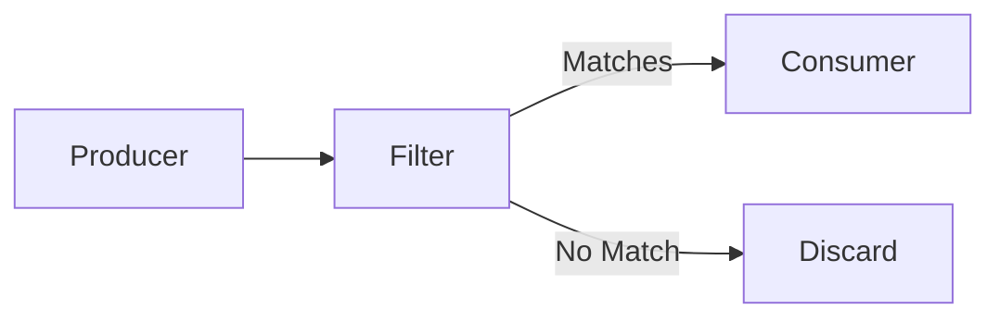
```mermaid
graph LR
    P[Producer] --> F[Filter]
    F -->|Matches| C[Consumer]
    F -->|No Match| X[Discard]
```

### 3. Recipient List

Dynamic routing to multiple recipients.

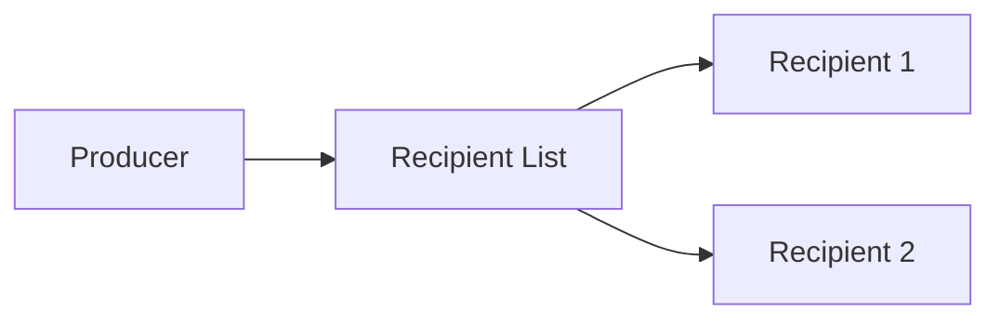
```mermaid
graph LR
    P[Producer] --> RL[Recipient List]
    RL --> R1[Recipient 1]
    RL --> R2[Recipient 2]
```

### 4. Splitter

Break composite message into parts.

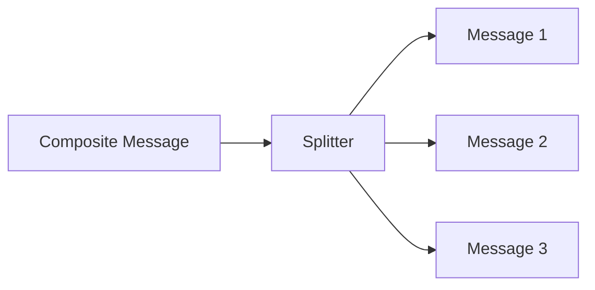
```mermaid
graph LR
    P[Composite Message] --> S[Splitter]
    S --> M1[Message 1]
    S --> M2[Message 2]
    S --> M3[Message 3]
```

### 5. Aggregator

Combine related messages.

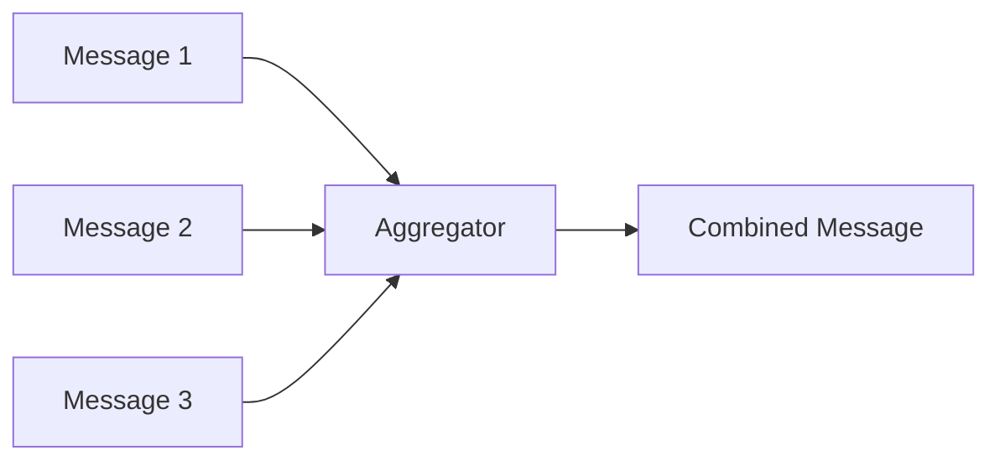
```mermaid
graph LR
    M1[Message 1] --> A[Aggregator]
    M2[Message 2] --> A
    M3[Message 3] --> A
    A --> C[Combined Message]
```

| Strategy | Description |
|----------|-------------|
| **Count** | Wait for N messages |
| **Timeout** | Wait for time period |
| **Completion** | Wait for all parts |

## Message Transformation Patterns

### 1. Message Translator

Convert message format.

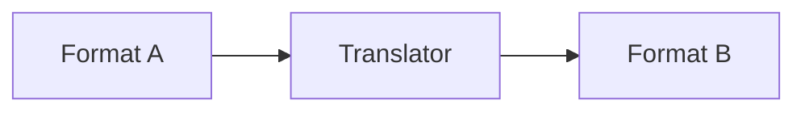
```mermaid
graph LR
    A[Format A] --> T[Translator]
    T --> B[Format B]
```

| Use Case | Example |
|----------|---------|
| **Format** | JSON to XML |
| **Schema** | v1 to v2 |
| **Protocol** | REST to SOAP |

### 2. Envelope Wrapper

Add metadata wrapper.

```json
{
  "envelope": {
    "messageId": "abc-123",
    "timestamp": "2025-01-01T00:00:00Z",
    "source": "system-a"
  },
  "payload": {
    "orderId": "12345",
    "amount": 99.99
  }
}
```

### 3. Content Enricher

Add data from external sources.

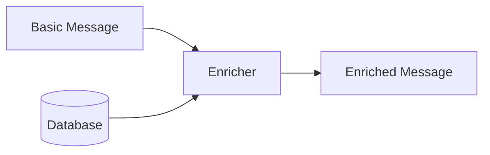
```mermaid
graph LR
    M1[Basic Message] --> E[Enricher]
    DB[(Database)] --> E
    E --> M2[Enriched Message]
```

### 4. Content Filter

Remove unnecessary data.

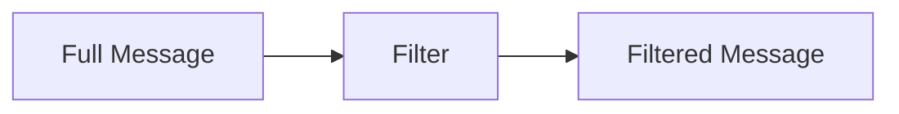
```mermaid
graph LR
    M1[Full Message] --> F[Filter]
    F --> M2[Filtered Message]
```

### 5. Normalizer

Convert various formats to canonical form.

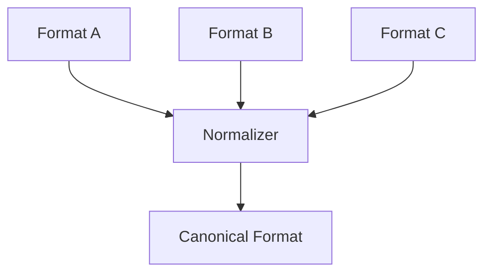
```mermaid
graph TB
    A[Format A] --> N[Normalizer]
    B[Format B] --> N
    C[Format C] --> N
    N --> CF[Canonical Format]
```

## Reliability Patterns

### 1. Guaranteed Delivery

Ensure message delivery with persistence.

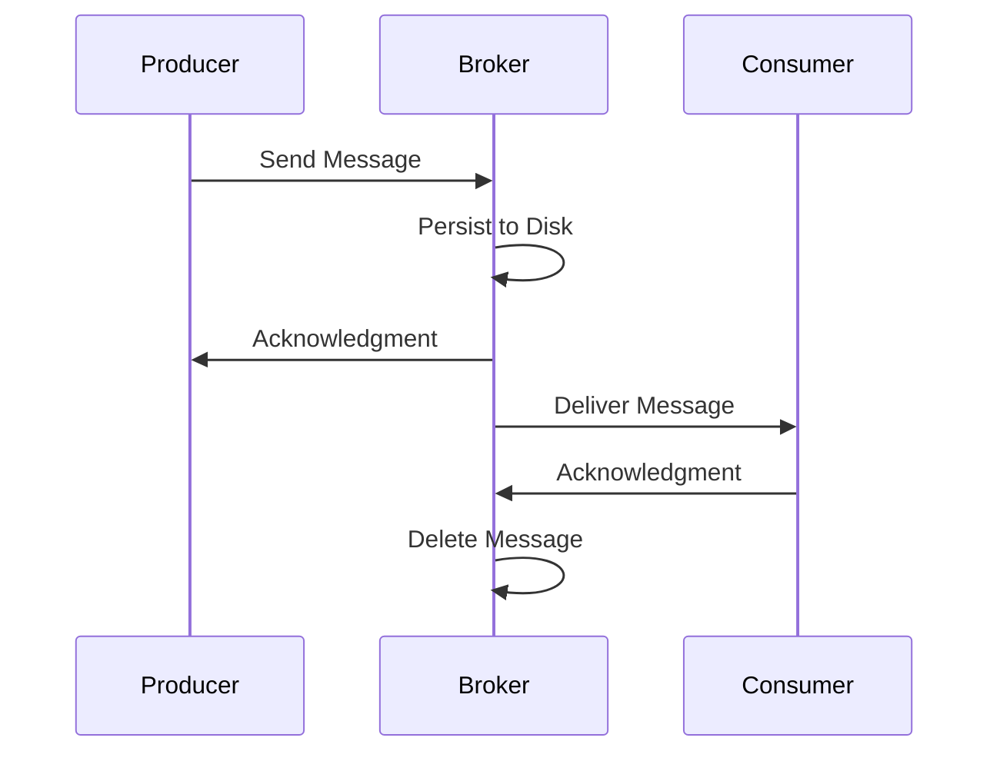
```mermaid
sequenceDiagram
    participant P as Producer
    participant B as Broker
    participant C as Consumer
    
    P->>B: Send Message
    B->>B: Persist to Disk
    B->>P: Acknowledgment
    B->>C: Deliver Message
    C->>B: Acknowledgment
    B->>B: Delete Message
```

### 2. Dead Letter Queue (DLQ)

Handle unprocessable messages.

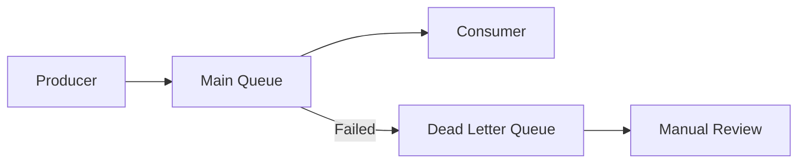
```mermaid
graph LR
    P[Producer] --> Q[Main Queue]
    Q --> C[Consumer]
    Q -->|Failed| DLQ[Dead Letter Queue]
    DLQ --> M[Manual Review]
```

| Scenario | Action |
|----------|--------|
| **Max Retries** | Move to DLQ |
| **Invalid Format** | Move to DLQ |
| **Processing Error** | Move to DLQ |

### 3. Retry Pattern

Automatic retry with backoff.

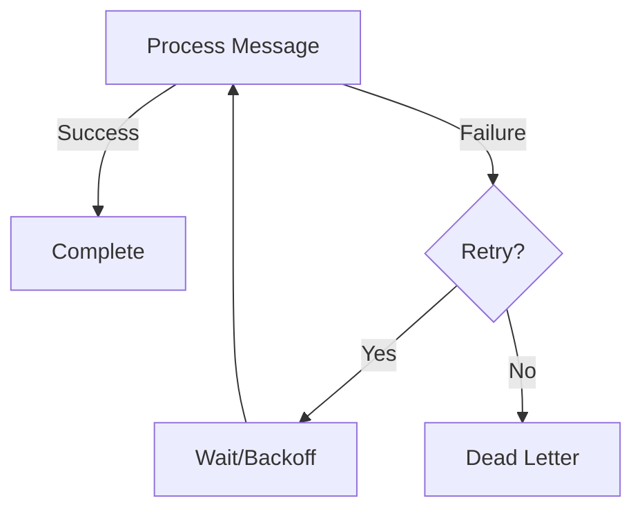
```mermaid
graph TD
    P[Process Message] -->|Success| S[Complete]
    P -->|Failure| R{Retry?}
    R -->|Yes| W[Wait/Backoff]
    W --> P
    R -->|No| DLQ[Dead Letter]
```

**Backoff Strategies:**

| Strategy | Formula | Example |
|----------|---------|---------|
| **Fixed** | delay = constant | 5s, 5s, 5s |
| **Linear** | delay = attempt × base | 5s, 10s, 15s |
| **Exponential** | delay = base^attempt | 2s, 4s, 8s, 16s |
| **Jitter** | delay ± random | Prevents thundering herd |

### 4. Idempotent Receiver

Handle duplicate messages safely.

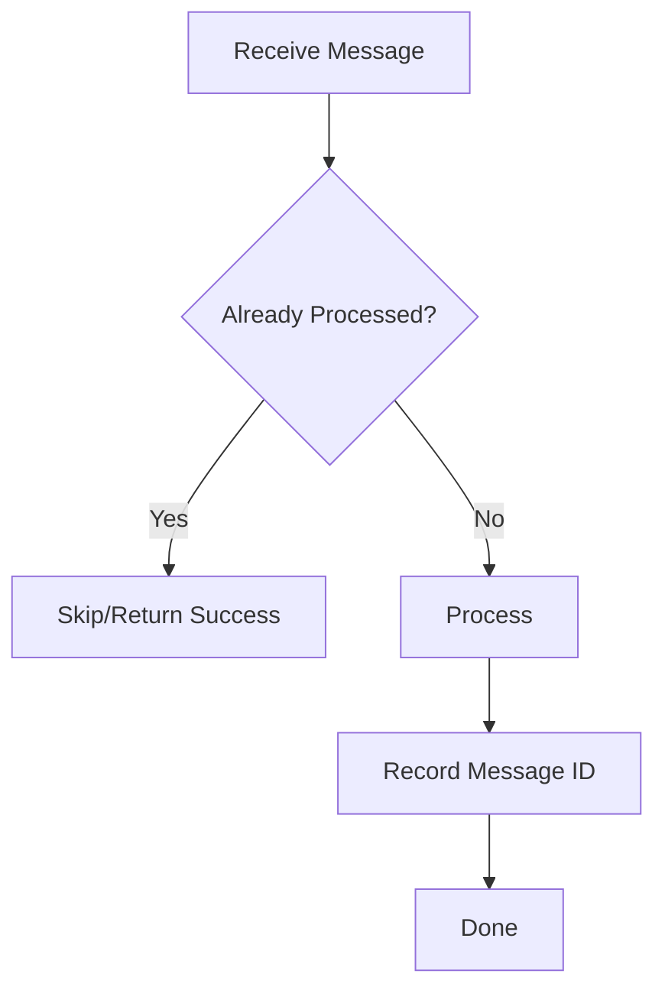
```mermaid
graph TD
    M[Receive Message] --> C{Already Processed?}
    C -->|Yes| S[Skip/Return Success]
    C -->|No| P[Process]
    P --> R[Record Message ID]
    R --> D[Done]
```

**Implementation:**
```python
def process_message(message):
    message_id = message.id
    
    if is_processed(message_id):
        return "Already processed"
    
    # Process the message
    do_work(message)
    
    # Mark as processed
    mark_processed(message_id)
    return "Success"
```

### 5. Transactional Outbox

Ensure atomicity of database and message operations.

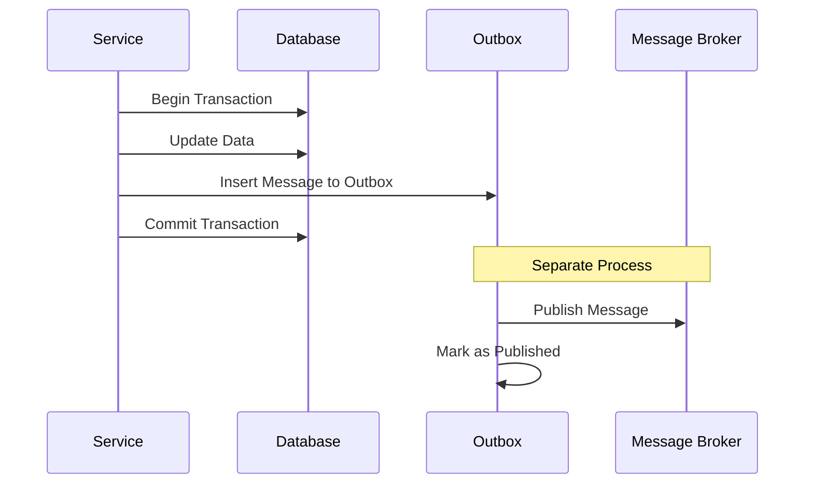
```mermaid
sequenceDiagram
    participant S as Service
    participant DB as Database
    participant O as Outbox
    participant B as Message Broker
    
    S->>DB: Begin Transaction
    S->>DB: Update Data
    S->>O: Insert Message to Outbox
    S->>DB: Commit Transaction
    
    Note over O,B: Separate Process
    O->>B: Publish Message
    O->>O: Mark as Published
```

### 6. Circuit Breaker

Prevent cascade failures.

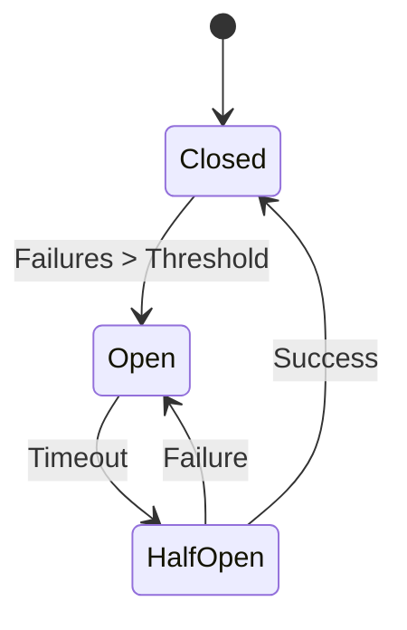
```mermaid
stateDiagram-v2
    [*] --> Closed
    Closed --> Open: Failures > Threshold
    Open --> HalfOpen: Timeout
    HalfOpen --> Closed: Success
    HalfOpen --> Open: Failure
```

| State | Behavior |
|-------|----------|
| **Closed** | Normal operation |
| **Open** | Fail fast, don't attempt |
| **Half-Open** | Test with limited requests |

### 7. Saga Pattern

Manage long-running distributed transactions without a global lock by breaking them into a sequence of local transactions, each publishing events or messages to trigger the next step. On failure, compensating transactions undo completed steps.

#### Choreography-based Saga

Each service listens for events and decides what to do next. No central coordinator.

```mermaid
sequenceDiagram
    participant OS as Order Service
    participant PS as Payment Service
    participant IS as Inventory Service
    participant SS as Shipping Service

    OS->>PS: OrderCreated
    PS->>IS: PaymentCompleted
    IS->>SS: InventoryReserved
    SS->>OS: ShipmentScheduled

    Note over PS,IS: On failure: emit compensating events
    IS-->>PS: InventoryFailed → PaymentRefunded
    PS-->>OS: PaymentRefunded → OrderCancelled
```

#### Orchestration-based Saga

A central saga orchestrator tells each service what to do and handles compensation on failure.

```mermaid
sequenceDiagram
    participant O as Saga Orchestrator
    participant PS as Payment Service
    participant IS as Inventory Service
    participant SS as Shipping Service

    O->>PS: Reserve Payment
    PS->>O: Payment Reserved
    O->>IS: Reserve Inventory
    IS->>O: Inventory Failed
    O->>PS: Refund Payment  (compensating transaction)
    O->>O: Mark Saga Failed
```

#### Compensating Transactions

Each forward step must have a defined compensating action that semantically undoes it.

| Step | Forward Action | Compensating Action |
|------|---------------|--------------------|
| 1 | Create Order | Cancel Order |
| 2 | Reserve Payment | Refund Payment |
| 3 | Reserve Inventory | Release Inventory |
| 4 | Schedule Shipment | Cancel Shipment |

#### Choreography vs Orchestration

| Aspect | Choreography | Orchestration |
|--------|-------------|---------------|
| **Coordination** | Distributed (event-driven) | Centralised (orchestrator) |
| **Coupling** | Low between services | Services coupled to orchestrator |
| **Visibility** | Hard to trace end-to-end | Easy to track in one place |
| **Complexity** | Grows with number of steps | Orchestrator can become complex |
| **Failure handling** | Each service emits compensating events | Orchestrator drives compensation |
| **Best for** | Simple, few-step workflows | Complex, long-running workflows |

| Consideration | Details |
|---|---|
| **Atomicity** | No global ACID; eventual consistency |
| **Idempotency** | Each step must be idempotent (combine with [Idempotent Receiver](#4-idempotent-receiver)) |
| **State tracking** | Saga state stored in DB or dedicated service |
| **Azure tooling** | Durable Functions, Logic Apps, Service Bus sessions |

## Pattern Selection Guide

### By Use Case

| Use Case | Recommended Patterns |
|----------|---------------------|
| **Task Distribution** | Competing Consumers, Queue |
| **Event Notification** | Pub/Sub, Fan-Out |
| **Workflow** | Saga, Orchestration |
| **Data Sync** | CDC, Event Sourcing |
| **Batch Processing** | Splitter, Aggregator |

### By Requirement

| Requirement | Pattern |
|-------------|---------|
| **Reliability** | Guaranteed Delivery, DLQ, Retry |
| **Scalability** | Competing Consumers, Partitioning |
| **Ordering** | Partitioned Queue, Session |
| **Exactly-Once** | Idempotent Receiver, Deduplication |
| **Performance** | Batching, Compression |

### Decision Tree

```mermaid
graph TD
    A[Message Pattern] --> B{Multiple Consumers?}
    B -->|Yes| C{Same Message?}
    B -->|No| D[Point-to-Point Queue]
    C -->|Yes| E[Publish-Subscribe]
    C -->|No| F[Competing Consumers]
    
    E --> G{Need Filtering?}
    G -->|Yes| H[Content-Based Router]
    G -->|No| I[Simple Topic]
```

## Related Topics

- [Queue vs Pub/Sub](./event-driven-messaging/comparisons/queue_vs_pubsub.md)
- [Event-Driven Architecture](./event-driven-messaging/patterns/)
- [Azure Service Bus Patterns](../../architecture-azure/integration/service-bus/)
