# Messaging Patterns

## Table of Contents

- [Introduction](#introduction)
- [Core Messaging Patterns](#core-messaging-patterns)
- [Message Routing Patterns](#message-routing-patterns)
- [Message Transformation Patterns](#message-transformation-patterns)
- [Reliability Patterns](#reliability-patterns)
  - [1. Guaranteed Delivery](#1-guaranteed-delivery)
  - [2. Dead Letter Queue (DLQ)](#2-dead-letter-queue-dlq)
  - [3. Retry Pattern](#3-retry-pattern)
  - [4. Idempotent Receiver](#4-idempotent-receiver)
  - [5. Transactional Outbox](#5-transactional-outbox)
  - [6. Circuit Breaker](#6-circuit-breaker)
  - [7. Saga Pattern](#7-saga-pattern)
- [Pattern Selection Guide](#pattern-selection-guide)
- [Handling Non-Idempotent Services](#handling-non-idempotent-services)
  - [Why It Matters Across All Patterns](#why-it-matters-across-all-patterns)
  - [Risk by Pattern](#risk-by-pattern)
  - [Strategy 1: Idempotency Keys](#strategy-1-idempotency-keys-preferred)
  - [Strategy 2: Pre-check / Read-before-write](#strategy-2-pre-check--read-before-write)
  - [Strategy 3: Async Submission + Confirmation Polling](#strategy-3-async-submission--confirmation-polling)
  - [Strategy 4: Outbox + At-Least-Once with Deduplication](#strategy-4-outbox--at-least-once-with-deduplication)
  - [Strategy 5: Compensate Instead of Retry](#strategy-5-compensate-instead-of-retry)
  - [Strategy 6: State Guard in Orchestrator](#strategy-6-state-guard-in-orchestrator)
  - [Strategy Selection Guide](#strategy-selection-guide)

## Introduction

Messaging patterns are reusable solutions for common problems in message-based communication systems. These patterns help design reliable, scalable, and maintainable integration solutions.

## Core Messaging Patterns

### 1. Point-to-Point (Queue)

Single consumer receives each message.

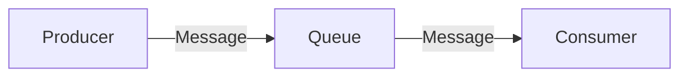
```mermaid
graph LR
    P[Producer] -->|Message| Q[Queue]
    Q -->|Message| C[Consumer]
```

| Characteristic | Description |
|----------------|-------------|
| **Delivery** | Exactly one consumer |
| **Ordering** | FIFO (typically) |
| **Use Case** | Task distribution, work queues |

### 2. Publish-Subscribe (Topic)

Multiple consumers receive each message.

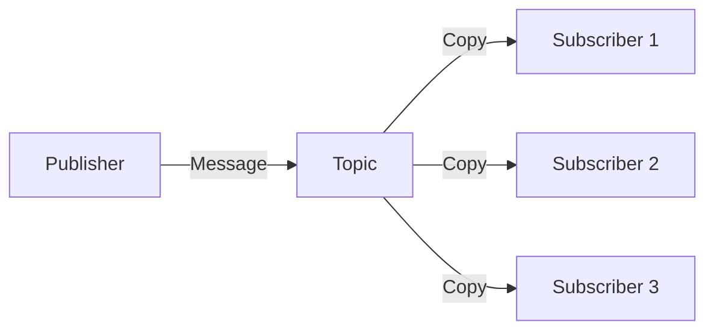
```mermaid
graph LR
    P[Publisher] -->|Message| T[Topic]
    T -->|Copy| S1[Subscriber 1]
    T -->|Copy| S2[Subscriber 2]
    T -->|Copy| S3[Subscriber 3]
```

| Characteristic | Description |
|----------------|-------------|
| **Delivery** | All subscribers |
| **Decoupling** | Publishers don't know subscribers |
| **Use Case** | Event broadcasting, notifications |

### 3. Request-Reply

Synchronous communication with response.

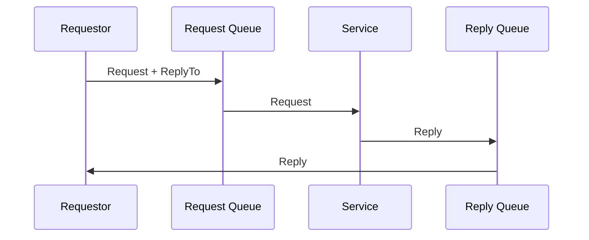
```mermaid
sequenceDiagram
    participant R as Requestor
    participant Q1 as Request Queue
    participant S as Service
    participant Q2 as Reply Queue
    
    R->>Q1: Request + ReplyTo
    Q1->>S: Request
    S->>Q2: Reply
    Q2->>R: Reply
```

| Characteristic | Description |
|----------------|-------------|
| **Communication** | Bidirectional |
| **Correlation** | CorrelationId matching |
| **Use Case** | RPC over messaging |

### 4. Competing Consumers

Multiple consumers process from same queue.

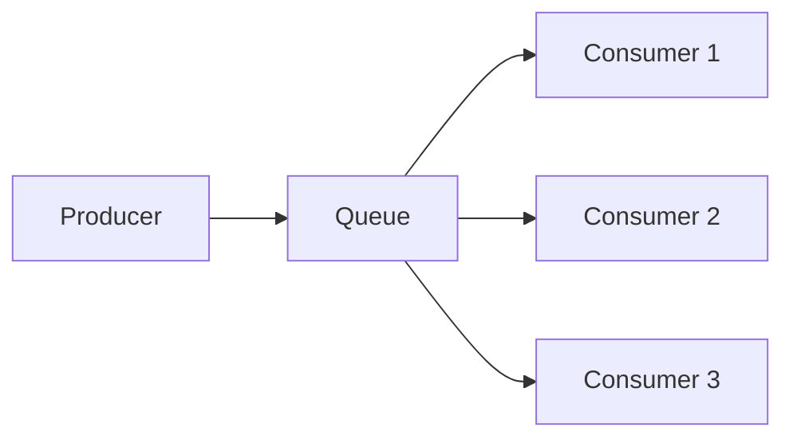
```mermaid
graph LR
    P[Producer] --> Q[Queue]
    Q --> C1[Consumer 1]
    Q --> C2[Consumer 2]
    Q --> C3[Consumer 3]
```

| Characteristic | Description |
|----------------|-------------|
| **Scalability** | Horizontal scaling |
| **Processing** | Parallel |
| **Use Case** | High throughput workloads |

### 5. Fan-Out / Fan-In

Distribute work and aggregate results.

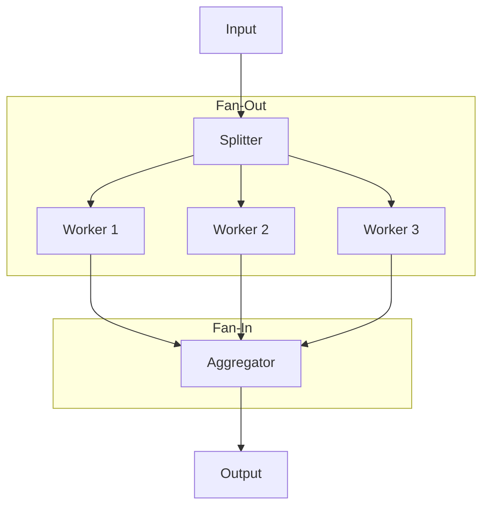
```mermaid
graph TB
    subgraph "Fan-Out"
        S[Splitter] --> W1[Worker 1]
        S --> W2[Worker 2]
        S --> W3[Worker 3]
    end
    
    subgraph "Fan-In"
        W1 --> A[Aggregator]
        W2 --> A
        W3 --> A
    end
    
    I[Input] --> S
    A --> O[Output]
```

| Characteristic | Description |
|----------------|-------------|
| **Processing** | Parallel then merge |
| **Use Case** | Batch processing, map-reduce |

## Message Routing Patterns

### 1. Content-Based Router

Route messages based on content.

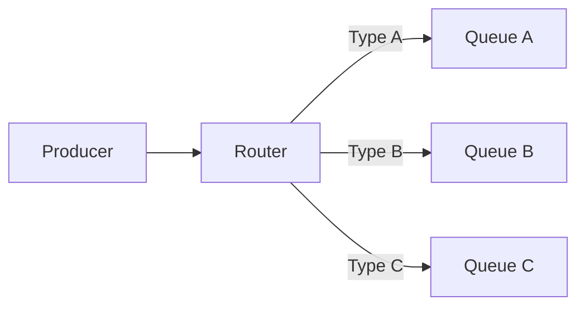
```mermaid
graph LR
    P[Producer] --> R[Router]
    R -->|Type A| QA[Queue A]
    R -->|Type B| QB[Queue B]
    R -->|Type C| QC[Queue C]
```

```python
# Pseudo-code example
def route_message(message):
    if message.type == "order":
        return "orders-queue"
    elif message.type == "inventory":
        return "inventory-queue"
    else:
        return "default-queue"
```

### 2. Message Filter

Selectively process messages.

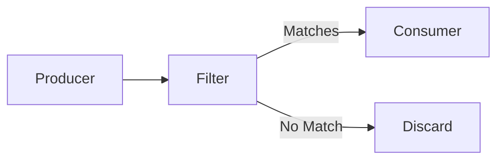
```mermaid
graph LR
    P[Producer] --> F[Filter]
    F -->|Matches| C[Consumer]
    F -->|No Match| X[Discard]
```

### 3. Recipient List

Dynamic routing to multiple recipients.

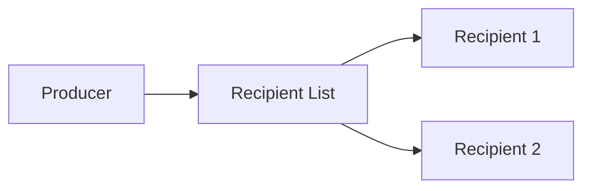
```mermaid
graph LR
    P[Producer] --> RL[Recipient List]
    RL --> R1[Recipient 1]
    RL --> R2[Recipient 2]
```

### 4. Splitter

Break composite message into parts.

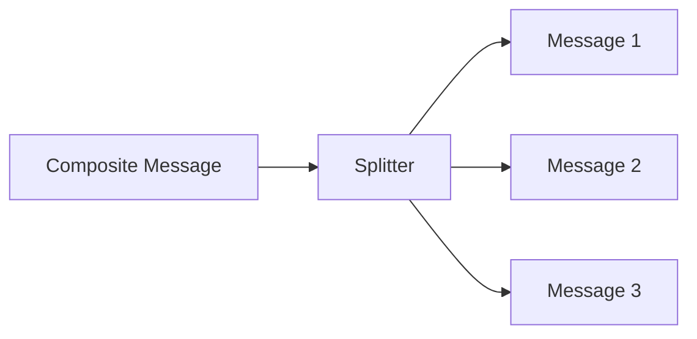
```mermaid
graph LR
    P[Composite Message] --> S[Splitter]
    S --> M1[Message 1]
    S --> M2[Message 2]
    S --> M3[Message 3]
```

### 5. Aggregator

Combine related messages.

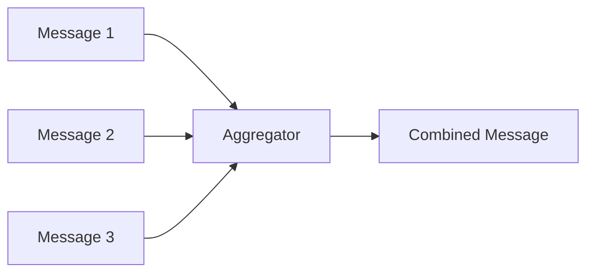
```mermaid
graph LR
    M1[Message 1] --> A[Aggregator]
    M2[Message 2] --> A
    M3[Message 3] --> A
    A --> C[Combined Message]
```

| Strategy | Description |
|----------|-------------|
| **Count** | Wait for N messages |
| **Timeout** | Wait for time period |
| **Completion** | Wait for all parts |

## Message Transformation Patterns

### 1. Message Translator

Convert message format.

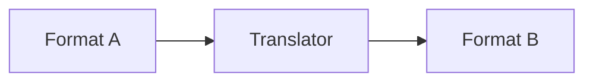
```mermaid
graph LR
    A[Format A] --> T[Translator]
    T --> B[Format B]
```

| Use Case | Example |
|----------|---------|
| **Format** | JSON to XML |
| **Schema** | v1 to v2 |
| **Protocol** | REST to SOAP |

### 2. Envelope Wrapper

Add metadata wrapper.

```json
{
  "envelope": {
    "messageId": "abc-123",
    "timestamp": "2025-01-01T00:00:00Z",
    "source": "system-a"
  },
  "payload": {
    "orderId": "12345",
    "amount": 99.99
  }
}
```

### 3. Content Enricher

Add data from external sources.

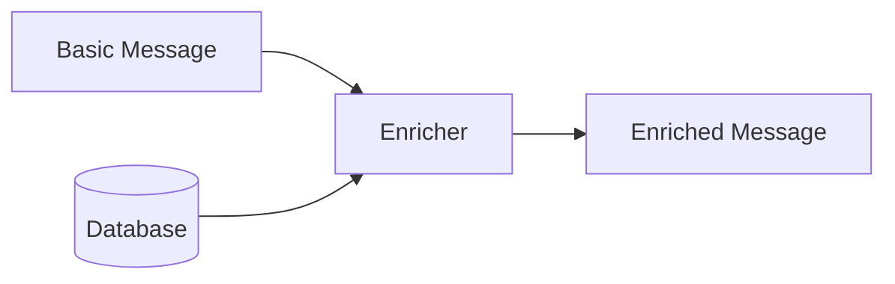
```mermaid
graph LR
    M1[Basic Message] --> E[Enricher]
    DB[(Database)] --> E
    E --> M2[Enriched Message]
```

### 4. Content Filter

Remove unnecessary data.

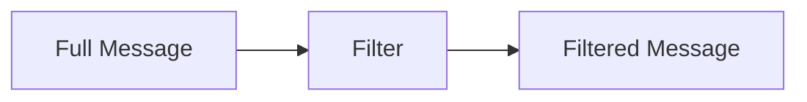
```mermaid
graph LR
    M1[Full Message] --> F[Filter]
    F --> M2[Filtered Message]
```

### 5. Normalizer

Convert various formats to canonical form.

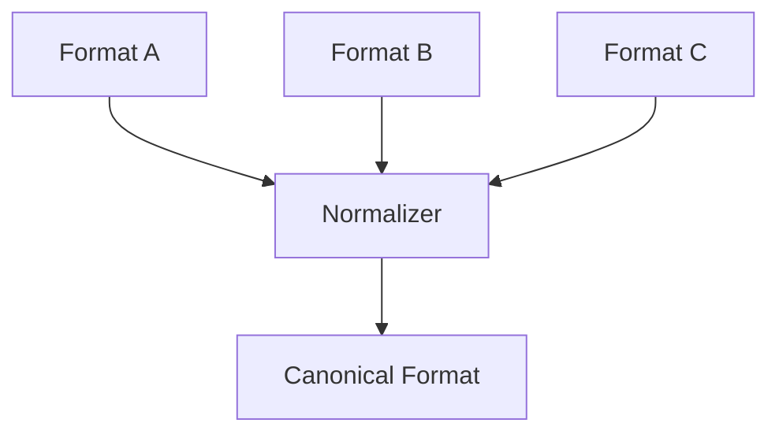
```mermaid
graph TB
    A[Format A] --> N[Normalizer]
    B[Format B] --> N
    C[Format C] --> N
    N --> CF[Canonical Format]
```

### 6. Claim Check

Store large payloads externally and transmit a lightweight reference token over the broker.

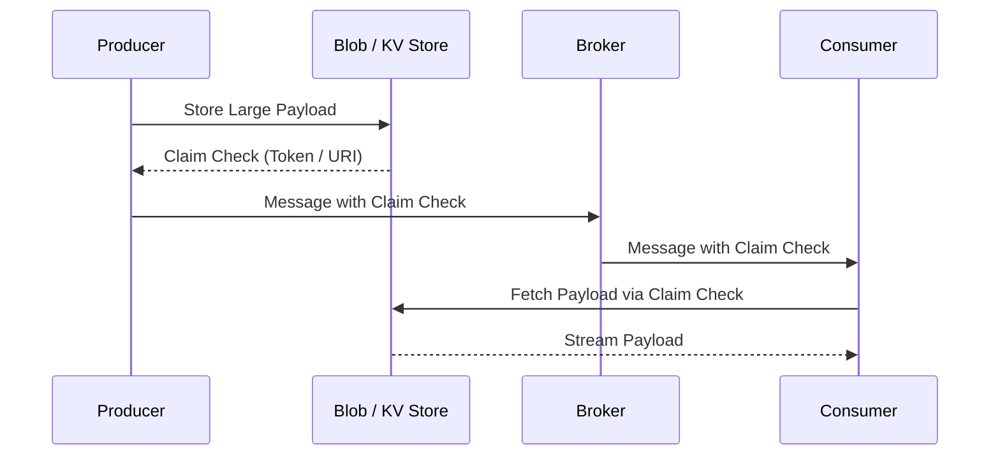
```mermaid
sequenceDiagram
    participant P as Producer
    participant DS as Blob / KV Store
    participant B as Broker
    participant C as Consumer

    P->>DS: Store Large Payload
    DS-->>P: Claim Check (Token / URI)
    P->>B: Message with Claim Check
    B->>C: Message with Claim Check
    C->>DS: Fetch Payload via Claim Check
    DS-->>C: Stream Payload
```

> **Deep Dive**: See [Claim Check Pattern](claim-check.md) for detailed architecture, token structures, eviction strategies, and Azure/AWS implementations.

## Reliability Patterns

### 1. Guaranteed Delivery

Ensure message delivery with persistence.

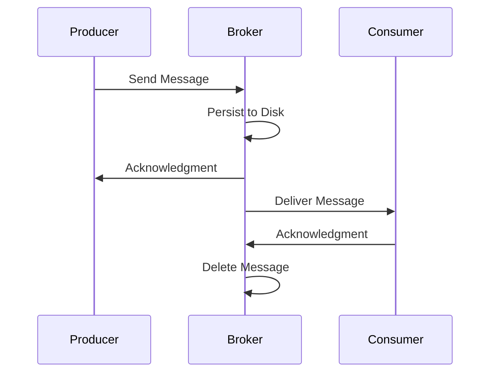
```mermaid
sequenceDiagram
    participant P as Producer
    participant B as Broker
    participant C as Consumer
    
    P->>B: Send Message
    B->>B: Persist to Disk
    B->>P: Acknowledgment
    B->>C: Deliver Message
    C->>B: Acknowledgment
    B->>B: Delete Message
```

### 2. Dead Letter Queue (DLQ)

Handle unprocessable messages.

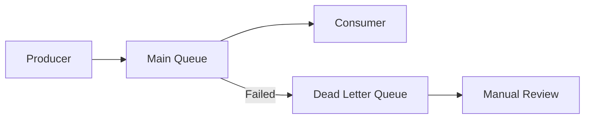
```mermaid
graph LR
    P[Producer] --> Q[Main Queue]
    Q --> C[Consumer]
    Q -->|Failed| DLQ[Dead Letter Queue]
    DLQ --> M[Manual Review]
```

| Scenario | Action |
|----------|--------|
| **Max Retries** | Move to DLQ |
| **Invalid Format** | Move to DLQ |
| **Processing Error** | Move to DLQ |

### 3. Retry Pattern

Automatic retry with backoff.

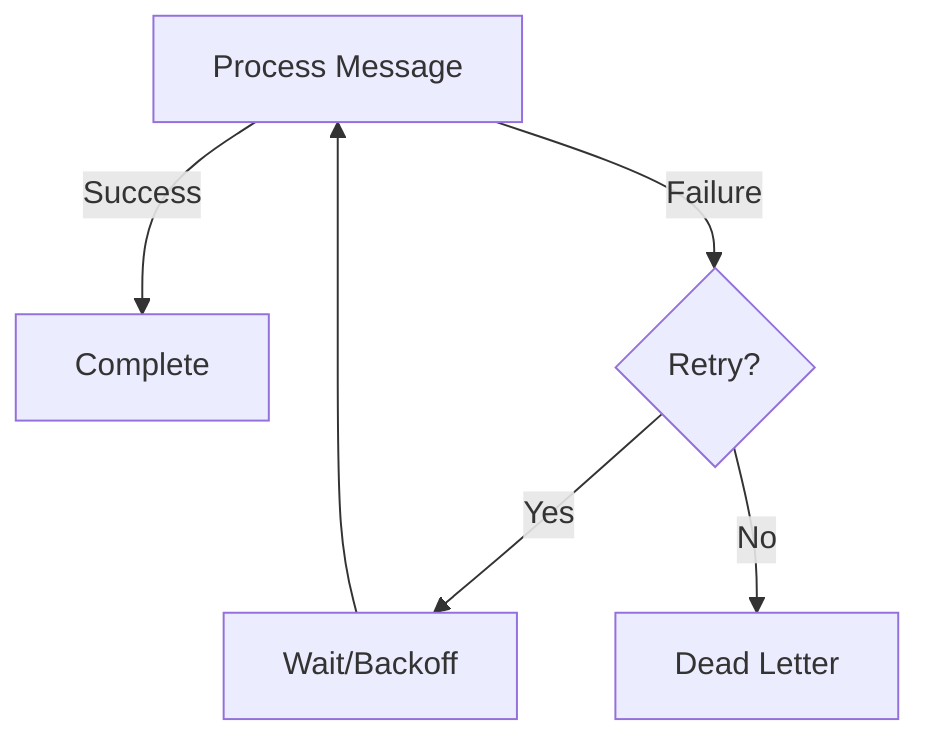
```mermaid
graph TD
    P[Process Message] -->|Success| S[Complete]
    P -->|Failure| R{Retry?}
    R -->|Yes| W[Wait/Backoff]
    W --> P
    R -->|No| DLQ[Dead Letter]
```

**Backoff Strategies:**

| Strategy | Formula | Example |
|----------|---------|---------|
| **Fixed** | delay = constant | 5s, 5s, 5s |
| **Linear** | delay = attempt × base | 5s, 10s, 15s |
| **Exponential** | delay = base^attempt | 2s, 4s, 8s, 16s |
| **Jitter** | delay ± random | Prevents thundering herd |

### 4. Idempotent Receiver

Handle duplicate messages safely.

> 📄 **[Full Guide: Idempotency Store Pattern](./idempotency-store-pattern.md)** — key design, Redis vs DB vs broker-native, TTL strategy, atomic patterns

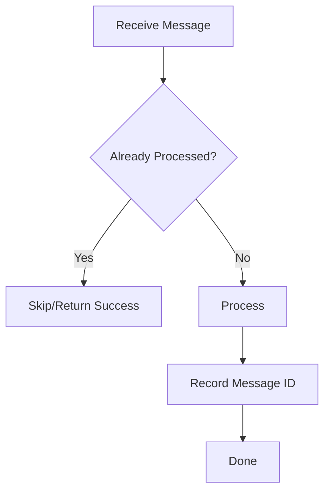
```mermaid
graph TD
    M[Receive Message] --> C{Already Processed?}
    C -->|Yes| S[Skip/Return Success]
    C -->|No| P[Process]
    P --> R[Record Message ID]
    R --> D[Done]
```

**Implementation:**
```python
def process_message(message):
    message_id = message.id
    
    if is_processed(message_id):
        return "Already processed"
    
    # Process the message
    do_work(message)
    
    # Mark as processed
    mark_processed(message_id)
    return "Success"
```

### 5. Transactional Outbox

Ensure atomicity of database and message operations.

> 📄 **[Full Guide: Transactional Outbox Pattern](./outbox-pattern.md)** — detailed schema, CDC vs polling, failure scenarios, Azure implementation

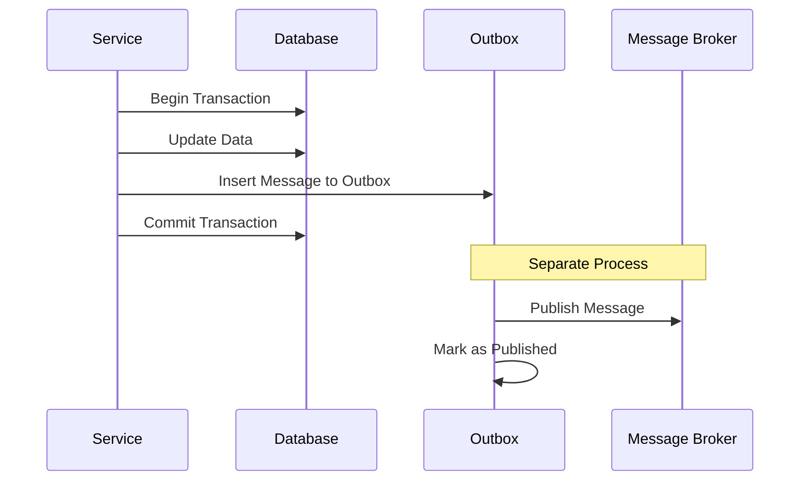
```mermaid
sequenceDiagram
    participant S as Service
    participant DB as Database
    participant O as Outbox
    participant B as Message Broker
    
    S->>DB: Begin Transaction
    S->>DB: Update Data
    S->>O: Insert Message to Outbox
    S->>DB: Commit Transaction
    
    Note over O,B: Separate Process
    O->>B: Publish Message
    O->>O: Mark as Published
```

### 6. Circuit Breaker

Prevent cascade failures.

```mermaid
stateDiagram-v2
    [*] --> Closed
    Closed --> Open: Failures > Threshold
    Open --> HalfOpen: Timeout
    HalfOpen --> Closed: Success
    HalfOpen --> Open: Failure
```

| State | Behavior |
|-------|----------|
| **Closed** | Normal operation |
| **Open** | Fail fast, don't attempt |
| **Half-Open** | Test with limited requests |

### 7. Saga Pattern

Manage long-running distributed transactions without a global lock by breaking them into a sequence of local transactions, each publishing events or messages to trigger the next step. On failure, compensating transactions undo completed steps.

#### Choreography-based Saga

Each service listens for events and decides what to do next. No central coordinator.

```mermaid
sequenceDiagram
    participant OS as Order Service
    participant PS as Payment Service
    participant IS as Inventory Service
    participant SS as Shipping Service

    OS->>PS: OrderCreated
    PS->>IS: PaymentCompleted
    IS->>SS: InventoryReserved
    SS->>OS: ShipmentScheduled

    Note over PS,IS: On failure: emit compensating events
    IS-->>PS: InventoryFailed → PaymentRefunded
    PS-->>OS: PaymentRefunded → OrderCancelled
```

#### Orchestration-based Saga

A central saga orchestrator tells each service what to do and handles compensation on failure.

```mermaid
sequenceDiagram
    participant O as Saga Orchestrator
    participant PS as Payment Service
    participant IS as Inventory Service
    participant SS as Shipping Service

    O->>PS: Reserve Payment
    PS->>O: Payment Reserved
    O->>IS: Reserve Inventory
    IS->>O: Inventory Failed
    O->>PS: Refund Payment  (compensating transaction)
    O->>O: Mark Saga Failed
```

#### Compensating Transactions

Each forward step must have a defined compensating action that semantically undoes it.

| Step | Forward Action | Compensating Action |
|------|---------------|--------------------|
| 1 | Create Order | Cancel Order |
| 2 | Reserve Payment | Refund Payment |
| 3 | Reserve Inventory | Release Inventory |
| 4 | Schedule Shipment | Cancel Shipment |

#### Choreography vs Orchestration

| Aspect | Choreography | Orchestration |
|--------|-------------|---------------|
| **Coordination** | Distributed (event-driven) | Centralised (orchestrator) |
| **Coupling** | Low between services | Services coupled to orchestrator |
| **Visibility** | Hard to trace end-to-end | Easy to track in one place |
| **Complexity** | Grows with number of steps | Orchestrator can become complex |
| **Failure handling** | Each service emits compensating events | Orchestrator drives compensation |
| **Best for** | Simple, few-step workflows | Complex, long-running workflows |

| Consideration | Details |
|---|---|
| **Atomicity** | No global ACID; eventual consistency |
| **Idempotency** | Each step must be idempotent (combine with [Idempotent Receiver](#4-idempotent-receiver)) |
| **State tracking** | Saga state stored in DB or dedicated service |
| **Azure tooling** | Durable Functions, Logic Apps, Service Bus sessions |

#### DLQ in the Saga Pattern

A DLQ still exists at the **message broker level** for each queue in the saga flow. However, the saga layer introduces an additional failure dimension on top of standard DLQ semantics.

**Two distinct failure layers:**

| Layer | Failure Type | Handled By |
|---|---|---|
| Message broker | Undeliverable / unparseable message | Standard DLQ |
| Saga step | Expected business failure (e.g. payment declined) | Compensating transactions |
| Saga orchestrator | Step exceeds max retries / compensation fails | Saga-level dead letter store |

**Why a saga-level dead letter store is necessary:**

Compensating transactions handle *expected* business failures by design. But if a **compensating transaction itself fails** (e.g. the refund service is down during rollback), the saga enters an **inconsistent/stuck state** that neither the broker DLQ nor normal compensation can resolve. A saga-level dead letter store captures these stuck sagas for manual intervention or a dedicated recovery process.

```mermaid
graph TD
    S[Saga Step] -->|Success| N[Next Step]
    S -->|Business Failure| C[Compensating Transaction]
    S -->|Transient Failure| RS[Retry with Backoff]
    RS -->|Retries Exhausted| DLQ[Broker DLQ]
    RS -->|Success| N
    C -->|Success| R[Saga Rolled Back]
    C -->|Transient Failure| RC[Retry Compensation with Backoff]
    RC -->|Success| R
    RC -->|Retries Exhausted| SDL[Saga Dead Letter Store]
    S -->|Message Undeliverable| DLQ
    SDL --> M[Manual Intervention / Recovery Process]
    DLQ --> M
```

**Choreography vs Orchestration — DLQ detectability:**

| Aspect | Choreography | Orchestration |
|---|---|---|
| Detecting stuck saga | Hard — must correlate events across services | Easy — orchestrator holds saga state |
| Saga dead letter store | Harder to implement consistently | Natural fit — orchestrator writes failed sagas to store |
| Broker DLQ | Per-service, independent | Per-service, independent |

**Retry is required at every layer — moving to DLQ or the saga dead letter store should always be the last resort after retries are exhausted:**

| Layer | Retry Strategy | When to Stop Retrying |
|---|---|---|
| Broker (step message) | Exponential backoff + jitter | Max delivery count reached → Broker DLQ |
| Saga step execution | Exponential backoff (orchestrator or consumer) | Timeout / max attempts → trigger compensation |
| Compensating transaction | Exponential backoff | Max attempts exhausted → Saga dead letter store |

Skipping retry — especially on compensating transactions — risks sending a saga to the dead letter store for what is a transient network or availability blip. Since compensating transactions are the safety net for rollback, they must be as resilient as possible.

- Monitor broker DLQs on all queues participating in the saga
- Track saga state transitions; alert when a saga remains in an intermediate state beyond a timeout threshold
- Store stuck sagas with full context (current step, attempted compensations, error details) to enable replay or manual resolution
- Consider a **saga recovery service** that periodically scans for stuck sagas and retries or escalates

## Pattern Selection Guide

### By Use Case

| Use Case | Recommended Patterns |
|----------|---------------------|
| **Task Distribution** | Competing Consumers, Queue |
| **Event Notification** | Pub/Sub, Fan-Out |
| **Workflow** | Saga, Orchestration |
| **Data Sync** | CDC, Event Sourcing |
| **Batch Processing** | Splitter, Aggregator |

### By Requirement

| Requirement | Pattern |
|-------------|---------|
| **Reliability** | Guaranteed Delivery, DLQ, Retry |
| **Scalability** | Competing Consumers, Partitioning |
| **Ordering** | Partitioned Queue, Session |
| **Exactly-Once** | Idempotent Receiver, Deduplication |
| **Performance** | Batching, Compression |

### Decision Tree

```mermaid
graph TD
    A[Message Pattern] --> B{Multiple Consumers?}
    B -->|Yes| C{Same Message?}
    B -->|No| D[Point-to-Point Queue]
    C -->|Yes| E[Publish-Subscribe]
    C -->|No| F[Competing Consumers]
    
    E --> G{Need Filtering?}
    G -->|Yes| H[Content-Based Router]
    G -->|No| I[Simple Topic]
```

## Handling Non-Idempotent Services

Retries, redeliveries, and at-least-once delivery guarantees are fundamental to reliable messaging. When a called service is **not idempotent**, any retry — regardless of which pattern triggered it — risks executing the operation more than once, leading to duplicate charges, double bookings, duplicate notifications, or corrupted state.

This section covers the risks per pattern and the strategies to mitigate them.

### Why It Matters Across All Patterns

Every reliability mechanism in messaging can cause duplicate calls:

| Mechanism | How Duplicates Arise |
|---|---|
| Retry Pattern | Transient failure after successful execution but before acknowledgment |
| At-least-once delivery | Broker redelivers message if consumer crashes before ack |
| Competing Consumers | Two consumers pick up the same message during a visibility timeout race |
| Fan-Out | Each subscriber receives and processes a copy; if one retries, it re-executes |
| Saga (step retry) | Step retried after timeout; original call may have succeeded |
| Saga (compensation retry) | Compensating transaction retried; may execute the undo twice |
| Circuit Breaker half-open | Test request may duplicate an in-flight operation |
| Transactional Outbox | Message published twice if outbox relay crashes mid-publish |

### Risk by Pattern

| Pattern | Idempotency Risk | Severity |
|---|---|---|
| Point-to-Point Queue | At-least-once redelivery | Medium |
| Pub/Sub | Each subscriber independently retries | Medium |
| Competing Consumers | Visibility timeout race → double processing | High |
| Request-Reply | Caller retries request; service executes twice | High |
| Fan-Out / Fan-In | Each worker may retry its slice | Medium |
| Retry Pattern | Core source of duplicate execution | High |
| Transactional Outbox | Relay may publish same message twice | Medium |
| Saga (step) | Step retried after ambiguous outcome | High |
| Saga (compensation) | Undo applied twice → over-refund, etc. | Critical |

### Strategy 1: Idempotency Keys (preferred)

Pass a stable, deterministic key with every request. The called service uses it to detect and skip duplicate executions.

```
POST /payments
X-Idempotency-Key: saga-id:step-payment:order-12345

{ "amount": 99.99, "account": "ACC001" }
```

The service stores `(idempotency-key → result)`. On retry with the same key, it returns the stored result without re-executing.

**Key design rules:**

| Rule | Detail |
|---|---|
| Stable across retries | Must not change between attempts for the same logical operation |
| Unique per operation | Different operations must have different keys |
| Never reused | A key retired after TTL must never be reassigned |
| Recommended pattern | `{saga-or-correlation-id}:{step-name}:{entity-id}` |

```mermaid
sequenceDiagram
    participant C as Caller
    participant S as Service
    participant DB as Idempotency Store

    C->>S: POST /payments (Key: K1)
    S->>DB: Lookup K1
    DB->>S: Not found
    S->>S: Execute payment
    S->>DB: Store K1 → success
    S->>C: 200 OK

    Note over C,S: Network drop — caller retries

    C->>S: POST /payments (Key: K1)
    S->>DB: Lookup K1
    DB->>S: Found → success
    S->>C: 200 OK (no re-execution)
```

**Applicability:** Any pattern. Mandate as a contract requirement for all services participating in retried or saga-driven flows.

---

### Strategy 2: Pre-check / Read-before-write

Query the target service for existing state before issuing a mutating call.

```
GET /payments?correlationId=order-12345
→ 404 Not Found   → proceed with POST
→ 200 Completed   → treat as success, skip POST
```

**Limitation:** Check-then-act is not atomic. A concurrent request between GET and POST can still cause a duplicate. Use only when the service exposes a reliable query API and concurrency risk is low.

**Applicability:** Saga steps, Request-Reply, any flow where mutation can be queried independently.

---

### Strategy 3: Async Submission + Confirmation Polling

Separate submission from confirmation and treat submission as a one-time command. In this strategy, the caller does not rely on client-supplied idempotency keys. Instead, duplicate risk is controlled by never re-submitting the command after an ambiguous submission result.

```
POST /payments → 202 Accepted { "jobId": "JOB-001" }
GET  /payments/JOB-001 → poll until COMPLETED or FAILED
```

```mermaid
sequenceDiagram
    participant C as Caller
    participant S as Service

    C->>S: POST /payments → 202 Accepted
    loop Poll until terminal state
        C->>S: GET /payments/JOB-001
        S->>C: 200 { status: IN_PROGRESS }
    end
    S->>C: 200 { status: COMPLETED }
```

**Failure handling and retry policy:**

| Failure Case | What To Do | Why |
|---|---|---|
| POST returns `202` with `jobId` | Start polling with retry/backoff on `GET /status` | Polling is idempotent and safe to retry |
| POST times out / connection drops before response | Do not retry POST automatically; mark operation as `SUBMISSION_UNKNOWN` and start reconciliation workflow | Avoids accidental duplicate execution |
| Status endpoint temporarily unavailable (`5xx` / timeout) | Retry polling with exponential backoff + jitter until overall timeout | Handles transient outages safely |
| Status remains `IN_PROGRESS` beyond SLA | Mark as `PENDING_MANUAL_REVIEW` or trigger compensating path per policy | Avoids infinite polling and stuck workflows |
| Status becomes `FAILED` | Apply bounded retries if failure is transient; otherwise trigger compensation and mark step failed | Keeps rollback deterministic |

**Safe submission rule (distinct from Strategy 1):**

- Submit once.
- If acknowledgment is ambiguous, do not re-submit from the saga step.
- Use a reconciliation channel to determine eventual outcome before continuing the workflow.

**Typical reconciliation options:**

Reconciliation means determining what actually happened after an ambiguous submit result (for example, request timeout before acknowledgment). The goal is to establish a reliable final truth without sending the same command again.

In practice, reconciliation asks three questions:

- Was the operation applied successfully?
- Did it fail and require compensation?
- Is the outcome still unknown and needs manual review?

| Option | How It Works | Trade-off |
|---|---|---|
| Provider callback/webhook | Service emits completion event to callback endpoint | Requires reliable callback handling |
| Provider operation ledger | Operations team or reconciliation job queries provider-side audit/ledger by time/window/account | Slower, but safe without duplicate submit |
| Settlement reconciliation | Downstream settlement/report confirms whether action was applied | Highest latency, strongest financial correctness |

```mermaid
flowchart TD
    A[Submit command once] --> B{Ack with jobId?}
    B -->|Yes| C[Poll status with backoff]
    C --> D{Final status?}
    D -->|Success| H1[Status success]
    D -->|Failed| J1[Status failed]
    D -->|Still pending| C
    B -->|No or timeout| E[Mark submission unknown]
    E --> F[Reconcile actual outcome]
    F --> G{Confirmed?}
    G -->|Success| H2[Reconcile success]
    G -->|Failure| J2[Reconcile failed]
    G -->|Unknown| K[Manual review hold]
    H1 --> H[Continue saga]
    H2 --> H
    J1 --> J[Compensate or fail step]
    J2 --> J
```

**Applicability:** Any pattern where the service supports async semantics and business correctness is more important than immediate completion. This strategy prioritizes no-duplicate execution over fast automatic recovery.

---

### Strategy 4: Outbox + At-Least-Once with Deduplication

When using the [Transactional Outbox](#5-transactional-outbox), the relay may publish the same message more than once if it crashes mid-publish. Combine with a **deduplication store** at the consumer.

```mermaid
sequenceDiagram
    participant R as Outbox Relay
    participant B as Broker
    participant C as Consumer
    participant D as Dedup Store

    R->>B: Publish message (msgId: M1)
    B->>C: Deliver M1
    C->>D: Seen M1?
    D->>C: No
    C->>C: Process
    C->>D: Mark M1 seen

    Note over R,B: Relay crashes and republishes
    B->>C: Deliver M1 again
    C->>D: Seen M1?
    D->>C: Yes → skip
```

**Applicability:** Transactional Outbox, Pub/Sub, Competing Consumers — any at-least-once delivery scenario.

---

### Strategy 5: Compensate Instead of Retry

If a service is non-idempotent, cannot be changed, and has no query API, avoid retrying on ambiguous outcomes entirely. Treat the uncertainty as a failure and trigger the compensating transaction.

**Only safe when:**
- The compensating transaction is itself idempotent
- The business cost of rolling back is lower than the risk of a duplicate forward execution

**Not recommended as a primary strategy** — it converts a transient fault into a full rollback unnecessarily. Use only as a last resort for unmodifiable third-party services.

---

### Strategy 6: State Guard in Orchestrator

For orchestration-based Sagas (and similar stateful workflows), track the confirmed outcome of each step in the orchestrator's own state store. Before retrying, check whether a previous attempt reached a confirmed terminal state.

```python
if saga.steps["payment"].status == "CONFIRMED":
    # Skip — already succeeded
    advance_to_next_step()
else:
    retry_step("payment")
```

**Requires:** The service must return a reliably queryable and durable outcome. Combine with Strategy 1 or Strategy 3 for full coverage.

**Applicability:** Orchestration-based Saga, Durable Functions, stateful workflow engines.

---

### Strategy Selection Guide

| Scenario | Recommended Strategy |
|---|---|
| You control the called service API | Idempotency Keys (Strategy 1) |
| Third-party service, no idempotency key support | Async polling (Strategy 3) or Pre-check (Strategy 2) |
| Unmodifiable service, no query API | Compensate instead of retry (Strategy 5) — last resort |
| At-least-once broker delivery | Consumer-side deduplication store (Strategy 4) |
| Orchestration-based saga | State guard (Strategy 6) + Idempotency Keys |
| Choreography-based saga | Idempotency Keys on every step — no central guard available |
| High-concurrency competing consumers | Idempotency Keys + deduplication store (Strategies 1 + 4) |

> **Design principle**: Idempotency is a **contract requirement** for any service that participates in a retried, at-least-once, or saga-driven flow. Treating it as optional leads to data inconsistencies that are difficult to detect and expensive to remediate.

---

## Related Topics

- [Queue vs Pub/Sub](./event-driven-messaging/comparisons/queue_vs_pubsub.md)
- [Event-Driven Architecture](./event-driven-messaging/patterns/)
- [Azure Service Bus Patterns](../../architecture-azure/integration/service-bus/)
