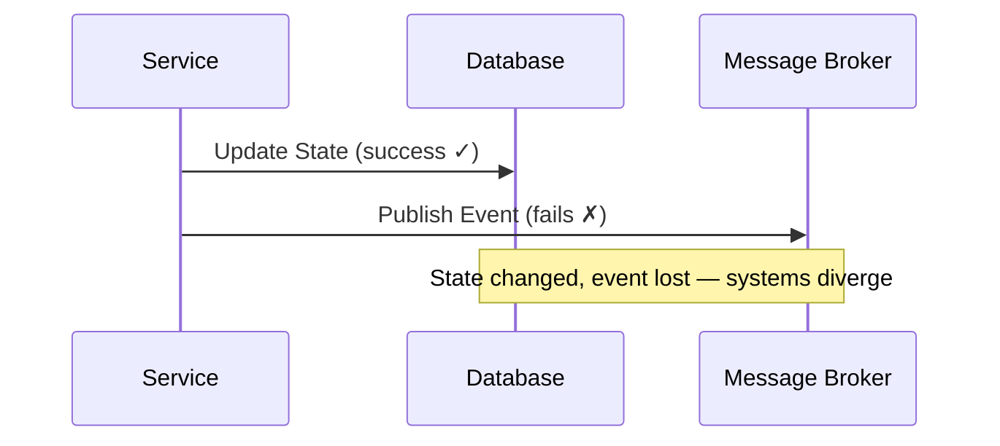
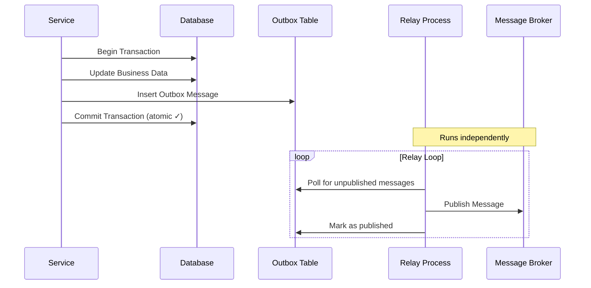
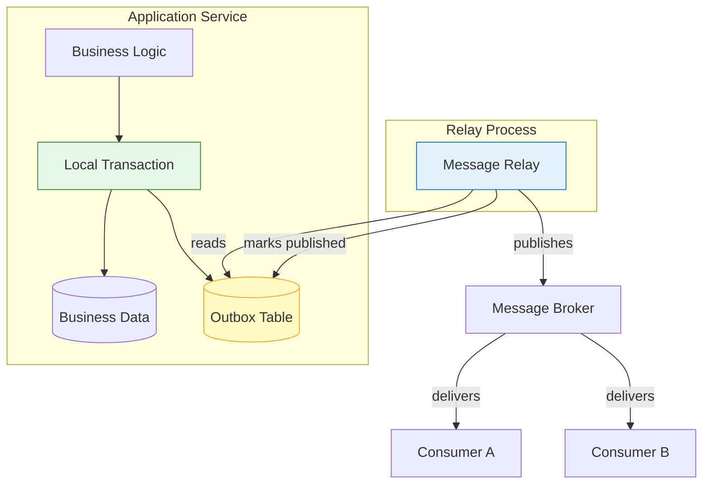
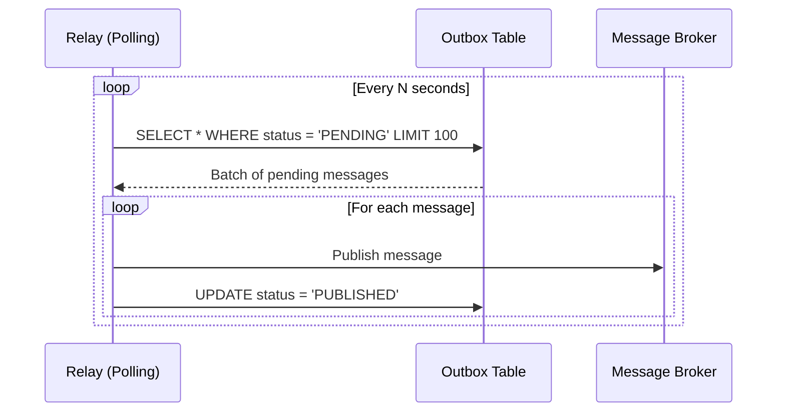
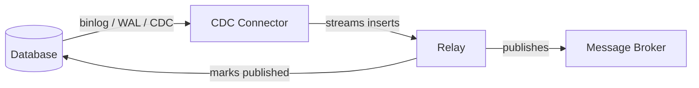
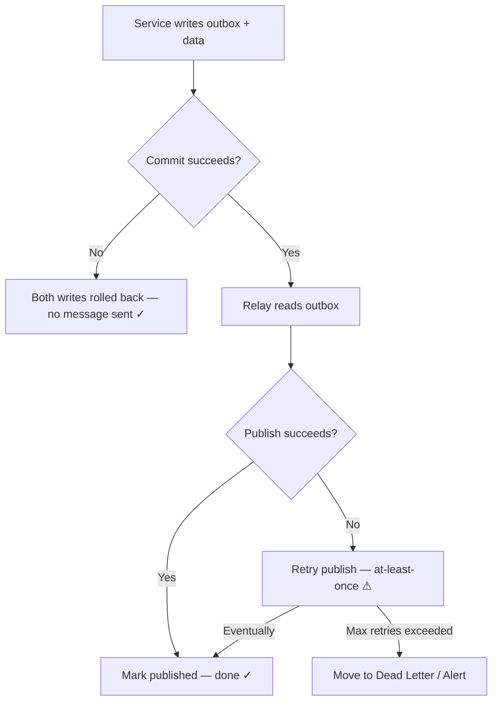
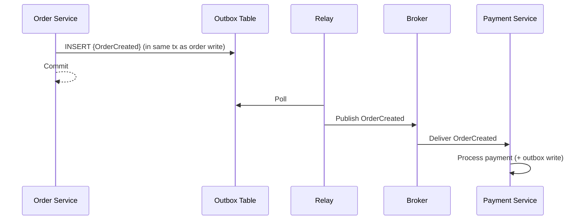
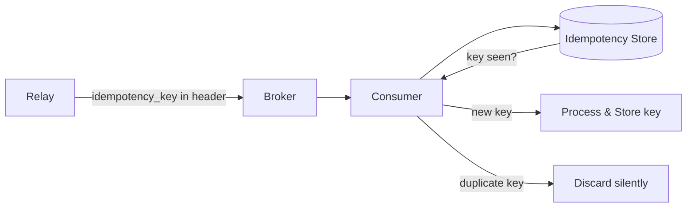
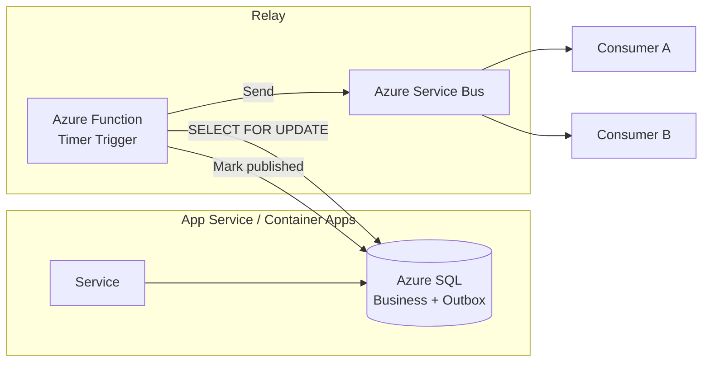
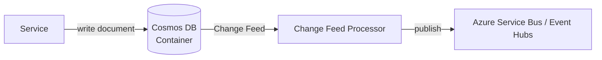

# Transactional Outbox Pattern

> **Taxonomy Reference**: §3.3 Event-Driven & Messaging — Reliability Patterns (see [architecture_taxonomy_reference.md](../10-practicality-taxonomy/architecture_taxonomy_reference.md))

## Table of Contents

- [Problem](#problem)
- [Solution](#solution)
- [Abstraction Level](#abstraction-level)
- [Architecture](#architecture)
- [How It Works](#how-it-works)
- [Delivery Approaches](#delivery-approaches)
  - [Polling Publisher](#1-polling-publisher)
  - [Transaction Log Tailing (CDC)](#2-transaction-log-tailing-cdc)
- [Implementation Considerations](#implementation-considerations)
- [Outbox Table Schema](#outbox-table-schema)
- [When to Use](#when-to-use)
- [When NOT to Use](#when-not-to-use)
- [Failure Scenarios and Mitigations](#failure-scenarios-and-mitigations)
- [Combining with Other Patterns](#combining-with-other-patterns)
- [Trade-offs](#trade-offs)
- [Related Patterns](#related-patterns)
- [Azure Implementation](#azure-implementation)

---

## Problem

In distributed systems, a service often needs to **atomically update its database and publish a message** to a message broker. Without a solution, the following failure modes exist:

1. **Update succeeds, publish fails** — the system state changes but downstream services are never notified.
2. **Publish succeeds, update fails (or rollback)** — downstream services act on an event that should never have happened.
3. **Dual write without coordination** — no two-phase commit across a database and a message broker is practical at scale.



This is the **dual-write problem**: distributed systems cannot atomically write to two independent systems without a coordination protocol.

---

## Solution

Write the message to an **outbox table in the same database transaction** as the business state update. A separate relay process reads from the outbox and publishes messages to the broker. If the relay crashes, it retries — resulting in **at-least-once delivery**.



The key insight: **the outbox write and the business update share a single local transaction**. No distributed transaction is needed.

---

## Abstraction Level

- [ ] Conceptual (Strategic)
- [x] Logical (Design)
- [x] Physical (Implementation)
- [ ] Runtime (Operational)

---

## Architecture



---

## How It Works

| Step | Actor | Action |
|------|-------|--------|
| 1 | Service | Begins a local database transaction |
| 2 | Service | Writes business state changes |
| 3 | Service | Inserts message record into outbox table |
| 4 | Service | Commits transaction (both writes are atomic) |
| 5 | Relay | Polls outbox table for unpublished records |
| 6 | Relay | Publishes each message to the message broker |
| 7 | Relay | Marks message as published (or deletes it) |

If the relay fails between steps 6 and 7, the message will be published again on retry — consumers **must be idempotent**.

---

## Delivery Approaches

### 1. Polling Publisher

A scheduled job or background thread periodically queries the outbox table for unprocessed messages.



**Characteristics:**

| Aspect | Detail |
|--------|--------|
| **Simplicity** | Easy to implement, no extra infrastructure |
| **Latency** | Polling interval introduces delay (seconds to minutes) |
| **Database load** | Repeated queries, may require index on `(status, created_at)` |
| **Scalability** | Single relay avoids duplicate publishing; partitioned relay requires coordination |

**Recommended index:**

```sql
CREATE INDEX idx_outbox_pending ON outbox (status, created_at)
WHERE status = 'PENDING';
```

---

### 2. Transaction Log Tailing (CDC)

Reads the database's transaction/replication log (Change Data Capture) to detect outbox inserts without polling.



**Tools:**

| Database | CDC Mechanism | Common Tool |
|----------|--------------|-------------|
| PostgreSQL | Logical Replication / WAL | Debezium, pgoutput |
| MySQL / MariaDB | Binary Log (binlog) | Debezium, Maxwell |
| SQL Server | SQL Server CDC | Debezium |
| MongoDB | Change Streams | Debezium, custom relay |
| Azure SQL | Change Tracking / CDC | Azure Data Factory, Debezium |

**Characteristics:**

| Aspect | Detail |
|--------|--------|
| **Latency** | Near real-time (milliseconds) |
| **Database load** | Minimal — reads log, not the table |
| **Complexity** | Requires CDC infrastructure and log retention configuration |
| **Ordering** | Naturally preserves insertion order per partition |

---

## Implementation Considerations

### Relay Process Design

- **Single relay per outbox partition** avoids duplicate publishing without coordination.
- **Idempotency key** on broker messages allows consumers to deduplicate if relay publishes twice.
- Use **optimistic locking** or `SELECT FOR UPDATE SKIP LOCKED` when multiple relay instances must coexist.

```sql
-- PostgreSQL: claim a batch without blocking other relays
SELECT id, payload, topic
FROM outbox
WHERE status = 'PENDING'
ORDER BY created_at
LIMIT 100
FOR UPDATE SKIP LOCKED;
```

### Message Ordering

- Outbox guarantees **per-aggregate ordering** if messages are partitioned by aggregate ID.
- Brokers with partition keys (Kafka, Azure Event Hubs) preserve order within a partition.
- Global ordering across aggregates is not guaranteed without additional sequencing.

### Retention and Cleanup

| Strategy | Description |
|----------|-------------|
| **Delete after publish** | Keeps table small; no replay capability |
| **Soft-delete (status flag)** | Enables replay; requires periodic archival/purge |
| **Retention window** | Keep records for N days for debugging; then delete |

---

## Outbox Table Schema

```sql
CREATE TABLE outbox (
    id              UUID          PRIMARY KEY DEFAULT gen_random_uuid(),
    aggregate_id    VARCHAR(255)  NOT NULL,        -- e.g. order ID
    aggregate_type  VARCHAR(100)  NOT NULL,        -- e.g. 'Order'
    event_type      VARCHAR(100)  NOT NULL,        -- e.g. 'OrderPlaced'
    topic           VARCHAR(255)  NOT NULL,        -- target broker topic/queue
    payload         JSONB         NOT NULL,        -- serialized event body
    headers         JSONB,                         -- optional broker headers
    idempotency_key VARCHAR(255)  UNIQUE NOT NULL, -- deduplication key
    status          VARCHAR(20)   NOT NULL DEFAULT 'PENDING',
    created_at      TIMESTAMPTZ   NOT NULL DEFAULT NOW(),
    published_at    TIMESTAMPTZ,
    retry_count     INT           NOT NULL DEFAULT 0,
    last_error      TEXT
);
```

---

## When to Use

- You need **guaranteed, at-least-once message delivery** alongside a database write.
- You are building **microservices** that must publish domain events without 2PC.
- You use **event sourcing** and need to publish events after persisting them.
- You implement **Saga choreography** and must ensure events are reliably emitted on each step.
- Downstream consumers are **idempotent** (or can be made so).

---

## When NOT to Use

- Your message broker supports **distributed transactions** natively and the overhead is acceptable (rare).
- You need **exactly-once delivery** end-to-end — outbox provides at-least-once; consumer-side deduplication is still required.
- The database is not the source of truth (e.g., events come from an external feed).
- Latency requirements are so extreme that even a sub-second relay delay is unacceptable — consider in-memory pipelines instead.
- Your application already uses an **event store** (e.g., EventStoreDB) as the primary data store — the event store itself is the outbox.

---

## Failure Scenarios and Mitigations



| Failure Point | Result | Mitigation |
|---------------|--------|------------|
| DB commit fails | No message, no state change (safe) | Normal rollback |
| Relay crashes before publish | Message stays PENDING, retried on restart | Stateless relay |
| Relay crashes after publish, before mark | Duplicate publish | Consumer idempotency + idempotency key |
| Broker unavailable | Relay retries with backoff | Exponential backoff + dead-letter outbox |
| Outbox table grows unbounded | Performance degradation | Partition + archival strategy |

---

## Combining with Other Patterns

### Outbox + Saga

Use outbox to reliably emit saga step events from each participant service.



### Outbox + Idempotent Consumer

Pair outbox (at-least-once delivery) with an **idempotency key store** at the consumer side:

> 📄 **[Full Guide: Idempotency Store Pattern](./idempotency-store-pattern.md)** — key design, Redis vs DB vs broker-native, TTL strategy, atomic patterns



### Outbox + CQRS

Write the outbox event in the command handler's transaction. The relay publishes the event, which projection handlers use to build the read model.

---

## Trade-offs

| Concern | Outbox Approach | Alternative |
|---------|-----------------|-------------|
| **Delivery guarantee** | At-least-once | Exactly-once (requires broker + consumer coordination) |
| **Operational complexity** | Relay process, table maintenance | Simpler but unreliable dual-write |
| **Latency** | Polling: seconds; CDC: milliseconds | Synchronous publish: zero relay delay, but no atomicity |
| **Database coupling** | Tight (outbox lives in same DB) | Event store decouples writes from events |
| **Consumer requirement** | Must handle duplicates | Exactly-once consumers (harder to build) |

---

## Related Patterns

| Pattern | Relationship | Section |
|---------|-------------|---------|
| [Idempotent Receiver](./messaging-patterns-overview.md#4-idempotent-receiver) | Required complement — consumers must deduplicate | §3.3 |
| [Idempotency Store](./idempotency-store-pattern.md) | Implementation mechanism for consumer-side deduplication | §3.3 |
| [Saga Pattern](./messaging-patterns-overview.md#7-saga-pattern) | Outbox reliably emits saga step events | §3.3 |
| [Event-Driven Architecture](../event-driven-messaging/01-patterns/event-driven-architecture.md) | Outbox is a reliable event emission mechanism for EDA | §3.3 |
| [Dead Letter Queue](./messaging-patterns-overview.md#2-dead-letter-queue-dlq) | Handles messages that exceed relay retry limits | §3.3 |
| [CQRS](../event-driven-messaging/01-patterns/event-driven-architecture.md#cqrs-pattern) | Outbox reliably bridges command side to event side | §3.3 |
| Change Data Capture (CDC) | Alternative relay mechanism for outbox reading | §3.3 |

---

## Azure Implementation

> **Azure Implementation**: See the following Azure services for implementing the outbox pattern:

| Component | Azure Option | Notes |
|-----------|-------------|-------|
| **Outbox store** | Azure SQL, Cosmos DB, PostgreSQL (Flexible Server) | Same DB as business data |
| **Relay (Polling)** | Azure Functions (Timer Trigger), Azure Container Apps Jobs | Stateless, scalable |
| **Relay (CDC)** | Azure SQL Change Tracking + Azure Data Factory, Debezium on AKS | Near-real-time |
| **Message Broker** | [Azure Service Bus](../../../architecture-azure/integration/service-bus/), [Azure Event Hubs](../../../architecture-azure/integration/event-hubs/) | Service Bus for commands/sagas; Event Hubs for event streams |
| **Dead-letter handling** | Azure Service Bus Dead Letter Queue | Automatic DLQ support |

### Azure SQL + Azure Service Bus Example Flow



### Cosmos DB Outbox Variant

Azure Cosmos DB's **Change Feed** acts as a built-in CDC mechanism, eliminating the need for a separate outbox table:



> **Note**: When using Cosmos DB Change Feed as an outbox, transactional boundaries are per-partition key. Ensure the event and business document share the same partition key for atomic writes.
