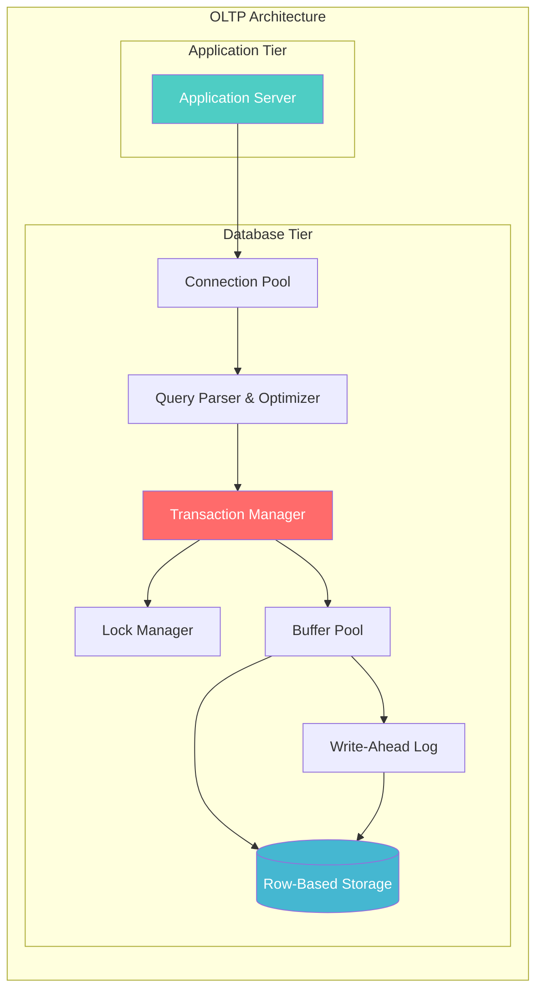
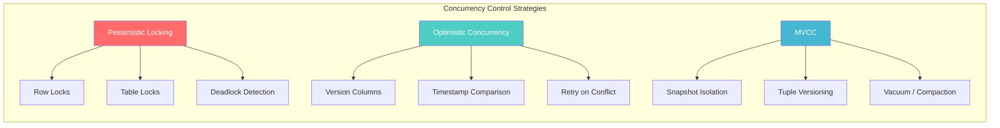
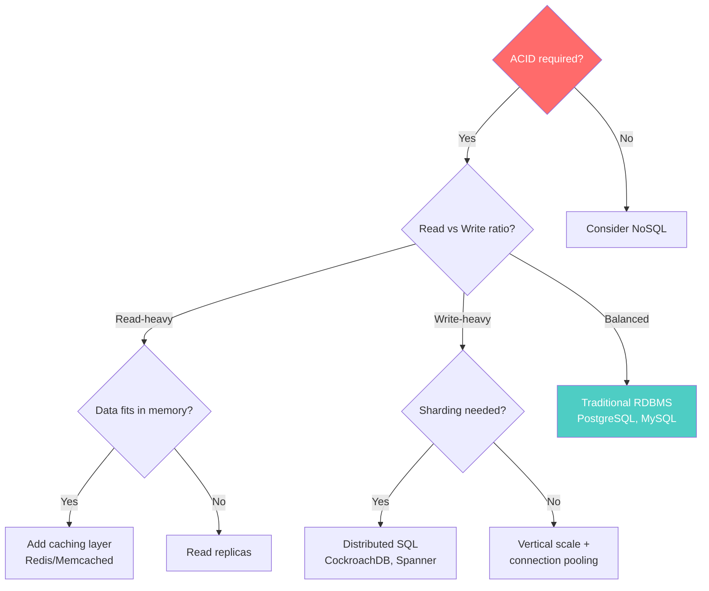

# OLTP Architecture

> **Taxonomy Reference**: §4.1 Data Architecture

## Overview

OLTP (Online Transaction Processing) is an architectural pattern designed for high-throughput, low-latency transactional workloads. It powers operational systems where correctness, consistency, and concurrency are paramount — think banking transfers, e-commerce checkouts, and inventory management.

## Table of Contents

- [Core Principles](#core-principles)
- [Architecture Diagram](#architecture-diagram)
- [Storage & Indexing](#storage-indexing)
- [Concurrency Control](#concurrency-control)
- [Design Patterns](#design-patterns)
- [OLTP vs OLAP](#oltp-vs-olap)
- [Scaling Strategies](#scaling-strategies)
- [Decision Framework](#decision-framework)
- [Related Patterns](#related-patterns)

## Core Principles

OLTP systems are built on four foundational guarantees:

| Property | Description | Mechanism |
|----------|-------------|-----------|
| **Atomicity** | All-or-nothing transaction execution | Rollback logs, undo segments |
| **Consistency** | Transactions move DB between valid states | Constraints, triggers, FK enforcement |
| **Isolation** | Concurrent transactions don't interfere | Locking, MVCC, snapshot isolation |
| **Durability** | Committed data survives failures | Write-Ahead Logging (WAL), checkpointing |

For a deeper treatment of ACID, see [ACID Properties](../data-architecture-fundamentals/acid-properties.md).

## Architecture Diagram



## Storage & Indexing

### Row-Based Storage

OLTP databases store data in **row-oriented** format — all columns of a row are stored contiguously:

```
Row 1: [id=1 | name="Alice" | balance=500 | last_txn=... ]
Row 2: [id=2 | name="Bob"   | balance=320 | last_txn=... ]
Row 3: [id=3 | name="Carol" | balance=890 | last_txn=... ]
```

This is optimized for:
- **Point queries**: `SELECT * FROM accounts WHERE id = 123`
- **CRUD operations**: Insert/update/delete single rows
- **Transactional writes**: Entire row is written in one I/O

### Index Strategies

| Index Type | Use Case | Trade-off |
|------------|----------|-----------|
| **B-Tree** | Range queries, ordered scans | Write amplification on inserts |
| **Hash** | Equality lookups (`WHERE id = ?`) | No range support |
| **Partial** | Filtered subsets | Index maintenance overhead |
| **Covering** | Avoid table lookups | Larger index size |
| **GIN/GiST** | Full-text, JSON, geometric | Slower writes |

## Concurrency Control



### Isolation Levels

| Level | Dirty Read | Non-Repeatable | Phantom | Performance |
|-------|------------|----------------|---------|-------------|
| **Read Uncommitted** | Yes | Yes | Yes | Highest |
| **Read Committed** | No | Yes | Yes | High |
| **Repeatable Read** | No | No | Yes | Medium |
| **Serializable** | No | No | No | Lowest |

## Design Patterns

### 1. Normalized Schema

```
Accounts (id, name, balance, created_at)
Transactions (id, account_id, amount, type, timestamp)
```

Third Normal Form (3NF) minimizes data redundancy at the cost of join complexity.

### 2. Connection Pooling

```mermaid
sequenceDiagram
    participant App
    participant Pool
    participant DB

    App->>Pool: getConnection()
    Pool->>DB: (reuse idle connection)
    App->>DB: BEGIN; UPDATE...; COMMIT;
    App->>Pool: releaseConnection()
    Note over Pool: Connection returned to pool
```

### 3. Idempotency Keys

For at-most-once / exactly-once semantics in distributed OLTP:
- Client generates a unique `idempotency_key`
- Server checks key before processing
- On retry, returns cached result

## OLTP vs OLAP

| Dimension | OLTP | OLAP |
|-----------|------|------|
| **Purpose** | Run the business | Analyze the business |
| **Queries** | Simple, point lookups | Complex aggregations |
| **Write Pattern** | Many small writes | Bulk loads |
| **Data Scope** | Current, operational | Historical, aggregated |
| **Schema** | Highly normalized (3NF) | Denormalized (star/snowflake) |
| **Storage** | Row-oriented | Column-oriented |
| **Users** | Thousands of concurrent | Hundreds of analysts |
| **Latency** | Milliseconds | Seconds to minutes |
| **Throughput** | 10K–1M TPS | 100–10K queries/sec |

> **Analytical Counterpart**: See [OLAP Architecture](02-olap-architecture.md)

## Scaling Strategies

### Vertical Scaling (Scale-Up)
- Larger instance, more CPU/RAM
- Simpler to operate
- Hits hardware ceiling

### Horizontal Scaling (Scale-Out)
- **Read Replicas**: Async replication to read-only copies
- **Sharding**: Partition data by key across nodes
- **Distributed SQL**: CockroachDB, Spanner — ACID across nodes

### Caching Layer

```
[App] → [Redis/Memcached] → [OLTP Database]
          ↑ Cache-Aside Pattern
```

> **Detailed Patterns**: See [Database Caching Patterns](../database-performance/database-caching-patterns.md)

## Decision Framework



## Related Patterns

- [OLAP Architecture](02-olap-architecture.md) — Analytical complement to OLTP
- [Polyglot Persistence](03-polyglot-persistence.md) — Using multiple storage types
- [ACID Properties](../data-architecture-fundamentals/acid-properties.md) — Transaction guarantees deep-dive
- [CAP Theorem](../data-architecture-fundamentals/cap-theorem.md) — Distributed systems trade-offs

> **Azure Implementation**: See [Azure SQL Database](../../../architecture-azure/data/databases/), [Cosmos DB](../../../architecture-azure/data/databases/) for transaction-capable cloud services.
